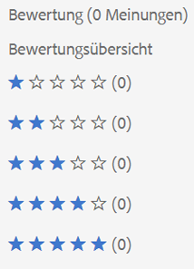
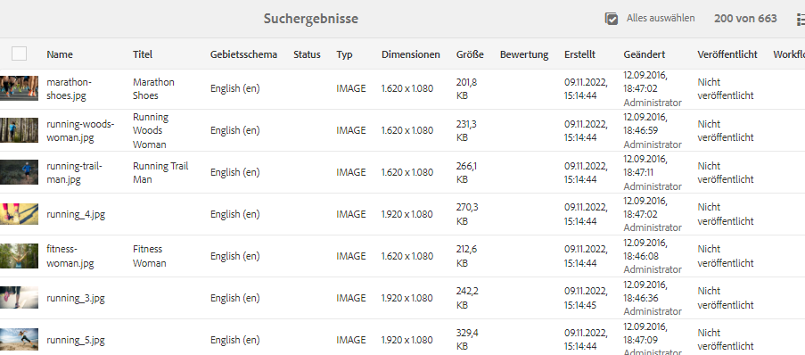
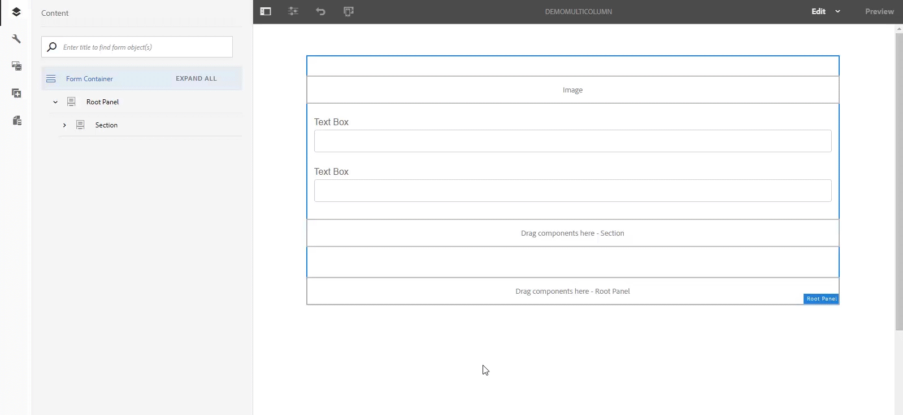

# Neue Funktionen in [!DNL Adobe Experience Manager] 6.5 Service Pack 10 {#aem-whats-new-service-pack}

<!-- TBD: Downsample this image. We do not need as big an image since customers don't use as big a screen to view. Also, having a 700+ KB decorative image is bad for page load time.
-->

[!DNL Adobe Experience Manager] 6.5 Service Packs bieten in vierteljährlichen Abständen neue Funktionen, kundenspezifische Verbesserungen sowie Verbesserungen hinsichtlich Leistung, Stabilität und Sicherheit. Die vierteljährliche Verfügbarkeit erleichtert den Zugriff auf und die Übernahme neuer Funktionen und Innovationen.

In diesem Artikel werden die Funktionen des neuesten Service Packs, die [Schlüsselfunktionen der vorherigen 6.5 Service Packs](#key-features-previous-service-packs) und die [Schlüsselversionen seit der letzten Version des Service Packs](#key-releases-since-last-sp) beschrieben.

## [!DNL Adobe Experience Manager Sites] {#aem-sites}

* **Erweiterte  [!DNL Content Fragment] Modelle und Editor**: Sie können jetzt komplexe und benutzerdefinierte Modelle für strukturierte Inhalte mit verschachtelten  [!DNL Content Fragment] Modellen erstellen. Inhaltsstrukturen werden in grundlegende Elemente modularisiert, die als Unterfragmente modelliert werden. Fragmente mit einer höheren Ebene verweisen auf diese Unterfragmente. Weitere Verbesserungen des Datentyps, wie erweiterte Validierungsregeln, verbessern die Flexibilität der Inhaltsmodellierung mit [!DNL Content Fragments]. Der Editor [!DNL Experience Manager] [!DNL Content Fragment] unterstützt verschachtelte Fragmentstrukturen in einer gängigen Editorsitzung mit Verbesserungen wie Strukturbaumansicht und Registerkarten-Breadcrumb-Navigation durch Fragmenthierarchien.

* **GraphQL-API für[!DNL Content Fragments]**: Die neue GraphQL-API ist die Standardmethode zur Bereitstellung strukturierter Inhalte im JSON-Format. Mit GraphQL-Abfragen können Kunden nur die relevanten Inhaltselemente anfordern, um ein Erlebnis zu rendern. Durch eine solche Auswahl wird die Überbereitstellung von Inhalten (Möglichkeit mit HTTP-REST-APIs) eliminiert, die das Parsen von Inhalten auf Client-Seite erfordert. GraphQL-Schemas werden von [!DNL Content Fragment]-Modellen abgeleitet und API-Antworten werden im JSON-Format erstellt. In [!DNL Experience Manager] als [!DNL Cloud Service] bleiben [GraphQL-Abfragen bestehen](https://experienceleague.adobe.com/docs/experience-manager-cloud-service/assets/admin/graphql-api-content-fragments.html#persisted-queries-caching) und verarbeiten Cache-freundliche GET Anforderungen. In [!DNL Experience Manager] 6.5 ist dies noch nicht möglich.

* **Hierarchieverwaltung und zukünftige Vorschau**: Benutzer haben jetzt eine Benutzeroberfläche, über die sie auf die Inhaltsstrukturen ihrer  [!DNL Experience Manager] Launches zugreifen können, einschließlich der Möglichkeit, Seiten in einem Launch hinzuzufügen und zu entfernen. Diese Funktion verbessert die Flexibilität von [!DNL Experience Manager]-Launches beim Erstellen von Inhaltsversionen, die für die zukünftige Veröffentlichung vorgesehen sind. [Zeitwarp-](/help/sites-authoring/working-with-page-versions.md#timewarp) Funktionen ermöglichen Benutzern, Launches als künftigen Inhaltsstatus in der Vorschau anzuzeigen.

* [!DNL Experience Manager] zeigt direkt eine Liste aller Inhaltsmodelle unter einem Ordner an, ohne dass Inhaltsautoren durch die Dateistruktur navigieren müssen. Die Funktion erfordert jetzt weniger Klicks und verbessert die Authoring-Effizienz.

* Das Pfadfeld im Editor [!DNL Sites] ermöglicht es Autoren, Assets aus [!DNL Content Finder] zu ziehen.

* Platform bietet einige Verbesserungen hinsichtlich der Barrierefreiheit. Siehe [Plattformaktualisierungen](/help/release-notes/sp-release-notes.md#platform-65100).

## [!DNL Adobe Experience Manager Assets] {#aem-assets}

* [!DNL Experience Manager] erweitert die Funktionalität &quot;Connected Assets&quot;auf die Verwendung von  [!DNL Dynamic Media] Bildern in den entsprechenden Kernkomponenten. Siehe [Verwenden von Connected Assets](/help/assets/use-assets-across-connected-assets-instances.md).

* Beim Freigeben einzelner Assets und Sammlungen als Link (über das Dialogfeld [!UICONTROL Linkfreigabe]) können Benutzer auswählen, ob der Empfänger Original-Assets oder deren Ausgabeformate oder beides herunterladen darf. Siehe [Freigeben von Assets über Link](/help/assets/link-sharing.md).

   

* Wenn Benutzer Assets herunterladen, die für sie als Link freigegeben wurden, können sie die Original-Assets, die Ausgabeformate oder beide herunterladen.

* **Beschränken der erzeugten** Unter-Assets: Administratoren können die Anzahl der Teil-Assets einschränken, die für ebenenübergreifende Assets wie PDF-, PowerPoint-, InDesign- und Keynote-Dateien  [!DNL Experience Manager] generiert werden.

   

* Es ist ein neues [!DNL Camera Raw]-Paket verfügbar, das [!DNL Adobe Camera Raw] v10.4 unterstützt. Siehe [Bilder mit  [!DNL Camera Raw]](/help/assets/camera-raw.md) verarbeiten.

### [!DNL Dynamic Media] {#assets-dynamic-media}

* Viele Verbesserungen der Barrierefreiheit werden im [!DNL Dynamic Media]-Client vorgenommen, sodass eine Bildschirmlesehilfe eine angemessenere und nützlichere Beschreibung der Aktion oder Benutzeroberfläche darstellen kann. Siehe [[!DNL Dynamic Media] updates](/help/release-notes/sp-release-notes.md#dynamic-media-65100).

## [!DNL Adobe Experience Manager Forms] {#aem-forms}

>[!NOTE]
>
>Das Add-On-Paket von [!DNL Experience Manager Forms] wird eine Woche nach der geplanten [!DNL Experience Manager] Service Pack-Version verfügbar gemacht.

* Sie können jetzt den Automated forms conversion-Dienst verwenden, um [PDF forms in französischer, deutscher, spanischer, italienischer und portugiesischer Sprache](https://experienceleague.adobe.com/docs/aem-forms-automated-conversion-service/using/extending-the-default-meta-model.html?lang=en#language-specific-meta-model) in adaptive Formulare zu konvertieren.

* **Fehlermeldungen im Eigenschaften-Browser**: Es wurden Fehlermeldungen für jede Eigenschaft im Eigenschaften-Browser für adaptive Formulare hinzugefügt. Diese Meldungen helfen beim Verständnis der zulässigen Werte für ein Feld.

* **Unterstützung für die Verwendung der Literaloption zum Festlegen des Werts für eine JSON-Typvariable**: Sie können die Literaloption verwenden, um Werte für eine JSON-Typvariable im Schritt &quot;set variable&quot;eines AEM-Workflows festzulegen. Mit der Option „Literal“ können Sie eine JSON in Form einer Zeichenfolge angeben.

* [Plattformaktualisierungen](../forms/using/aem-forms-jee-supported-platforms.md):  [!DNL Adobe Experience Manager Forms] on JEE unterstützt nun die folgenden Plattformen:
   * [!DNL Adobe Acrobat 2020]
   * [!DNL Ubuntu 20.04]
   * [!DNL Open Office 4.1.10]
   * [!DNL Microsoft Office 2019]
   * [!DNL Microsoft Windows Server 2019]
   * [!DNL RHEL8]

* Unterstützung für `GuideBridge#getGuidePath` API in [!DNL AEM Forms] hinzugefügt.

## Wichtige Funktionen in vorherigen [!DNL Experience Manager] 6.5 Service Packs {#key-features-previous-service-packs}

### Möglichkeit, gelöschte Seiten und Baume wiederherzustellen (6.5.9.0) {#ability-to-restore-pages-tree}

Sie können jetzt die gelöschten Seiten und die gesamte Baumansicht auf einer [!DNL Experience Manager Sites] -Seite wiederherstellen.

### [!DNL Experience Manager Sites] {#aem-sites-previous-service-packs}

#### Sortieren Sie die für das Rollout verfügbaren Live Copy-Seiten (6.5.8.0). {#sort-livecopy-pages}

Sie können die für den Rollout verfügbaren Live Copy-Seiten nun mithilfe der Eigenschaften [!UICONTROL Name], [!UICONTROL Letztes Änderungsdatum] und [!UICONTROL Letztes Rollout-Datum] sortieren. Das [!UICONTROL letzte Rollout-Datum] für eine Seite ist eine neue Eigenschaft, die in dieser Version eingeführt wurde.

#### Verfügbarkeit von Seitenverschiebungen und MSM-Rollouts als asynchrone Vorgänge (6.5.7.0) {#page-moves-msm-asynchronous}

Sie können jetzt die Seitenverschiebungen und MSM-Rollouts als asynchrone Vorgänge durchführen, um ihre Auswirkungen auf die Laufzeitleistung zu reduzieren. Sie können die Vorgänge für die sofortige oder spätere Ausführung planen. Der Status der zugehörigen Vorgänge und Prozessschritte wird in einer Konsole angezeigt, was für die Überwachung von MSM-Rollouts in großem Maßstab hilfreich ist.

#### Verfügbarkeit des Vorgangs &quot;Seitenverschiebung&quot;im asynchronen Modus (6.5.6.0) {#page-move-asynchronous}

Der Vorgang &quot;Seitenverschiebung&quot;ist jetzt im asynchronen Modus verfügbar. Zusätzlich zur sofortigen Ausführung können Sie auch den Vorgang &quot;Seitenverschiebung&quot;für die spätere Ausführung planen.

#### Verbesserungen bei der Barrierefreiheit (6.5.5.0) {#accessibility-sites}

* Verbesserte Fehlerberichterstellung durch Hinzufügen von Textinformationen.

* Der Fokus der Benutzeroberfläche während der Tastaturnavigation wurde verbessert.

* Verbessertes Kontrastverhältnis für verschiedene Elemente der Benutzeroberfläche.

* Verbesserte Konsistenz der alternativen Attribute für Seitenbilder.

* Verbesserte Konsistenz der ARIA-Beschriftungen (Accessible Rich Internet Applications).

* Verbesserte Funktionen für Nicht-Visual Desktop Access (NVDA).

* Verbesserte Unterstützung für Bildschirmlesehilfen.

#### Weitere wichtige Verbesserungen (6.5.5.0) {#other-enhancements-sites}

* Der anonyme Zugriff auf die CRXDE Lite ist zur Erhöhung der Sicherheit nicht zulässig. Stattdessen werden die Benutzer zum Anmeldebildschirm weitergeleitet. Siehe [Entwickeln mit CRXDE Lite](/help/sites-developing/developing-with-crxde-lite.md).

* Beim Kopieren oder Einfügen eines Seitenbaums haben Sie jetzt die Möglichkeit, entweder die Stammseite einzufügen oder die Stammseite mit den Unterseiten des Baums einzufügen.

* [!DNL Adobe Experience Manager Experience Fragments] in  [!DNL Adobe Target] Arbeitsbereiche exportiert werden, werden nun in als eindeutige Angebotstypen und Angebotsquellen angezeigt  [!DNL Target].

* Multi-Site-Manager - Der Trigger Veröffentlichen löscht jetzt eine Komponente aus der veröffentlichten Seite, wenn eine Komponente aus der Quellseite gelöscht wird.

* Multi-Site-Manager: Wenn der Name einer lokalen Komponente in einem [!UICONTROL Live Copy] mit dem Namen einer Komponente im Blueprint identisch ist und die Komponente aus dem Blueprint ausgerollt wird, wird der Begriff `_msm_moved` jetzt zum Namen der lokalen Komponente hinzugefügt.

#### Stilsystemverbesserungen (6.5.4.0) {#style-system-enhancements}

Sie können jetzt Stile im Komponentendialogfeld mithilfe des erweiterten Stilsystems auswählen.

#### Leistungsverbesserungen in verschiedenen Bereichen (6.5.4.0) {#performance-improvements}

* Die Zeit zum Laden und Initialisieren von ContextHub innerhalb einer Site wurde reduziert (`contexthub.kernel.js`). Dies führt zu schnelleren Seitenladevorgängen während eines Site-Besuchs.

* Die Zeit zum Aktualisieren einer Seite nach dem Ziehen von [!DNL Experience Fragments] in den [!DNL Sites] Seiten-Editor wurde verkürzt.

* Die Ladezeit für Einträge auf einer [!DNL Sites]-Seite mit mehr als 200 Live Copies in **[!UICONTROL Live Copy-Übersicht]** wurde verkürzt.

* Verbesserte Handhabung von unvollständigen oder ungültigen URLs. Solche URLs können den Vorlagen-Editor verlangsamen.

### [!DNL Adobe Experience Manager Assets] {#aem-assets-previous-service-packs}

* Die Benennung chinesischer Gebietsschemata und Regionen in Bezug auf Hongkong, Macau und Taiwan wurde aktualisiert, um sie mit den sozialen und politischen Ansichten Chinas in Einklang zu bringen (6.5.9.0).

* Eine optionale Konfiguration wird eingeführt, um die Groß-/Kleinschreibung in den E-Mail-IDs in der Antwort der AKP-API von [!DNL Adobe Experience Manager] (6.5.9.0) zu ändern.

   ![Konfiguration zum Ändern der E-Mail-IDs in Kleinbuchstaben in der AKP-Antwort von  [!DNL Experience Manager]](assets/email-lowcase-config.png)

* Der Kontrast von Text und Symbolen gegenüber dem Hintergrund wird für verschiedene Funktionen verbessert. Durch diese Implementierung der Richtlinien für die Barrierefreiheit von Web Content Accessibility Guidelines (WCAG) wird [!DNL Assets] für Benutzer mit eingeschränktem Sehvermögen und eingeschränkter Farbwahrnehmung leichter zugänglich. Siehe [Verbesserungen der Barrierefreiheit in [!DNL Assets]](sp-release-notes.md#assets-accessibility-6590) (6.5.9.0).
* Bei Verwendung der Funktion [Connected Assets](/help/assets/use-assets-across-connected-assets-instances.md) können Sie jetzt eine Liste aller [!DNL Sites]-Seiten anzeigen, die das Asset verwenden. Diese Verweise auf ein Asset sind auf der Seite [!UICONTROL Eigenschaften] eines Assets verfügbar. Dadurch erhalten Administratoren, Marketing-Experten und Bibliothekare einen vollständigen Überblick über die Asset-Nutzung, was eine bessere Nachverfolgung, Verwaltung und Markenkonsistenz ermöglicht (6.5.8.0).

* Beim Löschen eines Assets, auf das auf einer Webseite verwiesen wird, zeigt [!DNL Experience Manager] eine Warnung an. Sie können das Löschen eines referenzierten Assets erzwingen oder die Verweise überprüfen und ändern, die auf der Seite [!DNL Properties] des Assets angezeigt werden. Durch Klicken auf die Verweise werden die lokalen und Remote-Seiten [!DNL Sites] (6.5.8.0) geöffnet.

* [!DNL Assets] und  [!DNL Dynamic Media] bieten mehrere Verbesserungen der Barrierefreiheit. Die Verbesserungen betreffen die Tastaturnavigation, die Verwendung von Bildschirmlesehilfen und ähnliche Verbesserungen, um die Verwendung von Hilfstechnologien (AT) zu ermöglichen. Siehe [[!DNL Assets] Verbesserungen](/help/release-notes/sp-release-notes.md#assets-6570) und [[!DNL Dynamic Media] Verbesserungen](/help/release-notes/sp-release-notes.md#dynamic-media-6570) (6.5.7.0)

* Benutzer können digitale Assets in der Karten- und Spaltenansicht (6.5.7.0) sortieren.

#### Verbesserungen bei der Barrierefreiheit (6.5.6.0) {#accessibility-assets-6560}

* **Verbesserter Fokus der Benutzeroberfläche während der Tastaturnavigation**, z. B. auf:

   * `x` im  [!UICONTROL Dialogfeld ] &quot;Versionsvorschau&quot;eines Assets in der  [!UICONTROL Zeitleiste].

   * Umsetzbare Benutzeroberflächenoptionen.

   * E-Mail-Feld im Dialogfeld [!UICONTROL Link freigeben] und Feld zum Hinzufügen einer geschlossenen Benutzergruppe in der Registerkarte [!UICONTROL Berechtigung] des Ordners [!UICONTROL Eigenschaften].

* **Verbesserte Funktionalität mithilfe von Tastaturbefehlen**

   Benutzer können Tastaturbefehle verwenden, um Steuerelemente im Editor für Metadatenschema-Formulare im Durchsuchmodus der Bildschirmlesehilfe zu ziehen.

* **Verbesserte Benutzerfreundlichkeit für Bildschirmlesehilfen-Benutzer** aufgrund von:

   * Bildschirmlesehilfen geben den Zweck von Video- und Audio-Playern an.

   * Bildschirmlesehilfen geben den Zweck der Benutzeroberflächenoptionen an, die ausgewählten Tags mithilfe des Dialogfelds [!UICONTROL Tags-Auswahl] in Asset [!UICONTROL Eigenschaften] zu entfernen.

   * Bildschirmlesehilfen geben die Zeilenüberschriften und Zeilenelemente von Tabellen an, sodass Benutzer wissen, welche Einträge zu derselben Zeile gehören.

   * Beschreibende und aussagekräftige Seitentitel der Suchseite.

   * Bildschirmlesehilfen geben die Optionen im Suchfilterbereich als erweiterbare Akkordeons an.

#### Weitere Verbesserungen in [!DNL Assets] (6.5.6.0) {#other-enhancements-assets-6560}

* Benutzergruppen, die mit Ordnern (privat und nicht privat) verknüpft sind, werden jetzt beim Löschen dieser Ordner [aus dem Repository entfernt. ](/help/assets/private-folder.md#delete-private-folder) Die vorhandenen redundanten, verwaisten, nicht verwendeten und automatisch generierten Benutzergruppen können jedoch mit JMX aus dem Repository entfernt werden.

#### Verbesserungen der Barrierefreiheit in [!DNL Assets] (6.5.5.0) {#assets-accessibility}

[!DNL Experience Manager Assets] ist jetzt in Übereinstimmung mit den Web Content Accessibility Guidelines (WCAG) leichter zugänglich. Die Barrierefreiheit wurde aufgrund der folgenden Verbesserungen verbessert:

* Viele Elemente, Steuerelemente, Seiten und Dialogfelder der Benutzeroberfläche sind für die Sprachausgabe benutzerfreundlich.

* Auf viele Elemente, Steuerelemente und Eingabefelder der Benutzeroberfläche kann über die Tastatur zugegriffen werden.

* Farbe und Kontrast einiger Elemente der Benutzeroberfläche werden aktualisiert, sodass Benutzer mit eingeschränkter Sehkraft oder Benutzer ohne Farbwahrnehmung diese Elemente der Benutzeroberfläche unterscheiden können. Beispielsweise wird die Farbe der Symbole für die Bewertung von Sternen (z. B. im Abschnitt [!UICONTROL Bewertung] der Registerkarte [!UICONTROL Erweitert] im Asset [!UICONTROL Eigenschaften] oder in der Kartenansicht) für einen angemessenen Kontrast geändert.

   

#### Erweiterte Ausnahmebehandlung (6.5.5.0) {#exception-handling}

[!DNL Assets] Der Ablauf der Benutzeroberfläche bietet eine bessere Ausnahmebehandlung. Wenn ein Asset keinen Typ für seine Dimension aufweist, wird die beobachtete Ausnahme in den Protokolldateien aufgezeichnet.

#### Unterstützung für 3D-Assets in [!DNL Dynamic Media] (6.5.5.0) {#support-for-3d}

Die Unterstützung für 3D-Bilder in [!DNL Dynamic Media] ermöglicht es Kunden, 3D-Inhalte zu Webseiten und Anwendungen hinzuzufügen. Die Unterstützung umfasst:

* Veröffentlichen Sie allgemeine 3D-Asset-Formate und generieren Sie eine Asset-URL, die auf Webseiten und anderen Anwendungen verwendet werden kann.

* Ein 3D-Web-Viewer, der von [!DNL Adobe Dimension] unterstützt wird, um die veröffentlichten 3D-Assets interaktiv anzuzeigen.

* Veröffentlichen und zeigen Sie allgemeine 3D-Assets auf [!DNL Experience Manager Sites]-Seiten mithilfe der WCM-Komponente [!DNL Sites] an.

#### [!DNL Experience Manager Assets] mit [!DNL Brand Portal] konfigurieren (6.5.4.0) {#configure-assets-bp}

Der Autorisierungskanal zwischen [!DNL Experience Manager Assets] und [!DNL Brand Portal] wird geändert. Zuvor wurde [!DNL Brand Portal] in der klassischen Benutzeroberfläche über das alte OAuth-Gateway konfiguriert, das mithilfe des JWT-Token-Austauschs ein IMS-Zugriffstoken zur Autorisierung abruft. [!DNL Experience Manager Assets] ist jetzt mit  [!DNL Brand Portal] über konfiguriert,  [!DNL Adobe I/O]das ein IMS-Token zur Autorisierung Ihres  [!DNL Brand Portal] Mandanten abruft.

Die Schritte zum Konfigurieren von [!DNL Experience Manager Assets] mit [!DNL Brand Portal] unterscheiden sich je nach Ihrer [!DNL Experience Manager]-Version und davon, ob Sie zum ersten Mal eine Konfiguration durchführen oder die vorhandenen Konfigurationen aktualisieren. Weitere Informationen finden Sie unter [Konfigurieren von Experience Manager Assets mit Brand Portal](https://experienceleague.adobe.com/docs/experience-manager-brand-portal/using/publish/configure-aem-assets-with-brand-portal.html) .

#### Verbesserungen bei der Barrierefreiheit (6.5.4.0) {#accessibility-enhancements-6540}

[!DNL Experience Manager Assets] umfasst die folgenden Verbesserungen der Barrierefreiheit:

* Mit den Pfeiltasten auf der Tastatur können Sie Bereiche in gezoomten Bildern verschieben und schwenken. Weitere Informationen finden Sie unter [Asset-Vorschau nur mit Tastaturtasten anzeigen](../assets/manage-assets.md#previewing-assets).

* Die Kontrollkästchen mit gemischtem Status (in denen die Kontrollkästchen der ersten Ebene nicht ausgewählt und durchgestrichen werden, es sei denn, Sie wählen alle verschachtelten Kontrollkästchen aus, können von Sprachausgaben gelesen werden.

* Datums- und Uhrzeitformatbeschränkungen werden in den Feldbeschriftungen von Datumsfeldern bereitgestellt, damit Benutzer das Datum über die Tastatur im richtigen Format eingeben können.
Beispiel: `On Time (MM-DD-YYYY HH:mm)`. Hier ist MM Monat im zweistelligen Format, JJJJ ist Jahr, TT ist Tag im zweistelligen Format, HH ist Stunde im 24-Stunden-Militärformat und mm ist Minute.

* Bildschirmlesehilfen geben die Option zum Entfernen ausgewählter Tags (`X`-Symbol) und die Anzahl der ausgewählten Tags an.

#### Sortierbare Spalte für Erstellungsdatum von Assets in der Listenansicht (6.5.3.0) {#sortable-date-created-column}

Eine neue sortierbare Spalte für das Erstellungsdatum von Assets wird in der DAM-Listenansicht und in der Listenansicht in den Asset-Suchergebnissen hinzugefügt.

#### Visuelle Suche nach [!DNL Adobe Experience Manager Assets] (6.5.2.0) {#visual-search}

[!DNL Assets] -Benutzer können visuell ähnliche Bilder suchen. Experience Manager zeigt die mit Smart-Tags versehenen Bilder aus dem DAM-Repository an, die einem vom Benutzer ausgewählten Bild ähnlich sind. Siehe [Visuelle Suche](../assets/search-assets.md).

### Dynamic Media {#dynamic-media-previous-service-packs}

* [[!DNL Dynamic Media] ist leichter ](sp-release-notes.md#assets-accessibility-6590) zugänglich durch:

   * Benutzerfreundlichkeit mit Tastaturbefehlen.
   * Kontrast (mit Hintergrund) von Text, Platzhaltertext und Steuerelementen in verschiedenen Editoren.
   * Barrierefreiheit und Erzählung durch Bildschirmlesehilfen.

* Bieten Sie auf Geräten mit hoher Auflösung und eingeschränkter Netzwerkbandbreite optimale Bilder mit intelligenter Bildbearbeitung (Device Pixel Ratio) und optimierter Netzwerkbandbreite. Siehe [Häufig gestellte Fragen zur intelligenten Bildbearbeitung](/help/assets/imaging-faq.md) (6.5.9.0).

* [!DNL Dynamic Media] delivery (`fmt` URL-Modifikator) unterstützt jetzt das Bildformat AVIF der nächsten Generation (AV1-Bildformat). Weitere Informationen und die Timeline finden Sie unter [Image Serving and Rendering API fmt](https://experienceleague.adobe.com/docs/dynamic-media-developer-resources/image-serving-api/image-serving-api/http-protocol-reference/command-reference/r-is-http-fmt.html) (6.5.9.0).

#### Ungültiges CDN-zwischengespeicherter Inhalt (6.5.6.0) {#invalidate-cdn-cached-content}

Sie können jetzt die [!DNL Dynamic Media]-Benutzeroberfläche verwenden, um zwischengespeicherten Inhalt des Content Delivery Network (CDN) ungültig zu machen. Daher sind die aktualisierten Assets sofort verfügbar, anstatt darauf zu warten, dass der Cache abläuft. Sie können CDN wie folgt ungültig machen:

* Erstellen einer Vorlage für CDN-Invalidierung: Auswählen von Assets und formularverknüpften vorlagenbasierten URLs

* Auswählen von Assets und zugehörigen Vorgaben über die Asset-Auswahl

* Hinzufügen vollständiger Asset-URLs

#### Selektive Veröffentlichung von Assets in [!DNL Experience Manager] und [!DNL Dynamic Media] (6.5.6.0) {#selective-publishing}

Sie können jetzt mithilfe des Assistenten [!UICONTROL Quick Publish] oder [!UICONTROL Veröffentlichung verwalten] Assets selektiv in [!DNL Experience Manager] oder [!DNL Dynamic Media] veröffentlichen oder deren Veröffentlichung rückgängig machen. Sie können auch den Modus `Publish` oder `Unpublish` auf Ordnerebene festlegen.

#### Intelligente Bildbearbeitung für Dynamic Media {#smart-imaging}

Intelligente Bildbearbeitung nutzt die individuellen anzeigebezogenen Eigenschaften der einzelnen Benutzer, um automatisch die richtigen Bilder bereitzustellen, die für ihr Erlebnis optimiert sind, was zu einer besseren Leistung und Interaktion führt. Die intelligente Bildbearbeitung arbeitet mit bestehenden Bildvorgaben und reduziert im letzten Moment abhängig vom Browser oder der Geschwindigkeit der Netzverbindung die Größe der Bilddatei intelligent noch weiter. Informationen hierzu finden Sie unter [Smart Imaging](../assets/imaging-faq.md).

#### Smartes Zuschneiden in Videoprofilen für Dynamic Media (6.5.3.0) {#smart-crop-video}

Smartes Zuschneiden für Videos - eine optionale Funktion, die in Videoprofilen verfügbar ist - verwendet Adobe Sensei, um den Fokus in adaptiven Videos oder progressiven Videos unabhängig von der Größe automatisch zu erkennen und zuzuschneiden. Siehe [Informationen zur Verwendung von smartem Zuschneiden in Videoprofilen](../assets/video-profiles.md).

### Experience Manager Forms {#aem-forms-previous-service-packs}

#### Unterstützung für [!DNL Azul Zulu OpenJDK] (6.5.9.0) {#support-azul-zulu}

Sie können jetzt Anwendungen mit [!DNL Azul Zulu]-Builds von [!DNL OpenJDK] für [!DNL Experience Manager Forms] in OSGi-Bereitstellungen entwickeln und betreiben. Weitere Informationen finden Sie unter [Experience Manager 6.5 Service Pack 9 - Versionshinweise](sp-release-notes.md) und [Technische Anforderungen](../sites-deploying/technical-requirements.md).

#### Möglichkeit zum Senden einer Benachrichtigungs-E-Mail an eine Gruppe mithilfe von [!UICONTROL Aufgabe zuweisen] (6.5.9.0) {#group-notification-email}

Sie können jetzt mit dem Workflow-Schritt Aufgabe zuweisen eine Benachrichtigungs-E-Mail an eine Gruppen-E-Mail-Adresse senden.

#### Möglichkeit, einen Entwurf für interaktive Kommunikation abzurufen, nachdem die Quelle für interaktive Kommunikation geändert wurde (6.5.9.0) {#retrieve-draft-after-source-modifications}

Sie können jetzt eine interaktive Kommunikation abrufen, die als Entwurf gespeichert wurde, nachdem Sie die Quelle der interaktiven Kommunikation geändert haben.

#### Festlegen des benutzerdefinierten Domänennamens für das Laden, Rendern und Überprüfen des reCAPTCHA-Dienstes (6.5.9.0) {#set-custom-domain-name-recaptcha}

Der reCAPTCHA-Service verwendet `https://www.recaptcha.net/` als Standard-Domain. Sie können jetzt die Einstellungen ändern, um `https://www.google.com/` oder einen beliebigen benutzerdefinierten Domänennamen zum Laden, Rendern und Überprüfen des reCAPTCHA-Dienstes festzulegen.

#### Verbesserungen der Eingabedaten für den Workflow-Schritt [!UICONTROL Formulardatenmodelldienst aufrufen] (6.5.9.0) {#input-data-enhancements-fdm}

Wenn Sie ein Formulardatenmodell und einen Dienst im Workflow-Schritt [!UICONTROL Formulardatenmodelldienst aufrufen] auswählen, geben Sie Dienstargumente für Eingabedaten an.

Wenn Sie die Option [!UICONTROL Relativ zur Payload] auswählen, um eine Datei als Dienstargument anzuhängen, können Sie jetzt den Ordnerpfad angeben, der die Datei anstelle des tatsächlichen Dateinamens enthält. Durch die Definition des Ordnernamens anstelle des Dateinamens für den Dateianhang können Sie Workflow-Modelle wiederverwenden. Sie beschränken das Workflow-Modell nicht auf einen Dateinamen für Anhänge.

#### Möglichkeit zur Verwendung mehrerer Übergeordneter Seiten in einer Datensatzdokumentvorlage (6.5.9.0) {#use-multiple-master-pages-dor-template}

Sie können jetzt mehrere Übergeordnete Seiten in einer Datensatzdokumentvorlage verwenden. Daher können Sie jetzt unterschiedliche Kopf-, Fußzeilen, Schriftarten, Logoinformationen auf der Titelseite und andere Seiten der Vorlage haben.

#### Unterstützen von Seitenumbrüchen im Datensatzdokument (6.5.9.0) {#support-page-breaks-dor}

Sie können einem Datensatzdokument jetzt Seitenumbrüche hinzufügen. Wenn ein Bedienfeld innerhalb von Seiten umgebrochen wird, können Sie daher einen Seitenumbruch hinzufügen, um den Bereich auf eine neue Seite in einem Datensatzdokument zu verschieben.

#### CAPTCHA-Komponente in einem adaptiven Formular basierend auf Regeln ein- oder ausblenden (6.5.8.0) {#show-hide-captcha}

Sie können CAPTCHA jetzt entweder bei der Übermittlung des adaptiven Formulars oder bei der Benutzeraktion überprüfen. Sie können auch Bedingungen hinzufügen, um CAPTCHA bei einer Benutzeraktion zu validieren und die CAPTCHA-Komponente in einem adaptiven Formular basierend auf Regeln ein- oder auszublenden.

#### Hinzufügen benutzerdefinierter CAPTCHA-Dienste (6.5.8.0) {#add-custom-captcha-services}

[!DNL Experience Manager Forms] bietet vorkonfigurierte Unterstützung für die Verwendung von Google reCAPTCHA (eine separate Lizenz für Google reCAPTCHA-APIs ist erforderlich) als CAPTCHA-Validierungsdienst. Sie können auch einen benutzerdefinierten CAPTCHA-Dienst verwenden, um CAPTCHAs zu validieren.

#### Weitere Verbesserungen (6.5.8.0) {#other-enhancements-forms-6580}

* Die Barrierefreiheit der Komponente [!DNL Experience Manager Forms] Datumsauswahl wurde verbessert.

* Unterstützung zum Generieren einer interaktiven Kommunikation im PCL-Format mithilfe der PrintChannel-API hinzugefügt.

* Beim Ausführen einer PDFG-Konvertierung können Sie jetzt die [!DNL Experience Manager Forms]-Registrierungsänderungen für die Erstellung benutzerdefinierter Lesezeichen aktivieren oder deaktivieren.

#### Leistungsverbesserungen (6.5.7.0) {#performance-improvements-forms}

[!DNL Experience Manager] 6.5 Service Pack 7 Forms verbessert die Leistung für:

* Validieren der Feldwerte auf dem Server beim Senden eines adaptiven Formulars.

* Konvertieren eines PDF-Formulars in ein adaptives Formular mithilfe von [!DNL Automated Forms Conversion service].

#### Unterstützung für Microsoft SQL Server 2016 &quot;Always on available groups&quot;für hohe Verfügbarkeit (6.5.7.0) {#always-on-availability-groups}

[!DNL Experience Manager Forms] unterstützt jetzt  [!DNL Microsoft] SQL Server 2016-Gruppen &quot;Always On available&quot;für hohe Verfügbarkeit für OSGi-Bereitstellungen.

#### HTTP-Client-Konfiguration des Formulardatenmodells zur Leistungsoptimierung (6.5.7.0) {#fdm-http-client-config}

[!DNL Experience Manager Forms] Formulardatenmodell bei der Integration mit RESTful-Webdiensten, da die Datenquelle jetzt HTTP-Client-Konfigurationen zur Leistungsoptimierung enthält. Siehe [Konfigurieren von Datenquellen](../../help/forms/using/configure-data-sources.md#fdm-http-client-configuration).

#### Verfügbarkeit der Option &quot;Zurücksetzen&quot;für jede Komponente im Layout-Modus (6.5.7.0) {#reset-option-layout-mode}

Sie können jetzt die Zurücksetzungsoption für jede Komponente im Layout -Modus eines adaptiven Formulars verwenden. Wenn Sie ein mehrspaltiges Layout für ein Bedienfeld definieren, können Sie diese Funktion verwenden, um einzelne Komponenten innerhalb des Bedienfelds zurückzusetzen. Siehe [Verwenden Sie den Layout-Modus, um die Größe von Komponenten](../../help/forms/using/resize-using-layout-mode.md#resize-components) zu ändern.

#### Vorausfüllen eines adaptiven Formulars auf dem Client (6.5.6.0) {#prefill-merge-data-at-client}

Wenn Sie ein adaptives Formular im Voraus ausfüllen, führt der Server [!DNL Experience Manager Forms] Daten mit einem adaptiven Formular zusammen und stellt das ausgefüllte Formular für Sie bereit. Standardmäßig erfolgt die Datenzusammenführung auf dem Server.
Sie können den Server [!DNL Experience Manager Forms] jetzt auf [konfigurieren und die Datenzusammenführungsaktion auf dem Client](../../help/forms/using/prepopulate-adaptive-form-fields.md) anstelle des Servers durchführen. Dadurch wird die zum Vorausfüllen und Rendern adaptiver Formulare erforderliche Zeit erheblich verringert.

#### Formulardatenmodellintegration mit RESTful-APIs auf einem Server mit bidirektionaler SSL-Implementierung (6.5.6.0) {#fdm-integration-rest-apis-two-way-ssl}

[!DNL Experience Manager Forms] Das Formulardatenmodell kann jetzt mit RESTful-APIs auf einem Server  [integriert werden, auf dem eine bidirektionale SSL-Implementierung implementiert ist](../../help/forms/using/configure-data-sources.md).

#### Unterstützung für [!DNL Adobe Sign] Text-Tags in Automated forms conversion Service (6.5.6.0) hinzugefügt {#sign-integration-acroform-afcs}

Wenn ein AcroForm [!DNL Adobe Sign] Text-Tags enthält, werden diese Felder jetzt erkannt und als [!DNL Adobe Sign] Felder im adaptiven Formular dargestellt, die mit [!DNL Automated Forms Conversion service] konvertiert wurden. Ein Unterzeichner kann diese Felder beim Unterschreiben des adaptiven Formulars ausfüllen.

#### Unterstützung für die Konvertierung farbiger PDF forms in adaptive Formulare (6.5.6.0) {#colored-PDF-forms}

Sie können [!DNL Automated Forms Conversion service] verwenden, um farbige PDF forms in adaptive Formulare zu konvertieren.

#### Unterstützung für SMB 2- und SMB 3-Protokolle (6.5.6.0) {#smb-support}

[!DNL Experience Manager Forms] unterstützt jetzt die Protokolle SMB 2 und SMB 3.

#### Verbesserte Zwischenspeicherung für übersetzte adaptive Formularseiten (6.5.6.0) {#enhanced-caching-translated-adaptive-forms}

Sie können [Gebietsschema jetzt als Selektor in der URL des adaptiven Formulars anstelle eines Arguments in der URL des adaptiven Formulars](../../help/forms/using/supporting-new-language-localization.md) angeben. Dies hilft beim Zwischenspeichern übersetzter adaptiver Formulare unter [!DNL Experience Manager Dispatcher]. In früheren Versionen war das Zwischenspeichern übersetzter adaptiver Formulare nicht möglich. Ausführliche Informationen zum Konfigurieren der Zwischenspeicherung für die Verwendung von Gebietsschema als Selektor in der URL des adaptiven Formulars finden Sie unter [Cache für adaptive Formulare beim Dispatcher](../../help/forms/using/configure-adaptive-forms-cache.md) konfigurieren.

#### Speichern der Ausgabe des Formulardatenmodelldienstes in einer Variablen (6.5.6.0) {#save-fdm-service-to-variable}

Mit dem Formulardatenmodell können Sie die Ausgabe eines Formulardatenmodelldienstes in einer Variablen speichern. [!DNL Experience Manager Forms] ordnet nun automatisch den Typ des Formulardatenmodelldienstes dem Variablentyp zu.

#### Mehrere Dateien für die Dateianlagenkomponente anhängen (6.5.6.0) {#attach-multiple-files}

Sie können jetzt [mehrere Dateien](../../help/forms/using/introduction-forms-authoring.md) an die Komponente [!UICONTROL Dateianhang] von adaptiven Formularen anhängen.

#### Anpassen der Spalten des Adobe Experience Manager-Posteingangs (6.5.5.0) {#customize-aem-inbox-columns}

Sie können einen [!DNL Experience Manager] Posteingang anpassen, um den Standardtitel einer Spalte zu ändern, die Position einer Spalte neu anzuordnen und zusätzliche Spalten basierend auf den Daten eines Workflows anzuzeigen. Mitglieder der Gruppe `administrators` oder `workflow-administrators` können die Spalten anpassen. Weitere Informationen finden Sie unter [Admin Control](../sites-authoring/inbox.md#inbox-admin-control).

#### Speichern interaktiver Kommunikation als Entwurf (6.5.5.0) {#save-as-draft}

Sie können die Benutzeroberfläche für Agenten verwenden, um einen oder mehrere Entwürfe für jede interaktive Kommunikation zu speichern und den Entwurf später abzurufen, um mit der Bearbeitung fortzufahren. Sie können für jeden Entwurf einen anderen Namen angeben, um ihn zu identifizieren. Weitere Informationen finden Sie unter [Speichern interaktiver Kommunikation als Entwurf](../forms/using/prepare-send-interactive-communication.md#save-as-draft).

#### [!DNL Oracle WebLogic] Anwendungsserverunterstützung (6.5.5.0) {#weblogic-support}

Adobe Experience Manager Forms unterstützt nun [!DNL Oracle WebLogic 12] für Adobe Experience Manager Forms on JEE. Sie können von einer früheren Version aktualisieren oder einen neuen Experience Manager 6.5 Forms on JEE-Server auf [!DNL Oracle WebLogic] 12.2.1.4 und höher einrichten. Später entspricht den geringfügigen Versionsänderungen, wobei x in 12.2.1.x durch eine Versionsnummer ersetzt wird.

#### Verbesserungen bei der Barrierefreiheit (6.5.5.0) {#accessibility-improvements}

Adobe Experience Manager Forms umfasst die folgenden Verbesserungen der Barrierefreiheit:

* Wenn ein Benutzer eine Vorschau eines adaptiven Formulars als HTML-Formular anzeigt, behält das Feld [!UICONTROL Freihandsignatur] den Tabulatorfokus bei.

* Die beim Senden eines adaptiven Formulars angezeigten Fehlermeldungen enthalten jetzt das Attribut `aria-describedBy` . Das Attribut wird an die in der Fehlermeldung genannten Felder angehängt. Das Attribut `aria-describedby` gibt die IDs der Elemente an, die das Objekt beschreiben. Es hilft bei der Herstellung einer Beziehung zwischen Widgets oder Gruppen und Text, der sie beschrieben.

* Wenn ein adaptives Formular einige Pflichtfelder enthält, wird das obligatorische Attribut für diese Felder im ARIA-Barrierefreiheitsschema auf `True` gesetzt.

#### Authentifizierung für SOAP-basierte Webdienste mittels X-509-Zertifikat im Formulardatenmodell (6.5.5.0) {#x509-based-authentication-soap}

Das Formulardatenmodell unterstützt jetzt die zertifikatbasierte Authentifizierung mit X-509 bei Verwendung von SOAP-Webdiensten als Datenquelle. Weitere Informationen finden Sie unter [SOAP-Webdienste konfigurieren](../forms/using/configure-data-sources.md#configure-soap-web-services).

#### Weitere wichtige Verbesserungen (6.5.5.0) {#other-improvements}

* Experience Manager 6.5 Forms on JEE Document Security basiert jetzt auf [!DNL Apache Struts 2].

* Unterstützung für [!DNL Oracle Real Applications Cluster (RAC) 19c] hinzugefügt.

#### Generieren einer druckbaren Ausgabe in Experience Manager Forms-Workflows (6.5.4.0) {#generate-printable-output}

Mit dem Workflow-Schritt Generate Printable Output können Sie eine Quellvorlagendatei in eine Datendatei integrieren. Durch diese Integration können Sie verschiedene Kopien der Vorlagendatei drucken oder speichern. Der Schritt generiert eine PCL-, PostScript-, ZPL-, IPL-, TPCL- oder DPL-Ausgabe. Weitere Informationen zu dieser Funktion finden Sie unter [Forms-zentrierter Workflow unter OSGi - Schrittreferenz](../forms/using/aem-forms-workflow-step-reference.md).

#### Mehrspaltige Unterstützung für adaptive Formulare und interaktive Kommunikation im Layout-Modus (6.5.4.0) {#multi-column-adaptive-forms}

Sie können jetzt die Anzahl der Spalten für einen Bereich in adaptiven Formularen und interaktiver Kommunikation definieren. Wechseln Sie in den Layout-Modus, um die neue mehrspaltige Option zu verwenden. Weitere Informationen finden Sie unter [Verwenden des Layout-Modus, um die Größe von Komponenten anzupassen](../forms/using/resize-using-layout-mode.md).

#### Anpassung des Experience Manager-Posteingangs (6.5.4.0) {#aem-inbox}

Mit der neuen Admin Control-Option können Administratoren:

* Anpassen von Kopfzeilentext und -logo.

* Steuern Sie die Anzeige der in der Kopfzeile verfügbaren Navigationslinks.

Die Option &quot;Admin-Kontrolle&quot;ist nur für die Mitglieder der Gruppe `administrators` oder `workflow-administrators` sichtbar. Weitere Informationen zu dieser Funktion finden Sie unter [Ihr Posteingang](../sites-authoring/inbox.md).

#### Rich-Text-Unterstützung in HTML5-Formularen (6.5.4.0) {#rich-text-support}

Konvertieren Sie ein Textfeld in einem XFA-Formular in ein Rich-Text-Feld in einem HTML5-Formular. Weitere Informationen finden Sie unter [Entwerfen von Formularvorlagen für HTML5-Formulare](../forms/using/designing-form-template.md).

#### Verbesserungen bei der Barrierefreiheit (6.5.4.0) {#forms-accessibility-enhancements-6540}

Experience Manager Forms umfasst die folgenden Verbesserungen der Barrierefreiheit:

* Die Sprachausgabe-Kontrollkästchen, Links, Datumsauswahl und Datumseingabefelder werden in einem adaptiven Formular korrekt angekündigt.

* Jede Seite eines adaptiven Formulars enthält jetzt einen Titel und eine Hauptmarkenbeschriftung.

#### Freigeben und Anfordern des Zugriffs auf die Inbox-Elemente eines Experience Manager Forms-Benutzers (6.5.3.0) {#share-request-access}

Sie können Ihre Posteingangselemente für andere Benutzer freigeben. Sobald ein anderer Benutzer Zugriff auf Ihre Inbox-Elemente erhält, kann der Benutzer die entsprechenden Aktionen für freigegebene Elemente anfordern. Ebenso können Sie von anderen Benutzern Zugriff auf Posteingangselemente anfordern. Siehe [Freigeben und Anfordern des Zugriffs auf Posteingangselemente eines Benutzers](../forms/using/configure-shared-queues-osgi.md).

#### Konfigurieren Sie die Abwesenheitseinstellungen für die Posteingangselemente eines Experience Manager Forms-Benutzers (6.5.3.0). {#configure-out-of-office}

Für geplante Abwesenheitszeiten können Sie festlegen, was während dieser Zeit mit den Ihnen zugeordneten Elementen passieren soll.
Sie haben die Möglichkeit, ein Anfangs- und Enddatum sowie eine Anfangs- und Enduhrzeit für die Gültigkeit der Abwesenheitseinstellungen anzugeben. Sie können eine Standardperson festlegen, an die alle Ihre Elemente gesendet werden. Siehe [Abwesenheitseinstellungen konfigurieren](../forms/using/configure-out-of-office-settings.md).

#### Generieren mehrerer interaktiver Kommunikation mit der Batch-API für Experience Manager Forms (6.5.3.0) {#generate-multiple-ic}

Sie können die Batch-API verwenden, um mehrere interaktive Kommunikationen aus einer Vorlage zu erstellen. Die Vorlage ist eine interaktive Kommunikation ohne Daten. Die Batch-API kombiniert Daten mit einer Vorlage, um eine interaktive Kommunikation zu erzeugen. Die API ist bei der Massenproduktion interaktiver Kommunikation nützlich. Zum Beispiel Telefonrechnungen, Kreditkartenauszüge für mehrere Kunden. Siehe [Generieren mehrerer interaktiver Kommunikation mit der Batch API](../forms/using/generate-multiple-interactive-communication-using-batch-api.md).

<!-- TBD: Check if the wider team released anything in FY21.
-->

## Wichtige Versionen seit [!DNL Adobe Experience Manager] 6.5 SP9 {#key-releases-since-last-sp}

Zwischen dem 27. Mai 2021 und dem 26. August 2021 veröffentlichte Adobe zusätzlich zu den Service Packs Folgendes:

* [!DNL Adobe Experience Manager] als Cloud Service  [2021.6.0](https://experienceleague.adobe.com/docs/experience-manager-cloud-service/release-notes/release-notes/2021/release-notes-2021-6-0.html),  [2021.7.0](https://experienceleague.adobe.com/docs/experience-manager-cloud-service/release-notes/release-notes/2021/release-notes-2021-7-0.html) und  [2021.8.0](https://experienceleague.adobe.com/docs/experience-manager-cloud-service/release-notes/release-notes/release-notes-current.html?lang=en).

* [[!DNL Experience Manager] Desktop-Programm 2.1 (2.1.3.3)](https://experienceleague.adobe.com/docs/experience-manager-desktop-app/using/release-notes.html).

* [Experience Manager Screens: Feature Pack 202105](https://experienceleague.adobe.com/docs/experience-manager-screens/user-guide/release-notes/release-notes-fp-202105.html?lang=en)

>[!MORELIKETHIS]
>
>* [[!DNL Experience Manager] 6.5 Dokumentation](https://experienceleague.adobe.com/docs/experience-manager-65.html?lang=de)
>* [Allgemeine Versionshinweise zur Verfügbarkeit für [!DNL Experience Manager]  6.5](release-notes.md)
>* [Versionshinweise für Service Pack für [!DNL Experience Manager]  6.5](sp-release-notes.md)

