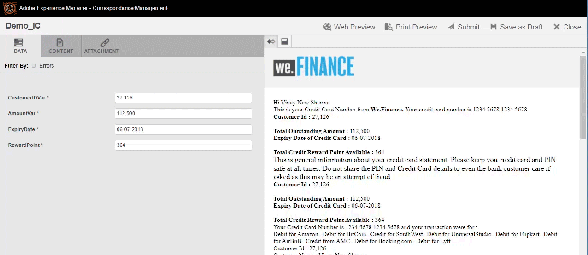

# Neue Funktionen in [!DNL Adobe Experience Manager] 6.5 Service Pack 11 {#aem-whats-new-service-pack}

<!-- TBD: Downsample this image. We do not need as big an image since customers don't use as big a screen to view. Also, having a 700+ KB decorative image is bad for page load time.
-->

[!DNL Adobe Experience Manager] 6.5 Service Packs bieten in vierteljährlichen Abständen neue Funktionen, kundenspezifische Verbesserungen sowie Verbesserungen hinsichtlich Leistung, Stabilität und Sicherheit. Die vierteljährliche Verfügbarkeit erleichtert den Zugriff auf und die Übernahme neuer Funktionen und Innovationen.

In diesem Artikel werden die Funktionen des neuesten Service Packs vorgestellt [Wichtige Funktionen der vorherigen 6.5 Service Packs](#key-features-previous-service-packs)und die [Schlüsselversionen seit dem letzten Service Pack](#key-releases-since-last-sp) verfügbar.

## [!DNL Adobe Experience Manager Sites] {#aem-sites}

* Die automatische Generierung von Sitemap für SEO-Zwecke ist mit dem [SEO-Indexpaket](https://experience.adobe.com/#/downloads/content/software-distribution/en/aem.html?package=/content/software-distribution/en/details.html/content/dam/aem/public/adobe/packages/cq650/featurepack/sites-seo-index-content-1.0.0.zip). Es unterstützt Sitemaps, alternative URLs, Roboter-Meta-Tags und mehr in der [!DNL Core Components].

* Mehrfeld-Unterstützung für mehrzeiligen Text-Datentyp hinzugefügt.

* Verbesserung, um Benutzer über den asynchronen Auftrag zu informieren, der derzeit im Hintergrund ausgeführt wird, um zu verhindern, dass sie mehrere asynchrone Vorgänge auf demselben Pfad auslösen.

## [!DNL Adobe Experience Manager Assets] {#aem-assets}

* Zur Verbesserung des Anwendererlebnisses wird nun die Anzahl der in einem Ordner vorhandenen Assets angezeigt. Für mehr als 1.000 Assets in einem Ordner zeigt [!DNL Assets] „1000+“ an.

   

* Die folgenden Verbesserungen der Barrierefreiheit sind verfügbar:

   * In der Kartenansicht im [!DNL Assets] Repository bei Verwendung von `Tab` zum Verschieben des Fokus auf das erste Element, das Schnellaktionen im Fokus öffnet, gibt die Bildschirmlesehilfe den Namen des fokussierten Elements an.
   * In [!DNL Dynamic Media] [!UICONTROL Viewer-Vorgabeneditor]Wenn Shadow Color und Border Color nicht vorhanden sind, werden die Eingaben mit der Eigenschaft disabled deaktiviert. Tastaturbenutzer können die Eingabe nicht fokussieren, und Bildschirmlesehilfen geben den Status für das Steuerelement nicht als deaktiviert an.
   * In [!DNL Dynamic Media], um ein neues Videokodierungsprofil zu erstellen, muss die [!UICONTROL Smart Crop Ratio] für die Barrierefreiheit gekennzeichnet ist, sodass Bildschirmlesehilfen sie entsprechend ankündigen.

### [!DNL Dynamic Media] {#dynamic-media}

* Sie können jetzt [!DNL Dynamic Media] , um allgemeine Einstellungen zu konfigurieren, anstatt die [!DNL Dynamic Media Classic] Desktop-Applikation. Siehe [Allgemeine Dynamic Media-Einstellungen konfigurieren](/help/assets/dm-general-settings.md).

   

* Sie können jetzt [!DNL Dynamic Media] um die Veröffentlichungseinstellungen zu konfigurieren, anstatt die [!DNL Dynamic Media Classic] Desktop-Applikation. Siehe [Konfigurieren der Veröffentlichungseinstellungen von Dynamic Media](/help/assets/dm-publish-settings.md).

   

## [!DNL Adobe Experience Manager Forms] {#aem-forms}

>[!NOTE]
>
>* [!DNL Experience Manager Forms] veröffentlicht die Add-on-Pakete eine Woche nach dem geplanten Veröffentlichungsdatum der [!DNL Experience Manager] Service Packs.

## Wichtige Funktionen in früheren Versionen [!DNL Experience Manager] 6.5 Service Packs {#key-features-previous-service-packs}

### [!DNL Experience Manager Sites] {#aem-sites-previous-service-packs}

#### In AEM Version 6.5.10.0 enthaltene Funktionen {#features-sites-65100}

* **Verbesserte [!DNL Content Fragment] Modelle und Editor**: Sie können jetzt komplexe und benutzerdefinierte Modelle für strukturierte Inhalte mit verschachtelten Inhalten erstellen [!DNL Content Fragment] Modelle. Inhaltsstrukturen werden in grundlegende Elemente modularisiert, die als Unterfragmente modelliert werden. Fragmente mit einer höheren Ebene verweisen auf diese Unterfragmente. Mehr Datentypverbesserungen wie erweiterte Validierungsregeln erhöhen die Flexibilität der Inhaltsmodellierung mit [!DNL Content Fragments]. Die [!DNL Experience Manager] [!DNL Content Fragment] Der Editor unterstützt verschachtelte Fragmentstrukturen in einer allgemeinen Editor-Sitzung, mit Verbesserungen wie Strukturbaumansicht und Registerkarten-Breadcrumb-Navigation durch Fragmenthierarchien.

* **GraphQL-API für[!DNL Content Fragments]**: Die neue GraphQL-API ist die Standardmethode zur Bereitstellung strukturierter Inhalte im JSON-Format. Mit GraphQL-Abfragen können Kunden nur die relevanten Inhaltselemente anfordern, um ein Erlebnis zu rendern. Durch eine solche Auswahl wird die Überbereitstellung von Inhalten (Möglichkeit mit HTTP-REST-APIs) eliminiert, die das Parsen von Inhalten auf Client-Seite erfordert. GraphQL-Schemata werden von [!DNL Content Fragment] -Modelle und API-Antworten werden im JSON-Format erstellt. In [!DNL Experience Manager] as a [!DNL Cloud Service], [GraphQL-Abfragen bleiben bestehen](https://experienceleague.adobe.com/docs/experience-manager-cloud-service/assets/admin/graphql-api-content-fragments.html#persisted-queries-caching) und verarbeiten Sie Cache-freundliche GET-Anfragen. Es ist noch nicht möglich in [!DNL Experience Manager] 6.5.

* **Hierarchieverwaltung und künftige Vorschau**: Benutzer haben jetzt eine Benutzeroberfläche, über die sie auf die Inhaltsstrukturen ihrer [!DNL Experience Manager] Launches, einschließlich der Möglichkeit, Seiten in einem Launch hinzuzufügen und zu entfernen. Diese Funktion erhöht die Flexibilität von [!DNL Experience Manager] Starts zum Erstellen von Inhaltsversionen, die für die zukünftige Veröffentlichung vorgesehen sind. [Zeitwarp-Funktion](/help/sites-authoring/working-with-page-versions.md#timewarp) ermöglicht Benutzern die Vorschau von Launches als zukünftiger Inhaltsstatus.

* [!DNL Experience Manager] zeigt direkt eine Liste aller Inhaltsmodelle unter einem Ordner an, ohne dass Inhaltsautoren durch die Dateistruktur navigieren müssen. Die Funktion erfordert jetzt weniger Klicks und verbessert die Authoring-Effizienz.

* Pathfield in [!DNL Sites] Mit dem Editor können Autoren Assets aus [!DNL Content Finder].

* Platform bietet einige Verbesserungen hinsichtlich der Barrierefreiheit. Siehe [Plattformaktualisierungen](/help/release-notes/sp-release-notes.md#platform-65100).

#### Möglichkeit, gelöschte Seiten und Baume wiederherzustellen (6.5.9.0) {#ability-to-restore-pages-tree}

Sie können jetzt die gelöschten Seiten und die gesamte Baumansicht auf einer [!DNL Experience Manager Sites] Seite.

#### Sortieren Sie die für das Rollout verfügbaren Live Copy-Seiten (6.5.8.0). {#sort-livecopy-pages}

Sie können jetzt die für das Rollout verfügbaren Live Copy-Seiten mit dem [!UICONTROL Name], [!UICONTROL Datum der letzten Änderung]und [!UICONTROL Letztes Rollout-Datum] Eigenschaften. Die [!UICONTROL Letztes Rollout-Datum] für eine Seite ist eine neue Eigenschaft, die in dieser Version eingeführt wurde.

#### Verfügbarkeit von Seitenverschiebungen und MSM-Rollouts als asynchrone Vorgänge (6.5.7.0) {#page-moves-msm-asynchronous}

Sie können jetzt die Seitenverschiebungen und MSM-Rollouts als asynchrone Vorgänge durchführen, um ihre Auswirkungen auf die Laufzeitleistung zu reduzieren. Sie können die Vorgänge für die sofortige oder spätere Ausführung planen. Der Status der zugehörigen Vorgänge und Prozessschritte wird in einer Konsole angezeigt, was für die Überwachung von MSM-Rollouts in großem Maßstab hilfreich ist.

#### Verfügbarkeit des Vorgangs &quot;Seitenverschiebung&quot;im asynchronen Modus (6.5.6.0) {#page-move-asynchronous}

Der Vorgang &quot;Seitenverschiebung&quot;ist jetzt im asynchronen Modus verfügbar. Zusätzlich zur sofortigen Ausführung können Sie auch den Vorgang &quot;Seitenverschiebung&quot;für die spätere Ausführung planen.

#### Verbesserungen bei der Barrierefreiheit (6.5.5.0) {#accessibility-sites}

* Verbesserte Fehlerberichterstellung durch Hinzufügen von Textinformationen.

* Der Fokus der Benutzeroberfläche während der Tastaturnavigation wurde verbessert.

* Verbessertes Kontrastverhältnis für verschiedene Elemente der Benutzeroberfläche.

* Verbesserte Konsistenz der alternativen Attribute für Seitenbilder.

* Verbesserte Konsistenz der ARIA-Beschriftungen (Accessible Rich Internet Applications).

* Verbesserte Funktionen für Nicht-Visual Desktop Access (NVDA).

* Verbesserte Unterstützung für Bildschirmlesehilfen.

#### Weitere wichtige Verbesserungen (6.5.5.0) {#other-enhancements-sites}

* Der anonyme Zugriff auf die CRXDE Lite ist zur Erhöhung der Sicherheit nicht zulässig. Stattdessen werden die Benutzer zum Anmeldebildschirm weitergeleitet. Siehe [Entwickeln mit CRXDE Lite](/help/sites-developing/developing-with-crxde-lite.md).

* Beim Kopieren oder Einfügen eines Seitenbaums haben Sie jetzt die Möglichkeit, entweder die Stammseite einzufügen oder die Stammseite mit den Unterseiten des Baums einzufügen.

* [!DNL Adobe Experience Manager Experience Fragments] exportiert [!DNL Adobe Target] Arbeitsbereiche werden jetzt als individuelle Angebotstypen und Angebotsquellen in [!DNL Target].

* Multi-Site-Manager - Der Trigger Veröffentlichen löscht jetzt eine Komponente aus der veröffentlichten Seite, wenn eine Komponente aus der Quellseite gelöscht wird.

* Multi-Site-Manager - Wenn der Name einer lokalen Komponente in einem [!UICONTROL Live Copy] ist mit dem Namen einer Komponente im Blueprint identisch, und die Komponente wird aus dem Blueprint ausgerollt. Anschließend wird der Begriff `_msm_moved` wird nun zum Namen der lokalen Komponente hinzugefügt.

#### Stilsystemverbesserungen (6.5.4.0) {#style-system-enhancements}

Sie können jetzt Stile im Komponentendialogfeld mithilfe des erweiterten Stilsystems auswählen.

#### Leistungsverbesserungen in verschiedenen Bereichen (6.5.4.0) {#performance-improvements}

* Verkürzte Ladezeit und Initialisierung von ContextHub innerhalb einer Site (`contexthub.kernel.js`). Dies führt zu schnelleren Seitenladevorgängen während eines Site-Besuchs.

* Verringerte Zeit zum Aktualisieren einer Seite nach dem Ziehen [!DNL Experience Fragments] nach [!DNL Sites] Seiten-Editor.

* Die Ladezeit für Einträge auf einer [!DNL Sites] Seite mit mehr als 200 Live Copies in **[!UICONTROL Live Copy-Übersicht]**.

* Verbesserte Handhabung von unvollständigen oder ungültigen URLs. Solche URLs können den Vorlagen-Editor verlangsamen.

### [!DNL Adobe Experience Manager Assets] {#aem-assets-previous-service-packs}

#### In AEM Version 6.5.10.0 enthaltene Funktionen {#features-assets-65100}

* [!DNL Experience Manager] erweitert die Funktionalität &quot;Connected Assets&quot;auf die Verwendung von [!DNL Dynamic Media] Bilder in den entsprechenden Kernkomponenten. Siehe [Verwenden von Connected Assets](/help/assets/use-assets-across-connected-assets-instances.md).

* Beim Freigeben einzelner Assets und Sammlungen als Link (mithilfe von [!UICONTROL Linkfreigabe] -Dialogfeld) können Benutzer auswählen, ob der Empfänger Original-Assets, deren Ausgabeformate oder beides herunterladen darf. Siehe [Freigeben von Assets über einen Link](/help/assets/link-sharing.md).

   

* Wenn Benutzer Assets herunterladen, die für sie als Link freigegeben wurden, können sie die Original-Assets, die Ausgabeformate oder beide herunterladen.

* **Generierte Unter-Assets begrenzen**: Administratoren können die Anzahl der Teil-Assets begrenzen, die [!DNL Experience Manager] generiert für ebenenübergreifende Assets wie PDF-, PowerPoint-, InDesign- und Keynote-Dateien.

   

* Eine neue [!DNL Camera Raw] -Paket verfügbar, das [!DNL Adobe Camera Raw] v10.4. Siehe [Bilder mithilfe von [!DNL Camera Raw]](/help/assets/camera-raw.md).

#### Frühere Versionen {#previous-releases-assets}

* Die Benennung chinesischer Gebietsschemata und Regionen in Bezug auf Hongkong, Macau und Taiwan wurde aktualisiert, um sie mit den sozialen und politischen Ansichten Chinas in Einklang zu bringen (6.5.9.0).

* Eine optionale Konfiguration wird eingeführt, um die Groß-/Kleinschreibung in den E-Mail-IDs in der Antwort der AKP-API von zu ändern. [!DNL Adobe Experience Manager] (6.5.9.0).

   ![Konfiguration zum Ändern der E-Mail-IDs in Kleinbuchstaben in der AKP-Antwort von [!DNL Experience Manager]](assets/email-lowcase-config.png)

* Der Kontrast von Text und Symbolen gegenüber dem Hintergrund wird für verschiedene Funktionen verbessert. Durch diese Implementierung der Richtlinien für barrierefreien Web Content Accessibility Guidelines (WCAG) werden [!DNL Assets] für Benutzer mit eingeschränktem Sehvermögen und eingeschränkter Farbwahrnehmung leichter zugänglich. Siehe [Verbesserungen der Barrierefreiheit in [!DNL Assets]](sp-release-notes.md#assets-accessibility-6590) (6.5.9.0).
* Bei Verwendung von [Funktion für Connected Assets](/help/assets/use-assets-across-connected-assets-instances.md)können Sie jetzt eine Liste aller [!DNL Sites] Seiten, die das Asset verwenden. Diese Verweise auf ein Asset sind in der [!UICONTROL Eigenschaften] Seite. Dadurch erhalten Administratoren, Marketing-Experten und Bibliothekare einen vollständigen Überblick über die Asset-Nutzung, was eine bessere Nachverfolgung, Verwaltung und Markenkonsistenz ermöglicht (6.5.8.0).

* Beim Löschen eines Assets, auf das auf einer Webseite verwiesen wird, [!DNL Experience Manager] zeigt eine Warnung an. Sie können das Löschen eines referenzierten Assets erzwingen oder die Referenzen überprüfen und ändern, die in der [!DNL Properties] Seite des Assets. Durch Klicken auf die Verweise wird die lokale und Remote-Ansicht geöffnet. [!DNL Sites] Seiten (6.5.8.0).

* [!DNL Assets] und [!DNL Dynamic Media] bietet mehrere Verbesserungen an Barrierefreiheit. Die Verbesserungen betreffen die Tastaturnavigation, die Verwendung von Bildschirmlesehilfen und ähnliche Verbesserungen, um die Verwendung von Hilfstechnologien (AT) zu ermöglichen. Siehe [[!DNL Assets] Verbesserungen](/help/release-notes/sp-release-notes.md#assets-6570) und [[!DNL Dynamic Media] Verbesserungen](/help/release-notes/sp-release-notes.md#dynamic-media-6570) (6.5.7.0)

* Benutzer können digitale Assets in der Karten- und Spaltenansicht (6.5.7.0) sortieren.

#### Verbesserungen bei der Barrierefreiheit (6.5.6.0) {#accessibility-assets-6560}

* **Verbesserter Fokus der Benutzeroberfläche während der Tastaturnavigation**, beispielsweise konzentrieren Sie sich auf:

   * `x` Symbol in [!UICONTROL Versionsvorschau] Dialogfeld eines Assets in [!UICONTROL Timeline].

   * Umsetzbare Benutzeroberflächenoptionen.

   * E-Mail-Feld im [!UICONTROL Link freigeben] Dialogfeld und Feld zum Hinzufügen einer geschlossenen Benutzergruppe in [!UICONTROL Berechtigung] Ordnerregisterkarte [!UICONTROL Eigenschaften].

* **Verbesserte Funktionalität mithilfe von Tastaturbefehlen**

   Benutzer können Tastaturbefehle verwenden, um Steuerelemente im Editor für Metadatenschema-Formulare im Durchsuchmodus der Bildschirmlesehilfe zu ziehen.

* **Verbesserte Benutzerfreundlichkeit für Bildschirmlesehilfen-Benutzer**, was auf Folgendes zurückzuführen ist:

   * Bildschirmlesehilfen geben den Zweck von Video- und Audio-Playern an.

   * Bildschirmlesehilfen geben den Zweck der Benutzeroberflächenoptionen an, die ausgewählten Tags zu entfernen, indem sie [!UICONTROL Dialogfeld &quot;Tags-Auswahl&quot;] auf Asset [!UICONTROL Eigenschaften].

   * Bildschirmlesehilfen geben die Zeilenüberschriften und Zeilenelemente von Tabellen an, sodass Benutzer wissen, welche Einträge zu derselben Zeile gehören.

   * Beschreibende und aussagekräftige Seitentitel der Suchseite.

   * Bildschirmlesehilfen geben die Optionen im Suchfilterbereich als erweiterbare Akkordeons an.

#### Weitere Verbesserungen in [!DNL Assets] (6.5.6.0) {#other-enhancements-assets-6560}

* Mit Ordnern verknüpfte Benutzergruppen (privat und nicht privat) werden jetzt aus dem Repository entfernt auf [Löschen dieser Ordner](/help/assets/private-folder.md#delete-private-folder). Die vorhandenen redundanten, verwaisten, nicht verwendeten und automatisch generierten Benutzergruppen können jedoch mit JMX aus dem Repository entfernt werden.

#### Verbesserungen der Barrierefreiheit in [!DNL Assets] (6.5.5.0) {#assets-accessibility}

[!DNL Experience Manager Assets] ist jetzt in Übereinstimmung mit den Web Content Accessibility Guidelines (WCAG) leichter zugänglich. Die Barrierefreiheit wurde aufgrund der folgenden Verbesserungen verbessert:

* Viele Elemente, Steuerelemente, Seiten und Dialogfelder der Benutzeroberfläche sind für die Sprachausgabe benutzerfreundlich.

* Auf viele Elemente, Steuerelemente und Eingabefelder der Benutzeroberfläche kann über die Tastatur zugegriffen werden.

* Farbe und Kontrast einiger Elemente der Benutzeroberfläche werden aktualisiert, sodass Benutzer mit eingeschränkter Sehkraft oder Benutzer ohne Farbwahrnehmung diese Elemente der Benutzeroberfläche unterscheiden können. Beispielsweise die Farbe der Symbole für die Bewertung von Sternen (z. B. in [!UICONTROL Bewertung] Abschnitt [!UICONTROL Erweitert] Registerkarte im Asset [!UICONTROL Eigenschaften] oder in der Kartenansicht) für einen angemessenen Kontrast geändert wird.

   

#### Erweiterte Ausnahmebehandlung (6.5.5.0) {#exception-handling}

[!DNL Assets] Der Ablauf der Benutzeroberfläche bietet eine bessere Ausnahmebehandlung. Wenn ein Asset keinen Typ für seine Dimension aufweist, wird die beobachtete Ausnahme in den Protokolldateien aufgezeichnet.

#### Konfigurieren [!DNL Experience Manager Assets] mit [!DNL Brand Portal] (6.5.4.0) {#configure-assets-bp}

Der Autorisierungskanal zwischen [!DNL Experience Manager Assets] und [!DNL Brand Portal] geändert. Früher [!DNL Brand Portal] wurde in der klassischen Benutzeroberfläche über das alte OAuth-Gateway konfiguriert, das mithilfe des JWT-Token-Austauschs ein IMS-Zugriffstoken zur Autorisierung abruft. [!DNL Experience Manager Assets] ist jetzt konfiguriert mit [!DNL Brand Portal] bis [!DNL Adobe I/O], wodurch ein IMS-Token zur Autorisierung Ihrer [!DNL Brand Portal] Mandanten.

Die Schritte zum Konfigurieren [!DNL Experience Manager Assets] mit [!DNL Brand Portal] variieren je nach [!DNL Experience Manager] und ob Sie zum ersten Mal Konfigurationen vornehmen oder die vorhandenen Konfigurationen aktualisieren. Weitere Informationen finden Sie unter [Konfigurieren von Experience Manager Assets mit Brand Portal.](https://experienceleague.adobe.com/docs/experience-manager-brand-portal/using/publish/configure-aem-assets-with-brand-portal.html?lang=de)

#### Verbesserungen bei der Barrierefreiheit (6.5.4.0) {#accessibility-enhancements-6540}

[!DNL Experience Manager Assets] umfasst die folgenden Verbesserungen der Barrierefreiheit:

* Mit den Pfeiltasten auf der Tastatur können Sie Bereiche in gezoomten Bildern verschieben und schwenken. Weitere Informationen finden Sie unter [Vorschau von Assets nur mit Tastaturtasten anzeigen](../assets/manage-assets.md#previewing-assets).

* Die Kontrollkästchen mit gemischtem Status (in denen die Kontrollkästchen der ersten Ebene nicht ausgewählt und durchgestrichen werden, es sei denn, Sie wählen alle verschachtelten Kontrollkästchen aus, können von Sprachausgaben gelesen werden.

* Datums- und Uhrzeitformatbeschränkungen werden in den Feldbeschriftungen von Datumsfeldern bereitgestellt, damit Benutzer das Datum über die Tastatur im richtigen Format eingeben können.
Beispiel: `On Time (MM-DD-YYYY HH:mm)`. Hier ist MM Monat im zweistelligen Format, JJJJ ist Jahr, TT ist Tag im zweistelligen Format, HH ist Stunde im 24-Stunden-Militärformat und mm ist Minute.

* Bildschirmlesehilfen geben die Option zum Entfernen ausgewählter Tags an (`X` -Symbol) und die Anzahl der ausgewählten Tags.

#### Sortierbare Spalte für Erstellungsdatum von Assets in der Listenansicht (6.5.3.0) {#sortable-date-created-column}

Eine neue sortierbare Spalte für das Erstellungsdatum von Assets wird in der DAM-Listenansicht und in der Listenansicht in den Asset-Suchergebnissen hinzugefügt.

#### Visuelle Suche nach [!DNL Adobe Experience Manager Assets] (6.5.2.0) {#visual-search}

[!DNL Assets] -Benutzer können visuell ähnliche Bilder suchen. Experience Manager zeigt die mit Smart-Tags versehenen Bilder aus dem DAM-Repository an, die einem vom Benutzer ausgewählten Bild ähnlich sind. Siehe [Visuelle Suche](../assets/search-assets.md).

### Dynamic Media {#dynamic-media-previous-service-packs}

* Viele Verbesserungen der Barrierefreiheit werden in [!DNL Dynamic Media] -Client verwenden, damit eine Bildschirmlesehilfe eine angemessenere und nützlichere Beschreibung der Aktion oder Benutzeroberfläche darstellen kann. Siehe [[!DNL Dynamic Media] Updates](/help/release-notes/sp-release-notes.md#dynamic-media-65100) (6.5.10.0).

* [[!DNL Dynamic Media] ist leichter zugänglich](sp-release-notes.md#assets-accessibility-6590) im Hinblick auf:

   * Benutzerfreundlichkeit mit Tastaturbefehlen.
   * Kontrast (mit Hintergrund) von Text, Platzhaltertext und Steuerelementen in verschiedenen Editoren.
   * Barrierefreiheit und Erzählung durch Bildschirmlesehilfen.

* Bieten Sie auf Geräten mit hoher Auflösung und eingeschränkter Netzwerkbandbreite optimale Bilder mit intelligenter Bildbearbeitung (Device Pixel Ratio) und optimierter Netzwerkbandbreite. Siehe [Häufig gestellte Fragen zur intelligenten Bildbearbeitung](/help/assets/imaging-faq.md) (6.5.9.0).

* [!DNL Dynamic Media] delivery (`fmt` URL-Modifikator) unterstützt jetzt das Bildformat AVIF der nächsten Generation (AV1-Bildformat). Weitere Informationen und die Timeline finden Sie unter [Image Serving und Rendering API Fmt](https://experienceleague.adobe.com/docs/dynamic-media-developer-resources/image-serving-api/image-serving-api/http-protocol-reference/command-reference/r-is-http-fmt.html) (6.5.9.0).

#### Unterstützung für 3D-Assets in [!DNL Dynamic Media] (6.5.5.0) {#support-for-3d}

Unterstützung für 3D-Bilder in [!DNL Dynamic Media] ermöglicht Kunden die Veröffentlichung und das Hinzufügen von 3D-Inhalten zu Webseiten und Anwendungen. Die Unterstützung umfasst:

* Veröffentlichen Sie allgemeine 3D-Asset-Formate und generieren Sie eine Asset-URL, die auf Webseiten und anderen Anwendungen verwendet werden kann.

* Ein 3D-Web-Viewer mit [!DNL Adobe Dimension], um die veröffentlichten 3D-Assets interaktiv anzuzeigen.

* Veröffentlichen und Anzeigen allgemeiner 3D-Assets in [!DNL Experience Manager Sites] Seiten, die [!DNL Sites] WCM-Komponente.

#### Ungültiges CDN-zwischengespeicherter Inhalt (6.5.6.0) {#invalidate-cdn-cached-content}

Sie können jetzt die [!DNL Dynamic Media] Benutzeroberfläche zum Invalidieren zwischengespeicherter Inhalte im Content Delivery Network (CDN). Daher sind die aktualisierten Assets sofort verfügbar, anstatt darauf zu warten, dass der Cache abläuft. Sie können CDN wie folgt ungültig machen:

* Erstellen einer Vorlage für CDN-Invalidierung: Auswählen von Assets und formularverknüpften vorlagenbasierten URLs

* Auswählen von Assets und zugehörigen Vorgaben über die Asset-Auswahl

* Hinzufügen vollständiger Asset-URLs

#### Selektive Veröffentlichung von Assets in [!DNL Experience Manager] und [!DNL Dynamic Media] (6.5.6.0) {#selective-publishing}

Sie können jetzt Assets selektiv veröffentlichen oder die Veröffentlichung rückgängig machen, indem Sie [!DNL Experience Manager] oder [!DNL Dynamic Media] using [!UICONTROL Quick Publish] oder [!UICONTROL Veröffentlichung verwalten] Assistent. Sie können auch die `Publish` oder `Unpublish` -Modus auf Ordnerebene.

#### Intelligente Bildbearbeitung für Dynamic Media {#smart-imaging}

Intelligente Bildbearbeitung nutzt die individuellen anzeigebezogenen Eigenschaften der einzelnen Benutzer, um automatisch die richtigen Bilder bereitzustellen, die für ihr Erlebnis optimiert sind, was zu einer besseren Leistung und Interaktion führt. Die intelligente Bildbearbeitung arbeitet mit bestehenden Bildvorgaben und reduziert im letzten Moment abhängig vom Browser oder der Geschwindigkeit der Netzverbindung die Größe der Bilddatei intelligent noch weiter. Informationen hierzu finden Sie unter [Smart Imaging](../assets/imaging-faq.md).

#### Smartes Zuschneiden in Videoprofilen für Dynamic Media (6.5.3.0) {#smart-crop-video}

Smartes Zuschneiden für Videos - eine optionale Funktion, die in Videoprofilen verfügbar ist - verwendet Adobe Sensei, um den Fokus in adaptiven Videos oder progressiven Videos unabhängig von der Größe automatisch zu erkennen und zuzuschneiden. Siehe [über die Verwendung von smartem Zuschneiden in Videoprofilen](../assets/video-profiles.md).

### Experience Manager Forms {#aem-forms-previous-service-packs}

#### In AEM Version 6.5.10.0 enthaltene Funktionen {#features-forms-65100}

>[!NOTE]
>
>Das Add-On-Paket von [!DNL Experience Manager Forms] wird eine Woche nach dem geplanten [!DNL Experience Manager] Service Pack-Version.

* Sie können jetzt den Automated forms conversion-Dienst für [Konvertieren von PDF forms in die Sprachen Französisch, Deutsch, Spanisch, Italienisch und Portugiesisch](https://experienceleague.adobe.com/docs/aem-forms-automated-conversion-service/using/extending-the-default-meta-model.html#language-specific-meta-model) in adaptive Formulare.

* **Fehlermeldungen im Eigenschaften-Browser**: Es wurden Fehlermeldungen für jede Eigenschaft im Eigenschaften-Browser für adaptive Formulare hinzugefügt. Diese Meldungen helfen beim Verständnis der zulässigen Werte für ein Feld.

* **Unterstützung für die Verwendung der Literaloption zum Festlegen eines Werts für eine JSON-Typvariable**: Sie können die Literaloption verwenden, um Werte für eine JSON-Typvariable im Schritt &quot;set variable&quot;eines AEM-Workflows festzulegen. Mit der Option „Literal“ können Sie eine JSON in Form einer Zeichenfolge angeben.

* [Plattformaktualisierungen](../forms/using/aem-forms-jee-supported-platforms.md): [!DNL Adobe Experience Manager Forms] on JEE unterstützt nun die folgenden Plattformen:
   * [!DNL Adobe Acrobat 2020]
   * [!DNL Ubuntu 20.04]
   * [!DNL Open Office 4.1.10]
   * [!DNL Microsoft Office 2019]
   * [!DNL Microsoft Windows Server 2019]
   * [!DNL RHEL8]

* Hinzugefügte Unterstützung für `GuideBridge#getGuidePath` API in [!DNL AEM Forms].

#### Unterstützung für [!DNL Azul Zulu OpenJDK] (6.5.9.0) {#support-azul-zulu}

Sie können jetzt Anwendungen mit [!DNL Azul Zulu] Builds von [!DNL OpenJDK] für [!DNL Experience Manager Forms] auf OSGi-Bereitstellungen. Weitere Informationen finden Sie unter [Experience Manager 6.5 Service Pack 9 - Versionshinweise](sp-release-notes.md) und [Technische Anforderungen](../sites-deploying/technical-requirements.md).

#### Möglichkeit, eine Benachrichtigungs-E-Mail an eine Gruppe zu senden, indem [!UICONTROL Aufgabe zuweisen] (6.5.9.0) {#group-notification-email}

Sie können jetzt mit dem Workflow-Schritt Aufgabe zuweisen eine Benachrichtigungs-E-Mail an eine Gruppen-E-Mail-Adresse senden.

#### Möglichkeit, einen Entwurf für interaktive Kommunikation abzurufen, nachdem die Quelle für interaktive Kommunikation geändert wurde (6.5.9.0) {#retrieve-draft-after-source-modifications}

Sie können jetzt eine interaktive Kommunikation abrufen, die als Entwurf gespeichert wurde, nachdem Sie die Quelle der interaktiven Kommunikation geändert haben.

#### Festlegen des benutzerdefinierten Domänennamens für das Laden, Rendern und Überprüfen des reCAPTCHA-Dienstes (6.5.9.0) {#set-custom-domain-name-recaptcha}

Der reCAPTCHA-Service verwendet `https://www.recaptcha.net/` als Standard-Domain. Sie können jetzt die festzulegenden Einstellungen ändern `https://www.google.com/` oder einen beliebigen benutzerdefinierten Domänennamen, der geladen, gerendert und validiert werden soll.

#### Verbesserungen der Eingabedaten für [!UICONTROL Formulardatenmodelldienst aufrufen] Workflow-Schritt (6.5.9.0) {#input-data-enhancements-fdm}

Wenn Sie ein Formulardatenmodell und einen Dienst in [!UICONTROL Formulardatenmodelldienst aufrufen] Workflow-Schritt, geben Sie Dienstargumente für Eingabedaten an.

Wenn Sie [!UICONTROL Relativ zur Nutzlast] -Option, um eine Datei als Dienstargument anzuhängen, können Sie jetzt den Ordnerpfad angeben, der die Datei anstelle des tatsächlichen Dateinamens enthält. Durch die Definition des Ordnernamens anstelle des Dateinamens für den Dateianhang können Sie Workflow-Modelle wiederverwenden. Sie beschränken das Workflow-Modell nicht auf einen Dateinamen für Anhänge.

#### Möglichkeit zur Verwendung mehrerer Übergeordneter Seiten in einer Datensatzdokumentvorlage (6.5.9.0) {#use-multiple-master-pages-dor-template}

Sie können jetzt mehrere Übergeordnete Seiten in einer Datensatzdokumentvorlage verwenden. Daher können Sie jetzt unterschiedliche Kopf-, Fußzeilen, Schriftarten, Logoinformationen auf der Titelseite und andere Seiten der Vorlage haben.

#### Unterstützen von Seitenumbrüchen im Datensatzdokument (6.5.9.0) {#support-page-breaks-dor}

Sie können einem Datensatzdokument jetzt Seitenumbrüche hinzufügen. Wenn ein Bedienfeld innerhalb von Seiten umgebrochen wird, können Sie daher einen Seitenumbruch hinzufügen, um den Bereich auf eine neue Seite in einem Datensatzdokument zu verschieben.

#### CAPTCHA-Komponente in einem adaptiven Formular basierend auf Regeln ein- oder ausblenden (6.5.8.0) {#show-hide-captcha}

Sie können CAPTCHA jetzt entweder bei der Übermittlung des adaptiven Formulars oder bei der Benutzeraktion überprüfen. Sie können auch Bedingungen hinzufügen, um CAPTCHA bei einer Benutzeraktion zu validieren und die CAPTCHA-Komponente in einem adaptiven Formular basierend auf Regeln ein- oder auszublenden.

#### Hinzufügen benutzerdefinierter CAPTCHA-Dienste (6.5.8.0) {#add-custom-captcha-services}

[!DNL Experience Manager Forms] unterstützt standardmäßig die Verwendung von Google reCAPTCHA (eine separate Lizenz für Google reCAPTCHA-APIs ist erforderlich) als CAPTCHA-Validierungsdienst. Sie können auch einen benutzerdefinierten CAPTCHA-Dienst verwenden, um CAPTCHAs zu validieren.

#### Weitere Verbesserungen (6.5.8.0) {#other-enhancements-forms-6580}

* Verbesserte Barrierefreiheit der [!DNL Experience Manager Forms] Datumsauswahl-Komponente.

* Unterstützung zum Generieren einer interaktiven Kommunikation im PCL-Format mithilfe der PrintChannel-API hinzugefügt.

* Beim Ausführen einer PDFG-Konvertierung können Sie jetzt die [!DNL Experience Manager Forms] Registrierungsänderungen für die Erstellung benutzerdefinierter Lesezeichen.

#### Leistungsverbesserungen (6.5.7.0) {#performance-improvements-forms}

[!DNL Experience Manager] 6.5 Service Pack 7 Forms verbessert die Leistung für:

* Validieren der Feldwerte auf dem Server beim Senden eines adaptiven Formulars.

* Konvertieren eines PDF-Formulars in ein adaptives Formular mithilfe der [!DNL Automated Forms Conversion service].

#### Unterstützung für Microsoft SQL Server 2016 &quot;Always on available groups&quot;für hohe Verfügbarkeit (6.5.7.0) {#always-on-availability-groups}

[!DNL Experience Manager Forms] unterstützt jetzt [!DNL Microsoft] SQL Server 2016 Immer auf Verfügbarkeitsgruppen für hohe Verfügbarkeit für OSGi-Bereitstellungen.

#### HTTP-Client-Konfiguration des Formulardatenmodells zur Leistungsoptimierung (6.5.7.0) {#fdm-http-client-config}

[!DNL Experience Manager Forms] Formulardatenmodell bei der Integration mit RESTful-Webdiensten, da die Datenquelle jetzt HTTP-Client-Konfigurationen zur Leistungsoptimierung enthält. Siehe [Datenquellen konfigurieren](../../help/forms/using/configure-data-sources.md#fdm-http-client-configuration).

#### Verfügbarkeit der Option &quot;Zurücksetzen&quot;für jede Komponente im Layout-Modus (6.5.7.0) {#reset-option-layout-mode}

Sie können jetzt die Zurücksetzungsoption für jede Komponente im Layout -Modus eines adaptiven Formulars verwenden. Wenn Sie ein mehrspaltiges Layout für ein Bedienfeld definieren, können Sie diese Funktion verwenden, um einzelne Komponenten innerhalb des Bedienfelds zurückzusetzen. Siehe [Verwenden Sie den Layout-Modus, um die Größe von Komponenten zu ändern](../../help/forms/using/resize-using-layout-mode.md#resize-components).

#### Vorausfüllen eines adaptiven Formulars auf dem Client (6.5.6.0) {#prefill-merge-data-at-client}

Wenn Sie ein adaptives Formular vorab ausfüllen, wird die [!DNL Experience Manager Forms] -Server führt Daten mit einem adaptiven Formular zusammen und stellt das ausgefüllte Formular für Sie bereit. Standardmäßig erfolgt die Datenzusammenführung auf dem Server.
Sie können jetzt die [!DNL Experience Manager Forms] Server zu [Führen Sie die Datenzusammenführungsaktion auf dem Client aus.](../../help/forms/using/prepopulate-adaptive-form-fields.md) anstelle des Servers. Dadurch wird die zum Vorausfüllen und Rendern adaptiver Formulare erforderliche Zeit erheblich verringert.

#### Formulardatenmodellintegration mit RESTful-APIs auf einem Server mit bidirektionaler SSL-Implementierung (6.5.6.0) {#fdm-integration-rest-apis-two-way-ssl}

[!DNL Experience Manager Forms] Formulardatenmodell kann jetzt [Integration mit RESTful-APIs auf einem Server, auf dem eine bidirektionale SSL-Implementierung implementiert ist](../../help/forms/using/configure-data-sources.md).

#### Hinzugefügte Unterstützung für [!DNL Adobe Sign] Text-Tags im Automated forms conversion-Dienst (6.5.6.0) {#sign-integration-acroform-afcs}

Wenn ein AcroForm [!DNL Adobe Sign] Text-Tags: Diese Felder werden jetzt erkannt und als [!DNL Adobe Sign] Felder im adaptiven Formular, die mit [!DNL Automated Forms Conversion service]. Ein Unterzeichner kann diese Felder beim Unterschreiben des adaptiven Formulars ausfüllen.

#### Unterstützung für die Konvertierung farbiger PDF forms in adaptive Formulare (6.5.6.0) {#colored-PDF-forms}

Sie können [!DNL Automated Forms Conversion service] zum Konvertieren farbiger PDF forms in adaptive Formulare.

#### Unterstützung für SMB 2- und SMB 3-Protokolle (6.5.6.0) {#smb-support}

[!DNL Experience Manager Forms] unterstützt jetzt die Protokolle SMB 2 und SMB 3.

#### Verbesserte Zwischenspeicherung für übersetzte adaptive Formularseiten (6.5.6.0) {#enhanced-caching-translated-adaptive-forms}

Sie können jetzt [Gebietsschema als Selektor in der URL des adaptiven Formulars anstelle eines Arguments in der URL des adaptiven Formulars](../../help/forms/using/supporting-new-language-localization.md). Dies hilft beim Zwischenspeichern übersetzter adaptiver Formulare in [!DNL Experience Manager Dispatcher]. In früheren Versionen war das Zwischenspeichern übersetzter adaptiver Formulare nicht möglich. Detaillierte Informationen zum Konfigurieren der Zwischenspeicherung für die Verwendung von Gebietsschema als Selektor in der URL des adaptiven Formulars finden Sie unter [Konfigurieren des Cache für adaptive Formulare beim Dispatcher](../../help/forms/using/configure-adaptive-forms-cache.md).

#### Speichern der Ausgabe des Formulardatenmodelldienstes in einer Variablen (6.5.6.0) {#save-fdm-service-to-variable}

Mit dem Formulardatenmodell können Sie die Ausgabe eines Formulardatenmodelldienstes in einer Variablen speichern. [!DNL Experience Manager Forms] ordnet nun automatisch den Typ des Formulardatenmodelldienstes dem Variablentyp zu.

#### Mehrere Dateien für die Dateianlagenkomponente anhängen (6.5.6.0) {#attach-multiple-files}

Sie können jetzt [mehrere Dateien anhängen](../../help/forms/using/introduction-forms-authoring.md) der [!UICONTROL Dateianhang] Komponente von adaptiven Formularen.

#### Anpassen der Spalten des Adobe Experience Manager-Posteingangs (6.5.5.0) {#customize-aem-inbox-columns}

Sie können eine [!DNL Experience Manager] Posteingang , um den Standardtitel einer Spalte zu ändern, die Position einer Spalte neu anzuordnen und zusätzliche Spalten basierend auf den Daten eines Workflows anzuzeigen. Mitglieder von `administrators` oder `workflow-administrators` -Gruppe kann die Spalten anpassen. Weitere Informationen finden Sie unter [Admin Control](../sites-authoring/inbox.md#inbox-admin-control).

#### Speichern interaktiver Kommunikation als Entwurf (6.5.5.0) {#save-as-draft}

Sie können die Benutzeroberfläche für Agenten verwenden, um einen oder mehrere Entwürfe für jede interaktive Kommunikation zu speichern und den Entwurf später abzurufen, um mit der Bearbeitung fortzufahren. Sie können für jeden Entwurf einen anderen Namen angeben, um ihn zu identifizieren. Weitere Informationen finden Sie unter [Speichern interaktiver Kommunikation als Entwurf](../forms/using/prepare-send-interactive-communication.md#save-as-draft).

#### [!DNL Oracle WebLogic] Anwendungsserverunterstützung (6.5.5.0) {#weblogic-support}

Adobe Experience Manager Forms unterstützt jetzt [!DNL Oracle WebLogic 12] für Adobe Experience Manager Forms on JEE. Sie können von einer vorherigen Version aktualisieren oder einen neuen Experience Manager 6.5 Forms on JEE-Server einrichten unter [!DNL Oracle WebLogic] 12.2.1.4 und höher. Später entspricht den geringfügigen Versionsänderungen, wobei x in 12.2.1.x durch eine Versionsnummer ersetzt wird.

#### Verbesserungen bei der Barrierefreiheit (6.5.5.0) {#accessibility-improvements}

Adobe Experience Manager Forms umfasst die folgenden Verbesserungen der Barrierefreiheit:

* Wenn ein Benutzer eine Vorschau eines adaptiven Formulars als HTML-Formular anzeigt, wird die [!UICONTROL Scribble-Signatur] -Feld behält den Fokus der Registerkarte bei.

* Die beim Senden eines adaptiven Formulars angezeigten Fehlermeldungen enthalten jetzt die `aria-describedBy` -Attribut. Das Attribut wird an die in der Fehlermeldung genannten Felder angehängt. Die `aria-describedby` -Attribut gibt IDs der Elemente an, die das Objekt beschreiben. Es hilft bei der Herstellung einer Beziehung zwischen Widgets oder Gruppen und Text, der sie beschrieben.

* Wenn ein adaptives Formular einige Pflichtfelder enthält, wird das obligatorische Attribut auf `True` für solche Felder im ARIA-Barrierefreiheitsschema.

#### Authentifizierung für SOAP-basierte Webdienste mittels X-509-Zertifikat im Formulardatenmodell (6.5.5.0) {#x509-based-authentication-soap}

Das Formulardatenmodell unterstützt jetzt die zertifikatbasierte Authentifizierung mit X-509 bei Verwendung von SOAP-Webdiensten als Datenquelle. Weitere Informationen finden Sie unter [SOAP-Webdienste konfigurieren](../forms/using/configure-data-sources.md#configure-soap-web-services).

#### Weitere wichtige Verbesserungen (6.5.5.0) {#other-improvements}

* Experience Manager 6.5 Forms on JEE Document Security basiert jetzt auf [!DNL Apache Struts 2].

* Hinzugefügte Unterstützung für [!DNL Oracle Real Applications Cluster (RAC) 19c].

#### Druckbare Ausgabe in Experience Manager Forms-Workflows generieren (6.5.4.0) {#generate-printable-output}

Mit dem Workflow-Schritt Generate Printable Output können Sie eine Quellvorlagendatei in eine Datendatei integrieren. Durch diese Integration können Sie verschiedene Kopien der Vorlagendatei drucken oder speichern. Der Schritt generiert eine PCL-, PostScript-, ZPL-, IPL-, TPCL- oder DPL-Ausgabe. Weitere Informationen zu dieser Funktion finden Sie unter [Forms-zentrierter Workflow unter OSGi - Schrittreferenz](../forms/using/aem-forms-workflow-step-reference.md).

#### Mehrspaltige Unterstützung für adaptive Formulare und interaktive Kommunikation im Layout-Modus (6.5.4.0) {#multi-column-adaptive-forms}

Sie können jetzt die Anzahl der Spalten für einen Bereich in adaptiven Formularen und interaktiver Kommunikation definieren. Wechseln Sie in den Layout-Modus, um die neue mehrspaltige Option zu verwenden. Weitere Informationen finden Sie unter [Verwenden des Layout-Modus, um die Größe von Komponenten anzupassen](../forms/using/resize-using-layout-mode.md).

#### Anpassung des Experience Manager-Posteingangs (6.5.4.0) {#aem-inbox}

Die neue Admin Control-Option ermöglicht den Administratoren Folgendes:

* Anpassen von Kopfzeilentext und -logo.

* Steuern Sie die Anzeige der in der Kopfzeile verfügbaren Navigationslinks.

Die Option &quot;Admin-Kontrolle&quot;ist nur für die Mitglieder der `administrators` oder `workflow-administrators` hinzugefügt. Weitere Informationen zu dieser Funktion finden Sie unter [Ihr Posteingang](../sites-authoring/inbox.md).

#### Rich-Text-Unterstützung in HTML5-Formularen (6.5.4.0) {#rich-text-support}

Konvertieren Sie ein Textfeld in einem XFA-Formular in ein Rich-Text-Feld in einem HTML5-Formular. Weitere Informationen finden Sie unter [Entwerfen von Formularvorlagen für HTML5-Formulare](../forms/using/designing-form-template.md).

#### Verbesserungen bei der Barrierefreiheit (6.5.4.0) {#forms-accessibility-enhancements-6540}

Experience Manager Forms umfasst die folgenden Verbesserungen der Barrierefreiheit:

* Die Sprachausgabe-Kontrollkästchen, Links, Datumsauswahl und Datumseingabefelder werden in einem adaptiven Formular korrekt angekündigt.

* Jede Seite eines adaptiven Formulars enthält jetzt einen Titel und eine Hauptmarkenbeschriftung.

#### Freigeben und Anfordern des Zugriffs auf Posteingangselemente eines Experience Manager Forms-Benutzers (6.5.3.0) {#share-request-access}

Sie können Ihre Posteingangselemente für andere Benutzer freigeben. Sobald ein anderer Benutzer Zugriff auf Ihre Inbox-Elemente erhält, kann der Benutzer die entsprechenden Aktionen für freigegebene Elemente anfordern. Ebenso können Sie von anderen Benutzern Zugriff auf Posteingangselemente anfordern. Siehe [Freigeben und Anfordern des Zugriffs auf Inbox-Elemente eines Benutzers](../forms/using/configure-shared-queues-osgi.md).

#### Konfigurieren der Abwesenheitseinstellungen für Posteingangselemente eines Experience Manager Forms-Benutzers (6.5.3.0) {#configure-out-of-office}

Für geplante Abwesenheitszeiten können Sie festlegen, was während dieser Zeit mit den Ihnen zugeordneten Elementen passieren soll.
Sie haben die Möglichkeit, ein Anfangs- und Enddatum sowie eine Anfangs- und Enduhrzeit für die Gültigkeit der Abwesenheitseinstellungen anzugeben. Sie können eine Standardperson festlegen, an die alle Ihre Elemente gesendet werden. Siehe [Abwesenheitseinstellungen konfigurieren](../forms/using/configure-out-of-office-settings.md).

#### Generieren mehrerer interaktiver Kommunikation mit der Batch-API für Experience Manager Forms (6.5.3.0) {#generate-multiple-ic}

Sie können die Batch-API verwenden, um mehrere interaktive Kommunikationen aus einer Vorlage zu erstellen. Die Vorlage ist eine interaktive Kommunikation ohne Daten. Die Batch-API kombiniert Daten mit einer Vorlage, um eine interaktive Kommunikation zu erzeugen. Die API ist bei der Massenproduktion interaktiver Kommunikation nützlich. Zum Beispiel Telefonrechnungen, Kreditkartenauszüge für mehrere Kunden. Siehe [Generieren mehrerer interaktiver Kommunikation mit der Batch-API](../forms/using/generate-multiple-interactive-communication-using-batch-api.md).

<!-- TBD: Check if the wider team released anything in FY21.
-->

## Wichtige seit [!DNL Adobe Experience Manager] 6.5 SP10{#key-releases-since-last-sp}

Zwischen dem 26. August 2021 und dem 25. November 2021 veröffentlichte Adobe zusätzlich zu den Service Packs Folgendes:

* [!DNL Adobe Experience Manager] as a Cloud Service [2021.9.0](https://experienceleague.adobe.com/docs/experience-manager-cloud-service/release-notes/release-notes/2021/release-notes-2021-9-0.html) und [2021.10.0](https://experienceleague.adobe.com/docs/experience-manager-cloud-service/release-notes/release-notes/release-notes-current.html?lang=de).

* [[!DNL Experience Manager] Desktop-Programm 2.1 (2.1.3.4)](https://experienceleague.adobe.com/docs/experience-manager-desktop-app/using/release-notes.html).

* [Experience Manager Screens: Feature Pack 202109](https://experienceleague.adobe.com/docs/experience-manager-screens/user-guide/release-notes/release-notes-fp-202109.html?lang=de)

>[!MORELIKETHIS]
>
>* [[!DNL Experience Manager] 6.5 Dokumentation](https://experienceleague.adobe.com/docs/experience-manager-65.html?lang=de)
>* [Allgemeine Versionshinweise zur Verfügbarkeit für [!DNL Experience Manager] 6,5](release-notes.md)
>* [Versionshinweise zum Service Pack [!DNL Experience Manager] 6,5](sp-release-notes.md)

