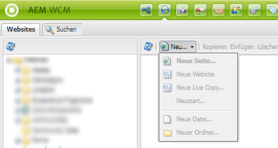
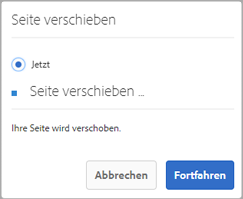
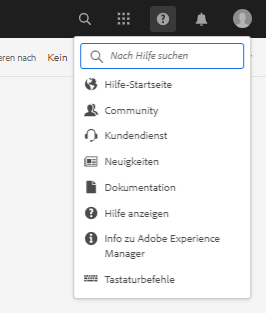
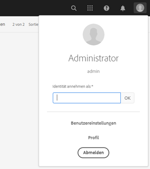

# Hotfixes und Feature Packs, die in den vorherigen Service Packs enthalten sind {#hotfixes-and-feature-packs-included-in-previous-service-packs}

## [!DNL Adobe Experience Manager] 6,5,8,0  {#experience-manager-6580}

[!DNL Adobe Experience Manager] 6.5.8.0 enthält neue Funktionen, wichtige von Kunden angeforderte Verbesserungen sowie Verbesserungen hinsichtlich Leistung, Stabilität und Sicherheit, die seit der Veröffentlichung der Version 6.5 im April 2019 veröffentlicht wurden. Das Service Pack ist auf [!DNL Adobe Experience Manager] 6.5 installiert.

Die wichtigsten Funktionen und Verbesserungen, die in [!DNL Adobe Experience Manager] 6.5.8.0 eingeführt wurden, sind:

<!-- TBD:
* Using the Connected Assets functionality, it is now possible to connect up to 3 [!DNL Sites] instances with 1 [!DNL Assets] instances. The configuration user interface now allows the administrators to provide the details of these [!DNL Sites] instances. -->

* Bei Verwendung der Funktion [Connected Assets](/help/assets/use-assets-across-connected-assets-instances.md) können Sie jetzt eine Liste aller [!DNL Sites]-Seiten anzeigen, die das Asset verwenden. Diese Verweise auf ein Asset sind auf der Seite [!UICONTROL Eigenschaften] eines Assets verfügbar. Dadurch erhalten Administratoren, Marketing-Experten und Bibliothekare einen vollständigen Überblick über die Asset-Nutzung, was eine bessere Nachverfolgung, Verwaltung und Markenkonsistenz ermöglicht.

* Beim Löschen eines Assets, auf das auf einer Webseite verwiesen wird, zeigt [!DNL Experience Manager] [eine Warnung](/help/assets/use-assets-across-connected-assets-instances.md#asset-usage-references) an. Sie können das Löschen eines referenzierten Assets erzwingen oder die Verweise überprüfen und ändern, die auf der Seite [!DNL Properties] des Assets angezeigt werden. Durch Klicken auf die Verweise werden die lokalen und Remote-Seiten [!DNL Sites] geöffnet.

* Sortieren der für den Rollout verfügbaren Live Copy-Seiten mithilfe der Eigenschaften [!UICONTROL Name], [!UICONTROL Letztes Änderungsdatum,] und [!UICONTROL Letztes Rollout-Datum].

* Das integrierte Repository (Apache Jackrabbit Oak) wird auf  1.22.6 aktualisiert. <!-- TBD: Mention the version -->

Eine vollständige Liste der in [!DNL Experience Manager] 6.5.8.0 eingeführten Funktionen und Verbesserungen finden Sie unter [Neue Funktionen in [!DNL Adobe Experience Manager] 6.5 Service Pack 8](new-features-latest-service-pack.md).

Im Folgenden finden Sie eine Liste der Fehlerbehebungen in [!DNL Experience Manager] Version 6.5.8.0.

### [!DNL Sites] {#sites-6580}

* Wenn eine Seite in einen Blueprint verschoben wird, wird das Ziel der Links nicht aktualisiert (NPR-35724).
* Der Tizen-basierte Player kann bei bestimmten Browsern nicht authentifiziert werden. Das Problem tritt bei Browsern auf, die das Attribut &quot;samesite=none&quot;nicht unterstützen (NPR-35589).
* Ein entsperrter responsiver Container zeigt keine zulässigen Komponenten an (NPR-35565).
* Wenn Sie eine Live Copy einer neu hinzugefügten Seite erstellen, erstellt der Übergeordnete Sprachcode zwei Kopien für jede Domäne (NPR-35545).
* Sperre in der SCR Component Registry, wenn viele Threads aufgrund von `org.apache.felix.scr.impl.ComponentRegistry` Timer blockiert werden. Daher reagiert [!DNL Experience Manager] nicht länger auf unbestimmte Zeit (GRANITE-33125,FELIX-6252).
* Wenn Sie ein bestimmtes Asset in der Seitenleiste suchen, enthält das Ergebnis einige nicht durchsuchte Assets (NPR-35524).
* Wenn Sie SSL für eine Experience Manager-Instanz aktivieren, wird der Kontextpfad entfernt (NPR-35477).
* Wenn Sie eine Liste erstellen, Text als erstes Element hinzufügen, eine Tabelle als zweites Element hinzufügen und eine Liste innerhalb der Tabelle hinzufügen, verzerrt die übergeordnete Liste (NPR-35465).
* Wenn Sie verschiedene Plugins für aufeinander folgende Listenelemente verwenden, wird den Listenelementen ein zusätzliches <br>-Tag hinzugefügt (NPR-35464).
* Wenn eine Liste zwischen zwei Absätzen platziert wird, können Sie der Liste keine Tabelle hinzufügen (NPR-35356).
* Wenn Sie ein Upgrade der AEM-Instanz von AEM 6.3 auf AEM 6.5 starten, dauert es länger, bis die Aktualisierungsinstanz gestartet wird (NPR-35323).
* Wenn Sie ein AEM Asset replizieren, das eine Klammer () enthält. im Namen schlägt die Replikation fehl (GRANITE-27004, NPR-35315).
* Wenn Sie einem Rich-Text-Editor Überschriften hinzufügen, ist die Absatzschaltfläche deaktiviert (NPR-35256).
* Wenn Sie ein Element zu einer vorhandenen Liste hinzufügen, wird die folgende ausblendbare oder umschaltbare Liste gelöscht (NPR-35206).
* Wenn die Option &quot;Rollout-Seite&quot;ausgewählt ist, wird ein Dialogfeld mit allen verfügbaren Live Copies angezeigt und der automatische Rollout erfolgt. Die Live Copies von Seiten werden für alle Regionen ohne Benutzeraktion bereitgestellt. (NPR-35138)
* Wenn Sie die Option Untergeordnete Elemente einschließen verwenden, werden nicht alle Seiten in der Option Veröffentlichung verwalten aufgelistet. Es werden nur 22 Seiten aufgelistet (NPR-35086).
* Wenn eine Richtlinie bearbeitet wird, behält die Textkomponente die Richtlinienänderungen nicht bei (NPR-35070).
* Beim Einzug einiger Elemente in eine nummerierte Liste behalten alle Elemente dieselbe Nummer bei, obwohl die Nummerierung für Artikel mit demselben Einzug bei 1 beginnen sollte (CQ-4313011).
* Wenn die Minimierung aktiviert ist, können Sie keine Seite oder Komponente bearbeiten. Die Probleme begannen nach der Installation von AEM 6.5 Service Pack 7 (CQ-4311133).
* Omni-Such- und Asset-Filter geben irrelevante oder keine Ergebnisse zurück (CQ-4312322, NPR-35793).
* Wenn mehrere Seiten gleichzeitig auf eine Client-Bibliothek zugreifen, kann der HTML-Bibliotheksmanager die Client-Bibliothek nicht laden. Dies führt zur falschen Darstellung von Seiten (NPR-35538).
* Der Kontextpfad wird automatisch entfernt, wenn Sie eine SSL in [!DNL Experience Manager] einrichten (NPR-35294).
* Der Paketmanager meldet Benutzer nicht ab, nachdem er auf die Option &quot;Abmelden&quot;geklickt hat (NPR-35160).

### [!DNL Assets] {#assets-6580}

[!DNL Adobe Experience Manager] 6.5.8.0  [!DNL Assets] behebt die folgenden Probleme und bietet die folgenden Verbesserungen.

* Beim Wiederherstellen einer vorherigen Version eines Assets wird das Ereignis DamEvent.Type RESTORED nicht in der OSGi-Konsole ausgelöst (NPR-35789).
* `IndexWriter.merge` verursacht  `OutOfMemoryError` Fehler, da Smart-Tagging-Funktionen große  `/oak:index/lucene` und  `/oak:index/ntBaseLucene` Indizes erstellen (NPR-35651).
* Beim Speichern eines Ordners vom Typ [!UICONTROL Asset-Beitrag] mit Multibyte-Zeichen im Namen wird eine Fehlermeldung angezeigt (NPR-35605).
* Wenn kaskadierende Metadaten-Untertypfelder verwendet werden, tritt der Fehler &quot;Bitte dieses Feld ausfüllen&quot;auf (NPR-35643).
* Wenn ein vorhandenes Asset in die [!DNL Assets]-Benutzeroberfläche gezogen und eine neue Version erstellt wird, sind die Änderungen in den Metadaten nicht persistent (NPR-34940).
* Beim Erstellen von Regeln im Metadatenschema-Editor für ein kaskadierendes Menü wiederholt die Option [!UICONTROL Abhängig von] denselben Namen (NPR-35596).
* Ähnlichkeitssuche funktioniert nicht nach der Bearbeitung von [!UICONTROL Asset-Admin-Suchschiene] (NPR-35588).
* Wenn Sie in einem Ordner die Asset-Suche in der linken Leiste öffnen, indem Sie auf [!UICONTROL Filter] klicken, funktioniert der Filter in [!UICONTROL Status] > [!UICONTROL Checkout] > [!UICONTROL Ausgecheckt] nicht (NPR-35530).
* Wenn Sie versuchen, alle Smart-Tags eines Assets zu löschen und die Änderungen zu speichern, werden die Tags nicht entfernt. Die Benutzeroberfläche zeigt jedoch an, dass die Änderungen gespeichert werden (NPR-35519).
* Benutzer können Assets in der Listenansicht nicht in einem sortierbaren Ordner neu anordnen oder sortieren (NPR-35516).
* Wenn Sie das Standard-Metadatenschema bearbeiten, wird das Feld &quot;Tags&quot;auf der Seite [!UICONTROL Eigenschaften] des Assets in ein Textfeld geändert. Die Änderung ermöglicht es unbekannten Benutzern, On-Demand-Tags hinzuzufügen, und die Tags werden als Zeichenfolge im Repository gespeichert (NPR-35478).
* Wenn Sie beim Herunterladen eines Assets einen Namen angeben, der keine gültige E-Mail-Adresse aufweist, ist die Download-Option nicht verfügbar. Wenn jedoch eine andere Option im Download-Dialogfeld ausgewählt ist, ist die Schaltfläche aktiviert, aber keine E-Mail gesendet (NPR-35365).
* Benutzer können keine Assets einchecken, nachdem sie diese in [!DNL Adobe InDesign] bearbeitet haben, und erhalten einen Fehler wegen fehlender Berechtigungen. (NPR-35341)
* Die Handlebars-JavaScript-Bibliothek wurde auf Version 4.7.6 aktualisiert (NPR-35333).
* Die Benutzeroberfläche des Metadaten-Editors funktioniert nicht mehr wie erwartet, wenn Sie mit der Massenbearbeitung von Metadaten beginnen und die Auswahl von Elementen aufheben, bis ein einzelnes Element ausgewählt bleibt (NPR-35144).
* Die globale Navigation öffnet nicht die richtige Konsole, wenn von der Seite `assets.html` aus darauf geklickt wird (CQ-4312311).
* [!DNL Assets] zeigt keine RGB-Wiedergabe für ein Asset mit RGB-Wiedergabe an (CQ-4310190).
* Die Option [!UICONTROL Relate] im Menü wird auf der Seite [!UICONTROL Eigenschaften] nicht richtig angezeigt (CQ-4310188).
* Wenn der Dateitypfilter für Dokumente verwendet wird, um Assets zu suchen und eine Smart-Sammlung zu erstellen, wird der Filter beim Zugriff auf die Sammlung nicht angewendet. Stattdessen werden alle Asset-Typen bei der Suche angezeigt (NPR-35759).
* Sie können keine Assets in eine Lightbox aus der [!DNL Assets]-Benutzeroberfläche ziehen (NPR-35901).
* Wenn nach dem Auflösen des Namenskonflikts eine neue Version eines vorhandenen Assets erstellt wird, werden die Metadaten des ursprünglichen Assets überschrieben. (CQ-4313594)
* Wenn Sie die Asset-Suche mit einem Suchfilter oder einer Eigenschaft filtern, ein Asset öffnen, um es anzuzeigen oder zu bearbeiten, und zur Seite mit den Suchergebnissen zurückkehren, funktioniert der Filter nicht. Alle gesuchten Assets werden ungefiltert aufgelistet (NPR-35913).

#### [!DNL Dynamic Media] {#dynamic-media-6580}

* Die URL-Option für die Bildvorgabe RESS ist auf der Asset-Detailseite aktiviert. Jetzt sind die Optionen URL und RESS auf der Seite mit den Asset-Details verfügbar, wenn die Bildvorgabe RESS im Abschnitt Dynamische Ausgabeformate ausgewählt ist. (CQ-4311241)
* Interaktive Medienkomponente: Interaktives Video funktioniert nicht, wenn der Benutzer über [!DNL Experience Manager] mit selektiver Veröffentlichungskonfiguration verfügt (CQ-4311054).
* Wenn Sie Assets über Ordner hinweg verschieben, erfolgt die Synchronisation zwischen [!DNL Experience Manager] und [!DNL Dynamic Media–Scene7] über die API nur sehr langsam (CQ-4310001).
* Bei Verwendung von Omnisearch nimmt die Größe der Protokolle erheblich zu (CQ-4309153).
* Wenn die selektive Synchronisierung aktiviert ist und ein Asset in einen Synchronisierungsordner kopiert (nicht verschoben) wird, wird es nicht wie erwartet synchronisiert. (CQ-4307122)
* Bei hochgeladenen Assets, die automatisch in DM veröffentlicht werden, zeigt der Status nicht Veröffentlicht auf AEM an. Außerdem zeigt die Statusspalte Dynamic Media-Veröffentlichung nicht den richtigen Veröffentlichungsstatus an (CQ-4306415).
* Wenn ein Asset auf [!DNL Experience Manager] veröffentlicht und bei Aktivierung auf [!DNL Dynamic Media] veröffentlicht wird, wird der Metadatenwert `scene7FileStatus` nicht erwartungsgemäß aktualisiert (CQ-4308269).
* Beim Bearbeiten des Videoprofils zeigt [!DNL Experience Manager] nicht die für die Videovorgabe festgelegten Höhen- und Bitratenwerte an. Die Felder erscheinen leer (CQ-4311828).

### [!DNL Commerce] {#commerce-6580}

* Es kann kein benutzerdefiniertes Tag für alle Produkte in Commerce erstellt werden (CQ-4310682).

* Die Aktualisierung der Produkt-Asset-Referenz führt dazu, dass Replikations-Threads sich im Wartezustand befinden, bis der ProductAssetListener-Thread seine Verpflichtungen zum JCR erfüllt (NPR-35269).

### Plattform {#platform-6580}

* Wenn Sie eine Coral Tab View-Komponente ohne Registerkarten verwenden und dann einen Foundation-Validator Trigger haben, tritt der folgende Fehler auf (NPR-35636):

   ```TXT
    Uncaught TypeError: Cannot set property 'invalid' of undefined
     at enable (foundation.js:10703)
     at foundation.js:10710
   ```

* Die Vorwärtsreplikation von SCD schlägt für Löschereignisse für Knoten fehl, die ein Komma im Namen enthalten (NPR-35191).

* Nach dem Upgrade auf AEM 6.5.7 schlagen die Builds fehl. Der Grund dafür ist, dass eine alte Version oder kein Jackson-Core in das uber-jar eingebettet ist (GRANITE-33006).

### Benutzeroberfläche {#ui-6580}

* Wenn Sie von der Karten- zur Listenansicht für Dokumente in einem Ordner in der Assets-Konsole wechseln, funktioniert die Sortierung nicht ordnungsgemäß. (NPR-35842)

* Wenn Sie Text in einer Textkomponente per Hyperlink verknüpfen, zeigt die Suchfunktion keine geeigneten Ergebnisse an (NPR-35849).

* Wenn ein Wert nicht für ein ausgeblendetes Feld bereitgestellt wird, das als erforderlich markiert ist, verhindert er das Speichern einer Komponente (NPR-35219).

### Integrationen {#integrations-6580}

* Wenn Sie verschiedene Werte für die IMS-Mandanten-ID und den Target-Client-Code verwenden, kann [!DNL Experience Manager] nicht mit [!DNL Adobe Target] integriert werden (NPR-35342).

### Übersetzungsprojekte {#translation-6580}

* Probleme beim Exportieren oder Importieren eines Übersetzungsauftrags in [!DNL Experience Manager] (NPR-35259).

### Campaign {#campaign-6580}

* Wenn Sie eine Kampagnenseite mit einer nativen Vorlage in der Touch-optimierten Benutzeroberfläche erstellen und die Registerkarte &quot;E-Mail&quot;im Dialogfeld &quot;Seiteneigenschaften&quot;öffnen, bleibt die Personalisierungsvariable für die Betreff- und Textkörperfelder deaktiviert (CQ-4312388).

### [!DNL Communities] {#communities-6580}

* Beim Hinzufügen einer Seitenstruktur zu einer Community-Gruppe wird der Titel [!UICONTROL Gruppe] im Breadcrumb in den Titel der ersten [!UICONTROL Seite] geändert (NPR-35803).
* Im Gegensatz zu Moderatoren kann ein Standard-Community-Mitglied keinen Beitragsentwurf aufrufen und bearbeiten (NPR-35339).
* Beschädigte Zugriffskontrolle und Dienstverweigerung mit `DSRPReindexServlet`, wodurch die Communities-Site heruntergefahren wird, bis die Indizierung abgeschlossen ist (NPR-35591).
* Wenn Sie [!UICONTROL Alle Benutzer] aus dem Feld [!UICONTROL Administratoren] entfernen, werden sie nicht tatsächlich aus dem Backend entfernt (NPR-35592, NPR-35611).
* Die Komponente [!UICONTROL Nachricht erstellen] gibt kein Ergebnis zurück, wenn der eingegebene Text eine Teilübereinstimmung aufweist (NPR-35666).

* Sie werden möglicherweise einige Leistungseinbußen und Langsamkeit bemerken, wenn Sie versuchen, Tags zu einem neuen Blog hinzuzufügen, indem Sie **[!UICONTROL Tags hinzufügen]** auswählen. Um die Leistung zu verbessern, installieren Sie [cqTagLucene-0.0.1.zip hotfix](https://experience.adobe.com/#/downloads/content/software-distribution/en/aem.html?package=/content/software-distribution/en/details.html/content/dam/aem/public/adobe/packages/cq650/hotfix/cqTagLucene-0.0.1.zip).

### [!DNL Brand Portal] {#brandportal-6580}

* Beim Hinzufügen eines Mitglieds zu einem Ordner vom Typ [!UICONTROL Asset-Beitrag] wird in der Benutzeroberfläche die Beschriftung [!UICONTROL Benutzer oder Gruppe hinzufügen] angezeigt, obwohl nur aktive Brand Portal-Benutzer unterstützt werden und keine Gruppen (NPR-35332).

### [!DNL Forms] {#forms-6580}

>[!NOTE]
>
>[!DNL Experience Manager Forms] veröffentlicht die Add-On-Pakete eine Woche nach dem geplanten Veröffentlichungsdatum der [!DNL Experience Manager] Service Packs.

**Adaptive Formulare**

* Wenn Sie eine Tabelle mit einer wiederholbaren Zeile in ein wiederholbares Bedienfeld einfügen, das mehrere Instanzen in einem adaptiven Formular hat, wird die Tabelle immer zur ersten Instanz des Bedienfelds hinzugefügt (NPR-35635).

* Wenn der Tabulatorfokus die CAPTCHA-Komponente erneut erreicht, nachdem er sie einmal in einem adaptiven Formular erfolgreich überprüft hat, zeigt [!DNL Experience Manager Forms] die Fehlermeldung `Provide Captcha phrase to proceed` an (NPR-35539).

**Interaktive Kommunikation**

* Wenn Sie ein übersetztes Formular senden, werden die Übermittlungsnachrichten auf Englisch angezeigt und nicht in die entsprechende Sprache übersetzt (NPR-35808).

* Wenn Sie eine Bedingung zum Ausblenden in die angehängte XDP- oder Dokumentfragmente einfügen, kann die interaktive Kommunikation nicht geladen werden. (NPR-35745)

**Korrespondenzverwaltung**

* Wenn Sie einen Brief bearbeiten, dauert das Laden der Module mit Bedingungen länger (NPR-35325).

* Wenn Sie ein Asset aus dem linken Navigationsbereich auswählen, das nicht in einem Brief enthalten ist, und dann das nächste Asset auswählen, wird die blaue Markierung nicht aus dem zuvor ausgewählten Asset entfernt (NPR-35851).

* Wenn Sie Textfelder in einem Brief bearbeiten, zeigt [!DNL Experience Manager Forms] die Fehlermeldung `Text Edit Failed` an (CQ-4313770).

**Arbeitsablauf**

* Wenn Sie versuchen, ein adaptives Formular in einer [!DNL Experience Manager Forms] Mobile App für iOS zu öffnen, reagiert die Anwendung nicht mehr. (CQ-4314825)

* Die Registerkarte [!UICONTROL To-do] im HTML-Arbeitsbereich zeigt HTML-Zeichen an (NPR-35298).

**XMLFM**

* Wenn Sie ein XML-Dokument mit dem Output-Dienst generieren, tritt der `OutputServiceException`-Fehler für einige der XML-Dateien auf (CQ-4311341, CQ-4313893).

* Wenn Sie die Eigenschaft &quot;Hochgestellt&quot;auf das erste Zeichen des Aufzählungszeichens anwenden, wird die Aufzählungsgröße kleiner (CQ-4306476).

* Die mit dem Output-Dienst generierten PDF forms enthalten keine Rahmen (CQ-4312564).

**Designer**

* Wenn Sie eine XDP-Datei in [!DNL Experience Manager Forms] Designer öffnen, wird eine Datei &quot;designer.log&quot;im selben Ordner wie die XDP-Datei generiert (CQ-4309427, CQ-4310865).

**HTML5-Formulare**

* Wenn Sie ein Kontrollkästchen in einem adaptiven Formular im Webbrowser [!DNL Safari] für [!DNL iOS 14.1 or 14.2] aktivieren, werden keine zusätzlichen Felder angezeigt (NPR-35652).

**Forms-Verwaltung**

* Keine Bestätigungsmeldung zum erfolgreichen Massen-Upload von XDP-Dateien in das CRX-Repository (NPR-35546).

**Dokumentensicherheit**

* Mehrere Probleme wurden für die Option [!UICONTROL Richtlinie bearbeiten] auf AdminUI gemeldet (NPR-35747).

### Bekannte Probleme bei [!DNL Experience Manager 6.5.8.0] {#known-issues}

* Wenn Sie Ihre [!DNL Experience Manager]-Instanz von 6.5 auf 6.5.8.0 aktualisieren, können Sie `RRD4JReporter` Ausnahmen in der Datei `error.log` anzeigen. Starten Sie die Instanz neu, um das Problem zu beheben.

* Wenn Sie [!DNL Experience Manager] 6.5 Service Pack 5 oder ein vorheriges Service Pack auf [!DNL Experience Manager] 6.5 installieren, wird die Laufzeitkopie Ihres benutzerdefinierten Asset-Workflow-Modells (erstellt in `/var/workflow/models/dam`) gelöscht.
Um Ihre Laufzeitkopie abzurufen, empfiehlt Adobe, die Entwurfszeitkopie des benutzerdefinierten Workflow-Modells mit der Laufzeitkopie mithilfe der HTTP-API zu synchronisieren:
   `<designModelPath>/jcr:content.generate.json`.

* Wenden Sie sich an die Kundenunterstützung von Adobe, wenn Sie beim Bearbeiten und Erstellen kaskadierender Regeln in [!UICONTROL Ordner-Metadatenschema-Forms-Editor] und [!UICONTROL Metadatenschema-Forms-Editor] Probleme mit dem Dialogfeld [!UICONTROL Regel definieren] haben. Die bereits erstellten und gespeicherten Regeln funktionieren erwartungsgemäß.

* Wenn ein Ordner in der Hierarchie in [!DNL Experience Manager Assets] umbenannt wird und der verschachtelte Ordner, der ein Asset enthält, in [!DNL Brand Portal] veröffentlicht wird, wird der Titel des Ordners erst dann in [!DNL Brand Portal] aktualisiert, wenn der Stammordner erneut veröffentlicht wird.

* Wenn ein Benutzer ein Feld zum ersten Mal in einem adaptiven Formular konfigurieren möchte, wird die Option zum Speichern einer Konfiguration nicht im Eigenschaftenbrowser angezeigt. Wenn Sie im selben Editor ein anderes Feld des adaptiven Formulars konfigurieren, wird das Problem behoben.

* Wenn der Assistent [!UICONTROL Konfiguration von Connected Assets] nach der Installation eine Fehlermeldung vom Typ 404 zurückgibt, müssen Sie die Pakete `cq-remotedam-client-ui-content` und `cq-remotedam-client-ui-components` mithilfe des Package Manager manuell neu installieren.

* Die folgenden Fehler und Warnmeldungen können während der Installation von Experience Manager 6.5.x.x angezeigt werden:
   * &quot;Wenn die Adobe Target-Integration in Experience Manager mithilfe der Target Standard-API (IMS-Authentifizierung) konfiguriert ist, führt der Export von Experience Fragments in Target dazu, dass falsche Angebotstypen erstellt werden. Anstelle des Typs „Experience Fragment“/der Quelle „Adobe Experience Manager“ erstellt Target mehrere Angebote mit dem Typ „HTML“/der Quelle „Adobe Target Classic“.
   * `com.adobe.granite.maintenance.impl.TaskScheduler`: Keine Wartungsfenster unter granite/operations/maintenance gefunden.
   * Die serverseitige Validierung des adaptiven Formulars schlägt fehl, wenn Aggregatfunktionen wie SUM, MAX und MIN verwendet werden. (CQ-4274424)
   * `com.adobe.granite.maintenance.impl.TaskScheduler` - Keine Wartungsfenster unter granite/operations/maintenance gefunden.
   * Hotspot in einem interaktiven Dynamic Media-Bild ist bei der Vorschau des Assets über den Viewer für Shop-fähige Banner nicht sichtbar.
   * `com.adobe.cq.social.cq-social-jcr-provider bundle com.adobe.cq.social.cq-social-jcr-provider:1.3.5 (395)[com.adobe.cq.social.provider.jcr.impl.SpiSocialJcrResourceProviderImpl(2302)]` : Zeitüberschreitung, die darauf wartet, dass die Reg-Änderung abgeschlossen und die Registrierung aufgehoben wird.

## [!DNL Adobe Experience Manager] 6,5,7,0  {#experience-manager-6570}

[!DNL Adobe Experience Manager] 6.5.7.0 ist ein wichtiges Update, das neue Funktionen, wichtige von Kunden angeforderte Verbesserungen sowie Leistungs-, Stabilitäts- und Sicherheitsverbesserungen enthält, die seit der Veröffentlichung der Version 6.5 im April 2019 veröffentlicht wurden. Das Service Pack ist auf [!DNL Adobe Experience Manager] 6.5 installiert.

Die wichtigsten Funktionen und Verbesserungen von [!DNL Adobe Experience Manager] 6.5.7.0 umfassen:

* Durchführen der Seitenverschiebungen und MSM-Rollouts als asynchrone Vorgänge, um deren Auswirkungen auf die Laufzeitleistung zu reduzieren.

* Benutzer können digitale Assets in der Karten- und Spaltenansicht sortieren.

* [!DNL Assets] und  [!DNL Dynamic Media] bieten mehrere Verbesserungen der Barrierefreiheit. Die Verbesserungen betreffen die Tastaturnavigation, die Verwendung von Bildschirmlesehilfen und die Möglichkeit für Benutzer, ähnliche Hilfstechnologien (AT) zu verwenden. Siehe [[!DNL Assets] Verbesserungen](#assets-6570) und [[!DNL Dynamic Media] Verbesserungen](#dynamic-media-6570).

* [HTTP-Client-Konfiguration des Formulardatenmodells ](../../help/forms/using/configure-data-sources.md#fdm-http-client-configuration) zur Leistungsoptimierung.

* [Verfügbarkeit der Option &quot;Zurücksetzen&quot;für jede ](../../help/forms/using/resize-using-layout-mode.md#resize-components) Komponente im Layout-Modus

* [!DNL Experience Manager] 6.5 Service Pack 7 Forms verbessert die Leistung für:

   * Validieren der Feldwerte auf dem Server beim Senden eines adaptiven Formulars.

   * Konvertieren eines PDF-Formulars in ein adaptives Formular mithilfe von [!DNL Automated Forms Conversion service].

* Unterstützung für [!DNL Microsoft SQL Server] 2019 in [!DNL Experience Manager Forms].

* Unterstützung für [!DNL Microsoft] SQL Server 2016 &quot;Always On&quot;-Verfügbarkeitsgruppen für hohe Verfügbarkeit für OSGi-Bereitstellungen.

* Das integrierte Repository (Apache Jackrabbit Oak) wird auf Version 1.22.5 aktualisiert.

Eine vollständige Liste der Funktionen und Verbesserungen, die in [!DNL Experience Manager] 6.5.7.0 eingeführt wurden, finden Sie unter [Neue Funktionen in [!DNL Adobe Experience Manager] 6.5 Service Pack 7](new-features-latest-service-pack.md).

Im Folgenden finden Sie eine Liste der Fehlerbehebungen in [!DNL Experience Manager] 6.5.7.0.

### [!DNL Sites] {#sites-6570}

* Wenn Sie die Option [!UICONTROL Zeitraffer] für eine Seite öffnen, die Option Timeline-Seitenleiste öffnen und zur Konsole [!UICONTROL Sites] navigieren, tritt der Fehler `Failed to Load` auf (NPR-34951).

* Die Option [!UICONTROL Timewrap] zeigt keine Bilder für den ausgewählten Datums- und Zeitbereich an (NPR-34951).

* Wenn ein Filter `getHeader()` von einer Seite aufruft, die ein Inhaltsfragment enthält, tritt der `java.lang.AbstractMethodError`-Fehler auf (NPR-34942).

* Wenn der Pfad einer Seite mehrere Inhaltszeichenfolgen enthält, schlagen die Vorschaudarstellung fehl und die Versionsvergleichsfunktion schlägt ebenfalls fehl (NPR-34740).

* Wenn Sie einen numerischen Wert für die Beschriftungseigenschaft `String` einer Komponente festlegen, können Sie die Komponente löschen und den Löschvorgang rückgängig machen. Nach dem Rückgängigmachen des Löschvorgangs ändert sich die Beschriftungseigenschaft jedoch von `String` in `Long` (NPR-34739).

* Die folgende Ausnahme tritt beim Hinzufügen eines Experience Fragment auf der Basis einer Vorlage mit gesperrtem Layout zu einer Seite auf (NPR-34632):

   ```TXT
   org.apache.sling.api.SlingException: Cannot get DefaultSlingScript: org.apache.sling.api.SlingException: Cannot get DefaultSlingScript: org.mozilla.javascript.EcmaError: TypeError: Cannot call method "getChildren" of null
   ```

* Wenn Sie einen Ordner verschieben, führt dies zu Querschnittsproblemen und der folgende Fehler tritt auf (NPR-34554):

   ```TXT
   org.apache.sling.api.SlingException: Cannot get DefaultSlingScript. org.apache.jackrabbit.oak.query.RuntimeNodeTraversalException: The query read or traversed more than 100000 nodes. To avoid affecting other tasks, processing was stopped
   ```

* Wenn neue Assets erstellt, veröffentlicht und an einen neuen Speicherort verschoben werden, wird der Workflow `Request to complete move operation` erstellt und führt zum Status Abgebrochen . Wenn Sie ein neues Asset hochladen und einen `move`-Vorgang ausführen, wird der Workflow `Request to complete move operation` im ausstehenden Status erstellt (NPR-34543).

* Wenn Sie ein Experience Fragment aus der Umgebung [!DNL Experience Manager] 6.5.2 in [!DNL Target] Standard exportieren, schlägt der API-Aufruf fehl, da die Workspace-Eigenschaft nicht für [!DNL Target] Standard verfügbar ist (NPR-34557).

* Benutzer können keine Seiten über die Option [!UICONTROL Veröffentlichung verwalten] veröffentlichen, da die Option [!UICONTROL Veröffentlichen] verschwindet (NPR-34542).

* Wenn Sie dem Text Stile hinzufügen, wird dem Text ein `<div>`-Tag hinzugefügt, und der Stil kann nicht mehr auf den Text angewendet werden (NPR-34531).

* Wenn Sie ein Element in einem Popup-Menü auswählen und die erforderlichen Dateien aktualisieren, ist es nicht möglich, Dialogfeldwerte zu speichern, da das andere Menü über ein leeres erforderliches Feld verfügt (NPR-34529).

* Wenn Sie eine Seite aus einer benutzerdefinierten Vorlage erstellen und in die Blueprint-Hierarchie verschieben, werden zuvor von der Seite gelöschte Komponenten auf der Seite innerhalb der Live Copy-Hierarchie angezeigt (NPR-34527).

* Nachdem ein Artikelstil auf einen Inhalt angewendet wurde, kann er nicht mehr entfernt werden (NPR-34486).

* Alle Live Copies und Kopien eines Experience Fragment verweisen auf dieselbe [!DNL Adobe Target] Angebots-ID (NPR-34469).

* Aufzählungslisten werden zusätzlich zur nummerierten Liste angezeigt (NPR-34455).

* Die Option Vergleich mit Quelle zeigt den Unterschied zwischen der Quellseite und der bearbeiteten Version einer Seite nicht an (NPR-34285).

* Wenn Sie eine Seite löschen, sind die Versionierungsdetails nicht konfigurierbar (NPR-34159).

* Wenn ein Benutzer die Dialogoption [!UICONTROL Auswahl öffnen] auswählt, wechselt der Tastaturfokus zum ausgeblendeten Steuerelement auf der Seite (CQ-4307779, CQ-4293601).

* Wenn Sie einen veröffentlichten Ordner in die Autoreninstanz verschieben, werden die Ordnerpfade in der Veröffentlichungsinstanz nicht entsprechend aktualisiert (CQ-4305144).

* Wenn ein Benutzer die `Enter`-Taste auf der Option [!UICONTROL Alle auswählen] auswählt, wird der Tastaturfokus nicht zur Option [!UICONTROL Kontrolle erstellen] verschoben (CQ-4293599).

* Wenn Sie den Schlüssel `Esc` auswählen, wird der Fokus nicht auf das übergeordnete Steuerelement wiederhergestellt (CQ-4293593, CQ-4293590).

* Verbesserte WCAG-Kompatibilität für die Benutzeroberfläche und Kernkomponenten [!DNL Sites] (CQ-4293448).

*  Zoom- und   Scalefunktionen sind für die  [!DNL Sites Editor] Seite deaktiviert (CQ-4282353).

* Nachdem Sie die Option Nach rechts drehen verwendet haben, stoppt die Bildschirmlesehilfe die Anzeige des aktuellen Drehungs- oder Flip-Status (CQ-4282128).

* Die Dialogfelder &quot;Fertig&quot;und &quot;Abbrechen&quot;verfügen über mehr als eine Tabstopps (CQ-4274601).

* Das Verschieben von Seiten mit einem ähnlichen Namen auf derselben Ebene ist nicht zulässig (NPR-35041).

* Nach Auswahl der Option Löschen (x) wird der Tastaturfokus nicht zum Feld [!UICONTROL Filter] verschoben (CQ-4293581).

* Wenn Sie auf [!DNL Experience Manager] 6.5.6.0 aktualisieren, ändert sich das Verhalten des geerbten Absatzsystems und es funktioniert nicht ordnungsgemäß (NPR-35117).

* Tastaturbenutzer können den Tabulatorfokus nicht in die richtige Reihenfolge verschieben, nachdem sie den Abschnitt [!UICONTROL Aktion] auf einer [!DNL AEM Sites]-Seite ausgewählt haben (CQ-4307786).

* Nachdem Sie beim Bearbeiten eines Inhaltsfragments in der RTE-Symbolleiste in der Liste des Link-Zielmenüs eine Option ausgewählt haben, flackert das Dialogfeld &quot;Inhaltsfragmentautor&quot;langsam. (CQ-4305532)

* Tastaturbenutzer können die Optionen nicht in der Dropdown-Liste [!UICONTROL Komponente hinzufügen] mit der Nach-unten-Pfeiltaste auswählen (CQ-4295097).

* Der Tab-Fokus wechselt nicht in die richtige Reihenfolge, wenn Sie ein Datum aus dem Kalendermenü auf der Registerkarte [!UICONTROL Assets] einer [!DNL Sites]-Seite auswählen (CQ-4293600).

* Der Tab-Fokus wechselt nicht zu den nächsten oder vorherigen Optionen für Tastaturbenutzer, nachdem die beim Bearbeiten einer Sites-Seite verfügbaren Link- oder Text-Optionen gelöscht wurden (CQ-4293597).

* Tastaturbenutzer können den Tabulator-Fokus nicht wieder zurück zu Mehr Optionen im Abschnitt [!UICONTROL Aktionen] verschieben, nachdem sie die verfügbaren Optionen angezeigt und die `Esc`-Taste gedrückt haben (CQ-4293592).

* Wenn Sie die Option [!UICONTROL Drehen] für ein Bild im Modus [!UICONTROL Bearbeiten] aktivieren, wird der Tabulatorfokus für die Tastaturbenutzer auf die Option [!UICONTROL Wiederholen] verschoben, anstatt auf Drehen zu bleiben (CQ-4293587).

* Im Dialogfeld [!UICONTROL Auswahl öffnen], das auf der Registerkarte [!UICONTROL Link und Aktionen] verfügbar ist, wechselt der Tab-Fokus nach der Option [!UICONTROL Abbrechen] zu ausgeblendeten Elementen auf der Seite (CQ-4293579).

* Wenn Tastaturbenutzer ein Bild bearbeiten, zur Option [!UICONTROL Beenden] navigieren und die Eingabetaste drücken, wird der Abschluss von den Bildschirmlesehilfen nicht angekündigt (CQ-4282351).

* Die Optionen &quot;Nach oben&quot;und &quot;Nach unten&quot;im Dialogfeld [!UICONTROL Link und Aktionen] stehen den Benutzern der Bildschirmlesehilfe und der Tastatur nicht zur Verfügung (CQ-4281120).

* Tastaturbenutzer können den Tabulatorfokus nicht wiederherstellen, nachdem sie zur Option Schließen (X) auf der Seite [!UICONTROL Eigenschaften] navigiert sind (CQ-4293581, NPR-34653).

### [!DNL Assets] {#assets-6570}

[!DNL Adobe Experience Manager] 6.5.7.0  [!DNL Assets] behebt die folgenden Probleme und bietet die folgenden Verbesserungen.

* Die folgenden Erweiterungen werden für Barrierefreiheit in [!DNL Experience Manager Assets] in dieser Version vorgenommen. Weitere Informationen finden Sie unter [Funktionen für die Barrierefreiheit in [!DNL Assets]](/help/assets/accessibility.md).

   * Beim Navigieren in der Timeline mit einer Tastatur kann die `Esc`-Taste die Option [!UICONTROL Alle anzeigen] ausblenden, ohne den Fokus zu verlieren (CQ-4293598).
   * Beim Navigieren mit der Tabulatortaste der Tastatur behält das Tag-Feld den Fokus, nachdem es das letzte Tag aus den hinzugefügten Tags entfernt hat (NPR-35109).
   * [!DNL Experience Manager] -Komponenten enthalten jetzt die entsprechenden Informationen für Namen, Rolle und Wert, die von Sprachausgaben verwendet werden sollen (NPR-34255).
   * Nachdem Sie das Kombinationsfeld Typ/Größe, das Kombinationsfeld Link, das Sprachkombinationsfeld oder das Textfeld löschen, kehrt der Tastaturfokus zum nächsten oder vorherigen Element der Benutzeroberfläche oder zu einem relevanteren Element der Benutzeroberfläche zurück (CQ-4293585).
   * Wenn Sie den Mauszeiger über Optionen bewegen, werden Tipps wie „Auswählen“ und „Herunterladen“ angezeigt. Benutzer, die eine Bildschirmlupe verwenden, können die Miniaturansichten der Dateien wegen dieser Tipps möglicherweise nicht sehen. Es ist jetzt möglich, den Fokus beizubehalten, nachdem die Option mit der `Escape`-Taste entfernt wurde. (CQ-4293554).
   * Bei Auswahl einer Rasterzelle aus dem Raster auf der Seite wechselt der Fokus auf die Aktionsleiste, die auf dem Bildschirm angezeigt wird (CQ-4282127).
   * Visuelle Benutzer können zwischen normalem Text und einem Link unterscheiden, da visuelle Hinweise (Unterstreichen- und Chevron-Symbol) für Links zu allen Lösungen auf der Homepage von [!DNL Experience Manager] angezeigt werden (CQ-4282072).

* Die folgende Verbesserung des Benutzererlebnisses erfolgt in [!DNL Assets]:

   * Aktivieren Sie das Sortieren von Assets in der Karten- und Spaltenansicht (NPR-35097).

* Wenn nach dem Upgrade auf 6.5 eine JSON-Datei mithilfe der Assets-HTTP-API generiert wird, treten Probleme mit der in der Datei verwendeten Kodierung auf (NPR-35129).

* Benutzer einer Gruppe, denen keine Berechtigung zum Erstellen von Sammlungen erteilt wurde (die Option Sammlung erstellen ist nicht verfügbar), können weiterhin Sammlungen erstellen, indem sie direkt auf die URL `https://[aem_server]:[port]/mnt/overlay/dam/gui/content/collections/createcollectionwizard.html/content/dam/collections?contentPath=/content/dam/collections` zugreifen (NPR-35115).

* Bei Sortierung nach Namen werden die gesuchten Assets nach Groß- und Kleinschreibung sortiert. Dadurch werden zwei separate sortierte Listen erstellt, die auf Groß- und Kleinschreibung basieren, die in den Suchergebnissen in geordneter Weise angezeigt werden (NPR-35068).

* Wenn ein Inhaltsfragment im Editor geöffnet wird, werden Warnmeldungen (`Invalid value specified for a metadata property`) in den Fehlerprotokollen protokolliert (NPR-35012).

* Benutzer ohne Administratorberechtigungen können abgelaufene Assets mit dem [Experience Manager]-Desktop-Programm bearbeiten. (NPR-34993).

* Wenn dasselbe Asset auf die Assets-Benutzeroberfläche gezogen und eine neue Version erstellt wird, sind die Änderungen in den Metadaten nicht persistent (NPR-34940).

* Beim Bearbeiten von Sammlungen kann ein Benutzer den Titel der Sammlung löschen und die Änderungen erfolgreich speichern (NPR-34889).

* Beim Hochladen eines doppelten Bildes wird eine Löschoption angezeigt. Durch Auswahl von Löschen werden die Bilder hochgeladen. Der Workflow DAM-Update-Asset wird ebenfalls ausgelöst (NPR-34744).

* Bei Verwendung von [!DNL Adobe Asset Link] mit [!DNL Adobe InDesign] enthalten die Suchergebnisse keine Ordner und Sammlungen, sondern nur Assets (NPR-34699, CQ-4303666).

* Wenn Sie mit dem Mauszeiger auf die Kartenansicht zeigen, wird der Bildschirm durch (automatische) Fokussierung auf die verfügbaren Schnellaktionen auf der Karte gescrollt. (NPR-34514)

* Wenn Sie die Eigenschaften mehrerer Assets in großen Mengen bearbeiten, wird durch die Auswahl der Option [!UICONTROL Speichern] die Bulk Editor-Ansicht geschlossen und zur Hauptseite [!DNL Assets] umgeleitet. Dieses Verhalten entspricht dem Verhalten der Option [!UICONTROL Speichern und schließen] und ist nicht zu erwarten (NPR-34546).

* Die Smart-Sammlung enthält nach dem Speichern nicht die richtige Einstellung für die Benutzeroberfläche. Die Abfrage wird ordnungsgemäß gespeichert, aber die Benutzeroberfläche zeigt immer das zuletzt hinzugefügte Optionsprädikat an (NPR-34539).

* Beim Hinzufügen von Assets zu [!DNL Experience Manager] werden die Metadaten ohne Namespace nicht importiert (NPR-34530).

* Beim Ziehen eines Assets auf einen Ordner zum Verschieben zeigt die Benutzeroberfläche auch die Option [!UICONTROL In Lightbox ablegen] und [!UICONTROL In Sammlung ablegen] an. Selbst wenn der Verschiebungsvorgang abgebrochen wird, zeigt die Benutzeroberfläche weiterhin die beiden letztgenannten Optionen an (NPR-34526).

* Das Symbol `%>` wird auf der Sammlungsseite angezeigt (NPR-34499).

* In der Spaltenansicht zeigt [!DNL Assets] doppelte Ordner- und Asset-Namen an, wenn Sie nach oben und unten scrollen, bevor alle Assets angezeigt werden. (NPR-34464)

* Wenn Sie unmittelbar nach dem Erstellen eines öffentlichen Ordners einen privaten Ordner erstellen, verwendet der öffentliche Ordner die privaten Ordnereinstellungen (NPR-34415).

* In der Kartenansicht werden die Karten nicht in alphabetischer Reihenfolge aufgelistet und Karten können nicht alphabetisch sortiert werden. (NPR-34234)

* Beim erneuten Öffnen kaskadierender Regeln werden die Optionen auf der Benutzeroberfläche nicht beibehalten (CQ-4301452).

#### [!DNL Dynamic Media] {#dynamic-media-6570}

* Die folgenden Verbesserungen wurden für die Barrierefreiheit in [!DNL Dynamic Media] vorgenommen (CQ-4290306). Weitere Informationen finden Sie unter [Barrierefreiheitsfunktionen in [!DNL Dynamic Media]](/help/assets/accessibility-dm.md).

   * Bildschirmlesehilfen (JAWS, Erzähler) beschreiben den Namen, die Rolle und den Status der Menüelemente in der Menüoption Einbettungsgröße (CQ-4290927).
   * Benutzer können über die Taste `Tab` im Dialogfeld &quot;E-Mail-Link&quot;navigieren (CQ-4290926).
   * Der Workflow zum Erstellen von Videokodierungsprofilen ist angesichts der Verbesserungen der Bildschirmlesehilfe benutzerfreundlicher (CQ-4290623, CQ-4290622).
   * Beim Navigieren mit der `Tab`-Taste wechselt der Fokus auf die entsprechenden Elemente der Benutzeroberfläche im Workflow, um ein interaktives Video zu erstellen (CQ-4290621, CQ-4290620, CQ-4290619).
   * Die Seiten „Veröffentlichen“, „Asset bearbeiten“, „Smartes Zuschneiden bearbeiten“ und „Bildset-Editor“ wurden verbessert, um den Web-Standards zu entsprechen. Benutzer von Hilfstechnologien (AT) können jetzt einfach auf diesen Seiten navigieren und Aktionen wie Zuschneidebilder durchführen (CQ-4290617, CQ-4290616, CQ-4290613, CQ-4290612, CQ-422) 90610, CQ-4290614).
   * Die Viewer wurden verbessert, damit Benutzer über eine Tastatur navigieren können (CQ-4290615).
   * Die Benutzer der Tastatur und der Bildschirmlesehilfe können die Zuschnittfunktion verwenden (CQ-4290609).
   * Die Tastaturbenutzer können die Hotspots besser verwalten (CQ-4290604, CQ-4290603).

* Remote-Bildsets können in [!DNL Experience Manager] nicht bearbeitet werden, wenn Firmenname und Ordnername identisch sind (NPR-31340).

* Die z-index-Reihenfolge ist falsch, wenn Sie versuchen, die Ausgabe in der Vorschau anzuzeigen, nachdem Sie einen Hotspot zu einem [!DNL Dynamic Media]-Bild hinzugefügt oder ein [!DNL Dynamic Media]-Video oder ein [!DNL Experience Fragment] mit einem Bild bearbeitet haben (CQ-4307267).

* [!DNL Dynamic Media] Die Synchronisierung schlägt fehl, wenn gemischte Mediensets erneut verarbeitet werden (CQ-4307184).

* Wenn ein Asset in einen Ordner verschoben wird, in dem die automatische Synchronisierung zu [!DNL Dynamic Media] konfiguriert ist, wird das Asset nicht synchronisiert (CQ-4307122).

* [!DNL Dynamic Media] Video wird auf iOS-Geräten nicht mit den nativen HTML5-Video-Steuerelementen wiedergegeben (CQ-4306977, CQ-4306727).

* Bilder, auf die SmartCrop angewendet wird, können nicht heruntergeladen werden. (CQ-4304558)

* Es ist nicht möglich, Ordner selektiv in Dynamic Media zu veröffentlichen (CQ-4304526).

* Wenn Sie die Veröffentlichung einer Videodatei aus [!DNL Experience Manager] rückgängig machen, wird die Veröffentlichung des adaptiven Videosets in einer konfigurierten Scene7-Bereitstellung nicht rückgängig gemacht. (CQ-4304405)

* Das Hinzufügen eines Panorama-Bild-Assets in einer Panorama-Medienkomponente und das Aktualisieren der Seite führt zum Fehler `Uncaught ReferenceError: $ is not defined` (CQ-4302810).

* Im [!UICONTROL Viewer-Vorgaben-Editor] ist bei der Bearbeitung der Vorgabe [!UICONTROL PanoramicImage/PanoramicImage_VR] in der Komponente `PanoramicView` die Modifikatorbeschriftung `PANORAMICVIEW_AUTOROTATE` nicht verfügbar (CQ-4302443).

* Videobeschriftungen werden nicht angezeigt, wenn das Video nicht das erste in einem MixedMediaSet ist (CQ-4298161).

* Der HTML5-E-Katalog-Viewer auf Mobilgeräten mit iPhones kann die Seiten nicht drehen oder die Seiten spiegeln (CQ-4296611).

* Beim Scrollen von Farbfeldern auf einem Mobilgerät werden die Farbfelder einige Sekunden lang nach rechts und aus dem sichtbaren Bereich gescrollt, bevor sie wieder in die Ansicht verschoben werden (CQ-4296439).

* Wenn ein Übergeordneter Datensatz der Viewer-Vorgabe erstellt wird, werden das CSS und das Bildmaterial nicht veröffentlicht und nur die Viewer-Vorgabe wird veröffentlicht. (CQ-4262205)

* Beim Versuch, ein Experience Fragment für einen bestimmten Hotspot in der Komponente [!UICONTROL Interaktives Video/Bilder] zu verknüpfen, wird der ausgewählte Experience Fragment-Pfad nicht angezeigt. Stattdessen wird ein leerer Wert aus dem Pfadfeld zurückgegeben (NPR-35146, CQ-4298136).

* Die Vorschau eines Experience Fragment im IVV-Editor kann nicht angezeigt werden (CQ-4308560).

* Beim Hinzufügen eines Hotspots zu einem Bild und Auswählen eines Experience Fragment ist es nicht möglich, die Unterordner und Varianten des Experience Fragment auszuwählen (CQ-4307455).

* Die Nicht-Bild-Assets werden nach dem Hochladen nicht als veröffentlicht angezeigt (CQ-4306415).

#### [!DNL Experience Manager] 3D-Assets  {#three-d-assets-6570}

* `DAM CQ MIME Type` -Dienst wendet falsche MIME-Typen auf 3D-Assets an, was zu falschem Rendering führt (NPR-34731).

### [!DNL Commerce] {#commerce-6570}

* In der Commerce-Produktsammlungs-Benutzeroberfläche werden nicht mehr als 15 Produkte innerhalb einer Sammlung aufgelistet (NPR-34502).

### Plattform {#platform-6570}

* Eine HTTP-Sitzung über HTTPS wird nicht ungültig gemacht (NPR-35083).
* Beim Starten von täglichen oder wöchentlichen Wartungsaufgaben über die Benutzeroberfläche wird ein `NullPointerException` zurückgegeben. (NPR-34953)
* Der W3C-Validator meldet Warnungen für konforme JavaScript-Dateien der Client-Bibliothek (NPR-34898).
* Die Funktion `AudienceOmniSearchHandler` verwendet einen veralteten Index (NPR-34870).
* Durch Abmelden von Experience Manager werden die Cookies nicht gelöscht (NPR-34743).
* Die Funktion `findByTitle` der API `TagManager` funktioniert nicht, wenn der Tag-Name ein Sonderzeichen enthält (NPR-34357).
* Der Prozess zum Importieren des Benutzersynchronisierungspakets schlägt fehl (NPR-34399).
* Unterstützung für `ariaLabel`- und `ariaLabelledby`-Eigenschaften zur Komponente `Coral.Masonry` hinzugefügt. (GRANITE-29962)
* Der Dispatcher-Cache wird für Seiten mit Inhaltsfragmenten nach der Installation der neuesten Kernkomponentenpakete nicht aktualisiert (CQ-4306788).
* Lokalisierte Tag-Namen mit Anführungszeichen (`"`) werden in der Benutzeroberfläche nicht richtig angezeigt (CQ-4305439).

### Benutzeroberfläche {#ui-6570}

* Das Feld [!UICONTROL Link zu] in den Komponenteneigenschaften zeigt autocomplete-Vorschläge an, die nicht mit der angegebenen Zeichenfolge übereinstimmen (NPR-34865).

* AEM zeigt die folgende Fehlermeldung an, wenn Sie ein tägliches Wartungsfenster zwischen 2 Tagen planen (NPR-35280):

   ```TXT
   ERROR The start time must precede (be less than) the end time
   ```

### Integrationen {#integrations-6570}

* Die Bearbeitung einer vorhandenen [!DNL Adobe Launch]-Konfiguration schlägt fehl (NPR-35045).
* Export von [!DNL Experience Fragments] nach [!DNL Adobe Target] bei Verwendung der IMS-Konfiguration und der [!DNL Adobe Target Standard]-Umgebung nicht möglich (NPR-34555).
* Die Option [!UICONTROL Erstellen] wird auf der Seite [!UICONTROL Zielgruppen] angezeigt, wenn Sie von einem Ordner zur Seite [!UICONTROL Zielgruppen] navigieren (NPR-35151).

### Sling {#sling-6570}

* Die standardmäßige Konsistenzprüfung für die Anmeldung überprüft die Anmeldeinformationen eines Benutzers, der nicht vorhanden ist (NPR-34686).

### Übersetzungsprojekte {#translation-6570}

* Beim Abbrechen eines Übersetzungsprojekts in [!DNL Experience Manager] wird die Anforderung, es abzubrechen, nicht an den Übersetzungsanbieter gesendet (NPR-34433).

### [!DNL Communities] {#communities-6570}

* Alle Fälle ungleicher Terminologie im Produkt werden durch anerkannte Äquivalente ersetzt (NPR-34311).
* [!DNL Google+] wird aus der Liste der Social-Sharing-Optionen entfernt (NPR-33877).

### [!DNL Brand Portal] {#brandportal-6570}

* Die Benutzeroberfläche reagiert nicht auf die Auswahl der Assets in der [!UICONTROL Listenansicht] (NPR-34728).

### [!DNL Forms] {#forms-6570}

>[!NOTE]
>
>[!DNL Experience Manager Forms] veröffentlicht die Add-On-Pakete eine Woche nach dem geplanten Veröffentlichungsdatum der [!DNL Experience Manager] Service Packs.

>[!NOTE]
>
>[!DNL Experience Manager] Service Pack enthält keine Korrekturen für  [!DNL Forms]. Sie werden mithilfe eines separaten [!DNL Forms] Add-On-Pakets bereitgestellt. Darüber hinaus wird ein kumulatives Installationsprogramm veröffentlicht, das Fehlerbehebungen für [!DNL Experience Manager Forms] auf JEE enthält. Weitere Informationen finden Sie unter [AEM Forms-Add-on installieren](#install-aem-forms-add-on-package) und [AEM Forms on JEE installieren](#install-aem-forms-jee-installer).

**Adaptive Formulare**

* Adaptive Formulare können nach dem Anwenden von [!DNL Experience Manager] Service Pack 6 nicht mit der klassischen Benutzeroberfläche bearbeitet werden (NPR-35126).

* Wenn Sie eine PDF-Datei in ein adaptives Formular konvertieren, können Sie keinen Wert für ein verschachteltes Bedienfeld festlegen, das ein Formulardatenmodell im Layout mit Registerkarten verwendet. Darüber hinaus gibt es Probleme beim dynamischen Festlegen eines Werts für Optionsfeldgruppen mit einem statischen Array mithilfe des Code-Editors (NPR-35062).

* Wenn Sie japanische Zeichen in eine Textfeldkomponente in ein adaptives Formular eingeben, können Sie mehr Zeichen als die maximal zulässige Zeichenanzahl von 35 Zeichen festlegen (NPR-35039).

* Das adaptive Formular zeigt unerwünschte Parameter wie `owner` und `status` auf der **[!UICONTROL Dankeseite]** an, die nach dem Senden des Formulars angezeigt wird (NPR-34989).

* Das Dialogfeld [!UICONTROL Dateiauswahl] für die Komponente [!UICONTROL Anhang] zeigt die nicht unterstützten Dateitypen sowie die Auswahl an, was zu einem Fehler bei der Übermittlung des adaptiven Formulars führt (NPR-34970).

* Wenn Sie ein adaptives Formular in eine [!DNL Experience Manager Sites]-Seite einfügen, die Text vor dem Formular enthält, wird der Cursor direkt auf das Formular verschoben, anstatt auf den Text vor dem Formular (NPR-34947).

* [!UICONTROL Die Vorschau mit ] Datenoption zum Vorausfüllen eines adaptiven Formulars mit einer XML-Datendatei  [!DNL Experience Manager] 6.2 funktioniert nicht ordnungsgemäß (NPR-35087).

* Wenn Sie das Datenwörterbuch für ein adaptives Formular aktualisieren, wird das Formular nicht übersetzt, da das adaptive Formular zwischengespeicherte Werte zurückgibt (NPR-34845).

* Das Laden von Fragmenten in einem adaptiven Formular dauert aufgrund der Cache-Invalidierung länger. (NPR-34567)

* Die Registerkartennavigation funktioniert nicht ordnungsgemäß für Bildschirmlesehilfen in einem adaptiven Formular (NPR-34544).

**Korrespondenzverwaltung**

* Werte für XML-Tags mit numerischen Daten, die den Float-Typ enthalten, können nicht als Entwurf gespeichert werden (NPR-35050).

* Wenn Sie die Assets aus ES3 migrieren, enthalten die Assets zwei nicht bearbeitbare Standardbedingungen (NPR-34972).

* Wenn Sie ein Datenwörterbuch in einem Brief bearbeiten, zeigt der Abschnitt [!UICONTROL Lent Content] Rechtecke anstelle nützlicher Informationen an (NPR-34853).

**Interaktive Kommunikation**

* Der Rollout-Konfigurationsname für die interaktive Kommunikation, der nach der Installation des Add-On-Pakets [!DNL Forms] verfügbar ist, dupliziert den standardmäßigen Rollout-Konfigurationsnamen (NPR-34976).

**Dokumentensicherheit**

* Wenn Sie eine neue Document Security-Richtlinie speichern, zeigt Experience Manager Forms die Fehlermeldung `Relative validity period is required` an (NPR-34679).

* Document Security kann PDF 2.0-Dokumente nicht schützen (CQ-4305851).

Informationen zu Sicherheitsupdates finden Sie auf der Seite [Experience Manager-Sicherheitsbulletins](https://helpx.adobe.com/security/products/experience-manager.html).

## [!DNL Adobe Experience Manager] 6,5,6,0  {#experience-manager-6560}

Adobe Experience Manager 6.5.6.0 ist ein wichtiges Update, das neue Funktionen, wichtige von Kunden angeforderte Verbesserungen sowie Leistungs-, Stabilitäts- und Sicherheitsverbesserungen enthält, die seit der allgemeinen Verfügbarkeit von Version 6.5 in **April 2019** veröffentlicht wurden. Es kann auf Adobe Experience Manager 6.5 installiert werden.

Die wichtigsten Funktionen und Verbesserungen von Adobe Experience Manager 6.5.6.0 umfassen:

* Veröffentlichen Sie Assets mithilfe des Assistenten [!UICONTROL Quick Publish] oder [!UICONTROL Veröffentlichung verwalten] selektiv oder machen Sie die Veröffentlichung rückgängig.[!DNL Experience Manager][!DNL Dynamic Media]

* Verwenden Sie die [!DNL Dynamic Media]-Benutzeroberfläche, um zwischengespeicherten Inhalt des Content Delivery Network (CDN) ungültig zu machen.

* Das Veröffentlichen der Asset-Beitragsordner von Brand Portal in Experience Manager Assets wird jetzt auch über den Proxyserver unterstützt.

* Die automatisch generierten Gruppen des privaten Ordners werden jetzt beim Löschen des privaten Ordners in [!DNL Experience Manager Assets] bereinigt.

* Die Beschreibungen der Modifikatoren im Video [!UICONTROL Viewer] Vorgabeneditor wurden in [!DNL Dynamic Media] aktualisiert.

* Es wird eine neue Unternehmenseinstellung bereitgestellt, die den Status des Connectors [!DNL Dynamic Media] widerspiegelt.

* Die Standardoptionen für `test` und `aiprocess` werden von `Rasterize` zuvor in Dynamic Media auf `Thumbnail` aktualisiert, um sicherzustellen, dass Benutzer nur Miniaturansichten erstellen und die Seitenextraktion und Keyword-Extraktion überspringen müssen.

* [Vorausfüllen eines adaptiven Formulars auf dem Client](../../help/forms/using/prepopulate-adaptive-form-fields.md#prefill-at-client)

* [Formulardatenmodellintegration mit RESTful-APIs auf einem Server mit bidirektionaler SSL-Implementierung](../../help/forms/using/configure-data-sources.md).

* [Verbesserte Zwischenspeicherung für übersetzte adaptive Formularseiten](../../help/forms/using/configure-adaptive-forms-cache.md).

* Unterstützung für [Adobe Sign-Text-Tags im Automated forms conversion-Dienst](https://docs.adobe.com/content/help/en/aem-forms-automated-conversion-service/using/convert-existing-forms-to-adaptive-forms.html).

* Unterstützung für [Konvertieren farbiger Formulare in adaptive Formulare](https://docs.adobe.com/content/help/en/aem-forms-automated-conversion-service/using/convert-existing-forms-to-adaptive-forms.html) mithilfe von [!DNL Automated Forms Conversion service].

* Unterstützung für SMB 2- und SMB 3-Protokolle.

* Das integrierte Repository (Apache Jackrabbit Oak) wird auf Version 1.22.4 aktualisiert.

Eine vollständige Liste der in Experience Manager 6.5.6.0 eingeführten Funktionen und Verbesserungen finden Sie unter [Neue Funktionen in Adobe Experience Manager 6.5 Service Pack 6](new-features-latest-service-pack.md).

Im Folgenden finden Sie eine Liste der Fehlerbehebungen in [!DNL Experience Manager] 6.5.6.0.

### [!DNL Sites] {#sites-6560}

* Wählen Sie unter [!DNL Sites] oder [!DNL Screens] ein Projekt aus und klicken Sie auf [!UICONTROL Verwaltungsveröffentlichungen]. Benutzer können aufgrund von Fehlern in der Benutzeroberfläche nicht im Assistenten [!UICONTROL Veröffentlichung verwalten] fortfahren. Insbesondere funktioniert die Option [!UICONTROL Publish] nicht (NPR-34099).
* Die Position von iParsys (geerbtes Absatzsystem) wird nicht an die ursprüngliche Standardposition zurückgesetzt, nachdem die Optionen [!UICONTROL Vererbung abbrechen] oder [!UICONTROL Vererbung deaktivieren] deaktiviert wurden (NPR-34097).
* Wenn `RolloutConfigManagerFactoryImpl` keine Rollout-Konfiguration laden kann, wird nicht versucht, die fehlenden Konfigurationen zu laden. Es werden die zwischengespeicherten Konfigurationen zurückgegeben (NPR-34092).
* In der Text-Kernkomponente wird nach Verwendung der HTML-Bearbeitungsoption der Quelle die Klasse aus dem Tag `em` entfernt (NPR-34081).
* Nach der Aktualisierung von Experience Manager 6.3.3 auf Experience Manager 6.5.3 dauert das Rollout viel länger und der Rollout schlägt mit einem Timeout-Fehler fehl (NPR-34049).
* `htmlwriter` kodiert die Attributwerte nicht zurück. Das im XF-Markup vorhandene Markup wird mit dekodierten Attributwerten exportiert (nämlich `"` anstelle von `&#34`). Es verursacht Probleme auf der Target-Seite mit Visual Experience Composer, der das exportierte XF verwendet (NPR-34048).
* Verbessern Sie beim Verschieben von Seiten in [!DNL Experience Manager Sites] die Protokollierung, um den Fehler bei der Versionserstellung mit Grund zu erfassen (NPR-34014).
* Wenn in [!DNL Rich Text Editor] der gesamte Text entfernt wird, wird auch das Absatz-Tag entfernt (NPR-33976).
* Wenn die Seite `siteadmin` (in der klassischen Benutzeroberfläche) geöffnet oder aktualisiert wird, sind die Optionen im Menü `New` deaktiviert (NPR-33949).

   

* Ein [!DNL Content Fragment] kann nicht als `TemplatedResource` verwendet werden, da es in `ContentFragmentUsePojo` fehlschlägt (NPR-33911).
* Synchrone und asynchrone Verschiebevorgänge können aufgrund gleichzeitiger Übertragungen zu Fehlern führen. Seitenverschiebungsvorgänge sind auf asynchrones Verschieben beschränkt. Es verhindert das gleichzeitige Verschieben von Seiten (NPR-33875).
* [!UICONTROL Der Vorgang &quot;] Veröffentlichung verwalten&quot;schlägt fehl, um Inhalte von der Autoren- zur Veröffentlichungsinstanz zu replizieren, und erzeugt einen JavaScript-Fehler (NPR-33872).
* Wenn mehrere Seiten oder Assets ausgewählt sind, um Versionen zu erstellen, wird die neue Version nur für die zuletzt ausgewählte Seite oder das zuletzt ausgewählte Asset erstellt (NPR-33866).
* Verschieben Sie eine Blueprint-Seite mit Live Copies in einen anderen Ordner. Beim Verschieben in den ursprünglichen Ordner schlägt der Verschiebungsvorgang ohne Fehler fehl (NPR-33864).
* Wenn die Aktion &quot;Verschieben&quot;zum Umbenennen einer Webseite in der [!DNL Sites]-Konsole verwendet wird, werden im letzten Schritt des Assistenten zwei überlagerte Dialogfelder angezeigt (NPR-33831).

   

* Die Eigenschaften `cq:acLinks` und `cq:acUUID` für [!DNL Adobe Campaign] auf der Kopie werden beim Kopieren und Einfügen entfernt (NPR-33794).
* Beim Versuch eines Rollouts auf einer untergeordneten Seite einer separaten übergeordneten Live Copy generiert [!DNL Experience Manager] eine Null-Zeiger-Ausnahme (NPR-33676).
* Die [!DNL RTE]-Komponenten in einem Layout-Container sind nicht sichtbar, wenn der Layout-Container kopiert und erneut auf der Seite eingefügt wird. Die [!DNL RTE]-Komponenten sind nicht bearbeitbar, werden aber bei einer Seitenaktualisierung angezeigt (NPR-33662).
* Beim Ändern der Größe einer Layout-Komponente für verschiedene Haltepunkte (mittel und groß) verhält sich das Layout nicht wie erwartet (NPR-33608).
* Im Inline-Bearbeitungsmodus in [!DNL RTE] funktioniert das Ziehen eines Bildes nicht für die Textkomponente (NPR-33602).
* Es ist möglich, eine Komponente in einer Blueprint-Seite mit demselben Namen wie die Seite zu erstellen. Während des Rollouts wird `_msm_moved` angehängt, um die Komponente umzubenennen. Die Komponente wird an das Ende des [!UICONTROL Absatzsystems] (NPR-33535) verschoben.
* Wenn &quot;offTime&quot;oder &quot;onTime&quot;auf vielen Seiten oder Assets festgelegt ist, ist dies ressourcenintensiv und verlangsamt das System beim Start und beim Herunterfahren (NPR-33482).
* Ein Benutzer mit CRUD-Berechtigungen für `/content/experience-fragment` kann einen Ordner nicht löschen (NPR-33436).
* Sie können [!UICONTROL HTML &amp; JSON] als Option für [!UICONTROL Adobe Target-Exportformat] für einen übergeordneten Ordner im Abschnitt [!DNL Experience Fragments] auswählen. Dieselben Eigenschaften werden in der Touch-optimierten Benutzeroberfläche für die Unterordner dieses übergeordneten Ordners angezeigt. In CRXDE wird jedoch für `cq:adobeTargetExportFormat` nur HTML angezeigt, anstatt `html,json` anzuzeigen (NPR-33423).
* Das Veröffentlichen oder Rückgängigmachen der Veröffentlichung über einen Seitenalias wird nicht unterstützt. Entfernen Sie die Option, die anscheinend anders zu sein scheint (NPR-33415).
* Ein bestimmtes Tag kann in [!DNL Experience Manager] von einem Ort zum anderen verschoben werden. Sie kann vor und nach dem Verschieben auch auf verschiedene Seiten angewendet werden. Beim Bearbeiten der Eigenschaften der Seiten wird das Tag nicht zur Bearbeitung angezeigt, obwohl es dasselbe Tag ist (NPR-33353).
* Eine Seitenvorlage wird nicht ordnungsgemäß dargestellt, wenn ein Layout-Container aus einer Vorlage gelöscht wird, die mehrere Layout-Container enthält. (NPR-33347)
* Versuchen Sie im Vorlageneditor, eine Vorlage zu löschen, die von mehr als 10000 Seiten unter `/content/` verwendet wird. Ein Fehler wird ohne Fehlermeldung angezeigt (NPR-33312).
* Die Umleitung auf die Seite [!DNL Experience Manager] mit Anker funktioniert nicht in der Autoreninstanz, da `PageRedirectServlets` Abfragezeichenfolgen nach einem URL-Fragment oder Anker setzt (NPR-34288).
* Das Erstellen einer Marke unter `/content/campaign` führt zu einer Struktur, die die Erstellung von Kampagnen nicht zulässt. [!UICONTROL Die Option ] Branding erstellen lässt die neu erstellte Marke ohne Möglichkeit,  [!UICONTROL Angebote und ] Aktivitäten zu erstellen, da keine   Erstellungsoption verfügbar ist (NPR-34113).
* Sie können die [!DNL Live Copy] einer Seite aussetzen und die Vererbung ist, wie im Editor-Modus angezeigt, unterbrochen. In den Seiteneigenschaften zeigt das Symbol für Vererbung fälschlicherweise an, dass die Vererbung vorhanden und nicht beschädigt ist (NPR-34017).
* Seiten mit vielen Verweisen können nicht asynchron verschoben werden und manchmal schlägt der Verschiebevorgang fehl (CQ-4297969).
* Eine Webseite mit dem Zeichen `/` in der URL reagiert beim Authoring nicht mehr. Wenn beim Authoring eine Komponente hinzugefügt wird, steigt die CPU-Auslastung und der Browser reagiert nicht mehr. (CQ-4295749)
* Im Durchsuchen-Modus liest NVDA keinen Wert, der über die Menüoption Typ/Größe ausgewählt wurde. Der visuelle Fokus liegt nicht auf dem ausgewählten Element. Benutzer, die auf eine Bildschirmlesehilfe angewiesen sind, können den Browsermodus nicht verwenden (CQ-4294993).
* Beim Erstellen einer Webseite können Benutzer die Vorlage [!UICONTROL Inhaltsseite] auswählen. Auf der Registerkarte [!UICONTROL Social Media] wählen Benutzer eine [!UICONTROL bevorzugte XF-Variante] aus. Um ein Experience Fragment im NVDA-Durchsuchmodus auszuwählen, können Benutzer keine Tastaturbefehle verwenden (CQ-4292669).
* Die Handlebars-Bibliothek wurde auf die sicherere Version 4.7.3 aktualisiert (NPR-34484).
* Mehrere Site-übergreifende Skripterstellungsinstanzen in [!DNL Experience Manager Sites] -Komponenten (NPR-33925).
* Das Ordnernamenfeld beim Erstellen eines neuen Ordners ist anfällig für gespeicherte Site-übergreifende Skripterstellung (GRANITE-30094).
* Die Suchergebnisse auf der Seite[!UICONTROL  Welcome] und die Pfadfertigstellungsvorlage sind anfällig für Site-übergreifendes Skripting (NPR-33719, NPR-33718).
* Das Erstellen einer binären Eigenschaft auf einem unstrukturierten Knoten führt zu Site-übergreifendem Skripting im binären Eigenschaftsdialogfeld (NPR-33717).
* Site-übergreifende Skripterstellung bei Verwendung der Option [!UICONTROL Access Control Test] auf der CRX DE-Schnittstelle (NPR-33716).
* Benutzereingaben sind beim Senden von Informationen an den Client für verschiedene Komponenten nicht angemessen kodiert (NPR-33695).
* Site-übergreifende Skripterstellung in der Kalenderansicht für den Experience Manager-Posteingang (NPR-33545).
* Eine URL, die auf `childrenlist.html` endet, zeigt eine HTML-Seite anstelle einer 404-Antwort an. Solche URLs sind anfällig für Site-übergreifendes Skripting (NPR-33441).


### [!DNL Assets] {#assets-6560}

**Verbesserungen der Barrierefreiheit in Experience Manager Assets**

* Mithilfe der Tastaturbefehle können Benutzer jetzt auf die interaktiven Optionen der Benutzeroberfläche in der Liste [!UICONTROL Verweise] der Assets zugreifen und sich darauf konzentrieren (NPR-34115).

* Die Sprachausgabe kündigt nun die beabsichtigte Aktion der Eigenschaften auf der Suchseite an (NPR-34104).

* Die Suchseite und die Suchergebnisseite haben jetzt informativere Titel, um ein besseres Verständnis der Benutzer von Bildschirmlesehilfen zu erhalten (NPR-34093).

* Bildschirmlesehilfen geben jetzt die Optionen zum Löschen der ausgewählten Tags auf der Registerkarte [!UICONTROL Einfach] des Assets [!UICONTROL Eigenschaften] an (NPR-33972).

* Die Elemente in jeder Zeile in der Listenansicht werden jetzt von Sprachausgaben als Elemente derselben Zeile angekündigt (NPR-33932).

* Der Benutzerfokus beim Navigieren mit der `Tab`-Taste wechselt jetzt zur Schließen-Option in der Versionsvorschau (NPR-33863).

* Der Benutzerfokus wechselt jetzt zum Suchsymbol, nachdem Omnisearch geschlossen wurde (NPR-33705).

* Die ausführbaren Benutzeroberflächenoptionen haben jetzt einen auffälligeren visuellen Fokus mit erhöhtem Kontrast bei der Navigation mit Tastaturtasten. Die Tastaturbenutzer können die fokussierten Bereiche identifizieren (NPR-33542).

* Die Drag-Funktion mit der Tastatur funktioniert jetzt im [!UICONTROL Metadatenschema-Editor] im Durchsuchmodus der Bildschirmlesehilfe (CQ-4296326).

* Wenn Sie im Dialogfeld für die Linkfreigabe im Durchsuchen-Modus navigieren,

   * liest die Tabelleninformationen nicht vor, sobald das Dialogfeld geladen wird.

   * Kann zu allen aufgelisteten automatischen Vorschlägen navigieren.

   * Narratifiziert die angezeigten automatischen Vorschläge für [!UICONTROL E-Mail-Adresse hinzufügen/Suchen] (CQ-4294232).

* Die Verwendung der `Esc`-Taste zum Entfernen der Schnellzugriffssymbole aus der Kartenansicht entfernt den Tastaturfokus nicht mehr vom zuletzt fokussierten Element (CQ-4293554).

* Für interaktive Optionen in der Benutzeroberfläche kündigt die Bildschirmlesehilfe jetzt ihren Zweck anstelle der literalen Namen der Symbole an. (CQ-4272943)

* Der Tastaturfokus wechselt jetzt erfolgreich zu [!UICONTROL Flyout], [!UICONTROL InlineZoom], [!UICONTROL Shoppable_Banner], [!UICONTROL Zoom_dark], [!UICONTROL Zoom_light], [!UICONTROL ZoomVertical_dark a11/> und [!UICONTROL ZoomVertical_light] Optionen beim Navigieren mit der Tastatur-Tabulatortaste in Asset-Details [!UICONTROL Viewer] in [!DNL Dynamic Media] (CQ-4290605).]

* [!UICONTROL Die Option &quot;Speichern und ] schließen&quot;auf der Asset-  Eigenschaftsseite kann jetzt über Tastaturbefehle aufgerufen werden (NPR-34107).

* Fehlermeldungen aufgrund falscher Benutzername- und Kennwortkombinationen auf der Anmeldeseite werden jetzt von Sprachausgaben bei jedem Auftreten des Fehlers angekündigt (NPR-33722).

* Im [!DNL Experience Manager]-Kopfzeilenabschnitt wird beim Navigieren im Durchsuchen-Modus jetzt die Sprachausgabe angezeigt,

   * Automatisch bearbeitete Vorschläge in [!UICONTROL Typ für die Suche] in Omnisearch.

   * Der Status wurde für die Optionen [!UICONTROL Lösungen], [!UICONTROL Hilfe], [!UICONTROL Posteingang] und [!UICONTROL Benutzer] erweitert oder ausgeblendet.

   * Die Statusmeldung [!UICONTROL Suchanhilfe] wird angezeigt, wenn der Benutzer eine Suchzeichenfolge in das Feld [!UICONTROL Suchen nach Hilfe] unter der Option [!UICONTROL Hilfe] eingibt.

   

   *Abbildung:  [!UICONTROL Suchen Sie nach ] Helpin   Helpmenu .*

   * Die Fehlermeldung, wenn ein falscher Wert in das Feld [!UICONTROL Identität annehmen als] unter der Option [!UICONTROL Benutzer] eingegeben wird und der Fokus korrekt zum Textfeld wechselt (NPR-33804).

   

   *Abbildung:  [!UICONTROL Identität ] eines Felds im   Benutzermenü in der Kopfzeile.*

* Der Benutzer kann jetzt den Fokus über die Tastatur in folgendem Bereich ändern:

   * [!UICONTROL Suchen/Hinzufügen von E-Mail-] Adressen im Dialogfeld  [!UICONTROL Linkfreigabe ] .

   * [!UICONTROL Fügen Sie Benutzer oder ] Groupfield unter  [!UICONTROL Geschlossene ] Benutzergruppe in der   Berechtigungstab der Ordner- [!UICONTROL Eigenschaften]  hinzu (NPR-34452).

**Behobene Probleme in Experience Manager Assets**

[!DNL Adobe Experience Manager] 6.5.6.0  [!DNL Assets] bietet Fehlerbehebungen für folgende Probleme:

* Anmerkungen werden nicht hervorgehoben, wenn sie in der Timeline des Assets ausgewählt wurden (CQ-4302422).

* Die Vorschau von Marketingmaterial-Assets (wie Broschüre, Flyer und Visitenkarte), die mit der Vorlage [!DNL Adobe InDesign] erstellt wurden, zeigt keine Zeilenumbrüche und Absatzunterbrechungen an (NPR-34268).

* Die Textextraktion und damit die Volltextsuche für die hochgeladenen PDF-Dateien funktionieren nicht (NPR-34164). Um dies zu beheben, starten Sie die [!DNL sAdobe Experience Manager] -Implementierung nach der Installation von Service Pack 6 neu.

* In der Timeline von Assets mit mehreren Seiten werden Anmerkungen angezeigt, die beim Durchsuchen des Assets in der Timeline-Ansicht auf alle Unter-Assets angewendet werden, anstatt die Anmerkungen anzuzeigen, die für die spezifischen Unter-Assets spezifisch sind (NPR-34100).

* Asset-Ordner werden nicht mit der Option [!UICONTROL Veröffentlichung verwalten] veröffentlicht, wenn die Ordner Ressourcen in den Dateiformaten JavaScript, CSS oder JSON enthalten (NPR-34090).

* Wenn Sie die angewendeten Tags oder Filter in Omnisearch deaktivieren oder entfernen, wird die Suchabfrage mehrmals ausgeführt, was zu einer Verlängerung der Suchzeit führt (NPR-34078).

* In der Kartenansicht wird die Seite neu geladen, wenn ein Workflow (für ein Asset in einem Ordner) ausgeführt wird oder aussteht, bis der Workflow abgeschlossen oder beendet ist. Daher können Autoren nicht an den Assets in dem Ordner arbeiten, für den sie nach unten scrollen müssen (NPR-33986).

* Wenn der Benutzer ein veröffentlichtes Asset an einen neuen Speicherort verschiebt, wird das Asset erneut veröffentlicht, auch wenn die Option [!UICONTROL Neu veröffentlichen] deaktiviert ist. Dies führt dazu, dass sich viele verwaiste Assets in der Veröffentlichungsinstanz befinden. Das Standardverhalten ist jedoch, dass die Veröffentlichung eines Verschiebevorgangs für ein veröffentlichtes Asset automatisch aufgehoben wird. Dieses Asset wird erneut veröffentlicht, wenn der Autor beim Verschieben des Assets die Option [!UICONTROL Neu veröffentlichen] auswählt (NPR-33934).

* Die Seite [!UICONTROL Verschieben von Assets] für Assets in Sammlungen lädt nicht den gesamten HTML-Inhalt, z. B. die Option [!UICONTROL Anpassen/Neu veröffentlichen] . Daher können Benutzer den Verschiebevorgang nicht abschließen (NPR-33860).

* Wenn Sie ein Asset verschieben und Sonderzeichen in den Namen und Titel der verschobenen Assets einfügen, wird ein zusätzlicher Ordner (mit demselben Namen) am neuen Speicherort des Assets erstellt (NPR-33826).

*  Die Schaltfläche &quot;Herunterladen&quot;für ein Asset wird deaktiviert, wenn im   Download-Katalog die Option &quot;  Download&quot;ausgewählt ist (NPR-33730).

* Der Fehler &quot;Anfrage-URI zu lang&quot;wird beim Ausführen von Massenvorgängen für Assets wie der Massenbearbeitung von Metadaten (NPR-33723) beobachtet.

* JavaScript-Fehler wird beobachtet und Benutzer können die im Feld [!UICONTROL Dropdown] durch die Funktion [!UICONTROL Über JSON-Pfad hinzufügen] im [!UICONTROL Ordner-Metadatenschema-Formular-Editor] generierten Optionen nicht auswählen oder löschen, wenn die hochgeladene JSON-Datei über Leerzeichen oder Sonderzeichen mit einem Wert verfügt (NPR-33377711222222222222).

* Die statischen Ausgabeformate von Assets werden nicht aktualisiert, wenn das Asset mit der Option [!UICONTROL Öffnen] in [!DNL desktop app] oder [!DNL Adobe Asset Link] aktualisiert wird und wieder mit [!DNL Adobe Experience Manager] synchronisiert wird (CQ-4296279).

* In der Spaltenansicht verschiebt der Verschiebungsvorgang für einen Satz von Assets auch die Assets, die ausgewählt wurden, bevor für sie die Option [!UICONTROL Filter] verwendet wird. Beachten Sie, dass bei Verwendung der Option [!UICONTROL Filter] die Auswahl der vorherigen Auswahl aufgehoben wird (NPR-34018).

* Backslashes werden vor Sonderzeichen in Suchvorschlägen von Assets hinzugefügt, deren Name Sonderzeichen enthält (NPR-33834).

* Beim Erstellen von Regeln für Dropdown-Listen in [!UICONTROL Ordner-Metadatenschema-Formular] kann der Benutzer keine Werte aus der Spalte [!UICONTROL Feldoptionen] auswählen (CQ-4297530).

* Die Laufzeitkopie des benutzerdefinierten Workflow-Modells für Assets (erstellt in `/var/workflow/models/dam`) wird gelöscht, wenn Sie [!DNL Experience Manager] 6.5 Service Pack 5 oder eine frühere Version auf [!DNL Experience Manager] 6.5 installieren (NPR-34532). Um die Laufzeitkopie abzurufen, synchronisieren Sie die Entwurfszeitkopie des Workflow-Modells mit der Laufzeitkopie mithilfe der HTTP-API:
   `<designModelPath>/jcr:content.generate.json`.

**Behobene Probleme in Dynamic Media**

* Wenn der Benutzer die Kodierungseinstellungen in den Bearbeitungen definiert, nachdem er das Videoprofil erstellt hat, werden die Einstellungen für das smarte Zuschneiden aus Videoprofilen entfernt (CQ-4299177).

* Assets flackern beim Laden der Seite, wenn Benutzer zwischen Seitenleisten-Optionen wechseln (z. B. [!UICONTROL Übersicht], [!UICONTROL Timeline], [!UICONTROL Viewer]) auf der Asset-Detailseite (NPR-34235).

* Bei der Neuverarbeitung von Aufträgen treten folgende Probleme auf:

   * Die Auftrags-ID fehlt im Auftrags-Handle, der vom Neuverarbeitungs-Auftrag zurückgegeben wird.

   * Neuverarbeitungs-Auftrag für Videoprotokolle nur den Dateinamen und nicht den vollständigen Pfad.

   * Der Neuverarbeitungsauftrag verfügt nicht über die Option, den Asset-Typ als statisch festzulegen.

   * `ExcludeFromAVS` -Option nicht angegeben ist (CQ-4298401).

* Die Funktion für smartes Zuschneiden schlägt mit einem Fehler fehl, wenn einem Ordner mit mehreren Seitenverhältnissen (z. B. 11) ein Bildprofil hinzugefügt wird (NPR-34082).

* Der Workflow für DAM-Update-Assets wird ausgelöst, wenn der Benutzer auf der Seite [!UICONTROL Workflow-Archiv] auf der Registerkarte [!UICONTROL Workflow] in der Registerkarte [!UICONTROL Tools] in [!DNL Adobe Experience Manager] nach der Konfiguration mit Dynamic Media Scene7 (CQ-4299727) nach unten blättert.

* Symbole auf der Registerkarte [!UICONTROL Verhalten] von [!UICONTROL Viewer-Vorgabe-Editor] werden nicht lokalisiert (CQ-4299026).

* Die Hauptansicht zeigt ein Bild mit einem falschen Layout an, das nicht in den Viewer passt, wenn der Viewer im responsiven Modus ist. (CQ-4298293)

* Änderungen an Bildvorgaben in [!UICONTROL Adobe Experience Manager] werden nicht mit dem Scene7 Publishing System synchronisiert (CQ-4299713).

### [!DNL Commerce] {#commerce-6560}

* Links zu Assets aus Produkten werden beim Verschieben von Assets nicht umstrukturiert. (NPR-34098)

### Plattform {#platform-6560}

* Protokolle können nicht mit dem Diagnosetool auf einer aktualisierten Experience Manager-Instanz heruntergeladen werden (NPR-34336).
* Die Aktualisierung schlägt aufgrund von Abhängigkeiten von einer bestimmten Version des `cq-wcm-api` Foundation-Pakets mit einem Fehler fehl (CQ-4300520).
* Die Standardwerte für die Einstellungen **[!UICONTROL Verbindungs-Timeout]** und **[!UICONTROL Socket-Timeout]** für die Konfiguration des Standardagenten (Publish) sind nicht angegeben (NPR-33707).
* Aktualisierungen der Zuordnungskonfiguration unter `/etc/map.publish` beziehen sich nicht auf die Seiten der Site (NPR-34015).
* [Die API-Referenzdokumentation ](https://helpx.adobe.com/de/experience-manager/6-5/sites/developing/using/reference-materials/javadoc/com/day/cq/tagging/package-summary.html) enthält nicht die Dokumentation für das  `com.day.cq.tagging` Paket (CQ-4295864).

### Benutzeroberfläche {#ui-6560}

* In der Browser-Oberfläche für die Abladung werden nicht alle Auftragsthemen angezeigt (NPR-34308).
* Die [Konfigurations-Browser](/help/sites-administering/configurations.md)-Schnittstelle zeigt nicht alle Konfigurationen an (NPR-33644).
* Wenn Sie die `Esc`-Taste drücken, wenn Sie nach Benutzern suchen, die stellvertretend agieren sollen, wird das Dialogfeld **[!UICONTROL Benutzer]** anstelle der Benutzerliste geschlossen (NPR-34084).

### Integrationen {#integrations-6560}

* Aktivitäten mit langen Namen werden nicht mit [!DNL Adobe Target] synchronisiert (NPR-34254).

* Wenn Sie eine Eigenschaft beim Erstellen einer neuen Adobe Launch-Konfiguration auswählen, wird die folgende Fehlermeldung ausgegeben (NPR-33947):

   ```javascript
   GET http://hostname:Port/libs/cq/dtm-reactor/content/configurations/createcloudconfigwizard/jcr:content/body/items/form/items/wizard/items/general/items/fixedcolumns/items/container/items/general/items/property/data.html?query=&start=0&end=25&imsConfigurationId=Adobe%20Launch&companyId=&_charset_=utf-8 400 (Bad Request)
   ```

### Übersetzungsprojekte {#translation-6560}

* Ein Übersetzungsprojekt wird nicht erstellt, wenn das `authorizableID` des Benutzers Sonderzeichen enthält (NPR-33828).

### Sling {#sling-6560}

* Die Funktionen von Konsistenzprüfung und Mustererkennung überschneiden sich. Daher wird die Gesundheitsprüfung aus dem Produkt entfernt (NPR-33928).

### WCM {#wcm-6560}

* Foundation-Komponenten - Wenn Sie einer Seite eine Foundation-Bildkomponente hinzufügen und auf ein Bild verweisen, funktioniert der `Undo`-Vorgang nicht (NPR-34516).

* Der Vorgang &quot;Seitenverschiebung&quot;kann nicht verwendet werden (CQ-4303028).

### [!DNL Communities] {#communities-6560}

* Die Freigabe eines Beitrags in sozialen Medien zeigt eine veraltete Option Google+ an (NPR-33877).

* Community-Mitglied kann keine Gruppenvorlage oder andere Gruppenfunktionseinstellungen ändern (NPR-33530).

* Hyperlink-Tags auf Bildern werden in einem Forumsbeitrag nicht ordnungsgemäß generiert (NPR-33464).

* Fehler bei der Barrierefreiheit werden in der Funktion &quot;Community Assignment&quot;(NPR-33442) festgestellt.

* Die vorhandenen Benutzer einer Community-Gruppe, die über die Admin Console hinzugefügt wurde, werden bei jeder Änderung in der Community-Gruppenkonsole aus der Benutzerliste entfernt (NPR-34315).

* `TagFilterServlet` leckt potenziell sensible Daten (NPR-33868).

<!--
* Tag filters are vulnerable to sensitive information disclosure (NPR-33868).
-->

### [!DNL Forms] {#forms-6560}

>[!NOTE]
>
>[!DNL Experience Manager] Service Pack enthält keine Korrekturen für  [!DNL Forms]. Sie werden mithilfe eines separaten [!DNL Forms] Add-On-Pakets bereitgestellt. Darüber hinaus wird ein kumulatives Installationsprogramm veröffentlicht, das Fehlerbehebungen für [!DNL Experience Manager Forms] auf JEE enthält. Weitere Informationen finden Sie unter [AEM Forms-Add-on installieren](#install-aem-forms-add-on-package) und [AEM Forms on JEE installieren](#install-aem-forms-jee-installer).

Nach der Installation des Add-On-Pakets [!DNL Experience Manager Forms] 6.5.6.0:

* Beenden Sie die [!DNL Experience Manager Forms]-Instanz.

* Löschen Sie die JAR-Dateien `bcpkix-1.51`, `bcmail-1.51` und `bcprov-1.51` aus dem Verzeichnis `crx-repository\launchpad\ext` .

* Löschen Sie die Eigenschaft` sling.bootdelegation.class.org.bouncycastle.jce.provider.BouncyCastleProvider` aus der Datei `sling.properties` .

* Starten Sie die [!DNL Experience Manager Forms]-Instanz neu.

**Adaptive Formulare**

* Wenn ein adaptives Formularfragment fehlt, kann das adaptive Formular nicht gerendert werden (NPR-34302).

* Die Inhaltsbeschreibung für ein adaptives Formularfeld zeigt ein HTML-Tag für Absatz an (NPR-34116).

* Wenn Sie die Eigenschaft **[!UICONTROL Auf Server]** erneut überprüfen auswählen, kann das adaptive Formular nicht gesendet werden (NPR-33876).

* Die Übermittlungsaktion **[!UICONTROL An REST-Endpunkt senden]** funktioniert nicht für ein adaptives Formular (CQ-4299044).

* Barrierefreiheit: Wenn Sie versuchen, ein adaptives Formular zu senden, ohne eine Anlage für ein Pflichtfeld hochzuladen, wird der Fokus nicht automatisch auf das Anlagenfeld verschoben (CQ-4298065).

* Wenn Sie einer Tabelle eines adaptiven Formulars Zeilen hinzufügen, zeigen die Optionen **[!UICONTROL Nach oben hinzufügen]** und **[!UICONTROL Nach unten hinzufügen]** keine geeigneten Ergebnisse an (CQ-4297511).

* Das Skript [!UICONTROL Wert Commit] wird falsch ausgelöst, was zu Datenverlust in einem adaptiven Formular führt (CQ-4296874).

* Die Datumsauswahl funktioniert nicht ordnungsgemäß für lokalisierte adaptive Formulare (NPR-34333).

* Wenn der Dateiname einen Unterstrich oder Leerzeichen enthält, können Sie die Datei nicht an ein adaptives Formular anhängen (CQ-4301001).

* Wenn ein verschachteltes wiederholbares Bedienfeld mehr Vorkommen hat als sein übergeordnetes Element, können alle Vorkommen dieses verschachtelten wiederholbaren Bedienfelds nicht vorausgefüllt werden. (NPR-33666)

* Adaptive Formulare verfügen über einige offene Ressourcen-Resolver. Dies führt zu Übermittlungsfehlern. Das Problem tritt gelegentlich auf (CQ-4299407).

* Wenn Sie die Feldkonfiguration zum ersten Mal öffnen, wird das Eigenschaftensymbol nicht angezeigt. (CQ-4296284)

* Benutzer können beim Senden eines adaptiven Formulars Übermittlungsmetadaten wie `afPath`, `afSubmissionTime` und `signers` bearbeiten. Um das Problem zu beheben, werden die Metadatenwerte auf der Clientseite aus den Formulardaten für die Übermittlung entfernt. Benutzer können das `FormSubmitInfo`-Objekt verwenden, um diese Werte vom Server abzurufen (NPR-33654).

* Benutzereingaben sind für [!DNL Forms]-Komponenten beim Senden von Informationen an den Client nicht angemessen kodiert (NPR-33611).

**Arbeitsablauf**

* Wenn ein Workflow-Genehmiger einen Anhang hochlädt, wird der Anhang in `undefined` umbenannt (NPR-33699).

* [!DNL Experience Manager] Workflow-Bereinigung schlägt fehl und zeigt die folgende Fehlermeldung an (NPR-33575):

   `java.lang.UnsupportedOperationException: The query read more than 500000 nodes in memory`

* [!DNL Experience Manager Forms] App für  [!DNL Windows] hört nach dem Senden eines Formulars auf zu reagieren (NPR-34409).

* Wenn Sie AEM Service Pack installieren, wird die Liste der Elemente **To Do** nicht als Links angezeigt. Der Text für die Elemente **To Do** enthält HTML-Tags (NPR-34317).

**Interaktive Kommunikation**

* Wenn Sie ein Textdokumentfragment mit verschachtelten wiederholbaren Komponenten einschließen, kann die interaktive Kommunikation nicht gespeichert werden. (NPR-34095)

**Korrespondenzverwaltung**

* Wenn Sie ein Textdokumentfragment ändern, das Datenwörterbuchwerte enthält, reagiert die Benutzeroberfläche für Agenten nicht mehr (NPR-33930).

* Das Kopieren von Inhalten aus einem [!DNL Microsoft Word]-Dokument in ein Textdokumentfragment in einen Brief führt zu Formatierungsproblemen (NPR-33536).

**Document Services**

* Wenn Sie eine PDF-Datei aus einer XDP-Datei mithilfe von Output- und Forms-Diensten generieren, führt dies zu fehlendem und überlappendem Text (NPR-34237, CQ-4299331).

* Wenn Sie eine HTML-Datei in PDF konvertieren, ist das Attribut `MaxReuseCount` nicht konfigurierbar (NPR-33470).

* Wenn Sie eine PDF-Datei herunterladen, die interaktive Funktionen von Reader Extensions enthält, können Sie der PDF-Datei mit [!DNL Adobe Reader] keine Anlage hinzufügen. (NPR-33729)

**Dokumentensicherheit**

* Der Sign-Vorgang mit HSM-basierten Zertifikaten kann nicht in einer PDF-Datei ausgeführt werden, nachdem [!DNL Experience Manager] Service Pack (NPR-34310) installiert wurde.

**Designer**

* XForms kann nicht in der Designer-Version 6.5.x geöffnet werden (CQ-4295322).

* Wenn Sie Designer öffnen, zeigt der Begrüßungsbildschirm ein falsches Jahr an (CQ-4295289).

* Wenn Sie [!DNL Acrobat DC] auf dem Server installieren, ist die Option **[!UICONTROL Formular verteilen]** inaktiv (CQ-4296304).

Informationen zu Sicherheitsupdates finden Sie auf der Seite [Experience Manager-Sicherheitsbulletins](https://helpx.adobe.com/security/products/experience-manager.html).

## [!DNL Adobe Experience Manager] 6,5,5,0  {#experience-manager-6550}

Adobe Experience Manager 6.5.5.0 ist ein wichtiges Update, das neue Funktionen, wichtige von Kunden angeforderte Verbesserungen sowie Leistungs-, Stabilitäts- und Sicherheitsverbesserungen enthält, die seit der allgemeinen Verfügbarkeit von Version 6.5 in **April 2019** veröffentlicht wurden. Es kann auf Adobe Experience Manager 6.5 installiert werden.

Zu den wichtigsten Funktionen und Verbesserungen, die in [!DNL Adobe Experience Manager] 6.5.5.0 eingeführt wurden, gehören:

* Der anonyme Zugriff auf die CRXDE Lite ist nicht zulässig. Stattdessen werden die Benutzer zum Anmeldebildschirm weitergeleitet. Siehe [Entwickeln mit CRXDE Lite](/help/sites-developing/developing-with-crxde-lite.md).

* Passen Sie die Spaltennamen an, die im Posteingang [!DNL Adobe Experience Manager] angezeigt werden.

* Verbesserte Barrierefreiheit in verschiedenen Bereichen des Experience Manager Web Content Management (WCM), z. B. Seiteneditor, Kernkomponenten, RTE und Administrator-Benutzeroberfläche.

* Speichern Sie [!DNL Interactive Communication] als Entwurf.

* Unterstützung für [!DNL Oracle WebLogic 12] für Experience Manager Forms on JEE.

* Verbesserte Ausnahmebehandlung im Fluss der Benutzeroberfläche [!DNL Adobe Experience Manager Assets].

* Um die Veröffentlichungs-URL für Dynamic Media Scene7 zu erhalten, wird der `com.day.cq.dam.api.s7dam.scene7.ImageUrlApi`-Benutzeroberfläche eine neue Methode `getRemoteAssetPublishURL` hinzugefügt.

* [Barrierefreiheitsverbesserungen ](#assets-6550) in Übereinstimmung  [!DNL Adobe Experience Manager Assets] mit den Web Content Accessibility Guidelines (WCAG).

* Die Package Share-Integration wurde aus Adobe Experience Manager entfernt.

* Das integrierte Repository (Apache Jackrabbit Oak) wird auf Version 1.22.3 aktualisiert.

Eine vollständige Liste der Funktionen, wichtigen Highlights und wichtigsten Funktionen, die in Experience Manager 6.5 Service Pack 5 eingeführt wurden, finden Sie unter [Neue Funktionen in Adobe Experience Manager 6.5 Service Pack 5](new-features-latest-service-pack.md) .

Im Folgenden finden Sie eine Liste der Fehlerbehebungen in [!DNL Experience Manager] Version 6.5.5.0.

### [!DNL Sites] {#sites-6550}

* Experience Manager Sites bietet eine Option zum Veröffentlichen oder Rückgängigmachen der Veröffentlichung einer Seite über ihren Alias. Die Option funktioniert nicht (NPR-33415).
* Wenn ein Layout-Container aus einer Vorlage gelöscht wird, die mehrere Vorlagen enthält, wird die Vorlage nicht korrekt dargestellt. (NPR-33347)
* Wenn eine Experience Manager-Sites-Seite Teil eines großen Inhaltssatzes mit mehreren Live Copies ist, kann die Vorschau des Seitenversionsverlaufs nicht geladen werden (NPR-33311).
* Wenn Sie den Befehl &quot;Verschieben&quot;verwenden, um eine Experience Manager-Siteseite umzubenennen, wird der Seitentitel nicht aktualisiert (NPR-33264).
* Wenn Sie Seiten durch die Spaltenansicht bewegen, werden die Spalten ausgeblendet (NPR-33216).
* Wenn der Name einer lokalen Komponente in einer Sprachkopie mit dem Namen einer Komponente im Blueprint identisch ist und die Komponente aus dem Blueprint bereitgestellt wird, wird der Begriff `_msm_moved` nicht zum Namen der lokalen Komponente hinzugefügt (NPR-33208).
* Das Seitenumleitungs-Servlet hängt .html an eine Experience Manager-Sites-URL an, wobei ResourceType nicht `cq:Page` ist. (NPR-33176)
* Beim Einfügen einer Unterstruktur gibt es keine Option zu entscheiden, ob die entsprechenden Unterseiten eingefügt werden sollen oder nicht (NPR-33149).
* Die Anzahl der Ergebnisse in der Live-Nutzung einer Komponente ist auf die Nummer 49 beschränkt (NPR-33058).
* Wenn Sie ein Inhaltsfragment auf einem Schema basieren und einen obligatorischen Textbereich oder ein Pfadfeld enthält, kann das Inhaltsfragment nicht gespeichert werden. (NPR-33007)
* Wenn Sie eine benutzerdefinierte Komponente mit der standardmäßigen Experience Fragment-Komponente erstellen und sie auf Experience Manager-Sites-Seiten verwenden, zeigt Experience Manager keine Verweise (Verwendung) für die benutzerdefinierte Komponente an (NPR-32852).
* Wenn Sie einen Ordner mit einer großen Anzahl von Verweisen umbenennen, werden viele Verweise auf den Ordner nicht aktualisiert (NPR-32765).
* Wenn Sie die Quellbearbeitungsoption aktivieren, ist sie für Inline-Vollbildoptionen verfügbar, fehlt aber für das Bearbeitungsdialogfeld und die Vollbildoptionen des Rich-Text-Editors (NPR-32763).
* Wenn Sie über ein Mehrfachfeld verfügen und es ein erforderliches Feld (z. B. ein Dropdown-Feld oder ein Pfadfeld) in den Seiteneigenschaften eines Blueprints enthält, werden beim Rollout einer Seite, die ein solches Mehrfachfeld enthält, die Seiteneigenschaften der Live Copy nicht gespeichert (NPR-32751).
* Sprachausgaben können die Überschriftenstruktur nicht zum Navigieren auf einer Seite verwenden. Darüber hinaus hat die Registerkarte &quot;Komponenten&quot;die falsche Beschriftung (NPR-32648).
* Beim Start der Paginierung lädt die Experience Fragments-Auswahl nicht alle Elemente (NPR-32605).
* Autorenberechtigungen zum Lesen, Ändern, Erstellen und Löschen von Live Copies werden widerrufen. Jeder Autor musste explizit Lese- und Änderungsberechtigungen zum Verschieben von Seiten in einem Blueprint bereitstellen (NPR-32550).
* Inhaltsautoren können Launch nicht für eine Seite erstellen, die eine Integration mit Adobe Analytics hat (NPR-32548).
* Wenn ein Benutzer die Vererbung mit Synchronisierung fortsetzt, wird die Live Copy der übergeordneten Seite nicht mit dem Blueprint synchronisiert und zeigt einen falschen Status an (NPR-32500).
* Das Laden der Experience Manager Sites-Editorseite dauert mehr als 15 Sekunden. (NPR-32413)
* In bestimmten Feldern wird die Option Vererbung abbrechen nicht angezeigt (NPR-32362).
* Wenn Sie einen Pfad für eine Experience Fragment-Komponente auswählen und das Kontrollkästchen &quot;Auswahl-Dialogfeld öffnen&quot;aktivieren, wird nicht zum ausgewählten Pfad im Pfadbrowser navigiert (NPR-32308).
* Wenn Sie von Experience Manager 6.2 auf Experience Manager 6.5 aktualisieren, wird die Parsys-Komponente statischer Vorlagen nicht korrekt angezeigt. Die Höhe der Parsys-Komponente ist auf 0 festgelegt und die darin enthaltenen Komponenten sind nicht sichtbar (NPR-33663).
* Wenn ein Benutzer einen Layout-Container kopiert und auf derselben Seite eingefügt, werden Komponenten in einem Layout-Container nicht angezeigt. (NPR-33648)
* Die Dispatcher-Konsistenzprüfung zeigt die Warnmeldung `Invalid cookie header` in den Protokolldateien an (NPR-33629).
* XSS in PreferencesServlet (NPR-33438) dargestellt.
* Anonyme Benutzer können auf Funktionen der CRXDE Lite zugreifen (GRANITE-27790).

### [!DNL Assets] {#assets-6550}

>[!IMPORTANT]
>
>Windows-Benutzer von [!DNL Experience Manager desktop app] werden empfohlen, ein Upgrade auf [Desktop-Programm Version 2.0.3.2](https://docs.adobe.com/content/help/en/experience-manager-desktop-app/using/release-notes.html#whats-new-added) durchzuführen, um auf das DAM-Repository auf der [!DNL Adobe Experience Manager 6.5.5.0]-Instanz zuzugreifen. Da beim Zugriff auf das DAM-Repository auf der Instanz [!DNL Adobe Experience Manager] 6.5.5.0 Probleme auftreten können, wenn die Desktop-Programm-Version 2.0.2 verwendet wird.

**Verbesserungen der Barrierefreiheit in Experience Manager Assets**

* Jetzt ist es möglich, den Tastaturfokus auf die Liste [!UICONTROL Kommentare] und die anklickbare Option zu [!UICONTROL Erstellen] Versionskommentare unter [!UICONTROL Erstellen einer neuen Version] im Bereich [!UICONTROL Timeline] der Assets (NPR-33424) zu lenken.

* Jetzt ist es möglich, die Option [!UICONTROL Anzeigeeinstellungen] für Assets zu erreichen und die Einstellungen im Dialogfeld [!UICONTROL Anzeigeeinstellungen] mithilfe der Tastaturbefehle zu ändern (NPR-33420).

* Das Popup-Listenfeld des Kombinationsfelds (in verschiedenen Feldern auf verschiedenen Seiten) zeigt nun Einträge als Liste von Optionen an, die von Sprachausgaben angekündigt werden können (NPR-33516).

* Die Sortierfunktion von sortierbaren Kopfzeilen (in der Listenansicht, der [!UICONTROL Timeline]-Ansicht und der [!UICONTROL Veröffentlichung verwalten]-Seite) wird jetzt von Bildschirmlesehilfen angekündigt und die Sortiersteuerung von Spaltenüberschriften können über die Tastatur aufgerufen werden (NPR-32979).

* Auf klickbare Elemente wie Kommentarkarten, Versionsupdates, Kombinationsfelder und Chevron-Symbole von Menüs kann jetzt über eine Tastatur fokussiert und interagiert werden (NPR-33514).

* Die Funktionalität (oder der Zweck der Aktion) von Insights-Symbolen (zur Verwendung, Impressionen und Klicks) in [!UICONTROL Insights View] wird jetzt von Sprachausgaben korrekt angekündigt (NPR-33513).

* Schreibgeschützte Formularfelder (z. B. deaktivierte Felder auf [!UICONTROL Einfache Registerkarte] des Assets [!UICONTROL Eigenschaften]) können jetzt über die Tastatur fokussiert werden (NPR-33493, CQ-4273031).

* Beschriftungen in verschiedenen Eingabefeldern sind jetzt permanente Beschriftungen (also barrierefrei) und nicht nur Platzhalterbeschriftungen, die bei der Texteingabe verschwanden (NPR-33475).

* Verschiedene Überschriftenebenen (z. B. Seitentitel und Abschnittsüberschriften) werden jetzt als Überschriften mit unterschiedlichen Ebenen für Benutzer von Bildschirmlesehilfen wahrgenommen (NPR-33471).

* Interaktive Elemente der Benutzeroberfläche, wie z. B. Links und Optionen (in Kopf- und Zoom-Optionen der Asset-Seite, Ordnernavigation), können jetzt über eine Tastatur aufgerufen werden (NPR-33468, CQ-4271412).

* Die Fortschrittsanzeigen [!UICONTROL Options], [!UICONTROL Perimeter] und [!UICONTROL Workflows] auf der Seite [!UICONTROL Veröffentlichung verwalten] werden jetzt von Sprachausgabeprogrammen korrekt als Fortschrittsanzeigen anstelle von Registerkarten gelesen (NPR-33416).

* Die Farbe der Symbole für die Bewertung von Sternen (z. B. im Abschnitt [!UICONTROL Bewertung] der Registerkarte [!UICONTROL Erweitert] im Asset [!UICONTROL Eigenschaften] oder in der Kartenansicht) wird geändert, damit der entsprechende Kontrast für Benutzer mit eingeschränkter Sehkraft und ohne Farbwahrnehmung sichtbar ist (NPR-33414).

* Der Nach-oben-Pfeil neben dem Feld [!UICONTROL Kommentar] auf der Seite mit den Asset-Details kann jetzt über Tastaturbefehle aufgerufen werden (NPR-33397).

* Die erweiterten und ausgeblendeten Status des Dialogfelds [!UICONTROL Tags] im Asset-Dialogfeld [!UICONTROL Eigenschaften] und in der linken Navigationsleiste (in der Assets-Benutzeroberfläche) werden jetzt von Bildschirmlesehilfen korrekt angekündigt (NPR-33396).

* Die Titel aller durchsuchten Seiten unter [!DNL Adobe Experience Manager] Assets sind jetzt eindeutig (NPR-33343).

* Beim Navigieren in der Baumstruktur werden verschiedene Elemente des Baumstrukturansichtssteuerelements jetzt von Bildschirmlesehilfen korrekt angekündigt (NPR-33304).

* Verschiedene Versionen von Assets in der [!UICONTROL Timeline]-Ansicht auf der Asset-Detailseite können jetzt über Tastaturbefehle aufgerufen werden (NPR-33283).

* Namen von Suchvorschlägen, die im OmniSearch-Kombinationsfeld angezeigt werden, werden jetzt von Sprachausgaben bei der Verwendung der Suchfunktion angekündigt (NPR-33280).

* Klickbare Elemente und [!UICONTROL Gehe zu Link] in [!UICONTROL Verweisleiste] werden jetzt von Bildschirmlesehilfen als anklickbare Elemente angekündigt (NPR-33278).

* Informationen zur Tabellenstruktur (z. B. Zeile 1, Zelle 1, Tabelle) des Dialogfelds [!UICONTROL Link freigeben] wird von Sprachausgaben nicht mehr angekündigt, wenn das Dialogfeld geöffnet wird (NPR-33268).

* Der Zweck verschiedener Kombinationsfeldelemente (z. B. das Feld Pfad und die Option zum Öffnen des Auswahldialogfelds auf der Registerkarte Einfach der Asset-Eigenschaften) wird jetzt von Sprachausgaben korrekt angekündigt (NPR-33235).

* Informationen, die die auswählbaren Zeilen in der Listenansichtstabelle anzeigen, werden Benutzern von Bildschirmlesehilfen jetzt mitgeteilt, wenn der Tastaturfokus darauf liegt. Wenn der Mauszeiger über die Zeilen bewegt wird, geben die Bildschirmlesehilfen die Informationen an (NPR-33234).

* Optionen (mit [!UICONTROL x]) zum Entfernen der ausgewählten Tags unter dem Feld [!UICONTROL Tags] auf der Registerkarte [!UICONTROL Einfach] von [!UICONTROL Eigenschaften] sind jetzt für Sprachausgaben verfügbar (NPR-33206).

* Die Kalenderdatumsauswahl kann jetzt mithilfe der Tastatur durch Benutzer von Bildschirmlesehilfen und sehende Tastaturbenutzer fokussiert und ausgeführt werden (NPR-33200).

* Der Umschalter zum Wechseln zwischen Listen- und Kartenansicht stellt nun die Funktion (zum Anpassen von Ansichten) für Bildschirmlesehilfen korrekt bereit (NPR-33069).

* Menü in der linken Leiste ist jetzt verfügbar. Funktionalität und Zweck der Menüerweiterung werden von Sprachausgaben entsprechend angekündigt (NPR-33068).

* Listenfelder und viele andere Elemente der Benutzeroberfläche sind jetzt für nicht sehende Benutzer von Bildschirmlesehilfen verfügbar. Die folgenden Informationen dazu werden von Sprachausgabeprogrammen angekündigt (NPR-33040):

   * ob die Benutzereingabe für ein Element vor der Übermittlung des Formulars erforderlich ist.
   * ob ein Element nicht bearbeitbar ist.
   * ob ein Widget ausgewählt ist oder nicht.

* Die Option zum Öffnen der Filterseitenleiste kann jetzt über die Tastatur aufgerufen werden (NPR-32842, CQ-4273018).

* Das Kontrollkästchen-Steuerelement in der Spaltenüberschrift der Listenansicht ist jetzt verfügbar und der Zweck der Verwendung des Steuerelements wird von Sprachausgaben angekündigt (NPR-32722, NPR-33005).

* Beschriftungen für Stunden- (HH) und Minuten-Felder (mm) in der Datumsauswahl im Kalender sind jetzt dauerhafte Beschriftungen anstelle von Platzhalterbeschriftungen und werden nicht ausgeblendet, wenn der Benutzer Text in diese Felder eingibt (NPR-32720).

* Der Link-Text von Benachrichtigungen (der nach dem Klicken auf das Glockensymbol erscheint) wird jetzt für Benutzer von Bildschirmlesehilfen angekündigt, die die Registerkarte verwenden, um auf jeden Link zuzugreifen (NPR-32645).

* [!UICONTROL Wählen Sie die Optionen ],  [!UICONTROL Herunterladen],  [!UICONTROL Eigenschaften] und  [!UICONTROL Weitere ] Aktionen auf Asset-Karten in der  [!UICONTROL Insights-] Viewer-Software aus, auf die jetzt über die Tastatur zugegriffen werden kann (NPR-32609).

* Visuell ausgeblendeter Inhalt (z. B. Inhalt der Kopfzeilenmenüleiste auf Suchergebnissen) wird von Sprachausgaben beim Zugriff über die Tastatur nicht mehr angekündigt (NPR-32606).

* Der Zweck der Bezeichnungen für Steuerelemente, die in der Kalenderdatumsauswahl in die nächsten und vorherigen Monate verschoben werden sollen, wird jetzt von Sprachausgaben bekannt gegeben (NPR-32604).

* Die Symbole der Sternbewertung können jetzt mithilfe von Tastaturtasten fokussiert und ausführbar gemacht werden (NPR-32513).

* Die Funktion zum Steuern der Videolautstärke ist jetzt über die Registerkarte (um sich auf den Lautstärkeregler zu konzentrieren) und die Pfeiltasten (zum Anpassen der Lautstärke) auf der Tastatur verfügbar (NPR-32065).

* Der Zweck von Eingabe-Feldern mit Untergrenze ([!UICONTROL Von]) und oberer Grenze ([!UICONTROL Bis]) des Filters &quot;Dateigröße&quot;wird jetzt für nicht sehende Benutzer von Bildschirmlesehilfen angekündigt (NPR-32064).

* Das Menü [!UICONTROL Sprachen] im Formular [!UICONTROL Erstellen und übersetzen] ist jetzt für Sprachausgaben im Durchsuchenmodus verfügbar (CQ-4293906).

* Das Bedienfeld [!UICONTROL Verweise] ist jetzt mit folgenden Verbesserungen verfügbar (NPR-33261, CQ-4293798):

   * Im Suchmodus wird der Fokus der Bildschirmlesehilfe nicht mehr auf ausgeblendete mehrzeilige Bearbeitungsfelder unter den Abschnitten [!UICONTROL Site-Verweise], [!UICONTROL Asset-Verweise], [!UICONTROL Kopien] und [!UICONTROL Formularverweise] verschoben.

   * Bildschirmlesehilfen geben jetzt die Rolle der Elemente [!UICONTROL Site-Verweise] und [!UICONTROL Sprachkopien] an.

   * Der Fokus von Bildschirmlesehilfen im Durchsuchen-Modus wechselt in einer aussagekräftigen Sequenz zu verschiedenen Elementen.

* [!UICONTROL Die Metadatenschema-] Editor-Seite und ihre Elemente sind jetzt über die Tastatur zugänglich und sind für die Sprachausgabe nutzbar (CQ-4290962, CQ-4272953).

* Der Zweck des Symbols `X` zum Entfernen der ausgewählten Tags wird jetzt von Sprachausgaben zusammen mit der Anzahl der ausgewählten Tags angekündigt (CQ-4273017).

* Um Verwirrung für nicht sehende Benutzer zu vermeiden, die Bildschirmlesehilfen verwenden, werden dekorative Symbole und Bilder jetzt von Sprachausgaben ignoriert (CQ-4272944).

**Behobene Probleme in Experience Manager Assets**

[!DNL Adobe Experience Manager] 6.5.5.0 Assets bietet Behebungen für die folgenden Probleme:

*  Die Option &quot;Workflow  [!UICONTROL erstellen&quot;] für Assets in einer Sammlung ist deaktiviert, was verhindert, dass der Workflow ausgelöst wird. (NPR-32471)

* Wenn Sie kaskadierendes Popup in Metadatenschemata verwenden, verschwindet beim Auswählen und Speichern einer Dropdown-Option mit einem Apostroph (aus der untergeordneten Dropdown-Liste) die ausgewählte Apostroph-Option nach dem erneuten Öffnen des Assets [!UICONTROL Eigenschaften] (NPR-32649).

* [!UICONTROL Assets Insights Sync ] JBobile schlägt fehl, wenn auf ungültige Einträge (auf der Analytics-Seite) gestoßen wird, anstatt zum nächsten Eintrag zu wechseln (NPR-32674).

* Gyroscope ist nicht funktionsfähig, da die Bewegungssensoren in mobilen Browsern im Panorama-Viewer standardmäßig deaktiviert sind (CQ-4272937).

* [!UICONTROL Der ] Konfigurationsassistent für Connected Assets funktioniert mit dem 404-Fehler bei der Installation von 6.5.3 unter 6.5.1 (NPR-32730) nicht.

* Während des XMP Writeback-Prozesses ändern alle benutzerdefinierten Namespace-Metadateneigenschaften das benutzerdefinierte Namespace-Präfix in ns2 anstelle des konfigurierten Namespace-Präfixes (NPR-32748).

* Das verzögerte Laden wird nicht ausgelöst und bei der Auswahl, die Aufgaben aus dem Benachrichtigungs-Posteingang zu überprüfen, werden nur 100 Assets angezeigt. (NPR-32750)

* `NullPointerException` wird aufgrund fehlender Knoteneinstellungen im neu erstellten Benutzerprofil (SAML/SSO) beobachtet. Dieser Fehler verhindert, dass neu angemeldete Benutzer die Integration von [!DNL Adobe Experience Manager Stock] verwenden (NPR-32777).

* Traversale Warnungen werden in Protokollen zum Öffnen einer Smart-Sammlung mit mehr als 10.000 Assets angezeigt (NPR-32980).

* Asset-Namen werden beim Verschieben von Assets von einem Ordner in einen anderen in [!DNL Adobe Experience Manager] im Dynamic Media Scene7-Ausführungsmodus in Kleinbuchstaben geändert (NPR-32995).

* Ein gesuchtes Asset kann nicht gelöscht werden, nachdem in den Suchergebnissen zu seinen Eigenschaften navigiert wurde und dann wieder zu den Suchergebnissen gewechselt wurde, um es zu löschen. (NPR-32998)

*  Die Nextoption bleibt bei der Auswahl des Zielordners in der  [!UICONTROL Verschieben-] Benutzeroberfläche deaktiviert (NPR-33356).

*  Die Nextoption wird nicht aktiviert, wenn der übergeordnete Knoten ausgewählt (wobei ein einzelner untergeordneter Ordner sichtbar ist) und anschließend der untergeordnete Ordner ausgewählt wird (NPR-33275).

* Die Berechtigungen zum Ein- und Auschecken sind für Adobe Asset Link (AAL) für Benutzer mit Löschberechtigung deaktiviert, auch wenn andere Berechtigungen wie Lese-, Erstellungs- oder Änderungsberechtigungen gewährt werden (NPR-33272).

* Ausgabedarstellungen für smartes Zuschneiden sind im Dialogfeld für den Asset-Download nicht verfügbar (NPR-33167).

* Ausnahmen werden in Protokollen beim Öffnen der Ausgabedarstellungsleiste für ein PDF-Dokument unter einem Ordner mit smartem Zuschnittprofil beobachtet (CQ-4294201).

* Bildvorgaben werden nicht veröffentlicht, wenn [!UICONTROL Dynamic Media-Synchronisierungsmodus] standardmäßig auf dem Experience Manager mit Dynamic Media Scene7-Ausführungsmodus deaktiviert ist (CQ-4294200).

* Die Asset-Verarbeitung während des Massen-Uploads wird blockiert und die Workflow-Instanz zeigt hängengebliebene Instanzen des DAM-Update-Assets an (CQ-4293916).

* Das Erstellen einer Dynamic Media-Konfiguration auf dem Experience Manager funktioniert, aber auf der Benutzeroberfläche geschieht nichts bei der Auswahl von Speichern (CQ-4292442).

* Die Vorschau von F4V-Video-Assets funktioniert nicht bei der progressiven Wiedergabe auf Safari/Mac (CQ-4289844).

* Der Ordner &quot;Mehr&quot;wird beim smarten Zuschneiden eines Assets erstellt, das sich in einem übergeordneten Ordner mit dem Punkt `.` im Namen befindet (CQ-4289337).

* Die Miniaturansicht ist fehlerhaft und das Videoverarbeitungs-Banner wird beim Kopieren eines Videos nicht angezeigt. (CQ-4284125)

* Der Dimensional-Viewer zeigt für einige Modelle mit leeren Kameraansichten fälschlicherweise leere Miniaturansichten in Firefox an. (CQ-4283447)

* In Version 6.5.5.0 behobene Leistungsprobleme sind (CQ-4279206):

   * Es dauert zu lange, große Binärdateien auf Dynamic Media-Bildverarbeitungsserver hochzuladen.

   * Die Zeit für die Erstellung von Miniaturansichten auf dem Experience Manager nimmt aufgrund der Dynamic Media Scene7-Architektur zu.

* Dynamic Media Scene7-Migrationsprobleme schlagen bei Kunden mit einer großen Anzahl von Assets fehl (CQ-4279206).

* Das Layout des 360-Grad-Viewers für Videos ist fehlerhaft, wenn `setVideo` verwendet wird, und das Video wechselt bei Verwendung von `video= modifier` herunter (CQ-4263201).

* Bei der Installation des Experience Manager SDL Packages wird eine Fehlermeldung angezeigt (NPR-33175).

* SSRF-Schwachstelle in Experience Manager (NPR-33435).

### Plattform {#platform-6550}

* Der Filter [!DNL Sling] wird nicht aufgerufen, wenn der Zuordnungseintrag `sling:match` unter `/etc/maps` erstellt wird (NPR-33362).
* Experience Manager stürzt aufgrund eines Segmentierungsfehlers mit [!DNL Apache Lucene] ab (NPR-32988).
* [!DNL Jackson] Kernpaket fehlt in der Experience Manager-uberjar-Datei (NPR-32848).
* CRXDE Lite lädt keine Inhalte für Benutzer ohne Leseberechtigung für die Eigenschaft `jcr:primaryType` für einen Knoten (NPR-32611).
* [!DNL Granite] Der Zeitplaner für Wartungsaufgaben wird bei Experience Manager-Bereitstellungen zu oft neu initialisiert. (CQ-4294627)
* Wenn eine SQL-Abfrage lange ausgeführt wird, z. B. 7 Stunden, reagiert Experience Manager nicht mehr (NPR-33044).

### Benutzeroberfläche {#ui-6550}

* Die Optionsfeldauswahl bleibt in einem Multifeld nicht erhalten (NPR-33309).
* Lazy Loading Limit funktioniert nicht für die Listenansicht (NPR-33124).
* Die Omnisearch-Ergebnisseite zeigt keine Meldung an, wenn keine Treffer vorliegen (NPR-32974).
* Der Omnisearch-Filter gibt alle Übereinstimmungen unter dem Knoten `/content` zurück, wobei der ausgewählte Speicherort ignoriert wird (NPR-32849).

### Integrationen {#integrations-6550}

* Der interne Cache wird gelöscht, wenn eine Seite mit einer Adobe Target-Komponente veröffentlicht wird (NPR-33162).
* Die Integration mit Adobe Target funktioniert nicht bei [!DNL Windows Internet Explorer] 11 (NPR-33111).
* Bei der Konfiguration von Adobe Target erscheinen die Felder [!UICONTROL Firma] und [!UICONTROL Report Suite] nicht bei der Auswahl einer Berichtsquelle (NPR-32502).
* Beim Exportieren von [!DNL Experience Fragments] mit [!DNL Adobe I/O] werden Metadaten wie Quellprodukt nicht nach Adobe Target exportiert (NPR-32159).
* Autorisierte IMS-Benutzer in der lokalen Experience Manager-Administratorgruppe können keine IMS-Konfigurationen erstellen oder ändern (NPR-33045).
* Adobe Launch-Konfigurationsseite zeigt nicht alle Datensätze an (NPR-33011).
* Benutzer in der Gruppe content-authors können die Eigenschaften einer Adobe Target-Komponente aufgrund eines JavaScript-Fehlers nicht bearbeiten. (NPR-32996)
* Site-übergreifendes Skripting für JSON (NPR-32744).

### Übersetzungsprojekte {#translation-6550}

* Übersetzte Tags werden nicht aus Übersetzungsdiensten von Drittanbietern in Experience Manager importiert (NPR-33154).
* Auf der Seite &quot;Übersetzungskonfiguration&quot;wird ein falscher Übersetzungsanbieter angezeigt als der, der für die Übersetzung verwendet wurde (NPR-32971).
* Durch das Hinzufügen eines Experience Fragment-Ordners zu einem vorhandenen Übersetzungsprojekt wird ein neues Projekt erstellt (NPR-32843).
* In den Protokollen wird beim Ausführen eines Übersetzungsauftrags ein `NullPointerException`-Fehler angezeigt (NPR-32628).

### WCM {#wcm-6550}

* Seiten-Editor - Der Seiten-Editor [!DNL Sites] ermöglicht es nicht, dass Benutzer, die nur über die Tastatur verfügen, zum Hauptinhalt wechseln, anstatt den Tabulator-Fokus durch alle in der Kopfzeile verfügbaren Optionen zu verschieben (CQ-4293883).
* Seiten-Editor - Bedienfelder, die die Well-Komponente verwenden und gespeicherte Daten enthalten, werden aufgrund von Aktualisierungen in [!DNL Chrome]- und [!DNL Firefox]-Versionen nicht angezeigt. (CQ-4292995)
* MSM - Beim Löschen einer Komponente auf der Seite wird die Komponente nicht aus der veröffentlichten Version der Seite gelöscht (CQ-4292360).

### [!DNL Brand Portal] {#assets-brand-portal-6550}

* Das Entfernen eines veröffentlichten Metadatenschemas aus [!DNL Brand Portal] führt zu einem Fehler (CQ-4292063).
* Wenn ein Administrator [!DNL Experience Manager Assets] 6.5.4 mit Brand Portal über die Adobe Developer Console konfiguriert, kann der [!DNL Brand Portal]-Benutzer das Asset eines Beitragsordners nicht von [!DNL Brand Portal] auf [!DNL Experience Manager] veröffentlichen (NPR-33046).
* Duplizierte Replikation der übergeordneten Ordner, die Konflikte verursachen (NPR-33001).

### [!DNL Communities] {#communities-6550}

* Eine Karte kann in der Moderationskonsole nicht über die Schnellbearbeitungsmenüoption gelöscht werden (NPR-33117).
* Beim Zugriff auf die Seite [!UICONTROL Aktivitäts-Stream] tritt ein Fehler auf (NPR-33146).
* In der Autoreninstanz gelöschte Gruppen werden nicht aus allen Veröffentlichungsinstanzen entfernt (NPR-33199).
* Autoren werden nach der Erstellung einer neuen Gruppe nicht zum Abschnitt [!UICONTROL Community-Gruppe] unter [!DNL Internet Explorer] 11 weitergeleitet (NPR-33205).
* Der Zugriff auf eine Nachricht im Experience Manager-Posteingang ändert den Status der Nachricht nicht in &quot;Gelesen&quot;(NPR-32764).
* Wenn Sie eine [!DNL Communities]-Gruppe bearbeiten und das Miniaturbild ändern, wird das Gruppenminiaturbild nicht aktualisiert. (NPR-32599)
* Ein Benutzer kann eine E-Mail nicht an einen anderen Benutzer in einer Community senden (NPR-32598).
* Ein gesendeter Blog wird erst angezeigt, wenn der Benutzer die Seite aktualisiert (NPR-32391).
* Beim Erstellen einer Version von Benachrichtigungen und Abonnements von benutzergenerierten Inhalten (UGC) wird eine falsche ID der Quellseite gespeichert (CQ-4279355, CQ-4289703).
* Site-übergreifendes Skriptproblem (NPR-33203).

### Workflow {#workflow-6550}

* Die Option [!UICONTROL Timeline] in der linken Leiste benötigt mehr Zeit zum Laden als erwartet (NPR-32851).
* Nach dem Neustart einer Experience Manager-Instanz enthält die E-Mail für die Prüfungsaufgabe für eine Sammlung einen falschen Payload-Link (NPR-32774).

### [!DNL Forms] {#forms-6550}

>[!NOTE]
>
>Experience Manager Service Pack enthält keine Fehlerbehebungen für [!DNL Forms]. Diese werden im Rahmen eines separaten Add-on-Pakets für Forms bereitgestellt. Außerdem wird ein kumulatives Installationsprogramm herausgegeben, das Fehlerbehebungen für AEM Forms JEE enthält. Weitere Informationen finden Sie unter [Installieren des Experience Manager Forms-Add-ons](/help/release-notes/sp-release-notes.md#install-aem-forms-add-on-package) und [Installieren von Experience Manager Forms on JEE](/help/release-notes/sp-release-notes.md#install-aem-forms-jee-installer).

* Correspondence Management: Die Reihenfolge der Assets in einem Zielgebiet ändert sich nach der Übermittlung eines Schreibens (NPR-33359, NPR-33153).
* Adaptive Forms: Wenn ein Benutzer ein adaptives Formular bearbeitet, funktioniert die Option [!UICONTROL Workflow starten] im Menü [!UICONTROL Seiteninformationen] nicht (NPR-33004).
* Adaptive Forms: Der Benutzer kann ein adaptives Formular nicht mit mehr als einem Anhang speichern (NPR-32997).
* Adaptive Forms: Das Ändern des Bedienfeldlayouts in einem adaptiven Formular führt zu einem Fehler (CQ-4293880).
* Adaptive Forms: Eine neue Zeile zu einer Zeichenfolge in einem Wörterbuch für adaptive Formulare fügt dem Wörterbuch `&#xa;` -Zeichen hinzu (NPR-33266).
* Adaptive Forms-Barrierefreiheit: Wenn ein Benutzer eine Vorschau eines adaptiven Formulars als HTML-Formular anzeigt, kann das Feld [!UICONTROL Scribble-Signatur] den Tabulatorfokus nicht beibehalten (NPR-33159).
* Adaptive Forms-Barrierefreiheit: Die Fehlermeldungen, die beim Senden eines adaptiven Formulars angezeigt werden, sind nicht mit einem `aria-describedBy`-Attribut verknüpft (NPR-33071).
* Adaptive Forms-Barrierefreiheit: Für Felder, die in einem adaptiven Formular als Pflichtfelder markiert sind, ist das obligatorische Attribut im ARIA-Barrierefreiheitsschema nicht auf True gesetzt (NPR-33070).
* PDFG-Dienst: Wenn ein Benutzer eine Textdatei in eine PDF-Datei konvertiert, werden japanische Zeichen nicht korrekt dargestellt (NPR-33238).
* PDFG-Dienst: Der Vorgang `CreatePDF` kann eine PDF-Datei nicht in das PDF OCR-Format konvertieren (NPR-32994).
* PDFG-Dienst: Die PDF-Konvertierung schlägt für die 200. Instanz eines [!DNL OpenOffice]-Dokuments fehl (NPR-32766).
* BackendIntegration: Formulardatenmodellanforderungen schlagen fehl, da das Aktualisierungs-Token aufgrund eines falschen inaktiven Status abläuft (NPR-33169).
* Designer: Bildschirmlesehilfen führen die Tab-Reihenfolge basierend auf der geografischen Standardreihenfolge anstelle der benutzerdefinierten Tab-Reihenfolge aus, die in der XDP-Datei definiert ist (NPR-32160).
* Designer: Wenn die Tagging-Option aktiviert ist, verschwindet der Rand des Teilformulars in der generierten PDF-Ausgabe (NPR-32778).
* XSS mit GuideSOMProviderServlet (NPR-32700) gespeichert.

## Adobe Experience Manager 6.5.4.0 {#experience-manager-6540}

Adobe Experience Manager 6.5.4.0 ist ein wichtiges Update, das neue Funktionen, wichtige von Kunden angeforderte Verbesserungen sowie Leistungs-, Stabilitäts- und Sicherheitsverbesserungen enthält, die seit der allgemeinen Verfügbarkeit von Version 6.5 in **April 2019** veröffentlicht wurden. Es kann auf Adobe Experience Manager 6.5 installiert werden.

Zu den wichtigsten Funktionen und Verbesserungen, die in Adobe Experience Manager 6.5.4.0 eingeführt wurden, gehören:

* Adobe Experience Manager Assets wird jetzt über die Konsole [!DNL Adobe I/O] mit Brand Portal konfiguriert.

* Für Adobe Experience Manager Forms-Workflows ist jetzt ein neuer Schritt [Druckbare Ausgabe generieren](../forms/using/aem-forms-workflow-step-reference.md) verfügbar.

* [Mehrspaltige ](../forms/using/resize-using-layout-mode.md) Unterstützung für Layout-Modus für adaptive Formulare und interaktive Kommunikation.

* Unterstützung für [Rich Text](../forms/using/designing-form-template.md) in HTML5-Formularen.

* [Verbesserungen ](new-features-latest-service-pack.md#accessibility-enhancements) der Barrierefreiheit in Experience Manager Assets.

* Das integrierte Repository (Apache Jackrabbit Oak) wird auf Version 1.10.8 aktualisiert.

* Sie können jetzt ausgewählte Inhaltsunterbaumstrukturen mit *Dynamic Media - Scene7-Modus* synchronisieren, anstatt mit `content/dam`.

* Die Integration des Formulardatenmodells mit dem SOAP-Webdienst unterstützt jetzt Auswahlgruppen oder Attribute zu Elementen.

* SOAP-Eingabe- oder -Ausgabe-Strukturen und komplexe Datenstrukturen unterstützen jetzt die Ersetzung dynamischer Gruppen.

Eine vollständige Liste der Funktionen und wichtigsten Highlights, die in den neuesten Service Packs eingeführt wurden, finden Sie unter [Neue Funktionen in Adobe Experience Manager 6.5 Service Packs](new-features-latest-service-pack.md).

### Sites {#sites-fixes}

* Wenn eine URL einer Adobe Experience Manager Sites-Seite einen Doppelpunkt (`:`) oder ein Prozentsymbol (`%`) enthält, reagiert der Browser nicht mehr und die CPU-Auslastung steigt (NPR-32369, NPR-31918).

* Wenn eine Experience Manager-Siteseite zur Bearbeitung geöffnet und eine Komponente kopiert wird, ist die Einfügeaktion für einige Platzhalter nicht verfügbar (NPR-32317).

* Wenn der Assistent Veröffentlichung verwalten geöffnet wird, wird ein mit einer Kernkomponente verknüpftes Experience Fragment nicht in den Listen der veröffentlichten Verweise angezeigt. (NPR-32233)

* Die Live Copy-Übersicht in der Touch-optimierten Benutzeroberfläche dauert wesentlich länger als die klassische Benutzeroberfläche zum Rendern (NPR-32149).

* Wenn sich Server- und Maschinenzeiten in verschiedenen Zeitzonen befinden, zeigt die geplante Veröffentlichungszeit die Server-Zeit in der Touch-optimierten Benutzeroberfläche an, während in der klassischen Benutzeroberfläche die Maschinenzeit angezeigt wird (NPR-32077).

* Experience Manager Sites kann eine Seite mit einem Suffix in der URL nicht öffnen (NPR-32072).

* Wenn ein Benutzer ein Inhaltsfragment bearbeitet, wird eine gelöschte Variante des Inhaltsfragments wiederhergestellt (NPR-32062).

* Benutzer dürfen ein Inhaltsfragment speichern, ohne Informationen in den erforderlichen Feldern bereitzustellen (NPR-31988).

* kernel.js und ui.js werden nicht vorab erfüllt oder zwischengespeichert. Dies führt zu zusätzlicher Zeit beim Rendern von Seiten (NPR-31891).

* Wenn PageEventAuditListener aktiviert ist, nimmt die Länge der Commit-Warteschlange zu. Dies wirkt sich auf die Leistung vieler Vorgänge wie Massenveröffentlichung, Navigation, Massenbewegung von Assets aus (NPR-31890).

* Wenn Experience Fragments gezogen werden, wird eine hohe Reaktionszeit beobachtet (NPR-31878).

* Wenn Sie die Option Komponente hierher ziehen im Platzhalter eines responsiven Rasters auswählen, wird eine GET-Anfrage gesendet und die Anfrage führt zum HTTP 403-Fehler (NPR-31845).

* Beim Verschieben des Inhalts innerhalb desselben Ordners ist die Option zum Verschieben der Seite deaktiviert (NPR-31840).

* Im Strukturmodus bearbeitbarer Vorlagen zeigt die Liste der zulässigen Komponenten im Layout-Container falsche Ergebnisse an. Im Layout-Container werden nur Komponenten mit dem Dialogfeld &quot;Design&quot;angezeigt (NPR-31816).

* Wenn eine Seite schreibgeschützte Berechtigungen für einen Benutzer hat, ist die Option Eigenschaften öffnen in sites.html sichtbar, nicht aber in editor.html (NPR-31770).

* Wenn ein Benutzer auf die Schaltfläche Erstellen klickt, ist die Seitenoption nicht verfügbar (NPR-31756).

* Die Adobe-Kampagne mit der OOTB-Design-Importtool-Komponente (NPR-31728) kann nicht synchronisiert werden.

* Wenn Sie versuchen, eine Aufzählungsliste in eine nummerierte Liste zu ändern, werden nur die ersten beiden Elemente der Liste geändert (NPR-31636).

* Wenn eine Seite nicht verfasst ist und der untergeordnete Knoten ausgewählt ist, wird im Auswahldialogfeld weiterhin der erste Knoten angezeigt. Wenn die Seite erstellt wird und der Benutzer auf &quot;Durchsuchen&quot;klickt, wird die Seite zum Stammknoten und nicht zum erstellten Knoten weitergeleitet (NPR-31618).

* Das Dialogfeld für die Ansichtskonfiguration funktioniert nicht ordnungsgemäß für die Workflow-Funktion zur Anpassung des Posteingangs (NPR-32503 und NPR-32492).

* Beim Anzeigen von Workflow-Informationen mit dem Posteingang wird eine Fehlermeldung angezeigt (CQ-4282168).

### Assets {#assets-6540-enhancements}

* Die Schaltfläche zum Trigger-Workflow auf der Asset-Sammlungsseite ist deaktiviert (NPR-32471).

* Ein Ordner ohne Namen wird in SPS (Scene7 Publishing System) erstellt, während ein Asset in Experience Manager mit Dynamic Media Scene7-Konfiguration von einem Ordner in einen anderen verschoben wird (NPR-32440).

* Die Aktion zum Verschieben aller Assets (mithilfe von &quot;Alle auswählen&quot;und dann &quot;Verschieben&quot;) in einen Ordner mit veröffentlichten Assets schlägt mit einem Fehler fehl (NPR-32366).

* Ausgabegenerierung für Assets mit ${extension} schlägt fehl (NPR-32294).

* Versionsverlauf-URLs werden auf der Asset-Eigenschaftsseite unter &quot;Referenziert von&quot;angezeigt (NPR-31889).

* Die von DAM heruntergeladene ZIP-Datei kann nicht mit WinZip (NPR-32293) geöffnet werden.

* Ursprüngliche Berechtigungen eines Ordners werden aktualisiert, wenn Ordnereinstellungen geöffnet werden, um den Ordnertitel oder das Miniaturbild zu ändern und dann gespeichert werden (NPR-32292).

* Das Kalendersymbol für die geplante Aktivierung wird nicht in der Spalte Status (in der klassischen Benutzeroberfläche der DAM-Asset-Auflistung) für Assets angezeigt, deren Aktivierung für ein späteres Datum und eine spätere Uhrzeit geplant ist (NPR-32291).

* Die Snippet-Erstellung mit Snippet-Vorlagen gibt beim Erstellen von Snippets Fehler beim Suchen nach Sammlungen (NPR-32290).

* Mehrere Suchabfragen werden ausgelöst, wenn aus dem Suchfilter mehrere Tags ausgewählt sind (NPR-32143).

* Die Benutzeroberfläche von Experience Manager Assets zeigt abgeschnittene Dateinamen an, wenn Assets mit mehr als 50 Zeichen im Dateinamen hochgeladen werden (NPR-32054).

* Alle Kontrollkästchen im Bereich Filter werden deaktiviert, wenn das erste und das zweite Kontrollkästchen deaktiviert werden, wenn die Kontrollkästchen in Adobe Stock auf Ebene zwei markiert wurden (NPR-31919).

* Die Datei- und Ordnersuche mit Omnisearch-Facetten bildet eine Ausnahme (NPR-31872).

* Die Feldhervorhebung für die obligatorische Feldauswahl im Metadateneditor wird auch nach Auswahl des erforderlichen Felds nicht entfernt, wenn die Abhängigkeitsregeln im entsprechenden Metadatenschema-Formular festgelegt sind (NPR-31834).

* Vollständige Namen von Blattebenen-Tags (aus der Tag-Hierarchie) werden auf der Asset-Eigenschaftsseite nicht angezeigt (NPR-31820).

* Die Verwendung des Befehls &quot;Zurück&quot;auf der Seite &quot;Asset-Eigenschaften&quot;im Safari-Browser gibt einen Fehler (NPR-31753).

* Die Suchseite für die Touch-optimierte Benutzeroberfläche (über Omnisearch durchgeführt) scrollt automatisch nach oben und verliert die Bildlaufposition des Benutzers (NPR-31307).

* Die Asset-Detailseite von PDF-Assets zeigt keine Aktionsschaltflächen außer den Schaltflächen &quot;Zu Sammlung&quot;und &quot;Ausgabedarstellung hinzufügen&quot;im Experience Manager, der im Dynamic Media Scene7-Ausführungsmodus ausgeführt wird (CQ-4286705).

* Die Verarbeitung von Assets über den Batch-Upload-Prozess von Scene7 dauert zu lange (CQ-4286445).

* Die Schaltfläche &quot;Speichern&quot;importiert kein Remote-Set, wenn der Benutzer im Set-Editor im Dynamic Media Client keine Änderungen vorgenommen hat. (CQ-4285690)

* Die Miniaturansicht von 3D-Assets ist nicht informativ, wenn ein unterstütztes 3D-Modell in Experience Manager aufgenommen wird. (CQ-4283701)

* Der nicht verarbeitete Status der Viewer-Vorgabe für smartes Zuschneiden wird zweimal neben dem Vorgabennamen im Bannertext angezeigt (CQ-4283517).

* Eine falsche Behälterhöhe eines hochgeladenen 3D-Modells, das in der Vorschau des 3D-Viewers angezeigt wird, wird auf der Detailseite des Assets beobachtet (CQ-4283309).

* Der Karussell-Editor wird in IE 11 nicht im Experience Manager-Dynamic Media-Hybridmodus geöffnet (CQ-425590).

* Der Tastaturfokus bleibt in der Dropdown-Liste E-Mail im Dialogfeld Download in Chrome- und Safari-Browsern stecken (NPR-32067).

* Das Kontrollkästchen Alle Inhalte synchronisieren ist beim Versuch, DM-Cloud-Konfiguration auf dem Experience Manager hinzuzufügen, nicht standardmäßig aktiviert (CQ-4288533).

### Foundation-Benutzeroberfläche {#foundation-ui-6540}

* Die Maussteuerung wechselt zum vorherigen Filterfeld, anstatt im vorhandenen Filterfeld zu bleiben, während Assets über das Filterbedienfeld gesucht werden. (NPR-32538)

* Platform Tagging: Die Suche nach Tags durch Eingabe in die Tag-Felder zeigt Tags außerhalb der Stammgrenzen an und berücksichtigt nicht die `rootPath`-Eigenschaft von Tag-Feldern (NPR-31895).

* Platform-Benutzeroberfläche: Der Pfad-Browser beschädigt, wenn im Textfeld ein ungültiger Pfad hinzugefügt wird (NPR-31884).

* Die Benachrichtigung wird bei der Seitenauswahl hinter einem fixierbaren Menü verborgen (NPR-31628).

### Plattform {#platform-sling-6540}

* (HTL) Unterstriche ersetzen Doppelpunkte im Pfadabschnitt der URL (NPR-32231).

### Projekte {#projects-6540}

* Die Schaltfläche &quot;Erstellen&quot;ist für den Benutzer nicht sichtbar, selbst wenn der Benutzer über die Berechtigung zum Erstellen eines Projekts im Unterordner verfügt (NPR-31832).

### Projektübersetzung {#projects-translation-6540}

* Die Erstellung eines Übersetzungsprojekts bricht die Benutzeroberfläche ab, wenn die Option &quot;Trim Spaces&quot;in `Apache Sling JSP Script Handler` aktiviert ist (NPR-32154).

* Fehler in der Benutzeroberfläche und Nullpunkt-Ausnahme in Fehlerprotokollen werden beobachtet, wenn einem Übersetzungsprojekt ein Tag hinzugefügt wird, das übersetzt werden soll (NPR-31896).

### Integrationen {#integrations-6540}

* Die URL-Generierung der Launch-Bibliothek basiert nur auf den Werten `path` und `library_name` aus der Launch-API und basiert nicht auf dem Wert `library_path` (NPR-31550).

* Bei der Verarbeitung von LiveFyre-bezogenen Elementen wird eine Fehlermeldung angezeigt (FYR-12420).

* ReportSuitesServlet ist anfällig für SSRF (NPR-32156).

### WCM-Vorlagen-Editor {#wcm-template-editor-6540}

* Im Strukturmodus bearbeitbarer Vorlagen zeigt die Liste der zulässigen Komponenten im Layout-Container keine Link-Schaltflächenkomponente an (CQ-4282099).

### WCM-Seiten-Editor {#wcm-page-editor-6540}

* Beim Auswählen einer Überlagerung und anschließenden Auswählen von responsiven Raster Komponenten hierher ziehen tritt ein Fehler auf. (CQ-4283342)

### Kampagnen-Targeting {#campaign-targeting-6540}

* Die Target-Cloud-Konfiguration schlägt fehl, da die Fehlerabruf-Mboxes-Anfrage fehlgeschlagen ist (CQ-4279880).

### Brand Portal {#assets-brand-portal-6540}

* Brand Portal-Benutzer können beim Aktualisieren auf [!DNL Adobe I/O] unter Experience Manager 6.5.4 (CQDOC-15655) keine Beitragsordner-Assets in [!DNL Assets] veröffentlichen. Für eine sofortige Fehlerbehebung in Experience Manager 6.5.4 wird empfohlen, [den Hotfix](https://www.adobeaemcloud.com/content/marketplace/marketplaceProxy.html?packagePath=/content/companies/public/adobe/packages/cq650/hotfix/cq-6.5.0-hotfix-33041) herunterzuladen und auf Ihrer Autoreninstanz zu installieren.

* Popup-Werte für Metadatenschemata sind in Asset-Eigenschaften nicht sichtbar (CQ-4283287).

* Metadaten-Unterschema zeigt keine Registerkarten basierend auf dem MIME-Typ in Asset-Eigenschaften an (CQ-4283288).

* Beim Rückgängigmachen der Veröffentlichung des Metadatenschemas wird eine Fehlermeldung angezeigt, obwohl das Schema im Backend entfernt wurde.

* Für ein veröffentlichtes Asset wird kein Vorschaubild angezeigt (CQ-4285886).

* Der Benutzer kann keine Assets veröffentlichen oder die Veröffentlichung rückgängig machen, die ein einfaches Anführungszeichen im Namen enthalten (CQ-4272686).

* Die Geschäftsbedingungen werden beim Herunterladen mehrerer Assets nicht angezeigt (CQ-4281224).

* Geringfügige Sicherheitslücken wurden behoben.

### Communities {#communities-6540}

* Das Formular Mitglied erstellen wird als leere Seite angezeigt (NPR-31997).

* Der Benutzer kann den Analytics-Bericht nicht in der Autoreninstanz anzeigen (NPR-30913).

### Oak - Indizierung und Abfragen {#oak-indexing-6540}

* MS Word- und MS Excel-Dokumente, die ein JPEG-Bild enthalten, wenn sie mit dem Tika-Parser analysiert werden, nicht analysieren können und Fehler der Klasse nicht gefunden beobachtet werden (NPR-31952).

### Forms {#forms-6540}

>[!NOTE]
>
>Das Experience Manager Service Pack enthält keine Fehlerbehebungen für Experience Manager Forms. Diese werden im Rahmen eines separaten Add-on-Pakets für Forms bereitgestellt. Darüber hinaus wird ein kumulatives Installationsprogramm veröffentlicht, das Fehlerbehebungen für Adobe Experience Manager Forms on JEE enthält. Weitere Informationen finden Sie unter [Installieren des Experience Manager Forms-Add-ons](/help/release-notes/sp-release-notes.md#install-aem-forms-add-on-package) und [Installieren von Experience Manager Forms on JEE](/help/release-notes/sp-release-notes.md#install-aem-forms-jee-installer).

* Correspondence Management: Briefe zeigen zusätzliche Zeichen nach der Übermittlung an Nachbearbeitungs-Workflows an (NPR-32626).

* Correspondence Management: Briefe zeigen einen Dropdown-Platzhalter als Textkomponente an, nachdem sie an Nachbearbeitungs-Workflows übermittelt wurden (NPR-32539).

* Correspondence Management: Die in der Briefvorlage definierten Standardwerte werden nicht im Vorschaumodus angezeigt (NPR-32511).

* Mobile Forms: Die Senden-Schaltfläche wird beim Rendern eines XDP-Formulars in einer HTML-Version als vergrößert angezeigt (NPR-32514).

* Document Services: URL-Zugriffsprobleme für Briefe und einige andere Seiten nach Anwendung von Service Pack 2 (NPR-32508, NPR-32509).

* Document Services: Wenn die Anzahl der Transaktionen auf einem Server ein bestimmtes Limit überschreitet, schlägt die Konvertierung von HTML in PDF fehl und die Dateitypeinstellungen werden vom [!DNL Forms]-Server entfernt (NPR-32204).

* Adaptive Forms: Das Tool für Barrierefreiheit des Browsers meldet Fehler in adaptiven Formularen gemäß den WCAG2 Level AA-Richtlinien (NPR-32312, NPR-32309, CQ-4285439).

* Adaptive Forms: Das Chrome-Browser-Barrierefreiheitstool meldet einen Best Practice-Fehler (NPR-32310).

* Adaptive Forms: Übersetzungsprobleme beim Konfigurieren eines adaptiven Formulars, das in eine Experience Manager-Sites-Seite eingebettet ist (NPR-32168).

* Workbench: Bei Verwendung des Vorgangs &quot;Get PDF Properties&quot;für den PDF Utilities-Dienst wird eine Fehlermeldung angezeigt (NPR-32150).

* Document Security: Eine geschützte PDF-Datei kann nicht offline geöffnet werden, wenn die Option DisableGlobalOfflineSynchronizationData auf True eingestellt ist (NPR-32078).

* Designer: Wenn die Tagging-Option aktiviert ist, verschwindet der Teilformularrahmen in der generierten PDF-Ausgabe (NPR-32547, NPR-31983, NPR-31950).

* Designer: Wenn eine Tabelle zusammengeführte Zellen enthält, schlägt der Barrierefreiheitstest für die Ausgabe-PDF-Datei fehl, die aus einem XDP-Formular mithilfe des Ausgabedienstes konvertiert wurde (CQ-4285372).

* Foundation JEE: Wenn ein Experience Manager-Forms-Server von einem Cluster getrennt ist, verhindern Caching-Probleme, dass er wieder eine Verbindung zum Server herstellt (NPR-32412).

## Adobe Experience Manager 6.5.3.0 {#experience-manager-6530}

[!DNL Adobe Experience Manager] 6.5.3.0 ist eine wichtige Version, die Verbesserungen der Leistung, Stabilität und Sicherheit sowie wichtige Fehlerbehebungen und Verbesserungen für Kunden enthält, die seit der allgemeinen Verfügbarkeit der Version 6.5 im  **April 2019** veröffentlicht wurden. Es kann auf [!DNL Adobe Experience Manager] 6.5 installiert werden.

Die wichtigsten Highlights dieser Service Pack-Version sind:

* Das integrierte Repository (Apache Jackrabbit Oak) wird auf Version 1.10.6 aktualisiert.

* [!DNL Experience Manager Assets] unterstützt jetzt ZIP-Archive, die mit dem Deflate64-Algorithmus erstellt wurden.

* In der DAM-Listenansicht und den Asset-Suchergebnissen in der Listenansicht wurde eine neue Spalte für das sortierbare Erstellungsdatum hinzugefügt.

* Die Asset-Sortierung basierend auf der Spalte &quot;Name&quot;wurde in der Listenansicht aktiviert.

* [!DNL Dynamic Media] unterstützt jetzt das smarte Zuschneiden von Video-Assets. Smartes Zuschneiden ist eine maschinelle lerngesteuerte Funktion, die ein Video beim Verschieben des Rahmens neu zuschneidet, um dem Fokus der Szene zu folgen.

* [!DNL Dynamic Media] unterstützt die intelligente Bildbearbeitung.

* Möglichkeit zur Festlegung von Voreinstellungen für [Abwesenheitseinstellungen](../forms/using/configure-out-of-office-settings.md) in [!DNL Experience Manager]-Workflows.

* Möglichkeit zur [Freigabe von Inbox- oder Posteingangselementen](../forms/using/configure-shared-queues-osgi.md) für andere Benutzer in [!DNL Experience Manager]-Workflows.

* Möglichkeit zum Generieren interaktiver Kommunikation im Batch-Modus](../forms/using/generate-multiple-interactive-communication-using-batch-api.md).[

* Aktualisierung der Version von jQuery im Bundle in ContextHub auf 3.4.1.

### Assets {#assets-6530-enhancements}

**Produktverbesserungen**

* [!DNL Experience Manager Assets] unterstützt jetzt ZIP-Archive, die mit dem Deflate64-Algorithmus erstellt wurden (NPR-27573).

* Neue Spalte für das sortierbare Erstellungsdatum wird in der DAM-Listenansicht und in der Asset-Suchergebnisse in der Listenansicht hinzugefügt (NPR-31312).

* In der Listenansicht können Benutzer die Liste der Assets mithilfe der Spalte [!UICONTROL Name] sortieren (NPR-31299).

* Die Dateien GLB, GLTF, OBJ und STL können in der Vorschau auf der Seite [!UICONTROL Asset-Details] in DAM angezeigt werden (CQ-4282277).

* `ReplicationOnModifyListener` -Ereignis für Chunk-Knoten beim Hochladen von Chunk in ausgelöst  [!DNL Dynamic Media] (CQ-4281279).

* [!DNL Dynamic Media] unterstützt jetzt das smarte Zuschneiden von Video-Assets. Smartes Zuschneiden ist eine maschinelle lerngesteuerte Funktion, die ein Video beim Verschieben des Rahmens neu zuschneidet, um dem Fokus der Szene zu folgen (CQ-4278995).

* [!DNL Dynamic Media] unterstützt die intelligente Bildbearbeitung (CQ-422249).

* Die Such- oder Durchsuchen-Ansicht wird in der Foundation-Auswahl als Standardansicht festgelegt, wenn Abfrageparameter in der Anfrage übergeben werden. (NPR-31601)

**Fehlerkorrekturen**

* Metadaten für einige PDF-Dokumente werden nicht aktualisiert und in der PDF gespeichert, wenn der Titel geändert wird (NPR-31629).

* Die Asset-Freigabe funktioniert nicht für ein Asset, das über ein Pluszeichen (`+`) im Dateinamen verfügt (NPR-31547).

* Die Änderungen im Standardsuchformular Asset-Admin-Suchschiene funktionieren nicht erwartungsgemäß (NPR-31502).

* Vorschläge werden nicht angezeigt, wenn Sie die Omnisearch-Asset-Ansicht für die Suche nach Assets verwenden (NPR-31496).

* Asset-Verweise in Sammlungen werden nicht aktualisiert, wenn die referenzierten Assets an einen anderen Speicherort verschoben werden, wenn dieselben Assets von verschiedenen Benutzern durch unterschiedliche Sammlungen referenziert werden (NPR-31486).

* Duplizierte IPTC-Tags werden zu Asset-Metadaten hinzugefügt (NPR-31328).

* Die Anzahl der Suchergebnisse wird nicht genau aktualisiert, wenn eine Suche über die Filterleiste ausgelöst wird (NPR-31316).

* Alle Kontrollkästchen werden deaktiviert, wenn die Kontrollkästchen der zweiten Ebene im Filter Dateityp deaktiviert werden, und der Text in der Suchleiste stimmt nicht mit den ausgewählten oder nicht ausgewählten Eigenschaften überein (NPR-31287).

* Alle Mitglieder (Benutzer/Gruppen) können nicht aus dem Bereich Mitglieder eines Ordners entfernt werden. beim Versuch, alle Benutzer zu entfernen, wird der angemeldete Benutzer zur Liste hinzugefügt (NPR-31171).

* Assets mit dem Pluszeichen (`+`) im Dateinamen können nicht gelöscht werden (NPR-31162).

* Dropdown-Menü erstellen, das bei der Auswahl eines Ordners im oberen Menü sichtbar ist, zeigt nicht &quot;Ordner&quot;als Erstellungsoption an (NPR-30877).

* Ordnerauswahl Create > FileUpload Aktionselement fehlt, wenn ACL für Deny `jcr:removeChildNodes` und `jcr:removeNode` auf dem Pfad auf einen Benutzer angewendet wird (NPR-30840).

* DAM-Workflows werden beim Hochladen bestimmter MP4-Assets veraltet, sodass alle verbleibenden Workflows veraltet sind (NPR-30662).

* Fehler wegen ungenügenden Speicherplatzes wird beobachtet, wenn große PDF-Dateien (mit mehreren Gigabyte) in DAM hochgeladen und die Teil-Assets verarbeitet werden (NPR-30614).

* Die Massenbewegung von Assets schlägt fehl und zeigt eine Warnmeldung an (NPR-30610).

* Asset-Namen werden beim Verschieben von Assets von einem Ordner in einen anderen in [!DNL Experience Manager] im [!DNL Dynamic Media]-Scene7-Modus in Kleinbuchstaben geändert (NPR-31630).

* Beim Bearbeiten eines Remote-Bildsets wird ein Fehler für das Bild beobachtet, das sich im Ordner befindet, der dem Scene7-Unternehmensnamen entspricht (NPR-31340).

* [!DNL Dynamic Media] Assets, die Verweise enthalten, werden nicht veröffentlicht (NPR-31180).

* Uploads vom Modus [!DNL Dynamic Media]7-Scene7 zu [!DNL Dynamic Media Classic] benötigen zu lange, um abgeschlossen zu werden (NPR-31048).

* Hotspot, der zu einem Bild-Asset hinzugefügt wurde, ist über den interaktiven Bild-Viewer auf der Asset-Detailseite nicht sichtbar (NPR-30979).

* Große Sling-Aufträge werden erstellt und das Verarbeitungsbanner wird erneut angezeigt, wenn Aktionen an Assets in [!DNL Experience manager Assets] an Scene7 übergeben werden (NPR-30947).

* Es kommt zu Konflikten beim Erstellen einer Sprachkopie von Assets und Assets werden nicht nach Scene7 hochgeladen (NPR-30932).

* Dynamische Ausgabeformate, die von [!DNL Experience Manager] heruntergeladen wurden und im Modus [!DNL Dynamic Media]-Hybrid ausgeführt werden, sind fehlerhaft (sie weisen den Texttyp &quot;Inhalt kann Bild nicht finden&quot;anstelle des Bildinhaltstyps auf) (NPR-30876).

* [!DNL Dynamic Media] Der Workflow &quot;Video kodieren&quot;kann keine Miniaturansicht für das Video generieren, das in Adobe Experience Manager vom  [!DNL Dynamic Media Classic] zum  [!DNL Dynamic Media]Scene7-Modus migriert wird (CQ-4282011).

* IpsApiException wurde beim Migrieren von Assets von einer Instanz zu einer anderen mit unterschiedlichen Scene7-Unternehmens-IDs beobachtet (CQ-4280548).

* Die 3D-Asset-Miniaturansicht ist nicht informativ, wenn ein unterstütztes 3D-Modell in [!DNL Experience Manager] erfasst wird. (CQ-4283701)

* Bildlaufschaltflächen werden im Viewer angezeigt, wenn ein 3D-Asset nur über wenige Kameraansichten verfügt (CQ-4283322).

* Falsche Behälterhöhe eines hochgeladenen 3D-Modells, das in der Vorschau von DimensionalViewer auf der Asset-Detailseite angezeigt wird (CQ-4283309).

* Videos können nicht mit SmartCropVideoViewer in Internet Explorer 11 und Safari wiedergegeben werden (CQ-4281422).

* Die Verwendung der Schaltfläche zum Verschieben, um mehrere Assets von einem Ordner in einen anderen zu verschieben, schlägt in [!DNL Experience Manager] bei Ausführung im Ausführungsmodus [!DNL Dynamic Media]-Scene7 fehl (CQ-4280384).

* Verzerrtes Video wird in Asset-Details angezeigt, wenn der MIME-Typ nicht MP4 ist (CQ-4279704).

* Videos, die neu in Ordnern mit Videoprofil aufgenommen wurden, verbleiben auch nach Abschluss der Kodierung auf 100 % im Verarbeitungsstatus (CQ-4279389).

* Durch das Verschieben von Assets aus einem Ordner wird eine große Anzahl von Sling-Aufträgen (Scene7-API-Aufrufe) erstellt, die idealerweise erforderlich sind (CQ-4278664).

* Die Namen des Bildsets werden in Scene7 in Kleinbuchstaben geändert, wenn Bildset (oder Mediaset) erstellt und mit der entsprechenden Namenskonvention in DAM benannt wird (CQ-4281112).

* Scene7 Migrator legt den Veröffentlichungsstatus falsch fest (CQ-4263492).

* Die Suchseite für die Touch-optimierte Benutzeroberfläche (über Omnisearch) scrollt automatisch nach oben und verliert die Bildlaufposition des Benutzers in Inhaltsfragmenten (CQ-4282898).

* PDF-Dateien werden nicht indiziert und Inhalt in ist nicht durchsuchbar (CQ-4278916).

* Fehler &quot;Gruppe nicht nach Benutzerauswahl aufgelistet: &quot;false to equal true&quot;wird beim Hinzufügen von geschlossenen Benutzergruppen mit unterschiedlichen `principalName` und `authorizableId` beobachtet (CQ-4278177).

* Die Spaltenansicht der Assets-Benutzeroberfläche zeigt alle Pfade unabhängig vom Stammverzeichnis des jeweiligen Mandanten an (CQ-4278175).

* Die Suche des Asset-Wählers funktioniert nicht erwartungsgemäß (CQ-4275886).

* Rendition-Workflows schlagen fehl (CQ-4271928).

* Die DAM-Ereignisbereinigung löscht die neuesten (`maxSavedActivities`) Ereignisdaten und enthält die zuvor erstellten Daten (NPR-31336).

* Die Suchseite für die Touch-optimierte Benutzeroberfläche (über Omnisearch durchgeführt) scrollt automatisch nach oben und verliert die Bildlaufposition des Benutzers (NPR-31307).

* Die Aktionsleiste und die Asset-Anzahl werden beim Auswählen aller Elemente und anschließenden Deselektieren einiger Elemente (Ordner/einzelne Assets) in der Touch-Benutzeroberfläche nicht aktualisiert (NPR-31118).

* Eine Ausnahme wird in [!DNL Experience Manager] angezeigt, während die Abfrage nach Auftragsdetails eines Assets durchgeführt wird (CQ-4283569).

### Sites

* Wenn die LiveCopy-Vererbung unterbrochen ist, zeigen Live Copy-Seiten Sprachkopie-Links anstelle von LiveCopy-Links an (NPR-30980).
* Bei einem neuen Blueprint werden bei einer Datensatzanzahl von mehr als 40 nur die ersten 40 Datensätze angezeigt. Blueprint zeigt leere Zeilen für den Rest der Datensätze an (NPR-31182).
* Wenn ein Benutzer japanische oder koreanische Zeichen in die Beschreibungseigenschaft eines Menüs einfügt, zeigt das Menü verzerrte Zeichen für japanischen und koreanischen Sprachtext an (NPR-31331).
* Der Rich-Text-Editor (RTE) erlaubt nicht das Einfügen einer eingebetteten Tabelle als Listenelement (NPR-30879).
* Vorkonfigurierte Strukturvorlage des Rich-Text-Editors (RTE). wendet die Inline-Schriftgröße unerwartet auf Elemente an (NPR-31284).
* Wenn ein Benutzer den Fokus auf Felder in der linken Schiene legt und zum Einfügen von Inhalten einen Tastaturbefehl verwendet, wird der Inhalt der Zwischenablage des Seiteneditors anstelle des Inhalts eingefügt, der aus den Feldern der linken Schiene kopiert wurde (NPR-31172).
* Wenn ein Benutzer ein Feld &quot;Datei-Upload&quot;zu einem Mehrfachfeld hinzufügt, wird der Bildpfad im Komponentenknoten und nicht im Knoten mit mehreren Feldern gespeichert (NPR-30882).
* Die `ResponsiveGridExporter`-API gibt die `com.day.cq.wcm.foundation.model.impl.export.AllowedComponentsExporter`-Schnittstelle nicht zurück. Das Paket `com.day.cq.wcm.foundation.model.impl` wird als privates Paket deklariert (NPR-31398).

<!-- Review: NPR-31398 has fixVersion as 6530. However, it is mentioned twice in 6530 and 6520 as fixed. 
Remove one mention of this fix.
-->

* Wenn eine Seite, die Experience Fragments enthält, im Nicht-Editor-Modus geöffnet wird (entweder im Autorenmodus ohne das Präfix `editor.html` und `wcmmode=disabled` oder im Publisher)., endet die Anforderung im HTTP-Status-Fehlercode `500` (NPR-30743).
* Benutzer können ihr Kennwort nicht ändern und auf ihre Profilseite zugreifen (NPR-31161).

### Suche und Benutzeroberfläche {#ui-interface-and-search}

* Beim Wechseln von der Kartenansicht zur Listenansicht auf einer Suchergebnisseite kommt es zu einer Verzögerung, bevor ein Bildlauf auf der Seite möglich ist. (NPR-31286)

* Das Kontrollkästchen [!UICONTROL Alle auswählen] ist in der Listenansicht auf der [!DNL Sites]-Benutzeroberfläche ausgeblendet (NPR-31614).

* Die Zählung [!UICONTROL Alle auswählen] auf einer Suchergebnisseite ist falsch (NPR-31120).

* Der Metadaten-Editor zeigt nicht vorhandene Tags an (NPR-31119).

### Übersetzung {#translation}

* Bei Auswahl der Option Fälligkeitsdatum in einem Übersetzungsauftrag werden zwei Kalender-Popups angezeigt (NPR-31270).

### Plattform

* Die Option Mime-Typ in der Web-Konsole funktioniert nicht (NPR-31108).

* Das Client-Zertifikat wird beim Konfigurieren des Single Sign-On nicht akzeptiert (NPR-31165).

* Aktualisierungen der Puffergrößenkonfiguration für den Jetty-basierten HTTP-Service werden nicht gespeichert (NPR-30925).

* QueryBuilder unterstützt jetzt orderby `fn:name()` in xpath-Abfragen (NPR-31322).

* Die Duplikat-Aktivierungsstruktur wird bei der Aktualisierung von [!DNL Experience Manager] 6.3 erstellt (NPR-31513).

* Weitergeleitete Anfragen behalten keine Antwortheader bei, die während der Sling-Authentifizierung festgelegt werden (NPR-30013).

* Die Suche innerhalb der Picker-Komponenten funktioniert nicht (NPR-31692).

* Beim Anhängen einer ZIP-Datei an einen [!DNL Experience Manager Communities]-Beitrag wird aufgrund verschiedener Versionen von Apache POI und Apache Tika Bundle ein Fehler angezeigt (NPR-31018).

* Das Bundle `org.apache.sling.distribution.api` ist im Konfigurations-Manager ausgeblendet und steht daher nicht für benutzerdefinierte Bundles zur Verfügung (NPR-31720).

### Projekte

* Das Wechseln von Kalenderansichten funktioniert nicht (NPR-31271).

### Brand Portal {#assets-brand-portal-6530}

**Produktverbesserungen**

* Der Import-Workflow für die Asset-Beschaffung in [!DNL Experience Manager Assets] wurde geändert, um nur die neu erstellten Assets von [!DNL Brand Portal] in [!DNL Experience Manager] abzurufen und die bereits im Ordner NEU vorhandenen Assets zu überspringen, um eine Replikation zu vermeiden (CQ-4278527).

**Fehlerkorrekturen**

* Beim Erstellen eines neuen Beitragsordners in der Asset-Beschaffungsfunktion wird ein falsches Symbol angezeigt (CQ-4282825).
* Beim Erstellen eines neuen Beitragsordners werden mindestens ein Unterordner (NEU und FREIGEGEBEN) nicht im Beitragsordner angezeigt (CQ-4282424).
* System gibt eine Ausnahme aus, wenn der Benutzer versucht, den Beitragsordner von [!DNL Experience Manager] auf [!DNL Brand Portal] erneut zu veröffentlichen, nachdem er neue Assets im Beitragsordner von [!DNL Brand Portal] Ende erhalten hat (CQ-4279740).
* Die Erstellung eines Beitragsordners in einem Beitragsordner (verschachtelter Ordner) ist verboten, um Komplexität zu vermeiden (CQ-4278391).
* Das System gibt beim Hochladen der [!DNL Brand Portal]-Benutzerliste (.csv-Datei), die aus der [!DNL Experience Manager]-Admin Console importiert wurde, eine Ausnahme aus. Nur die Felder E-Mail, Vorname und Nachname in der .csv-Datei sind obligatorisch (CQ-4278390).

### Communities {#communities-6530}

**Fehlerkorrekturen**

* Schnelllinks zum Verwalten von Gruppen (Gruppen zum Öffnen/Bearbeiten/Veröffentlichen/Löschen) sind für Community-Administratoren nicht sichtbar (Gruppenadministrator/Site-Administrator) (NPR-31627).
* Ein gesendeter Blog wird nur angezeigt, wenn die Seite manuell aktualisiert/neu geladen wird (NPR-31599).
* Bei der von der Funktion &quot;Erwähnungen&quot;verwendeten JCR-Abfrage wird zwischen Groß- und Kleinschreibung unterschieden und es dauert zu lange, bis Ergebnisse zurückgegeben werden. (NPR-31475)
* [!DNL Experience Manager] 6.5 UberJar-Datei löst Ausnahme aus,  `cq-social-translation` Bundle fehlt in  [!DNL Experience Manager] 6.5 UberJar-Datei (NPR-31186).
* Jackson Databind-Bibliotheken wurden auf Version 2.9.9.3 aktualisiert, um neue Schwachstellen zu beheben (NPR-30967).
* Die Titel der Aktivitäten und Benachrichtigungen sind inkonsistent (NPR-30941).
* Paginierung funktioniert in [!DNL Communities] Blogs nicht ordnungsgemäß (NPR-30914).
* Analytics-Berichte werden nicht in der Autorenumgebung [!DNL Experience Manager] ausgefüllt, eine leere Seite wird angezeigt (NPR-30913).

### Oak {#oak}

* Lucene-Indexaktualisierungen, die dazu führen, dass der Autorenserver langsamer wird (NPR-31548).

### Forms {#forms-6530}

>[!NOTE]
>
>[!DNL Experience Manager] Service Pack enthält keine Korrekturen für  [!DNL Experience Manager Forms]. Diese werden im Rahmen eines separaten Add-on-Pakets für Forms bereitgestellt. Darüber hinaus wird ein kumulatives Installationsprogramm veröffentlicht, das Fehlerbehebungen für [!DNL Experience Manager Forms] auf JEE enthält. Weitere Informationen finden Sie unter [Installieren des Experience Manager Forms-Add-ons](/help/release-notes/sp-release-notes.md#install-aem-forms-add-on-package) und [Installieren von Experience Manager Forms on JEE](/help/release-notes/sp-release-notes.md#install-aem-forms-jee-installer).

#### Forms-Add-on-Paket {#forms-add-on-package-6530}

**Adaptive Formulare**

* Zeichenfolgen enthalten den Wörterbuchschlüssel beim Lokalisieren von adaptiven Formularen (NPR-31110).

**Interaktive Kommunikation**

* **MissingNode.toString()** gibt nach der Aktualisierung von Jackson-Bibliotheken auf 2.10.0 ungenaue Ergebnisse zurück (NPR-31549).

* Der Texteditor entfernt nach dem Zufallsprinzip Leerzeichen aus dem aus Microsoft Word kopierten Text (NPR-31113).

**Korrespondenzverwaltung**

* Beschriftungen und QuickInfos werden beim Migrieren von Briefen von LiveCycle ES4SP1 zu [!DNL Experience Manager] 6.5 nicht angezeigt (NPR-31615).

* **Textflussformatierung wird beim Speichern von Briefen als Entwürfe nicht mehr** unterstützt. (NPR-30463)

**Arbeitsablauf**

* OSGi-Workflow schlägt aufgrund der 100%igen CPU-Auslastung fehl (NPR-31233).

**HTML5-Formulare**

* Beim Generieren einer HTML5-Vorschau eines XDP-Formulars tritt Flackern auf, während Instanzen eines Teilformulars hinzugefügt werden (NPR-30909).

#### Forms on JEE-Installationsprogramm {#forms-jee-installer-6530}

**Forms - Document Services**

* Der SOAP-Webdienst, der MTOM in einem .NET-Projekt verwendet, zeigt Ausnahmen für die Methoden AssemblerServiceClient invoke und HtmlToPDF2 an (NPR-4281771).

* Sicherheitslücke 2012-5784 und 2014-3596, die mit AXIS 1.4 jar gefunden wurde, und Fehlerbehebung im Lieferumfang von [AXIS1.4.1 jar](https://helpx.adobe.com/de/aem-forms/quick-fixes/6-5/jee-patch-0014.html) (NPR-31015).

**Foundation JEE**

* Die Aktionskonfiguration lädt die Prozessnamen nicht zum Aufrufen einer Übermittlungsaktion für einen Forms Workflow (NPR-31478).

### Enthaltene Feature Packs {#feature-packs-included-6530}

>[!NOTE]
>
>Für [!DNL Experience Manager Forms]-Kunden ist es wichtig, das [!DNL Experience Manager Forms] Add-On-Paket nach der Installation eines [!DNL Experience Manager] Service Packs, Cumulative Fix Packs oder Feature Packs zu installieren.

#### Forms – Foundation JEE {#forms-foundation-jee-feature}

* [!DNL Experience Manager] Forms-Unterstützung für Oracle 18c (NPR-29155).

## Adobe Experience Manager 6.5.2.0 {#experience-manager-6520}

[!DNL Adobe Experience Manager] 6.5.2.0 ist eine wichtige Version, die Verbesserungen der Leistung, Stabilität und Sicherheit sowie wichtige Fehlerbehebungen und Verbesserungen für Kunden enthält, die seit der allgemeinen Verfügbarkeit von  [!DNL Adobe Experience Manager] 6.5 im  **April 2019** veröffentlicht wurden. Es kann auf [!DNL Experience Manager] 6.5 installiert werden.

Die wichtigsten Highlights dieser Service Pack-Version sind:

* Das integrierte Repository (Apache Jackrabbit Oak) wird auf Version 1.10.3 aktualisiert.
* Es wurde eine Konfigurationseigenschaft hinzugefügt, die den direkten Export von Experience Fragments in benutzerdefinierte Arbeitsbereiche für [!DNL Adobe Target] ermöglicht.
* Assets-Benutzer können nach visuell ähnlichen Bildern suchen. [!DNL Experience Manager] zeigt die Bilder mit Smart-Tags aus dem DAM-Repository an, die einem vom Benutzer ausgewählten Bild ähnlich sind. Siehe [Visuelle Suche](../assets/search-assets.md#visualsearch).

* Die Funktionalität von Connected Assets wurde dahingehend erweitert, dass jetzt auch das Abrufen von Dokumenten aus Remote-DAM-Implementierungen unterstützt wird. Site-Autoren können jetzt die Inhaltssuche verwenden, um unterstützte Dokumenttypen zu durchsuchen und zu filtern. Die Remote-Dokumente können der Download-Komponente auf Webseiten hinzugefügt werden. Siehe [Verwenden von Connected Assets](../assets/use-assets-across-connected-assets-instances.md).

* EnhanceDocument -Filter mit mehr MIME-Typen zur Unterstützung von Optionen mit mehreren Werten.
* Ein Workflow zur erneuten, externen Verarbeitung wurde zur Unterstützung für mehrere Ressourcen eingeführt.
* Optimierte Leistung von [!DNL Dynamic Media] durch Verwendung von standardmäßigen Asset-Filtern für die Replikation.
* Für den Dynamic Media Scene 7-Modus (DMS7) wurden die Optionen zum Zuschneiden/Drehen von Assets wiederhergestellt.
* Es wurde eine Option zum Stummschalten von Videos beim Laden in VideoPlayer implementiert.
* Fehlerkorrektur – In der Spaltenansicht der Asset-Benutzeroberfläche werden jetzt nur noch mandantenspezifische Inhalte angezeigt.
* Fehlerkorrektur – Änderungen des Stilakkordeons wirken sich jetzt auf die Suchergebnisse aus.

### Assets

**Produktverbesserungen**

* Die Funktionalität von Connected Assets wurde dahingehend erweitert, dass jetzt auch das Abrufen von Dokumenten aus Remote-DAM-Implementierungen unterstützt wird. Site-Autoren können jetzt die Inhaltssuche verwenden, um unterstützte Dokumenttypen zu durchsuchen und zu filtern. Die Remote-Dokumente können der Download-Komponente auf Webseiten hinzugefügt werden. Hotfix für CQ-4270245. Siehe [Verwenden von Connected Assets](/help/assets/use-assets-across-connected-assets-instances.md).

* [!DNL Experience Manager Assets] -Benutzer können visuell ähnliche Bilder suchen. [!DNL Experience Manager] zeigt die Bilder mit Smart-Tags aus dem DAM-Repository an, die einem vom Benutzer ausgewählten Bild ähnlich sind. Siehe [Visuelle Suche](../assets/search-assets.md#visualsearch).

**Fehlerkorrekturen**

* Von der ACP-API generierte Asset-Pfade in URL- und Ordner-Metadaten sind nicht URL-kodiert. GRANITE-26198: Hotfix für CQ-4271814
* Das Dekomprimieren eines Archivs mit einem Ordner mit einem Prozentzeichen (%) im Namen kann nicht über die [!DNL Experience Manager Assets]-Schnittstelle geöffnet werden. NPR-29989: Hotfix für CQ-4270467
* Touch-Benutzeroberfläche: Im Assistenten zum Verwalten von Veröffentlichungen werden nach der Seite im Hauptteil der Beitragsanfrage Verweise hinzugefügt, die dazu führen, dass alle Assets nach der Seite veröffentlicht werden. Sobald die Seite wiedergegeben wird, werden einige Assets in der Veröffentlichungsinstanz verpasst. NPR-29985: Hotfix für CQ-4270724
* Die Funktion zum Aufheben des Bezugs zwischen Assets funktioniert nicht, wenn der Name der entsprechenden Assets Sonderzeichen (URI-kodierte Zeichen) enthält. NPR-30387: Hotfix für CQ-4274446
* Beim Bearbeiten eines Inhaltsfragments wird dessen Version mit einer falschen Benutzerangabe erstellt.
* Fehler beim Erstellen von Sammlungen auf mandantenbasiertem System. NPR-30114: Hotfix für CQ-4272948
* Die Spaltenansicht der Assets-Benutzeroberfläche berücksichtigt nicht den Stammpfad des aktuellen Mandanten, sondern greift auf die DAM-Pfade aller Mandanten zu. NPR-30636: Hotfix für CQ-4275481
* Cross-Site-Scripting-Angriff (XSS) über das Fenster für die Warnmeldung zu eingeschränktem Dateizugriff möglich, da das injizierte Bild sichtbar ist. NPR-30617: Hotfix für CQ-4270133
* MultiTenant: Mandanten, die Ordnereigenschaften speichern, beobachten, dass sowohl die Erfolgsaufforderung als auch die Fehlermeldung, die die Aktion beschreibt, nicht erfolgreich war: &quot;Eigenschaften können nicht bearbeitet werden. unzureichenden Berechtigungen nicht geändert werden konnten, was für Verwirrung sorgt. NPR-30545: Hotfix für CQ-4275333
* Im Asset-Auswahldialog lässt sich keine Asset auswählen und somit auch nicht die Funktion zum Ersetzen der zugehörigen Quelle verwenden, um die Quelle zu aktualisieren. NPR-30502: Hotfix für CQ-4275029
* [!UICONTROL DAM Update ] AssetWorkflow - Im veralteten Status beim Hochladen großer MP4-Dateien. NPR-30480: Hotfix für CQ-4271352
* Die Funktion zum Erstellen von Prüfungsaufgaben schlägt aufgrund nicht vorhandener Nutzdaten fehl, was entsprechend auch alle nachfolgenden Aktionen im Zusammenhang mit Prüfungsaufgaben fehlschlagen lässt. NPR-30468: Hotfix für CQ-4274263
* Problem bei der Verbindung mit Adobe Smart-Tag über DataPower. NPR-30026: Hotfix für CQ-4269457
* Die Spaltenansicht der Assets-Benutzeroberfläche löst einen Fehler aus, wenn versucht wird, die Filter links von der Leiste zu öffnen. NPR-30501: Hotfix für CQ-4273862
* Wenn Gruppen hinzugefügt werden, die über LDAP in den Eigenschaften der geschlossenen Benutzergruppe eines Asset-Ordners synchronisiert wurden, wird die Gruppe nicht gespeichert und abgerufen. NPR-30615: Hotfix für CQ-4274689
* In den Feldern zum Filtern der Suche nach Stil und Ausrichtung wird der automatisch vervollständigte Wert nicht auf die Suchanfrage angewendet. NPR-30620: Hotfix für CQ-4275724
* Enthält der Name eines Ordners Leerzeichen und das Zeichen „&amp;“, zeigt der ihm zugehörige Asset-Freigabe-Link bei einigen Assets leere graue Karten an. NPR-30557: Hotfix für CQ-4270187
* Das Metadatenschemaformular für Ordner erkennt den Datentyp nicht automatisch, was zur Folge hat, dass es bei der Formularübermittlung den zugehörigen TypeHint nicht erstellt. NPR-30599: Hotfix für CQ-4275227
* In der Autoren-Benutzeroberfläche für DMS7 sind die Optionen zum Zuschneiden und Drehen von Assets deaktiviert. NPR-30118: Hotfix für CQ-4273221
* Die Funktion Link freigeben funktioniert nicht in der [!DNL Experience Manager]-Instanz mit DMS7-Konfiguration. NPR-30080, NPR-30492: Hotfix für CQ-4273651
* Wenn Sie die Komponente [!DNL Dynamic Media]-Scene7 zur Seite hinzufügen und die Seite dann veröffentlichen, wird die dmscene7-Konfiguration nicht jedes Mal Trigger. NPR-30641: Hotfix für CQ-4275962
* Es wurde ein IPSJobJournal in [!DNL Experience Manager] hinzugefügt, um pro Verarbeitungsprofil nur einen IPS-Auftrag (Intrusion Prevention Systems) zu erstellen. NPR-30490: Hotfix für CQ-4273614
* [!DNL Dynamic Media]: Es wurden Standardfilter hinzugefügt, um Assets von der Replikation auf dem  [!DNL Experience Manager] Veröffentlichungsknoten auszuschließen. NPR-30538: Hotfix für CQ-4274678
* Ein Workflow zur erneuten, externen Verarbeitung wurde zur Unterstützung für mehrere Ressourcen eingeführt, der die Nutzung von Ordnern als Nutzlast ermöglicht. Der Workflow umfasst zwei Schritte: Die erneute Verarbeitung von Assets ohne Handles erfolgt über die Zuordnung von Metadaten zum nächsten Schritt, das erneute Hochladen aller Assets ohne Asset-Handle zu S7 dann in einem einzelnen IPS-Auftrag. Weitere Informationen finden Sie unter [!DNL Dynamic Media] Cloud Services konfigurieren . NPR-30489: Hotfix für CQ-4272903
* Wird nach der korrekten CSV-Datei eine falsche CSV-Datei hochgeladen, wird die korrekte CSV-Datei gelöscht. Hotfix für CQ-4277694, CQ-4277814
* Falsches Symbol für die zu entfernenden Beitragsordner. Hotfix für CQ-4277580
* Wird über die Benutzerauswahl auf der Registerkarte für Asset-Beiträge ein Benutzer ausgewählt, erscheint dessen Name nicht in der Tabelle, und auf der Eigenschaftenseite wird im Dialogfeld zum Löschen von Benutzern falscher Text angezeigt. Hotfix für CQ-4277875
* Mitwirkende können dem Asset-Beitragsordner nicht hinzugefügt werden, indem diese über die Benutzerauswahl ausgewählt werden und auf die Schaltfläche „Hinzufügen“ geklickt wird. Hotfix für CQ-4277824, CQ-4278087
* In der Benutzerauswahl funktioniert die Suche nach Benutzernamen in Kleinbuchstaben nicht. Hotfix für CQ-4277958, CQ-4277930
* Benutzer ohne Administratorrechte können Assets in einem neuen Ordner eines Asset-Beitragsordners veröffentlichen. Hotfix für CQ-4278200
* Für DAM-Benutzer (ohne Administratorrechte) besteht keine Möglichkeit, dem Asset-Beitragsordner Mitwirkende hinzuzufügen. Hotfix für CQ-4278192
* Im Asset-Beitragsordner ist die Schaltfläche „Erstellen“ sichtbar. Hotfix für CQ-4277560
* Bei der Sortierung der Suchabfrage nach Relevanz werden [!DNL InDesign]-Dokumente zusammen mit [!DNL InDesign]-Vorlagen zurückgegeben. Hotfix für CQ-4273864
* Wenn der Benutzer über eine E-Mail-ID in Großbuchstaben verfügt, können die Benutzer nicht für die zuvor ausgecheckten Assets einchecken. Hotfix für CQ-4276575
* Der Löschvorgang gilt nur für die ausgewählten Vorgaben. Wenn der Bildschirm die Liste nach dem Vorgang automatisch aktualisiert, werden andere Vorgaben angezeigt, die bereits aktualisiert wurden. Hotfix für CQ-4261461
* Die Konfiguration von [!DNL Dynamic Media]-Cloud Services im Hybridmodus [!DNL Dynamic Media] führt dazu, dass in [!DNL Analytics] mehrere leere Report Suites erstellt werden und keine Report Suite-ID in [!DNL Experience Manager] gespeichert wird, was zu einer Duplizierung der Report Suite führt. Hotfix für CQ-4249780
* Der Vorgang zum Umbenennen in [!DNL Experience Manager] Asset in duplizierten Namen kann nicht mit Scene7 synchronisiert werden. Hotfix für CQ-4276763
* Im Suchfilterbedienfeld werden nutzergenerierte Inhalte falsch angezeigt. Hotfix für CQ-4273875
* Die Option „Ähnliche suchen“ ist für TIFF-Bilder nicht verfügbar. Hotfix für CQ-4278238
* Es wurde eine Option zum Stummschalten eines Videos beim Laden in VideoPlayer implementiert. Hotfix für CQ-4266465
* Viewer - VideoViewer: poster=none funktioniert bei einem externen Video nicht richtig. Hotfix für CQ-4265536
* Bei der Wiedergabe von Videos in IE11- und MS Edge-Browsern wird das Warten-Symbol angezeigt. Hotfix für CQ-4251539
* Die README-Dateien für 3.8 SDK und 5.13 Viewer werden nicht aktualisiert und enthalten Informationen aus früheren Versionen. Hotfix für CQ-4273737
* Inhaltsfragment wird vor dem Speichern der Änderungen versioniert. NPR-30616: Hotfix für CQ-4273088
* Asset#getMetadata(String) muss durch Asset#getMetadataValueFromJcr(String) im Miniatur-Prozess ersetzt werden. NPR-30491: Hotfix für CQ-4273067
* Das Hochladen von JPG verursacht mehrere Instanzen der Meldung „ReplicateOnModifyWorker Replicating UPDATED“ für jedes Asset, wodurch die Leistung beeinträchtigt wird.
* Das Entpacken von ZIP-Archiven mithilfe der Funktion „Archiv extrahieren“ verursacht Probleme mit Ordnern, deren Name ein Prozentzeichen (%) im Titel enthält. NPR-29990: Hotfix für CQ-4270467

### Sites {#sites-6520}

* Wenn die LiveCopy-Vererbung unterbrochen ist, zeigen Live Copy-Seiten Sprachkopie-Links anstelle von LiveCopy-Links an (NPR-30980).
* Bei einem neuen Blueprint werden bei einer Datensatzanzahl von mehr als 40 nur die ersten 40 Datensätze angezeigt. Blueprint zeigt leere Zeilen für den Rest der Datensätze an (NPR-31182).
* Das Rich-Text-Editor (RTE)-Plug-in der Textkomponente zeigt verzerrte Zeichen für japanischen und koreanischen Sprachtext an (NPR-31331).
* Der Rich-Text-Editor (RTE) erlaubt nicht das Einfügen einer eingebetteten Tabelle als Listenelement (NPR-30879).
* Der vordefinierte Rich-Text-Editor (RTE) wendet die Inline-Schriftgröße unerwartet auf Elemente an (NPR-31284).
* Wenn sich ein Benutzer auf Felder in der linken Leiste konzentriert und zum Einfügen von Inhalten den Tastaturbefehl verwendet, wird der Inhalt der Zwischenablage des Seiteneditors anstelle des Inhalts eingefügt, der aus Feldern der linken Leiste kopiert wurde (NPR-31172).
* Wenn ein Benutzer ein Feld &quot;Datei-Upload&quot;zu einem Mehrfachfeld hinzufügt, wird der Bildpfad im Komponentenknoten und nicht im Knoten mit mehreren Feldern gespeichert (NPR-30882).
* Die `ResponsiveGridExporter`-API gibt die `com.day.cq.wcm.foundation.model.impl.export.AllowedComponentsExporter`-Schnittstelle nicht zurück. Das Paket `com.day.cq.wcm.foundation.model.impl` wird als privates Paket deklariert (NPR-31398).
* Wenn eine Seite mit einigen Experience Fragments im Nicht-Editor-Modus geöffnet wird (entweder im Autorenmodus ohne das Präfix `editor.html` und `wcmmode=disabled` oder im Publisher), endet die Anfrage im HTTP-Status-Fehlercode 500 (NPR-30743).

### WCM – Seiteneditor {#wcm-page-editor-6520}

**Produktverbesserungen**

* EnhanceDocument -Filter mit mehr MIME-Typen zur Unterstützung mehrwertiger Optionen. Hotfix für CQ-4270694

### Verwaltung von Inhaltsfragmenten {#content-fragment-management-6520}

* Die von der Benutzeroberfläche der Inhaltsfragmentmodelle verwendete Abfrage ist sehr langsam und führt schließlich zu einem Fehler. Hotfix für CQ-4270807

### Benutzeroberfläche – Foundation {#ui-foundation}

* Es werden Tastenkombinationen ausgelöst, was den Benutzer daran hindert, in bestimmten Benutzeroberflächen „m“, „p“ und „e“ zu verwenden. NPR-30355: Hotfix für GRANITE-26346
* Wenn Sie die Benutzeroberfläche [!DNL Experience Manager Assets] &quot;Suchen&quot;schließen, wird die linke Leiste nicht auf die Inhaltsauswahl zurückgesetzt, was den Benutzer daran hindert, die Filterleiste ein zweites Mal zu öffnen. NPR-30509: Hotfix für CQ-4274716
* Umgebung mit mehreren Mandanten: [!DNL Experience Manager Assets] UI Die obere Navigation ist nicht verfügbar und gibt einen JavaScript-Fehler aus. NPR-30104: Hotfix für GRANITE-26344

### Übersetzung {#translation-6520}

* Übersetzungsprobleme behoben – Maschinelle Übersetzung kommt nur noch für wenige Komponenten zum Einsatz. NPR-30079: Hotfix für CQ-4273764

### Plattform {#platform-6520}

* [!DNL Experience Manager]Der für standardmäßig verwendete E-Mail-Absender kann über TLS 1.2 keine E-Mails an einen Remote-SMTP-Server senden. NPR-30476: Hotfix für GRANITE-26605

### Projekte {#projects-6520}

* Die ThumbnailPath-Werte eines DAM-Ordners werden nicht aktualisiert und zeigen auch nach dem Löschen der Assets im Ordner noch die alten Miniaturansichten an. NPR-30424: Hotfix für CQ-4273667
* Nach Abschluss der Option „Verschieben“ bleiben Titel und Name des Assets unverändert. NPR-30647: Hotfix für CQ-4276265

### Communities {#communities-6520}

* Die Diagnose für die Benutzersynchronisierung ist fehlgeschlagen und funktioniert nicht. NPR-30004, NPR-29943: Hotfix für CQ-4270287, CQ-4271348

### Sling {#sling}

* Eine Aktualisierung der Instanz von 6.3.3.2 auf 6.5 führt zu doppelten OSGi-Konfigurationen. NPR-30130: Hotfix für CQ-4274016

### Integration

* Angepasster Content wird auf der Veröffentlichungsinstanz erst nach dem Neustart der Instanz korrekt angezeigt. NPR-30377: Hotfix für CQ-4273706
* Bei der Konfiguration von Launch auf einer Website wird der Bibliotheksadresse ein Schrägstrich (/) vorangestellt, der jedes Mal einen manuellen Eingriff verursacht. NPR-30694: Hotfix für CQ-4275501

### Forms {#forms-6520}

>[!NOTE]
>
>[!DNL Experience Manager] Service Pack enthält keine Korrekturen für  [!DNL Experience Manager Forms]. Sie werden mithilfe eines separaten [!DNL Forms] Add-On-Pakets bereitgestellt. Darüber hinaus wird ein kumulatives Installationsprogramm veröffentlicht, das Fehlerbehebungen für [!DNL Experience Manager Forms] auf JEE enthält. Weitere Informationen finden Sie unter [Installieren des Experience Manager Forms-Add-ons](/help/release-notes/sp-release-notes.md#install-aem-forms-add-on-package) und [Installieren von Experience Manager Forms on JEE](/help/release-notes/sp-release-notes.md#install-aem-forms-jee-installer).

Die wichtigsten Highlights für [!DNL Experience Manager] 6.5.2.0-Formulare sind:

* Die Einstellung &quot;Auto&quot;wurde zu `RenderAtClient` in der `PDFFormRenderOptions`-API für [!DNL Experience Manager] Forms OSGi hinzugefügt.

#### Forms-Add-on-Paket

**Back-End-Integration**

* Das Formulardatenmodell kann nicht mit einer von AWS gehosteten URL für den Lastenausgleich konfiguriert werden. NPR-30123: Hotfix für CQ-4273359
* Beim Erstellen des Formulardatenmodells (FDM) mit der Web Service Definition Language (WSDL) wird die Fehlermeldung `Caused by: com.adobe.aem.dermis.exception.DermisException: java.lang.Exception: Unable to handle content type` zurückgegeben: NPR-30477: Hotfix für CQ-4272921

**Korrespondenzverwaltung**

* &quot;Die Wiedergabe der Benutzeroberfläche &quot;Korrespondenz erstellen&quot;(CCR-Benutzeroberfläche) schlägt in der Konsole zwischenzeitlich mit dem folgenden Fehler fehl:
   `- Uncaught Error: variable [object Object]is already known the letter`- NPR-30127

**Interaktive Kommunikation**

* Ein im Formulardatenmodell als erforderlich markiertes Feld wird wie in der Benutzeroberfläche „Korrespondenz erstellen“ (CCR-Benutzeroberfläche) als erforderlich angezeigt. NPR-30623: Hotfix für CQ-4274902

**Forms – Workflow**

* Nicht zugeordnete Ausgabevariablen in überwachten Ordnern führen dazu, dass der Aufruf fehlschlägt. Hotfix für CQ-4264451

**HTML5-Formulare**

* Wird ein benutzerspezifisches Code- oder Projekt-Element zum zweiten Mal bereitgestellt, wird die Seite nicht gerendert und der folgende Fehler tritt auf:

   `org.apache.sling.scripting.sightly.SightlyException.`

   NPR-30539: Hotfix für CQ-4272509

* Wird im Durchsuchen-Modus „NonVisual Desktop Access“ zum Lesen eines HTML5-Formulars verwendet, liest der Chrome-Browser vor jeder skalierbaren Vektorgrafik (SVG) im Formularentwurf das Wort „Grafik“. NPR-30449: Hotfix für CQ-4274732

#### Forms JEE-Installationsprogramm

**Forms - Document Security**

* Das Anwenden einer Unterschrift mit Zeitstempel schlägt mit folgender Meldung fehl: ALC-DSC-003-000: com.adobe.idp.dsc.DSCInvocationException: Aufruffehler. NPR-30820: Hotfix für CQ-4275852

**Forms - Document Services**

* Wenn die „SubmitURL“ ein kaufmännisches Und (&amp;) enthält, werden im Protokoll Parsing-Fehler angezeigt, wenn eine POST-Anfrage an das renderpdf-Servlet gesendet wird. NPR-30865: Hotfix für CQ-4278232

**Forms – Foundation JEE**

* Der HTMLtoPDF-Dienst zeigt in der JMX-Konsole nicht maxReuseCount an. NPR-30134, NPR-30304: Hotfix für CQ-4273763
* Beim Hinzufügen oder Bearbeiten einer Web Service-Verbindung durch Aufrufen von Webdiensten von [!DNL Experience Manager Forms] Workbench wird ein Fehler ausgegeben: ClassNotFoundException org.apache.axis.message.SOAPBodyElement. NPR-30105: Hotfix für CQ-4273217

### Enthaltene Feature Packs

>[!NOTE]
>
>Für [!DNL Experience Manager Forms]-Kunden ist es wichtig, das [!DNL Experience Manager Forms] Add-On-Paket nach der Installation eines [!DNL Experience Manager] Service Packs, Cumulative Fix Packs oder Feature Packs zu installieren.

#### Sites {#sites-feature-packs-included}

* Es wurde eine Konfigurationseigenschaft hinzugefügt, die den direkten Export von Experience Fragments in benutzerdefinierte Arbeitsbereiche für [!DNL Adobe Target] ermöglicht. NPR-29189: Hotfix für CQ-4249782

#### Forms - Document Services {#forms-document-services-1}

* Die Einstellung &quot;Auto&quot;wurde zu `RenderAtClient` in der `PDFFormRenderOptions`-API für [!DNL Experience Manager Forms] OSGi hinzugefügt. NPR-30759: Hotfix für CQ-4278193

## Adobe Experience Manager 6.5.1.0 {#experience-manager-6510}

[!DNL Adobe Experience Manager] 6.5.1.0 ist eine wichtige Version, die Verbesserungen der Leistung, Stabilität und Sicherheit sowie wichtige Fehlerbehebungen und Verbesserungen für Kunden enthält, die seit der allgemeinen Verfügbarkeit von  [!DNL Adobe Experience Manager] 6.5 im  *April 2019 veröffentlicht wurden.*[!DNL Experience Manager] Sie kann auf  6.5 installiert werden.

Die wichtigsten Highlights dieser Service Pack-Version sind:

* Dynamische Benutzeroberflächenstatus können jetzt als benutzerdefinierte Attribute in Tracking-Ereignisse einbezogen werden.
* Unterstützung für die Bereitstellung von 360-Grad-Video-Assets im [!DNL Dynamic Media]-Scene7-Modus.
* Funktion *Japanischer Wortumbruch* über das styles-Plug-in des Rich-Text-Editors aktiviert. Weitere Informationen finden Sie unter [Konfigurieren von japanischen Wortumbrüchen](/help/sites-administering/configure-rich-text-editor-plug-ins.md#jpwordwrap)

### Assets

* Die DAM DMGateway-Schnittstelle bietet jetzt Unterstützung für S3 Multipart. NPR-29740: Hotfix für CQ-4226303
* Die Vorschau der Ausgabedarstellungen erzeugt nach der Aktualisierung auf [!DNL Experience Manager] 6.5 den Fehler `Only empty tenantId is currently supported`. NPR-29986: Hotfix für CQ-4272353
* Da das Dialogfeld „Löschen“ nicht sichtbar ist, können Aufträge nicht gelöscht werden. NPR-29720: Hotfix für CQ-4271074
* Wenn ein Benutzer nach dem Hinzufügen des Asset-Titels auf der Eigenschaftenseite versucht, die Seite zu schließen, öffnet [!DNL Experience Manager] die Eigenschaftenseite erneut. NPR-29627: Hotfix für CQ-4264929
* VersioningTimelineEventProvider sollte die Stammversion zusammen mit dem Knoten des Typs „nt: version“ bereitstellen. Hotfix für GRANITE-26063
* Implementierung der Möglichkeit zum Hochladen und Abspielen von 360 Kugelvideos im DM-Scene7-Modus [!DNL Experience Manager]. Hotfix für CQ-4265131
* Wird bei einer Live Copy die Quelle bearbeitet, wird der falsche Status abgerufen. Hotfix für CQ-4265451
* Multi-Site-Manager bietet jetzt Unterstützung für [!DNL Experience Manager Assets]. Hotfix für CQ-4271453, CQ-4268621, CQ-4257491
* [!DNL Experience Manager] -Benutzeroberfläche sollte einen zusätzlichen Eintrag für die aktuelle Version des Assets im Timeline-Verlauf anzeigen, in dem der neueste Eincheckkommentar von angezeigt  [!DNL Adobe Asset Link]wird. Hotfix für CQ-4262864
* In der Timeline für Inhaltsfragmente wird eine Fehlermeldung angezeigt, wenn Eigenschaften fehlen. Hotfix für CQ-4272560
* Problem mit dem Scene7-Videoplayer, wenn er auf den Vollbildmodus erweitert wird. Hotfix für CQ-4266700
* Viewer für vertikalen Zoom: Die Schwenken-Schaltflächen sollten nicht angezeigt werden, wenn ein einzelnes Bild-Asset verwendet wird. Hotfix für CQ-4264795
* Durch das Löschen eines untergeordneten Knotens in einer Live Copy sollte die LiveRelationship getrennt werden. Hotfix für CQ-4270395
* Das Metadatenschema enthält nur Elemente aus der globalen Konfiguration und nicht die Elemente aus dem aktiven Mandanten. Selbst wenn der für „formPath“ angegebene URL-Wert geändert wird, wird er auf den Standardwert zurückgesetzt. NPR-29945: Hotfix für CQ-4262898
* Die Veröffentlichung von Bildvorgaben in [!DNL Brand Portal] schlägt mit dem Fehlercode 500 fehl. NPR-29510: Hotfix für CQ-4268659

### Sites

* Beim Rollout werden leere Eigenschaften ebenso wie mehrere Eigenschaften von der Blueprint nicht übernommen. Das Zurücksetzen der Live Copy auf den Status der Blueprint funktioniert nicht für Komponenten. NPR-29253: Hotfix für CQ-4264928, CQ-4264926, CQ-4267722
* Bei Verwendung von `Multifield` speichert CoralUI das `fileReferenceParameter` auf Komponentenebene anstatt auf Multifeldebene. NPR-29537: Hotfix für CQ-4266129
* Verbesserung der Textkomponente [!DNL Experience Manager] und des Texteditors auf Japanisch. NPR-29785: Hotfix für CQ-4265090
* Eine mithilfe von Timewarp wiederhergestellte Seite sollte zum Zeitpunkt der Versionierung auf das korrekte Bild verweisen. NPR-29431: Hotfix für CQ-4262638
* Ein Problem mit der Vererbung von Stilsystemknoten von übergeordneter zu untergeordneter Ebene. NPR-29516: Hotfix für CQ-4270330
* Eine Fehlermeldung beim Einrichten der Social-Veröffentlichung für die [!DNL Facebook]-Authentifizierung. NPR-29211: Hotfix für CQ-4266630
* Die gerenderte Miniaturansicht im Inhaltsfragment zeigt eine interne Kalenderdarstellung für das Datums- und Uhrzeitfeld an. NPR-29531: Hotfix für CQ-4269362
* In der Coral2-Implementierung werden beim Öffnen der Registerkarte „Berechtigungen“ die Schaltflächen nicht angezeigt. Hotfix für CQ-4269419

### Commerce

* Das Ausführen einer Lazy-Content-Migration für E-Commerce löst eine ConstraintViolationException aus. NPR-29247: Hotfix für CQ-4264383

### Verwaltung von Inhaltsfragmenten

* Parsing-Fehler beim Öffnen eines Inhaltsfragments, das die Zeichen Dollar `($)` und eine offene Klammer `({)` enthält. Hotfix für CQ-4270266

### Experience Fragments

* Exportieren Sie [!DNL Experience Manager] Experience Fragments nach [!DNL Adobe Target]. Hotfix für CQ-4265469
* Der Export von Experience Fragments in Target schlägt mit intelligenten Bildern fehl. Hotfix für CQ-4269606

* Der Versuch, mithilfe von Omnisearch Experience Fragments in der Kartenansicht zu verschieben, führt nicht ans Ziel. Hotfix für CQ-4263848

### WCM – Seiteneditor

* Reflektiertes Cross-Site-Scripting (XSS) bei Verwendung einer ungültigen Auswahl. Hotfix für CQ-4270397

### Replikation

* Vom Benutzer bereitgestellte Daten werden bei der Ausgabe in der Komponente `cq/replication/components/agent` nicht ausgegeben, was zu einer gespeicherten Cross-Site-Scripting- (XSS)-Schwachstelle führt. Hotfix für CQ-4266263

### Workflow

* Das Kalenderauswahlfeld des Dialogteilnehmers ist defekt. NPR-29727: Hotfix für CQ-4270423

### WCM – SPA-Editor

* Vorab gerenderte Inhalte können jetzt von einem Remote-Endpunkt abgerufen werden. Hotfix für CQ-4270238
* Warnungen in Protokollen beim Öffnen einer serverseitig gerenderten Seite mit SPA-Vorlage. Hotfix für CQ-4270238

### WCM - MSM

* Durch ein Upgrade auf [!DNL Experience Manager] 6.4.3 wird die Einführung von Multi-Site-Manager lange dauern. Hotfix für CQ-4271410

### Integration

* Anmeldeversuche mit den BrightEdge-Anmeldeinformationen schlagen mit einem Verbindungsfehler fehl. NPR-29168: Hotfix für CQ-4265872

* Beim Versuch, die [!DNL Experience Manager] Launch-Konfiguration zu bearbeiten und zu speichern, wird eine Ausnahmemeldung angezeigt. NPR-29176: Hotfix für CQ-4265782/CQ-4266153

### Benutzeroberfläche

* Es wurde Unterstützung für das Tracking der dynamischen Benutzeroberflächenstatus als benutzerdefinierte Attribute beim Tracking bestimmter Ereignisse ergänzt. Hotfix für GRANITE-26283
* Für die Senden-Schaltfläche kann die Tracking-Funktion nicht festgelegt werden. Hotfix für GRANITE-26326
* Der Assistent kann die Tracking-Funktion nicht für die Senden-Schaltfläche festlegen. NPR-29995, NPR-30025: Hotfix für CQ-4264289

### Communities

* Auf der Seite für Mitgliederprofile können neue Kennzeichen nicht über die Dropdown-Liste ausgerichtet werden. NPR-29381: Hotfix für CQ-4267987
* Besucher und Mitglieder ohne Moderatorberechtigungen können nicht genehmigte/ausstehende Beiträge anzeigen, indem sie die entsprechende URL einfügen. NPR-29724: Hotfix für CQ-4271124, CQ-4271441
* Bei der Community-Benutzeranmeldung kommt es zu langsamen Reaktionszeiten von mitunter 40–50 Sekunden. NPR-29677: Hotfix für CQ-4269444

### Replikation

* Die Komponente „Replikationsagent“ ist anfällig für eine Sicherheitslücke, die nicht autorisierten Benutzern vertrauliche Informationen offenlegt. NPR-29611: Hotfix für GRANITE-25070

* Siztungsleck bei OAuth-Authentifizierung für jede Replikation in [!DNL Brand Portal]. NPR-30001: Hotfix für GRANITE-26196

### Projekte

* Die Veröffentlichung von [!DNL Experience Manager Assets] aus dem Ordner [!DNL Experience Manager] Autor /content/dam/mac in [!DNL Brand Portal] funktioniert nicht. NPR-29819: Hotfix für CQ-4271118

### Plattform

* HTMLLibraryManager löscht bei der Cache-Invalidierung alle Inhalte von crx-quickstart. NPR-29863: Hotfix für GRANITE-26197

### Felix

* Bei Verwendung von Java11 werden in der Systemkonsole keine Details zur Speichernutzung angezeigt\. NPR-29669

### Formulare

Die wichtigsten Highlights für [!DNL Experience Manager Forms] 6.5.1.0 sind:

* Nur OSGi: Es wurde ein neues Attribut `PAGECOUNT` in Output und Forms Service hinzugefügt.

* Nur OSGi: Die Unterstützung zum Erstellen statischer PDF-Dateien mit dem Forms-Dienst wurde aktiviert.
* Für Administratoren und Root-Benutzer wurden Berechtigungen für XMLForm.exe aktiviert.
* Es wurde Unterstützung für die On-Premise-Integration von ADFS 3.0 für Dynamics ergänzt.

#### Forms-Add-on-Paket

**Backend-Integration**

* Fehler beim Abrufen von geschützter WSDL (Web Service Definition Language). NPR-29944: Hotfix für CQ-4270777
* Wenn [!DNL Experience Manager Forms] auf IBM WebSphere installiert ist, schlägt das Erstellen eines auf SOAP basierenden Formulardatenmodells fehl. Hotfix für CQ-4251134
* Für die On-Premise-Integration von Microsoft Dynamics wurde Unterstützung für ADFS (Active Directory Federation Services) 3.0 ergänzt. Hotfix für CQ-4270586
* Wenn der Titel einer Datenquelle geändert wird, zeigt das Formulardatenmodell den aktualisierten Titel nicht an. Hotfix für CQ-4265599
* Wenn der Name einer Entität oder eines Attributs Bindestriche oder Leerzeichen enthält, können solche Entitäten und Attribute nicht in Ausdrücken ausgewertet werden. Hotfix für CQ-4225129

* Eine falsche Ausgabe wird beobachtet, wenn in der Primitive-String-Ausgabe ein Doppelpunkt vorhanden ist. Hotfix für CQ-4260825

* Auch wenn von der REST-API-Ausgabe kein Inhalt erwartet wird, löst der Aufrufvorgang des Formulardatenmodells einen Fehler aus. Hotfix für CQ-4268828

**Adaptive Formulare**

* Während des Lazy-Loading-Vorgangs kann im adaptiven Formularfragment keine neue Instanz hinzugefügt werden. NPR-29818: Hotfix für CQ-4269875
* Bei Vorlagen für Datensatzdokumente (Document of Record, DoR) protokolliert die Überprüfungskomponente keinerlei Fehler, noch zeigt sie Fehler an. Hotfix für CQ-4272999
* Unterstützung zum Deaktivieren des Layout-Editors für adaptive Formulare hinzugefügt. Hotfix für CQ-4270810
* Überprüfungsschritt für adaptive Forms in [!DNL Experience Manager] 6.5 wiederhergestellt. Hotfix für CQ-4269583

* Fehler bei der Feldvalidierung im adaptiven Formular unterbricht [!DNL Adobe Sign]. Hotfix für CQ-4269463
* Wenn eine [!DNL Experience Manager Forms]-Instanz mehr als 20 adaptive Formularfragmente enthält und der Name aller Formularfragmente mit derselben Zeichenfolge beginnt, gibt die Suche keine oder nur die zuletzt 20 erstellten Fragmente zurück. Hotfix für CQ-4264414, CQ-4264914

* Bei Verwendung eines großen Datensatzes in der App für adaptive Formulare treten Performance-Probleme auf. . Hotfix für CQ-4235310

* Wird über ein anonymes Konto auf eine Veröffentlichungsinstanz zugegriffen, schlägt das GuideRuntime-Skript fehl. Hotfix für CQ-4268679

**Forms – Interaktive Kommunikation**

* Die Vorlage für interaktive Kommunikation führt in der Liste der zulässigen Komponenten keine Kopf- und Fußzeilenkomponenten auf. Hotfix für CQ-4237895
* Wird eine Druckvorlage für interaktive Kommunikation erstellt, die ein Bildfeld enthält, wird für den Titel des Diagramms „leer“ festgelegt. Hotfix für CQ-4264772
* Für die Linienfarbe eines Diagramms wird beim Löschen „nicht definiert“ festgelegt. Hotfix für CQ-4264762
* Änderungen an der Layoutebene, die am Dokumentfragment vorgenommen wurden, werden bei der Synchronisierung der Änderungen nicht mehr angezeigt. Hotfix für CQ-4266054
* Ein innerhalb eines Dokumentfragments an ein Textfeld gebundenes Formulardatenmodellelement zeigt kein Vererbungssymbol an, und es kann verknüpft werden. Hotfix für CQ-4261089
* Die API zum Rendern von Druckkanälen verfügt nicht über die Option zum Übergeben von Daten als Parameter in der API. Hotfix für CQ-4263540
* Agenteneinstellungen sind nicht sichtbar, da das Kontrollkästchen Bearbeitbar durch Agent deaktiviert wird, wenn der Bindungstyp für das Zeichenfolgenfeld/die Zeichenfolgenvariable von Textfragment in Kein/Datenmodellobjekt geändert wird. Hotfix für CQ-4261953
* Beim Übermitteln der Benutzeroberfläche für Agenten speichert die resultierende JSON-Datei für Webdaten Informationen für ungebundene Felder, die von der Vererbung abgebrochen wurden. Hotfix für CQ-4265621

**Forms – Workflow**

* Wenn ein Formular erneut aus dem Postausgang der App für adaptive Formulare gesendet wird, führt dies zu Datenverlust. NPR-28345: Hotfix für CQ-4260929
* In Fällen, in denen keine Variablen verwendet werden, werden Dokumente beim Speichern nicht geschlossen. Hotfix für CQ-4269784
* Die App für adaptive Formulare unterstützt Microsoft Windows 8.1 nicht mehr. Hotfix für CQ-4265274
* Wenn ein Bild von mehr als 2 MB als Anlage auf Feldebene an ein Formular in der Android-Version der [!DNL Experience Manager Forms]-App angehängt wird, stürzt die App ab. Hotfix für CQ-4265578

* In der Zuweisungsaufgabe für den Druckkanal der interaktiven Kommunikation stehen jetzt Optionen zum automatischen Ausfüllen zur Verfügung. Hotfix für CQ-4265577
* Benutzer können eine freigegebene Aufgabe erst dann anzeigen, wenn sie Mitglied der Gruppe werden, der die Aufgabe zugewiesen ist. Hotfix für CQ-4248733
* Das Speichern oder Senden von JEE-Anwendungen in der App für adaptive Formulare ist unter Windows blockiert. Hotfix für CQ-4268704
* Das der Formulardatenmodellvariablen zugeordnete Formulardatenmodell ist nicht sichtbar. Hotfix für CQ-4266554
* Beim Unterzeichnen von Dokumenten mit Variablenunterstützung wird die Statusvariable nicht unterstützt. Hotfix für CQ-4266312
* Übermittlungen, die Umlaute enthalten, schlagen mit Workspace fehl. Hotfix für CQ-4263172
* In einer Umgebung, auf die ein Upgrade vorgenommen wurde, wird beim Öffnen eines Workflows zur Bearbeitung in der Benutzeroberfläche für Überwachungsordner anstelle des Workflow-Namens ein Fehler angezeigt. Hotfix für CQ-4238579

**Forms – Verwaltung**

* Wenn eine andere Erweiterung als „xsd“ oder „schema.json“ hochgeladen wird, erfolgt der Upload nicht und es wird keine Fehlermeldung ausgegeben. Hotfix für CQ-4266716

**Forms – Correspondence Management**

* [!DNL Experience Manager Forms] 6.5 Benutzeroberfläche &quot;Korrespondenz erstellen&quot;(CCR-Benutzeroberfläche) kann Korrespondenz, die mit  [!DNL Experience Manager Forms] 6.3 erstellt wurde, nicht öffnen. Hotfix für CQ-4266392
* Die Summenfunktion in XDP funktioniert nicht, wenn die Datenwörterbuchelemente Daten vom Typ „Zahl“ enthalten. Hotfix für CQ-4227403
* Die Invalidierungslogik des Arbeitsspeichercaches für Briefe muss aktualisiert werden, da beim Veröffentlichen eines Assets die Zeit seiner letzten Änderung nicht aktualisiert wird. Hotfix für CQ-4250465
* Dokumentfragment, Datenwörterbuch und Briefe können nicht veröffentlicht werden. Hotfix für CQ-4272893

#### Forms JEE-Installationsprogramm

**PDF Generator**

* Die Konvertierung von CAD- in PDF-Dateien schlägt mit dem 64-Bit-JDK fehl. NPR-29924, NPR-29925: Hotfix für CQ-4272113
* Die Bezeichnung „HTML-in-PDF“ für die entsprechende Konvertierung mit PhantomJS wurde durch „Web-in-PDF“ ersetzt. NPR-29933: Hotfix für CQ-4234545
* Beim Konvertieren einer ZIP- in eine PDF-Datei wird ein Fehler ausgegeben. Hotfix für CQ-4268628

**Forms – Designer**

* Wenn eine vollständige Barrierefreiheitsprüfung für die statische PDF-Datei durchgeführt wird, die mit [!DNL Experience Manager Forms Designer] erstellt wurde, schlägt die Primäre Sprachprüfung aufgrund des fehlenden Sprachattributs fehl. Hotfix für CQ-4272923, CQ-4271002

**Forms - Document Security**

* Die digitale Signatur mit dem Hardware-Sicherheitsmodul (HSM) funktioniert auf Linux-basierten OSGi-Installationen nicht mit Java 11 und Java 8\. NPR-29838: Hotfix für CQ-4270441
* Die digitale Signatur mit dem Hardware-Sicherheitsmodul (HSM) funktioniert auf Linux-basierten JEE-Installationen sowie allen unterstützten Anwendungsservern, d. h. JBoss und Websphere, nicht. NPR-29839: Hotfix für CQ-4266721
* Beim Überprüfen der Signaturen in einer PDF-Datei mit PAdES (PDF Advanced Electronic Signatures) wird eine InvalidOperationException generiert. NPR-29842: Hotfix für CQ-4244837
* Unterstützung für Document Security Extension für Office 2019\ hinzugefügt. Hotfix für CQ-4254369, CQ-4259764

**Forms - Document Services**

* Die Konvertierung von PDF-Dateien in PDF/A-1b schlägt fehl, wobei das Formularfeld kein Erscheinungsbild-Diktat aufweist. NPR-29940: Hotfix für CQ-4269618

* OSGi: Die Anzahl der beim Rendern generierten Seiten kann nicht ermittelt werden. NPR-28922: Hotfix für CQ-4270870
* Unterstützung für statische PDF-Dateien mit dem Forms-Dienst in [!DNL Experience Manager Forms OSGi] aktiviert. NPR-28572: Hotfix für CQ-4270869
* Die Berechtigungen für die Datei XMLForm.exe können nicht geändert werden. NPR-29828, NPR-29237: Hotfix für Q-4267080
* Das statische PDF, das vom Ausgabemodul des Servers [!DNL Experience Manager Forms] erstellt wurde, füllt das Sprachattribut/-tag nicht mit der Sprache des erstellten Dokuments. NPR-27332: Hotfix für CQ-4271002

**Forms – Foundation JEE**

* Aufgrund eines im finalen Artefakt nicht verfügbaren pdfg_srt schlägt das Installationsprogramm fehl. NPR-29854: Hotfix für CQ-4270137
* LCBackupMode.sh funktioniert nicht. NPR-29840: Hotfix für CQ-4269424
* Die UDP-Portreferenz sollte für WebSphere aus der Benutzeroberfläche entfernt werden. Hotfix für CQ-4264782

### Enthaltende Feature Packs

#### Assets - enthalten

* Multi-Site-Manager bietet jetzt Unterstützung für [!DNL Experience Manager Assets]. Weitere Informationen finden Sie unter [Wiederverwenden von Assets mit MSM für Experience Manager Assets](https://docs.adobe.com/content/help/en/experience-manager-65/assets/using/reuse-assets-using-msm.html). NPR-29199: Hotfix für CQ-4259922

#### Sites - enthalten

* Exportieren Sie [!DNL Experience Manager] Experience Fragments nach [!DNL Adobe Target]. Weitere Informationen finden Sie unter [Der Experience Fragment Link Rewriter Provider - HTML](https://helpx.adobe.com/experience-manager/6-5/help/sites-developing/experience-fragments.html#TheExperienceFragmentLinkRewriterProviderHTML). Hotfix für CQ-4265469

#### Forms - Document Services - einschließlich

* Nur OSGi: Es wurde ein neues Attribut PAGECOUNT in Output und Forms Service hinzugefügt. NPR-28922: Hotfix für CQ-4270870
* Nur OSGi: Die Unterstützung zum Erstellen statischer PDF-Dateien mit dem Forms-Dienst wurde aktiviert. NPR-28572: Hotfix für CQ-4270869
* Für Administratoren und Root-Benutzer wurden Berechtigungen für XMLForm.exe aktiviert. NPR-29237: Hotfix für CQ-4267080

### OSGi-Bundles und Inhaltspakete

In den folgenden Textdokumenten werden die OSGi-Pakete und Inhaltspakete aufgelistet, die in [!DNL Experience Manager] 6.5.1.0 enthalten sind.

Liste der in [!DNL Experience Manager] 6.5.1.0 enthaltenen OSGi-Bundles

[Datei laden](assets/6_5-bundle-list.txt)

Liste der in [!DNL Experience Manager] 6.5.1.0 enthaltenen Inhaltspakete

[Datei laden](assets/6_5-content-package-list.txt)
