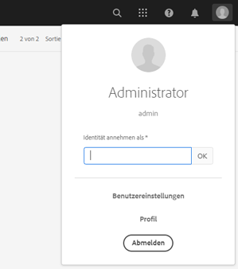

# [!DNL Adobe Experience Manager] 6.5 Service Pack  – Versionshinweise {#aem-service-pack-release-notes}

## Versionsinformationen {#release-information}

| Produkte | Adobe Experience Manager 6.5 |
| -------- | ---------------------------- |
| Version | 6.5.6.0 |
| Typ | Service Pack-Version |
| Datum            | 03. September 2020 |
| Download-URL | [Softwareverteilung](https://experience.adobe.com/#/downloads/content/software-distribution/en/aem.html?package=/content/software-distribution/en/details.html/content/dam/aem/public/adobe/packages/cq650/servicepack/aem-service-pkg-6.5.6.zip) |

## Inhalt von Adobe Experience Manager 6.5.6.0 {#what-s-included-in-aem}

Adobe Experience Manager 6.5.6.0 ist ein wichtiges Update, das neue Funktionen, von wichtigen Kunden angeforderte Verbesserungen sowie Verbesserungen in den Bereichen Leistung, Stabilität und Sicherheit umfasst. Die Updates werden seit der allgemeinen Verfügbarkeit der Version 6.5 im **April 2019** veröffentlicht. Es kann auf Adobe Experience Manager 6.5 installiert werden.

Die wichtigsten Funktionen und Verbesserungen, die in Adobe Experience Manager 6.5.6.0 eingeführt wurden, umfassen:

* Das Veröffentlichen der Asset-Beitragsordner vom Markenportal in Experience Manager Assets wird jetzt auch über den Proxyserver unterstützt.

* Die automatisch generierten Gruppen von privaten Ordnern werden nun beim Löschen des privaten Ordners in [!DNL Experience Manager Assets]bereinigt.

* Die Beschreibungen der Modifikatoren im Video [!UICONTROL Viewer] -Vorgabeneditor wurden in aktualisiert [!DNL Dynamic Media].

* Es wird eine neue Einstellung für die Firma bereitgestellt, die den Status des [!DNL Dynamic Media] Connectors widerspiegelt.

* Die Standardoptionen für `test` und `aiprocess` werden von `Thumbnail``Rasterize` zuvor in dynamischen Medien aktualisiert, um sicherzustellen, dass Benutzer nur Miniaturansichten erstellen und die Extraktion der Seite und der Suchbegriffe überspringen müssen.

* Ausfüllen eines adaptiven Formulars im Client im Voraus

* Integration des Formulardatenmodells mit RESTful-APIs auf einem Server mit bidirektionaler SSL-Implementierung.

* Verbesserte Zwischenspeicherung für übersetzte Seiten adaptiver Formulare.

* Unterstützung für Adobe Sign-Text-Tags im automatisierten Forms-Konvertierungsdienst.

* Unterstützung für SMB 2- und SMB 3-Protokolle.

* Unterstützung für die Konvertierung farbiger Formulare in adaptive Formulare mithilfe des Dienstes &quot;Automatisierte Forms-Konvertierung&quot;.

* Das integrierte Repository (Apache Jackrabbit Oak) wird auf Version 1.22.4 aktualisiert.

Eine vollständige Liste der in Experience Manager 6.5.6.0 eingeführten Funktionen und Verbesserungen finden Sie unter [Neue Funktionen in Adobe Experience Manager 6.5 Service Pack 6](new-features-latest-service-pack.md).

Im Folgenden finden Sie die Liste der Fehlerbehebungen in Version [!DNL Experience Manager] 6.5.6.0.

### [!DNL Sites] {#sites-6560}

* Wählen Sie in [!DNL Sites] oder [!DNL Screens]wählen Sie ein Projekt aus und klicken Sie auf [!UICONTROL Management Veröffentlichungen]. Benutzer können aufgrund von Fehlern in der Benutzeroberfläche nicht im [!UICONTROL Assistenten zum Verwalten von Veröffentlichungen] fortfahren. Insbesondere funktioniert die Option [!UICONTROL Veröffentlichen] nicht (NPR-34099).
* Die Position von iParsys (geerbtes Absatzsystem) wird nach der Deaktivierung der Optionen &quot; [!UICONTROL Vererbung] abbrechen&quot;oder &quot;Vererbung [!UICONTROL deaktivieren] &quot;nicht auf die ursprüngliche Standardposition zurückgesetzt (NPR-34097).
* Wenn das `RolloutConfigManagerFactoryImpl` Programm keine Rollout-Konfiguration laden kann, wird nicht versucht, die fehlenden Konfigurationen zu laden. Es gibt die zwischengespeicherten Konfigurationen (NPR-34092) zurück.
* In der Kernkomponente &quot;Text&quot;wird nach Verwendung der HTML-Quellbearbeitungsoption die Klasse aus dem `em` -Tag entfernt (NPR-34081).
* Nach der Aktualisierung von Experience Manager 6.3.3 auf Experience Manager 6.5.3 dauert der Rollout-out-Vorgang viel länger und der Rollout schlägt mit einem Timeout-Fehler (NPR-34049) fehl.
* Die Attributwerte werden `htmlwriter` nicht kodiert. Das Markup, das im XF-Markup vorhanden ist, wird mit dekodierten Attributwerten (d. h. `"` anstelle von `&#34`) exportiert. Es verursacht Probleme auf der Seite der Zielgruppe mit Visual Experience Composer, die das exportierte XF (NPR-34048) verwenden.
* Verbessern Sie beim Verschieben von Seiten [!DNL Experience Manager Sites]die Protokollierung, um den Fehler bei der Versionserstellung mit Vernunft zu erfassen (NPR-34014).
* Wenn [!DNL Rich Text Editor] der gesamte Text entfernt wird, wird auch das Absatz-Tag entfernt (NPR-33976).
* Wenn die `siteadmin` Seite (in der klassischen Benutzeroberfläche) geöffnet oder aktualisiert wird, sind die Optionen im Menü `New` deaktiviert (NPR-33949).

   

* Eine [!DNL Content Fragment] kann nicht als eine `TemplatedResource` Karte verwendet werden, da sie in fehlschlägt `ContentFragmentUsePojo` (NPR-33911).
* Synchrone und asynchrone Verschiebungen können zu Fehlern führen, die auf gleichzeitige Übertragungen zurückzuführen sind. Der Seitenumbruch ist auf den synchronen Umstieg beschränkt. Es verhindert das gleichzeitige Verschieben von Seiten (NPR-33875).
* [!UICONTROL Der Vorgang &quot;Veröffentlichung] verwalten&quot;zum Replizieren von Inhalten aus der Instanz &quot;Autor&quot;in &quot;Veröffentlichungsinstanz&quot;schlägt fehl und erzeugt einen JavaScript-Fehler (NPR-33872).
* Wenn mehrere Seiten oder Assets ausgewählt sind, um Versionen zu erstellen, wird die neue Version nur für die zuletzt ausgewählte Seite oder das zuletzt ausgewählte Asset erstellt (NPR-33866).
* Verschieben Sie eine Blueprint-Seite mit Live-Kopien in einen anderen Ordner. Beim Verschieben in den Originalordner schlägt der Verschieben-Vorgang ohne Fehler fehl (NPR-33864).
* Wenn mit der Aktion &quot;Verschieben&quot;eine Webseite in der [!DNL Sites] Konsole umbenannt wird, werden im letzten Schritt des Assistenten zwei überlappende Dialogfelder angezeigt (NPR-33831).

   

* Die `cq:acLinks` und `cq:acUUID` Eigenschaften für [!DNL Adobe Campaign] die Kopie werden beim Kopieren und Einfügen entfernt (NPR-33794).
* Beim Versuch eines Rollouts auf einer untergeordneten Seite einer abgetrennten übergeordneten Live-Kopie wird eine Null-Zeiger-Ausnahme generiert (NPR-33676). [!DNL Experience Manager]
* Die [!DNL RTE] Komponenten in einem Layout-Container sind nicht sichtbar, wenn der Layout-Container kopiert und erneut auf die Seite eingefügt wird. Die [!DNL RTE] Komponenten können nicht bearbeitet werden, werden aber bei einer Seitenaktualisierung angezeigt (NPR-33662).
* Wenn Sie die Größe einer Layoutkomponente für verschiedene Haltepunkte (mittel und groß) ändern, verhält sich das Layout nicht wie erwartet (NPR-33608).
* Im Inline-Bearbeitungsmodus in [!DNL RTE]funktioniert das Ziehen eines Bildes nicht für Textkomponente (NPR-33602).
* Es ist möglich, eine Komponente in einer Blueprint-Seite mit demselben Namen wie der Seitenname zu erstellen. Bei der Aktualisierung `_msm_moved` wird die Komponente umbenannt. Die Komponente wird an das Ende des [!UICONTROL Absatzsystems] (NPR-33535) verschoben.
* Wenn offTime oder onTime auf vielen Seiten oder Assets eingestellt ist, ist es ressourcenintensiv und verlangsamt das System beim Start und Herunterfahren (NPR-33482).
* Ein Benutzer mit CRUD-Berechtigungen `/content/experience-fragment` kann einen Ordner nicht löschen (NPR-33436).
* Sie können [!UICONTROL HTML und JSON] als Option für das [!UICONTROL Adobe Target-Exportformat] in einem übergeordneten Ordner im [!DNL Experience Fragments] Abschnitt auswählen. Die gleichen Eigenschaften werden in der touchfähigen Benutzeroberfläche für die Unterordner dieses übergeordneten Ordners angezeigt. In CRXDE wird jedoch nur HTML angezeigt, `cq:adobeTargetExportFormat`anstatt `html,json` (NPR-33423).
* Veröffentlichen oder Rückgängigmachen der Veröffentlichung über ein Seitenalias wird nicht unterstützt. Entfernen Sie die Option, die anscheinend anders zu behaupten scheint (NPR-33415).
* Ein bestimmtes Tag kann von einem Ort zu einem anderen verschoben werden [!DNL Experience Manager]. Sie kann auch auf verschiedene Seiten vor und nach dem Verschieben angewendet werden. Wenn Sie die Eigenschaften der Seiten bearbeiten, wird das Tag nicht zur Bearbeitung angezeigt, obwohl das Tag dasselbe ist (NPR-33353).
* Eine Seitenvorlage wird nicht richtig dargestellt, wenn ein Layout-Container aus einer Vorlage mit mehreren Layout-Containern gelöscht wird (NPR-33347).
* Versuchen Sie im Vorlageneditor, eine Vorlage zu löschen, die von mehr als 100000 Seiten unter `/content/`verwendet wird. Ein Fehler wird ohne Fehlermeldung angezeigt (NPR-33312).
* Die Umleitung auf die [!DNL Experience Manager] Seite mit Anker funktioniert nicht in der Autoreninstanz, da die Abfrage nach einem URL-Fragment oder einem Anker (NPR-34288) `PageRedirectServlets` gesendet wird.
* Das Erstellen einer Marke unter `/content/campaign` den Ergebnissen führt zu einer Struktur, die keine Kampagnen ermöglicht. [!UICONTROL Die Option &quot;Marke] erstellen&quot;lässt die neu erstellte Marke ohne Möglichkeit, [!UICONTROL Angebot und Aktivitäten] zu erstellen, da keine [!UICONTROL Option &quot;Erstellen] &quot;vorhanden ist (NPR-34113).
* Sie können den [!DNL Live Copy] Status einer Seite aussetzen und die Vererbung wird, wie im Editor-Modus angezeigt, unterbrochen. In den Seiteneigenschaften gibt das Symbol für Vererbung fälschlicherweise an, dass die Vererbung vorhanden ist und nicht beschädigt ist (NPR-34017).
* Seiten mit vielen Referenzen können nicht asynchron verschoben werden und manchmal schlägt der Verschieben-Vorgang fehl (CQ-4297969).
* Eine Webseite mit `/` Zeichen in der URL reagiert beim Authoring nicht mehr. Wenn beim Authoring eine Komponente hinzugefügt wird, erhöht sich die CPU-Auslastung und der Browser reagiert nicht mehr (CQ-4295749).
* Im Durchsuchen-Modus erwähnt NVDA keinen Wert, der über die Menüoption &quot;Typ/Größe&quot;ausgewählt wurde. Der visuelle Fokus liegt nicht auf dem ausgewählten Element. Benutzer, die auf eine Bildschirmlesehilfe angewiesen sind, können den Durchsuchen-Modus nicht verwenden (CQ-4294993).
* Beim Erstellen einer Webseite können Benutzer die Vorlage &quot; [!UICONTROL Inhaltsseite] &quot;auswählen. Auf der Registerkarte &quot; [!UICONTROL Social Media] &quot;können Benutzer eine [!UICONTROL bevorzugte XF-Variante]auswählen. Um ein Erlebnisfragment im NVDA-Durchsuchenmodus auszuwählen, können Benutzer keine Tastenkombinationen verwenden (CQ-4292669).
* Die Bibliothek mit Handlebars wurde auf die sicherere Version 4.7.3 (NPR-34484) aktualisiert.

### [!DNL Assets] {#assets-6560}

**Verbesserungen der Barrierefreiheit in Experience Manager Assets**

* Die Benutzer können nun auf die Optionen der interaktiven Benutzeroberfläche in der [!UICONTROL Liste der Assets mit den Tastenkombinationen &quot;Referenzen] &quot;zugreifen und sie fokussieren (NPR-34115).

* Bildschirmlesehilfen geben nun die Optionen im Suchfilter als erweiterbare Akkordeons an (NPR-34104).

* Die Suchseite und die Suchergebnisseite haben jetzt informativere Titel für ein besseres Verständnis der Benutzer von Bildschirmlesehilfen (NPR-34093).

* Bildschirmlesehilfen geben jetzt die Optionen zum Löschen der ausgewählten Tags auf der Registerkarte &quot; [!UICONTROL Einfach] &quot;der Schaltflächen &quot;Asset- [!UICONTROL Eigenschaften] &quot;an, um die ausgewählten Tags zu löschen (NPR-33972).

* Die Elemente in jeder Zeile in der Ansicht der Liste werden nun korrekt als Elemente derselben Zeile von Bildschirmlesehilfen (NPR-33932) angekündigt.

* Der Benutzerfokus beim Navigieren mit der Tabulatortaste wechselt jetzt korrekt zur Schließoption in der Vorschau der Version (NPR-33863).

* Der Benutzerfokus wird nun korrekt auf das Suchsymbol verschoben, nachdem Omniture Search geschlossen wurde (NPR-33705).

* Die Optionen der umsetzbaren Benutzeroberfläche haben jetzt einen auffälligeren visuellen Fokus mit einem erhöhten Kontrast, wenn sie mithilfe von Tastaturbefehlen fokussiert werden. Sehbehinderte Keyboard-Benutzer können nun die Fokusbereiche unterscheiden (NPR-33542).

* Die Drag-Funktion mit der Tastatur funktioniert jetzt im [!UICONTROL Metadata Schema Editor] im Durchsuchenmodus der Bildschirmlesehilfe korrekt (CQ-4296326).

* Wenn Sie im Dialogfeld für die Freigabe von Links im Durchsuchen-Modus navigieren,

   * erzählen Sie die Tabelleninformationen nicht, sobald das Dialogfeld geladen wurde.

   * Sie können zu allen aufgelisteten automatischen Empfehlungen navigieren.

   * Beschreiben Sie jetzt die angezeigten automatischen Vorschläge für die [!UICONTROL Hinzufügen E-Mail-Adresse/Suche] (CQ-4294232).

* Die Verwendung der Esc-Taste zum Entfernen der Schnellaktion-Symbole aus der Miniaturansicht-Ansicht entfernt den Tastaturfokus nicht mehr vom zuletzt fokussierten Element (CQ-4293554).

* Bildschirmlesehilfen geben jetzt Textalternativen an, die ihre Funktionalität darstellen, für Symbole (z. B. Chevrons) anstelle ihrer wörtlichen Namen (CQ-4272943).

* Der Tastaturfokus wechselt jetzt erfolgreich zu [!UICONTROL Flyout]-, [!UICONTROL InlineZoom]-, [!UICONTROL Shoppable_Banner]-, [!UICONTROL Zoom_dark]-, [!UICONTROL Zoom_light]-, ZoomVertical_dark, navigZoomVertical_light   -Optionen bei Verwendung der Tabulatortaste in Asset-DetailsViewerIn dynamischen Medien (Dynamische Medien) CQ-4290605).

* [!UICONTROL Die Option &quot;Speichern und Schließen] &quot;auf der Seite &quot;Asset- [!UICONTROL Eigenschaften] &quot;kann jetzt über die Tastatur aufgerufen werden (NPR-34107).

* Fehlermeldungen aufgrund falscher Kombinationen aus Benutzername und Passwort auf der Anmeldeseite werden jetzt von Bildschirmlesehilfen bei jedem Fehler angekündigt (NPR-33722).

* Im [!DNL Experience Manager] Kopfzeilenabschnitt werden beim Navigieren im Durchsuchen-Modus jetzt Bildschirmlesehilfen angekündigt,

   * automatisch bearbeitete Vorschläge in [!UICONTROL Typ zur Suche] in Omniture.

   * der Status für [!UICONTROL Lösungsoptionen], [!UICONTROL Hilfe], [!UICONTROL Posteingang] und [!UICONTROL Benutzeroptionen] erweitert oder minimiert.

   * die Statusmeldung [!UICONTROL zur] Suchhilfe, die angezeigt wird, wenn der Benutzer eine Suchzeichenfolge in das Feld &quot;Hilfe [!UICONTROL suchen&quot;unter der Option &quot;] Hilfe  &quot;eingibt.

   

   *Abbildung:[!UICONTROL Hilfe]im[!UICONTROL Menü &quot;Hilfe]&quot;suchen*

   * die Fehlermeldung, wenn unter der Option &quot; [!UICONTROL Benutzer] &quot;in [!UICONTROL Eigenschaftsvariablen als] Feld eingegeben und der Fokus korrekt auf das Textfeld (NPR-33804) verschoben wird.

   

   *Abbildung:[!UICONTROL Als]Feld im Menü &quot;[!UICONTROL Benutzer]&quot;in der Kopfzeile personalisieren*

* Der Benutzer kann den Fokus jetzt mithilfe der Tastaturbefehle innerhalb von:

   * [!UICONTROL Feld E-Mail-Adresse] suchen/Hinzufügen im Dialogfeld [!UICONTROL Linkfreigabe] .

   * [!UICONTROL hinzufügen Feld &quot;Benutzer&quot;oder &quot;Gruppe] &quot;unter &quot; [!UICONTROL Geschlossene Benutzergruppe] &quot;auf der Registerkarte &quot; [!UICONTROL Berechtigungen] &quot;des Ordners [!UICONTROL Eigenschaften] (NPR-34452).

**In Experience Manager Assets behobene Probleme**

[!DNL Adobe Experience Manager] 6.5.6.0 Assets bieten Korrekturen an folgenden Problemen:

* Die Vorschau von Marketing-Sicherheiten (wie Broschüre, Flyer und Visitenkarte), die mit [!DNL Adobe InDesign] (INDD)-Vorlage erstellt wurden, behält keine Zeilenumbrüche und Absatzbrüche bei (NPR-34268).

* Die Extraktion von Text für die hochgeladenen PDF-Dateien funktioniert nicht und die Volltextsuche nach bestimmten Wörtern in einer PDF-Datei funktioniert nicht, um diese PDF-Datei abzurufen (NPR-34164).

   >[!NOTE]
   >Damit diese Fehlerbehebung funktioniert, müssen Sie die Adobe Experience Manager-Instanz nach der Installation von Service Pack 6.5.6.0 neu starten.

* In der Zeitleiste mehrseitiger Assets werden Anmerkungen angezeigt, die beim Durchsuchen des Assets in der Timeline-Ansicht auf alle Teilassets angewendet werden, anstatt die Anmerkungen anzuzeigen, die spezifisch für die jeweiligen Teilassets sind (NPR-34100).

* Asset-Ordner werden nicht mit der Option &quot;Veröffentlichung  verwalten&quot;veröffentlicht, wenn die Ordner Ressourcen in den Dateiformaten JavaScript, CSS oder JSON enthalten (NPR-34090).

* Wenn Sie die angewendeten Tags oder Filter in Omniture deaktivieren oder entfernen, wird die Abfrage mehrmals ausgeführt, was die Suchzeit verlängert (NPR-34078).

* In der Ansicht der Karte, wenn ein Workflow (für ein Asset in einem Ordner) ausgeführt oder ausstehend ist, wird die Seite neu geladen, bis der Workflow abgeschlossen oder beendet ist. Daher können Autoren nicht an den Assets im Ordner arbeiten, für die sie einen Bildlauf nach unten durchführen müssen (NPR-33986).

* Wenn der Benutzer ein veröffentlichtes Asset an einen neuen Speicherort verschiebt, wird das Asset erneut veröffentlicht, auch wenn die Option &quot; [!UICONTROL Neu veröffentlichen] &quot;deaktiviert ist. Dies führt dazu, dass sich viele verwaiste Assets in der Veröffentlichungsinstanz befinden. Das Standardverhalten ist jedoch, dass beim Verschieben eines Vorgangs für ein veröffentlichtes Asset die Veröffentlichung automatisch rückgängig gemacht wird. Dieses Asset wird erneut veröffentlicht, wenn der Autor beim Verschieben des Assets die Option &quot; [!UICONTROL Veröffentlichung] wiederholen&quot;auswählt (NPR-33934).

* Die Seite [!UICONTROL &quot;Assets] verschieben&quot;für Assets in Sammlungen lädt nicht den gesamten HTML-Inhalt, z. B. die Option &quot; [!UICONTROL Anpassen/Neu veröffentlichen] &quot;. Daher können die Verwender den Verschiebevorgang nicht abschließen (NPR-33860).

* Wenn Sie ein Asset verschieben und dem Namen und Titel der verschobenen Assets Sonderzeichen hinzufügen, wird am neuen Speicherort des Assets ein zusätzlicher Ordner (mit demselben Namen) erstellt (NPR-33826).

* [!UICONTROL Die Schaltfläche &quot;Herunterladen] &quot;für ein Asset wird deaktiviert, wenn im Dialogfeld &quot; [!UICONTROL Herunterladen] &quot;die Option &quot; [!UICONTROL E-Mail] &quot;aktiviert ist (NPR-33730).

* Der Fehler &quot;Request-URI too long&quot;wird bei der Ausführung von Massenvorgängen für Assets wie der Bearbeitung von Massenmetadaten (NPR-33723) beobachtet.

* Es wird ein JavaScript-Fehler beobachtet, und Benutzer können die im [!UICONTROL Dropdown] -Schema durch [!UICONTROL Hinzufügen JSON-Pfadfunktion] im Formulareditor für [!UICONTROL Ordnermetadaten]generierten Optionen nicht auswählen oder löschen, wenn die hochgeladene JSON-Datei einen Leerzeichen oder Sonderzeichen hat (NPR-33712).

* Die statischen Darstellungen von Assets werden nicht aktualisiert, wenn Assets mithilfe der [!UICONTROL Option &quot;Öffnen] &quot;in aktualisiert werden [!DNL desktop app] oder [!DNL Adobe Asset Link] und wieder mit synchronisiert werden [!DNL Adobe Experience Manager] (CQ-4296279).

* In der Ansicht der Spalte werden beim Verschieben eines Assets auch die Assets verschoben, die ausgewählt wurden, bevor sie die Option &quot; [!UICONTROL Filter] &quot;verwenden. Beachten Sie, dass die vorherige Auswahl (NPR-34018) bei Verwendung der Option &quot; [!UICONTROL Filter] &quot;aufgehoben wird.

* Backslashes werden vor Sonderzeichen in Suchvorschlägen von Assets hinzugefügt, deren Name Sonderzeichen enthält (NPR-33834).

* Beim Erstellen von Regeln für die Dropdown-Liste im [!UICONTROL Ordnermetadaten-Schema-Formular]kann der Benutzer keine Werte aus der Spalte [!UICONTROL Feldauswahl] auswählen (CQ-4297530).

* Die Laufzeitkopie des benutzerdefinierten Assets Workflow-Modells (erstellt in `/var/workflow/models/dam`) wird gelöscht, wenn Sie 6.5 Service Pack 5 oder frühere Versionen auf 6.5 GA (NPR-34532) installieren.

   >[!NOTE]
   >
   >Beim Aktualisieren auf das [!DNL Experience Manager] 6.5 Service Pack 6 wird Ihre Laufzeitkopie nicht abgerufen, wenn Ihre Laufzeitkopie bei der Installation von [!DNL Experience Manager] 6.5 Service Pack 5 oder früheren Versionen auf 6.5 GA gelöscht wird. Um die Laufzeitkopie abzurufen, synchronisieren Sie die Entwurfszeitkopie des Workflow-Modells mit der Laufzeitkopie mit der HTTP-API:
   `<designModelPath>/jcr:content.generate.json`.

**Behobene Probleme in dynamischen Medien**

* Wenn der Benutzer die Kodierungseinstellungen in Bearbeitungen definiert, nachdem das Video-Profil erstellt wurde, werden die Einstellungen für die intelligente Beschneidung aus den Video-Profilen entfernt (CQ-4299177).

* Beim Laden der Seite werden Elemente flackert, wenn der Benutzer zwischen den Optionen für die Seitenleiste wechselt (z. B. [!UICONTROL Übersicht], [!UICONTROL Zeitschiene], [!UICONTROL Viewer]), und zwar auf der Seite mit den Asset-Details (NPR-34235).

* Folgende Probleme werden bei der Neuverarbeitung von Aufträgen beobachtet:

   * Die Job-ID fehlt im Auftragsbearbeitungsauftrag, der vom Neuverarbeitungsauftrag zurückgegeben wird.

   * Neuverarbeitung des Auftrags für Videoprotokolle nur Dateiname und nicht vollständigen Pfad.

   * Der Neuverarbeitungsauftrag verfügt nicht über die Option, den Asset-Typ als statisch festzulegen.

   * `ExcludeFromAVS` nicht angegeben ist (CQ-4298401).

* Die Funktion &quot;Intelligentes Beschneiden&quot;schlägt fehl, wenn einem Profil mit mehreren Seitenverhältnissen (z. B. 11) (NPR-34082) ein Bild hinzugefügt wird.

* Der Arbeitsablauf für DAM-Aktualisierungs-Assets wird ausgelöst, wenn der Benutzer auf der Registerkarte &quot; [!UICONTROL Workflow-Archiv] &quot;unter der Registerkarte &quot; [!UICONTROL Workflow] &quot;in den [!UICONTROL Tools] in der [!DNL Adobe Experience Manager] Konfiguration mit dem Dynamic Media Scene7 (CQ-4299727) nach unten blättert.

* Symbole auf der Registerkarte &quot; [!UICONTROL Verhalten] &quot;des [!UICONTROL Viewer-Vorgabeneditors] sind nicht lokalisiert (CQ-4299026).

* In der Hauptansicht wird ein Ansicht mit einem falschen Layout angezeigt, das nicht in den Viewer passt, wenn der Viewer im interaktiven Modus ausgeführt wird (CQ-4298293).

* Änderungen an Bildvorgaben in [!UICONTROL Adobe Experience Manager] werden nicht mit dem Scene7 Publishing System (CQ-4299713) synchronisiert.

### [!DNL Commerce] {#commerce-6560}

* Links zu Assets von Produkten werden beim Verschieben von Assets nicht umgestaltet (NPR-34098).

### Plattform {#platform-6560}

* Protokolle können nicht mit dem Diagnosetool auf einer aktualisierten Experience Manager-Instanz (NPR-34336) heruntergeladen werden.
* Die Aktualisierung schlägt mit einem Fehler aufgrund von Abhängigkeiten zu einer bestimmten Version des `cq-wcm-api` Gründungspakets (CQ-4300520) fehl.
* Die Standardwerte für die **[!UICONTROL Einstellungen &quot;Zeitlimit]** für Verbindung&quot;und &quot; **[!UICONTROL Socket-Zeitlimit]** &quot;für die Konfiguration des Standardagenten (Veröffentlichungsagenten) sind nicht angegeben (NPR-33707).
* Aktualisierungen der Zuordnungskonfiguration unter `/etc/map.publish` spiegeln nicht die Seiten der Site wider (NPR-34015).
* [Die API-Referenzdokumentation](https://helpx.adobe.com/experience-manager/6-5/sites/developing/using/reference-materials/javadoc/com/day/cq/tagging/package-summary.html) enthält keine Dokumentation für das `com.day.cq.tagging` Paket (CQ-4295864).

### Benutzeroberfläche {#ui-6560}

* Die Oberfläche des Offload-Browsers zeigt nicht alle Auftragsthemen an (NPR-34308).
* Die Oberfläche des Konfigurationsbrowsers zeigt nicht alle Konfigurationen an (NPR-33644).
* Wenn Sie die `Esc` Eingabetaste drücken, wird das Dialogfeld &quot; **[!UICONTROL Benutzer]** &quot;statt der Liste des Benutzers (NPR-34084) geschlossen.

### Integrationen {#integrations-6560}

* Aktivitäten mit langen Namen werden nicht synchronisiert [!DNL Adobe Target] (NPR-34254).

### Übersetzungsprojekte {#translation-6560}

* Ein Übersetzungsprojekt wird nicht erstellt, wenn die Sonderzeichen des Benutzers `authorizableID` enthalten sind (NPR-33828).

### Sling {#sling-6560}

* Health Check und Musterdetektor haben überlappende Funktionen. Die Gesundheitsprüfung wird daher aus dem Produkt entfernt (NPR-33928).

### WCM {#wcm-6560}

* Foundation-Komponenten: Wenn Sie einer Seite eine Grundbildkomponente hinzufügen und ein Bild referenzieren, funktioniert der `Undo` Vorgang nicht (NPR-34516).

* Der Vorgang &quot;Seitenverschiebung&quot;kann nicht verwendet werden (CQ-4303028).

### [!DNL Communities] {#communities-6560}

* Die Freigabe eines Beitrags in sozialen Medien zeigt eine veraltete Option Google+ (NPR-33877).

* Community-Mitglied kann keine Gruppenvorlage oder andere Einstellungen für Gruppenfunktionen ändern (NPR-33530).

* Hyperlink-Tags auf Bildern werden in einem Forumsbeitrag (NPR-33464) nicht ordnungsgemäß generiert.

* Fehler bei der Zugänglichkeit werden in der Funktion &quot;Community Assignment&quot;(NPR-33442) identifiziert.

* Die vorhandenen Benutzer einer Community-Gruppe, die über die Admin-Konsole hinzugefügt wurde, werden bei jeder Änderung in der Community-Gruppenkonsole (NPR-34315) aus der Liste entfernt.

<!--
* Tag filters are vulnerable to sensitive information disclosure (NPR-33868).
-->

### [!DNL Forms] {#forms-6560}

>[!NOTE]
>
>[!DNL Experience Manager] Service Pack enthält keine Korrekturen für [!DNL Forms]. They are delivered using a separate [!DNL Forms] add-on package. In addition, a cumulative installer is released that includes fixes for [!DNL Experience Manager Forms] on JEE. For more information, see [Install AEM Forms add-on](#install-aem-forms-add-on-package) and [Install AEM Forms on JEE](#install-aem-forms-jee-installer).

**Adaptive Formulare**

* Wenn ein adaptives Formularfragment fehlt, kann das adaptive Formular nicht gerendert werden (NPR-34302).

* In der Inhaltsbeschreibung für adaptive Formularfelder wird ein Absatz-HTML-Tag (NPR-34116) angezeigt.

* Wenn Sie die Eigenschaft &quot; **[!UICONTROL Auf Server]** überprüfen&quot;auswählen, kann das adaptive Formular nicht gesendet werden (NPR-33876).

* Die Übermittlungsaktion **[!UICONTROL An REST-Endpunkt]** übermitteln funktioniert nicht für ein adaptives Formular (CQ-4299044).

* Zugänglichkeit: Wenn Sie versuchen, ein adaptives Formular zu senden, ohne eine Anlage für ein Pflichtfeld hochzuladen, wird der Fokus nicht automatisch auf das Anlagenfeld verschoben (CQ-4298065).

* Wenn Sie Zeilen zu einer Tabelle eines adaptiven Formulars hinzufügen, zeigen die Optionen **[!UICONTROL Hinzufügen nach oben]** und **[!UICONTROL Hinzufügen nach unten]** keine entsprechenden Ergebnisse an (CQ-4297511).

* Das Skript [!UICONTROL zum Bestätigen] von Werten wird falsch ausgelöst, was zu Datenverlusten in einem adaptiven Formular führt (CQ-4296874).

* Die Datumsauswahl funktioniert bei lokalisierten adaptiven Formularen nicht ordnungsgemäß (NPR-34333).

* Wenn der Dateiname einen Unterstrich oder ein Leerzeichen enthält, können Sie die Datei nicht an ein adaptives Formular anhängen (CQ-4301001).

* Wenn ein verschachteltes wiederholbares Bedienfeld mehr Vorkommen aufweist als sein übergeordnetes Element, schlagen alle Vorkommen eines solchen verschachtelten wiederholbaren Bedienfelds fehl (NPR-33666).

* Adaptive Formulare verfügen über einige offene Ressourcenauflöser. Dies führt zu Übermittlungsfehlern. Das Problem tritt gelegentlich auf (CQ-4299407).

**Arbeitsablauf**

* Wenn ein Workflow-Genehmiger eine Anlage hochlädt, wird die Anlage in `undefined` (NPR-33699) umbenannt.

* [!DNL Experience Manager] Der Vorgang &quot;Workflow-Bereinigung&quot;schlägt fehl und zeigt die folgende Fehlermeldung an (NPR-33575):

   `java.lang.UnsupportedOperationException: The query read more than 500000 nodes in memory`

* [!DNL Experience Manager Forms] App für [!DNL Windows] beendet die Antwort nach dem Senden eines Formulars (NPR-34409).

* Wenn Sie AEM Service Pack installieren, wird die **To Do** -Liste von Elementen nicht als Links angezeigt. Der Text für die **Aufgaben** -Elemente enthält HTML-Tags (NPR-34317).

**Interaktive Kommunikation**

* Wenn Sie ein Textfragment mit verschachtelten wiederholbaren Dokumenten einschließen, kann die Interaktive Kommunikation nicht gespeichert werden (NPR-34095).

**Korrespondenzverwaltung**

* Wenn Sie ein Textfeldfragment ändern, das Datenwörterbuchwerte enthält, reagiert die Agent-Benutzeroberfläche nicht mehr (NPR-33930).

* Das Kopieren von Inhalten aus einem [!DNL Microsoft Word] Dokument in ein Textfragment in einem Dokument führt zu Formatierungsproblemen (NPR-33536).

**Document Services**

* Wenn Sie eine PDF-Datei mit Output- und Forms-Diensten aus einer XDP-Datei generieren, führt dies zu fehlendem und überlappendem Text (NPR-34237, CQ-4299331).

* Wenn Sie eine HTML-Datei in PDF konvertieren, ist das `MaxReuseCount` Attribut nicht konfigurierbar (NPR-33470).

* Wenn Sie eine PDF-Datei herunterladen, die interaktive Reader-Erweiterungen enthält, können Sie der PDF-Datei keine Anlage hinzufügen, die [!DNL Adobe Reader] (NPR-33729) verwendet.

**Document Security**

* Der Signaturvorgang mit HSM-basierten Zertifikaten kann nach der Installation von [!DNL Experience Manager] Service Pack (NPR-34310) nicht in einer PDF-Datei ausgeführt werden.

**Designer**

* XForms kann nicht in Designer Version 6.5.x (CQ-4295322) geöffnet werden.

* Wenn Sie Designer öffnen, wird im Begrüßungsbildschirm ein falsches Jahr angezeigt (CQ-4295289).

* Wenn Sie [!DNL Acrobat DC] auf dem Server installieren, ist die Option &quot;Formular **[!UICONTROL verteilen]** &quot;inaktiv (CQ-4296304).

Informationen zu Sicherheitsaktualisierungen finden Sie auf der Seite [zu Sicherheitsbulletins für](https://helpx.adobe.com/security/products/experience-manager.html)Experience Manager.

## Install 6.5.6.0 {#install}

**Einrichtungsvoraussetzungen**

* AEM 6.5.6.0 requires AEM 6.5. See [upgrade documentation](/help/sites-deploying/upgrade.md) for detailed instructions.
* Der Service Pack-Download ist auf Adobe [Software Distribution](https://experience.adobe.com/#/downloads/content/software-distribution/en/aem.html)verfügbar.
* Installieren Sie bei einer Implementierung mit MongoDB und mehreren Instanzen AEM 6.5.6.0 mithilfe von Package Manager auf einer der Autoreninstanzen.
* Erstellen Sie vor der Installation einen Schnappschuss oder eine neue Sicherung Ihrer AEM.
* Starten Sie die Instanz vor der Installation neu. Dies ist zwar nur dann erforderlich, wenn sich die Instanz noch im Aktualisierungsmodus befindet (und dies ist der Fall, wenn die Instanz von einer früheren Version aktualisiert wurde). Dennoch wird dies empfohlen, wenn die Instanz über einen längeren Zeitraum ausgeführt wurde.

>[!NOTE]
>
>Es wird nicht empfohlen, das Adobe Experience Manager 6.5.6.0-Paket zu entfernen oder zu deinstallieren.

### Installieren des Service Packs {#install-service-pack}

Führen Sie die folgenden Schritte aus, um das Service Pack auf einer vorhandenen Adobe Experience Manager 6.5-Instanz zu installieren:

1. Laden Sie das Service Pack von [Software Distribution](https://experience.adobe.com/#/downloads/content/software-distribution/en/aem.html?package=/content/software-distribution/en/details.html/content/dam/aem/public/adobe/packages/cq650/servicepack/aem-service-pkg-6.5.6.zip)herunter.

1. Open Package Manager and click **[!UICONTROL Upload Package]** to upload the package. Informationen zur Verwendung finden Sie unter [Package Manager](https://docs.adobe.com/content/help/en/experience-manager-65/administering/contentmanagement/package-manager.html).

1. Select the package and click **[!UICONTROL Install]**.

>[!NOTE]
>
>Das Dialogfeld auf der Benutzeroberfläche von Package Manager wird manchmal während der Installation des Service Packs beendet. Adobe empfiehlt, dass Sie auf die Stabilisierung der Fehlerprotokolle warten, bevor Sie auf die Bereitstellung zugreifen. Warten Sie auf die spezifischen Protokolle im Zusammenhang mit der Deinstallation des Updater-Bundles, bevor Sie sicherstellen, dass die Installation erfolgreich ist. Typically, this happens on [!DNL Safari] but can intermittently happen on any browser.

**Automatische Installation**

Es gibt zwei Möglichkeiten, Adobe Experience Manager 6.5.6.0 automatisch auf einer Arbeitsinstanz zu installieren:

A. Platzieren Sie das Paket in den `../crx-quickstart/install` Ordner, wenn der Server online verfügbar ist. Das Paket wird automatisch installiert.

B. Verwenden Sie die [HTTP-API aus Package Manager](https://helpx.adobe.com/de/experience-manager/aem-previous-versions.html). Verwenden Sie diese Option, `cmd=install&recursive=true` um die verschachtelten Pakete zu installieren.

>[!NOTE]
>
>Adobe Experience Manager 6.5.6.0 unterstützt keine Bootstrap-Installation.

**Bestätigen der Installation**

1. Auf der Seite mit den Produktinformationen (`/system/console/productinfo`) wird die aktualisierte Versionszeichenfolge `Adobe Experience Manager (6.5.6.0)` unter &quot; [!UICONTROL Installierte Produkte]&quot;angezeigt.

1. All OSGi bundles are either **[!UICONTROL ACTIVE]** or **[!UICONTROL FRAGMENT]** in the OSGi Console (Use Web Console: `/system/console/bundles`).

1. The OSGI bundle `org.apache.jackrabbit.oak-core` is version 1.22.3 or higher (Use Web Console: `/system/console/bundles`).

Informationen zu den Plattformen, die für diese Version zertifiziert sind, finden Sie in den [technischen Anforderungen](/help/sites-deploying/technical-requirements.md).

### Adobe Experience Manager Forms Add-On-Paket installieren {#install-aem-forms-add-on-package}

>[!NOTE]
>
>Überspringen Sie diesen Schritt, wenn Sie AEM Forms nicht verwenden. Fehlerbehebungen in Adobe Experience Manager Forms werden über ein separates Add-On-Paket bereitgestellt.

1. Stellen Sie sicher, dass das Adobe Experience Manager Service Pack installiert ist.
1. Download the corresponding Forms add-on package listed at [AEM Forms releases](https://helpx.adobe.com/aem-forms/kb/aem-forms-releases.html) for your operating system.
1. Install the Forms add-on package as described in [Installing AEM Forms add-on packages](../forms/using/installing-configuring-aem-forms-osgi.md#install-aem-forms-add-on-package).

### Installieren von Adobe Experience Manager Forms on JEE {#install-aem-forms-jee-installer}

>[!NOTE]
>
>Überspringen Sie diesen Schritt, wenn Sie AEM Forms JEE nicht verwenden. Fehlerbehebungen in Adobe Experience Manager Forms on JEE werden über ein separates Installationsprogramm bereitgestellt.

For information about installing the cumulative installer for Experience Manager Forms on JEE and post-deployment configuration, see the [release notes for patch 0018](jee-patch-installer-65.md).

### UberJar {#uber-jar}

Das UberJar für Experience Manager 6.5.6.0 ist im Repository [Adobe Public Maven verfügbar](https://repo.maven.apache.org/maven2/com/adobe/aem/uber-jar/6.5.6-1.0/).

Um UberJar in einem Maven-Projekt zu verwenden, [verwenden Sie UberJar](/help/sites-developing/ht-projects-maven.md) und fügen Sie die folgende Abhängigkeit in Ihr Projekt-POM ein:

```shell
<dependency>
      <groupId>com.adobe.aem</groupId>
      <artifactId>uber-jar</artifactId>
      <version>6.5.6-1.0</version>  
      <scope>provided</scope>
</dependency>
```

## Veraltete Funktionen {#removed-deprecated-features}

In diesem Abschnitt werden Funktionen Liste, die mit AEM 6.5.6.0 als veraltet gekennzeichnet wurden. Funktionen, die in einer zukünftigen Version entfernt werden sollen, werden zuerst auf &quot;Veraltet&quot;eingestellt, wobei eine alternative Option verwendet werden muss.

Kunden wird empfohlen, zu überprüfen, ob sie die Funktion oder Funktionalität in ihrer aktuellen Bereitstellung nutzen, und Pläne zur Änderung ihrer Implementierung zu erstellen, um die alternative Option zu verwenden.

| Bereich | Funktion | Ersatz |
|---|---|---|
| Integrationen | Der Bildschirm &quot; **[!UICONTROL AEM Cloud-Services-Teilnahme]** &quot;wird nicht mehr unterstützt. Mit der in AEM 6.5 aktualisierten AEM- und Zielgruppe-Integration zur Unterstützung der Target Standard-API, die die Authentifizierung über Adobe IMS und I/O verwendet, und der wachsenden Rolle des Adobe Launch bei der Instrumentierung AEM Seiten für Analyse und Personalisierung ist der Opt-In-Assistent funktional irrelevant geworden. | Konfigurieren Sie Systemverbindungen, Adobe-IMS-Authentifizierung und Adobe-I/O-Integrationen über die jeweiligen AEM-Cloud-Dienste. |
| Connectoren | Die Adobe JCR Connector for Microsoft SharePoint 2010 und Microsoft SharePoint 2013 wird für AEM 6.5 nicht mehr unterstützt. | Nicht zutreffend |

## Bekannte Probleme {#known-issues}

* Wenn Sie [!DNL Experience Manager] 6.5 Service Pack 5 oder frühere Versionen auf 6.5 GA installieren, wird die Laufzeitkopie des benutzerdefinierten Assets Workflow-Modells (erstellt in `/var/workflow/models/dam`) gelöscht.
Um Ihre Laufzeitkopie abzurufen, empfiehlt Adobe die Synchronisierung der Entwurfszeitkopie des benutzerdefinierten Workflow-Modells mit der Laufzeitkopie mithilfe der HTTP-API:
   `<designModelPath>/jcr:content.generate.json`.

* Wenden Sie sich an den Support für Adoben, wenn beim Bearbeiten und Erstellen von Kaskadenregeln im Schema [!UICONTROL Ordnermetadaten Forms Editor] und [!UICONTROL Metadata Schema Forms Editor] Probleme auftreten, die das Dialogfeld Regel  definieren verwenden. Beachten Sie, dass die bereits erstellten und gespeicherten Regeln erwartungsgemäß funktionieren.

* If a folder in the hierarchy is renamed in [!DNL Experience Manager Assets] and the nested folder containing an asset is published to [!DNL Brand Portal], the title of the folder is not updated in [!DNL Brand Portal] until the root folder is published again.

* Wenn ein Benutzer ein Feld zum ersten Mal in einem adaptiven Formular konfigurieren möchte, wird die Option zum Speichern einer Konfiguration nicht im Eigenschaftenbrowser angezeigt. Wenn Sie im selben Editor ein anderes Feld des adaptiven Formulars konfigurieren, wird das Problem behoben.

* Wenn der Konfigurationsassistent für [!UICONTROL verbundene Assets nach der Installation die Fehlermeldung 404 zurückgibt, müssen Sie die Pakete] und `cq-remotedam-client-ui-content` `cq-remotedam-client-ui-components` Pakete manuell mit dem Package Manager neu installieren.

* Die folgenden Fehler und Warnmeldungen können während der Installation von AEM 6.5.x.x angezeigt werden:
   * „Wenn die Target-Integration mit der Target Standard-API (IMS-Authentifizierung) in AEM konfiguriert wird, führt der Export von Experience Fragments nach Target dazu, dass falsche Angebotstypen erstellt werden. Anstelle des Typs „Experience Fragment“/der Quelle „Adobe Experience Manager“ erstellt Target mehrere Angebote mit dem Typ „HTML“/der Quelle „Adobe Target Classic“.
   * `com.adobe.granite.maintenance.impl.TaskScheduler`: Keine Wartungsfenster unter granite/operations/maintenance gefunden.
   * Die serverseitige Validierung des adaptiven Formulars schlägt fehl, wenn Aggregat-Funktionen wie SUM, MAX und MIN verwendet werden. CQ-4274424
   * `com.adobe.granite.maintenance.impl.TaskScheduler` - Keine Wartungsfenster unter granite/operations/maintenance gefunden.
   * Hotspot in einem interaktiven Bild für dynamische Medien ist nicht sichtbar, wenn das Asset über den Viewer für ein kaufbares Banner in der Vorschau angezeigt wird.

## OSGi bundles and content packages included {#osgi-bundles-and-content-packages-included}

Die folgenden Dokumente Liste der OSGi-Pakete und Content Packages in AEM 6.5.6.0:

* [Liste der in AEM 6.5.6.0 enthaltenen OSGi-Bundles](assets/6560_bundles.txt)

* [Liste der in AEM 6.5.6.0 enthaltenen Inhaltspakete](assets/6560_packages.txt)

## Restricted sites {#restricted-sites}

Diese Sites sind nur für Kunden verfügbar. Wenn Sie Kunde sind und Zugriff benötigen, wenden Sie sich an Ihren Adobe Account Manager.

* [Produktdownload unter licensing.adobe.com](https://licensing.adobe.com/)
* [Wenden Sie sich an den Support](https://docs.adobe.com/content/help/en/customer-one/using/home.html). Weitere Informationen zum Zugriff auf das Support-Portal finden Sie unter [Zugriff auf das Support-Portal](https://helpx.adobe.com/de/experience-manager/kb/accessing-aem-support-portal.html).

>[!MORELIKETHIS]
>
>* [Versionshinweise zu AEM 6.5](/help/release-notes/release-notes.md)
>* [AEM-Produktseite](https://www.adobe.com/de/marketing/experience-manager.html)
>* [Dokumentation zu AEM 6.5](https://helpx.adobe.com/de/support/experience-manager/6-5.html)
>* Subscribe to [Adobe priority product updates](https://www.adobe.com/subscription/priority-product-update.html)

