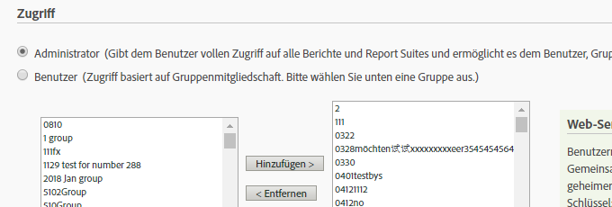
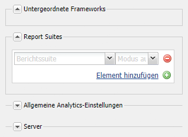
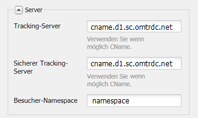

# Herstellen einer Verbindung mit Adobe Analytics und Erstellen von Frameworks {#connecting-to-adobe-analytics-and-creating-frameworks}

Erstellen Sie für das Tracking der Web-Daten von Ihren AEM-Seiten in Adobe Analytics eine Adobe Analytics-Cloud-Services-Konfiguration und ein Adobe Analytics-Framework:

* **Adobe Analytics-Konfiguration:** Die Informationen zu Ihrem Adobe Analytics-Konto. Die Adobe Analytics-Konfiguration ermöglicht AEM die Verbindung zu Adobe Analytics. Erstellen Sie eine Adobe Analytics-Konfiguration für jedes Konto, das Sie verwenden.
* **Adobe Analytics-Framework:** Eine Reihe von Zuweisungen zwischen der Adobe Analytics Report Suite und den CQ-Variablen. Verwenden Sie ein Framework, um zu konfigurieren, wie Ihre Website-Daten Ihre Adobe Analytics-Berichte auffüllen. Frameworks sind einer Adobe Analytics-Konfiguration zugeordnet. Sie können mehrere Frameworks für jede Konfiguration erstellen.

Wenn Sie eine Web-Seite mit einem Framework verknüpfen, führt das Framework das Tracking für diese Seite und die untergeordneten Elemente dieser Seite durch. Seitenansichten können dann von Adobe Analytics abgerufen und in der Sites-Konsole angezeigt werden.

## Voraussetzungen {#prerequisites}

### Adobe Analytics-Konto {#adobe-analytics-account}

Zum Tracking von AEM-Daten in Adobe Analytics müssen Sie über ein gültiges Adobe Analytics-Konto in Adobe Experience Cloud verfügen.

Das Adobe Analytics-Konto muss:

* Über **Administratorrechte** verfügen
* Der Benutzergruppe **Web-Dienstzugriff** zugeordnet sein

>[!CAUTION]
>
>Die Bereitstellung von **Administratorrechten** (innerhalb von Adobe Analytics) ist nicht ausreichend, um einer Person die Verbindung von AEM zu Adobe Analytics zu ermöglichen. Das Konto muss auch Berechtigungen zum **Webservice-Zugriff** haben.

Bevor Sie fortfahren, stellen Sie sicher, dass Sie sich mit Ihren Anmeldedaten bei Adobe Analytics anmelden können. Mit einer der folgenden Methoden:

* [Adobe Experience Cloud-Anmeldung](https://experience.adobe.com/de/#/@login/home)

* [Adobe Analytics-Anmeldung](https://sc.omniture.com/login/)

### Konfigurieren von AEM zur Verwendung Ihrer Adobe Analytics-Datenzentren {#configuring-aem-to-use-your-adobe-analytics-data-centers}

Adobe Analytics-[Datenzentren](https://experienceleague.adobe.com/docs/analytics/analyze/reports-analytics/reporting-interface/overview-data-collection.html?lang=de) erfassen, verarbeiten und speichern die mit Ihrer Adobe Analytics Report Suite verbundenen Daten. Sie müssen AEM so konfigurieren, dass es das Datenzentrum nutzt, in dem Ihre Adobe Analytics-Report Suite gehostet wird. Das Datenzentrum wird in Ihrem Vertrag erwähnt. Wenden Sie sich für diese Informationen an die Admins in Ihrer Organisation.

Verwenden Sie bei Bedarf Folgendes, um zum richtigen Datenzentrum weitergeleitet zu werden: `https://api.omniture.com/`.

Wenn Ihre Organisation eine Datenerfassung oder einen Datenabruf von einem bestimmten Datenzentrum benötigt, verwenden Sie Folgendes:

| Rechenzentrum | URL |
|---|---|
| London | `https://api3.omniture.com/` |
| Singapur | `https://api4.omniture.com/` |
| Oregon | `https://api5.omniture.com/` |

Verwenden Sie die [Web-Konsole zum Konfigurieren des OSGi-Bundles](/help/sites-deploying/configuring-osgi.md#osgi-configuration-with-the-web-console) **Adobe AEM Analytics HTTP-Client**. Fügen Sie die **Datenzentrum-URL** des Datenzentrums hinzu, in dem eine Report Suite gehostet wird, für die Ihre AEM-Seiten die Daten erfassen.

1. Öffnen Sie die Web-Konsole in Ihrem Webbrowser. ([https://localhost:4502/system/console/configMgr](https://localhost:4502/system/console/configMgr))
1. Geben Sie Ihre Anmeldedaten ein, um auf die Konsole zuzugreifen.

   >[!NOTE]
   >
   >Wenden Sie sich an Ihre Site-Administratorin oder Ihren Site-Administrator, um herauszufinden, ob Sie Zugriff auf diese Konsole haben.

1. Wählen Sie das Konfigurationselement mit dem Namen **Adobe AEM Analytics HTTP Client** aus.
1. Drücken Sie zum Hinzufügen der URL für ein Rechenzentrum auf die „+“-Schaltfläche neben der Liste mit **Datenzentrum-URLs** und geben Sie die URL in das Feld ein.

1. Um eine URL aus der Liste zu entfernen, klicken Sie auf die Schaltfläche „-“ neben der URL.
1. Klicken Sie auf „Speichern“.

## Konfigurieren der Verbindung zu Adobe Analytics {#configuring-the-connection-to-adobe-analytics}

>[!CAUTION]
>
>Aufgrund von Sicherheitsänderungen in der Adobe Analytics-API ist es nicht mehr möglich, die in AEM enthaltene Version von Activity Map zu verwenden.
>
>Ab jetzt muss das [über Adobe Analytics bereitgestellte Activity Map-Plug-in](https://experienceleague.adobe.com/docs/analytics/analyze/activity-map/getting-started/get-started-users/activitymap-install.html?lang=de) verwendet werden.

## Konfigurieren für die Activity Map {#configuring-for-the-activity-map}

>[!CAUTION]
>
>Aufgrund von Sicherheitsänderungen in der Adobe Analytics-API ist es nicht mehr möglich, die in AEM enthaltene Version von Activity Map zu verwenden.
>
>Ab jetzt muss das [über Adobe Analytics bereitgestellte Activity Map-Plug-in](https://experienceleague.adobe.com/docs/analytics/analyze/activity-map/getting-started/get-started-users/activitymap-install.html?lang=de) verwendet werden.

## Erstellen eines Adobe Analytics-Framework {#creating-a-adobe-analytics-framework}

Für die von Ihnen verwendete Report Suite-ID (RSID) können Sie steuern, welche Server-Instanzen (Autor, Veröffentlichung oder beides) Daten zur Report Suite beitragen:

* **Alle**: Informationen aus der Authoring- und der Publishing-Instanz werden in die Report Suite eingefügt.
* **Autor**: Die Report Suite wird nur mit Informationen aus der Authoring-Instanz gefüllt.
* **Veröffentlichen**: Die Report Suite wird nur mit Informationen aus der Veröffentlichungsinstanz gefüllt.

>[!NOTE]
>
>Durch die Auswahl des Typs der Server-Instanz werden Aufrufe nicht auf Adobe Analytics beschränkt, sondern lediglich gesteuert, welche Aufrufe die RSID enthalten.
>
>Beispielsweise ist ein Framework so konfiguriert, dass es die Report Suite *diiweretail* verwendet und „Autor“ die ausgewählte Server-Instanz ist. Wenn Seiten zusammen mit dem Framework veröffentlicht werden, werden weiterhin Aufrufe an Adobe Analytics gesendet, diese Aufrufe enthalten jedoch keine RSID. Nur Aufrufe von der Autoreninstanz beinhalten die Report Suite-ID.

1. Wählen Sie unter **Navigation** die Option **Tools** > **Cloud Services** und dann **Legacy-Cloud-Services** aus.
1. Blättern Sie zu **Adobe Analytics** und wählen Sie **Konfigurationen anzeigen** aus.
1. Klicken Sie auf den Link **[+]** neben Ihrer Adobe Analytics-Konfiguration.

1. Im Dialogfeld **Framework erstellen**:

   * Geben Sie einen **Titel** an.
   * Optional können Sie den **Namen** für den Knoten angeben, der die Framework-Details im Repository speichert.
   * Wählen Sie **Adobe Analytics-Framework** aus

   und klicken Sie auf **Erstellen**.

   Das Framework wird zur Bearbeitung geöffnet.

1. Klicken Sie im Abschnitt **Report Suites** des seitlichen Pods (rechts neben dem Hauptbedienfeld) auf **Element hinzufügen**. Verwenden Sie dann das Dropdown, um die Report Suite-ID (zum Beispiel `geometrixxauth`) auszuwählen, mit der das Framework interagieren soll.

   >[!NOTE]
   >
   >Im Content Finder auf der linken Seite werden Adobe Analytics-Variablen (SiteCatalyst-Variablen) eingetragen, wenn Sie eine Report Suite-ID auswählen.

1. Um die Serverinstanzen auszuwählen, die Informationen an die Report Suite senden sollen, verwenden Sie die **Ausführungsmodus** Dropdown-Liste (neben der Report Suite-ID).

   

1. Um das Framework in der Veröffentlichungsinstanz Ihrer Website zur Verfügung zu stellen, klicken Sie auf der Registerkarte **Seite** im Sidekick auf **Framework aktivieren**.

### Konfigurieren von Server-Einstellungen für Adobe Analytics {#configuring-server-settings-for-adobe-analytics}

Das Framework-System ermöglicht Ihnen die Änderung der Server-Einstellungen innerhalb jedes Adobe Analytics-Frameworks.

>[!CAUTION]
>
>Diese Einstellungen bestimmen, wohin und wie Ihre Daten gesendet werden. Deshalb dürfen Sie an *diesen Einstellungen nichts ändern* und sie nur von Ihrem Adobe Analytics-Repräsentanten einrichten lassen.

Öffnen Sie zunächst das Bedienfeld. Drücken Sie den Pfeil nach unten neben **Server**:

* **Tracking-Server**

   * Enthält die URL, die zum Senden von Adobe Analytics-Aufrufen verwendet wird

      * `cname` – standardmäßig der *Unternehmensname* im Adobe Analytics-Konto
      * `d1` – entspricht dem Rechenzentrum, an das die Informationen gesendet werden (entweder `d1`, `d2` oder `d3`)
      * `sc.omtrdc.net` – Domain-Name

* **Sicherer Tracking-Server**

   * Hat dieselben Segmente wie der Tracking-Server
   * wird zum Senden von Daten von sicheren Seiten verwendet (`https://`)

* **Besucher-Namespace**

   * Der Namespace bestimmt den ersten Teil der Tracking-URL.
   * Wird der Namespace zum Beispiel in **CNAME** geändert, hat dies zur Folge, dass Aufrufe an Adobe Analytics anders als das standardmäßige **CNAME.d1.omtrdc.net** aussehen.

## Verknüpfung einer Seite mit einem Adobe Analytics-Framework {#associating-a-page-with-a-adobe-analytics-framework}

Wenn eine Seite mit einem Adobe Analytics-Framework verknüpft wird, sendet die Seite beim Laden Daten an Adobe Analytics. Variablen, die auf der Seite eingetragen werden, werden zugeordnet und von den Adobe Analytics-Variablen im Framework abgerufen. Seitenansichten werden beispielsweise aus Adobe Analytics abgerufen.

Untergeordnete Elemente der Seite übernehmen die Verknüpfung mit dem Framework. Wenn Sie beispielsweise die Stammseite Ihrer Site mit einem Framework verknüpfen, werden alle Seiten der Site mit dem Framework verknüpft.

1. Wählen Sie in der **Sites-Konsole** die Seite aus, die Sie mit diesem Tracking einrichten möchten.
1. Öffnen Sie die **[Seiteneigenschaften](/help/sites-authoring/editing-page-properties.md)** entweder direkt über die Konsole oder über den Seiteneditor.
1. Öffnen Sie die Registerkarte **Cloud-Services**.

1. Verwenden Sie die **Konfiguration hinzufügen** Dropdown zur Auswahl **Adobe Analytics** aus den verfügbaren Optionen. Wenn die Vererbung platziert ist, deaktivieren Sie diese, bevor der Selektor verfügbar wird.

1. Der Dropdown-Selektor für **Adobe Analytics** wird an die verfügbaren Optionen angehängt. Wählen Sie die erforderliche Framework-Konfiguration aus.

1. Klicken Sie auf **Speichern und schließen**.
1. So aktivieren Sie die Seite und alle verbundenen Konfigurationen/Dateien: **[Veröffentlichen](/help/sites-authoring/publishing-pages.md)** Sie die Seite.
1. Der letzte Schritt besteht darin, die Seite in der Publishing-Instanz zu besuchen und nach einem Keyword (z. B. Aubergine) zu suchen, indem Sie die **Suche**-Komponente verwenden.
1. Sie können dann Aufrufe an Adobe Analytics mit einem entsprechenden Tool überprüfen. Zum Beispiel mit [Adobe Experience Cloud Debugger](https://experienceleague.adobe.com/docs/experience-platform/debugger/home.html?lang=de).
1. Unter Verwendung des angegebenen Beispiels sollte der Aufruf den in eVar7 eingegebenen Wert (d. h. Aubergine) enthalten und die Ereignisliste sollte „event3“ enthalten.

### Seitenansichten {#page-views}

Wenn eine Seite mit einem Adobe Analytics-Framework verknüpft ist, kann die Anzahl der Seitenaufrufe in der Listenansicht der Sites-Konsole angezeigt werden.

Siehe [Anzeigen von Seitenanalysedaten](/help/sites-authoring/page-analytics-using.md) für weitere Informationen.

### Konfigurieren des Importintervalls {#configuring-the-import-interval}

Konfigurieren Sie die entsprechende Instanz des Dienstes **Adobe AEM Managed Polling Configuration**:

* **Abrufintervall**:
Das Intervall in Sekunden, mit dem der Service die Seitenansichtsdaten von Adobe Analytics abruft.
Das Standardintervall beträgt 43.200.000 ms (12 Stunden).

* **Aktivieren**:
Aktivieren oder Deaktivieren des Service. Standardmäßig ist der Service aktiviert.

Zum Konfigurieren dieses OSGi-Service können Sie entweder die [Web-Konsole](/help/sites-deploying/configuring-osgi.md#osgi-configuration-with-the-web-console) oder einen [osgiConfig-Knoten im Repository](/help/sites-deploying/configuring-osgi.md#osgi-configuration-in-the-repository) verwenden (die Service-PID lautet `com.day.cq.polling.importer.impl.ManagedPollConfigImpl`).

## Bearbeiten von Konfigurationen und/oder Frameworks von Adobe Analytics {#editing-adobe-analytics-configurations-and-or-frameworks}

Navigieren Sie wie beim Erstellen einer Adobe Analytics-Konfiguration oder eines Adobe Analytics-Frameworks zum (veralteten) Bildschirm **Cloud-Services**. Wählen Sie **Konfigurationen anzeigen** aus und klicken Sie dann auf den Link zur spezifischen Konfiguration, die Sie aktualisieren möchten.

Drücken Sie beim Bearbeiten einer Adobe Analytics-Konfiguration auf **Bearbeiten**, wenn es auf der Konfigurationsseite selbst angezeigt wird, um das Dialogfeld **Komponente bearbeiten** zu öffnen.

## Löschen von Adobe Analytics-Frameworks {#deleting-adobe-analytics-frameworks}

Um ein Adobe Analytics-Framework zu löschen, müssen Sie es zunächst [zur Bearbeitung öffnen](#editing-adobe-analytics-configurations-and-or-frameworks).

Wählen Sie dann **Framework löschen** auf der Registerkarte **Seite** des Sidekicks aus.
