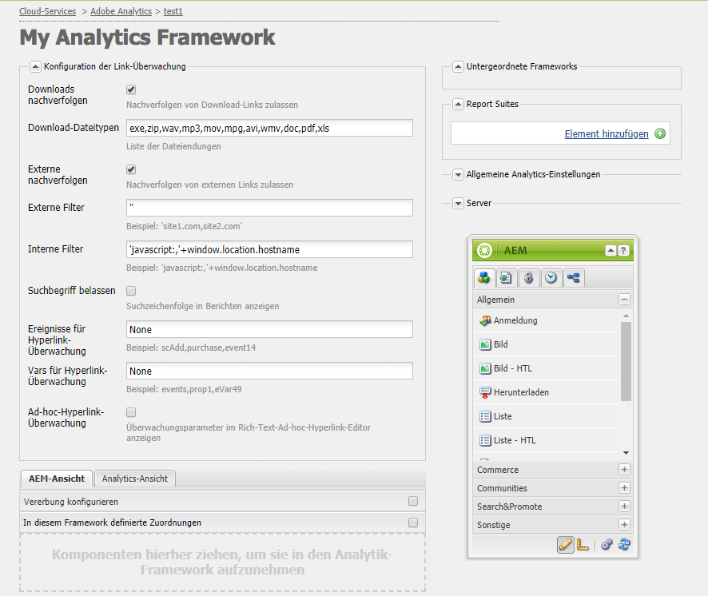
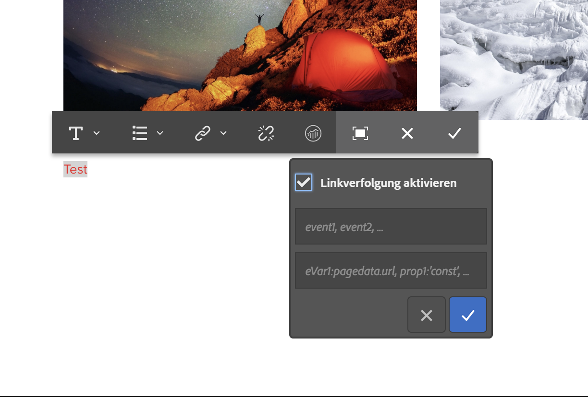

# Konfigurieren des Linktrackings für Adobe Analytics{#configuring-link-tracking-for-adobe-analytics}

Wenn Benutzer auf Links auf Seiten Ihrer Website klicken, können Sie zugehörige Informationen in Adobe Analytics erfassen. Verwenden Sie beispielsweise das Linktracking , um zu erfahren, wie Benutzer mit Ihrer Site interagieren, Dateidownloads verfolgen und Exitlinks verfolgen.

## Konfigurieren der Linktracking für ein Adobe Analytics-Framework {#configuring-link-tracking-for-an-adobe-analytics-framework}

1. Gehen Sie unter **Navigation** über **Bereitstellung** > **Cloud-Services** zum Abschnitt **Adobe Analytics**.

1. Öffnen Sie mit **Konfigurationen anzeigen** das erforderliche Adobe Analytics-Framework.
1. Erweitern Sie die **Linktracking-Konfiguration** und konfigurieren Sie sie nach Bedarf (auf dieser Seite finden Sie weitere Details):

   

## Nachverfolgen von Datei-Downloads {#tracking-file-downloads}

Konfigurieren Sie das Adobe Analytics-Framework, damit heruntergeladene Dateien von zugehörigen Seiten automatisch als Downloads in Adobe Analytics nachverfolgt werden. Wenn Sie das Tracking von Downloads aktivieren, werden nur die von Ihnen angegebenen Dateitypen verfolgt.

Downloads der folgenden Dateitypen werden standardmäßig verfolgt:

* exe
* zip
* wav
* mp3
* mov
* mpg
* avi
* wmv
* doc
* pdf
* xls

Wenn beispielsweise das Download-Tracking für PDF-Dateien aktiviert ist, wird der Download der PDF verfolgt, sobald Benutzer auf Links zu PDF-Dateien klicken.

Die Eigenschaften für die Download-Nachverfolgung werden als Code in der für eine Seite erstellten Datei `analytics.sitecatalyst.js` implementiert. Das folgende Code-Beispiel steht für eine standardmäßige Konfiguration zur Download-Nachverfolgung:

```
s.trackDownloadLinks= true;
s.linkDownloadFileTypes= 'exe,zip,wav,mp3,mov,mpg,avi,wmv,doc,pdf,xls';
```

So aktivieren Sie die Download-Nachverfolgung für Ihr Adobe Analytics-Framework:

1. [Öffnen Sie das Adobe Analytics-Framework und erweitern Sie den Abschnitt Konfiguration der Link-Überwachung](#configuring-link-tracking-for-an-adobe-analytics-framework).
1. Aktivieren **Tracking von Downloads**.
1. Im **Dateitypen herunterladen** Geben Sie die Dateinamenerweiterungen für die Dateitypen ein, die verfolgt werden sollen.

## Externe Links verfolgen {#tracking-external-links}

Sie können das Klicken auf externe Links (Exitlinks) auf Ihren Seiten verfolgen.

So verfolgen Sie externe Links für Ihr Adobe Analytics-Framework nach:

1. [Öffnen Sie das Adobe Analytics-Framework und erweitern Sie den Abschnitt **Konfiguration der Link-Überwachung**](#configuring-link-tracking-for-an-adobe-analytics-framework).
1. Konfigurieren Sie die folgenden Eigenschaften gemäß Ihren Anforderungen.

Eigenschaften zum Nachverfolgen beim Klicken auf externe Links:

* **Externe nachverfolgen**
Aktiviert die Nachverfolgung externer Links.

* **Externe Filter**
(Optional) Definiert Filter zum Abgleichen der externen URLs von Link-Zielen. Wenn die Link-Ziele mit dem Filter übereinstimmen, wird der Link verfolgt. Externe Filter sind nützlich, um nur einige der externen Links auf Ihren Seiten zu verfolgen.

  Um die nachzuverfolgenden externen Links festzulegen, geben Sie die URL des Link-Ziels vollständig oder teilweise ein. Trennen Sie mehrere Filter durch ein Komma. Schließen Sie Zeichenfolgenliterale in einfache Anführungszeichen ein. Ist kein Wert angegeben (Standardwert `''`, zwei einfache Anführungszeichen), werden alle externen Links nachverfolgt.

* **Interne Filter**
Definiert Filter zum Abgleichen der URLs interner Links. Wenn der Link auf URLs ausgerichtet ist, die diesem Filter entsprechen, wird der Link nicht verfolgt. Der Standardwert ist ein JavaScript-Befehl, der den Hostnamen der URL für die aktuelle Fensteradresse zurückgibt.

  Um die nicht nachverfolgten internen Links festzulegen, geben Sie die interne URL des Link-Ziels vollständig oder teilweise ein. Trennen Sie mehrere Filter durch ein Komma. Schließen Sie Zeichenfolgenliterale in einfache Anführungszeichen ein.

  Der Standardwert ist `'javascript:,'+window.location.hostname`

* **Suchbegriff belassen**
Schließt URL-Parameter ein, wenn Übereinstimmungen mit internen und externen Filtern bewertet werden.

  Aktivieren Sie diese Option, wenn Sie URL-Parameter bei der Bewertung von Link-Ziel-URLs mit externen und internen Filtern einbeziehen möchten.

Die Eigenschaften für die Nachverfolgung externer Links werden als Code in der für eine Seite erstellten Datei `analytics.sitecatalyst.js` implementiert. Der folgende Beispiel-Code wird für eine Seite mit einem Framework generiert, für das die Nachverfolgung externer Links aktiviert ist – mit folgender Konfiguration:

* Der externe Filter ist: `'google.com'`
* Der interne Filter entspricht dem Standardwert: `'javascript:,'+window.location.hostname`
* Suchbegriffe sind nicht beim Bewerten des Link-Ziels gegenüber den Filtern eingeschlossen.

```
s.trackExternalLinks= false;
s.linkExternalFilters= 'google.com';
s.linkInternalFilters= 'javascript:,'+window.location.hostname;
s.linkLeaveQueryString= false;
```

## Senden von Variablendaten bei Link-Klicks {#sending-variable-data-with-link-clicks}

Sie können AEM so konfigurieren, dass Ereignis- und Variablendaten an Adobe Analytics gesendet werden, wenn Benutzende auf einen Link klicken. Über die Eigenschaften **Konfiguration der Link-Überwachung** können Sie die Adobe Analytics-Ereignisse und -Variablen angeben, die bei Link-Klicks nachverfolgt werden sollen.

Die Framework-Zuordnungen bestimmen die Ereignis- und Variablenwerte. Sie können Adobe Analytics-Variablen den Variablen Ihrer Inhaltskomponenten zuordnen, die die bei Link-Klicks nachzuverfolgenden Daten speichern.

So senden Sie Variablendaten bei Link-Klicks:

1. [Öffnen Sie das Adobe Analytics-Framework und erweitern Sie den Abschnitt Konfiguration der Link-Überwachung](#configuring-link-tracking-for-an-adobe-analytics-framework).
1. Konfigurieren Sie die folgenden Eigenschaften gemäß Ihren Anforderungen.

Eigenschaften zum Senden von Variablendaten bei Link-Klicks:

* **Ereignisse für Hyperlink-Überwachung**
Geben Sie die Adobe Analytics-Ereignisvariablen ein, die zum Zählen der Link-Klicks verwendet werden sollen.

  Trennen Sie mehrere Variablennamen durch Kommas.

  Beim Standardwert `None` werden keine Ereignisse nachverfolgt.

* **Vars für Hyperlink-Überwachung**
Geben Sie die Adobe Analytics-Variablen ein, die bei Link-Klicks an Adobe Analytics gesendet werden sollen. Trennen Sie mehrere Variablennamen durch Kommas.

  Beim Standardwert `None` werden keine Variablendaten gesendet.

Wenn Sie die zu sendenden Ereignisse und Variablen angeben, wird die Konfiguration als Code in der für eine Seite generierten Datei `analytics.sitecatalyst.js` implementiert. Der folgende Beispiel-Code wird für eine Seite generiert, wenn das Framework das Ereignis `event10` und die Eigenschaft `prop4` nachverfolgt:

```
s.linkTrackEvents= 'event10';
s.linkTrackVars= 'prop4';
```

## Beispielhafte Konfiguration der Link-Überwachung {#example-link-tracking-configuration}

Gehen Sie wie folgt vor, um sich mit dem Verhalten bei der Link-Überwachung der Adobe Analytics-Integration vertraut zu machen. Die Verfahren zeigen Ergebnisse aus [Adobe Marketing Cloud Debugger](https://experienceleague.adobe.com/docs/debugger/using/experience-cloud-debugger.html?lang=de).

### Allgemeine Konfiguration {#general-configuration}

Dieses Beispiel zeigt, wie die Zuordnung im Zusammenhang mit der Überwachung und dem Debugger erfolgt:

1. Öffnen Sie das mit einer Web-Seite verknüpfte Framework.
1. Ziehen Sie die **Seite** -Komponente in den Zuordnungsbereich des Frameworks. Die **Seitenkomponente** gehört zur Komponentengruppe **Allgemein** im Sidekick.

   >[!NOTE]
   >
   >Die Komponente, die Sie in einem realen Szenario verwenden sollten, hängt von der von übernommenen Komponente ab (wenn überhaupt).
   >
   >Wenn nicht, sollten Sie dort Ihre eigene Komponente verfügbar machen (indem Sie einen Analytics-Unterknoten in der zugehörigen Seitenkomponente definieren).

   Konfigurieren Sie die Zuordnung gemäß der folgenden Tabelle, indem Sie die Analytics-Variable (SiteCatalyst) aus dem linken Seitenbereich ziehen:

<table>
 <tbody>
  <tr>
   <th>CQ-Variable<br /> </th>
   <th>Eintrag im Variablenbrowser<br /> </th>
   <th>Adobe Analytics-Variable</th>
  </tr>
  <tr>
   <td>pagedata.title</td>
   <td>Benutzerdefiniertes eVar 1 (eVar1)</td>
   <td>eVar1</td>
  </tr>
  <tr>
   <td>eventdata.events.pageView</td>
   <td>Benutzerdefiniert 1 (event1)</td>
   <td>event1</td>
  </tr>
 </tbody>
</table>

1. Ziehen Sie die Suchkomponente in den Zuordnungsbereich des Frameworks. Die Suchkomponente gehört zur Komponentengruppe &quot;Allgemein&quot;im Sidekick. Konfigurieren Sie die Zuordnung gemäß der folgenden Tabelle, indem Sie die Analytics-Variable (SiteCatalyst) aus dem linken Seitenbereich ziehen:

<table>
 <tbody>
  <tr>
   <th>CQ-Variable<br /> </th>
   <th>Eintrag im Variablenbrowser</th>
   <th>Adobe Analytics-Variable</th>
  </tr>
  <tr>
   <td>eventdata.keyword</td>
   <td>Benutzerspezifische eVar 2 (eVar2)</td>
   <td>eVar2</td>
  </tr>
  <tr>
   <td>eventdata.results</td>
   <td>Benutzerspezifische eVar 3 (eVar3)</td>
   <td>eVar3</td>
  </tr>
  <tr>
   <td>eventdata.events.search</td>
   <td>Benutzerspezifisch 2 (event2)</td>
   <td>event2</td>
  </tr>
 </tbody>
</table>

### Externes Linktracking konfigurieren {#configure-external-link-tracking}

1. Erweitern Sie in Ihrem Framework die **Linktracking-Konfiguration** Bereich.
1. Heben Sie die Auswahl für **Downloads nachverfolgen** auf.

1. Auswählen **Externes Tracking**.
1. Auswahl deaktivieren **Abfragezeichenfolge beibehalten**.
1. Verwenden Sie den folgenden Wert für die Liste **Externe Filter**, um diesen als externe URL anzugeben:

   `'yahoo.com'`

1. Fügen Sie dem Feld **Ereignisse für Hyperlink-Überwachung** den folgenden Wert hinzu:

   ```
       event1,event2
   ```

1. Fügen Sie dem Feld **Vars für Hyperlink-Überwachung** den folgenden Wert hinzu:

   ```
       eVar1,eVar2
   ```

1. Fügen Sie auf der mit dem Framework verknüpften Seite eine **Textkomponente** hinzu. Fügen Sie innerhalb der **Textkomponente** einen Hyperlink zur folgenden Adresse hinzu:

   `https://search.yahoo.com/?p=this`

1. Wechseln Sie in den **Vorschaumodus** und klicken Sie auf den Link.

Der Abruf sieht bei der Anzeige mit Adobe Marketing Cloud Debugger wie folgt aus:


>[!NOTE]
>
>Die URL umfasst nicht die Abfragezeichenfolge: `?p=this`

### URL-Parameter einschließen {#include-the-url-parameter}

1. Erweitern Sie im Framework die **Linktracking-Konfiguration** Bereich.
1. Aktivieren **Abfragezeichenfolge beibehalten**.
1. Laden Sie die Seitenvorschau neu und klicken Sie auf den Link.

Die in Adobe Marketing Cloud Debugger angezeigten Aufrufdetails ähneln dem folgenden Beispiel:


>[!NOTE]
>
>Dieses Mal umfasst die URL die Abfragezeichenfolge: `?p=this`

## Ad-hoc-Linktracking {#ad-hoc-link-tracking}

Beim Ad-hoc-Linktracking können Inhaltsautoren das Linktracking für eine Komponente konfigurieren. Die Konfiguration der Komponente setzt die **Linktracking-Konfiguration** des Frameworks, sodass auf Seiten, die mit dem Framework verknüpft sind, **Text** -Komponenten können für das Linktracking von URLs konfiguriert werden.

Durch eine Ad-hoc-Hyperlink-Überwachung können Sie Download-Links und externe Links zusammen mit Ereignis- und Variablendaten nachverfolgen.

Zum Aktivieren der Ad-hoc-Hyperlink-Überwachung müssen Sie wie folgt vorgehen:

* [Verknüpfen Sie die Seite, die die **Text** Komponente mit dem Framework](/help/sites-administering/adobeanalytics-connect.md#associating-a-page-with-a-adobe-analytics-framework).
* [Konfigurieren des Adobe Analytics-Frameworks zur Aktivierung des Ad-hoc-Linktrackings](#enabling-ad-hoc-link-tracking).
* [Konfigurieren Sie die Link-Überwachung für eine Textkomponente](#configuring-link-tracking-for-a-text-component).

### Aktiveren der Ad-hoc-Hyperlink-Überwachung {#enabling-ad-hoc-link-tracking}

Konfigurieren Sie das Adobe Analytics-Framework, um die Ad-hoc-Hyperlink-Überwachung zu aktivieren.

1. Öffnen Sie das Adobe Analytics-Framework und erweitern Sie den Abschnitt **Konfiguration der Link-Überwachung**.

1. Aktivieren **Ad-hoc-Linktracking**.

   >[!NOTE]
   >
   >Nicht alle Benutzertypen haben Zugriff auf dieses Kontrollkästchen. Wenden Sie sich an Ihren Site-Administrator, wenn Sie Zugriff benötigen.

>[!NOTE]
>
>Die XSS Antisamy-Konfiguration befindet sich nun in SLING unter dem Pfad **/libs/sling/xss.config.xml**. Die folgenden Regeln müssen hinzugefügt werden, damit Ad-hoc-Hyperlinks funktionieren:

#### Tag-Regelerweiterung verankern {#anchor-tag-rule-extension}

```xml
<attribute name="onclick">
    <literal-list>
        <literal value="CQ_Analytics.Sitecatalyst.customTrack(this)"/>
    </literal-list>
</attribute>
<attribute name="adhocenable">
    <literal-list>
        <literal value="true"/>
        <literal value="false"/>
    </literal-list>
</attribute>
<attribute name="adhocevents">
    <regexp-list>
        <regexp name="anything"/>
    </regexp-list>
</attribute>
<attribute name="adhocevars">
    <regexp-list>
        <regexp name="anything"/>
    </regexp-list>
</attribute>
```

### Konfigurieren der Linktracking für eine Textkomponente {#configuring-link-tracking-for-a-text-component}

Um die Ad-hoc-Link-Überwachung für **Textkomponenten** konfigurieren zu können, müssen die folgenden Konfigurationen bereits implementiert worden sein:

* Die [Das Adobe Analytics-Framework ist so konfiguriert, dass das Ad-hoc-Linktracking aktiviert wird](#enabling-ad-hoc-link-tracking).
* Die [-Seite, die die **Text** Komponente ist mit dem Framework verknüpft](/help/sites-administering/adobeanalytics-connect.md#associating-a-page-with-a-adobe-analytics-framework).

Gehen Sie wie folgt vor, um die Link-Überwachung für eine **Textkomponente** zu konfigurieren:

1. Öffnen Sie die Seite im Bearbeitungsmodus und bearbeiten Sie die **Textkomponente**.

1. Wählen Sie den als Hypertext zu verwendenden Text aus und klicken Sie auf die Schaltfläche „Hyperlink“.

   

1. Fügen Sie die Ziel-URL dem Feld „Verknüpfung zu“ hinzu und erweitern Sie dann den Bereich für die Link-Verfolgung.

   >[!NOTE]
   >
   >Das benutzerdefinierte Linktracking ist als separate Aktion neben der Aktion Link/Verknüpfung aufheben (Analytics-Symbol) sichtbar.
   >
   >Sie wird nur aktiviert, wenn Sie einen gültigen Link im RTE ausgewählt haben.

   

1. Aktivieren Sie **Tracking benutzerdefinierter Links**, um die Konfiguration der Link-Überwachung des Adobe Analytics-Frameworks außer Kraft zu setzen und die Link-Überwachung für den aktuellen Link zu aktivieren.

1. (Optional) Zum Nachverfolgen von Ereignissen mit dem Link-Klick fügen Sie dem Feld **Adobe Analytics-Variablen einschließen** Adobe Analytics-Ereignisnamen hinzu. Trennen Sie mehrere Ereignisnamen durch Kommas, z. B.

   `event1, event22`.

1. (Optional) Zum Nachverfolgen von Variablendaten mit dem Link-Klick fügen Sie dem Feld **Adobe Analytics-Variablen einschließen** Adobe Analytics-Variablen hinzu. Verwenden Sie eines der folgenden Formate:

   * *`<Variable-name>`*: *`<Dynamic Value>`*
   * *`<Variable-name>`*: *`'CONSTANT'`*

   Beispiele für das jeweilige Format:

   * `eVar10:pagedata.title`
   * `prop1: 'Aubergine'`

   Trennen Sie mehrere Werte durch Kommas.

1. Klicken Sie auf **OK**.
