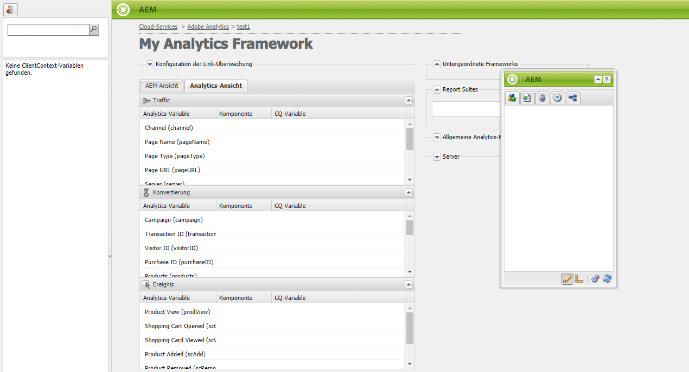
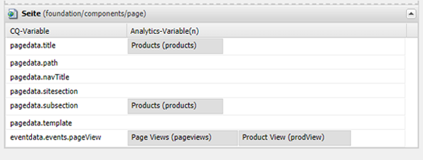
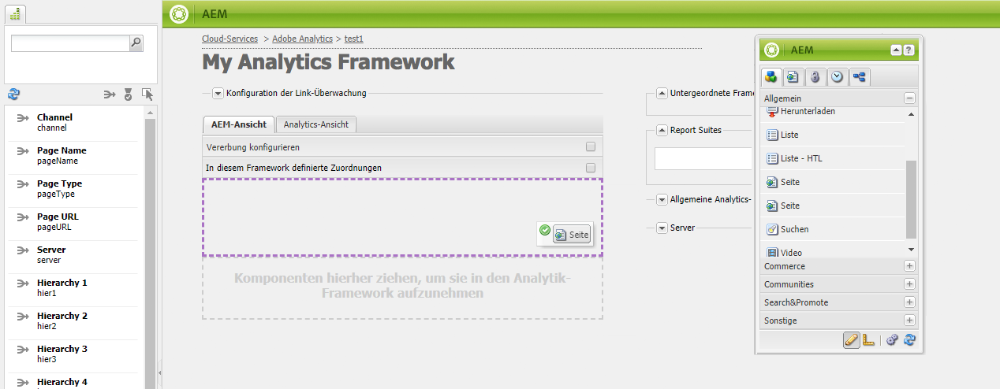
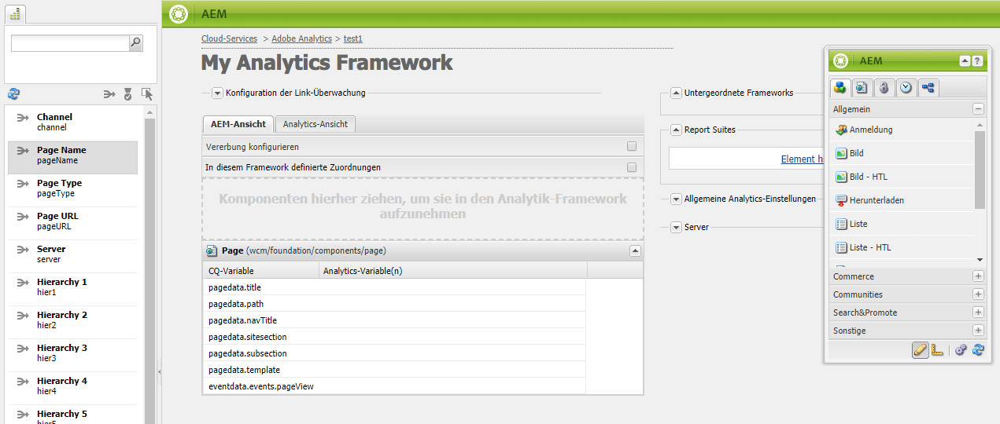
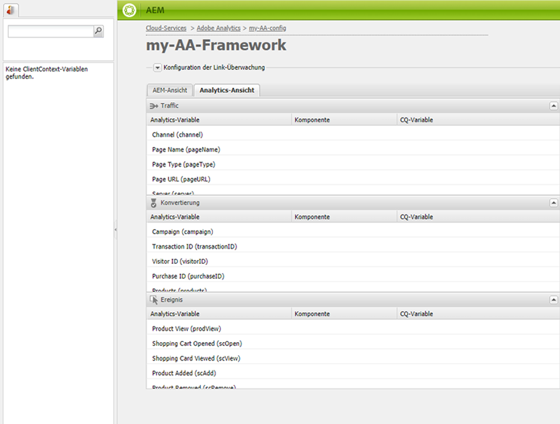
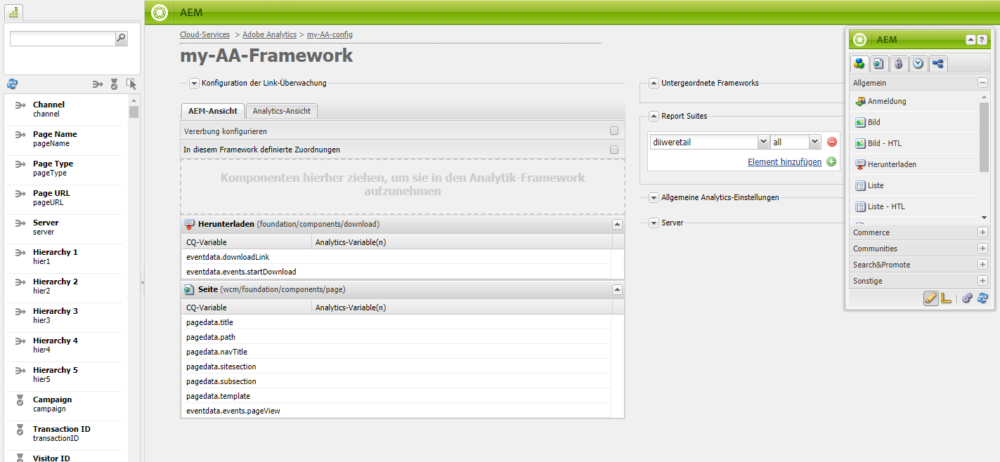

# Zuordnen von Komponentendaten zu Adobe Analytics-Eigenschaften{#mapping-component-data-with-adobe-analytics-properties}

Fügen Sie Komponenten zum Framework hinzu, die Daten sammeln, um sie an Adobe Analytics zu senden. Komponenten zur Sammlung von Analysedaten speichern die Daten in der entsprechenden **CQ-Variablen**. Wenn Sie eine solche Komponente zu einem Framework hinzufügen, zeigt das Framework die Liste der CQ-Variablen an, damit Sie jede der entsprechenden **Analytics-Variablen** hinzufügen können.

Wenn die **AEM Ansicht** geöffnet ist, werden die Analytics-Variablen im Content Finder angezeigt.

Sie können mehrere Analytics-Variablen mit derselben **CQ-Variablen** zuordnen.

Die zugeordneten Daten werden an Adobe Analytics gesendet, wenn die Seite geladen wird und die folgenden Bedingungen erfüllt sind:

* Die Seite ist mit dem Framework verknüpft.
* Die Seite nutzt die Komponenten, die zum Framework hinzugefügt werden.

Gehen Sie wie folgt vor, um CQ-Komponentenvariablen den Adobe Analytics-Berichtseigenschaften zuzuordnen.

1. Ziehen Sie in der **AEM Ansicht** eine Tracking-Komponente aus dem Sidekick in das Framework. Wählen Sie z. B. die Komponente **Seite** aus der Kategorie **Allgemein.**

   

   Es gibt mehrere standardmäßige Komponentengruppen: **Allgemein**, **Commerce**, **Communities**, **Search&amp;Promote** und **Sonstige**. Je nach Konfiguration zeigt Ihre AEM-Instanz möglicherweise andere Gruppen und Komponenten an.

1. Um Adobe Analytics-Variablen Variablen Variablen zuzuordnen, die in der Komponente definiert sind, ziehen Sie eine **Analytics-Variable** aus dem Content Finder auf ein Feld in der Tracking-Komponente. Ziehen Sie beispielsweise `Page Name (pageName)` auf `pagedata.title`.

   

   >[!NOTE]
   >
   >Die für das Framework ausgewählte Report Suite-ID (RSID) bestimmt die Adobe Analytics-Variablen, die im Content Finder angezeigt werden.

1. Wiederholen Sie die vorhergehenden beiden Schritte für andere Komponenten und Variablen.

   >[!NOTE]
   >
   >Sie können mehrere Analytics-Variablen (z. B. `props`, `eVars`, `events`) auf dieselbe CQ-Variable (z. B. `pagedata.title`)

   >[!CAUTION]
   >
   >Wir empfehlen Ihnen dringend Folgendes:
   >    
   >    * `eVars` und  `props` sind CQ-Variablen zugeordnet, die mit  `pagedata.X` oder beginnen  `eventdata.X`
      >    
      >    
   * Ereignisse werden dagegen Variablen zugeordnet, die mit `eventdata.events.X` beginnen.

1. Um das Framework in der Veröffentlichungsinstanz Ihrer Site verfügbar zu machen, öffnen Sie die Registerkarte **Seite** des Sidekicks und klicken Sie auf **Framework aktivieren.**

## Zuordnen produktbezogener Variablen {#mapping-product-related-variables}

AEM verwendet eine Konvention zum Benennen produktbezogener Variablen und Ereignisse, die produktbezogenen Eigenschaften von Adobe Analytics zugeordnet werden sollen:

| CQ-Variable | Analytics-Variable | Beschreibung |
|---|---|---|
| `product.category` | `product.category` (Konversionsvariable) | Die Produktkategorie |
| `product.sku` | `product.sku` (Konversionsvariable) | Die Produkt-SKU |
| `product.quantity` | `product.quantity` (Konversionsvariable) | Die Anzahl an gekauften Produkten |
| `product.price` | `product.price` (Konversionsvariable) | Der Produktpreis |
| `product.events.<eventName>` | Die Erfolgsereignisse, die mit dem Produkt im Bericht verknüpft werden sollen. | `product.events` ist das Präfix für Ereignisse namens *eventName.* |
| `product.evars.<eVarName>` | Die Konversionsvariablen (`eVar`), die mit dem Produkt verknüpft werden sollen. | `product.evars` ist das Präfix für eVar-Variablen namens *eVarName.* |

Mehrere AEM Commerce-Komponenten nutzen diese Variablennamen.

>[!NOTE]
>
>Ordnen Sie die Adobe Analytics Products-Eigenschaft nicht einer CQ-Variablen zu. Die Konfiguration produktbezogener Zuordnungen, wie in der Tabelle beschrieben, entspricht der Zuordnung der Produktvariablen.

### Prüfen von Berichten in Adobe Analytics {#checking-reports-on-adobe-analytics}

1. Melden Sie sich bei der Adobe Analytics-Website mit den gleichen Anmeldedaten an, die AEM bereitgestellt wurden.
1. Stellen Sie sicher, dass Sie dieselbe RSID nutzen wie im vorherigen Schritt.
1. Wählen Sie unter **Berichte** (auf der linken Seite der Seite) die Option **Benutzerspezifische Konversion** und dann **Benutzerspezifische Konversion 1–10** aus. Wählen Sie die Variable aus, die `eVar7` entspricht.

1. Abhängig von der verwendeten Adobe Analytics-Version müssen Sie durchschnittlich 45 Minuten warten, bis der Bericht mit dem verwendeten Suchbegriff aktualisiert wird. Beispiel: Aubergine im Beispiel

## Verwenden des Content Finder (cf#) mit Adobe Analytics-Frameworks {#using-the-content-finder-cf-with-adobe-analytics-frameworks}

Wenn Sie ein Adobe Analytics-Framework zum ersten Mal öffnen, enthält der Content Finder vordefinierte Analytics-Variablen unter:

* Traffic
* Konversion
* Ereignisse

Wenn Sie eine RSID auswählen, werden alle zu dieser RSID gehörenden Variablen zur Liste hinzugefügt.\
`cf#` ist erforderlich, um Analytics-Variablen den CQ-Variablen zuzuordnen, die in den verschiedenen Tracking-Komponenten vorhanden sind. Siehe „Einrichten eines Frameworks für das grundlegende Tracking“.

Je nach der für das Framework ausgewählten Ansicht wird der Content Finder entweder durch Analytics-Variablen (in AEM Ansicht) oder CQ-Variablen (in der Analytics-Ansicht) aufgefüllt.

Sie können mit der Liste wie folgt arbeiten:

1. In der **AEM-Ansicht** können Sie abhängig vom ausgewählten Variablentyp die Liste mit drei Filterschaltflächen filtern:

   * Wenn die *Schaltfläche „Nein“* ausgewählt ist, wird die komplette Liste angezeigt.
   * Wenn die Schaltfläche **Traffic** ausgewählt ist, zeigt die Liste nur die Variablen an, die zum Abschnitt &quot;Traffic&quot;gehören.
   * Wenn die Schaltfläche **Konversion** ausgewählt ist, zeigt die Liste nur die Variablen an, die zum Abschnitt &quot;Konversion&quot;gehören.
   * Wenn die Schaltfläche **Ereignisse** ausgewählt ist, werden in der Liste nur die Variablen angezeigt, die zum Bereich „Ereignisse“ gehören.

   >[!NOTE]
   >
   >Sie können immer nur eine Filterschaltfläche aktivieren.

   >[!NOTE]
   >
   >Auch Search&amp;Promote-Variablen gehören zum Abschnitt &quot;Konversion&quot;.

   1. Die Liste bietet auch eine Suchfunktion, die die Elemente entsprechend dem im Suchfeld eingegebenen Text filtert.
   1. Wenn bei der Suche nach Elementen in der Liste eine Filteroption aktiviert ist, werden auch die angezeigten Ergebnisse gemäß der aktivierten Schaltfläche gefiltert.
   1. Über die Schaltfläche mit den runden Pfeilen können Sie die Liste jederzeit neu laden.
   1. Wenn Sie mehrere RSIDs im Framework auswählen, werden alle Variablen in der Liste angezeigt. Dabei werden alle Beschriftungen verwendet, die in den ausgewählten RSIDs genutzt werden.

1. In der Adobe Analytics-Ansicht zeigt der Content Finder alle CQ-Variablen an, die zu den Tracking-Komponenten gehören, die in die CQ-Ansicht gezogen wurden.

   * Beispiel: Wenn die **Download-Komponente** die *nur eine in die CQ-Ansicht gezogen wurde (die zwei zuordnbare Variablen* eventdata.downloadLink *und* eventdata.events.startDownload *hat), sieht der Content Finder beim Wechsel zur Adobe Analytics-Ansicht wie folgt aus:*

   

   * Die Variablen können auf eine beliebige Adobe Analytics-Variable gezogen und abgelegt werden, die zu einem der drei Variablenbereiche (**Traffic**, **Konversion** und **Ereignisse**) gehört.

   * Beim Ziehen einer neuen Tracking-Komponente in das Framework in der CQ-Ansicht werden die CQ-Variablen, die zur Komponente gehören, automatisch zum Content Finder (cf#) in der Adobe Analytics-Ansicht hinzugefügt.
   >[!NOTE]
   >
   >Es kann nur eine CQ-Variable gleichzeitig einer Adobe Analytics-Variablen zugeordnet werden

## Verwenden der AEM-Ansicht und der Analytics-Ansicht {#using-aem-view-and-analytics-view}

Benutzer haben jederzeit die Möglichkeit, auf einer Framework-Seite zwischen zwei Möglichkeiten zur Anzeige der Adobe Analytics-Zuordnungen zu wechseln. Diese beiden Ansichten bieten mit ihren beiden unterschiedlichen Perspektiven einen besseren Überblick über die Zuordnungen im Framework.

### AEM-Ansicht  {#aem-view}

Das obige Bild dient als Beispiel. Die **AEM-Ansicht** hat die folgenden Eigenschaften:

1. Dies ist die Standardansicht, wenn das Framework geöffnet wird.
1. Linke Seite: der Content Finder (cf#) anhand der ausgewählten RSID(s) durch Adobe Analytics-Variablen aufgefüllt wird.
1. Registerkartenkopfzeilen (**AEM-Ansicht** und **Analytics-Ansicht**): Verwenden Sie diese, um zwischen den beiden Ansichten zu wechseln.

1. **AEM-Ansicht**:

   1. Wenn das Framework Komponenten enthält, die vom übergeordneten Framework vererbt wurden, werden sie hier aufgeführt, zusammen mit den Variablen, die den Komponenten zugeordnet sind.

      1. Vererbte Komponenten sind gesperrt.
      1. Um eine geerbte Komponente zu entsperren, doppelklicken Sie einfach auf das Schlosssymbol neben dem Namen der Komponente.
      1. Um die Vererbung rückgängig zu machen, müssen Sie die entsperrte Komponente löschen. Sie erhält daraufhin den Status „gesperrt“ zurück.
   1. **Ziehen Sie Komponenten in diesen Bereich, um sie zum Analytics-Framework hinzuzufügen**: Komponenten können aus dem Sidekick hierhin gezogen werden.
   1. Hier finden Sie alle Komponenten, die derzeit im Analytics-Framework enthalten sind:

      1. Um eine Komponente hinzuzufügen, ziehen Sie sie aus der Registerkarte „Komponenten“ vom Sidekick in das Framework.
      1. Um eine Komponente und alle zugehörigen Zuordnungen zu löschen, wählen Sie im Kontextmenü der Komponente die Option Löschen und akzeptieren Sie dann den Löschvorgang im Bestätigungsdialogfeld.
      1. Beachten Sie, dass Sie eine Komponente nur aus dem Framework löschen können, in dem sie erstellt wurde, und sie nicht im eigentlichen Sinne aus untergeordneten Frameworks löschen können. (Sie können sie dort nur überschreiben.)

### Analytics-Ansicht {#analytics-view}

1. Um auf diese Ansicht zuzugreifen, wechseln Sie im Framework zur Registerkarte **Analytics-Ansicht.**
1. Linke Seite: Content Finder (cf#) mit CQ-Variablen, basierend auf den Komponenten, die in der CQ-Ansicht zum Framework hinzugefügt wurden.
1. Registerkartenkopfzeilen (**AEM-Ansicht** und **Analytics-Ansicht**): Verwenden Sie diese, um zwischen den beiden Ansichten zu wechseln.

1. Die drei Tabellen (Traffic, Konversion, Ereignis) listen alle verfügbaren Adobe Analytics-Variablen auf. die zu den ausgewählten RSIDs gehören. Die hier angezeigten Zuordnungen sollten dieselben sein wie in der AEM-Ansicht:

   * **Traffic**:

      * Traffic-Variable ( `prop1`), die einer CQ-Variablen ( `eventdata.downloadLink`) zugeordnet ist

      * Wenn neben der Komponente ein Schlosssymbol angezeigt wird, weist dies darauf hin, dass die Komponente von einem übergeordneten Framework geerbt wurde und daher nicht bearbeitet werden kann.
   * **Konversion**:

      * Konversionsvariable ( `eVar1`), die einer CQ-Variablen ( `pagedata.title`) zugeordnet ist

      * Konversionsvariable (`eVar3`), die einem JavaScript-Ausdruck zugeordnet ist, der inline hinzugefügt wurde (durch Doppelklicken auf das CQ-Variablen-Feld und manuelles Eingeben des Codes)
   * **Ereignis**:

      * Ereignisvariable ( `event1`), die einem CQ-Ereignis ( `eventdata.events.pageView`) zugeordnet ist

>[!NOTE]
>
>Die Spalte der CQ-Variablen in jeder Tabelle kann auch inline ausgefüllt werden, indem auf das Feld doppelgeklickt und dann der gewünschte Text eingegeben wird. Diese Felder akzeptieren JavaScript als Eingabe.
>
>* Beispielsweise können Sie neben `prop3`
>* `'`* `Adobe:'+pagedata.title+':'+pagedata.sitesection`\
   >  , um den *Titel* einer mit *sitesection* verketteten Seite mit *:* (Doppelpunkt) zu senden, wobei *Adobe* als `prop3` vorangestellt wird.

>

>[!CAUTION]
>
>Es kann immer nur eine CQ-Variable einer Adobe Analytics-Variablen zugeordnet werden.
