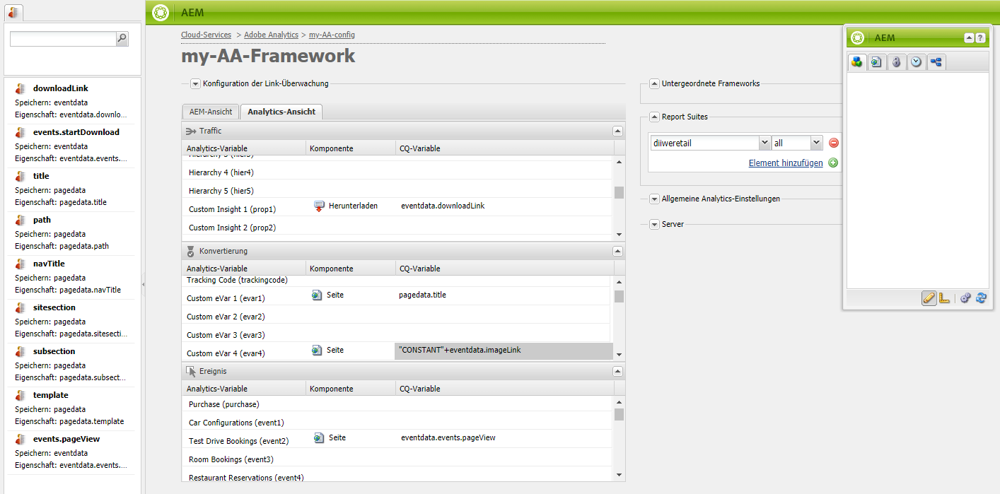

# Zuordnen von Komponentendaten zu Adobe Analytics-Eigenschaften{#mapping-component-data-with-adobe-analytics-properties}

Fügen Sie Komponenten zum Framework hinzu, die Daten sammeln, um sie an Adobe Analytics zu senden. Komponenten zur Sammlung von Analysedaten speichern die Daten in der entsprechenden **CQ-Variablen**. When you add such a component to a framework, the framework displays the list of CQ variables so that you can each to the appropriate **Analytics variable**.

When the **AEM view** is open the Analytics variables appear in the content finder.

You can map multiple Analytics variables with the same **CQ variable**.

Die zugeordneten Daten werden an Adobe Analytics gesendet, wenn die Seite geladen wird und die folgenden Bedingungen erfüllt sind:

* Die Seite ist mit dem Framework verknüpft.
* Die Seite nutzt die Komponenten, die zum Framework hinzugefügt werden.

Verwenden Sie das folgende Verfahren, um CQ-Komponentenvariablen den Adobe Analytics-Berichtseigenschaften zuzuordnen.

1. In the **AEM view**, drag a tracking component from sidekick onto the framework. Wählen Sie z. B. die Komponente **Seite** aus der Kategorie **Allgemein.**

   

   Es gibt mehrere standardmäßige Komponentengruppen: **Allgemein**, **Commerce**, **Communities**, **Search&amp;Promote** und **Sonstige**. Je nach Konfiguration zeigt Ihre AEM-Instanz möglicherweise andere Gruppen und Komponenten an.

1. To map Adobe Analytics variables with variables that are defined in the component, drag an **Analytics variable** from the content finder onto a field on the tracking component. Ziehen Sie beispielsweise `Page Name (pageName)` nach `pagedata.title`.

   

   >[!NOTE]
   >
   >Die für das Framework ausgewählte Report Suite-ID (RSID) bestimmt die Adobe Analytics-Variablen, die in der Inhaltssuche angezeigt werden.

1. Wiederholen Sie die vorhergehenden beiden Schritte für andere Komponenten und Variablen.

   >[!NOTE]
   >
   >You can map multiple Analytics variables (e.g. `props`, `eVars`, `events`) to the same CQ variable (e.g. `pagedata.title`)

   >[!CAUTION]
   >
   >Wir empfehlen Ihnen dringend Folgendes:
   >    
   >    * `eVars` und `props` werden CQ-Variablen zugeordnet, die entweder mit `pagedata.X` oder `eventdata.X`
      >    
      >    
   * Ereignisse werden dagegen Variablen zugeordnet, die mit `eventdata.events.X` beginnen.

1. To make the framework available on the publish instance of your site, open the **Page** tab of sidekick, and click **Activate Framework.**

## Zuordnen produktbezogener Variablen {#mapping-product-related-variables}

AEM verwendet eine Konvention zum Benennen produktbezogener Variablen und Ereignisse, die produktbezogenen Eigenschaften von Adobe Analytics zugeordnet werden sollen:

| CQ-Variable | Analytics-Variable | Beschreibung |
|---|---|---|
| `product.category` | `product.category` (Konversionsvariable) | Die Produktkategorie |
| `product.sku` | `product.sku` (Konversionsvariable) | Die Produkt-SKU |
| `product.quantity` | `product.quantity` (Konversionsvariable) | Die Anzahl an gekauften Produkten |
| `product.price` | `product.price` (Konversionsvariable) | Der Produktpreis |
| `product.events.<eventName>` | Die Erfolgsereignisse, die mit dem Produkt im Bericht verknüpft werden sollen. | `product.events` ist das Präfix für Ereignisse namens *eventName.* |
| `product.evars.<eVarName>` | Die Konversionsvariablen (`eVar`), die mit dem Produkt verknüpft werden sollen. | `product.evars` ist das Präfix für eVar-Variablen namens *eVarName.* |

Mehrere AEM Commerce-Komponenten nutzen diese Variablennamen.

>[!NOTE]
>
>Ordnen Sie die Adobe Analytics-Produkteigenschaft keiner CQ-Variablen zu. Die Konfiguration produktbezogener Zuordnungen, wie in der Tabelle beschrieben, entspricht der Zuordnung der Produktvariablen.

### Prüfen von Berichten in Adobe Analytics {#checking-reports-on-adobe-analytics}

1. Melden Sie sich bei der Adobe Analytics-Website mit denselben Anmeldedaten an, die für AEM bereitgestellt werden.
1. Stellen Sie sicher, dass Sie dieselbe RSID nutzen wie im vorherigen Schritt.
1. Wählen Sie unter **Berichte** (auf der linken Seite der Seite) die Option **Benutzerspezifische Konversion** und dann **Benutzerspezifische Konversion 1–10** aus. Wählen Sie die Variable aus, die `eVar7` entspricht.

1. Je nach der verwendeten Version von Adobe Analytics müssen Sie im Durchschnitt 45 Minuten warten, bis der Bericht mit dem verwendeten Suchbegriff aktualisiert wird. z. B. Auberginen im Beispiel

## Verwenden des Content Finder (cf#) mit Adobe Analytics-Frameworks {#using-the-content-finder-cf-with-adobe-analytics-frameworks}

Wenn Sie ein Adobe Analytics-Framework öffnen, enthält die Inhaltssuche vordefinierte Analytics-Variablen unter:

* Traffic
* Konversion
* Ereignisse

Wenn Sie eine RSID auswählen, werden alle zu dieser RSID gehörenden Variablen zur Liste hinzugefügt.\
The `cf#` is needed in order to map Analytics variables to the CQ variables present on the different tracking components. Siehe „Einrichten eines Frameworks für das grundlegende Tracking“.

Je nach der für das Framework ausgewählten Ansicht wird die Inhaltssuche entweder durch Analytics-Variablen (in der AEM-Ansicht) oder CQ-Variablen (in der Analytics-Ansicht) gefüllt.

Sie können mit der Liste wie folgt arbeiten:

1. In der **AEM-Ansicht** können Sie abhängig vom ausgewählten Variablentyp die Liste mit drei Filterschaltflächen filtern:

   * Wenn die *Schaltfläche „Nein“* ausgewählt ist, wird die komplette Liste angezeigt.
   * If the **Traffic** button is selected, the list will only show the variables belonging to the Traffic section.
   * If the **Conversion** button is selected, the list will only show the variables belonging to the Conversion section.
   * Wenn die Schaltfläche **Ereignisse** ausgewählt ist, werden in der Liste nur die Variablen angezeigt, die zum Bereich „Ereignisse“ gehören.
   >[!NOTE]
   >
   >Sie können immer nur eine Filterschaltfläche aktivieren.

   >[!NOTE]
   >
   >Search&amp;Promote-Variablen gehören auch zum Umrechnungsabschnitt.

   1. Die Liste bietet auch eine Suchfunktion, die die Elemente entsprechend dem im Suchfeld eingegebenen Text filtert.
   1. Wenn bei der Suche nach Elementen in der Liste eine Filteroption aktiviert ist, werden auch die angezeigten Ergebnisse gemäß der aktivierten Schaltfläche gefiltert.
   1. Über die Schaltfläche mit den runden Pfeilen können Sie die Liste jederzeit neu laden.
   1. Wenn Sie mehrere RSIDs im Framework auswählen, werden alle Variablen in der Liste angezeigt. Dabei werden alle Beschriftungen verwendet, die in den ausgewählten RSIDs genutzt werden.

1. In der Ansicht &quot;Adobe Analytics&quot;zeigt die Inhaltssuche alle CQ-Variablen an, die zu den in die CQ-Ansicht gezogenen Verfolgungskomponenten gehören.

   * e.g. in case the **Download component** is the *only one dragged* in CQ view (which has two mappable variables *eventdata.downloadLink* and *eventdata.events.startDownload*), the Content Finder wil look like this when switching to Adobe Analytics view:
   

   * The variables can be dragged&amp;dropped onto any Adobe Analytics variable belonging to either one of the 3 variable sections (**Traffic**, **Conversion** and **Events**).

   * Wenn Sie eine neue Verfolgungskomponente in der CQ-Ansicht in das Framework ziehen, werden die CQ-Variablen, die zur Komponente gehören, in der Adobe Analytics-Ansicht automatisch zur Inhaltssuche (cf#) hinzugefügt.
   >[!NOTE]
   >
   >Es kann nur eine CQ-Variable gleichzeitig einer Adobe Analytics-Variablen zugeordnet werden

## Verwenden der AEM-Ansicht und der Analytics-Ansicht {#using-aem-view-and-analytics-view}

Benutzer haben jederzeit die Möglichkeit, zwischen zwei Möglichkeiten zur Anzeige der Adobe Analytics-Zuordnungen auf einer Framework-Seite zu wechseln. Diese beiden Ansichten bieten mit ihren beiden unterschiedlichen Perspektiven einen besseren Überblick über die Zuordnungen im Framework.

### AEM-Ansicht {#aem-view}

Das obige Bild dient als Beispiel. Die **AEM-Ansicht** hat die folgenden Eigenschaften:

1. Dies ist die Standardansicht, wenn das Framework geöffnet wird.
1. Linke Seite: die Inhaltssuche(cf#) wird durch Adobe Analytics-Variablen basierend auf der/den ausgewählten RSID(s) gefüllt.
1. Registerkartenkopfzeilen (**AEM-Ansicht** und **Analytics-Ansicht**): Verwenden Sie diese, um zwischen den beiden Ansichten zu wechseln.

1. **AEM-Ansicht**:

   1. Wenn das Framework Komponenten enthält, die vom übergeordneten Framework vererbt wurden, werden sie hier aufgeführt, zusammen mit den Variablen, die den Komponenten zugeordnet sind.

      1. Vererbte Komponenten sind gesperrt.
      1. Um eine geerbte Komponente zu entsperren, doppelklicken Sie einfach auf das Schlosssymbol neben dem Namen der Komponente.
      1. Um die Vererbung rückgängig zu machen, müssen Sie die entsperrte Komponente löschen. Sie erhält daraufhin den Status „gesperrt“ zurück.
   1. **Ziehen Sie Komponenten in diesen Bereich, um sie zum Analytics-Framework hinzuzufügen**: Komponenten können aus dem Sidekick hierhin gezogen werden.
   1. Hier finden Sie alle Komponenten, die derzeit im Analytics-Framework enthalten sind:

      1. Um eine Komponente hinzuzufügen, ziehen Sie sie aus der Registerkarte „Komponenten“ vom Sidekick in das Framework.
      1. Um eine Komponente und alle zugehörigen Zuordnungen zu löschen, wählen Sie im Kontextmenü der Komponente die Option Löschen und akzeptieren Sie dann den Löschvorgang im Bestätigungsdialogfeld.
      1. Beachten Sie, dass Sie eine Komponente nur aus dem Framework löschen können, in dem sie erstellt wurde, und sie nicht im eigentlichen Sinne aus untergeordneten Frameworks löschen können. (Sie können sie dort nur überschreiben.)

### Analytics-Ansicht {#analytics-view}

1. Um auf diese Ansicht zuzugreifen, wechseln Sie im Framework zur Registerkarte **Analytics-Ansicht.**
1. Linke Seite: Content Finder (cf#) mit CQ-Variablen, basierend auf den Komponenten, die in der CQ-Ansicht zum Framework hinzugefügt wurden.
1. Registerkartenkopfzeilen (**AEM-Ansicht** und **Analytics-Ansicht**): Verwenden Sie diese, um zwischen den beiden Ansichten zu wechseln.

1. In den drei Tabellen (Traffic, Umrechnung, Ereignis) sind alle verfügbaren Adobe Analytics-Variablen aufgeführt. die zu den ausgewählten RSIDs gehören. Die hier angezeigten Zuordnungen sollten dieselben sein wie in der AEM-Ansicht:

   * **Traffic**:

      * Traffic variable ( `prop1`) mapped to a CQ variable ( `eventdata.downloadLink`)

      * Wenn neben der Komponente ein Schlosssymbol angezeigt wird, weist dies darauf hin, dass die Komponente von einem übergeordneten Framework geerbt wurde und daher nicht bearbeitet werden kann.
   * **Konversion**:

      * Conversion variable ( `eVar1`) mapped to a CQ variable ( `pagedata.title`)

      * Konversionsvariable (`eVar3`), die einem JavaScript-Ausdruck zugeordnet ist, der inline hinzugefügt wurde (durch Doppelklicken auf das CQ-Variablen-Feld und manuelles Eingeben des Codes)
   * **Ereignis**:

      * Event variable ( `event1`) mapped to a CQ event ( `eventdata.events.pageView`)

>[!NOTE]
>
>Die Spalte der CQ-Variablen in jeder Tabelle kann auch inline ausgefüllt werden, indem auf das Feld doppelgeklickt und dann der gewünschte Text eingegeben wird. Diese Felder akzeptieren JavaScript als Eingabe.
>
>* z. B. neben `prop3` können Sie
>* `'`* `Adobe:'+pagedata.title+':'+pagedata.sitesection`\
   >  *zum Senden des* Titels *einer mit ihrer* Site *verketteten Seite*: (Doppelpunkt) und mit dem Präfix *Adobe* als `prop3`
>

>[!CAUTION]
>
>Einer Adobe Analytics-Variablen kann jederzeit nur eine CQ-Variable zugeordnet werden.

