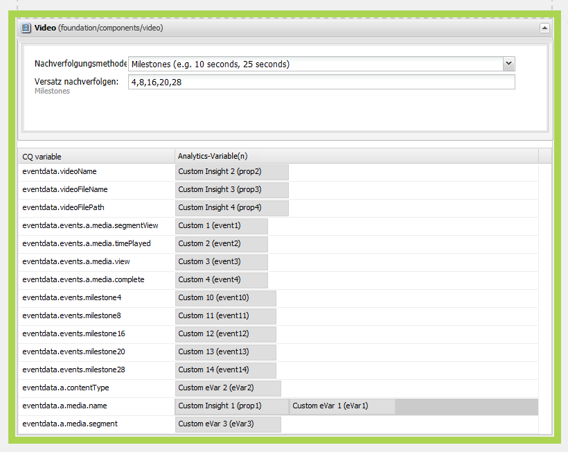

# Konfigurieren von Videotracking für Adobe Analytics{#configuring-video-tracking-for-adobe-analytics}

Es gibt mehrere Methoden für das Tracking von Video-Ereignissen. Zwei von ihnen sind Legacy-Optionen für ältere Versionen von Adobe Analytics. Diese Legacy-Optionen sind: Legacy Milestones und Legacy Seconds.

>[!NOTE]
>
>Bevor Sie fortfahren, stellen Sie sicher, dass Sie ein **abspielbares Video** in AEM hochgeladen haben.
>
>Um sicherzustellen, dass Ihre Videos auf der Seite wiedergegeben werden können, informieren Sie sich in **[diesem Tutorial](/help/sites-authoring/default-components-foundation.md#video)**, wie Sie Videodateien in AEM umkodieren.

Mit der folgenden Vorgehensweise können Sie ein Framework für das Videotracking mit jeder dieser Methoden einrichten.

>[!NOTE]
>
>Bei neuen Implementierung empfehlen wir, **nicht** die Legacy-Optionen für das Videotracking zu verwenden. Nutzen Sie stattdessen die **Milestones**-Methode.

## Allgemeine Schritte {#common-steps}

1. Richten Sie eine Webseite ein, indem Sie eine **Videokomponente** aus dem Sidekick ziehen und ein abspielbares **Video als Asset** für die Komponente hinzufügen.

1. [Erstellen Sie eine Adobe Analytics-Konfiguration und ein Framework](/help/sites-administering/adobeanalytics.md).

   * Die Beispiele in den folgenden Abschnitten verwenden den Namen **my-sc-configuration** für die Konfiguration und **videofw** für das Framework.

1. Wählen Sie auf der Framework-Seite eine RSID aus und setzen Sie die Verwendung auf &quot;all&quot;. ([https://localhost:4502/cf#/etc/cloudservices/sitecatalyst/videoconf/videofw.html](https://localhost:4502/cf#/etc/cloudservices/sitecatalyst/videoconf/videofw.html))
1. Ziehen Sie die Videokomponente aus der Komponentenkategorie „Allgemein“ im Sidekick in das Framework.
1. Wählen Sie eine Tracking-Methode aus:

   * [Milestones](/help/sites-administering/adobeanalytics.md)
   * [Non-Legacy Milestones](/help/sites-administering/adobeanalytics.md)
   * [Legacy Milestones](/help/sites-administering/adobeanalytics.md)
   * [Legacy Seconds](/help/sites-administering/adobeanalytics.md)

1. Abhängig von der ausgewählten Tracking-Methode ändert sich auch die Liste der CQ-Variablen. In den folgenden Abschnitten erfahren Sie, wie Sie die Komponente weiter konfigurieren und die CQ-Variablen den Adobe Analytics-Eigenschaften zuordnen können.

## Milestones {#milestones}

Die Milestones-Methode verfolgt die meisten Informationen zum Video nach, ist hochgradig anpassbar und leicht zu konfigurieren.

Um die Milestones-Methode zu nutzen, legen Sie den zeitbasierten Tracking-Versatz fest, um die Milestones zu definieren. Wenn eine Videowiedergabe einen Meilenstein übergibt, ruft die Seite Adobe Analytics auf, um das Ereignis zu verfolgen. Für jeden Meilenstein, den Sie definieren, erstellt die Komponente eine CQ-Variable, die Sie einer Adobe Analytics-Eigenschaft zuordnen können. Der Name dieser CQ-Variablen verwendet das folgende Format:

```shell
eventdata.events.milestoneXX
```

Das XX-Suffix ist der Tracking-Versatz, der den Milestone definiert. Wenn Sie beispielsweise die Tracking-Versatzwerte von 4, 8, 16, 20 und 28 Sekunden festlegen, werden die folgenden CQ-Variablen generiert:

* `eventdata.events.milestone4`
* `eventdata.events.milestone8`
* `eventdata.events.milestone16`
* `eventdata.events.milestone20`
* `eventdata.events.milestone28`

In der folgenden Tabelle sind die standardmäßigen CQ-Variablen beschrieben, die für die Milestones-Methode bereitgestellt werden:

<table>
 <tbody>
  <tr>
   <th>CQ-Variablen</th>
   <th>Adobe Analytics-Eigenschaften</th>
  </tr>
  <tr>
   <td>eventdata.videoName </td>
   <td>Variablen, die diesem zugeordnet sind, enthalten den <strong>benutzerfreundlichen</strong>-Namen (<strong>Titel</strong>) des Videos, falls im DAM festgelegt; Wenn dies nicht festgelegt ist, wird stattdessen der Dateiname <strong>des Videos</strong> gesendet. Nur einmal gesendet, zu Beginn der Videowiedergabe.</td>
  </tr>
  <tr>
   <td>eventdata.videoFileName </td>
   <td>Variablen, die diesem zugeordnet sind, enthalten den Namen der Datei. Wird nur zusammen mit eventdata.events.a.media.view gesendet </td>
  </tr>
  <tr>
   <td>eventdata.videoFilePath </td>
   <td>Variablen, die diesem zugeordnet sind, enthalten den Pfad der Datei auf dem Server. Wird nur zusammen mit eventdata.events.a.media.view gesendet </td>
  </tr>
  <tr>
   <td>eventdata.events.a.media.segmentView </td>
   <td>Wird jedes Mal gesendet, wenn ein Segment-Meilenstein übergeben wird </td>
  </tr>
  <tr>
   <td>eventdata.events.a.media.timePlayed</td>
   <td>Wird jedes Mal gesendet, wenn ein Meilenstein ausgelöst wird, wird die Anzahl der Sekunden, die der Benutzer mit der Wiedergabe des angegebenen Segments verbracht hat, ebenfalls zusammen mit diesem Ereignis gesendet. z. B. eventX=21<br /> </td>
  </tr>
  <tr>
   <td>eventdata.events.a.media.view </td>
   <td>Wird beim Initialisieren der Videoansicht gesendet</td>
  </tr>
  <tr>
   <td>eventdata.events.a.media.complete </td>
   <td>Wird gesendet, wenn die Videowiedergabe abgeschlossen ist<br /> </td>
  </tr>
  <tr>
   <td>eventdata.events.milestoneX </td>
   <td>Wird gesendet, wenn der angegebene Meilenstein übergeben wird, steht X für die Sekunde, in der der Meilenstein bei<br /> ausgelöst wird. </td>
  </tr>
  <tr>
   <td>eventdata.a.contentType </td>
   <td>Wird auf jedem Meilenstein gesendet; wird im Adobe Analytics-Aufruf als pev3 angezeigt, normalerweise als "video"<br /> gesendet </td>
  </tr>
  <tr>
   <td>eventdata.a.media.name </td>
   <td>Sucht genau nach eventdata.videoName </td>
  </tr>
  <tr>
   <td>eventdata.a.media.segment </td>
   <td>Enthält Informationen zum angezeigten Segment, z. B. 2:O:4-8 </td>
  </tr>
 </tbody>
</table>

>[!NOTE]
>
>Sie können den **benutzerfreundlichen**-Namen eines Videos festlegen, indem Sie das Video zur Bearbeitung in DAM öffnen und das Metadatenfeld **Titel** auf den gewünschten Namen setzen.

1. Nachdem Sie Milestones als Tracking-Methode ausgewählt haben, geben Sie im Kasten „Versatz nachverfolgen“ eine kommagetrennte Liste der Tracking-Versätzen in Sekunden ein. Beispielsweise definieren die folgenden Werte Milestones bei 4, 8, 16, 20 und 28 Sekunden nach Start des Videos:

   ```xml
   4,8,16,20,24
   ```

   Die Versatzwerte müssen Ganzzahlen größer als 0 sein. Der Standardwert ist `10,25,50,75`.

1. Um die CQ-Variablen den Adobe Analytics-Eigenschaften zuzuordnen, ziehen Sie die Adobe Analytics-Eigenschaften aus ContentFinder neben die CQ-Variable auf die Komponente.

   Weitere Informationen zum Optimieren der Zuordnungen finden Sie im Handbuch [Videomessung in Adobe Analytics](https://docs.adobe.com/content/help/en/media-analytics/using/media-overview.html) .

1. [Fügen Sie das ](/help/sites-administering/adobeanalytics.md) Framework zur Seite hinzu.
1. Um das Setup in **Vorschaumodus** zu testen, spielen Sie das Video ab, um Adobe Analytics-Aufrufe an Trigger zu erhalten.

Die folgenden Beispiele für Adobe Analytics-Tracking-Daten gelten für das Meilensteintracking mit Tracking-Versatzwerten von 4,8,16,20 und 24 sowie die folgenden Zuordnungen für die CQ-Variablen:

<table>
 <tbody>
  <tr>
   <th>CQ-Variable</th>
   <th>Adobe Analytics-Eigenschaft</th>
  </tr>
  <tr>
   <td>eventdata.videoName </td>
   <td>prop2</td>
  </tr>
  <tr>
   <td>eventdata.videoFileName </td>
   <td>prop3 </td>
  </tr>
  <tr>
   <td>eventdata.videoFilePath </td>
   <td>prop4</td>
  </tr>
  <tr>
   <td>eventdata.events.a.media.segmentView </td>
   <td>event1</td>
  </tr>
  <tr>
   <td>eventdata.events.a.media.timePlayed</td>
   <td>event2<br /> </td>
  </tr>
  <tr>
   <td>eventdata.events.a.media.view </td>
   <td>event3</td>
  </tr>
  <tr>
   <td>eventdata.events.a.media.complete </td>
   <td>event4<br /> </td>
  </tr>
  <tr>
   <td>eventdata.events.milestone4</td>
   <td>event10</td>
  </tr>
  <tr>
   <td>eventdata.events.milestone8</td>
   <td>event11</td>
  </tr>
  <tr>
   <td>eventdata.events.milestone16</td>
   <td>event12</td>
  </tr>
  <tr>
   <td>eventdata.events.milestone20</td>
   <td>event13</td>
  </tr>
  <tr>
   <td>eventdata.events.milestone24</td>
   <td>event14</td>
  </tr>
  <tr>
   <td>eventdata.a.contentType </td>
   <td>eVar3</td>
  </tr>
  <tr>
   <td>eventdata.a.media.name </td>
   <td>eVar1, prop1 </td>
  </tr>
  <tr>
   <td>eventdata.a.media.segment </td>
   <td>eVar2</td>
  </tr>
 </tbody>
</table>

Bei diesem Beispiel wird die Videokomponente wie folgt auf der Framework-Seite angezeigt:



>[!NOTE]
>
>Um die Aufrufe an Adobe Analytics anzuzeigen, verwenden Sie ein geeignetes Tool wie DigitalPulse Debugger oder Fiddler.

Aufrufe an Adobe Analytics mit dem angegebenen Beispiel sollten wie folgt aussehen, wenn sie mit DigitalPulse Debugger angezeigt werden:


*Dies ist der **erste**Aufruf an Adobe Analytics mit den folgenden Werten:*

* *prop1 und eVar1 für eventdata.a.media.name,*
* *props2–4 zusammen mit eVar2 und eVar3, wobei contentType (video) und segment (1:O:1-4) enthalten sind*
* *event3, das eventdata.events.a.media.view zugeordnet wurde*


*Dies ist der **dritte Aufruf**an Adobe Analytics:*

* *prop1 und eVar1 enthalten a.media.name;*
* *event1, da ein Segment angesehen wurde*
* *event2, gesendet mit der wiedergegebenen Zeit = 4*
* *event11 gesendet, weil eventdata.events.milestone8 erreicht wurde*
* *prop2 bis 4 wurden nicht gesendet (da eventdata.events.a.media.view nicht ausgelöst wurde)*

## Non-Legacy Milestones {#non-legacy-milestones}

Die Methode „Non-Legacy Milestones“ ähnelt der Milestones-Methode, mit dem Unterschied, dass Milestones mit Prozentwerten der Titellänge definiert werden. Folgende Gemeinsamkeiten liegen vor:

* Wenn eine Videowiedergabe einen Meilenstein übergibt, ruft die Seite Adobe Analytics auf, um das Ereignis zu verfolgen.
* Der [statische Satz von CQ-Variablen](#cqvars), die für die Zuordnung zu Adobe Analytics-Eigenschaften definiert sind.
* Für jeden Meilenstein, den Sie definieren, erstellt die Komponente eine CQ-Variable, die Sie einer Adobe Analytics-Eigenschaft zuordnen können.

Der Name dieser CQ-Variablen verwendet das folgende Format:

Das XX-Suffix ist der Prozentwert der Titellänge, der den Milestone definiert. Wenn Sie z. B. die Prozentwerte 10, 25, 50 und 75 festlegen, werden die folgenden CQ-Variablen erzeugt:

* `eventdata.events.milestone10`
* `eventdata.events.milestone25`
* `eventdata.events.milestone50`
* `eventdata.events.milestone75`

```shell
eventdata.events.milestoneXX
```

1. Nachdem Sie Non-Legacy Milestones als Tracking-Methode ausgewählt haben, geben Sie im Kasten „Versatz nachverfolgen“ eine kommagetrennte Liste der Prozentwerte der Titellänge ein. Beispielsweise definiert der folgende Standardwert Milestones bei 10, 25, 50 und 75 Prozent der Titellänge:

   ```xml
   10,25,50,75
   ```

   Die Versatzwerte müssen Ganzzahlen größer als 0 sein.

1. Um die CQ-Variablen den Adobe Analytics-Eigenschaften zuzuordnen, ziehen Sie die Adobe Analytics-Eigenschaften aus ContentFinder neben die CQ-Variable auf die Komponente.

   Weitere Informationen zum Optimieren der Zuordnungen finden Sie im Handbuch [Videomessung in Adobe Analytics](https://docs.adobe.com/content/help/en/media-analytics/using/media-overview.html) .

1. [Fügen Sie das ](/help/sites-administering/adobeanalytics.md) Framework zur Seite hinzu.
1. Um das Setup in **Vorschaumodus** zu testen, spielen Sie das Video ab, um Adobe Analytics-Aufrufe an Trigger zu erhalten.

## Legacy Milestones {#legacy-milestones}

Diese Methode ähnelt der Milestones-Methode, mit dem Unterschied, dass die im Feld *Versatz nachverfolgen* festgelegten Milestones Prozentwerte sind statt fester Punkte im Video.

>[!NOTE]
>
>Das Feld „Versatz nachverfolgen“ akzeptiert nur eine kommagetrennte Liste mit Ganzzahlen zwischen 1 und 100.

1. Legen Sie die Tracking-Versatzwerte fest.

   * Beispiel: 10, 50, 75, 100

   Außerdem können die an Adobe Analytics gesendeten Informationen weniger angepasst werden. Es sind nur drei Variablen für die Zuordnung verfügbar:

<table>
 <tbody>
  <tr>
   <td>eventdata.videoName <br /> </td>
   <td>Variablen, die diesem zugeordnet sind, enthalten den <strong>benutzerfreundlichen</strong>-Namen (<strong>Titel</strong>) des Videos, falls im DAM festgelegt; Wenn der Titel nicht festgelegt ist, wird stattdessen der Dateiname <strong>des Videos</strong> gesendet. Nur einmal gesendet, zu Beginn der Videowiedergabe.<br /> </td>
  </tr>
  <tr>
   <td>eventdata.videoFileName </td>
   <td>Variablen, die diesem zugeordnet sind, enthalten den Namen der Datei. Nur einmal gesendet, zu Beginn der Videowiedergabe.</td>
  </tr>
  <tr>
   <td>eventdata.videoFilePath </td>
   <td>Die dieser Variablen zugeordnete Variable enthält den Pfad der Datei auf dem Server. Nur einmal gesendet, zu Beginn der Videowiedergabe.</td>
  </tr>
 </tbody>
</table>

>[!NOTE]
>
>Sie können den **benutzerfreundlichen**-Namen eines Videos festlegen, indem Sie das Video zur Bearbeitung in DAM öffnen und das Metadatenfeld **Titel** auf den gewünschten Namen setzen. Wenn Sie fertig sind, müssen Sie die Änderungen speichern.

1. Ordnen Sie diese Variablen zu props 1 bis 3 zu.

   Der **Rest der relevanten Informationen** im Aufruf wird verkettet in **eine**-Variable namens **pev3** gesendet.

   **Beispielaufrufe** an Adobe Analytics mit dem angegebenen Beispiel sollten wie folgt aussehen, wenn sie mit DigitalPulse Debugger angezeigt werden:

   

   *Die **pev3**-Variable, die bei dem Aufruf gesendet wird, enthält die folgenden Informationen:*

   * *Name*  - Der Name der Videodatei (*film.avi*)

   * *Länge*  - Die Länge der Videodatei in Sekunden (*100*)

   * *Player Name*  - Der Videoplayer, mit dem die Videodatei wiedergegeben wird (*HTML5-Video*)

   * *Gesamtzahl der wiedergegebenen Sekunden*  - Die Gesamtanzahl der Sekunden, in denen das Video wiedergegeben wurde (*25*)

   * *Start-Zeitstempel*  - Zeitstempel, der angibt, wann die Videowiedergabe gestartet wurde (*1331035567*)

   * *Wiedergabesitzung*  - Die Details der Wiedergabesitzung. Dieses Feld gibt an, wie der Benutzer mit dem Video interagiert hat. Dazu können Daten gehören, wie z. B. wo sie mit der Wiedergabe des Videos begonnen haben, ob sie den Videoregler zum Voranbringen des Videos verwendet haben und wo sie die Wiedergabe des Videos angehalten haben (*L10E24S58L58 - Video wurde bei Sekunde angehalten. 25 von Abschnitt L10 angehalten, dann sprang der Benutzer zu Sekunde  48*)

## Legacy Seconds  {#legacy-seconds}

Bei Verwendung der Methode &quot;Alte Sekunden**&quot;werden alle N Sekunden Adobe Analytics-Aufrufe ausgelöst, wobei N im Feld Versatz verfolgen angegeben ist.

1. Setzen Sie den Versatz &quot;Verfolgen&quot;auf eine beliebige Anzahl von Sekunden.

   * Beispiel: 6
   >[!NOTE]
   >
   >Das Feld „Vesatz nachverfolgen“ akzeptiert nur Ganzzahlen, die größer als 0 sind.

   Die Informationen, die an Adobe Analytics gesendet werden, sind weniger anpassbar. Für die Zuordnung stehen nur drei Variablen zur Verfügung:

<table>
 <tbody>
  <tr>
   <td>eventdata.videoName <br /> </td>
   <td>Variablen, die diesem zugeordnet sind, enthalten den <strong>benutzerfreundlichen</strong>-Namen (<strong>Titel</strong>) des Videos, falls im DAM festgelegt; Wenn der Titel nicht festgelegt ist, wird stattdessen der Dateiname <strong>des Videos</strong> gesendet. Nur einmal gesendet, zu Beginn der Videowiedergabe.<br /> </td>
  </tr>
  <tr>
   <td>eventdata.videoFileName </td>
   <td>Die dieser Variablen zugeordnete Variable enthält den Namen der Datei. Nur einmal gesendet, zu Beginn der Videowiedergabe.</td>
  </tr>
  <tr>
   <td>eventdata.videoFilePath </td>
   <td>Die dieser Variablen zugeordnete Variable enthält den Pfad der Datei auf dem Server. Nur einmal gesendet, zu Beginn der Videowiedergabe.</td>
  </tr>
 </tbody>
</table>

>[!NOTE]
>
>Sie können den **benutzerfreundlichen**-Namen eines Videos festlegen, indem Sie das Video zur Bearbeitung in DAM öffnen und das Metadatenfeld **Titel** auf den gewünschten Namen setzen. Wenn Sie fertig sind, müssen Sie die Änderungen speichern.

1. Ordnen Sie diese Variablen zu prop1, prop2 und prop3 zu.

   Die **übrigen relevanten Informationen** des Aufrufs werden zusammenhängend in **einer** Variablen namens **pev3** gesendet.

   Aufrufe an Adobe Analytics mit dem angegebenen Beispiel sollten wie folgt aussehen, wenn sie mit DigitalPulse Debugger angezeigt werden:

   

   *Der Aufruf ähnelt dem o. g. Legacy Milestones-Aufruf. Informationen zu pev3 **[finden Sie dort](/help/sites-administering/adobeanalytics.md)**.*

**In diesem Tutorial verwendete Referenzen:**

[0] [https://docs.adobe.com/content/help/en/media-analytics/using/media-overview.html](https://docs.adobe.com/content/help/en/media-analytics/using/media-overview.html)
