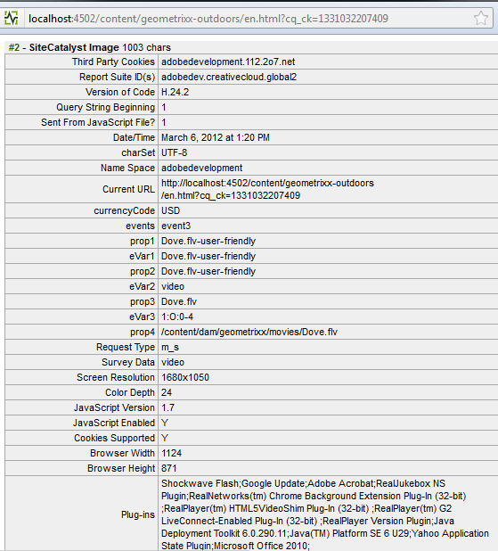

# Konfigurieren von Videotracking für Adobe Analytics{#configuring-video-tracking-for-adobe-analytics}

Es gibt mehrere Methoden für das Tracking von Video-Ereignissen. Zwei von ihnen sind Legacy-Optionen für ältere Versionen von Adobe Analytics. Diese Legacy-Optionen sind: Legacy Milestones und Legacy Seconds.

>[!NOTE]
>
>Before you continue, make sure** **that you have a** playable video** uploaded within AEM.

>Um sicherzustellen, dass Ihre Videos auf der Seite wiedergegeben werden können, informieren Sie sich in **[diesem Tutorial](/help/sites-authoring/default-components-foundation.md#video)**, wie Sie Videodateien in AEM umkodieren.

Mit der folgenden Vorgehensweise können Sie ein Framework für das Videotracking mit jeder dieser Methoden einrichten.

>[!NOTE]
>
>Bei neuen Implementierung empfehlen wir, **nicht** die Legacy-Optionen für das Videotracking zu verwenden. Nutzen Sie stattdessen die **Milestones**-Methode.

## Allgemeine Schritte {#common-steps}

1. Richten Sie eine Webseite ein, indem Sie eine **Videokomponente** aus dem Sidekick ziehen und ein abspielbares **Video als Asset** für die Komponente hinzufügen.

1. [Erstellen Sie eine Adobe Analytics-Konfiguration und ein Adobe Analytics-Framework](/help/sites-administering/adobeanalytics.md).

   * The examples in the sections that follow use the name **my-sc-configuration** for the configuration and **videofw** for the framework.

1. Wählen Sie auf der Seite &quot;Framework&quot;eine RSID und legen Sie die Nutzung auf &quot;all&quot;fest. ([https://localhost:4502/cf#/etc/cloudservices/sitecatalyst/videoconf/videofw.html](https://localhost:4502/cf#/etc/cloudservices/sitecatalyst/videoconf/videofw.html))
1. Ziehen Sie die Videokomponente aus der Komponentenkategorie „Allgemein“ im Sidekick in das Framework.
1. Wählen Sie eine Tracking-Methode aus:

   * [Milestones](/help/sites-administering/adobeanalytics.md)
   * [Non-Legacy Milestones](/help/sites-administering/adobeanalytics.md)
   * [Legacy Milestones](/help/sites-administering/adobeanalytics.md)
   * [Legacy Seconds](/help/sites-administering/adobeanalytics.md)

1. Abhängig von der ausgewählten Tracking-Methode ändert sich auch die Liste der CQ-Variablen. In den folgenden Abschnitten erfahren Sie, wie Sie die Komponente weiter konfigurieren und die CQ-Variablen Adobe Analytics-Eigenschaften zuordnen können.

## Milestones {#milestones}

Die Milestones-Methode verfolgt die meisten Informationen zum Video nach, ist hochgradig anpassbar und leicht zu konfigurieren.

Um die Milestones-Methode zu nutzen, legen Sie den zeitbasierten Tracking-Versatz fest, um die Milestones zu definieren. Wenn eine Videowiedergabe einen Meilenstein erreicht, ruft die Seite Adobe Analytics auf, um das Ereignis zu verfolgen. Für jeden von Ihnen definierten Meilenstein erstellt die Komponente eine CQ-Variable, die Sie einer Adobe Analytics-Eigenschaft zuordnen können. Der Name dieser CQ-Variablen verwendet das folgende Format:

```shell
eventdata.events.milestoneXX
```

Das XX-Suffix ist der Tracking-Versatz, der den Milestone definiert. Wenn Sie beispielsweise einen Verfolgungsoffset von 4, 8, 16, 20 und 28 Sekunden festlegen, werden die folgenden CQ-Variablen generiert:

* `eventdata.events.milestone4`
* `eventdata.events.milestone8`
* `eventdata.events.milestone16`
* `eventdata.events.milestone20`
* `eventdata.events.milestone28`

In der folgenden Tabelle sind die standardmäßigen CQ-Variablen beschrieben, die für die Milestones-Methode bereitgestellt werden:

<table>
 <tbody>
  <tr>
   <th>CQ-Variablen</th>
   <th>Adobe Analytics-Eigenschaften</th>
  </tr>
  <tr>
   <td>eventData.videoName </td>
   <td>Variablen, die diesem Bericht zugeordnet sind, enthalten den <strong>benutzerfreundlichen</strong> Namen (<strong>Titel</strong>) des Videos, wenn sie im DAM eingestellt sind. Wenn dies nicht festgelegt ist, wird stattdessen der <strong>Dateiname</strong> des Videos gesendet. Nur einmal gesendet, zu Beginn der Videowiedergabe.</td>
  </tr>
  <tr>
   <td>eventData.videoFileName </td>
   <td>Variablen, die dieser Datei zugeordnet sind, enthalten den Namen der Datei. Wird nur zusammen mit eventData.events.a.media.view gesendet </td>
  </tr>
  <tr>
   <td>eventData.videoFilePath </td>
   <td>Variablen, die dieser Datei zugeordnet sind, enthalten den Pfad der Datei auf dem Server. Wird nur zusammen mit eventData.events.a.media.view gesendet </td>
  </tr>
  <tr>
   <td>eventData.events.a.media.segmentView </td>
   <td>Wird jedes Mal gesendet, wenn ein Segment-Meilenstein übergeben wird </td>
  </tr>
  <tr>
   <td>eventData.events.a.media.timePlayed</td>
   <td>Wird jedes Mal gesendet, wenn ein Meilenstein ausgelöst wird, wird auch die Anzahl der Sekunden gesendet, die der Benutzer mit der Anzeige des angegebenen Segments verbracht hat. z. B. eventX=21<br /> </td>
  </tr>
  <tr>
   <td>eventData.events.a.media.view </td>
   <td>Wird beim Initialisieren der Videoansicht gesendet</td>
  </tr>
  <tr>
   <td>eventData.events.a.media.complete </td>
   <td>Wird gesendet, wenn die Videowiedergabe abgeschlossen ist<br /> </td>
  </tr>
  <tr>
   <td>eventData.events.milestoneX </td>
   <td>Wird gesendet, wenn der angegebene Meilenstein übergeben wird, steht X für die Sekunde, bei der der Meilenstein ausgelöst wird<br /> </td>
  </tr>
  <tr>
   <td>eventData.a.contentType </td>
   <td>an jedem Meilenstein gesendet; wird als pev3 im Adobe Analytics-Aufruf angezeigt, der normalerweise als "video"gesendet wird<br /> </td>
  </tr>
  <tr>
   <td>eventData.a.media.name </td>
   <td>Stimmt genau mit eventData.videoName überein </td>
  </tr>
  <tr>
   <td>eventData.a.media.segment </td>
   <td>Enthält Informationen zum angezeigten Segment, z. B. 2:O:4-8 </td>
  </tr>
 </tbody>
</table>

>[!NOTE]
>
>You can set a video&#39;s **user-friendly** name by opening the video for editing in the DAM, and setting the **Title** metadata field to the desired name.

1. Nachdem Sie Milestones als Tracking-Methode ausgewählt haben, geben Sie im Kasten „Versatz nachverfolgen“ eine kommagetrennte Liste der Tracking-Versätzen in Sekunden ein. Beispielsweise definieren die folgenden Werte Milestones bei 4, 8, 16, 20 und 28 Sekunden nach Start des Videos:

   ```xml
   4,8,16,20,24
   ```

   Die Versatzwerte müssen Ganzzahlen größer als 0 sein. Der Standardwert ist `10,25,50,75`.

1. Um die CQ-Variablen Adobe Analytics-Eigenschaften zuzuordnen, ziehen Sie die Adobe Analytics-Eigenschaften aus ContentFinder neben der CQ-Variablen in die Komponente.

   For information about optimizing the mappings, see the [Measuring Video in Adobe Analytics](https://marketing.adobe.com/resources/help/en_US/sc/appmeasurement/hbvideo/video_overview.html) guide.

1. [Fügen Sie der Seite das Framework](/help/sites-administering/adobeanalytics.md) hinzu.
1. To test the setup in **Preview mode**, play the video to get Adobe Analytics calls to trigger.

Die folgenden Beispiele für Adobe Analytics-Verfolgungsdaten gelten für die Meilensteinverfolgung mit Verfolgungsoffset von 4,8,16,20 und 24 und den folgenden Zuordnungen für die CQ-Variablen:

<table>
 <tbody>
  <tr>
   <th>CQ-Variable</th>
   <th>Adobe Analytics-Eigenschaft</th>
  </tr>
  <tr>
   <td>eventData.videoName </td>
   <td>prop2</td>
  </tr>
  <tr>
   <td>eventData.videoFileName </td>
   <td>prop3 </td>
  </tr>
  <tr>
   <td>eventData.videoFilePath </td>
   <td>prop4</td>
  </tr>
  <tr>
   <td>eventData.events.a.media.segmentView </td>
   <td>event1</td>
  </tr>
  <tr>
   <td>eventData.events.a.media.timePlayed</td>
   <td>event2<br /> </td>
  </tr>
  <tr>
   <td>eventData.events.a.media.view </td>
   <td>event3</td>
  </tr>
  <tr>
   <td>eventData.events.a.media.complete </td>
   <td>event4<br /> </td>
  </tr>
  <tr>
   <td>eventdata.events.milestone4</td>
   <td>event10</td>
  </tr>
  <tr>
   <td>eventdata.events.milestone8</td>
   <td>event11</td>
  </tr>
  <tr>
   <td>eventdata.events.milestone16</td>
   <td>event12</td>
  </tr>
  <tr>
   <td>eventdata.events.milestone20</td>
   <td>event13</td>
  </tr>
  <tr>
   <td>eventdata.events.milestone24</td>
   <td>event14</td>
  </tr>
  <tr>
   <td>eventData.a.contentType </td>
   <td>eVar3</td>
  </tr>
  <tr>
   <td>eventData.a.media.name </td>
   <td>eVar1, prop1 </td>
  </tr>
  <tr>
   <td>eventData.a.media.segment </td>
   <td>eVar2</td>
  </tr>
 </tbody>
</table>

Bei diesem Beispiel wird die Videokomponente wie folgt auf der Framework-Seite angezeigt:


>[!NOTE]
>
>Um die Aufrufe an Adobe Analytics anzuzeigen, verwenden Sie ein geeignetes Tool, z. B. DigitalPulse Debugger oder Fiddler.

Aufrufe an Adobe Analytics mit dem bereitgestellten Beispiel sollten wie folgt aussehen, wenn sie mit dem DigitalPulse Debugger angezeigt werden:



*Dies ist der **erste Aufruf**an Adobe Analytics mit den folgenden Werten:*

* *prop1 und eVar1 für eventdata.a.media.name,*
* *props2–4 zusammen mit eVar2 und eVar3, wobei contentType (video) und segment (1:O:1-4) enthalten sind*
* *event3, das eventdata.events.a.media.view zugeordnet wurde*


*Dies ist der **dritte Aufruf**an Adobe Analytics:*

* *prop1 und eVar1 enthalten a.media.name;*
* *event1, da ein Segment angesehen wurde*
* *event2, gesendet mit der wiedergegebenen Zeit = 4*
* *event11 gesendet, weil eventdata.events.milestone8 erreicht wurde*
* *prop2 bis 4 wurden nicht gesendet (da eventdata.events.a.media.view nicht ausgelöst wurde)*

## Non-Legacy Milestones {#non-legacy-milestones}

Die Methode „Non-Legacy Milestones“ ähnelt der Milestones-Methode, mit dem Unterschied, dass Milestones mit Prozentwerten der Titellänge definiert werden. Folgende Gemeinsamkeiten liegen vor:

* Wenn eine Videowiedergabe einen Meilenstein erreicht, ruft die Seite Adobe Analytics auf, um das Ereignis zu verfolgen.
* The [static set of CQ variables](#cqvars) that are defined for mapping with Adobe Analytics properties.
* Für jeden von Ihnen definierten Meilenstein erstellt die Komponente eine CQ-Variable, die Sie einer Adobe Analytics-Eigenschaft zuordnen können.

Der Name dieser CQ-Variablen verwendet das folgende Format:

Das XX-Suffix ist der Prozentwert der Titellänge, der den Milestone definiert. Wenn Sie z. B. die Prozentwerte 10, 25, 50 und 75 festlegen, werden die folgenden CQ-Variablen erzeugt:

* `eventdata.events.milestone10`
* `eventdata.events.milestone25`
* `eventdata.events.milestone50`
* `eventdata.events.milestone75`

```shell
eventdata.events.milestoneXX
```

1. Nachdem Sie Non-Legacy Milestones als Tracking-Methode ausgewählt haben, geben Sie im Kasten „Versatz nachverfolgen“ eine kommagetrennte Liste der Prozentwerte der Titellänge ein. Beispielsweise definiert der folgende Standardwert Milestones bei 10, 25, 50 und 75 Prozent der Titellänge:

   ```xml
   10,25,50,75
   ```

   Die Versatzwerte müssen Ganzzahlen größer als 0 sein.

1. Um die CQ-Variablen Adobe Analytics-Eigenschaften zuzuordnen, ziehen Sie die Adobe Analytics-Eigenschaften aus ContentFinder neben der CQ-Variablen in die Komponente.

   For information about optimizing the mappings, see the [Measuring Video in Adobe Analytics](https://marketing.adobe.com/resources/help/en_US/sc/appmeasurement/hbvideo/video_overview.html) guide.

1. [Fügen Sie der Seite das Framework](/help/sites-administering/adobeanalytics.md) hinzu.
1. To test the setup in **Preview mode**, play the video to get Adobe Analytics calls to trigger.

## Legacy Milestones {#legacy-milestones}

Diese Methode ähnelt der Milestones-Methode, mit dem Unterschied, dass die im Feld *Versatz nachverfolgen* festgelegten Milestones Prozentwerte sind statt fester Punkte im Video.

>[!NOTE]
>
>Das Feld „Versatz nachverfolgen“ akzeptiert nur eine kommagetrennte Liste mit Ganzzahlen zwischen 1 und 100.

1. Legen Sie die Tracking-Versatzwerte fest.

   * Beispiel: 10, 50, 75, 100
   Außerdem sind die an Adobe Analytics gesendeten Informationen weniger anpassbar. Es sind nur drei Variablen für die Zuordnung verfügbar:

<table>
 <tbody>
  <tr>
   <td>eventData.videoName <br /> </td>
   <td>Variablen, die diesem Bericht zugeordnet sind, enthalten den <strong>benutzerfreundlichen</strong> Namen (<strong>Titel</strong>) des Videos, wenn sie im DAM eingestellt sind. Wenn der Titel nicht festgelegt ist, wird stattdessen der <strong>Dateiname</strong> des Videos gesendet. Nur einmal gesendet, zu Beginn der Videowiedergabe.<br /> </td>
  </tr>
  <tr>
   <td>eventData.videoFileName </td>
   <td>Variablen, die dieser Datei zugeordnet sind, enthalten den Namen der Datei. Nur einmal gesendet, zu Beginn der Videowiedergabe.</td>
  </tr>
  <tr>
   <td>eventData.videoFilePath </td>
   <td>Die dieser Variablen zugeordnete Variable enthält den Pfad der Datei auf dem Server. Nur einmal gesendet, zu Beginn der Videowiedergabe.</td>
  </tr>
 </tbody>
</table>

>[!NOTE]
>
>You can set a video&#39;s **user-friendly** name by opening the video for editing in the DAM, and setting the **Title** metadata field to the desired name. Wenn Sie fertig sind, müssen Sie die Änderungen speichern.

1. Ordnen Sie diese Variablen zu props 1 bis 3 zu.

   The **rest of the relevant information** in the call will be sent concatenated into **one** variable named **pev3**.

   **Beispielaufrufe** an Adobe Analytics mit dem bereitgestellten Beispiel sollten wie folgt aussehen, wenn sie mit dem DigitalPulse Debugger angezeigt werden:

   

   *Die **pev3**-Variable, die bei dem Aufruf gesendet wird, enthält die folgenden Informationen:*

   * *Name* - Der Name der Videodatei (*film.avi*)

   * *Länge* - Die Länge der Videodatei in Sekunden (*100*)

   * *Playername* - Der Videoplayer, mit dem die Videodatei wiedergegeben wird (*HTML5-Video*)

   * *Abgespielte* Sekunden gesamt - Die Gesamtdauer der Sekunden, in denen das Video abgespielt wurde (*25*)

   * *Start-Zeitstempel* - Zeitstempel, der angibt, wann die Videowiedergabe gestartet wurde (*1331035567*)

   * *Sitzung* abspielen - Die Details der Wiedergabesitzung. Dieses Feld gibt an, wie der Benutzer mit dem Video interagiert hat. This might include data such as where they started playing the video, whether they used the video slider to advance the video, and where they stopped playing the video (*L10E24S58L58 - video was stopped at sec. 25 von Abschnitt L10 angehalten, dann sprang der Benutzer zu Sekunde  48*)

## Legacy Seconds {#legacy-seconds}

Bei Verwendung der**-Methode aus älteren Sekunden** werden alle N Sekunden Adobe Analytics-Aufrufe ausgelöst, wobei N im Feld für den Verfolgen-Offset angegeben ist.

1. Setzen Sie den Versatz für die Verfolgung auf eine beliebige Anzahl Sekunden,

   * Beispiel: 6
   >[!NOTE]
   >
   >Das Feld „Vesatz nachverfolgen“ akzeptiert nur Ganzzahlen, die größer als 0 sind.

   Die an Adobe Analytics gesendeten Informationen können weniger angepasst werden. Für die Zuordnung stehen nur drei Variablen zur Verfügung:

<table>
 <tbody>
  <tr>
   <td>eventData.videoName <br /> </td>
   <td>Variablen, die diesem Bericht zugeordnet sind, enthalten den <strong>benutzerfreundlichen</strong> Namen (<strong>Titel</strong>) des Videos, wenn sie im DAM eingestellt sind. Wenn der Titel nicht festgelegt ist, wird stattdessen der <strong>Dateiname</strong> des Videos gesendet. Nur einmal gesendet, zu Beginn der Videowiedergabe.<br /> </td>
  </tr>
  <tr>
   <td>eventData.videoFileName </td>
   <td>Die dieser Variablen zugeordnete Variable enthält den Dateinamen. Nur einmal gesendet, zu Beginn der Videowiedergabe.</td>
  </tr>
  <tr>
   <td>eventData.videoFilePath </td>
   <td>Die dieser Variablen zugeordnete Variable enthält den Pfad der Datei auf dem Server. Nur einmal gesendet, zu Beginn der Videowiedergabe.</td>
  </tr>
 </tbody>
</table>

>[!NOTE]
>
>You can set a video&#39;s **user-friendly** name by opening the video for editing in the DAM, and setting the **Title** metadata field to the desired name. Wenn Sie fertig sind, müssen Sie die Änderungen speichern.

1. Ordnen Sie diese Variablen zu prop1, prop2 und prop3 zu.

   Die **übrigen relevanten Informationen** des Aufrufs werden zusammenhängend in **einer** Variablen namens **pev3** gesendet.

   Aufrufe an Adobe Analytics mit dem bereitgestellten Beispiel sollten wie folgt aussehen, wenn sie mit dem DigitalPulse Debugger angezeigt werden:

   

   *Der Aufruf ähnelt dem o. g. Legacy Milestones-Aufruf. Informationen zu pev3 **[finden Sie dort](/help/sites-administering/adobeanalytics.md)**.*

**In diesem Tutorial verwendete Referenzen:**

[0] [https://marketing.adobe.com/resources/help/en_US/sc/appmeasurement/hbvideo/video_overview.html](https://marketing.adobe.com/resources/help/en_US/sc/appmeasurement/hbvideo/video_overview.html)
