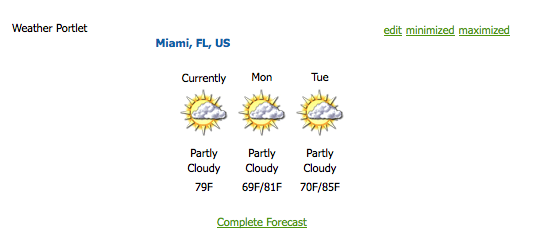

# AEM-Portale und Portlets{#aem-portals-and-portlets}

Dieses Dokument beschäftigt sich mit den folgenden Themen:

* AEM Portal-Architektur
* Verwalten und Konfigurieren von AEM as a Portal
* Verwenden von AEM as a Portal
* Installieren, Konfigurieren und Anzeigen von AEM-Inhalten in einem Portlet (z. B. einem Webserver)

## AEM Portal-Architektur {#aem-portal-architecture}

AEM Portal-Architektur umfasst Definitionen von Portalen und Portlets.

### Was ist ein Portal? {#what-is-a-portal}

Ein Portal ist eine Web-Anwendung, die Personalisierung, Single Sign-On und Inhaltsintegration aus unterschiedlichen Quellen ermöglicht und die Präsentationsschicht von Informationssystemen hostet.

Sie können JSR 286-kompatible Portlets in AEM ausführen. Mit der Portlet-Komponente können Sie ein Portlet auf der Seite einbetten. Weitere Informationen dazu finden Sie in [Verwalten des AEM-Inhalts-Portlets](#administeringthecqcontentportlet).

### Was ist ein Portlet? {#what-is-a-portlet}

Portlets sind Web-Komponenten, die innerhalb eines Containers bereitgestellt werden, der dynamische Inhalte generiert. Die Portlet-Schnittstelle wird als .war-Datei in einem Portlet-Container gepackt und bereitgestellt. Wenn Sie AEM as a Portal ausführen, benötigen Sie die .war-Datei des Portlets, um das Portlet auszuführen.

Informationen zum Konfigurieren von AEM-Inhalten für die Anzeige in einem Portal finden Sie unter [Installieren, Konfigurieren und Verwenden von AEM in einem Portlet](#installingconfiguringandusingcqinaportlet).

### AEM Portal Director {#aem-portal-director}

>[!CAUTION]
>
>Der AEM Portal Director wird ab AEM 6.4 nicht mehr unterstützt. Siehe [Veraltete und entfernte Funktionen](https://helpx.adobe.com/de/experience-manager/6-4/release-notes/deprecated-removed-features.html).

## Verwalten des AEM-Inhalts-Portlets {#administering-the-aem-content-portlet}

Das AEM-Inhalts-Portlet bietet Ihnen die Möglichkeit, AEM-Inhalte in einem Portal anzuzeigen. Das Portlet ist unter `/crx-quickstart/opt/portal` verfügbar und kann auf verschiedene Weise angepasst werden. Sie können beispielsweise die Handhabung von SSO/Authentifizierung anpassen, indem Sie Ihren eigenen Authentifizierungsdienst bereitstellen und die erforderlichen Authentifizierungsinformationen generieren, damit AEM das Standardverhalten überschreiben kann. Die Plug-ins verwenden eine definierte API, mit der Sie eigene Funktionen hinzufügen können, indem Sie das Plug-in mit der API erstellen. Das Plug-in kann im laufenden Portlet bereitgestellt werden. Um ordnungsgemäß zu funktionieren, ist eine Konfiguration der AEM-Autoren- und -Veröffentlichungsinstanz sowie der Inhaltspfad erforderlich, der beim Start angezeigt werden soll.

Einige der Konfigurationen können über Portlet-Voreinstellungen und andere über OSGi-Dienstkonfigurationen geändert werden. Sie können diese Konfigurationen mithilfe von **config**-Dateien oder der OSGi-Web-Konsole ändern.

### Portlet-Voreinstellungen {#portlet-preferences}

Die Portlets-Voreinstellungen können zur Bereitstellungszeit im Portal-Server oder durch Bearbeiten der Datei **WEB-INF/portlet.xml** vor der Bereitstellung der Portlet-Web-Anwendung konfiguriert werden. Die Datei portlet.xml wird standardmäßig wie folgt angezeigt:

```xml
<?xml version="1.0" encoding="UTF-8"?>
<portlet-app xmlns="https://java.sun.com/xml/ns/portlet/portlet-app_1_0.xsd"
             xmlns:xsi="https://www.w3.org/2001/XMLSchema-instance"
             xsi:schemaLocation="https://java.sun.com/xml/ns/portlet/portlet-app_1_0.xsd /opt/SUNWps/dtd/portlet.xsd"
             version="1.0">
   <portlet>
      <portlet-name>RSSWeatherPortlet</portlet-name>
      <portlet-class>org.jboss.portlet.weather.WeatherPortlet</portlet-class>
      <init-param>
         <name>default_zipcode</name>
         <value>05673</value>
      </init-param>
      <init-param>
         <name>RSS_XSL</name>
         <value>/WEB-INF/Rss.xsl</value>
      </init-param>
      <init-param>
         <name>base_url</name>
         <value>https://xml.weather.yahoo.com/forecastrss?p=</value>
      </init-param>
      <expiration-cache>180</expiration-cache>
      <supports>
         <mime-type>text/html</mime-type>
         <portlet-mode>VIEW</portlet-mode>
         <portlet-mode>EDIT</portlet-mode>
      </supports>
      <portlet-info>
         <title>Weather Portlet</title>
      </portlet-info>
      <portlet-preferences>
         <preference>
            <name>expires</name>
            <value>180</value>
         </preference>
         <preference>
            <name>RssXml</name>
            <value>https://xml.weather.yahoo.com/forecastrss?p=33145</value>
            <read-only>false</read-only>
         </preference>
      </portlet-preferences>
   </portlet>
</portlet-app>
```

Das Portlet kann mit den folgenden Voreinstellungen konfiguriert werden:

<table>
 <tbody>
  <tr>
   <td>startPath</td>
   <td><p>Dies ist der Startpfad des Portlets: Er definiert den anfänglich angezeigten Inhalt.</p> <p><strong>Wichtig</strong>: Wenn das Portlet so konfiguriert ist, dass es eine Verbindung zu AEM-Autoren- und -Veröffentlichungsinstanzen herstellt, die unter einem anderen Kontextpfad als <strong> /</strong> ausgeführt werden, müssen Sie das Erzwingen von <strong>CQUrlInfo</strong> in der HTML Library Manager-Konfiguration dieser AEM-Instanzen aktivieren (z. B. über die Felix Web Console). Andernfalls ist eine Bearbeitung nicht möglich und das Dialogfeld „Voreinstellungen“ wird nicht angezeigt.</p> </td>
  </tr>
  <tr>
   <td>htmlSelector</td>
   <td>Der Selektor, der an jede URL angehängt wird. Standardmäßig ist dies <strong>portlet</strong>, d. h. alle Anfragen an HTML-Seiten nutzen URLs mit folgender Endung: <strong>.portlet.html.</strong> Dies ermöglicht die Verwendung von benutzerdefinierten Skripten in AEM für das Rendern von Portlets.</td>
  </tr>
  <tr>
   <td>addCssToPortalHeader</td>
   <td><p>Standardmäßig sind CSS-Dateien, die von AEM in die HTML-Seite eingeschlossen werden, im Portlet enthalten. Wenn Sie diese Option deaktivieren, werden die standardmäßigen CSS-Dateien ausgeschlossen.</p> <p>Wenn diese Option aktiviert ist, werden die CSS-Dateien je nach Portal-Verhalten entweder zum Kopf der HTML-Seite hinzugefügt oder in die HTML-Seite eingebettet.</p> </td>
  </tr>
  <tr>
   <td>includeToolbar</td>
   <td>Standardmäßig wird eine Symbolleiste innerhalb des Inhalts-Portlets gerendert, um Verwaltungsfunktionen bereitzustellen. Wenn Sie diese Option deaktivieren, wird keine Symbolleiste gerendert.</td>
  </tr>
  <tr>
   <td>urlParameterNames</td>
   <td><p>Liste der alternativen URL-Parameternamen, die die neue Inhalts-URL enthalten können, die für das Portlet angezeigt werden soll. Die Liste wird von oben nach unten abgearbeitet. Der erste Parameter, der einen Wert enthält, wird verwendet. Wenn keine URL gefunden wird, wird der Standard-URL-Parameter verwendet. Die bereitgestellte URL wird so, wie sie ist, verwendet und nicht verändert.</p> <p>Diese Einstellung gilt pro bereitgestelltem Portlet. Sie dient auch dazu, einige URL-Parameter in der OSGi-Konfiguration für die „Day Portal Director Portlet Bridge“ global zu konfigurieren.</p> </td>
  </tr>
  <tr>
   <td>preferenceDialog</td>
   <td>Pfad zum Dialogfeld „Voreinstellungen“ in AEM. Wird kein Pfad angegeben, wird das integrierte Dialogfeld „Voreinstellungen“ verwendet. Die Standardeinstellung ist /libs/portal/content/prefs.html.</td>
  </tr>
  <tr>
   <td>initialRedirect</td>
   <td>Standardmäßig führt das Portlet beim ersten Aufruf eine JavaScript-Umleitung der gesamten Portalseite durch. Dies dient dazu, das Drag-and-Drop-Szenario von modernen Portal-Servern zu unterstützen. In der Produktion ist diese Umleitung selten erforderlich. Sie kann daher deaktiviert werden, wobei diese Voreinstellung auf <em>false</em> gesetzt ist.</td>
  </tr>
 </tbody>
</table>

#### OSGI-Web-Konsole {#osgi-web-console}

Vorausgesetzt, dass der Portal-Server auf dem Host „localhost“ (Port ) ausgeführt und die Web-Anwendung des AEM-Portlets im Web-Anwendungskontext *cqportlet* gemountet wird, lautet die URL für die Web-Konsole `https://localhost:8080/cqportlet/cqbridge/system/console`:8080/. Der Standardbenutzername und das Standardkennwort lauten **admin**.

Öffnen Sie die Registerkarte **Konfigurationen** und wählen Sie **Portal Directory CQ Server-Konfiguration**. Hier geben Sie die Basis-URL für die Autoren- und Veröffentlichungsinstanz an. Dieses Verfahren wird im Abschnitt [Konfigurieren von Portlets](#configuring-the-portlet) näher beschrieben.

>[!NOTE]
>
>Die OSGi-Web-Konsole dient lediglich zum Ändern von Konfigurationen während der Entwicklung (oder Tests). Stellen Sie sicher, dass Anforderungen an die Konsole für Produktionssysteme blockiert werden.

### Bereitstellen von Konfigurationen {#providing-configurations}

Zur Unterstützung automatisierter Implementierungen und Konfigurationsbereitstellungen verfügt das AEM-Inhalts-Portlet über eine integrierte Konfigurations-Support-Funktion, die versucht, Konfigurationen aus dem Klassenpfad auszulesen, der für die Portlet-Anwendung angegeben wird.

Beim Start wird die Systemeigenschaft **com.day.cq.portet.config** ausgelesen, sodass die aktuelle Umgebung erkannt werden kann. Normalerweise lautet der Wert dieser Eigenschaft **dev**, **prod**, **test**.  Wenn keine Umgebung festgelegt ist, werden keine Konfigurationen ausgelesen.

Ist eine Umgebung festgelegt, wird im Klassenpfad unter **com/day/cq/portlet/{umg}.config** nach einer Konfigurationsdatei gesucht, wobei **umg** durch den tatsächlichen Wert für die Umgebung ersetzt wird. Diese Datei sollte alle Konfigurationsdateien für diese Umgebung auflisten. Diese Dateien werden relativ zum Speicherort der Konfigurationsdatei durchsucht. Wenn die Datei beispielsweise eine Zeile `my.service.xml,` enthält, wird diese Datei aus dem Klassenpfad unter `com/day/cq/portlet/my.service.config.` gelesen. Der Name der Datei besteht aus der Persistenz-ID des Service, gefolgt von **.config**. Im vorherigen Beispiel ist die Persistenz-ID **my.service**. Das Format der Konfigurationsdatei entspricht dem Format, das vom Apache Sling OSGi-Installationsprogramm verwendet wird.

Dies bedeutet, dass für jede Umgebung eine entsprechende Konfigurationsdatei hinzugefügt werden muss. Eine Konfiguration, die auf alle Umgebungen angewendet werden soll, muss in all diesen Dateien eingegeben werden – wenn sie nur für eine Umgebung bestimmt ist, wird sie nur in diese Datei eingegeben. Dieser Mechanismus gewährleistet die vollständige Kontrolle darüber, welche Konfiguration in welcher Umgebung ausgelesen wird.

Es ist möglich, zur Erkennung der Umgebung eine andere Systemeigenschaft zu verwenden. Legen Sie die Systemeigenschaft **com.day.cq.portet.configproperty** fest, die den Namen der Systemeigenschaft enthält, die anstelle von **com.day.cq.portet.config** verwendet werden soll.

#### Caching und Invalidierung von Caching {#caching-and-caching-invalidation}

Das Portlet speichert in seiner Standardkonfiguration die Antworten, die es von AEM WCM erhält, in einem benutzerspezifischen Cache zwischen. Die Caches müssen invalidiert werden, wenn Änderungen am Inhalt der Veröffentlichungsinstanz vorgenommen wurden. Zu diesem Zweck muss in AEM WCM ein Replikationsagent auf der Autoreninstanz konfiguriert werden. Der Cache kann auch manuell geleert werden. In diesem Abschnitt werden diese beiden Verfahren beschrieben.

Das Portlet kann mit einem eigenen Cache konfiguriert werden, sodass der Inhalt im Portlet angezeigt wird, ohne dass Zugriff auf AEM erforderlich ist. Das Portal ist als Inhalt in /libs/portal/director verfügbar. Um auf die Inhalte zuzugreifen, starten Sie eine AEM-Instanz und laden Sie mithilfe von CRXDE Lite oder Webdav die Datei aus diesem Speicherort herunter.

Sie können dieses Bundle während der Laufzeit bereitstellen oder vor der Bereitstellung der Portlet-Web-Anwendung unter `WEB-INF/lib/resources/bundles` hinzufügen.

Nachdem der Cache bereitgestellt wurde, speichert das Portlet Inhalte aus der Veröffentlichungsinstanz zwischen. Der Portlet-Cache kann mithilfe einer Anweisung zum Leeren des Dispatchers von AEM invalidiert werden. So konfigurieren Sie das Portlet auf eine Weise, dass es seinen eigenen Cache verwendet:

1. Konfigurieren Sie einen Replikationsagenten in der Autoreninstanz, der auf den Portal-Server ausgerichtet ist.
1. Wenn der Portal-Server auf dem Host **localhost** (**Port 8080**) ausgeführt wird und die Web-Anwendung des AEM-Portlets im Web-Anwendungskontext **cqportlet** gemountet wird, lautet die URL zum Leeren des Zwischenspeichers `https://localhost:8080/cqportlet/cqbridge/cqpcache?Path=$(path)`. Verwenden Sie das Verfahren GET.
   **Hinweis:** Anstatt einen Anforderungsparameter zu verwenden, können Sie eine HTTP-Kopfzeile mit dem Namen **Pfad** senden.

#### Leeren des Cache über den Replikationsagenten {#flushing-the-cache-via-replication-agent}

Genau wie die normale Dispatcher-Invalidierung kann ein Replikationsagent so konfiguriert werden, dass er den AEM-Portlet-Cache des Portals abruft. Nachdem Sie den Replikationsagenten konfiguriert haben, wird bei jeder normalen Seitenaktivierung der Portal-Cache geleert.

Wenn Sie mehrere Portal-Knoten nutzen, die das AEM-Portlet ausführen, müssen Sie einen Agenten entsprechend dem hier beschriebenen Verfahren für jeden Knoten erstellen.

So konfigurieren Sie einen Replikationsagenten für das Portal:

1. Melden Sie sich bei der Autoreninstanz an.
1. Klicken Sie auf der Registerkarte „Websites“ auf die Registerkarte *Tools*.
1. Klicken Sie im Menü **Neu...** für Replikationsagenten auf **Neue Seite...**

   

1. Wählen Sie unter *Vorlage* die Option *Replikationsagent* aus und geben Sie einen Namen für den Agenten ein. Klicken Sie auf *Erstellen*.

   

1. Doppelklicken Sie auf den soeben erstellten Replikationsagenten. Er wird als ungültig angezeigt, da er noch nicht konfiguriert wurde.

   

1. Klicken Sie auf **Bearbeiten**.
1. Wählen Sie auf der Registerkarte **Einstellungen** das Kontrollkästchen **Aktiviert** und dann als Serialisierungstyp **Dispatcher Flush** aus. Geben Sie anschließend einen Wert für das Wiederholungs-Timeout ein (z. B. 60000).

   

1. Klicken Sie auf die Registerkarte **Transport**.
1. Geben Sie in das Feld **URI** den Leerungs-URI (URL) des Portlets ein. Der URI hat folgende Form:

   ```xml
   https://<wps-host>:<port>/<wps-context>/<cq5-portlet-context>/cqbridge/cqpcache
   ```

   

1. Klicken Sie auf die Registerkarte **Erweitert**.

   

1. Geben Sie in das Feld **HTTP-Methode** den Befehl **GET** ein.
1. Klicken Sie im Feld **HTTP-Kopfzeilen** auf das **+**-Symbol, um einen neuen Eintrag hinzuzufügen, und geben Sie dann **Path: {path}** ein.
1. Klicken Sie ggf. auf die Registerkarte **Proxy** und geben Sie die Proxy-Informationen für den Agenten ein.
1. Klicken Sie auf **OK**, um die Änderungen zu speichern.
1. Klicken Sie zum Testen der Verbindung auf den Link **Verbindung testen**. Es wird eine Protokollmeldung angezeigt, die angibt, ob der Replikationstest erfolgreich war. Beispiel:

   

#### Manuelles Leeren des Portlet-Zwischenspeichers {#manually-flushing-the-portlet-cache}

Sie können den Portlet-Zwischenspeicher manuell leeren, indem Sie auf dieselbe URL zugreifen, die für den Replikationsagenten konfiguriert ist. Weitere Informationen zum Formular für die URL finden Sie unter [Leeren des Zwischenspeichers](#flushing-the-cache-via-replication-agent). Darüber hinaus muss die URL um den URL-Parameter „Path=&lt;path>“ erweitert werden, um anzugeben, was geleert werden soll.

Beispiel:

`https://10.0.20.99:10040/wps/PA_CQ5_Portlet/cqbridge/cqpcache?Path=*` leert den vollständigen Cache. `https://10.0.20.99:10040/wps/PA_CQ5_Portlet/cqbridge/cqpcache?Path=/content/mypage/xyz` leert `/content/mypage/xyz` aus dem Cache.

### Portalsicherheit {#portal-security}

Das Portal ist der treibende Authentifizierungsmechanismus. Sie können sich bei AEM als technische Benutzende, Portal-Benutzende, Gruppe usw. anmelden. Das Portlet hat keinen Zugriff auf das Kennwort für die Benutzenden im Portal. Wenn das Portlet also nicht alle Anmeldedaten für die erfolgreiche Anmeldung der Benutzenden kennt, muss eine SSO-Lösung verwendet werden. In diesem Fall leitet das AEM-Portlet alle erforderlichen Informationen an AEM weiter, das diese Informationen wiederum an das zugrunde liegende AEM-Repository weiterleitet. Dieses Verhalten ist austauschbar und kann angepasst werden.

### Authentifizierung bei Publish {#authentication-on-publish}

In diesem Abschnitt werden die verfügbaren Authentifizierungsmodi beschrieben, die das Portlet für die Kommunikation mit den zugrunde liegenden AEM WCM-Instanzen verwenden kann.

Standardmäßig werden keine Benutzerinformationen an die Veröffentlichungsinstanz von AEM gesendet. Der Inhalt wird immer als „anonyme Benutzerin bzw. anonymer Benutzer“ angezeigt. Wenn benutzerspezifische Informationen von AEM bereitgestellt werden sollen oder eine Benutzerauthentifizierung für die Veröffentlichung erforderlich ist, muss dies aktiviert sein.

#### Zugreifen auf die Authentifizierungskonfiguration des Portlets {#accessing-the-portlet-s-authentication-configuration}

Die vom Portlet in AEM WCM-Instanzen verwendeten Authentifizierungskonfigurationsoptionen sind in der Web-Konsole (OSGi-Konfiguration) verfügbar.

>[!NOTE]
>
>Beim Arbeiten mit AEM gibt es mehrere Methoden zum Verwalten der Konfigurationseinstellungen für OSGi-Dienste (Konsolen- oder Repository-Knoten).
>
>Ausführliche Informationen finden Sie unter [Konfigurieren von OSGi](/help/sites-deploying/configuring-osgi.md).

Zugreifen auf die Portlet-Authentifizierungskonfiguration

1. Greifen Sie unter folgender URL auf die Web-Konsole zu:

   `https://localhost:8080/cqportlet/cqbridge/system/console`

   Beispielsweise in der Standardkonfiguration:

   `https://wps-host:10040/wps/PA_CQ5_Portlet/cqbridge/system/console`

1. Melden Sie sich bei der Web-Konsole an. Die Standard-Anmeldedaten lauten `admin/admin`.
1. Wählen Sie in der Konsole **Konfiguration** aus.
1. Wählen Sie im Menü **Konfiguration** einen bestimmten Service aus, der konfiguriert werden soll. Services werden durch das Portlet im OSGi-Framework bereitgestellt.

   | Service-Name | Beschreibung |
   |---|---|
   | Day Portal Director Authenticator | Konfigurieren Sie, welcher Authentifizierungsmodus für AEM WCM-Instanzen verwendet wird. Je nach ausgewähltem Modus kann ein technischer Benutzer oder der Name des SSO-Cookies angegeben werden. Außerdem kann die Authentifizierung für AEM WCM-Veröffentlichungsinstanzen aktiviert werden. |
   | Day Portal Director File Cache | Konfigurieren Sie die Parameter, die festlegen, wie das Portlet die von den AEM WCM-Instanzen empfangenen Antworten zwischenspeichert. |
   | Day Portal Director HTTP Client Service | Konfigurieren Sie, wie sich das Portlet über HTTP mit den zugrunde liegenden AEM WCM-Instanzen verbindet. Sie können beispielsweise einen Proxyserver angeben. |
   | Day Portal Director Locale Handler | Konfigurieren Sie, welche Gebietsschemata vom Portlet unterstützt werden. Anfragen an AEM WCM-Instanzen basieren auf dem Gebietsschema des Benutzers. So würde die Benutzersprache *Deutsch* beispielsweise zur Anforderung `/content/geometrixx/de/` führen. |
   | Day Portal Director Privilege Manager | Konfigurieren Sie, ob das Portlet die Registerkarte „Websites“ basierend auf der aktuell angemeldeten benutzenden Person testen soll. |
   | Day Portal Director Toolbar Renderer | Passen Sie das Rendern der Portlet-Symbolleiste an. |

1. Darüber hinaus können Sie die Web-Konsole und den Protokollierungsdienst konfigurieren. So können Sie beispielsweise die Admin-Anmeldedaten für die Web-Konsole durch Klicken auf den Link „Apache Felix OSGi Management Console“ ändern.

#### Modus Technische Benutzerin bzw. Technischer Benutzer {#technical-user-mode}

Im Standardmodus werden alle vom Portlet für die AEM WCM-Autoreninstanz ausgegebenen Anfragen unabhängig vom aktuellen Portal-Benutzenden unter Verwendung desselben technischen Benutzenden ausgegeben. Der Modus für eine Technische Benutzerin bzw. einen Technischer Benutzer ist standardmäßig aktiviert. Sie können diesen Modus im entsprechenden Konfigurationsbildschirm in der OSGi-Verwaltungskonsole aktivieren/deaktivieren:

Der angegebene technische Benutzende muss auf der AEM WCM-Autoreninstanz und auf der Veröffentlichungsinstanz vorhanden sein, wenn die Option **Authentifizieren bei Veröffentlichung** aktiviert ist. Stellen Sie sicher, dass Sie der benutzenden Person ausreichend Zugriffsberechtigungen für die Bearbeitung gewähren.

#### SSO {#sso}

Das Portlet unterstützt SSO mit AEM standardmäßig. Der Authentifizierungs-Service kann so konfiguriert werden, dass er SSO nutzt und aktuelle Portal-Benutzende mit dem Format **Allgemein** als Cookie mit dem Namen `cqpsso` an AEM übermittelt. AEM sollte so konfiguriert sein, dass der SSO-Authentifizierungs-Handler für den Pfad / verwendet wird. Der Cookie-Name muss hier ebenfalls konfiguriert werden.

Die Datei `crx-quickstart/repository/repository.xml` muss entsprechend konfiguriert sein:

```xml
<LoginModule class="com.day.crx.security.authentication.CRXLoginModule">
  ...
  <param name="trust_credentials_attribute" value="TrustedInfo"/>
  <param name="anonymous_principal" value="anonymous"/>
</LoginModule>
```

#### SSO-Authentifizierungsmodus {#sso-authentication-mode}

Das Portlet kann die Authentifizierung für AEM WCM mithilfe des Single Sign-on-(SSO)-Schemas durchführen. In diesem Modus wird die benutzende Person, die sich derzeit beim Portal angemeldet hat, in Form eines SSO-Cookies an AEM WCM weitergeleitet. Bei Verwendung des SSO-Modus müssen den zugrundeliegenden AEM WCM-Instanzen alle Portal-Benutzenden mit Zugriff auf das AEM-Portlet bekannt sein. Im Allgemeinen geschieht dies im Voraus durch das Herstellen einer Verbindung von AEM WCM zu LDAP oder durch die manuelle Erstellung der Benutzenden. Bevor SSO im Portlet aktiviert wird, muss die zugrundeliegende AEM WCM-Autoreninstanz (und die Veröffentlichungsinstanz, sofern **Authentifizieren bei Veröffentlichung** aktiviert ist) so konfiguriert werden, dass SSO-basierte Anfragen akzeptiert werden.

Um das Portlet für die Verwendung des SSO-Authentifizierungsmodus zu konfigurieren, führen Sie die folgenden Schritte aus (die in den folgenden Abschnitten detailliert beschrieben werden):

* Aktivieren Sie das AEM WCM-Repository, um vertrauenswürdige Anmeldeinformationen zu akzeptieren.
* Aktivieren Sie die SSO-Authentifizierung in AEM WCM.
* Aktivieren Sie die SSO-Authentifizierung im AEM-Portlet.

#### Aktivierung des AEM WCM-Repositorys zum Akzeptieren vertrauenswürdiger Anmeldeinformationen {#enabling-aem-wcm-s-repository-to-accept-trusted-credentials}

Bevor SSO für AEM WCM aktiviert werden kann, muss das zugrunde liegende Repository so konfiguriert werden, dass die von AEM WCM bereitgestellten vertrauenswürdigen Anmeldeinformationen akzeptiert werden. Dazu konfigurieren Sie die repository.xml von AEM.

1. Öffnen Sie die folgende Datei im Dateisystem, in dem AEM WCM installiert ist:

   `//crx-quickstart/repository/repository.xml`

1. Suchen Sie in der XML-Datei den Eintrag für das **LoginModule** und fügen Sie das Attribut „trust_credentials_attribute“ zu seiner Konfiguration hinzu:

   ```xml
   <LoginModule class="com.day.crx.security.authentication.CRXLoginModule">
     ...
     <param name="trust_credentials_attribute" value="TrustedInfo"/>
     <param name="anonymous_principal" value="anonymous"/>
   </LoginModule>
   ```

1. Starten Sie AEM WCM neu, damit die Änderungen wirksam werden.

#### Aktivieren der SSO-Authentifizierung in AEM WCM {#enabling-sso-authentication-in-the-aem-wcm}

Um SSO in AEM WCM zu aktivieren, rufen Sie den entsprechenden Konfigurationseintrag in der Apache Felix Web Management Console (OSGi) von AEM WCM auf:

1. Greifen Sie über die URI unter https://&lt;AEM-Host>:&lt;Port>/system/console auf die Konsole zu.
1. Wählen Sie im Menü „Konfigurationen“ den SSO-Authentifizierungs-Handler aus. In diesem Beispiel akzeptiert der SSO-Handler SSO-Anforderungen für alle Pfade basierend auf dem von AEM Portlet bereitgestellten Cookie. Ihre Konfiguration könnte davon abweichen.

   | Pfad  | / | Aktiviert den SSO-Handler für alle Anforderungen |
   |---|---|---|
   | Cookie-Namen | cqpsso | Name des vom Portlet bereitgestellten Cookies, wie in der OSGi-Konsole des Portlets konfiguriert. |

1. Klicken Sie auf **Speichern**, um SSO zu aktivieren. SSO ist nun das primäre Authentifizierungsschema.

Bei jeder Anfrage, die AEM WCM empfängt, wird zunächst versucht, eine SSO-basierte Authentifizierung durchzuführen. Bei einem Fehler wird ein Fallback zum üblichen grundlegenden Authentifizierungsschema durchgeführt. Daher bleiben normale Verbindungen zu AEM WCM ohne SSO möglich.

#### Aktivieren der SSO-Authentifizierung in einem AEM Portlet {#enabling-sso-authentication-in-a-aem-portlet}

Damit die zugrundeliegende AEM WCM-Instanz SSO-Anfragen akzeptieren kann, muss der Authentifizierungsmodus des Portlets von **Technisch** in **SSO** geändert werden.

Zur Aktivierung der SSO-Authentifizierung in einem AEM-Portlet:

1. Greifen Sie über die URI unter https://&lt;AEM-Host>:&lt;Port>/system/console auf die Konsole zu.
1. Wählen Sie im Menü „Konfigurationen“ die Option „Day Portal Director Authenticator“ aus der Liste der verfügbaren Konfigurationen aus.
1. Wählen Sie für „Modus“ die Option „SSO“ aus. Behalten Sie die Standardwerte der anderen Parameter bei.

   

1. Klicken Sie auf „Speichern“, um SSO für das Portlet zu aktivieren.

   Zu Testzwecken greifen Sie mit dem Admin-Benutzer Ihres Portals auf das Portlet zu, nachdem Sie derselben Person in AEM WCM Adminrechte erteilt haben.

Nach Abschluss dieses Verfahrens werden Anfragen mithilfe von SSO authentifiziert. Ein typisches Snippet der HTTP-Kommunikation zeigt, dass folgende SSO- und Portlet-spezifische Header vorhanden sind:

```xml
C-12-#001898 -> [GET /mynet/en/_jcr_content/par/textimage/image.img.png HTTP/1.1 ]
C-12-#001963 -> [cq5:locale: en ]
C-12-#001979 -> [cq5:used-locale: en ]
C-12-#002000 -> [cq5:locales: en,en_US ]
C-12-#002023 -> [cqp:user: wpadmin ]
C-12-#002042 -> [cqp:portal: IBM WebSphere Portal/6.1 ]
C-12-#002080 -> [cqp:windowid: 7_CGAH47L000CE302V2KFNOG0084 ]
C-12-#002124 -> [cqp:windowstate: normal ]
C-12-#002149 -> [cqp:portletmode: view ]
C-12-#002172 -> [User-Agent: Jakarta Commons-HttpClient/3.1 ]
C-12-#002216 -> [Host: 10.0.0.68:4502 ]
C-12-#002238 -> [Cookie: $Version=0; cqpsso=Basic+d3BhZG1pbg%3D%3D ]
C-12-#002289 -> [ ]
```

### Aktivieren der PIN-Authentifizierung {#enabling-pin-authentication}

Wenn Sie nicht die standardmäßigen Inline-Bearbeitungsfunktionen des AEM-Inhalts-Portlets verwenden, aber den Authoring- und Verwaltungsbereich des Portlets außerhalb des Portals direkt in der AEM-Autoreninstanz verwenden möchten, sollten Sie die PIN-Authentifizierung aktivieren. Darüber hinaus müssen Sie die Konfiguration der Verwaltungsschaltflächen ändern.

Um die Verwaltungsseite für die Website zu öffnen oder eine Seite des Portlets zu bearbeiten, verwendet das AEM-Inhalts-Portlet die neue PIN-Authentifizierung. Standardmäßig ist die PIN-Authentifizierung deaktiviert. Daher müssen die folgenden Konfigurationsänderungen in AEM vorgenommen werden:

1. Aktivieren Sie die vertrauenswürdige Authentifizierung in AEM, indem Sie die vertrauenswürdigen Informationen in die Datei repository.xml einfügen:

   ```xml
   <LoginModule class="com.day.crx.security.authentication.CRXLoginModule">
     ...
     <param name="trust_credentials_attribute" value="TrustedInfo"/>
   </LoginModule>
   ```

1. Wählen Sie in der OSGi-Konfigurationskonsole, die standardmäßig unter https://localhost:4502/system/console/configMgr zu finden ist, die Option **CQ PIN Authentication Handler** aus dem Dropdown-Menü aus.
1. Bearbeiten Sie den Parameter **URL-Stammpfad** so, dass er den einzelnen Wert **/** enthält.

### Berechtigungen {#privileges}

Einige Funktionen des Portlets werden durch Berechtigungen geschützt. Benutzende müssen über die entsprechende Berechtigung verfügen, um auf diese Funktion zugreifen zu können. Folgende Berechtigungen sind vordefiniert:

* „toolbar“: Dies ist die allgemeine Berechtigung zum Anzeigen/Verwenden der Symbolleiste im Portlet.
* „prefs“: Wenn Benutzende über diese Berechtigung verfügen, können sie die Voreinstellungen des Portlets anzeigen/ändern.
* „cq-author:edit“: Mit dieser Berechtigung können Benutzende die Bearbeitungsansicht des Inhalts aufrufen.
* „cq-author:preview“: Mit dieser Berechtigung können Benutzende die Vorschau anzeigen.
* „cq-author:siteadmin“: Mit dieser Berechtigung können Benutzende die Site-Admin in AEM öffnen.

Der beste Ansatz zur Verwaltung der Berechtigungen besteht darin, Portalrollen zu verwenden und diesen Berechtigungen Rollen zuzuweisen. Dies kann über eine OSGi-Konfiguration erfolgen. Der „Day Portal Director Privilege Manager“ kann mit einer Reihe von Rollen für jede Berechtigung konfiguriert werden. Wenn Benutzende über eine der Rollen verfügen, haben sie die entsprechende Berechtigung.

Darüber hinaus ist es möglich, diesen rollenbasierten Zugriff pro Portlet-Instanz zu definieren. Das Dialogfeld „Voreinstellungen“ des Portlets enthält ein Eingabefeld für jede der oben genannten Berechtigungen. Für jede Berechtigung kann eine kommagetrennte Liste von Portlet-Rollen konfiguriert werden. Wenn ein Wert konfiguriert ist, überschreibt dies die globale Konfiguration aus dem Dienst „Day Portal Director Privilege Manager“ und es kann erforderlich sein, dieselben Rollen aus dieser globalen Einstellung hinzuzufügen, da die Rollen nicht zusammengeführt werden. Ist kein Wert festgelegt, wird die globale Konfiguration verwendet.

### Anpassen der AEM-Portlet-Anwendung {#customizing-the-aem-portlet-application}

Die bereitgestellte AEM-Portlet-Anwendung startet genauso wie AEM einen OSGi-Container in der Web-Anwendung. Dank dieser Architektur können Sie alle Vorteile von OSGi nutzen:

* Einfache Aktualisierung und Erweiterung
* Bereitstellung von Hot-Updates für das Portlet ohne jedwede Interaktion des Portal-Servers
* Einfache Anpassung des Portlets

### Schaltflächen der Symbolleiste {#toolbar-buttons}

Die Symbolleiste und ihre Schaltflächen sind konfigurierbar und können angepasst werden. Sie können der Symbolleiste eigene Schaltflächen hinzufügen oder festlegen, welche Schaltflächen in welchem Modus angezeigt werden. Jede Schaltfläche ist ein OSGi-Dienst, der über eine OSGi-Konfiguration konfiguriert werden kann.

Die OSGi-Web-Konsole listet alle Schaltflächenkonfigurationen auf der Registerkarte **Konfiguration** auf. Für jede Schaltfläche können Sie festlegen, in welchem Modus sie angezeigt wird. So können Sie beispielsweise durch Entfernen aller Modi eine Schaltfläche deaktivieren.

Standardmäßig verwendet das AEM-Inhalts-Portlet die Inline-Bearbeitungsfunktion. Wenn Sie jedoch lieber zur Bearbeitung in die AEM-Autoreninstanz wechseln möchten, aktivieren Sie die Schaltfläche **SiteAdmin** und die Schaltfläche **ContentFinder**, deaktivieren jedoch die Schaltfläche **Bearbeiten**. Vergewissern Sie sich in diesem Fall, dass die PIN-Authentifizierung in AEM korrekt konfiguriert ist.

Das Symbolleisten-Layout des Portlets kann angepasst werden, indem ein Bundle über die Felix-Web-Konsole des Portlets installiert wird, in dem die benutzerdefinierten CSS/HTML-Informationen an einem vordefinierten Speicherort gespeichert sind.

#### Bundle-Struktur {#bundle-structure}

Nachfolgend sehen Sie ein Beispiel einer Bundle-Struktur:

```xml
$ jar tvf target/toolbarlayout-0.0.1-SNAPSHOT.jar | awk '{print $8}'
META-INF/
META-INF/MANIFEST.MF
/com/day/cq/portlet/toolbar/layout/
/com/day/cq/portlet/toolbar/layout/author.gif
/com/day/cq/portlet/toolbar/layout/back.gif
/com/day/cq/portlet/toolbar/layout/button.html
/com/day/cq/portlet/toolbar/layout/edit.gif
/com/day/cq/portlet/toolbar/layout/manage.html
/com/day/cq/portlet/toolbar/layout/publish.html
/com/day/cq/portlet/toolbar/layout/refresh.gif
/com/day/cq/portlet/toolbar/layout/siteadmin.gif
/com/day/cq/portlet/toolbar/layout/toolbar.css
```

Der Ordner META-INF enthält die Datei MANIFEST.MF, die von OSGi benötigt wird, um sie als Bundle zu identifizieren. Dies sieht wie folgt aus:

```xml
Manifest-Version: 1.0
Built-By: djaeggi
Created-By: Apache Maven Bundle Plugin
Import-Package: com.day.cq.portlet.toolbar.layout
Bnd-LastModified: 1234178347159
Export-Package: com.day.cq.portlet.toolbar.layout
Bundle-Version: 0.0.1.SNAPSHOT
Bundle-Name: Company CQ5 Portal Director Portlet Toolbar Layout
Bundle-Description: This bundle provides a custom layout for the CQ5 P
 ortal Director Portlet Toolbar.
Build-Jdk: 1.5.0_16
Bundle-ManifestVersion: 2
Bundle-SymbolicName: com.day.cq.portlet.company.toolbarlayout
Tool: Bnd-0.0.255
```

Dass sich die HTML- und CSS-Informationen sowie die Bilder im Ordner /com/day/cq/portlet/toolbar/layout befinden, wird vom Portlet festgelegt und kann nicht geändert werden. Analog dazu müssen die Kopfzeilen „Import-Package“ und „Export-Package“ in der Datei MANIFEST.MF ebenfalls den Namen /com/day/cq/portlet/toolbar/layout haben. Bundle-SymbolicName muss ein eindeutiger, vollständig qualifizierter Paketname sein.

Sie können es mit einem Tool wie Maven erstellen oder eine solche jar-Datei manuell mit dem entsprechenden Header erstellen, wie in diesem Abschnitt gezeigt.

#### Ansichten der Portlet-Symbolleiste {#portlet-toolbar-views}

Die Symbolleiste des Portlets weist grundsätzlich zwei Ansichtsstatus auf. Jede Ansicht und die zugehörigen Schaltflächen können mit einer entsprechenden HTML-Datei angepasst werden.

#### Veröffentlichungsansicht {#publish-view}

Die Veröffentlichungsansicht verfügt nur über eine Schaltfläche, mit der Sie zur Verwaltungsansicht der Symbolleiste wechseln können. Die Veröffentlichungsansicht wird im [vorherigen Bundle](/help/sites-deploying/configuring-osgi.md#bundles) durch die Datei „publish.html“ repräsentiert. In HTML können Sie die folgenden Platzhalter verwenden, die beim Rendern durch das Portlet mit dem entsprechenden Inhalt ersetzt werden:

#### Platzhalter der Veröffentlichungsansicht {#publish-view-placeholders}

| Platzhalter-Zeichenfolge | Beschreibung |
|---|---|
| {buttonManage} | Der Platzhalter wird durch die Schaltfläche **Verwalten** ersetzt, die den Portlet-Status in den Verwaltungsstatus ändert. |

#### Verwaltungsansicht {#manage-view}

Die Verwaltungsansicht hat vier Schaltflächen: „Bearbeiten“, Registerkarte „Websites“, „Aktualisieren“ und „Zurück“. Die Verwaltungsansicht wird im [vorherigen Bundle](/help/sites-deploying/configuring-osgi.md#bundles) durch die Datei manage.html repräsentiert. In HTML können Sie die folgenden Platzhalter verwenden, die beim Rendern durch das Portlet mit dem entsprechenden Inhalt ersetzt werden:

#### Platzhalter der Verwaltungsansicht {#manage-view-placeholders}

| Platzhalter-Zeichenfolge | Beschreibung |
|---|---|
| {buttonEdit} | Der Platzhalter wird durch die Schaltfläche **Bearbeiten** ersetzt, mit der Sie die aktuelle Seite im AEM-Bearbeitungsmodus in einem neuen Fenster öffnen. |
| {buttonWebsites tab} | Der Platzhalter wird durch eine Schaltfläche ersetzt, mit der Sie die Registerkarte „Websites“ von AEM WCM öffnen können. |
| {buttonRefresh} | Aktualisiert die aktuelle Ansicht. |
| {buttonBack} | Versetzt das Portlet wieder in die Veröffentlichungsansicht. |

#### Schaltflächen {#buttons}

Schaltflächen, egal in welcher Ansicht sie angezeigt werden, verwenden denselben allgemeinen HTML-Code, der in „button.html“ definiert ist.

In HTML können Sie die folgenden Platzhalter verwenden, die beim Rendern durch das Portlet mit dem entsprechenden Inhalt ersetzt werden:

#### Schaltflächen in der Verwaltungs- und der Veröffentlichungsansicht {#manage-and-publish-view-buttons}

| Platzhalter-Zeichenfolge | Beschreibung |
|---|---|
| {name} | Name der Schaltfläche, z. B., **author, back, refresh**. |
| {id} | CSS-ID der Schaltfläche. |
| {url} | URL für das Ziel der Schaltfläche. |
| {text} | Beschriftung der Schaltfläche. |
| {onclick} | Die JavaScript-Funktion **onclick** (enthält {url}). |

Beispiel einer Datei „button.html“:

```xml
<div class="cqp_button">

 <a href="#" onclick="{onclick}">

 

 </a>
</div>
```

#### Installieren eines benutzerdefinierten Layouts {#installing-a-custom-layout}

Zur Installation benutzerdefinierter Layouts rufen Sie den Abschnitt **Bundles** der OSGi-Web-Konsole des Portlets auf und laden Sie das Bundle hoch.

#### Pakete {#packages}

Wenn Sie Pakete für Ihre Installation hochladen oder erstellen müssen, lesen Sie den Abschnitt „Package Manager“ in der AEM-Dokumentation, um weitere Informationen zu erhalten.

### Verarbeiten von Links {#link-handling}

Alle Links werden neu geschrieben, damit sie im Portalkontext funktionieren. Standardmäßig werden Links mit Rendering-Parametern verwendet. Der Portal Director HTML Rewriter kann so konfiguriert werden, dass stattdessen Aktions-Links verwendet werden.

Sie können auch zusätzliche Anforderungsparameter definieren, die abgefragt werden können, damit der Inhaltspfad angezeigt wird. Dies ist zum Beispiel dann hilfreich, wenn ein Link von außerhalb auf bestimmte Inhalte verweist.

Darüber hinaus kann der Portal Director HTML Rewriter mit einer Liste von mit regulären Ausdrücken definierten Ausschlüssen für die Link-Neuschreibung konfiguriert werden. Wenn Sie beispielsweise relative Links haben, die auf externe Systeme verweisen, sollten Sie sie dieser Ausschlussliste hinzufügen.

### Lokalisierung {#localization}

Das AEM Content-Portlet verfügt über eine integrierte Lokalisierungsfunktion, mit der sichergestellt wird, dass die Inhalte von AEM in der richtigen Sprache vorliegen.

Dies geschieht in zwei Schritten:

1. Der „Portal Directory Locale Detector“ erkennt das Gebietsschema der Person, die das Portal benutzt, indem er die Gebietsschema-Einstellung vom Portal abruft. Dieser Dienst muss mit der Liste der verfügbaren Sprachen in AEM konfiguriert werden.
1. Der „Portal Director Locale Handler“ führt die Lokalisierung der aktuellen Anfrage aus. Dazu benötigt er den Pfad der angeforderten Inhalte, z. B. `/content/geometrixx/en/company.html`, und je nach Konfiguration wird **en** mit dem tatsächlichen Gebietsschema der Person überschrieben.

Der „Portal Director Locale Handler“ kann mit den Pfaden für die Suche nach Gebietsschema-Informationen – für gewöhnlich alles unter `/content` – und mit der Position der Gebietsschema-Informationen unter dem Pfad konfiguriert werden. Standardmäßig befolgt der „Locale Handler“ die Empfehlung zur Strukturierung von mehrsprachigen Sites innerhalb von AEM.

Falls die Regeln hinsichtlich der Handhabung von Gebietsschema-Informationen innerhalb des Pfads Ihrer Website nicht sehr streng sind, ist es möglich, den „Locale Handler“ durch Ihre eigene Implementierung zu ersetzen.

### Optionale OSGi-Dienste {#optional-osgi-services}

Optionale OSGi-Dienste können implementiert werden, um verschiedene Teile des Portlets anzupassen. Jeder Dienst entspricht einer Java-Schnittstelle. Diese Schnittstelle kann über ein Bundle im Portlet implementiert und bereitgestellt werden.

<table>
 <tbody>
  <tr>
   <td>RequestTracker</td>
   <td>Der Anfrage-Tracker wird benachrichtigt, sobald der Inhalt vom Portlet angezeigt wird. Auf diese Weise können Sie die Aufrufe des Portlets verfolgen.</td>
  </tr>
  <tr>
   <td>InvocationContextListener</td>
   <td>Listener, der am Anfang und am Ende jeder Anfrage an das Portlet aufgerufen wird. Der Listener kann verwendet werden, um Informationen für die aktuelle Anfrage zu ändern oder hinzuzufügen.<br /> </td>
  </tr>
  <tr>
   <td>ErrorHandler</td>
   <td>Benutzerdefinierter Fehler-Handler für Fehler während der Render-Phase.</td>
  </tr>
  <tr>
   <td>HttpProcessor</td>
   <td>Mithilfe dieses Dienstes können Informationen zu jedem HTTP-Aufruf in AEM hinzugefügt werden.</td>
  </tr>
  <tr>
   <td>PortletAction</td>
   <td>Fügen Sie eine eigene Aktion zum Portlet hinzu. Diese Aktion kann über einen Portlet-Aktions-Link aufgerufen werden.</td>
  </tr>
  <tr>
   <td>PortletDecoratorService</td>
   <td>Mithilfe dieses Dienstes können die Inhalte des Portlets gestaltet werden.</td>
  </tr>
  <tr>
   <td>ResourceProvider</td>
   <td>Fügen Sie Ihren eigenen Ressourcenanbieter hinzu, um eine Ressource über einen Portlet-Ressourcen-Link an den Client zu senden.</td>
  </tr>
  <tr>
   <td>TextMapper</td>
   <td>Ermöglicht die Nachbearbeitung von HTML-, CSS- und JavaScript-Dateien.</td>
  </tr>
  <tr>
   <td>ToolbarButton</td>
   <td>Fügen Sie Ihre eigene Schaltfläche zur Symbolleiste hinzu.</td>
  </tr>
  <tr>
   <td>UrlMapper</td>
   <td>Fügen Sie einen Dienst hinzu, um eine benutzerdefinierte URL-Zuordnung oder -Neuschreibung durchzuführen.</td>
  </tr>
  <tr>
   <td>UserInfoProvider</td>
   <td>Fügen Sie Ihre eigenen Informationen zu den Benutzenden hinzu. Mithilfe dieses Dienstes können Sie Informationen vom Portal an das Portlet übermitteln.</td>
  </tr>
 </tbody>
</table>

#### Ersetzen von Standarddiensten {#replacing-default-services}

Die folgenden Dienste verfügen über eine Standardimplementierung im Inhalts-Portlet (mit einer entsprechenden Java-Schnittstelle). Zum Anpassen muss ein Bundle, das die neue Dienstimplementierung enthält, in der Portlet-Anwendung bereitgestellt werden.

Bei der Implementierung eines solchen Dienstes ist darauf zu achten, dass die Eigenschaft **service.ranking** des Dienstes auf einen positiven Wert gesetzt wird. Die Standardimplementierung verwendet den Rangfolgenwert **0** und das Portlet nutzt den Service mit dem höchsten Rangfolgenwert.

| **Name** | **Beschreibung** | **Standardverhalten** |
|---|---|---|
| Authenticator | Stellt Authentifizierungsinformationen für AEM bereit | Verwendet einen konfigurierbaren technischen Benutzer für sowohl Author als auch Publish. Alternativ kann SSO verwendet werden. |
| HTMLRewriter | Links und Bilder neu schreiben | Schreibt AEM-Links zu Portal-Links um, kann durch einen UrlMapper und einen TextMapper erweitert werden. |
| HttpClientService | Verarbeitet alle HTTP-Verbindungen | Standardimplementierung. |
| LocaleHandler | Verarbeitet die Gebietsschema-Informationen | Schreibt einen Link zum Inhalt in Bezug auf das Gebietsschema neu. |
| LocaleDetector | Ermittelt das Gebietsschema der Benutzenden | Verwendet das vom Portal bereitgestellte Gebietsschema. |
| PrivilegeManager | Prüft Benutzerrechte | Prüft den Zugriff auf die Autoreninstanz, wenn die Benutzenden Inhalte bearbeiten dürfen. |
| ToolbarRenderer | Rendert die Symbolleiste | Fügt eine Symbolleistenfunktion hinzu. |

### Portlet-Ereignisse {#portlet-events}

Die Portlet-API (JSR-286) gibt Portlet-Ereignisse an. Das AEM-Inhalts-Portlet verfügt über eine integrierte Brücke, die Portlet-Ereignisse für das AEM-Portlet als OSGi-Ereignisse verteilt. Dies macht die Verarbeitung von Portlet-Ereignissen austauschbar.

Wenn Sie bestimmte Ereignisse verarbeiten möchten, deklarieren Sie diese als Empfangsereignisse im Bereitstellungs-Deskriptor (oder konfigurieren Sie dies über Ihren Portal-Server) und implementieren Sie einen OSGi-Dienst, über den die EventHandler-Schnittstelle deklariert wird (siehe OSGi EventAdmin-Spezifikation).

Wenn ein Portlet-Ereignis auftritt, wird ein bestimmtes OSGi-Ereignis gesendet, das Ihren Handler aufruft. Der Handler ruft alle Kontextinformationen ab und kann den Status des Portlets entsprechend aktualisieren oder neue Ereignisse senden. Grundsätzlich können innerhalb des Verarbeitungsverfahrens alle Funktionen des Portlet-Ereignisses verwendet werden.

## Verwenden von AEM as a Portal {#using-aem-as-a-portal}

Verwenden Sie die Portlet-Komponente, um Portlet-Fenster zu AEM-Seiten hinzuzufügen. Freigegebene Bibliotheken, die Sie auf dem Anwendungs-Server installieren, ermöglichen es der Portlet-Komponente, bereitgestellte Portlet-Anwendungen zu erkennen.

Um AEM as a Portal zu verwenden, führen Sie die folgenden Aufgaben durch:

1. Installieren Sie die Portlet-Komponente und die freigegebenen Bibliotheken.
1. Fügen Sie die Portlet-Komponente zum Sidekick hinzu.
1. Konfigurieren und stellen Sie die Web-Anwendung bereit, die die Portlets enthält, die in der Portal-Komponente angezeigt werden sollen.
1. Fügen Sie die Portlet-Komponente einer Seite hinzu und wählen Sie das Portlet aus, das angezeigt werden soll.

>[!NOTE]
>
>Sie können die Portlet-Komponente nur verwenden, wenn Sie AEM als Web-Anwendung bereitgestellt haben. (Weitere Informationen finden unter [Installieren von AEM mit einem Anwendungs-Server](/help/sites-deploying/application-server-install.md).)

### Installieren der Portlet-Komponente {#installing-the-portlet-component}

Die AEM-Schnellstart-JAR-Datei enthält die Portlet-Komponentendateien. Um die Dateien (cq-portlet-components.zip) zu erhalten, können Sie entweder den Schnellstart ausführen oder den Inhalt extrahieren.

1. Führen Sie die Schnellstart-JAR-Datei aus oder extrahieren Sie den Inhalt dieser Datei und suchen Sie die Datei cq-portlet-components.zip:

   * Führen Sie den Schnellstart aus: crx-quickstart/opt/portal
   * Extrahieren Sie die Schnellstart-Inhalte: static/opt/portal

1. Öffnen Sie den Package Manager der CQ5-Autoreninstanz, die auf dem Anwendungs-Server bereitgestellt wird. (https://*appserverhost*:*port*/cq5author/crx/packmgr)

1. Verwenden Sie den Package Manager, um das Paket cq-portlets-components.zip [hochzuladen und zu installieren](/help/sites-administering/package-manager.md#uploading-packages-from-your-file-system).

   Das Paket speichert die Datei cq-portlet-director-sharedlibs-x.x.x.jar im Ordner /libs/portal/director im Repository.

1. Kopieren Sie cq-portlet-director-sharedlibs-x.x.x.jar auf Ihre Festplatte. Verwenden Sie eine beliebige Methode, um die Datei abzurufen, z. B. FileVault oder einen WebDAV-Client.
1. Verschieben Sie die Datei cq-portlet-director-sharedlibs.x.x.x.jar in den Ordner der freigegebenen Bibliothek Ihres Anwendungs-Servers, sodass die Klassen für bereitgestellte Portlet-Anwendungen verfügbar sind.

### Hinzufügen der Portlet-Komponente zum Sidekick {#adding-the-portlet-component-to-sidekick}

Fügen Sie die Portlet-Komponente zum Absatzsystem hinzu, sodass sie für Autorinnen und Autoren verfügbar ist.

1. Klicken Sie im Sidekick auf das Linealsymbol, um den Design-Modus aufzurufen.
1. Klicken Sie neben der Kopfzeile `Design of par` über dem ersten Absatz auf **Bearbeiten**.

1. Wählen Sie in der Komponentenkategorie **Allgemein** das Kontrollkästchen neben der Portlet-Komponente aus und klicken Sie auf „OK“.


### Konfigurieren und Bereitstellen von Portlet-Anwendungen {#configuring-and-deploying-your-portlet-applications}

Stellen Sie die Portlets im Web-Container des Anwendungs-Servers bereit, sodass sie für die Portal-Komponente verfügbar sind. Bevor Sie die Portlet-Anwendung bereitstellen, müssen Sie die Anwendung so konfigurieren, dass sie das Container-Servlet des AEM-Portals lädt. Diese Konfiguration ermöglicht der Portlet-Komponente den Zugriff auf die Portlets.

1. Extrahieren Sie den Inhalt der WAR-Datei der Portlet-Anwendung.

   **Tipp:** Der Befehl „jar xf *nameofapp*.war“ extrahiert die Dateien.

1. Öffnen Sie die Datei web.xml in einem Texteditor.
1. Fügen Sie die folgende Servlet Konfiguration in das Element „web-app“ ein:

   ```xml
   <servlet>
           <servlet-name>slingportal</servlet-name>
           <servlet-class>org.apache.sling.portal.container.api.ContainerServlet</servlet-class>
           <load-on-startup>1</load-on-startup>
   </servlet>
   <servlet-mapping>
           <servlet-name>slingportal</servlet-name>
           <url-pattern>/SlingPortletInvoker</url-pattern>
   </servlet-mapping>
   ```

1. Speichern Sie die Datei web.xml und packen Sie die WAR-Datei neu.

   **Tipp:** Der Befehl `jar cvf nameofapp.war *` fügt der Datei nameofapp.war Inhalte des aktuellen Verzeichnisses hinzu.

1. Stellen Sie die Portlet-Applikation auf dem Anwendungs-Server bereit. Weitere Informationen finden Sie in der Dokumentation für Ihren Anwendungs-Server.

### Hinzufügen von Portlets zu Ihrer AEM-Seite {#adding-portlets-to-your-aem-page}

Nutzen Sie die Portlet-Komponente zum Einfügen eines Portlet-Fensters auf Ihrer Web-Seite. Verwenden Sie die Komponenteneigenschaften, um das anzuzeigende Portlet anzugeben.

1. Ziehen Sie auf der Web-Seite die Komponente **Portlet** aus der Gruppe „Allgemein“ im Sidekick auf die Seite.

   >[!NOTE]
   >
   >Laden Sie die Seite neu, nachdem Sie die Komponente auf die Seite gezogen haben, um sicherzustellen, dass sie ordnungsgemäß funktioniert.

1. Doppelklicken Sie auf die Komponente, um die Portlet-Eigenschaften zu öffnen.
1. Wählen Sie im Dropdown-Menü **Portlet-Entität** das Portlet aus der Liste aus.
1. Aktivieren oder deaktivieren Sie das Kontrollkästchen **Titelleiste ausblenden**, je nachdem, ob die Titelleiste des Portlets angezeigt werden soll oder nicht.
1. Geben Sie in das Feld **Portlet-Fenster** eine eindeutige Portlet-Fenster-ID ein, falls gewünscht.

   >[!NOTE]
   >
   >Wenn Sie vorhaben, dasselbe Portlet mehrmals auf derselben Seite zu verwenden, geben Sie jedem Portlet eine andere Fenster-ID.

1. Klicken Sie auf **OK**. Das Portlet wird auf der AEM-Seite angezeigt.

   

## Installieren, Konfigurieren und Verwenden von AEM in einem Portlet {#installing-configuring-and-using-aem-in-a-portlet}

Um auf von AEM WCM bereitgestellte Inhalte zuzugreifen, muss der Portal-Server mit dem AEM Portal Director Portlet ausgestattet werden. Dazu installieren und konfigurieren Sie das Portlet und fügen es der Portal-Seite hinzu, indem Sie die in diesem Abschnitt beschriebenen Schritte ausführen.

Standardmäßig stellt das Portlet eine Verbindung zur Veröffentlichungsinstanz unter localhost:4503 und zur Autoreninstanz unter localhost:4502 her. Diese Werte können während der Bereitstellung des Portlets geändert werden. Der Portal-Director ist als Inhalt im Repository unter /libs/portal/directory verfügbar. Laden Sie die WAR-Datei der Anwendung vor der Verwendung herunter.

### Herunterladen der WAR-Datei {#downloading-the-war-file}

1. Navigieren Sie mithilfe von WebDAV oder CRXDE Lite zu /libs/portal/director.

1. Laden Sie die Datei *cq-portlet-webapp.war* herunter.

>[!NOTE]
>
>Bei diesen Verfahren wird das Websphere-Portal als Beispiel verwendet. Auch wenn es so allgemein wie möglich gehalten wurde, kann es sein, dass die Verfahren für andere Web-Portale davon abweichen. Obwohl die Schritte im Wesentlichen für alle Web-Portale identisch sind, müssen Sie die Schritte für Ihr spezielles Web-Portal erneut verwenden.

#### Installieren des Portlets {#installing-the-portlet}

So installieren Sie das Portlet:

1. Melden Sie sich mit Adminrechten beim Portal an.
1. Navigieren Sie zum Portlet-Verwaltungsbereich des Web-Portals.
1. Klicken Sie auf „Installieren“, navigieren Sie zur AEM-Portlet-Anwendung (cq-portlet-webapp.war), die Sie heruntergeladen haben, und geben Sie andere wichtige Informationen zum Portlet ein.

   Für die anderen wichtigen Portlet-Informationen können Sie entweder die Standardwerte übernehmen oder die Werte ändern. Wenn Sie die Standardwerte akzeptieren, ist das Portlet unter https://&lt;WPS-Host>:&lt;Port>/wps/PA_CQ5_Portlet verfügbar. Die vom Portlet bereitgestellte OSGi Administration Console ist unter https://&lt;WPS-Host>:&lt;Port>/wps/ PA_CQ5_Portlet/cqbridge/system/console verfügbar (Standard-Benutzername/-Passwort ist admin/admin).

1. Stellen Sie sicher, dass die Portlet-Anwendung automatisch gestartet wird, indem Sie diese Option oder dieses Kontrollkästchen auswählen und Ihre Änderungen speichern. Es wird eine Meldung mit dem Hinweis angezeigt, dass die Installation erfolgreich abgeschlossen wurde.

#### Konfigurieren des Portlets {#configuring-the-portlet}

Nachdem Sie das Portlet installiert haben, müssen Sie es so konfigurieren, dass es die URLs der zugrundeliegenden AEM-Instanzen (Autoren- und Veröffentlichungsinstanz) kennt. Sie können auch andere Optionen konfigurieren.

So konfigurieren Sie das Portlet:

1. Navigieren Sie im Portal-Verwaltungsfenster des Anwendungs-Servers zur Portlet-Verwaltung, wo alle Portlets aufgelistet sind, und wählen Sie das Portlet „AEM Portal Director“ aus.
1. Konfigurieren Sie das Portlet nach Bedarf. So müssen Sie unter Umständen die URL für die Autoren- und Veröffentlichungsinstanzen und die URL für den Startpfad ändern. Die Standardkonfigurationen werden im Abschnitt [Portlet-Voreinstellungen](/help/sites-administering/aem-as-portal.md#portlet-preferences) beschrieben.

   >[!NOTE]
   >
   >Wenn das Portlet so konfiguriert ist, dass es eine Verbindung zu AEM-Autoren- und -Veröffentlichungsinstanzen herstellt, die unter einem anderen Kontextpfad als **/** ausgeführt werden, müssen Sie das Erzwingen von **CQUrlInfo** in der HTML Library Manager-Konfiguration dieser AEM-Instanzen aktivieren (z. B. über die Felix Web Console). Andernfalls ist eine Bearbeitung nicht möglich und das Dialogfeld „Voreinstellungen“ wird nicht angezeigt.

1. Speichern Sie die geänderte Konfiguration im Anwendungs-Server.

1. Navigieren Sie zur OSGi Admin Console für das Portlet. Der Standardspeicherort lautet `https://<wps-host>:<port>/wps/PA_CQ5_Portlet/cqbridge/system/console/configMgr`. Der Standardbenutzername und das Standardkennwort lauten **admin/admin**.

1. Wählen Sie die Konfiguration **Day Portal Director CQ Server-Konfiguration** aus und bearbeiten Sie die folgenden Werte:

   * **Autor-Basis-URL**: Die Basis-URL für die AEM-Autoreninstanz.
   * **Veröffentlichungs-Basis-URL**: Die Basis-URL für die AEM-Veröffentlichungsinstanz.
   * **Autor wird als Veröffentlichungsinstanz verwendet**: Wird die Autoreninstanz als Veröffentlichungsinstanz 
verwendet (für die Entwicklung)?

   

1. Klicken Sie auf **Speichern**. Sie können das Portlet nun zu Portalseiten hinzufügen und das Portal verwenden.

### Inhalts-URLs {#content-urls}

Wenn Inhalte von AEM angefordert werden, verwendet das Portlet den aktuellen Anzeigemodus (Veröffentlichung oder Autor) und den aktuellen Pfad, um eine vollständige URL zusammenzustellen. Mit den Standardwerten lautet die erste URL `https://localhost:4503/content/geometrixx/en.portlet.html`. Der `htmlSelector`-Wert wird der URL automatisch vor der Erweiterung angefügt.

Wenn das Portlet in den Hilfemodus wechselt und der `appendHelpViewModeAsSelector` ausgewählt ist, wird ebenfalls der `help`-Selektor angehängt, zum Beispiel `https://localhost:4503/content/geometrixx/en.portlet.html.help`. Wenn das Fenster maximiert wird und der `appendMaxWindowStateAsSelector` ausgewählt ist, wird der Selektor ebenfalls angehängt, zum Beispiel `https://localhost:4503/content/geometrixx/en.portlet.max.help`.

Die Selektoren können in AEM bewertet und für verschiedene Selektoren können verschiedene Vorlagen verwendet werden.

### Verwenden einer Inhalts-URL-Zuordnung in AEM {#using-a-content-url-map-in-aem}

Normalerweise verweist der Startpfad direkt auf den Inhalt in AEM. Falls Sie die Startpfade jedoch lieber in AEM anstatt in den Portlet-Voreinstellungen verwalten möchten, können Sie den Startpfad auf eine Inhaltskarte in AEM verweisen lassen, z. B. `/var/portlets`. In diesem Fall kann ein in AEM ausgeführtes Skript die gesendeten Informationen vom Portlet verwenden, um zu entscheiden, welche URL die Start-URL ist. Es sollte eine Umleitung zur richtigen URL ausgeben.

#### Hinzufügen des Portlets zur Portalseite {#adding-the-portlet-to-the-portal-page}

So fügen Sie das Portlet zur Portalseite hinzu:

1. Achten Sie darauf, dass Sie sich im Verwaltungsfenster Ihres Anwendungs-Servers befinden, und navigieren Sie zum Speicherort, an dem Sie Seiten verwalten. (Klicken Sie z. B. in WebSphere 6.1 auf **Seiten verwalten**).
1. Wählen Sie den Namen des Portlets und dann eine vorhandene Seite aus oder erstellen Sie eine Seite.
1. Bearbeiten Sie das Seiten-Layout.
1. Wählen Sie das Portlet aus und fügen Sie es einem Container hinzu.
1. Speichern Sie Ihre Änderungen.

#### Verwenden des Portlets {#using-the-portlet}

So greifen Sie auf die Seite zu, die Sie dem Portlet hinzugefügt haben:

1. Konfigurieren Sie das Portlet in seinem Menü „Personalisierung“ so, wie Sie es im Portal konfiguriert haben.
1. Öffnen Sie die Konfiguration (das Portlet zeigt die in der Portlet-Konfiguration konfigurierte Start-URL für die Veröffentlichung an), nehmen Sie nach Bedarf Änderungen vor und speichern Sie diese.
