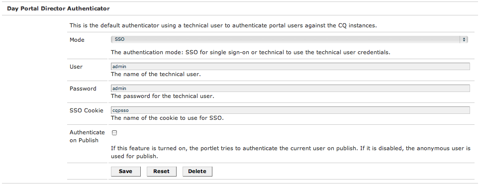

# AEM-Portale und Portlets{#aem-portals-and-portlets}

Dieses Dokument beschäftigt sich mit den folgenden Themen:

* AEM-Portalarchitektur
* Verwalten und Konfigurieren von AEM als Portal
* Verwenden von AEM als Portal
* Installieren, Konfigurieren und Anzeigen von AEM-Inhalten in einem Portlet (z. B. einem Webserver)

## AEM-Portalarchitektur {#aem-portal-architecture}

Die AEM-Portalarchitektur enthält Definitionen von Portalen und Portlets.

### Was ist ein Portal?  {#what-is-a-portal}

Ein Portal ist eine Webanwendung, die Personalisierung, Single Sign-On und Inhaltsintegration aus verschiedenen Quellen ermöglicht und die Präsentationsebene von Informationssystemen hostet.

Sie können JSR 286-kompatible Portlets in AEM ausführen. Mit der Portlet-Komponente können Sie ein Portlet auf der Seite einbetten. Weitere Informationen dazu finden Sie in [Verwalten des AEM-Inhalts-Portlets](#administeringthecqcontentportlet).

### Was ist ein Portlet? {#what-is-a-portlet}

Portlets sind die Webkomponenten, die innerhalb eines Containers bereitgestellt werden, der dynamische Inhalte generiert. Die Portlet-Benutzeroberfläche wird gepackt und als .war-Datei in einem Portlet-Container bereitgestellt. Wenn Sie AEM als Portal ausführen, benötigen Sie die .war-Datei des Portlets, um das Portlet auszuführen.

Informationen zum Konfigurieren von AEM-Inhalten, sodass diese in einem Portal angezeigt werden, finden Sie in [Installieren, Konfigurieren und Verwenden von AEM in einem Portlet](#installingconfiguringandusingcqinaportlet).

### AEM Portal Director  {#aem-portal-director}

>[!CAUTION]
>
>Der AEM Portal Director ist seit der Version AEM 6.4 veraltet. Weitere Informationen dazu finden Sie in [Veraltete und entfernte Funktionen](https://helpx.adobe.com/de/experience-manager/6-4/release-notes/deprecated-removed-features.html).

## Verwalten des AEM-Inhalts-Portlets  {#administering-the-aem-content-portlet}

Das AEM-Inhalts-Portlet bietet Ihnen die Möglichkeit, AEM-Inhalte in einem Portal anzuzeigen. Das Portlet ist unter `/crx-quickstart/opt/portal` verfügbar und kann auf verschiedene Arten angepasst werden. Sie können beispielsweise die Abwicklung von SSO bzw. der Authentifizierung durch Bereitstellung eines eigenen Authentifizierungsdienstes anpassen, der die erforderlichen Authentifizierungsinformationen generiert, damit AEM das Standardverhalten überschreibt. Die Plug-ins verwenden eine definierte API, über die Sie Ihre eigene Funktion hinzufügen können, indem sie das Plug-in unter Verwendung der API erstellen. Das Plug-in kann im ausgeführten Portlet bereitgestellt werden. Für eine korrekte Funktionsweise benötigt es eine Konfiguration der AEM-Autoreninstanz und -Veröffentlichungsinstanz sowie den Inhalts-Pfad, der beim Start angezeigt werden soll.

Einige der Konfigurationen können über die Portlet-Voreinstellungen und andere über die OSGi-Service-Konfigurationen geändert werden. Sie können diese Konfigurationen mithilfe von **config**-Dateien oder der OSGi-Web-Konsole ändern.

### Portlet-Voreinstellungen {#portlet-preferences}

Die Portlet-Voreinstellungen können während der Bereitstellung im Portal-Server oder durch Bearbeitung der Datei **WEB-INF/portlet.xml** vor der Bereitstellung der Portlet-Web-Anwendung konfiguriert werden. Die Datei portlet.xml wird standardmäßig wie folgt angezeigt:

```xml
<?xml version="1.0" encoding="UTF-8"?>
<portlet-app xmlns="https://java.sun.com/xml/ns/portlet/portlet-app_1_0.xsd"
             xmlns:xsi="https://www.w3.org/2001/XMLSchema-instance"
             xsi:schemaLocation="https://java.sun.com/xml/ns/portlet/portlet-app_1_0.xsd /opt/SUNWps/dtd/portlet.xsd"
             version="1.0">
   <portlet>
      <portlet-name>RSSWeatherPortlet</portlet-name>
      <portlet-class>org.jboss.portlet.weather.WeatherPortlet</portlet-class>
      <init-param>
         <name>default_zipcode</name>
         <value>05673</value>
      </init-param>
      <init-param>
         <name>RSS_XSL</name>
         <value>/WEB-INF/Rss.xsl</value>
      </init-param>
      <init-param>
         <name>base_url</name>
         <value>https://xml.weather.yahoo.com/forecastrss?p=</value>
      </init-param>
      <expiration-cache>180</expiration-cache>
      <supports>
         <mime-type>text/html</mime-type>
         <portlet-mode>VIEW</portlet-mode>
         <portlet-mode>EDIT</portlet-mode>
      </supports>
      <portlet-info>
         <title>Weather Portlet</title>
      </portlet-info>
      <portlet-preferences>
         <preference>
            <name>expires</name>
            <value>180</value>
         </preference>
         <preference>
            <name>RssXml</name>
            <value>https://xml.weather.yahoo.com/forecastrss?p=33145</value>
            <read-only>false</read-only>
         </preference>
      </portlet-preferences>
   </portlet>
</portlet-app>
```

Das Portlet kann mit den folgenden Voreinstellungen konfiguriert werden:

<table>
 <tbody>
  <tr>
   <td>startPath</td>
   <td><p>Dies ist der Startpfad des Portlets. Er definiert den Inhalt, der anfänglich angezeigt wird.</p> <p><strong>Wichtig</strong>: Wenn das Portlet so konfiguriert ist, dass es eine Verbindung zu AEM Autoren- und Veröffentlichungsinstanzen herstellt, die auf einem anderen Kontextpfad als <strong> /</strong> ausgeführt werden, müssen Sie die erzwungene  <strong></strong> CQUrlInfo in der HTML Library Manager-Konfiguration dieser AEM Instanzen aktivieren (z. B. über Felix Webconsole). Andernfalls funktioniert die Bearbeitung nicht und das Dialogfeld "Voreinstellungen"wird nicht angezeigt.</p> </td>
  </tr>
  <tr>
   <td>htmlSelector</td>
   <td>Der Selektor, der an jede URL angehängt wird. Standardmäßig ist dies <strong>portlet</strong>, sodass alle Anforderungen an HTML-Seiten URLs verwenden, die auf <strong>.portlet.html enden.</strong> So können Sie benutzerdefinierte Skripte innerhalb von AEM für das Portlet-Rendering verwenden.</td>
  </tr>
  <tr>
   <td>addCssToPortalHeader</td>
   <td><p>Standardmäßig sind CSS-Dateien, die von AEM in die HTML-Seite eingeschlossen werden, im Portlet enthalten. Durch Deaktivieren dieser Option werden die CSS-Standarddateien ausgeschlossen.</p> <p>Ist diese Option aktiviert, werden die CSS-Dateien entweder im Kopfbereich der HTML-Seite eingefügt oder in die HTML-Seite eingebettet. Dies hängt vom Verhalten des Portals ab.</p> </td>
  </tr>
  <tr>
   <td>includeToolbar</td>
   <td>Standardmäßig wird eine Symbolleiste innerhalb des Inhalts-Portlets gerendert, um Verwaltungsfunktionen bereitzustellen. Wenn Sie diese Option deaktivieren, wird keine Symbolleiste gerendert.</td>
  </tr>
  <tr>
   <td>urlParameterNames</td>
   <td><p>Liste der alternativen URL-Parameternamen, die möglicherweise die neue Inhalts-URL zur Anzeige für das Portlet enthält. Die Liste wird von oben nach unten abgearbeitet. Der erste Parameter mit einem Wert wird verwendet. Wird keine URL gefunden, wird der URL-Standardparameter verwendet. Die bereitgestellte URL wird so, wie sie ist, verwendet. Sie wird nicht verändert.</p> <p>Diese Einstellung gilt pro bereitgestelltem Portlet. Sie dient auch dazu, einige URL-Parameter in der OSGi-Konfiguration für die „Day Portal Director Portlet Bridge“ global zu konfigurieren.</p> </td>
  </tr>
  <tr>
   <td>preferenceDialog</td>
   <td>Pfad zum Dialogfeld „Voreinstellungen“ in AEM. Wird kein Pfad angegeben, wird das integrierte Dialogfeld „Voreinstellungen“ verwendet. Dieses befindet sich standardmäßig unter /libs/portal/content/prefs.html.</td>
  </tr>
  <tr>
   <td>initialRedirect</td>
   <td>Standardmäßig führt das Portlet beim ersten Aufruf eine JavaScript-Umleitung der kompletten Portalseite aus. Dies dient dazu, das Drag-and-Drop-Szenario von modernen Portal-Servern zu unterstützen. In einer Produktionsumgebung ist diese Umleitung selten erforderlich und sie kann daher deaktiviert werden, indem diese Voreinstellung auf <em>false</em> gesetzt wird.</td>
  </tr>
 </tbody>
</table>

#### OSGi-Web-Konsole  {#osgi-web-console}

Vorausgesetzt, dass der Portal-Server auf dem Host „localhost“ (Port ) ausgeführt und die Web-Anwendung des AEM-Portlets im Web-Anwendungskontext *cqportlet* gemountet wird, lautet die URL für die Web-Konsole `https://localhost:8080/cqportlet/cqbridge/system/console`:8080/. Der Standardbenutzer und das Standardkennwort lauten **admin**.

Öffnen Sie die Registerkarte **Konfigurationen** und wählen Sie **Portal Directory CQ Server Configuration** aus. Hier geben Sie die Basis-URL für die Autoren- und die Veröffentlichungsinstanz an. Dieses Verfahren wird im Abschnitt [Konfigurieren von Portlets](#configuring-the-portlet) näher beschrieben.

>[!NOTE]
>
>Die OSGi-Web-Konsole dient lediglich zum Ändern von Konfigurationen während der Entwicklung (oder Tests). Stellen Sie sicher, dass Anfragen an die Konsole für Produktionssysteme blockiert werden.

### Bereitstellen von Konfigurationen  {#providing-configurations}

Zur Unterstützung automatisierter Implementierungen und Konfigurationsbereitstellungen verfügt das AEM-Inhalts-Portlet über eine integrierte Konfigurationssupport-Funktion, die versucht, Konfigurationen aus dem Attribut „classpath“ (Klassenpfad) auszulesen, das der Portlet-Anwendung bereitgestellt wird.

Beim Start wird die Systemeigenschaft **com.day.cq.portet.config** ausgelesen, um die aktuelle Umgebung zu erkennen. Normalerweise lautet der Wert dieser Eigenschaft **dev**, **prod**, **test** usw. Wenn keine Umgebung festgelegt ist, werden keine Konfigurationen ausgelesen.

Wenn eine Umgebung festgelegt ist, wird eine Konfigurationsdatei im Klassenpfad unter ***com/day/cq/portlet/{env}.config** gesucht, wobei **env** durch den tatsächlichen Wert für die Umgebung ersetzt wird. Diese Datei sollte alle Konfigurationsdateien für diese Umgebung auflisten. Diese Dateien werden relativ zum Speicherort der Konfigurationsdatei gesucht. Wenn die Datei beispielsweise eine Zeile `my.service.xml,` enthält, wird diese Datei aus dem Klassenpfad unter `com/day/cq/portlet/my.service.config.` Der Name der Datei besteht aus der Persistenz-ID des Dienstes, gefolgt von **.config**. Im vorherigen Beispiel ist die Persistenz-ID **my.service**. Das Format der Konfigurationsdatei entspricht dem Format, das vom Apache Sling OSGi-Installationsprogramm verwendet wird.

Das heißt, für jede Umgebung muss eine entsprechende Konfigurationsdatei hinzugefügt werden. So muss eine Konfiguration, die auf alle Umgebungen angewendet werden soll, in all diese Dateien eingegeben werden. Soll sie nur für eine einzelne Umgebung angewendet werden, muss sie nur in diese Datei eingefügt werden. Dieser Mechanismus gewährleistet, dass Sie die volle Kontrolle darüber haben, welche Konfiguration in welcher Umgebung ausgelesen wird.

Es ist möglich, eine andere Systemeigenschaft zur Erkennung der Umgebung zu verwenden. Legen Sie die Systemeigenschaft **com.day.cq.portet.configproperty** fest, die den Namen der Systemeigenschaft enthält, die anstatt **com.day.cq.portet.config** verwendet werden soll.

#### Zwischenspeichern und Invalidieren der Zwischenspeicherung  {#caching-and-caching-invalidation}

In der Standardkonfiguration speichert das Portlet die Antworten, die es von AEM WCM empfängt, in einem benutzerspezifischen Zwischenspeicher (Cache) zwischen. Die Zwischenspeicher müssen invalidiert werden, wenn Änderungen an den Inhalten der Veröffentlichungsinstanz vorgenommen wurden. Zu diesem Zweck muss in AEM WCM ein Replikationsagent auf der Autoreninstanz konfiguriert werden. Der Zwischenspeicher kann auch manuell geleert werden. In diesem Abschnitt werden beide Verfahren beschrieben.

Das Portlet kann mit einem eigenen Zwischenspeicher konfiguriert werden, sodass die Inhalte im Portlet ohne Zugriff auf AEM angezeigt werden können. Das Portal ist als Inhalt in /libs/portal/director verfügbar. Um auf die Inhalte zuzugreifen, starten Sie eine AEM-Instanz und laden Sie mithilfe von CRXDE Lite oder Webdav die Datei aus diesem Speicherort herunter.

Sie können dieses Bundle während der Laufzeit bereitstellen oder vor der Bereitstellung der Portlet-Web-Anwendung unter `WEB-INF/lib/resources/bundles` hinzufügen.

Nachdem der Zwischenspeicher bereitgestellt wurde, speichert das Portlet Inhalte von der Veröffentlichungsinstanz zwischen. Der Portlet-Zwischenspeicher kann mithilfe einer Anweisung zum Leeren des Dispatchers von AEM invalidiert werden. So konfigurieren Sie das Portlet, sodass es einen eigenen Zwischenspeicher verwendet:

1. Konfigurieren Sie einen Replikationsagenten in der Autoreninstanz, der auf den Portalserver verweist.
1. Wenn der Portal-Server auf dem Host **localhost**, **port 8080 **ausgeführt wird und die AEM Portlet-Webanwendung im Kontext **cqportlet** gemountet ist, lautet die URL zum Leeren des Caches `https://localhost:8080/cqportlet/cqbridge/cqpcache?Path=$(path)`. Verwenden Sie das Verfahren GET.
   **Hinweis:** Anstatt einen Anforderungsparameter zu verwenden, können Sie eine HTTP-Kopfzeile mit dem Namen **Pfad** senden.

#### Leeren des Zwischenspeichers über den Replikationsagenten {#flushing-the-cache-via-replication-agent}

Genau wie bei der normalen Dispatcher-Invalidierung kann ein Replikationsagent so konfiguriert werden, dass er auf den AEM-Portlet-Zwischenspeicher des Portals verweist. Nachdem Sie den Replikationsagenten konfiguriert haben, wird der Portal-Zwischenspeicher bei jeder regulären Seitenaktivierung geleert.

Wenn Sie mehrere Portal-Knoten nutzen, die das AEM-Portlet ausführen, müssen Sie einen Agenten entsprechend dem hier beschriebenen Verfahren für jeden Knoten erstellen.

So konfigurieren Sie einen Replikationsagenten für das Portal:

1. Melden Sie sich bei der Autoreninstanz an.
1. Klicken Sie auf der Registerkarte Websites auf die Registerkarte *Tools* .
1. Klicken Sie auf **Neue Seite...** in den Replikationsagenten **Neu..** Menü.

   

1. Wählen Sie unter *Template* *Replication Agent* und geben Sie einen Namen für den Agenten ein. Klicken Sie auf *Erstellen*.

   

1. Doppelklicken Sie auf den gerade erstellten Replikationsagenten. Er wird mit dem Status „Ungültig“ angezeigt, da er noch nicht konfiguriert wurde.

   

1. Klicken Sie auf **Edit**.
1. Aktivieren Sie auf der Registerkarte **Einstellungen** das Kontrollkästchen **Aktiviert**, wählen Sie **Dispatcher Flush** als Serialisierungstyp aus und geben Sie ein Wiederholungs-Timeout ein (z. B. 60000).

   

1. Klicken Sie auf die Registerkarte **Transport** .
1. Geben Sie im Feld **URI** den Leerungs-URI (URL) des Portlets ein. Das URI hat folgende Form:

   ```xml
   https://<wps-host>:<port>/<wps-context>/<cq5-portlet-context>/cqbridge/cqpcache
   ```

   

1. Klicken Sie auf die Registerkarte **Erweitert** .

   

1. Geben Sie im Feld **HTTP-Methode** **GET** ein.
1. Klicken Sie im Feld **HTTP-Header** auf **+** , um einen neuen Eintrag hinzuzufügen, und geben Sie **Pfad ein: {path}**.
1. Klicken Sie bei Bedarf auf die Registerkarte **Proxy** und geben Sie Proxyinformationen für den Agenten ein.
1. Klicken Sie auf **OK**, um die Änderungen zu speichern.
1. Um die Verbindung zu testen, klicken Sie auf den Link **Verbindung testen**. Es wird eine Protokollmeldung mit dem Hinweis angezeigt, ob der Replikationstest erfolgreich war oder nicht. Beispiel:

   

#### Manuelles Leeren des Portlet-Zwischenspeichers {#manually-flushing-the-portlet-cache}

Sie können den Portlet-Zwischenspeicher leeren, indem Sie auf dieselbe URL zugreifen, die für den Replikationsagenten konfiguriert wurde. Weitere Informationen zur Form der URL finden Sie in [Leeren des Zwischenspeichers](#flushing-the-cache-via-replication-agent). Darüber hinaus muss die URL um den URL-Parameter „Path=&lt;path>“ erweitert werden, um anzugeben, was geleert werden soll.

Beispiel:

`https://10.0.20.99:10040/wps/PA_CQ5_Portlet/cqbridge/cqpcache?Path=*` Leert den vollständigen Cache. `https://10.0.20.99:10040/wps/PA_CQ5_Portlet/cqbridge/cqpcache?Path=/content/mypage/xyz` Leert  `/content/mypage/xyz` aus dem Cache.

### Portalsicherheit {#portal-security}

Das Portal ist der eigentlich entscheidende Authentifizierungsmechanismus. Sie können sich bei AEM als technischer Benutzer, Portal-Benutzer, Gruppe usw. anmelden. Das Portlet hat keinen Zugriff auf das Kennwort für den Benutzer im Portal. Wenn also das Portlet nicht alle Anmeldedaten für eine erfolgreiche Anmeldung eines Benutzers kennt, muss eine SSO-Lösung verwendet werden. In diesem Fall leitet das AEM-Portlet alle erforderlichen Informationen an AEM weiter und AEM leitet diese Informationen wiederum an das zugrundeliegende AEM-Repository weiter. Dieses Verhalten ist veränderbar und kann angepasst werden.

### Authentifizierung bei Veröffentlichung  {#authentication-on-publish}

In diesem Abschnitt werden die verfügbaren Authentifizierungsmodi beschrieben, die das Portlet zur Kommunikation mit den zugrundeliegenden AEM WCM-Instanzen verwenden kann.

Standardmäßig werden keine Benutzerinformationen an die Veröffentlichungsinstanz von AEM gesendet. Die Inhalte werden immer als anonymer Benutzer angezeigt. Wenn benutzerspezifische Informationen von AEM bereitgestellt werden sollen oder eine Benutzerauthentifizierung für die Veröffentlichung erforderlich ist, muss diese Funktion aktiviert werden.

#### Zugreifen auf die Authentifizierungskonfiguration des Portlets  {#accessing-the-portlet-s-authentication-configuration}

Die vom Portlet in AEM WCM-Instanzen verwendeten Konfigurationsoptionen für die Authentifizierung sind in der Web-Konsole (OSGi-Konfiguration) verfügbar.

>[!NOTE]
>
>Um die Konfigurationseinstellungen für OSGi-Dienste zu verwalten (Konsolen- oder Repository-Knoten), stehen Ihnen in AEM mehrere Methoden zur Verfügung.
>
>Weitere Informationen hierzu finden Sie unter [Konfigurieren von OSGi](/help/sites-deploying/configuring-osgi.md).

So greifen SIe auf die Portlet-Authentifizierungskonfiguration zu:

1. Greifen Sie unter folgender URL auf die Web-Konsole zu:

   `https://localhost:8080/cqportlet/cqbridge/system/console`

   Beispielsweise in der Standardkonfiguration:

   `https://wps-host:10040/wps/PA_CQ5_Portlet/cqbridge/system/console`

1. Melden Sie sich bei der Web-Konsole an. Die Standardanmeldeinformationen sind `admin/admin`.
1. Wählen Sie in der Konsole **Konfiguration** aus.
1. Wählen Sie im Menü **Konfiguration** einen bestimmten Dienst aus, der konfiguriert werden soll. Dienste werden durch das Portlet im OSGi-Framework bereitgestellt.

   | Dienstname | Beschreibung |
   |---|---|
   | Day Portal Director Authenticator | Konfigurieren Sie, welcher Authentifizierungsmodus für AEM WCM verwendet wird. Je nach ausgewähltem Modus können Sie einen technischen Benutzer oder den Namen des SSO-Cookies angeben. Zudem können Sie die Authentifizierung für die AEM WCM-Veröffentlichungsinstanzen aktivieren. |
   | Day Portal Director File Cache | Konfigurieren Sie die Parameter, die festlegen, wie das Portlet die von den AEM WCM-Instanzen empfangenen Antworten zwischenspeichert. |
   | Day Portal Director HTTP Client Service | Konfigurieren Sie, wie das Portlet eine Verbindung über HTTP zu den zugrundeliegenden AEM WCM-Instanzen herstellt. Sie können beispielsweise einen Proxy-Server angeben. |
   | Day Portal Director Locale Handler | Konfigurieren Sie, welche Gebietsschemata vom Portlet unterstützt werden. Anforderungen an AEM WCM-Instanzen basieren auf dem Gebietsschema des Benutzers. Beispielsweise die Benutzersprache *Deutsch *würde `/content/geometrixx/de/` anfordern.... |
   | Day Portal Director Privilege Manager | Konfigurieren Sie, ob das Portlet die Registerkarte „Websites“ basierend auf dem aktuell angemeldeten Benutzer testen soll. |
   | Day Portal Director Toolbar Renderer | Passen Sie das Rendering der Portlet-Symbolleiste an. |

1. Darüber hinaus können Sie die Web-Konsole und den Protokollierungsdienst konfigurieren. So können Sie beispielsweise die Admin-Anmeldedaten für die Web-Konsole durch Klicken auf den Link „Apache Felix OSGi Management Console“ ändern.

#### Modus „Technischer Benutzer“  {#technical-user-mode}

Im Standardmodus werden alle vom Portlet für die AEM WCM-Autoreninstanz ausgegebenen Anfragen unabhängig vom aktuellen Portal-Benutzer unter Verwendung desselben technischen Benutzers ausgegeben. Der Modus „Technischer Benutzer“ ist standardmäßig aktiviert. Sie aktivieren/deaktivieren diesen Modus im entsprechenden Konfigurationsbildschirm in der OSGi-Verwaltungskonsole:

Der angegebene technische Benutzer muss in der AEM WCM-Autoreninstanz und in der Veröffentlichungsinstanz vorhanden sein, wenn **Authentifizierung bei Veröffentlichung** aktiviert ist. Stellen Sie sicher, dass dem Benutzer ausreichend Zugriffsberechtigungen für die Bearbeitung gewährt werden.

#### SSO (Single Sign-On, einmalige Anmeldung) {#sso}

Das Portlet unterstützt SSO mit AEM standardmäßig. Der Authentifizierungsdienst kann so konfiguriert werden, dass er SSO nutzt und den aktuellen Portal-Benutzer mit dem Format **Allgemein** als Cookie mit dem Namen `cqpsso` an AEM übermittelt. AEM sollte so konfiguriert sein, dass der SSO-Authentifizierungs-Handler für den Pfad / verwendet wird. Auch hier muss der Cookie-Name konfiguriert werden.

Das `crx-quickstart/repository/repository.xml` für AEM Repository muss entsprechend konfiguriert werden:

```xml
<LoginModule class="com.day.crx.security.authentication.CRXLoginModule">
  ...
  <param name="trust_credentials_attribute" value="TrustedInfo"/>
  <param name="anonymous_principal" value="anonymous"/>
</LoginModule>
```

#### SSO-Authentifizierungsmodus {#sso-authentication-mode}

Das Portlet kann die Authentifizierung für AEM WCM mithilfe des Single Sign-On-(SSO)-Schemas durchführen. In diesem Modus wird der aktuell beim Portal angemeldete Benutzer in Form eines SSO-Cookies an AEM WCM weitergeleitet. Bei Verwendung des SSO-Modus müssen den zugrundeliegenden AEM WCM-Instanzen alle Portal-Benutzer mit Zugriff auf das AEM-Portlet bekannt sein. Im Allgemeinen geschieht dies im Voraus durch das Herstellen einer Verbindung von AEM WCM zu LDAP oder durch die manuelle Erstellung der Benutzer. Außerdem muss vor der Aktivierung von SSO im Portlet die zugrunde liegende AEM WCM-Autoreninstanz (und die Veröffentlichungsinstanz, wenn **Authentifizierung bei Veröffentlichung** aktiviert ist) so konfiguriert werden, dass SSO-basierte Anforderungen akzeptiert werden.

Führen Sie die folgenden Schritte aus (die in den folgenden Abschnitten näher beschrieben werden), um das Portlet so zu konfigurieren, dass der SSO-Authentifizierungsmodus verwendet wird:

* Konfigurieren Sie das Repository von AEM WCM so, dass vertrauenswürdige Anmeldeinformationen akzeptiert werden.
* Aktivieren Sie SSO-Authentifizierung in AEM WCM.
* Aktivieren Sie die SSO-Authentifizierung im AEM-Portlet.

#### Konfigurieren des Repositorys von AEM WCM, sodass vertrauenswürdige Anmeldeinformationen akzeptiert werden  {#enabling-aem-wcm-s-repository-to-accept-trusted-credentials}

Bevor Sie SSO für AEM WCM aktivieren können, muss das zugrundeliegende Repository so konfiguriert werden, dass die von AEM WCM bereitgestellten vertrauenswürdigen Anmeldedaten akzeptiert werden. Konfigurieren Sie dazu die Datei repository.xml von AEM.

1. Öffnen Sie in dem Dateisystem, in dem Sie AEM WCM installiert haben, die folgende Datei:

   `//crx-quickstart/repository/repository.xml`

1. Suchen Sie in der XML-Datei nach dem Eintrag für das **LoginModule** und fügen Sie den Parameter „trust_credentials_attribute“ seiner Konfiguration hinzu:

   ```xml
   <LoginModule class="com.day.crx.security.authentication.CRXLoginModule">
     ...
     <param name="trust_credentials_attribute" value="TrustedInfo"/>
     <param name="anonymous_principal" value="anonymous"/>
   </LoginModule>
   ```

1. Starten Sie AEM WCM neu, damit die Änderungen übernommen werden.

#### Aktivieren der SSO-Authentifizierung in AEM WCM  {#enabling-sso-authentication-in-the-aem-wcm}

Greifen Sie zur Aktivierung von SSO in AEM WCM auf den relevanten Konfigurationseintrag in der Apache Felix Web Management Console (OSGi) von AEM WCM zu:

1. Greifen Sie über den URI der Konsole unter https://&lt;AEM-Host>:&lt;Port>/system/console auf die Konsole zu.
1. Wählen Sie im Menü „Konfigurationen“ den SSO-Authentifizierungs-Handler aus. In diesem Beispiel akzeptiert der SSO-Handler SSO-Anfragen für alle Pfade basierend auf dem vom AEM-Portlet bereitgestellten Cookie. Ihre Konfiguration könnte davon abweichen.

   | Pfad | / | Aktiviert den SSO-Handler für alle Anforderungen |
   |---|---|---|
   | Cookie-Namen | cqpsso | Name des vom Portlet bereitgestellten Cookies, wie in der OSGi-Konsole des Portlets konfiguriert. |

1. Klicken Sie auf **Speichern**, um SSO zu aktivieren. SSO ist nun das primäre Authentifizierungsschema.

Bei jeder Anfrage, die AEM WCM empfängt, wird zunächst versucht, eine SSO-basierte Authentifizierung durchzuführen. Schlägt diese fehl, wird ein Fallback zum üblichen allgemeinen Authentifizierungsschema durchgeführt. Das bedeutet, dass auch weiterhin eine Verbindung zu AEM WCM ohne SSO hergestellt werden kann.

#### Aktivieren der SSO-Authentifizierung im AEM-Portlet  {#enabling-sso-authentication-in-a-aem-portlet}

Damit die zugrunde liegende AEM WCM-Instanz SSO-Anforderungen akzeptieren kann, muss der Authentifizierungsmodus des Portlets von **Technical** auf **SSO** umgestellt werden.

Zur Aktivierung der SSO-Authentifizierung in einem AEM-Portlet:

1. Greifen Sie über den URI der Konsole unter https://&lt;aem-host>:&lt;port>/system/console auf die Konsole zu.
1. Wählen Sie im Menü „Konfigurationen“ die Option „Day Portal Director Authenticator“ aus der Liste der verfügbaren Konfigurationen aus.
1. Wählen Sie für „Modus“ die Option „SSO“ aus. Lassen Sie die Standardwerte bei den anderen Parametern stehen.

   

1. Klicken Sie auf „Speichern“, um SSO für das Portlet zu aktivieren.

   Nachdem Sie denselben Benutzer mit Administratorberechtigungen in AEM WCM erstellt haben, greifen Sie zu Testzwecken als administrativer Benutzer des Portals auf das Portlet zu.

Nach Abschluss dieses Verfahrens werden Anfragen mithilfe von SSO authentifiziert. Ein typisches Snippet der HTTP-Kommunikation zeigt, dass folgende SSO- und Portlet-spezifische Kopfzeilen vorhanden sind:

```xml
C-12-#001898 -> [GET /mynet/en/_jcr_content/par/textimage/image.img.png HTTP/1.1 ]
C-12-#001963 -> [cq5:locale: en ]
C-12-#001979 -> [cq5:used-locale: en ]
C-12-#002000 -> [cq5:locales: en,en_US ]
C-12-#002023 -> [cqp:user: wpadmin ]
C-12-#002042 -> [cqp:portal: IBM WebSphere Portal/6.1 ]
C-12-#002080 -> [cqp:windowid: 7_CGAH47L000CE302V2KFNOG0084 ]
C-12-#002124 -> [cqp:windowstate: normal ]
C-12-#002149 -> [cqp:portletmode: view ]
C-12-#002172 -> [User-Agent: Jakarta Commons-HttpClient/3.1 ]
C-12-#002216 -> [Host: 10.0.0.68:4502 ]
C-12-#002238 -> [Cookie: $Version=0; cqpsso=Basic+d3BhZG1pbg%3D%3D ]
C-12-#002289 -> [ ]
```

### Aktivieren der PIN-Authentifizierung  {#enabling-pin-authentication}

Falls Sie die standardmäßigen Inline-Bearbeitungsfunktionen des AEM-Inhalts-Portlets nicht nutzen, aber den Bearbeitungs- und Verwaltungsteil des Portlets außerhalb des Portals direkt in der AEM-Autoreninstanz nutzen wollen, sollten Sie die PIN-Authentifizierung aktivieren. Darüber hinaus müssen Sie die Konfiguration der Verwaltungsschaltflächen ändern.

Um die Verwaltungsseite für die Website zu öffnen oder eine Seite des Portlets zu bearbeiten, verwendet das AEM-Inhalts-Portlet die neue PIN-Authentifizierung. Standardmäßig ist die PIN-Authentifizierung deaktiviert, daher müssen Sie die folgenden Konfigurationsänderungen in AEM vornehmen:

1. Aktivieren Sie die vertrauenswürdige Authentifizierung in AEM, indem Sie die vertrauenswürdigen Informationen in die Datei repository.xml einfügen:

   ```xml
   <LoginModule class="com.day.crx.security.authentication.CRXLoginModule">
     ...
     <param name="trust_credentials_attribute" value="TrustedInfo"/>
   </LoginModule>
   ```

1. Wählen Sie in der OSGi-Konfigurationskonsole, die sich standardmäßig unter https://localhost:4502/system/console/configMgr befindet, **CQ PIN Authentication Handler** aus dem Dropdown-Menü aus.
1. Bearbeiten Sie den Parameter **URL-Stammpfad** so, dass er den einzelnen Wert **/** enthält.

### Berechtigungen {#privileges}

Einige Funktionen des Portlets werden durch Berechtigungen geschützt. Der aktuelle Benutzer muss die entsprechende Berechtigung haben, um auf diese Funktion zuzugreifen. Folgende Berechtigungen sind vordefiniert:

* toolbar: Hierbei handelt es sich um eine allgemeine Berechtigung zum Anzeigen/Verwenden der Symbolleiste im Portlet.
* prefs: Wenn der Benutzer über diese Berechtigung verfügt, kann er die Voreinstellungen des Portlets anzeigen/ändern.
* cq-author:edit: Mit dieser Berechtigung kann der Benutzer die Bearbeitungsansicht des Inhalts aufrufen.
* cq-author:preview: Mit dieser Berechtigung kann der Benutzer die Vorschau anzeigen.
* cq-author:siteadmin: Mit dieser Berechtigung kann der Benutzer „siteadmin“ innerhalb von AEM öffnen.

Der beste Ansatz für die Verwaltung von Berechtigungen ist, Portal-Rollen zu verwenden und diesen Berechtigungen Rollen zuzuweisen. Dies können Sie über eine OSGi-Konfiguration tun. Der „Day Portal Director Privilege Manager“ kann mit einer Reihe von Rollen für jede Berechtigung konfiguriert werden. Wenn der Benutzer eine der Rollen hat, hat der Benutzer die entsprechende Berechtigung.

Außerdem ist es möglich, diesen rollenbasierten Zugriff pro Portlet-Instanz zu definieren. Das Dialogfeld „Voreinstellungen“ des Portlets enthält ein Eingabefeld für jede der zuvor aufgeführten Berechtigungen. Sie können für jede Berechtigung eine durch Kommas getrennte Liste der Portlet-Rollen konfigurieren. Wenn ein Wert konfiguriert ist, überschreibt dieser die globale Konfiguration des Dienstes „Day Portal Director Privilege Manager“ und es kann möglicherweise erforderlich sein, dieselben Rollen von dieser globalen Einstellung hinzuzufügen, da die Rollen nicht zusammengeführt werden. Ist kein Wert festgelegt, wird die globale Konfiguration verwendet.

### Anpassen der AEM-Portlet-Anwendung {#customizing-the-aem-portlet-application}

Die bereitgestellte AEM-Portlet-Anwendung startet genauso wie AEM einen OSGi-Container innerhalb der Web-Anwendung. Dank dieser Architektur können Sie alle Vorteile von OSGi nutzen:

* Einfache Aktualisierung und Erweiterung
* Bereitstellung von Hot-Updates für das Portlet ohne jedwede Interaktion des Portal-Servers
* Einfache Anpassung des Portlets

### Schaltflächen der Symbolleiste  {#toolbar-buttons}

Die Symbolleiste und deren Schaltflächen sind konfigurierbar und können angepasst werden. Sie können der Symbolleiste eigene Schaltflächen hinzufügen oder festlegen, welche Schaltflächen in welchem Modus angezeigt werden. Jede Schaltfläche ist ein OSGi-Dienst, der über eine OSGi-Konfiguration konfigurierbar ist.

Die OSGi-Web-Konsole listet alle Schaltflächenkonfigurationen auf der Registerkarte **Konfiguration** auf. Sie können für jede Schaltfläche festlegen, in welchem Modus diese Schaltfläche angezeigt wird. So können Sie beispielsweise durch Entfernen aller Modi eine Schaltfläche deaktivieren.

Standardmäßig verwendet das AEM-Inhalts-Portlet die Inline-Bearbeitungsfunktionen. Wenn Sie es jedoch vorziehen, zur Bearbeitung zur AEM-Autoreninstanz zu wechseln, aktivieren Sie die **Schaltfläche „SiteAdmin“** und die **Schaltfläche „ContentFinder“**, aber deaktivieren Sie die **Schaltfläche „Bearbeiten“**. Vergewissern Sie sich in diesem Fall, dass die PIN-Authentifizierung in AEM korrekt konfiguriert ist.

Das Symbolleistenlayout der Portlets kann angepasst werden, indem Sie ein Bundle über die Felix Web Console des Portlets installieren, in der die benutzerdefinierten CSS/HTML-Informationen an einem vordefinierten Speicherort gespeichert sind.

#### Bundle-Struktur  {#bundle-structure}

Nachfolgend sehen Sie ein Beispiel einer Bundle-Struktur:

```xml
$ jar tvf target/toolbarlayout-0.0.1-SNAPSHOT.jar | awk '{print $8}'
META-INF/
META-INF/MANIFEST.MF
/com/day/cq/portlet/toolbar/layout/
/com/day/cq/portlet/toolbar/layout/author.gif
/com/day/cq/portlet/toolbar/layout/back.gif
/com/day/cq/portlet/toolbar/layout/button.html
/com/day/cq/portlet/toolbar/layout/edit.gif
/com/day/cq/portlet/toolbar/layout/manage.html
/com/day/cq/portlet/toolbar/layout/publish.html
/com/day/cq/portlet/toolbar/layout/refresh.gif
/com/day/cq/portlet/toolbar/layout/siteadmin.gif
/com/day/cq/portlet/toolbar/layout/toolbar.css
```

Der Ordner META-INF beinhaltet die Datei MANIFEST.MF, die von OSGi benötigt wird, um diesen als Bundle erkennen zu können. Er wird wie folgt angezeigt:

```xml
Manifest-Version: 1.0
Built-By: djaeggi
Created-By: Apache Maven Bundle Plugin
Import-Package: com.day.cq.portlet.toolbar.layout
Bnd-LastModified: 1234178347159
Export-Package: com.day.cq.portlet.toolbar.layout
Bundle-Version: 0.0.1.SNAPSHOT
Bundle-Name: Company CQ5 Portal Director Portlet Toolbar Layout
Bundle-Description: This bundle provides a custom layout for the CQ5 P
 ortal Director Portlet Toolbar.
Build-Jdk: 1.5.0_16
Bundle-ManifestVersion: 2
Bundle-SymbolicName: com.day.cq.portlet.company.toolbarlayout
Tool: Bnd-0.0.255
```

Dass sich die HTML- und CSS-Informationen sowie die Bilder innerhalb des Ordners /com/day/cq/portlet/toolbar/layout befinden, wird vom Portlet festgelegt und kann nicht geändert werden. Analog dazu müssen die Kopfzeilen „Import-Package“ und „Export-Package“ in der Datei MANIFEST.MF ebenfalls den Namen /com/day/cq/portlet/toolbar/layout haben. Der „Bundle-SymbolicName“ muss ein eindeutiger, voll qualifizierter Paket-Name sein.

Sie können das Bundle mithilfe eines Tools wie beispielsweise Maven generieren oder Sie können eine solche jar-Datei mit den relevanten Kopfzeilen wie in diesem Abschnitt gezeigt manuell erstellen.

#### Ansichten der Portlet-Symbolleiste  {#portlet-toolbar-views}

Die Symbolleiste der Portlets hat im Allgemeinen zwei Ansichtsstatus. Jede Ansicht und die zugehörigen Schaltflächen können mit einer entsprechenden HTML-Datei angepasst werden.

#### Veröffentlichungsansicht {#publish-view}

Die Veröffentlichungsansicht verfügt nur über eine Schaltfläche, mit der Sie zur Verwaltungsansicht der Symbolleiste wechseln können. Die Veröffentlichungsansicht wird im [vorherigen Bundle](/help/sites-deploying/configuring-osgi.md#bundles) durch die Datei publish.html repräsentiert. In HTML können Sie die folgenden Platzhalter verwenden, die beim Rendering vom Portlet durch die entsprechenden Inhalte ersetzt werden:

#### Platzhalter der Veröffentlichungsansicht  {#publish-view-placeholders}

| Platzhalterzeichenfolge | Beschreibung |
|---|---|
| {buttonManage} | Der Platzhalter wird durch die Schaltfläche **Verwalten** ersetzt, mit der der Portlet-Status in den Verwaltungsstatus geändert wird. |

#### Verwaltungsansicht {#manage-view}

Die Verwaltungsansicht hat vier Schaltflächen: „Bearbeiten“, Registerkarte „Websites“, „Aktualisieren“ und „Zurück“. Die Verwaltungsansicht wird im [vorherigen Bundle](/help/sites-deploying/configuring-osgi.md#bundles) durch die Datei manage.html repräsentiert. In HTML können Sie die folgenden Platzhalter verwenden, die beim Rendering vom Portlet durch die entsprechenden Inhalte ersetzt werden:

#### Platzhalter der Verwaltungsansicht  {#manage-view-placeholders}

| Platzhalterzeichenfolge | Beschreibung |
|---|---|
| {buttonEdit} | Der Platzhalter wird durch die Schaltfläche **Bearbeiten** ersetzt, mit der Sie die aktuelle Seite im AEM-Bearbeitungsmodus in einem neuen Fenster öffnen. |
| {buttonWebsites tab} | Der Platzhalter wird durch eine Schaltfläche ersetzt, mit der Sie die Registerkarte „Websites“ von AEM WCM öffnen. |
| {buttonRefresh} | Aktualisiert die aktuelle Ansicht |
| {buttonBack} | Wechselt zurück zur Veröffentlichungsansicht |

#### Schaltflächen {#buttons}

Schaltflächen, egal in welcher Ansicht sie angezeigt werden, verwenden denselben allgemeinen HTML-Code, der in der Datei button.html definiert ist.

In HTML können Sie die folgenden Platzhalter verwenden, die beim Rendering vom Portlet durch die entsprechenden Inhalte ersetzt werden:

#### Schaltflächen in der Verwaltungs- und der Veröffentlichungsansicht  {#manage-and-publish-view-buttons}

| Platzhalterzeichenfolge | Beschreibung |
|---|---|
| {name} | Name der Schaltfläche, z. B. &quot;author&quot;, &quot;back&quot;, &quot;refresh&quot;** usw. |
| {id} | CSS-ID der Schaltfläche. |
| {url} | URL für das Ziel der Schaltfläche. |
| {text} | Titel der Schaltfläche. |
| {onclick} | JavaScript **onclick** -Funktion (enthält {url}). |

Beispiel einer Datei button.html:

```xml
<div class="cqp_button">

 <a href="#" onclick="{onclick}">

 

 </a>
</div>
```

#### Installieren von benutzerdefinierten Layouts  {#installing-a-custom-layout}

Um ein benutzerdefiniertes Layout zu installieren, greifen Sie auf den Abschnitt &quot;OSGI-Web-Konsole&quot;des Portlets zu und laden Sie das Bundle hoch.

#### Pakete {#packages}

Wenn Sie Pakete für Ihre Installation hochladen oder erstellen müssen, lesen Sie den Abschnitt Package Manager in der AEM-Dokumentation, um weitere Informationen zu erhalten.

### Verarbeiten von Links {#link-handling}

Alle Links werden neu geschrieben, damit sie innerhalb des Portal-Kontextes funktionieren. Standardmäßig werden Links mit Rendering-Parametern verwendet. Der Portal Director HTML Rewriter kann so konfiguriert werden, dass stattdessen Aktions-Links verwendet werden.

Sie können auch weitere Anfrageparameter definieren, die unter dem anzuzeigenden Inhalts-Pfad abgefragt werden. Dies ist zum Beispiel dann hilfreich, wenn ein Link von außerhalb auf bestimmte Inhalte verweist.

Darüber hinaus kann der Portal Director HTML Rewriter mit einer Liste von mit regulären Ausdrücken definierten Ausschlüssen für die Link-Neuschreibung konfiguriert werden. Wenn Sie beispielsweise relative Links haben, die auf externe Systeme verweisen, sollten Sie sie dieser Ausschlussliste hinzufügen.

### Lokalisierung {#localization}

Das AEM-Inhalts-Portlet verfügt über eine integrierte Lokalisierungsfunktion, die gewährleistet, dass die Inhalte von AEM in der richtigen Sprache vorliegen.

Dies geschieht in zwei Schritten:

1. Der „Portal Directory Locale Detector“ erkennt das Gebietsschema des Portal-Benutzers, indem er die Gebietsschema-Einstellung vom Portal abruft. Dieser Dienst muss mit der Liste der verfügbaren Sprachen in AEM konfiguriert werden.
1. Der „Portal Director Locale Handler“ führt die Lokalisierung der aktuellen Anfrage aus. Er nimmt den Pfad des angeforderten Inhalts, z. B. `/content/geometrixx/en/company.html`und schreibt entsprechend der Konfiguration das **en** mit dem tatsächlichen Gebietsschema des Benutzers um.

Der Portal Director Locale Handler kann mit den Pfaden konfiguriert werden, um nach Gebietsschema-Informationen zu suchen. Normalerweise umfasst dies alles unter `/content` und die Position der Gebietsschema-Informationen im Pfad. Standardmäßig befolgt der „Locale Handler“ die Empfehlung zur Strukturierung von mehrsprachigen Sites innerhalb von AEM.

Falls die Regeln hinsichtlich der Handhabung von Gebietsschema-Informationen innerhalb des Pfads Ihrer Website nicht sehr streng sind, ist es möglich, den „Locale Handler“ durch Ihre eigene Implementierung zu ersetzen.

### Optionale OSGi-Dienste {#optional-osgi-services}

Optionale OSGi-Dienste können zur Anpassung verschiedener Bereiche des Portlets implementiert werden. Jeder Dienst entspricht einer Java-Schnittstelle. Diese Schnittstelle kann über ein Bundle im Portlet implementiert und bereitgestellt werden.

<table>
 <tbody>
  <tr>
   <td>RequestTracker</td>
   <td>Der Abfrage-Tracker wird benachrichtigt, sobald Inhalte vom Portlet angezeigt werden. So können Sie die Aufrufe des Portlets nachverfolgen.</td>
  </tr>
  <tr>
   <td>InvocationContextListener</td>
   <td>Ein Listener, der am Anfang und am Ende jeder Anfrage an das Portlet aufgerufen wird. Mithilfe des Listeners können Informationen für die aktuelle Anfrage geändert oder hinzugefügt werden.<br /> </td>
  </tr>
  <tr>
   <td>ErrorHandler</td>
   <td>Benutzerdefinierter Fehler-Handler für Fehler, die während der Rendering-Phase auftreten</td>
  </tr>
  <tr>
   <td>HttpProcessor</td>
   <td>Mithilfe dieses Dienstes können Informationen zu jedem HTTP-Aufruf in AEM hinzugefügt werden.</td>
  </tr>
  <tr>
   <td>PortletAction</td>
   <td>Fügen Sie eine eigene Aktion zum Portlet hinzu. Diese Aktion kann über einen Aktions-Link des Portlets aufgerufen werden.</td>
  </tr>
  <tr>
   <td>PortletDecoratorService</td>
   <td>Mithilfe dieses Dienstes können die Inhalte des Portlets gestaltet werden.</td>
  </tr>
  <tr>
   <td>ResourceProvider</td>
   <td>Fügen Sie Ihren eigenen Ressourcen-Anbieter hinzu, um dem Client einige Ressourcen über einen Ressourcen-Link des Portlets bereitzustellen.</td>
  </tr>
  <tr>
   <td>TextMapper</td>
   <td>Der Mapper gestattet es Ihnen, HTML-, CSS- und JavaScript-Dateien nachzubearbeiten.</td>
  </tr>
  <tr>
   <td>ToolbarButton</td>
   <td>Fügen Sie Ihre eigene Schaltfläche zur Symbolleiste hinzu.</td>
  </tr>
  <tr>
   <td>UrlMapper</td>
   <td>Fügen Sie einen Dienst hinzu, um eine benutzerdefinierte URL-Zuordnung oder -Neuschreibung durchzuführen.</td>
  </tr>
  <tr>
   <td>UserInfoProvider</td>
   <td>Fügen Sie eigene Informationen zum Benutzer hinzu. Mithilfe dieses Dienstes können Sie Informationen vom Portal an das Portlet übermitteln.</td>
  </tr>
 </tbody>
</table>

#### Ersetzen von Standarddiensten  {#replacing-default-services}

Die folgenden Dienste verfügen über eine Standard-Implementierung im Inhalts-Portlet (mit einer entsprechenden Java-Schnittstelle). Zur Anpassung muss ein Bundle, das die neue Dienstimplementierung enthält, in der Portlet-Anwendung bereitgestellt werden.

Achten Sie bei der Implementierung eines solchen Dienstes darauf, die Eigenschaft **service.ranking** des Dienstes auf einen positiven Wert einzustellen. Die Standardimplementierung verwendet den Rang** 0** und das Portlet verwendet den Dienst mit dem höchsten Rang.

| **Name** | **Beschreibung** | **Standardmäßige Verhaltensweise** |
|---|---|---|
| Authenticator | Übermittelt die Authentifizierungsinformationen an AEM | Verwendet einen konfigurierbaren technischen Benutzer für die Autoren- und die Veröffentlichungsinstanz. Alternativ kann SSO verwendet werden. |
| HTMLRewriter | Schreibt Links, Bilder usw. neu | Schreibt AEM-Links zu Portal-Links um, kann um einen UrlMapper und einen TextMapper erweitert werden |
| HttpClientService | Verarbeitet alle HTTP-Verbindungen | Standardimplementierung |
| LocaleHandler | Verarbeitet die Gebietsschema-Informationen | Schreibt einen Link zu den Inhalten entsprechend dem Gebietsschema um |
| LocaleDetector | Erfasst das Gebietsschema des Benutzers | Verwendet das vom Portal bereitgestellte Gebietsschema |
| PrivilegeManager | Überprüft die Benutzerrechte | Überprüft den Zugriff auf die Autoreninstanz, wenn der Benutzer Inhalte bearbeiten darf |
| ToolbarRenderer | Rendert die Symbolleiste | Fügt eine Symbolleistenfunktion hinzu |

### Portlet-Ereignisse  {#portlet-events}

Die Portlet-API (JSR-286) legt Portlet-Ereignisse fest. Das AEM-Inhalts-Portlet verfügt über eine integrierte Bridge, die Portlet-Ereignisse für das AEM-Portlet als OSGi-Ereignisse verteilt. Dies macht die Verarbeitung von Portlet-Ereignissen „Plug“-fähig.

Wenn Sie bestimmte Ereignisse verarbeiten möchten, deklarieren Sie diese als Empfangsereignisse im Bereitstellungs-Deskriptor (oder konfigurieren Sie dies über Ihren Portal-Server) und implementieren Sie einen OSGi-Dienst, über den die EventHandler-Schnittstelle deklariert wird (siehe OSGi EventAdmin-Spezifikation).

Immer wenn ein Portlet-Ereignis auftritt, wird ein bestimmtes OSGi-Ereignis zum Aufrufen des Handlers gesendet. Der Handler ruft alle Kontextinformationen ab und kann den Status des Portlets entsprechend aktualisieren oder neue Ereignisse senden. Grundsätzlich können innerhalb des Verarbeitungsverfahrens alle Funktionen des Portlet-Ereignisses verwendet werden.

## Verwenden von AEM als Portal {#using-aem-as-a-portal}

Nutzen Sie die Portlet-Komponente zum Einfügen von Portlet-Fenstern auf AEM-Seiten. Freigegebene Bibliotheken, die Sie auf dem Anwendungsserver installieren, ermöglichen es der Portlet-Komponente, bereitgestellte Portlet-Anwendungen zu erkennen.

Führen Sie die folgenden Schritte aus, um AEM als Portal zu verwenden:

1. Installieren Sie die Portlet-Komponente sowie die freigegebenen Bibliotheken.
1. Fügen Sie die Portlet-Komponente zum Sidekick hinzu.
1. Konfigurieren Sie die Web-Anwendung, die die in der Portal-Komponente anzuzeigenden Portlets enthält, und stellen Sie sie bereit.
1. Fügen Sie die Portlet-Komponente auf einer Seite ein und wählen Sie das Portlet aus, das angezeigt werden soll.

>[!NOTE]
>
>Sie können die Portlet-Komponente nur verwenden, wenn Sie AEM als Web-Anwendung bereitgestellt haben. (Weitere Informationen finden Sie in [Installieren von AEM mit einem Anwendungsserver](/help/sites-deploying/application-server-install.md).)

### Installieren der Portlet-Komponente  {#installing-the-portlet-component}

Die AEM-Schnellstart-JAR-Datei enthält die Portlet-Komponentendateien. Um die Dateien (cq-portlet-components.zip) zu erhalten, können Sie entweder den Schnellstart ausführen oder die Inhalte extrahieren.

1. Führen Sie den Inhalt der Schnellstart-JAR-Datei aus oder extrahieren Sie ihn, und suchen Sie die Datei cq-portlet-components.zip entsprechend:

   * Führen Sie den Schnellstart aus: crx-quickstart/opt/portal
   * Extrahieren Sie die Schnellstart-Inhalte: static/opt/portal

1. Öffnen Sie den Package Manager der CQ5-Autoreninstanz, die auf dem Anwendungsserver bereitgestellt wird. (https://*appserverhost*:*port*/cq5author/crx/packmgr)

1. Verwenden Sie Package Manager zum [Laden Sie das Paket cq-portlets-components.zip hoch und installieren Sie es.](/help/sites-administering/package-manager.md#uploading-packages-from-your-file-system)

   Das Paket installiert cq-portlet-director-sharedlibs-x.x.x.jar im Ordner /libs/portal/director im Repository.

1. Kopieren Sie die Datei cq-portlet-director-sharedlibs-x.x.x.jar auf Ihre Festplatte. Rufen Sie die Datei mithilfe eines Tools wie FileVault oder einem WebDAV-Client ab.
1. Verschieben Sie die Datei cq-portlet-director-sharedlibs.x.x.x.jar in den freigegebenen Bibliotheksordner des Anwendungsservers, damit die Klassen für die bereitgestellten Portlet-Anwendungen verfügbar sind.

### Hinzufügen der Portlet-Komponente zum Sidekick {#adding-the-portlet-component-to-sidekick}

Fügen Sie die Portlet-Komponente dem Absatzsystem hinzu, sodass sie für Autoren verfügbar ist.

1. Klicken Sie im Sidekick auf das Linealsymbol, um den Designmodus aufzurufen.
1. Klicken Sie neben der Überschrift `Design of par` über dem ersten Absatz auf **Bearbeiten**.

1. Wählen Sie in der Komponentenkategorie **Allgemein** das Kontrollkästchen neben der Portlet-Komponente aus und klicken Sie auf „OK“.


### Konfigurieren und Bereitstellen von Portlet-Anwendungen {#configuring-and-deploying-your-portlet-applications}

Stellen Sie die Portlets im Webcontainer des Anwendungsservers bereits, sodass sie für die Portal-Komponente verfügbar sind. Bevor Sie die Portlet-Anwendung bereitstellen, müssen Sie die Anwendung so konfigurieren, dass sie das Container-Servlet des AEM-Portals lädt. Diese Konfiguration ermöglicht der Portlet-Komponente den Zugriff auf die Portlets.

1. Extrahieren Sie den Inhalt der WAR-Datei der Portlet-Anwendung.

   **Tipp:** Der Befehl jar xf  *namofapp*.war extrahiert die Dateien.

1. Öffnen Sie die Datei web.xml in einem Texteditor.
1. Fügen Sie die folgende Servlet-Konfiguration innerhalb des Webapp-Elements hinzu:

   ```xml
   <servlet>
           <servlet-name>slingportal</servlet-name>
           <servlet-class>org.apache.sling.portal.container.api.ContainerServlet</servlet-class>
           <load-on-startup>1</load-on-startup>
   </servlet>
   <servlet-mapping>
           <servlet-name>slingportal</servlet-name>
           <url-pattern>/SlingPortletInvoker</url-pattern>
   </servlet-mapping>
   ```

1. Speichern Sie die Datei web.xml und packen Sie die WAR-Datei neu.

   **Tipp:** Der  `jar cvf nameofapp.war *` Befehl fügt der Datei &quot;namofapp.war&quot;den Inhalt des aktuellen Ordners hinzu.

1. Stellen Sie die Portlet-Anwendung auf dem Anwendungsserver bereit. Weitere Informationen finden Sie in der Dokumentation für Ihren Anwendungsserver.

### Hinzufügen von Portlets zu Ihrer AEM-Seite  {#adding-portlets-to-your-aem-page}

Nutzen Sie die Portlet-Komponente zum Einfügen eines Portlet-Fensters auf Ihrer Webseite. Verwenden Sie die Komponenteneigenschaften, um das Portlet festzulegen, das angezeigt werden soll.

1. Ziehen Sie auf der Webseite die Komponente **Portlet** aus der Gruppe „Allgemein“ im Sidekick auf die Seite.

   >[!NOTE]
   >
   >Nachdem Sie die Komponente auf die Seite gezogen haben, laden Sie die Seite neu, um sicherzustellen, dass sie ordnungsgemäß funktioniert.

1. Doppelklicken Sie auf die Komponente, um die Portlet-Eigenschaften zu öffnen.
1. Wählen Sie im Dropdown-Menü **Portlet-Entität** das Portlet aus der Liste aus.
1. Aktivieren oder deaktivieren Sie das Kontrollkästchen &quot;Titelleiste ausblenden&quot;, je nachdem, ob die Titelleiste des Portlets angezeigt werden soll oder nicht.
1. Geben Sie in das Feld **Portlet-Fenster** ggf. eine eindeutige Portlet-Fenster-ID ein.

   >[!NOTE]
   >
   >Wenn Sie vorhaben, dasselbe Portlet mehrmals auf derselben Seite zu verwenden, geben Sie jedem Portlet eine andere Fenster-ID.

1. Klicken Sie auf **OK**. Das Portlet wird auf der AEM-Seite angezeigt.

   

## Installieren, Konfigurieren und Verwenden von AEM in einem Portlet {#installing-configuring-and-using-aem-in-a-portlet}

Um auf von AEM WCM bereitgestellte Inhalte zuzugreifen, muss der Portal-Server mit dem AEM Portal Director Portlet ausgestattet werden. Führen Sie dazu die in diesem Abschnitt beschriebenen Schritte aus, um das Portlet zu installieren, zu konfigurieren und der Portalseite hinzuzufügen.

Standardmäßig verbindet sich das Portlet mit der Veröffentlichungsinstanz über localhost:4503 und mit der Autoreninstanz über localhost:4502. Diese Werte können während der Bereitstellung des Portlets geändert werden. Der Portal Director ist unter /libs/portal/directory als Inhalt verfügbar. Sie müssen die WAR-Datei der Anwendung vor der Verwendung herunterladen.

### Herunterladen der WAR-Datei {#downloading-the-war-file}

1. Navigieren Sie mithilfe von WebDAV oder CRXDE Lite zu /libs/portal/director.

1. Laden Sie die Datei *cq-portlet-webapp.war* herunter.

>[!NOTE]
>
>Bei diesen Verfahren wird das Websphere-Portal als Beispiel verwendet. Auch wenn es so allgemein wie möglich gehalten wurde, kann es sein, dass die Verfahren für andere Webportale davon abweichen. Die Schritte sind im Wesentlichen bei allen Webportalen gleich, dennoch müssen Sie die Schritte an Ihr bestimmtes Webportal anpassen.

#### Installieren des Portlets  {#installing-the-portlet}

So installieren Sie das Portlet:

1. Melden Sie sich beim Portal mit Administratorberechtigungen an.
1. Navigieren Sie zum Portlet-Verwaltungsbereich des Webportals.
1. Klicken Sie auf „Installieren“ und navigieren Sie zur AEM-Portlet-Anwendung (cq-portlet-webapp.war), die Sie heruntergeladen haben, und geben Sie andere wichtige Informationen zum Portlet ein.

   Im Hinblick auf andere wichtige Portlet-Informationen können Sie entweder die Standardwerte akzeptieren oder die Werte ändern. Wenn Sie die Standardwerte akzeptieren, ist das Portlet unter https://&lt;wps-host>:&lt;port>/wps/PA_CQ5_Portlet verfügbar. Die vom Portlet bereitgestellte OSGi-Verwaltungskonsole ist unter https://&lt;wps-host>:&lt;port>/wps/ PA_CQ5_Portlet/cqbridge/system/console verfügbar (Standardbenutzername/Kennwort ist admin/admin).

1. Stellen Sie sicher, dass die Portlet-Anwendung automatisch gestartet wird, indem Sie diese Option oder dieses Kontrollkästchen auswählen und Ihre Änderungen speichern. Es wird eine Meldung mit dem Hinweis angezeigt, dass die Installation erfolgreich abgeschlossen wurde.

#### Konfigurieren des Portlets  {#configuring-the-portlet}

Nachdem Sie das Portlet installiert haben, müssen Sie es so konfigurieren, dass es die URLs der zugrundeliegenden AEM-Instanzen (Autoren- und Veröffentlichungsinstanz) kennt. Sie können auch andere Optionen konfigurieren.

So konfigurieren Sie das Portlet:

1. Navigieren Sie im Portal-Verwaltungsfenster des Anwendungsservers zu „Portlet-Verwaltung“, wo alle Portlets aufgelistet sind, und wählen Sie das Portlet „AEM Portal Director“ aus.
1. Konfigurieren Sie das Portlet nach Bedarf. So müssen Sie unter Umständen die URL für die Autoren- und Veröffentlichungsinstanzen und die URL für den Startpfad ändern. Die Standardkonfigurationen werden im Abschnitt [Portlet-Voreinstellungen](/help/sites-administering/aem-as-portal.md#portlet-preferences) beschrieben.

   >[!NOTE]
   >
   >Wenn das Portlet so konfiguriert ist, dass es eine Verbindung zu AEM Autoren- und Veröffentlichungsinstanzen herstellt, die auf einem anderen Kontextpfad als &quot;*/**&quot;ausgeführt werden, müssen Sie die erzwungene **CQUrlInfo** in der HTML Library Manager-Konfiguration dieser AEM Instanzen (z. B. über Felix Webconsole) aktivieren. Andernfalls funktioniert die Bearbeitung nicht und das Dialogfeld &quot;Voreinstellungen&quot;wird nicht angezeigt.

1. Speichern Sie die geänderte Konfiguration im Anwendungsserver.

1. Navigieren Sie zur OSGi Admin Console für das Portlet. Der Standardspeicherort lautet `https://<wps-host>:<port>/wps/PA_CQ5_Portlet/cqbridge/system/console/configMgr`. Der Standardbenutzername und das Standardkennwort lauten **admin/admin**.

1. Wählen Sie die Konfiguration **Day Portal Director CQ Server-Konfiguration** aus und bearbeiten Sie die folgenden Werte:

   * **Autor-Basis-URL**: Die Basis-URL für die AEM-Autorenistanz
   * **Veröffentlichungs-Basis-URL**: Die Basis-URL für die AEM-Veröffentlichungsinstanz.
   * **Autor wird als Veröffentlichungsinstanz verwendet**: Wird die Autoreninstanz als Veröffentlichungsinstanz verwendet (für die Bereitstellung)?

   

1. Klicken Sie auf **Speichern**. Sie können das Portlet nun zu Portalseiten hinzufügen und das Portal verwenden.

### Inhalts-URLs {#content-urls}

Wenn Inhalte von AEM angefordert werden, nutzt das Portlet den aktuellen Anzeigemodus (Veröffentlichung oder Autor ) und den aktuellen Pfad, um eine vollständige URL zusammenzustellen. Mit den Standardwerten ist die erste URL `https://localhost:4503/content/geometrixx/en.portlet.html`. Der `htmlSelector`-Wert wird der URL automatisch vor der Erweiterung angefügt.

Wenn das Portlet in den Hilfemodus wechselt und `appendHelpViewModeAsSelector` ausgewählt ist, wird auch der Selektor `help` angehängt, z. B. `https://localhost:4503/content/geometrixx/en.portlet.html.help`. Wenn das Portlet-Fenster maximiert und `appendMaxWindowStateAsSelector` ausgewählt ist, wird auch der Selektor angehängt, z. B. `https://localhost:4503/content/geometrixx/en.portlet.max.help`.

Die Selektoren können in AEM bewertet werden und eine andere Vorlage kann für verschiedene Selektoren verwendet werden.

### Verwenden einer Inhalts-URL-Karte in AEM  {#using-a-content-url-map-in-aem}

Normalerweise verweist der Startpfad direkt auf den Inhalt in AEM. Wenn Sie jedoch Startpfade in AEM anstatt in den Portlet-Voreinstellungen beibehalten möchten, können Sie den Startpfad auf eine Inhaltszuordnung in AEM wie `/var/portlets` verweisen. In diesem Fall kann ein in AEM ausgeführtes Skript die gesendeten Informationen vom Portlet verwenden, um zu entscheiden, welche URL die Start-URL ist. Es sollte eine Weiterleitung zur richtigen URL ausgeben.

#### Hinzufügen von Portlets zur Portalseite  {#adding-the-portlet-to-the-portal-page}

So fügen Sie das Portlet zur Portalseite hinzu:

1. Achten Sie darauf, dass Sie sich im Verwaltungsfenster Ihres Anwendungsservers befinden, und navigieren Sie zum Speicherort, an dem Sie Seiten verwalten. (Klicken Sie z. B. in WebSphere 6.1 auf **Seiten verwalten**.)
1. Wählen Sie den Namen des Portlets und dann eine vorhandene Seite aus oder erstellen Sie eine neue Seite.
1. Bearbeiten Sie das Seitenlayout.
1. Wählen Sie das Portlet aus und fügen Sie es einem Container hinzu.
1. Speichern Sie die Änderungen.

#### Verwenden des Portlets  {#using-the-portlet}

So greifen Sie auf die Seite zu, die Sie dem Portlet hinzugefügt haben:

1. Konfigurieren Sie im Menü „Personalisierung“ des Portlets das Portlet so, wie Sie es im Portal konfiguriert haben.
1. Öffnen Sie die Konfiguration (das Portlet zeigt die Start-URL für die Veröffentlichung an, die in der Portlet-Konfiguration festgelegt ist) und nehmen Sie nach Bedarf Änderungen vor. Speichern Sie diese dann.
