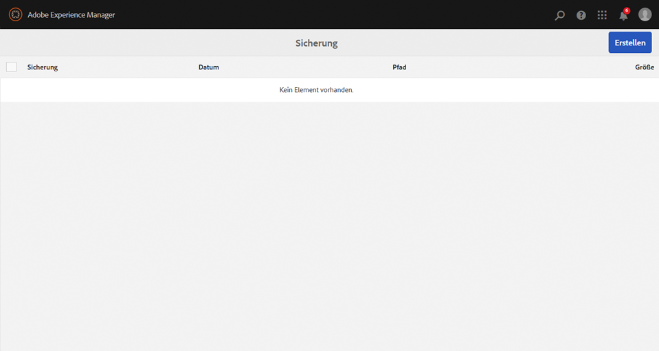
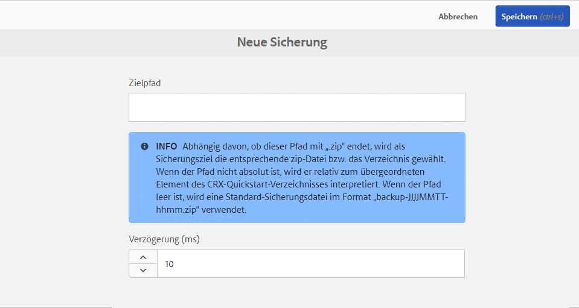
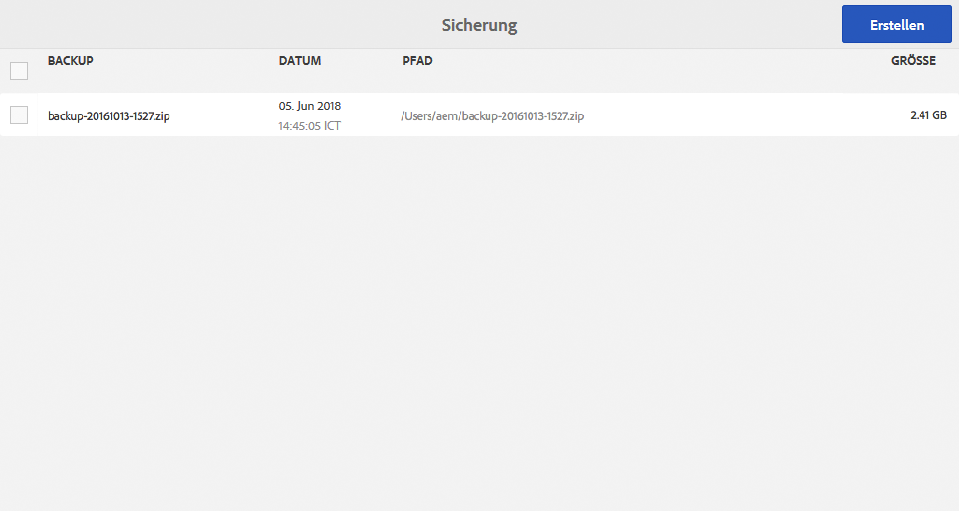

# Sichern und Wiederherstellen{#backup-and-restore}

Es gibt zwei Möglichkeiten, Repository-Inhalte in AEM zu sichern und wiederherzustellen:

* Sie können ein externes Backup des Repositorys erstellen und dieses an einem sicheren Ort speichern. Wenn das Repository abstürzt, können Sie den vorherigen Zustand des Repositorys wieder herstellen.
* Sie können interne Versionen der Repository-Inhalte erstellen. Diese Versionen werden zusammen mit den Inhalten im Repository gespeichert, sodass Sie Knoten und hierarchische Strukturen, die Sie gelöscht oder geändert haben, schnell wiederherstellen können.

## Allgemein {#general}

Der hier beschriebene Ansatz bezieht sich auf die Sicherung und Wiederherstellung des gesamten Systems.

Falls Sie einen kleineren Teil der Inhalte sichern und/oder wiederherstellen müssen, der verloren gegangen ist, ist nicht unbedingt eine Wiederherstellung des Systems erforderlich:

* Sie können die Daten entweder von einem anderen Systems aus in Form eines Pakets abrufen
* oder das Backup auf einem temporären System wiederherstellen, ein Inhaltspaket erstellen und dieses auf dem System bereitstellen, auf dem dieser Inhalt fehlt.

Weitere Informationen finden Sie im nachfolgenden Abschnitt [Paket-Backup](/help/sites-administering/backup-and-restore.md#package-backup).

## Timing {#timing}

Führen Sie ein Backup nicht zeitgleich mit einer Datenspeicherbereinigung durch, da dies die Ergebnisse beider Prozesse beeinträchtigen kann.

## Offline-Backup {#offline-backup}

Sie können immer ein Offline-Backup durchführen. Dafür müssen Sie AEM stoppen. Dies kann aber hinsichtlich der benötigten Zeit im Vergleich zu einem Online-Backup effizienter sein.

In den meisten Fällen erstellen Sie mithilfe eines Dateisystem-Snapshots eine schreibgeschützte Kopie der zu dem Zeitpunkt gespeicherten Inhalte. Führen Sie folgende Schritte zum Erstellen eines Offline-Backups aus:

* Stoppen Sie die Anwendung.
* Erstellen Sie ein Snapshot-Backup.
* Starten Sie die Anwendung.

Da das Snapshot-Backup normalerweise nur ein paar Sekunden dauert, ist die gesamte Ausfallzeit nicht länger als ein paar Minuten.

## Online-Backup  {#online-backup}

Bei dieser Backup-Methode erstellen Sie ein Backup vom gesamten Repository, einschließlich aller darunter bereitgestellten Anwendungen wie beispielsweise AEM. Das Backup enthält die Inhalte, den Versionsverlauf, die Konfiguration, die Software, Hotfixes, benutzerdefinierte Anwendungen, Protokolldateien, Suchindizes usw. Falls Sie die Clustering-Option verwenden oder der freigegebene Ordner ein Unterverzeichnis von `crx-quickstart` ist (entweder physikalisch oder per Softlink), wird das freigegebene Verzeichnis ebenfalls gesichert.

Sie können das gesamte Repository (und alle Anwendungen) zu einem späteren Zeitpunkt wiederherstellen.

Bei dieser Methode wird ein „Hot“- oder „Online“-Backup durchgeführt, d. h. das Backup wird durchgeführt, während das Repository läuft. So kann das Repository während des Backups verwendet werden. Diese Methode kann bei standardmäßigen, TAR-basierten Repository-Instanzen verwendet werden.

Bei der Erstellung eines Backups haben Sie die folgenden Möglichkeiten:

* Backup in einem Verzeichnis mithilfe des integrierten AEM-Backup-Tools
* Backup in einem Verzeichnis mithilfe eines Dateisystem-Snapshots

In jedem Fall wird während des Backups ein Image (oder Snapshot) des Repositorys erstellt. Anschließend sollte der Backup-Agent des Systems dafür Sorge tragen, dass dieses Image an ein dediziertes Backup-System (Bandlaufwerk) übermittelt wird.

>[!NOTE]
>
>Wenn AEM Online-Backup-Funktion auf einer AEM-Instanz mit einer benutzerdefinierten Blobstore-Konfiguration verwendet wird, wird empfohlen, den Pfad des Datenspeichers so zu konfigurieren, dass er sich außerhalb des Ordners &quot;`crx-quickstart`&quot;befindet, und den Datenspeicher separat zu sichern.

>[!CAUTION]
>
>Bei dem Online-Backup wird nur das Dateisystem gesichert. Wenn Sie die Repository-Inhalte und/oder die Repository-Dateien in einer Datenbank speichern, muss diese Datenbank separat gesichert werden. Falls Sie AEM mit MongoDB verwenden, lesen Sie die Dokumentation zur Verwendung der [nativen Backup-Tools von MongoDB](https://docs.mongodb.org/manual/tutorial/backup-with-mongodump/).

### AEM Online Backup  {#aem-online-backup}

Mithilfe eines Online-Backups von Ihrem Repository können Sie Backup-Dateien erstellen, herunterladen und löschen. Dies ist eine „Hot“- oder „Online“-Backup-Funktion, d. h. sie kann während der normalen Verwendung des Repositorys im Lese-/Schreibmodus ausgeführt werden.

>[!CAUTION]
>
>Führen Sie AEM Online-Backup nicht gleichzeitig mit [Datastore Garbage Collection](/help/sites-administering/data-store-garbage-collection.md) oder [Revisionsbereinigung](/help/sites-deploying/revision-cleanup.md#how-to-run-offline-revision-cleanup) aus. Dies beeinträchtigt die Systemleistung.

Zu Beginn eines Backups können Sie den **Zielpfad** und/oder eine **Verzögerung** festlegen.

**Ziel-** PfadDie Backup-Dateien werden normalerweise im übergeordneten Ordner des Ordners gespeichert, der die JAR-Schnellstartdatei (.jar) enthält. Wenn sich die AEM-JAR-Datei beispielsweise im Ordner /InstallationKits/AEM befindet, wird das Backup im Ordner /InstallationKits generiert. Sie können auch ein Ziel an einem Speicherort Ihrer Wahl angeben.

Wenn unter **Zielpfad** ein Verzeichnis angegeben wird, wird das Image des Repositorys in diesem Verzeichnis erstellt. Falls dasselbe Verzeichnis mehrmals (oder immer) zum Speichern von Backups verwendet wird,

* werden die geänderten Dateien im Repository entsprechend unter dem Zielpfad geändert;
* werden gelöschte Dateien im Repository unter dem Zielpfad gelöscht;
* werden erstellte Dateien im Repository unter dem Zielpfad erstellt.

>[!NOTE]
>
>Wenn Sie für **Zielpfad** einen Dateinamen mit der Erweiterung **.zip** angeben, wird das Repository in einem temporären Verzeichnis gesichert. Die Inhalte dieses temporären Verzeichnisses werden dann komprimiert und in der ZIP-Datei gespeichert.
>
>Von dieser Vorgehensweise wird jedoch abgeraten, da
>
>* sie weiteren Festplatten-Speicherplatz während des Backup-Prozesses erfordert (für das temporäre Verzeichnis und die ZIP-Datei);
>* der Komprimierungsprozess vom Repository ausgeführt, sodass möglicherweise die Leistung beeinträchtigt wird;
>* es zu einer Verzögerung des Backup-Prozesses kommt;
>* Java bis zur Java-Version 1.6 nur in der Lage ist, ZIP-Dateien bis zu einer Größe von 4 GB zu erstellen.

>
>
Wenn Sie eine ZIP-Datei als Backup-Format erstellen müssen, sollten Sie eine Sicherung in einem Verzeichnis vornehmen und dann ein Komprimierungsprogramm verwenden, um die ZIP-Datei zu erstellen.

**** DelayGibt eine Zeitverzögerung (in Millisekunden) an, sodass die Repository-Leistung nicht beeinträchtigt wird. Standardmäßig wird das Repository-Backup mit voller Geschwindigkeit ausgeführt. Sie können die Geschwindigkeit der Erstellung eines Online-Backups verringern, sodass das Backup nicht dazu führt, dass andere Aufgaben langsamer ausgeführt werden.

Achten Sie bei der Festlegung einer sehr großen Verzögerung darauf, dass das Online-Backup nicht länger als 24 Stunden dauert. Andernfalls verwerfen Sie dieses Backup, da es möglicherweise nicht alle Binärdateien enthält.
 Eine Verzögerung von 1 ms führt in der Regel zu einer 10%igen CPU-Auslastung und eine Verzögerung von 10 ms führt normalerweise zu einer CPU-Auslastung von weniger als 3 %. Die Gesamtverzögerung in Sekunden können Sie wie folgt schätzen: die Repository-Größe (in MB) multipliziert mit der Verzögerung in ms geteilt durch 2 (wenn die ZIP-Option verwendet wird) bzw. geteilt durch 4 (wenn das Backup in einem Verzeichnis gespeichert wird). Das bedeutet, dass sich die Backup-Zeit durch ein Backup eines 200 MB großen Repositorys in einem Verzeichnis bei einer Verzögerung von 1 ms um 50 Sekunden erhöht.

>[!NOTE]
>
>Interne Details zu dem Prozess finden Sie in [Funktionsweise von AEM Online Backup](#how-aem-online-backup-works).

So erstellen Sie ein Backup:

1. Melden Sie sich bei AEM als Administrator an.

1. Wechseln Sie zu **Tools - Vorgänge - Backup.**.
1. Klicken Sie auf **Erstellen**. Die Backup-Konsole wird geöffnet.

   

1. Legen sie in der Backup-Konsole den **[Zielpfad](#aem-online-backup)** und die **[Verzögerung](#aem-online-backup)** fest.

   

   >[!NOTE]
   >
   >Die Backup-Konsole ist auch verfügbar unter:
   >
   >
   >` https://<*hostname*>:<*port-number*>/libs/granite/backup/content/admin.html`

1. Klicken Sie auf **Speichern**. Daraufhin wird eine Fortschrittsleiste eingeblendet, die den Fortschritt des Backups anzeigt.

   >[!NOTE]
   >
   >Sie können ein Backup jederzeit **abbrechen**.

1. Wenn das Backup abgeschlossen ist, werden die ZIP-Dateien im Backup-Fenster aufgeführt.

   

   >[!NOTE]
   >
   >Backup-Dateien, die nicht länger erforderlich sind, können über die Konsole entfernt werden. Wählen Sie die Backup-Datei im linken Bereich aus und klicken Sie dann auf **Löschen**.

   >[!NOTE]
   >
   >Wenn Sie ein Backup in ein Verzeichnis durchgeführt haben und der Backup-Prozess abgeschlossen ist, wird AEM nicht in das Zielverzeichnis schreiben.

### Automatisches AEM Online Backup  {#automating-aem-online-backup}

Sofern dies möglich ist, sollte ein Online-Backup bei geringer Auslastung des Systems (zum Beispiel morgens) durchgeführt werden.

Backups können mit den HTTP-Clients `wget` oder `curl` automatisiert werden. Nachfolgend sehen Sie einige Beispiele, wie ein Backup mithilfe von „curl“ automatisiert werden kann.

#### Sichern im Standard-Zielverzeichnis  {#backing-up-to-the-default-target-directory}

>[!CAUTION]
>
>Im folgenden Beispiel müssen möglicherweise verschiedene Parameter im Befehl `curl` für Ihre Instanz konfiguriert werden. Beispiel: Hostname ( `localhost`), Port ( `4502`), Administratorkennwort ( `xyz`) und Dateiname ( `backup.zip`).

```shell
curl -u admin:admin -X POST http://localhost:4502/system/console/jmx/com.adobe.granite:type=Repository/op/startBackup/java.lang.String?target=backup.zip
```

Die Backup-Datei bzw. das Backup-Verzeichnis wird auf dem Server im übergeordneten Ordner des Ordners erstellt, der den `crx-quickstart`-Ordner enthält (genauso wie beim Erstellen des Backups mithilfe eines Browsers). Wenn Sie beispielsweise AEM im Verzeichnis `/InstallationKits/crx-quickstart/` installiert haben, wird die Sicherung im Verzeichnis `/InstallationKits` erstellt.

Der „curl“-Befehl wird sofort zurückgegeben. Daher müssen Sie dieses Verzeichnis überwachen, um zu sehen, wann die ZIP-Datei fertig ist. Während der Erstellung des Backups wird ein temporäres Verzeichnis (dessen Name auf dem der fertigen ZIP-Datei basiert) angezeigt, das am Ende in einer ZIP-Datei komprimiert wird. Beispiel:

* `backup.zip`Name der resultierenden ZIP-Datei: 
* Name des temporären Ordners: `backup.f4d5.temp`

#### Sichern in einem anderen als dem Standard-Zielverzeichnis {#backing-up-to-a-non-default-target-directory}

Normalerweise wird die Backup-Datei bzw. das Verzeichnis auf dem Server im übergeordneten Ordner des Ordners erstellt, der den `crx-quickstart`-Ordner enthält.

Wenn Sie Ihre Sicherung (von beiden Sorten) an einem anderen Speicherort speichern möchten, können Sie einen absoluten Pfad auf den Parameter `target` im Befehl `curl` festlegen.

So generieren Sie beispielsweise `backupJune.zip` im Verzeichnis `/Backups/2012`:

```shell
curl -u admin:admin -X POST http://localhost:4502/system/console/jmx/com.adobe.granite:type=Repository/op/startBackup/java.lang.String?target=/Backups/2012/backupJune.zip"
```

>[!CAUTION]
>
>Wenn Sie einen anderen Anwendungsserver (wie JBoss) verwenden, wird das Online-Backup möglicherweise nicht wie erwartet ausgeführt, da das Zielverzeichnis schreibgeschützt ist. Kontaktieren Sie in diesem Fall den Support.

>[!NOTE]
>
>Ein Backup kann auch [mithilfe von MBeans, die von AEM bereitgestellt werden, ausgelöst werden](/help/sites-administering/jmx-console.md).

### Backup mittels Dateisystem-Snapshot  {#filesystem-snapshot-backup}

Der hier beschriebene Prozess ist besonders für große Repositorys geeignet.

>[!NOTE]
>
>Wenn Sie diesen Backup-Ansatz verwenden wollen, muss Ihr System Dateisystem-Snapshots unterstützen. Für Linux bedeutet dies beispielsweise, dass Ihre Dateisysteme auf einem logischen Volume platziert werden sollten.

1. Erstellen Sie einen Schnappschuss des Dateisystems, in dem AEM bereitgestellt wird.

1. Mounten Sie den Dateisystem-Snapshot.
1. Führen Sie ein Backup aus und unmounten Sie den Snapshot.

### Funktionsweise von AEM Online Backup  {#how-aem-online-backup-works}

AEM Online Backup umfasst eine Reihe von internen Aktionen, die die Integrität der zu sichernden Daten und der zu erstellenden Backup-Datei(en) gewährleisten. Diese sind für diejenigen, die daran interessiert sind, nachfolgend aufgeführt.

Für das Online-Backup wird der folgende Algorithmus verwendet:

1. Wenn Sie eine ZIP-Datei erstellen, ist der erste Schritt die Erstellung oder Lokalisierung des Zielverzeichnisses.

   * Beim Sichern in eine ZIP-Datei wird ein temporäres Verzeichnis erstellt. Der Verzeichnisname beginnt mit `backup.` und endet mit `.temp`. zum Beispiel `backup.f4d3.temp`.
   * Beim Sichern in ein Verzeichnis wird der im Zielpfad festgelegte Name verwendet. Ein vorhandenes Verzeichnis kann verwendet werden, andernfalls wird ein neues Verzeichnis erstellt.

      Es wird eine leere Datei mit dem Namen `backupInProgress.txt` im Zielverzeichnis erstellt, wenn das Backup gestartet wird. Diese Datei wird gelöscht, sobald das Backup abgeschlossen ist.

1. Die Dateien werden aus dem Quellverzeichnis in das Zielverzeichnis (oder das temporäre Verzeichnis, wenn eine Zip-Datei erstellt wird) kopiert. Der Segmentspeicher wird vor dem Datenspeicher kopiert, um eine Beschädigung des Repositorys zu vermeiden. Der Index und die Zwischenspeicherdaten werden bei der Erstellung des Backups ausgelassen. Daher sind Daten von `crx-quickstart/repository/cache` und `crx-quickstart/repository/index` nicht in der Sicherung enthalten. Der Fortschrittsleistenindikator des Prozesses liegt zwischen 0 % - 70 % beim Erstellen einer ZIP-Datei oder 0 % - 100 %, wenn keine ZIP-Datei erstellt wird.

1. Falls das Backup in einem vorab vorhandenen Verzeichnis erstellt wird, werden die „alten“ Dateien im Zielverzeichnis gelöscht. Alte Dateien sind Dateien, die im Quellverzeichnis nicht vorhanden sind.

Das Kopieren der Dateien in das Zielverzeichnis lässt sich in vier Phasen unterteilen:

1. In der ersten Kopierphase (Fortschrittsanzeige 0 % bis 63 %, wenn eine ZIP-Datei erstellt wird, oder 0 % bis 90 %, wenn keine ZIP-Datei erstellt wird) werden alle Dateien kopiert, während das Repository normal ausgeführt wird. Der Prozess umfasst zwei Phasen:

   * Phase A: Alles mit Ausnahme des Datenspeichers wird kopiert (mit Verzögerung).
   * Phase B: Nur der Datenspeicher wird kopiert (mit Verzögerung).

1. In der zweiten Kopierphase (Fortschrittsanzeige 63 % bis 65,8 %, wenn eine ZIP-Datei erstellt wird, oder 90 % bis 94 %, wenn keine ZIP-Datei erstellt wird) werden nur Dateien kopiert, die seit dem Start der ersten Kopierphase im Quellverzeichnis erstellt oder geändert wurden. Abhängig von der Aktivität des Repositorys kann dies bedeuten, dass gar keine Dateien bis hin zu einer signifikanten Anzahl an Dateien enthalten sind (da die erste Dateikopierphase in der Regel sehr viel Zeit in Anspruch nimmt). Der Kopierprozess entspricht dem der ersten Phase (Phase A und Phase B mit Verzögerung).
1. In der dritten Kopierphase (Fortschrittsanzeige 65,8 % bis 68,6 %, wenn eine ZIP-Datei erstellt wird, oder 94 % bis 98 %, wenn keine ZIP-Datei erstellt wird) werden nur Dateien kopiert, die seit dem Start der zweiten Kopierphase im Quellverzeichnis erstellt oder geändert wurden. Abhängig von der Aktivität des Repositorys kann dies bedeuten, dass gar keine Dateien oder nur sehr wenige Dateien zu kopieren sind (da die zweite Dateikopierphase in der Regel sehr schnell abgeschlossen ist). Der Kopierprozess ähnelt der zweiten Phase - Phase A und Phase B, jedoch ohne Verzögerung.
1. Die Dateikopierphasen 1 bis 3 werden zeitgleich ausgeführt, während das Repository ausgeführt wird. Nur Dateien, die seit dem Start der dritten Kopierphase im Quellordner erstellt oder geändert wurden, werden kopiert. Abhängig von der Aktivität des Repositorys kann dies bedeuten, dass gar keine Dateien oder nur äußerst wenige Dateien zu kopieren sind (da die zweite Dateikopierphase in der Regel sehr schnell abgeschlossen ist). Die Fortschrittsanzeige zeigt 68,6 % bis 70 % an, wenn eine ZIP-Datei erstellt wird, oder 98 % bis 100 %, wenn keine ZIP-Datei erstellt wird. Der Kopierprozess entspricht der dritten Phase.
1. Abhängig vom Ziel:

   * Wenn eine ZIP-Datei festgelegt wurde, wird diese jetzt im temporären Verzeichnis erstellt. Fortschrittsanzeige 70 % bis 100 %. Das temporäre Verzeichnis wird dann gelöscht.
   * Handelt es sich bei dem Ziel um ein Verzeichnis, wird die leere Datei mit dem Namen `backupInProgress.txt` gelöscht, um anzuzeigen, dass das Backup abgeschlossen ist.

## Wiederherstellen von Backups {#restoring-the-backup}

Sie können ein Backup wie folgt wiederherstellen:

* Wenn Sie ein Backup mittels eines Dateisystem-Snapshots durchgeführt haben, können Sie einfach ein Image des Systems wiederherstellen.
* Falls Sie das Backup in Form einer ZIP-Datei erstellt haben, entpacken Sie einfach die Inhalte in einen neuen Ordner und starten Sie AEM von diesem Speicherort aus.

## Paket-Backup  {#package-backup}

Zum Sichern und Wiederherstellen von Inhalten können Sie einen der Package Manager verwenden, der das Inhaltspaket-Format zum Sichern und Wiederherstellen von Inhalten nutzt. Der Package Manager bietet mehr Flexibilität beim Definieren und Verwalten von Paketen.

Weitere Informationen zu den Funktionen und Austauschbeziehungen von jedem dieser einzelnen Inhaltspaketformate finden Sie in [Arbeiten mit Paketen](/help/sites-administering/package-manager.md).

### Backup-Umfang  {#scope-of-backup}

Wenn Sie Knoten entweder mit dem Package Manager oder dem Content Zipper sichern, speichert CRX die folgenden Informationen:

* Die Repository-Inhalte unterhalb der hierarchischen Struktur, die Sie ausgewählt haben
* Die Knotentyp-Definitionen, die für die zu sichernden Inhalte verwendet werden
* Die Namespace-Definitionen, die für die zu sichernden Inhalte verwendet werden

AEM verliert beim Sichern die folgenden Informationen:

* Der Versionsverlauf
