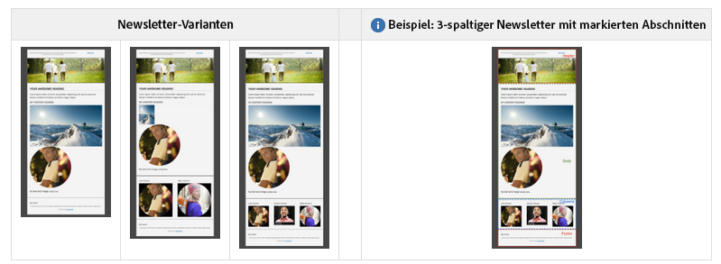

# Best Practices für E-Mail-Vorlagen {#best-practices-for-email-templates}

>[!CAUTION]
>
>Die AEM E-Mail-Komponenten wurden nicht mehr unterstützt. Aufgrund der Art der E-Mail, die Inhalt und Stil zusammenführt, werden die von AEM standardmäßig bereitgestellten E-Mail-Komponenten für Kunden nur eingeschränkt wiederverwendet, da benutzerdefinierte Stile in alle Komponenten implementiert werden müssen, die für Projekte erforderlich sind.
>
>E-Mail-Komponenten können auf Projektebene implementiert werden. Die veralteten AEM E-Mail-Komponenten veranschaulichen, wie dies erreicht werden kann. Diese veralteten Komponenten sollten jedoch nicht in Projekten verwendet werden.

Dieses Dokument beschreibt einige der Best Practices zum E-Mail-Design, die eine gut entwickelte E-Mail-Kampagnenvorlage ermöglichen.

Die in AEM verfügbare Demokampagne befolgt all diese Best Practices. Zu jeder Best Practice ist beschrieben, wie dieses Best Practices in der Demokampagne implementiert werden.

Verwenden Sie diese Best Practices bei der Erstellung Ihres eigenen Newsletters.

>[!NOTE]
>
>Der gesamte Inhalt der Kampagne sollte unter einer `master`-Seite des Typs `cq/personalization/components/ambitpage` erstellt werden.
>
>Wenn Ihre geplante Kampagne z. B. in etwa
>
>`/content/campaigns/teasers/en/campaign-promotion-global`
>
>Vergewissern Sie sich, dass sie sich unter einer `master`-Seite befindet.
>
>`/content/campaigns/teasers/master/en/campaign-promotion-global`

>[!NOTE]
>
>Beim Erstellen einer E-Mail-Vorlage für Adobe Campaign müssen Sie die Eigenschaft **acMapping** mit dem Wert **mapRecipient** in den **jcr:content**-Knoten der Vorlage einschließen, oder Sie können die Vorlage für das Adobe Campaign nicht in **Seiteneigenschaften** von AEM (deaktiviert ist) auswählen ).

## Vorlage/Seitenkomponente {#template-page-component}

***/libs/mcm/campaign/components/campaign_newsletterpage***

<table>
 <tbody>
  <tr>
   <td><strong>Best Practice</strong></td>
   <td><strong>Implementierung</strong></td>
  </tr>
  <tr>
   <td>
Geben Sie den Dokument-Typ an, um eine einheitliche Darstellung sicherzustellen.
 
hinzufügen DOCTYPE am Anfang (HTML oder XHTML)
 </td>
   <td>
Ist konfigurierbar durch Änderung der Eigenschaft <i>cq:doctype</i> in<i>"/etc/designs/default/jcr:content/Kampagne_newsletterpage"</i>
 
Die Standardeinstellung ist "XHTML":
 
&lt;!DOCTYPE html PUBLIC "-//W3C//DTD XHTML 1.0 Transitional//EN" "https://www.w3.org/TR/xhtml1/DTD/xhtml1-transitional.dtd"&gt;
 
Kann in "HTML_5"geändert werden:
 
&lt;!DOCTYPE HTML&gt;
 </td>
  </tr>
  <tr>
   <td>
Geben Sie die Zeichendefinition an, um die korrekte Darstellung von Sonderzeichen sicherzustellen.
 
hinzufügen CHARSET-Erklärung (z. B. iso-8859-15, UTF-8) bis
 </td>
   <td>
Ist auf UTF-8 eingestellt.
 
&lt;meta http-equiv="content-type" content="text/html; charset=UTF-8"&gt;
 </td>
  </tr>
  <tr>
   <td>
Code der gesamten Struktur mit dem Element &lt;table&gt;erstellen. Bei komplizierteren Layouts sollten Sie Tabellen zur Erstellung komplexer Strukturen verschachteln.
 
E-Mail sollte auch ohne CSS gut aussehen.
 </td>
   <td>
Tabellen werden in der gesamten Vorlage zur Strukturierung von Inhalten verwendet. Aktuell werden maximal vier verschachtelte Tabellen (1 Basistabelle + max. 3 Verschachtelungsebenen)
 
&lt;div&gt; -Tags werden nur im Autorenmodus verwendet, um eine ordnungsgemäße Komponentenbearbeitung sicherzustellen.
 </td>
  </tr>
  <tr>
   <td>Verwenden Sie Elementattribute (z. B. Zellauffüllung, Bewertung und Breite), um Tabellendimensionen festzulegen. Dies erzwingt eine Verschachtelungsmodellstruktur.</td>
   <td>
Alle Tabellen enthalten die erforderlichen Attribute wie <i>border</i>, <i>cellpadding</i>, <i>cellspaces</i> und <i>width</i>.
 
Um die Elementpositionierung innerhalb von Tabellen zu harmonisieren, wird für alle Tabellenzellen das Attribut <i>value="top"</i> festgelegt.
 </td>
  </tr>
  <tr>
   <td>
Berücksichtigen Sie nach Möglichkeit die mobile Freundlichkeit. Verwenden Sie Medienabfragen zur Erhöhung der Textgrößen auf kleinen Bildschirmen und stellen Sie zu Links Trefferbereiche im Miniaturformat bereit.
 
Erstellen Sie falls möglich ein responsives E-Mail-Design.
 </td>
   <td>Sofern CSS-Stile zum Illustrieren des Demodesigns verwendet werden, werden Medienabfragen für die Bereitstellung einer mobilfreundlichen Version verwendet.</td>
  </tr>
  <tr>
   <td>Inline-CSS ist besser, als alle CSS in den Anfang zu stellen.</td>
   <td>
Um die zugrunde liegende HTML-Struktur besser zu demonstrieren und die Möglichkeit zur Anpassung der Newsletterstruktur zu erleichtern, erfolgen nur einige CSS-Definitionen inline.
 
Basisstile und Vorlagenvarianten wurden in einen Stylesheet im Abschnitt &lt;head&gt; der Seite extrahiert. Bei der finalen Übermittlung des Newsletters sollten diese CSS-Definitionen inline in HTML vorhanden sein. Ein automatischer Inlining-Mechanismus ist geplant, aktuell jedoch noch nicht verfügbar.
 </td>
  </tr>
  <tr>
   <td>Halten Sie Ihre CSS einfach. Vermeiden Sie zusammengesetzte Stildeklarationen, Kompaktcode, CSS-Layouteigenschaften, komplexe Selektoren und Pseudoelemente.</td>
   <td>Bei der Verwendung von CSS-Stilen zur Illustration des Demodesigns werden die CSS-Empfehlungen befolgt.</td>
  </tr>
  <tr>
   <td>E-Mails sollten maximal 600-800 Pixel breit sein. Dies sorgt dafür, dass diese in der von vielen Clients bereitgestellten Vorschaufenstergröße besser funktionieren.</td>
   <td>Die Inhaltstabelle <i>width</i> ist im Demodesign auf 600 px beschränkt.</td>
  </tr>
 </tbody>
</table>

### Bilder {#images}

/libs/mcm/campaign/components/image

| **Best Practice** | **Implementierung** |
|---|---|
| hinzufügen *Alt*-Attribute zu Bildern | Das *alt*-Attribut wurde für die Bildkomponente als obligatorisch definiert. |
| Verwenden Sie für Bilder das Format *jpg* anstelle des Formats *png* | Bilder werden immer als JPG von der Bildkomponente bereitgestellt. |
| Verwenden Sie das Element `` anstelle von Hintergrundbildern in einer Tabelle. | In den Vorlagen werden keine Hintergrundbilddaten verwendet. |
| hinzufügen attribute style=&quot;display block&quot; auf Bildern. Dies ermöglicht eine gute Anzeige in Gmail. | Alle Bilder enthalten standardmäßig das Attribut *style=&quot;display block&quot;*. |

### Text und Links {#text-and-links}

/libs/mcm/campaign/components/heading, /libs/mcm/campaign/components/textimage

<table>
 <tbody>
  <tr>
   <td><strong>Best Practice</strong></td>
   <td><strong>Implementierung</strong></td>
  </tr>
  <tr>
   <td>Verwenden Sie html anstelle des Stils in CSS (font-family)</td>
   <td>Der RichTextEditor (z.B. in der Textimage-Komponente) unterstützt jetzt die Auswahl und Anwendung von Schriftfamilien und Schriftgrößen auf ausgewählte Texte. Sie werden als &lt;font&gt;-Tags gerendert.</td>
  </tr>
  <tr>
   <td>Verwenden Sie einfache, plattformübergreifende Schriftarten wie <i>Arial, Verdana, Georgia</i> und <i>Times New Roman</i>.</td>
   <td>
Hängt vom Entwurf des Newsletters ab.
 
Für das Demo-Design wird die Schrift "Helvetica" verwendet, aber wird auf generische sans-serif Schrift zurückfallen, wenn nicht vorhanden.
 </td>
  </tr>
 </tbody>
</table>

### Generisch {#generic}

| **Best Practice** | **Implementierung** |
|---|---|
| Verwenden Sie den W3C-Validator, um den HTML-Code zu korrigieren. Stellen Sie sicher, dass alle offenen Tags ordnungsgemäß geschlossen werden. | Code wurde validiert. Bei XHTML-Übergangsdokumenten fehlt nur das fehlende xmlns-Attribut für das `<html>`-Element. |
| Machen Sie sich keine Gedanken mit JavaScript oder Flash - diese Technologien werden von E-Mail-Clients weitgehend nicht unterstützt. | In der Newslettervorlage werden weder JavaScript noch Flash verwendet. |
| hinzufügen einer Nur-Text-Version für mehrteilige Versand. | Es wurde ein neues Widget in die Seiteneigenschaften integriert, mit dem im Handumdrehen eine Nur-Text-Version aus den Seiteninhalten extrahiert werden kann. Dies kann als Ausgangspunkt für die finale Nur-Text-Version verwendet werden. |

## Kampagnen-Newsletter – Vorlagen und Beispiele {#campaign-newsletter-templates-and-examples}

AEM bietet Ihnen standardmäßig mehrere Vorlagen und Komponenten zur Erstellung von Kampagnen-Newslettern. Sie können diese Vorlagen und Komponenten zur Erstellung Ihrer benutzerdefinierten Newsletter verwenden.

### Vorlagen {#templates}

Um eine solide Grundlage zu schaffen und die Vielfalt der Möglichkeiten für den Inhaltsfluss zu erweitern, stehen standardmäßig drei leicht voneinander abweichende Vorlagentypen zur Verfügung. Sie können diese einfach zum Erstellen eines benutzerspezifischen Newsletters verwenden.

Alle haben einen Abschnitt **header**, eine **Fußzeile** und einen Abschnitt **body**. Unter dem Hauptabschnitt unterscheidet sich jede Vorlage in **Spaltendesign** (1, 2 oder 3 Spalten).

### Komponenten {#components}

Es stehen aktuell [sieben Komponenten zur Verfügung, die innerhalb von Kampagnenvorlagen verwendet werden können](/help/sites-authoring/adobe-campaign-components.md). Diese Komponenten basieren alle auf der Adobe-Markup-Sprache **HTL**.

| **Komponentenname** | **Komponentenpfad** |
|---|---|
| Überschrift | /libs/mcm/Kampagne/components/heading |
| Bild | /libs/mcm/Kampagne/components/image |
| Text und Personalisierung | /libs/mcm/Kampagne/components/personalization |
| Textimage | /libs/mcm/Kampagne/components/textimage |
| Verknüpfung | /libs/mcm/Kampagne/components/reference |
| Dynamic Media Classic (früher Scene7)-Bildvorlage | /libs/mcm/Kampagne/s7image |
| Targeting-Referenz | /libs/mcm/Kampagne/components/reference |

>[!NOTE]
>
>Diese Komponenten sind für Mail-Inhalte optimiert, d. h. sie befolgen die in diesem Dokument beschriebenen Best Practices. Die Verwendung standardmäßiger Komponenten verstößt in der Regel gegen diese Regeln.

Diese Komponenten sind unter [Adobe Campaign-Komponenten](/help/sites-authoring/adobe-campaign-components.md) detailliert beschrieben.