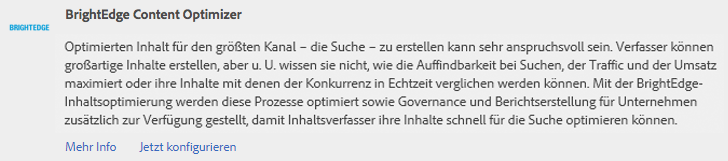
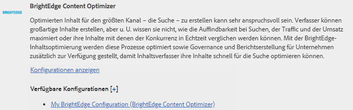
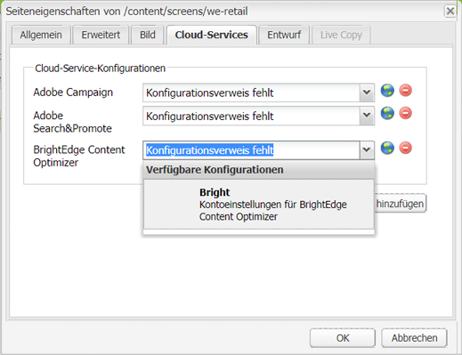
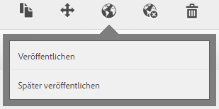
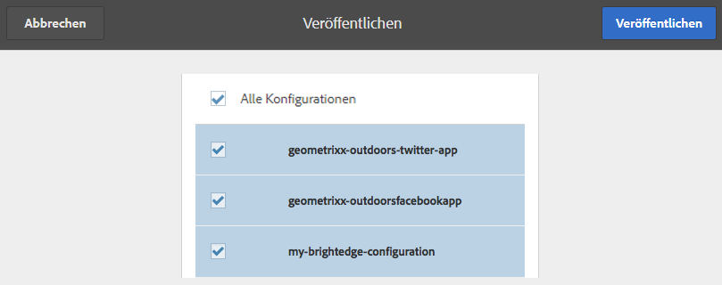

# Integration mit BrightEdge Content Optimizer{#integrating-with-brightedge-content-optimizer}

Erstellen Sie eine BrightEdge-Cloudkonfiguration, sodass AEM mit den Anmeldedaten Ihres BrightEdge-Kontos eine Verbindung herstellen kann. Sie können mehrere Konfigurationen erstellen, wenn Sie mehrere Konten nutzen.

Wenn Sie die Konfiguration erstellen, geben Sie einen Titel ein. Der Titel sollte aussagekräftig sein, sodass die Konfiguration mit dem BrightEdge-Konto in Verbindung gebracht werden kann. Wenn ein Seitenautor oder -administrator eine Webseite mit dem BrightEdge-Konto verknüpft, wird dieser Titel in einer Dropdown-Liste angezeigt.

1. Klicken Sie in der Leiste auf „Tools“ > „Vorgänge“ > „Cloud“ > „Cloud-Services“.
1. Klicken Sie auf den Link, der im Bereich „BrightEdge Content Optimizer“ angezeigt wird. Der Linktext richtet sich danach, ob eine BrightEdge-Konfiguration erstellt wurde oder nicht:

   * „Jetzt konfigurieren“: Dieser Link wird angezeigt, wenn keine Konfiguration erstellt wurde.
   * „Konfigurationen anzeigen“: Dieser Link wird angezeigt, wenn mindestens eine Konfiguration erstellt wurde.

   

1. Wenn Sie auf „Konfigurationen anzeigen“ geklickt haben, klicken Sie auf den Link mit dem Pluszeichen (+) neben „Verfügbare Konfigurationen“.
1. Geben Sie einen Titel für die Konfiguration ein. Optional können Sie einen Namen für den Knoten eingeben, mit dem die Konfiguration im Repository gespeichert wird. Klicken Sie auf Erstellen.
1. Geben Sie im Dialogfeld „BrightEdge Content Optimizer-Konfiguration“ den Benutzernamen und das Kennwort des BrightEdge-Kontos ein und klicken Sie dann auf „OK“.

## Bearbeiten einer BrightEdge-Konfiguration  {#editing-a-brightedge-configuration}

Ändern Sie bei Bedarf den Benutzernamen und das Kennwort einer BrightEdge-Konfiguration. Die Änderungen wirken sich auf alle Seiten aus, die die Konfiguration verwenden.

1. Klicken Sie in der Leiste auf „Tools“ > „Vorgänge“ > „Cloud“ > „Cloud-Services“.
1. Klicken Sie im Bereich „BrightEdge Content Optimizer“ auf „Konfigurationen anzeigen“.

   

1. Klicken Sie auf den Namen der Konfiguration, die Sie bearbeiten möchten.
1. Klicken Sie auf „Bearbeiten“, bearbeiten Sie die Eigenschaftswerte und klicken Sie anschließend auf „OK“.

## Verknüpfen von Seiten mit einer BrightEdge-Konfiguration  {#associating-pages-with-a-brightedge-configuration}

Verknüpfen Sie Seiten mit einer BrightEdge-Konfiguration, um Seitendaten zur Analyse an den BrightEdge-Service zu übermitteln. Wenn Sie eine Seite mit einer Konfiguration verknüpfen, erben die untergeordneten Seiten diese Verknüpfung. In der Regel wird die Startseite einer Website verknüpft, damit die Daten aller Seiten an BrightEdge übermittelt werden.

1. Öffnen Sie die klassische Websites-Konsole. ([http://localhost:4502/siteadmin#/content](http://localhost:4502/siteadmin#/content))
1. Wählen Sie im Websitebaum den Ordner oder die Seite aus, der bzw. die die Seite enthält, die Sie mit der BrightEdge-Konfiguration verknüpfen möchten.
1. Klicken Sie für die Konfiguration in der Liste der Seiten mit der rechten Maustaste auf die Seite und klicken Sie auf „Eigenschaften“.
1. Klicken Sie auf der Registerkarte „Cloud-Services“ auf die Schaltfläche „Service hinzufügen“. Wählen Sie im Dialogfeld „Cloud-Services“ die Option „BrightEdge Content Optimizer“ aus und klicken Sie anschließend auf „OK“.
1. Wählen Sie in der BrightEdge Content Optimizer-Liste die BrightEdge-Konfiguration aus, mit der Sie die Seite verknüpfen möchten, und klicken Sie dann auf „OK“.

   

## Aktivieren einer BrightEdge-Konfiguration {#activating-a-brightedge-configuration}

Aktivieren Sie eine BrightEdge-Konfiguration, um sie auf der Veröffentlichungsinstanz zu replizieren und es veröffentlichten Seiten zu ermöglichen, mit dem BrightEdge-Service zu interagieren.

1. Klicken Sie in der Leiste auf „Sites“ und suchen und wählen Sie dann die Seite aus, die Sie mit der BrightEdge-Konfiguration verknüpft haben.
1. Klicken oder tippen Sie auf das Symbol „Veröffentlichen“ und anschließend auf „Veröffentlichen“.

   

1. Überprüfen Sie, ob in der angezeigten Liste der Konfigurationen Ihre BrightEdge-Konfiguration ausgewählt ist, und klicken Sie dann auf „Veröffentlichen“.

   
