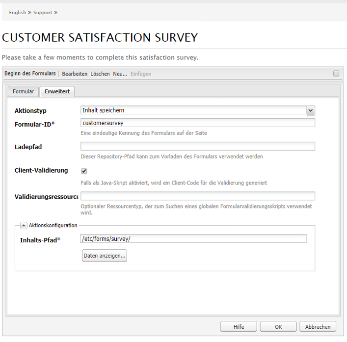
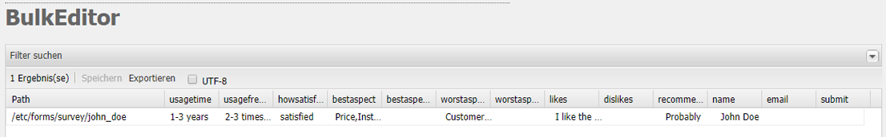
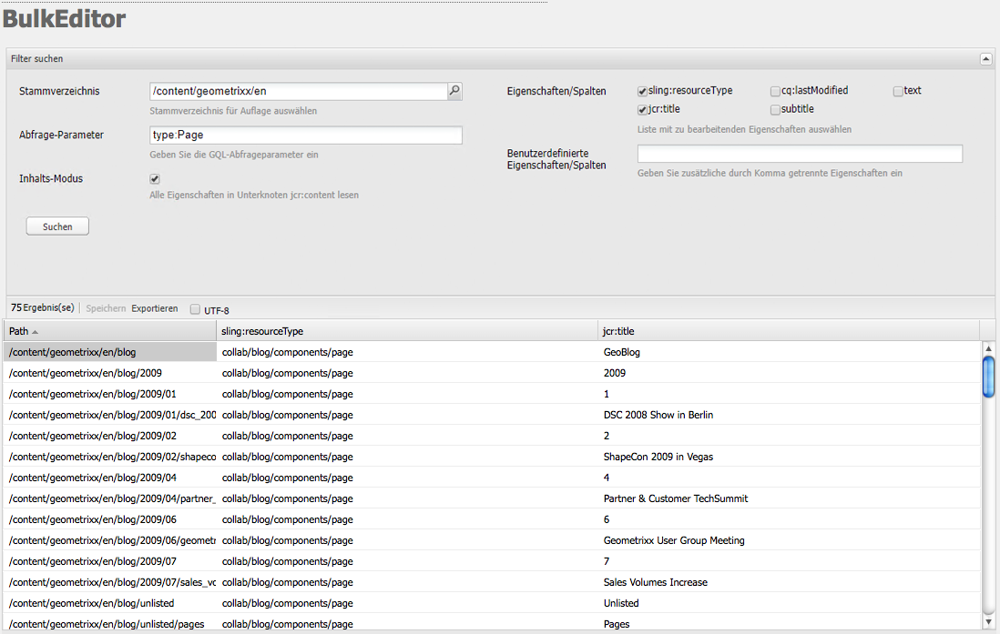
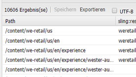

# Der Bulk Editor{#the-bulk-editor}

Der Bulk Editor ermöglicht eine äußerst effiziente Bearbeitung, wenn der visuelle Seitenkontext nicht benötigt wird. Sie können damit:

* Inhalte von mehreren Seiten suchen (und anzeigen); dazu wird GQL (Google Query Language) genutzt
* diese Inhalte direkt im Bulk Editor bearbeiten
* die Änderungen speichern (in den Originalseiten)
* diese Inhalte in eine TSV-Datei exportieren

>[!NOTE]
>
>Sie können auch Inhalte in das Repository importieren. Standardmäßig ist diese Option für den Bulk Editor aber deaktiviert, der in der **Tools-Konsole** verfügbar ist.

In diesem Abschnitt wird erläutert, wie Sie mit dem Bulk Editor in der **Tools-Konsole** arbeiten. Typischerweise nutzen Administratoren den Bulk Editor, um mehrere Elemente zu suchen und zu bearbeiten. Zu diesem Zweck füllen Sie die Tabelle mit einer GQL-Abfrage und der anschließenden Auswahl der zu bearbeitenden Inhaltselemente. Autoren nutzen den Bulk Editor in der Regel als Teil einer benutzerdefinierten Bulk-Editor-Anwendung, die über die [Produktlisten](/help/sites-authoring/default-components.md#productlist)-Komponente zugänglich ist.

>[!CAUTION]
>
>Da die [Unterstützung für die klassische Benutzeroberfläche in AEM 6.4 eingestellt wurde](/help/release-notes/deprecated-removed-features.md), wird auch der Bulk Editor nicht mehr unterstützt. Entsprechend plant Adobe keine weiteren Verbesserungen am Bulk Editor.

## Beispiel-Anwendungsfall für den Bulk Editor {#example-use-case-for-the-bulk-editor}

Wenn Sie beispielsweise alle Namen und E-Mail-Adressen von Benutzern benötigen, die an einer bestimmten Umfrage teilgenommen haben, stellt Ihnen der Bulk Editor diese Daten bereit und Sie können sie in eine Tabelle exportieren.

Ein Beispiel, das einen solchen Anwendungsfall veranschaulicht, ist auf der Geometrixx-Website enthalten:

1. Navigieren Sie zur Seite **Support** und dann zur Umfrage **Zufriedenheit mit dem Kundenservice**.
1. **Bearbeiten Sie** den Absatz **Beginn des Formulars**. Klicken Sie im Dialogfeld auf die Registerkarte **Erweitert**, erweitern Sie die **Aktionskonfiguration** und klicken Sie dann auf **Daten anzeigen...**.

   

1. Der Bulk Editor ist vollständig anpassbar, auch wenn in diesem Beispiel die Benutzer keine Inhalte bearbeiten, sondern nur die Daten in eine Tabelle exportieren können.

   

## Verwenden des Bulk Editors {#how-to-use-the-bulk-editor}

Mit dem Bulk Editor können Sie:

* [basierend auf Abfrageparametern nach Inhalten suchen, festgelegte Eigenschaften der Ergebnisse in Spalten anzeigen, diese Inhalte bearbeiten und die Änderungen speichern](#searching-and-editing-content)
* [diese Inhalte in eine tabulatorgetrennte Tabelle exportieren](#exporting-content)

* [Inhalte aus einer tabulatorgetrennten Tabelle importieren](#importing-content)

### Suchen und Bearbeiten von Inhalten {#searching-and-editing-content}

So bearbeiten Sie mit dem Bulk Editor mehrere Elemente gleichzeitig:

1. Klicken Sie in der **Tools-Konsole** auf den Ordner **Importtools**, um ihn zu erweitern.
1. Doppelklicken Sie auf den **Bulk Editor**, um ihn zu öffnen.
1. Geben Sie die Auswahlanforderungen ein:

<table>
 <tbody>
  <tr>
   <td>Feld</td>
   <td>Property</td>
  </tr>
  <tr>
   <td>Stammverzeichnis</td>
   <td>Gibt den Stammpfad an, den der Bulk Editor durchsucht.  Beispiel, <code>/content/geometrixx/en</code>. Der Bulk Editor durchsucht alle untergeordneten Knoten.</td>
  </tr>
  <tr>
   <td>Abfrage-Parameter</td>
   <td>Geben Sie mithilfe von GQL-Parametern die Suchzeichenfolge ein, nach der der Bulk Editor im Repository suchen soll. <code>type:Page</code> sucht beispielsweise nach allen Seiten im Stammverzeichnis, <code>text:professional</code> sucht nach allen Seiten, die das Wort "professionell"enthalten, und <code>"jcr:title":English</code> sucht nach allen Seiten, die "Englisch"als Titel haben. Sie können nur nach Zeichenfolgen suchen.</td>
  </tr>
  <tr>
   <td>Kontrollkästchen "Inhaltsmodus"</td>
   <td>Aktivieren Sie dieses Kontrollkästchen, um Eigenschaften im Unterknoten <code>jcr:content</code> der Suchergebnisse zu lesen, sofern vorhanden. Diese Option ist nur für Seiten nutzbar. Eigenschaftsnamen erhalten das Präfix <code>"jcr:content/"</code></td>
  </tr>
  <tr>
   <td>Eigenschaften/Spalten</td>
   <td>Aktivieren Sie die Kontrollkästchen für die Eigenschaften, die der Bulk Editor zurückgeben soll. Die ausgewählten Eigenschaften stellen die Spaltenüberschriften im Ergebnisbereich dar. Standardmäßig wird der Knotenpfad in den Ergebnissen angezeigt.</td>
  </tr>
  <tr>
   <td>Benutzerdefinierte Eigenschaften/Spalten</td>
   <td>Geben Sie alle anderen Eigenschaften ein, die nicht im Feld <strong>Eigenschaften/Spalten</strong> aufgeführt sind. Diese benutzerdefinierten Eigenschaften werden im Ergebnisbereich angezeigt. Sie können mehrere Eigenschaften hinzufügen, indem Sie sie mit Kommas voneinander trennen. <i>Hinweis:</i> Wenn Sie eine benutzerdefinierte Eigenschaft hinzufügen, die noch nicht vorhanden ist, zeigt AEM WCM eine leere Zelle an. Wenn Sie die leere Zelle bearbeiten und speichern, wird die Eigenschaft zum Knoten hinzugefügt. Die neu erstellte Eigenschaft muss die Einschränkungen des Knotentyps und Eigenschafts-Namespaces einhalten.</td>
  </tr>
 </tbody>
</table>

Beispiel:

1. Klicken Sie auf **Suchen**. Der Bulk Editor zeigt die Suchergebnisse an.
Im Beispiel oben werden alle Seiten, die Ihren Suchkriterien entsprechen, zurückgegeben und in den geforderten Spalten angezeigt.

   

1. Um ggf. Änderungen vorzunehmen, doppelklicken Sie in eine Zelle.

   

1. Klicken Sie auf **Speichern**, um die Änderungen zu speichern. (Die Schaltfläche **Speichern** wird aktiviert, sobald Sie eine Zelle bearbeitet haben).

   >[!CAUTION]
   >
   >Die hier vorgenommenen Änderungen werden in den Repository-Inhalt geschrieben, z. B. die Seite, auf die unter **Pfad** verwiesen wird.

#### Weitere GQL-Abfrageparameter {#additional-gql-query-parameters}

* **path:** sucht nur Knoten unter diesem Pfad. Wenn Sie mehr als einen Begriff mit einem Pfadpräfix festlegen, wird nur der letzte berücksichtigt.
* **type:** gibt nur Knoten der angegebenen Knotentypen zurück. Das schließt primäre und Mixin-Typen ein. Sie können mehrere Knotentypen durch Kommas voneinander getrennt festlegen. GQL gibt Knoten zurück, die einen der festgelegten Typen aufweisen.
* **order:** sortiert das Ergebnis nach den angegebenen Eigenschaften. Sie können mehrere Eigenschaftsnamen durch Kommas voneinander getrennt festlegen. Um das Ergebnis in absteigender Reihenfolge zu sortieren, stellen Sie dem Eigenschaftsnamen ein Minuszeichen voran. Beispiel: order:-name. Ein Pluszeichen gibt das Ergebnis in aufsteigender Reihenfolge zurück. Dies ist die Standardeinstellung.
* **limit:** begrenzt die Anzahl der Ergebnisse mithilfe eines Intervalls. Beispiel: limit:10..20 Bitte beachten Sie, dass das Intervall auf null basiert, der Beginn inklusiv ist und das Ende exklusiv ist. Sie können auch eine offene Intervallbegrenzung festlegen: limit:10.. oder limit:..20 Wenn die Punkte weggelassen werden und nur ein Wert angegeben ist, gibt GQL höchstens diese Anzahl an Ergebnissen zurück. Beispiel: limit:10 (gibt die ersten 10 Ergebnisse zurück)

### Exportieren von Inhalten {#exporting-content}

Möglicherweise müssen Sie Inhalte exportieren und in einer Excel-Tabelle bearbeiten. Beispielsweise möchten Sie vielleicht eine Mailing-Liste exportieren und die Vorwahl aller aufgeführten Telefonnummern direkt in Excel ändern, zusätzliche Zeilen hinzufügen usw.

So exportieren Sie Inhalte:

1. Suchen Sie wie unter [Suchen und Bearbeiten von Inhalten](#searching-and-editing-content) erläutert nach Inhalten.
1. Klicken Sie auf **Exportieren**, um die Änderungen in eine tabulatorgetrennte Excel-Tabelle zu exportieren. AEM WCM fragt Sie, in welches Verzeichnis Sie die Datei herunterladen möchten.

   >[!NOTE]
   >
   >Standardmäßig sind die Änderungen in [Windows-1252](https://en.wikipedia.org/wiki/Windows-1252) (auch als CP-1252 bekannt) kodiert. Sie könnten UTF-8 auswählen, um die Änderungen in UTF-8 zu exportieren.

   

1. Wählen Sie den Speicherort aus und bestätigen Sie, dass Sie die Datei herunterladen möchten.
1. Nach dem Herunterladen können Sie die Datei in einem Tabellenprogramm öffnen, z. B. in Microsoft Excel. Das Tabellenprogramm importiert die Datei und wandelt sie in ein Tabellenprogramm um.

   

### Importieren von Inhalten  {#importing-content}

Standardmäßig ist die Importfunktion ausgeblendet, wenn Sie den Bulk Editor öffnen. Wenn Sie den Parameter `hib=false` zur URL hinzufügen, wird die Schaltfläche **Importieren** auf der Bulk Editor-Seite angezeigt. Sie können Inhalte aus jeder tabulatorgetrennten Datei ( `.tsv`) importieren. Damit der Importvorgang ordnungsgemäß funktioniert, müssen die Spaltenüberschriften (die erste Reihe an Zellen) mit den Spaltenüberschriften der zu importierenden Tabelle übereinstimmen.

>[!NOTE]
>
>Wenn Sie Inhalte erneut importieren, löschen Sie alle vorherigen Inhalte dieser Knoten. Achten Sie darauf, keine wichtigen Daten zu überschreiben.

So importieren Sie Inhalte:

1. Öffnen Sie den Bulk Editor.
1. Fügen Sie `?hib=false` zur URL hinzu, z. B.:
   `https://localhost:4502/etc/importers/bulkeditor.html?hib=false`
1. Wählen Sie **Importieren**.
1. Wählen Sie die Datei `.tsv` aus. Die Daten werden in das Repository importiert.
