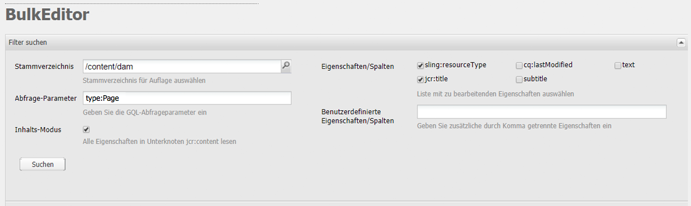

# Der Bulk Editor{#the-bulk-editor}

Der Bulk Editor ermöglicht eine sehr effiziente Bearbeitung, wenn der visuelle Seitenkontext nicht benötigt wird, da Sie damit:

* Inhalte von mehreren Seiten suchen (und anzeigen); dazu wird GQL (Google Query Language) genutzt
* diese Inhalte direkt im Bulk Editor bearbeiten
* die Änderungen speichern (in den Originalseiten)
* diese Inhalte in eine tabulatorgetrennte Tabellendatei (.tsv) exportieren

>[!NOTE]
>
>Sie können auch Inhalte in das Repository importieren. Standardmäßig ist dies jedoch für den Bulk Editor deaktiviert, wie im Abschnitt **Instrumente** Konsole.

In diesem Abschnitt wird erläutert, wie Sie mit dem Bulk Editor in der **Tools-Konsole** arbeiten. In der Regel verwenden Administratoren den Bulk Editor, um mehrere Elemente zu suchen und zu bearbeiten. Dazu füllen Sie die Tabelle mit einer GQL-Abfrage aus und wählen dann die zu bearbeitenden Inhaltselemente aus. Autoren nutzen den Bulk Editor in der Regel als Teil einer benutzerdefinierten Bulk-Editor-Anwendung, die über die [Produktlisten](/help/sites-authoring/default-components.md#productlist)-Komponente zugänglich ist.

>[!CAUTION]
>
>Mit dem [Einstellung der klassischen Benutzeroberfläche](/help/release-notes/deprecated-removed-features.md) In AEM 6.4 ist der Bulk Editor ebenfalls veraltet und die Adobe plant daher nicht, den Bulk Editor weiter zu verbessern.

## Anwendungsbeispiel für den Bulk Editor {#example-use-case-for-the-bulk-editor}

Wenn Sie beispielsweise alle Namen und E-Mail-Adressen von Benutzern benötigen, die eine bestimmte Umfrage ausgefüllt haben, kann der Bulk Editor diese Informationen bereitstellen und in eine Tabelle exportieren.

Ein Beispiel zur Veranschaulichung eines solchen Anwendungsfalls finden Sie auf der Geometrixx-Website:

1. Navigieren Sie zum **Support** und dann zum **Zufriedenheit des Kundendienstes** Umfrage.
1. **Bearbeiten** die **Beginn des Formulars** Absatz. Klicken Sie im Dialogfeld auf das **Erweitert** Registerkarte, erweitern Sie die **Aktionskonfiguration** Klicken Sie auf **Daten anzeigen...**.

   

1. Der Bulk Editor ist vollständig anpassbar, auch wenn in diesem Beispiel die Benutzer keine Inhalte bearbeiten, sondern nur die Daten in eine Tabelle exportieren können.

   

## Verwenden des Bulk Editors {#how-to-use-the-bulk-editor}

Mit dem Bulk Editor können Sie:

* [basierend auf Abfrageparametern nach Inhalten suchen, festgelegte Eigenschaften der Ergebnisse in Spalten anzeigen, diese Inhalte bearbeiten und die Änderungen speichern](#searching-and-editing-content)
* [diese Inhalte in eine tabulatorgetrennte Tabelle exportieren](#exporting-content)

* [Inhalte aus einer tabulatorgetrennten Tabelle importieren](#importing-content)

### Suchen und Bearbeiten von Inhalten {#searching-and-editing-content}

So bearbeiten Sie mit dem Bulk Editor mehrere Elemente gleichzeitig:

1. Im **Instrumente** klicken Sie auf die **Importtools** Ordner, um ihn zu erweitern.
1. Doppelklicken Sie auf die **Bulk Editor** um es zu öffnen.
1. Geben Sie Ihre Auswahlanforderungen an:

<table>
 <tbody>
  <tr>
   <td>Feld</td>
   <td>Eigenschaft</td>
  </tr>
  <tr>
   <td>Stammverzeichnis</td>
   <td>Gibt das Stammverzeichnis an, das der Bulk Editor durchsucht.  Beispiel, <code>/content/geometrixx/en</code>. Der Bulk Editor durchsucht alle untergeordneten Knoten.</td>
  </tr>
  <tr>
   <td>Abfrageparameter</td>
   <td>Geben Sie mithilfe von GQL-Parametern die Suchzeichenfolge ein, nach der der Bulk Editor im Repository suchen soll. Beispiel: Mit <code>type:Page</code> wird nach allen Seiten im Stammverzeichnis gesucht, mit <code>text:professional</code> wird nach allen Seiten gesucht, die das Wort „professional“ enthalten, und mit <code>"jcr:title":English</code> wird nach allen Seiten, die „English“ als Titel haben. Sie können nur nach Zeichenfolgen suchen.</td>
  </tr>
  <tr>
   <td>Kontrollkästchen „Inhaltsmodus“</td>
   <td>Aktivieren Sie dieses Kontrollkästchen, um die Eigenschaften im Unterknoten <code>jcr:content</code> der Suchergebnisse zu lesen, sofern vorhanden. Diese Option ist nur für Seiten nutzbar. Eigenschaftsnamen erhalten das Präfix <code>"jcr:content/"</code></td>
  </tr>
  <tr>
   <td>Eigenschaften/Spalten</td>
   <td>Aktivieren Sie die Kontrollkästchen für die Eigenschaften, die der Bulk Editor zurückgeben soll. Die Eigenschaften, die Sie auswählen, sind die Spaltenüberschriften im Ergebnisbereich. Standardmäßig wird der Knotenpfad in den Ergebnissen angezeigt.</td>
  </tr>
  <tr>
   <td>Benutzerdefinierte Eigenschaften/Spalten</td>
   <td>Geben Sie alle anderen Eigenschaften ein, die nicht im Feld <strong>Eigenschaften/Spalten</strong> aufgeführt sind. Diese benutzerdefinierten Eigenschaften werden im Ergebnisbereich angezeigt. Sie können mehrere Eigenschaften mithilfe eines Kommas hinzufügen, um Eigenschaften zu trennen. <i>Hinweis:</i> Wenn Sie eine benutzerdefinierte Eigenschaft hinzufügen, die noch nicht vorhanden ist, zeigt AEM WCM eine leere Zelle an. Wenn Sie die leere Zelle ändern und speichern, wird die Eigenschaft zum Knoten hinzugefügt. Die neu erstellte Eigenschaft muss Einschränkungen des Knotentyps und Eigenschafts-Namespaces berücksichtigen.</td>
  </tr>
 </tbody>
</table>

Beispiel:

1. Klicken Sie auf **Suchen**. Der Bulk Editor zeigt die Suchergebnisse an.
Im Beispiel oben werden alle Seiten, die Ihren Suchkriterien entsprechen, zurückgegeben und in den geforderten Spalten angezeigt.

   

1. Um ggf. Änderungen vorzunehmen, doppelklicken Sie in eine Zelle.

   

1. Klicken Sie auf **Speichern**, um die Änderungen zu speichern. (Die Schaltfläche **Speichern** wird aktiviert, sobald Sie eine Zelle bearbeitet haben.)

   >[!CAUTION]
   >
   >Die hier vorgenommenen Änderungen werden in den Repository-Inhalt geschrieben, z. B. die Seite, auf die unter **Pfad** verwiesen wird.

#### Weitere GQL-Abfrageparameter {#additional-gql-query-parameters}

* **path:** Durchsucht nur Knoten unter diesem Pfad. Wenn Sie mehr als einen Begriff mit einem Pfadpräfix festlegen, wird nur der letzte berücksichtigt.
* **type:** Gibt nur Knoten der angegebenen Knotentypen zurück. Dies umfasst sowohl die primären als auch die Mixin-Typen. Sie können mehrere kommagetrennte Knotentypen angeben. GQL gibt Knoten zurück, die einen der angegebenen Typen aufweisen.
* **order:** Sortiert das Ergebnis nach den bestimmten Eigenschaften. Sie können mehrere kommagetrennte Eigenschaftsnamen angeben. Um das Ergebnis in absteigender Reihenfolge anzuordnen, setzen Sie einfach das Präfix des Eigenschaftsnamens auf ein Minuszeichen. Beispiel: order:-name. Ein Pluszeichen gibt das Ergebnis in aufsteigender Reihenfolge zurück. Dies ist die Standardeinstellung.
* **limit:** Begrenzt die Anzahl der Ergebnisse mithilfe eines Intervalls. Beispiel: limit:10..20 – Beachten Sie, dass das Intervall auf 0 basiert. Der Startwert wird ein-, der Endwert ausgeschlossen. Sie können auch ein offenes Intervall festlegen: :limit:10.. oder limit:..20. Wenn Sie die Punkte weglassen und nur einen Wert angeben, gibt GQL höchstens diese Anzahl an Ergebnissen zurück. Beispiel: limit:10 (Gibt die ersten zehn Ergebnisse zurück.)

### Inhalt exportieren {#exporting-content}

Möglicherweise müssen Sie Inhalte exportieren und in einer Excel-Tabelle ändern. Sie können beispielsweise eine Mailingliste exportieren und den Bereichscode aller aufgelisteten Telefonnummern direkt in Excel ändern, zusätzliche Zeilen hinzufügen usw.

So exportieren Sie Inhalte:

1. Suchen Sie nach Inhalt, wie unter [Suchen und Bearbeiten von Inhalten](#searching-and-editing-content).
1. Klicken **Export** um die Änderungen in eine tabulatorgetrennte Excel-Tabelle zu exportieren. AEM WCM fragt Sie, wo Sie die Datei herunterladen möchten.

   >[!NOTE]
   >
   >Standardmäßig sind Änderungen in [Windows-1252](https://de.wikipedia.org/wiki/Windows-1252) (auch bekannt als CP-1252). Sie können UTF-8 aktivieren, um die Änderungen in UTF-8 zu exportieren.

   

1. Wählen Sie den Speicherort aus und bestätigen Sie, dass Sie die Datei herunterladen möchten.
1. Nachdem Sie die Datei heruntergeladen haben, können Sie sie über Ihr Tabellenkalkulationsprogramm öffnen, z. B. Microsoft Excel. Das Tabellenprogramm importiert die Datei und konvertiert sie in ein Tabellenformat.

   

### Inhalt importieren {#importing-content}

Standardmäßig ist die Importfunktion beim Öffnen des Bulk Editors ausgeblendet. Wenn Sie den Parameter `hib=false` zur URL hinzufügen, wird die Schaltfläche **Importieren** auf der Bulk Editor-Seite angezeigt. Sie können Inhalte aus jeder tabulatorgetrennten Datei (`.tsv`) importieren. Damit der Import ordnungsgemäß funktioniert, müssen die Spaltenüberschriften (erste Zellenzeile) mit den Spaltenüberschriften der Tabelle übereinstimmen, in die Sie importieren.

>[!NOTE]
>
>Wenn Sie Inhalte erneut importieren, löschen Sie alle vorherigen Inhalte für diese Knoten. Achten Sie darauf, wichtige Informationen nicht zu überschreiben.

So importieren Sie Inhalte:

1. Öffnen Sie den Bulk Editor.
1. Fügen Sie `?hib=false` zur URL hinzu, z. B.:
   `https://localhost:4502/etc/importers/bulkeditor.html?hib=false`
1. Wählen Sie **Importieren** aus.
1. Wählen Sie die `.tsv`-Datei aus. Die Daten werden in das Repository importiert.
