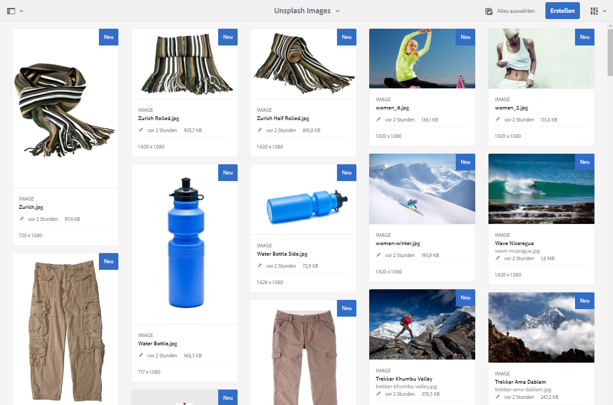
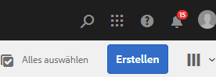
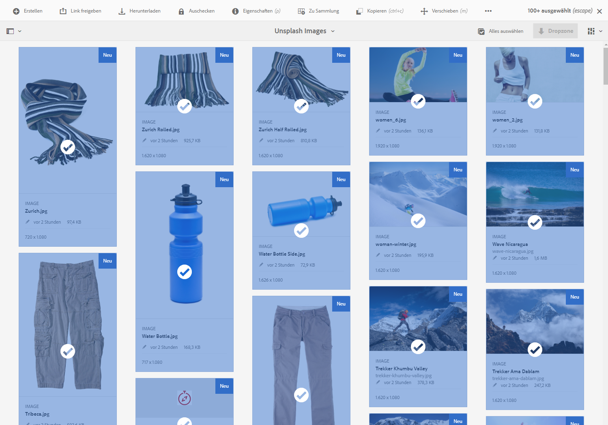
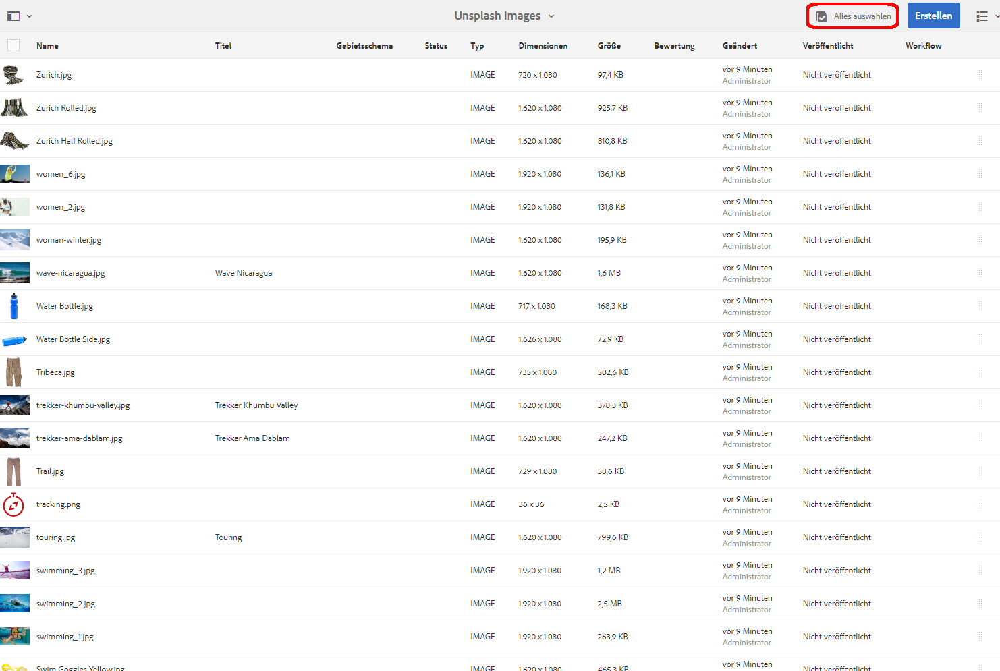
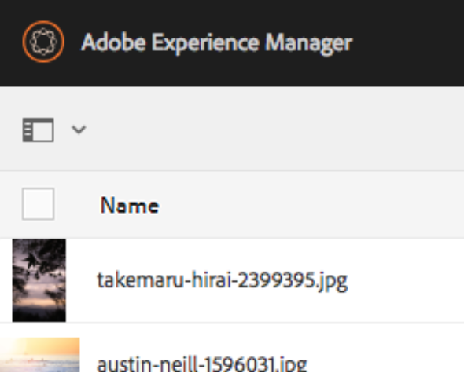
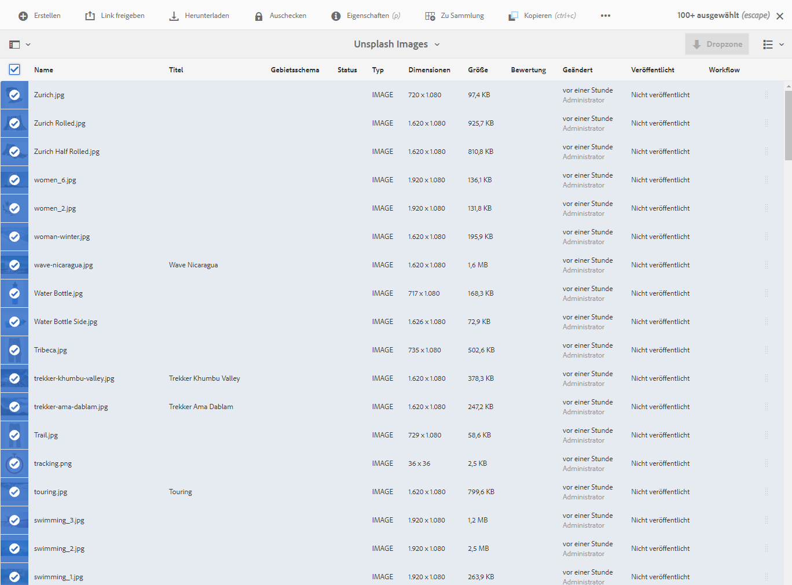
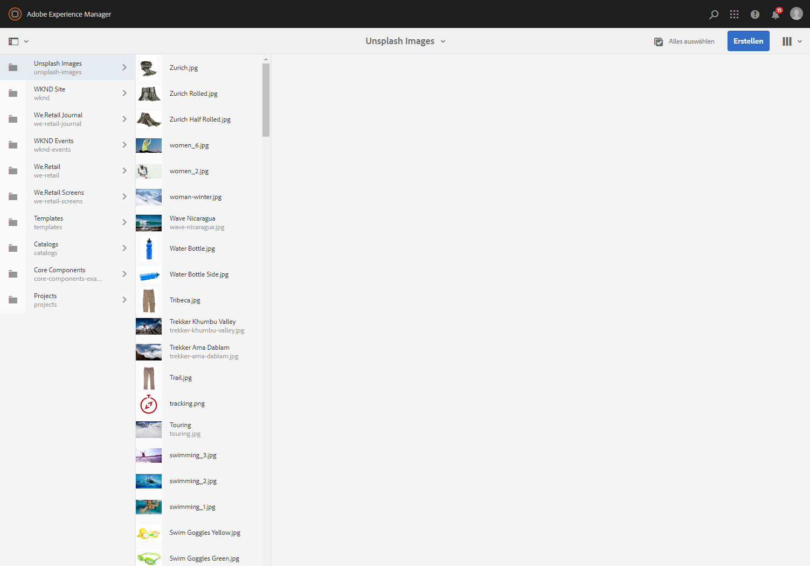
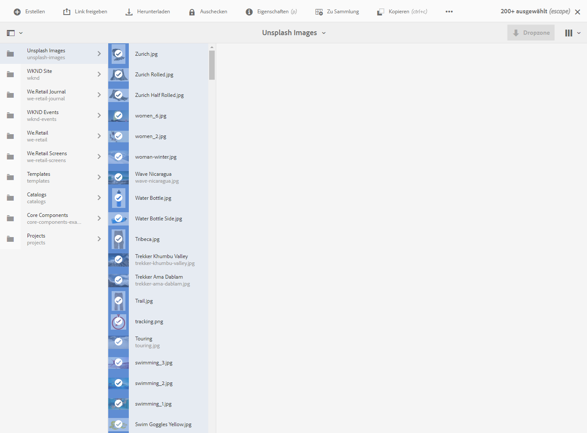
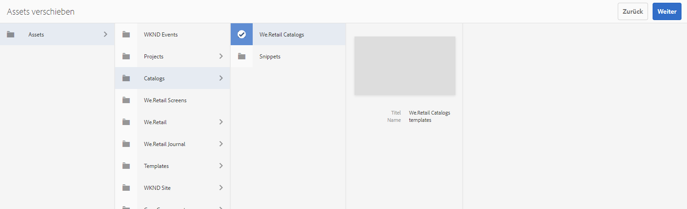
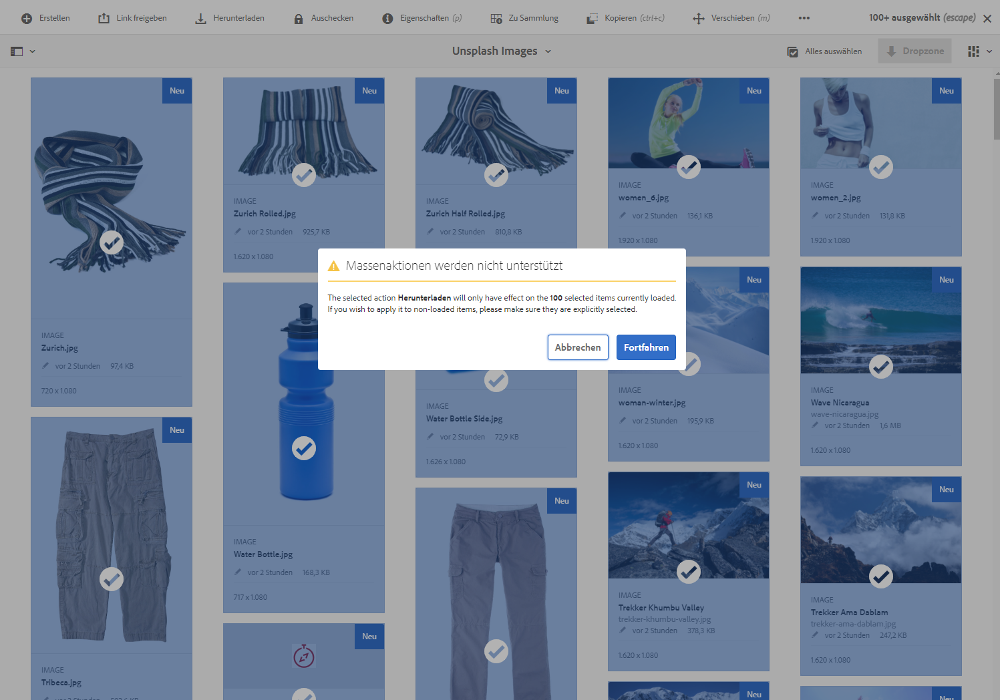

# Massenverarbeitungsvorgänge {#bulk-processing-operations}

## Einführung {#introduction}

Mit der neuesten AEM wurde die Schaltfläche Alle auswählen auf alle Ansichten erweitert: Listen-, Spalten- und Kartenansicht. Über die Schaltfläche Alle auswählen werden jetzt alle Inhalte eines bestimmten Ordners oder einer bestimmten Sammlung ausgewählt und nicht nur die Assets und Seiten, die im Clientbrowser geladen und angezeigt werden.

Schlüsselaktionen wurden für den Massenvorgang aktiviert: **Verschieben**, **Löschen** und **Kopieren**. In einem neuen Dialogfeld erfahren Kunden, für welche Aktionen die Massenverarbeitung nicht verfügbar ist.

## Verwendung von {#how-to-use}

Der Karten-, Listen- oder Spaltenansicht wurde eine neue Schaltfläche mit dem Namen **Select All** hinzugefügt. Diese Schaltfläche kann in allen Ansichten verwendet werden, um alle Elemente im Datensatz auszuwählen.

In früheren Versionen von AEM war die Auswahl begrenzt, was im Client-Browser geladen wurde. Diese neuen Änderungen wurden eingeführt, um Verwirrung in Bezug auf die Anzahl der Elemente zu vermeiden, für die ein Massenvorgang durchgeführt wird.

Derzeit wurden drei Vorgänge zur Massenverarbeitung hinzugefügt:

* Verschieben
* Kopieren
* Löschen

Künftig werden weitere Operationen unterstützt.
Um diese Funktion verwenden zu können, müssen Sie zu dem Ordner oder der Sammlung navigieren, in dem Sie Massenvorgänge für Seiten oder Assets durchführen möchten.

Wählen Sie dann eine der Ansichten aus, wie unten dargestellt:

### Kartenansicht {#card-view}

### Massenauswahl in der Kartenansicht {#bulk-selection-in-card-view}

Assets oder Seiten können über die Schaltfläche **Alle auswählen** oben rechts stapelweise ausgewählt werden:

 

### Listenansicht {#list-view}

Dasselbe gilt auch für die Listenansicht:

### Massenauswahl in der Listenansicht {#bulk-selection-in-list-view}

Verwenden Sie in der Listenansicht entweder die Schaltfläche **Alle auswählen** oder das Kontrollkästchen links zur Massenauswahl.

 

### Spaltenansicht {#column-view}

### Massenauswahl in der Spaltenansicht {#bulk-selection-in-column-view}

## Massenaktivierte Vorgänge {#bulk-enabled-operations}

Nach der Auswahl kann eine der drei Massenaktionen ausgeführt werden: **Verschieben**, **Kopieren** oder **Löschen**.

Hier wird der Vorgang **Verschieben** für die oben ausgewählten Assets ausgeführt. In allen Ansichten führt dies dazu, dass alle Assets an den ausgewählten Speicherort verschoben werden und nicht nur die Assets, die auf dem Bildschirm geladen werden.

Bei anderen Vorgängen, bei denen keine Massenvorgänge aktiviert sind, wie **Download,**, wird eine Warnung angezeigt, dass nur Elemente, die im Browser geladen werden, in den Vorgang einbezogen werden.

