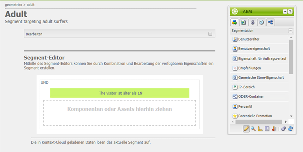

# Konfigurieren der Segmentierung  {#configuring-segmentation}

>[!NOTE]
>
>Dieses Dokument beschreibt die Konfiguration der Segmentierung bei ClientContext. Informationen zum Konfigurieren von Segmenten mit ContextHub über die Touch-Benutzeroberfläche finden Sie unter [Konfigurieren der Segmentierung mit ContextHub](/help/sites-administering/segmentation.md).

Die Segmentierung ist bei der Erstellung einer Kampagne eine grundlegende Überlegung. Unter [Grundlegendes zur Segmentierung](/help/sites-authoring/segmentation-overview.md) finden Sie Informationen zur Funktionsweise der Segmentierung sowie zu Schlüsselbegriffen.

Je nach den von Ihnen bereits zu den Besuchern Ihrer Site erfassten Informationen sowie je nach Ihren angepeilten Zielen müssen Sie die erforderlichen Segmente und Strategien für Ihre zielgerichteten Inhalte festlegen.

Diese Segmente werden dann verwendet, um einem Besucher gezielt bestimmte Inhalte anzuzeigen. Dieser Inhalt wird im Abschnitt [Kampagnen](/help/sites-classic-ui-authoring/classic-personalization-campaigns.md) der Website verwaltet. Hier definierte Teaser-Seiten können als Teaser-Absätze auf jeder Seite einbezogen werden – und sie können bestimmen, auf welches Besuchersegment die spezialisierten Inhalte angewendet werden sollen.

Mit AEM können Sie Segmente, Teaser und Kampagnen auf einfache Weise erstellen und aktualisieren. Außerdem können Sie damit die Ergebnisse Ihrer Definitionen überprüfen.

Der **Segment-Editor** ermöglicht Ihnen die einfache Definition eines Segments:

Sie können jedes Segment **bearbeiten**, um einen **Titel**, eine **Beschreibung** und einen Faktor **Verstärken** anzugeben. Mithilfe des Sidekicks können Sie **UND**- und **ODER**-Container zum Definieren der **Segmentlogik** hinzufügen und anschließend die erforderlichen **Segmenteigenschaften** zur Definition der Auswahlkriterien hinzufügen.

## Faktor „Verstärken“  {#boost-factor}

Jedes Segment verfügt über einen Parameter **Boost** , der als Gewichtungsfaktor verwendet wird. Eine höhere Zahl zeigt an, dass das Segment gegenüber einem Segment mit einer niedrigeren Zahl bevorzugt wird.

* Mindestwert: `0`
* Höchstwert: `1000000`

## Segmentlogik {#segment-logic}

Die folgenden Logik-Container sind standardmäßig verfügbar und ermöglichen es Ihnen, die Logik Ihrer Segmentauswahl zu erstellen. Sie können vom Sidekick in den Editor gezogen werden:

<table>
 <tbody>
  <tr>
   <td> UND-Container  </td>
   <td> Der boolesche UND-Operator.  </td>
  </tr>
  <tr>
   <td> ODER-Container  </td>
   <td> Der boolesche ODER-Operator.</td>
  </tr>
 </tbody>
</table>

## Segmenteigenschaften {#segment-traits}

Die folgenden Segmenteigenschaften sind standardmäßig verfügbar und können vom Sidekick in den Editor gezogen werden:

<table>
 <tbody>
  <tr>
   <td> IP-Bereich  </td>
   <td>Definiert einen Bereich von IP-Adressen, den der Besucher haben kann.  </td>
  </tr>
  <tr>
   <td> Seitenaufrufe  </td>
   <td>Wie oft die Seite angefordert wurde.   </td>
  </tr>
  <tr>
   <td> Seiteneigenschaft  </td>
   <td>Jede Eigenschaft der besuchten Seite.  </td>
  </tr>
  <tr>
   <td> Verweis-Stichwörter  </td>
   <td>Suchbegriffe, die mit Informationen aus der verweisenden Website übereinstimmen sollen.   </td>
  </tr>
  <tr>
   <td> Script</td>
   <td>Zu bewertender JavaScript-Ausdruck.  </td>
  </tr>
  <tr>
   <td> Segment-Referenz   </td>
   <td>Verweis auf eine andere Segmentdefinition.  </td>
  </tr>
  <tr>
   <td> Tag-Cloud  </td>
   <td>Tags, die mit denen der besuchten Seiten übereinstimmen.  </td>
  </tr>
  <tr>
   <td> Benutzeralter  </td>
   <td>Aus dem Benutzerprofil genommen.  </td>
  </tr>
  <tr>
   <td> Benutzereigenschaft  </td>
   <td>Alle anderen Informationen, die im Benutzerprofil verfügbar sind. </td>
  </tr>
 </tbody>
</table>

Sie können diese Eigenschaften mithilfe der booleschen Operatoren „ODER“ und „UND“ kombinieren (siehe [Erstellen eines neuen Segments](#creating-a-new-segment)), um das exakte Szenario zur Auswahl dieses Segments festzulegen.

Wenn die gesamte Anweisung mit „true“ bewertet wurde, wird dieses Segment aufgelöst. Falls mehrere Segmente zutreffen, wird außerdem der Faktor **[Verstärken](/help/sites-administering/campaign-segmentation.md#boost-factor)** verwendet.

>[!CAUTION]
>
>Der Segmenteditor prüft nicht auf Zirkelbezüge. Ein Beispiel hierfür wäre, wenn Segment A auf ein anderes Segment B verweist, das wiederum auf Segment A verweist. Sie müssen sicherstellen, dass Ihre Segmente keine Zirkelbezüge enthalten.

>[!NOTE]
>
>Eigenschaften mit dem Suffix **_i18n** werden durch ein Skript festgelegt, das Teil der clientlib der Personalisierungsbenutzeroberfläche ist. Alle benutzeroberflächenbezogenen clientlibs werden nur dann in der Autoreninstanz geladen, wenn die Benutzeroberfläche in der Veröffentlichungsinstanz nicht benötigt wird.
>
>Daher ist es beim Erstellen eines Segments mit solchen Eigenschaften normalerweise erforderlich, sich beispielsweise auf **browserFamily** anstatt auf **browserFamily_i18n** zu verlassen.

### Erstellen eines neuen Segments {#creating-a-new-segment}

So legen Sie Ihr neues Segment fest:

1. Wählen Sie in der Leiste **Tools > Vorgänge > Konfiguration** aus.
1. Klicken Sie auf die Seite **Segmentierung** im linken Bereich und navigieren Sie zum erforderlichen Ort.
1. Erstellen Sie eine [neue Seite](/help/sites-authoring/editing-content.md#creatinganewpage) mithilfe der Vorlage **Segment**.
1. Öffnen Sie die neue Seite, um den Segment-Editor anzuzeigen:

   

1. Verwenden Sie entweder den Sidekick oder das Kontextmenü (in der Regel durch Klicken mit der rechten Maustaste und die anschließende Auswahl von **Neu...**, um das Fenster „Neue Komponente einfügen“ zu öffnen), um die benötigte Segmenteigenschaft zu finden. Ziehen Sie sie dann in den **Segment-Editor**. Sie wird dann im standardmäßigen **UND**-Container angezeigt.
1. Doppelklicken Sie auf die neue Eigenschaft, um die spezifischen Parameter zu bearbeiten – so zum Beispiel die Mausposition:

   

1. Klicken Sie auf **OK**, um Ihre Definition zu speichern:
1. Sie können die Segmentdefinition **bearbeiten**, um ihr einen **Titel**, eine **Beschreibung** und einen Faktor **[Verstärken](#boost-factor)** zuzuordnen:

   

1. Fügen Sie bei Bedarf weitere Eigenschaften hinzu. Sie können boolesche Ausdrücke anhand der **UND-Container-** und **ODER-Containerkomponenten** hinzufügen, die unter **Segmentlogik** zu finden sind. Mit dem Segment-Editor können Sie nicht mehr benötigte Eigenschaften oder Container löschen oder diese an neue Positionen innerhalb der Anweisung ziehen.

### Verwenden von UND- und ODER-Containern   {#using-and-and-or-containers}

Sie können in AEM komplexe Segmente erstellen. Es ist hilfreich, sich einige grundlegende Punkte bewusst zu machen:

* Die oberste Ebene der Definition ist immer der ursprünglich erstellte UND-Container. Dies kann nicht verändert werden, hat allerdings auch keine Auswirkungen auf den Rest der Segmentdefinition.
* Stellen Sie sicher, dass die Verschachtelung Ihrer Container Sinn ergibt. Die Container können als die Klammern Ihres booleschen Ausdrucks betrachtet werden.

Das folgende Beispiel wird für die Auswahl von Besuchern verwendet, auf die eine der beiden folgenden Möglichkeiten zutrifft:

Männlich und zwischen 16 und 65

ODER

Weiblich und zwischen 16 und 62

Da der Hauptoperator „ODER“ lautet, müssen Sie mit einem **ODER-Container** beginnen. Innerhalb dieses Containers verfügen Sie über 2 „UND“-Anweisungen für die Sie jeweils einen **UND-Container** benötigen, zu dem Sie die einzelnen Eigenschaften hinzufügen können.

## Testen der Anwendung eines Segments   {#testing-the-application-of-a-segment}

Sobald das Segment definiert wurde, können die potenziellen Ergebnisse mithilfe des **[ClientContext](/help/sites-administering/client-context.md)** getestet werden:

1. Wählen Sie das zu testende Segment aus.
1. Drücken Sie **[Strg-Alt-C](/help/sites-authoring/page-authoring.md#keyboardshortcuts)**, um den **[ClientContext](/help/sites-administering/client-context.md)** zu öffnen, der die gesammelten Daten anzeigt. Zu Testzwecken können Sie **bestimmte Werte bearbeiten** oder **Laden** ein anderes Profil, um die Auswirkungen dort zu sehen.

1. Je nach den definierten Eigenschaften können die zu der aktuellen Seite verfügbaren Daten mit der Segmentdefinition übereinstimmen oder nicht. Der Status der Übereinstimmung wird unter der Definition angezeigt.

Eine einfache Segmentdefinition kann auf dem Alter und Geschlecht des Benutzers basieren. Das Laden eines spezifischen Profils zeigt, dass das Segment erfolgreich aufgelöst wurde:

Oder nicht:

>[!NOTE]
>
>Alle Eigenschaften werden sofort aufgelöst, obwohl die meisten sich nur beim erneuten Laden der Seite ändern. Änderungen an der Mausposition sind sofort sichtbar, was für Testzwecke sehr nützlich ist.

Solche Tests können auch auf Inhaltsseiten und in Kombination mit **Teaser**-Komponenten durchgeführt werden.

In der QuickInfo zum Teaser-Absatz werden die angewendeten Segmente angezeigt sowie ob diese derzeit aufgelöst sind und entsprechend warum die aktuelle Teaser-Instanz ausgewählt wurde:

### Verwenden Ihres Segments   {#using-your-segment}

Die Segmente werden aktuell innerhalb von [Kampagnen](/help/sites-classic-ui-authoring/classic-personalization-campaigns.md) verwendet. Sie werden zur Steuerung des tatsächlichen Inhalts verwendet, der spezifischen Zielgruppen angezeigt wird. Weitere Informationen finden Sie unter [Segmente](/help/sites-authoring/segmentation-overview.md).
