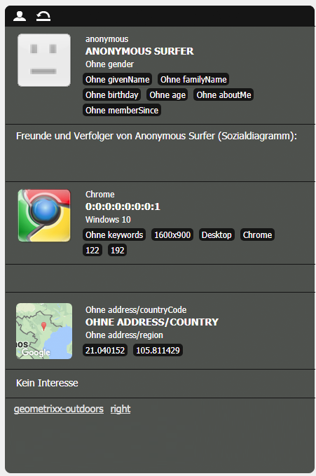

# Konfigurieren der Segmentierung {#configuring-segmentation}

>[!NOTE]
>
>Dieses Dokument behandelt die Konfiguration der Segmentierung zur Verwendung mit ClientContext. Informationen zum Konfigurieren von Segmenten mit ContextHub mithilfe der Touch-Benutzeroberfläche finden Sie unter [Konfigurieren der Segmentierung mit ContextHub](/help/sites-administering/segmentation.md).

Die Segmentierung ist bei der Erstellung einer Kampagne eine grundlegende Überlegung. Im [Segmentierungs-Glossar](/help/sites-authoring/segmentation-overview.md) finden Sie Informationen zur Funktionsweise der Segmentierung sowie zu Schlüsselbegriffen.

Je nachdem, welche Informationen Sie bereits über Ihre Site-Besucher gesammelt haben und welche Ziele Sie erreichen möchten, müssen Sie die für Ihre zielgerichteten Inhalte erforderlichen Segmente und Strategien definieren.

Diese Segmente werden dann verwendet, um einem Besucher gezielt bestimmte Inhalte anzuzeigen. Dieser Inhalt wird im Abschnitt [Kampagnen](/help/sites-classic-ui-authoring/classic-personalization-campaigns.md) der Website verwaltet. Die hier definierten Teaser-Seiten können als Teaser-Abschnitte in jede beliebige Seite eingefügt werden, und es kann festgelegt werden, für welches Besuchersegment der jeweilige Inhalt gilt.

Mit AEM können Sie einfach Segmente, Teaser und Kampagnen erstellen und aktualisieren. Außerdem können Sie damit die Ergebnisse Ihrer Segmentdefinitionen überprüfen.

Mit dem **Segment-Editor** können Sie bequem Segmente festlegen:

Mit **Bearbeiten** können Sie jedes Segment bearbeiten, um einen **Titel**, eine **Beschreibung** und einen **Verstärkungsfaktor** festzulegen. Mithilfe des Sidekicks können Sie **UND**- und **ODER**-Container zum Definieren der **Segmentlogik** und dann die erforderlichen **Segmenteigenschaften** hinzufügen, um die Auswahlkriterien festzulegen.

## Verstärkungsfaktor {#boost-factor}

Jedes Segment verfügt über einen Parameter zum **Verstärken**, der als Gewichtungsfaktor verwendet wird. Eine höhere Zahl zeigt an, dass das Segment bei der Auswahl gegenüber einem Segment mit einer niedrigeren Zahl bevorzugt wird.

* Mindestwert: `0`
* Höchstwert: `1000000`

## Segmentlogik {#segment-logic}

Die folgenden Logik-Container sind standardmäßig verfügbar und ermöglichen es Ihnen, die Logik Ihrer Segmentauswahl zu erstellen. Sie können vom Sidekick in den Editor gezogen werden:

<table>
 <tbody>
  <tr>
   <td> UND-Container  </td>
   <td> Der boolesche UND-Operator.  </td>
  </tr>
  <tr>
   <td> ODER-Container  </td>
   <td> Der boolesche ODER-Operator.</td>
  </tr>
 </tbody>
</table>

## Segmentmerkmale {#segment-traits}

Die folgenden Segmenteigenschaften sind standardmäßig verfügbar und können vom Sidekick in den Editor gezogen werden:

<table>
 <tbody>
  <tr>
   <td> IP-Bereich  </td>
   <td>Definiert einen Bereich von IP-Adressen, den der Besucher haben kann.  </td>
  </tr>
  <tr>
   <td> Seitenaufrufe  </td>
   <td>Wie oft die Seite angefordert wurde.   </td>
  </tr>
  <tr>
   <td> Seiteneigenschaft  </td>
   <td>Jede Eigenschaft der besuchten Seite.  </td>
  </tr>
  <tr>
   <td> Verweis-Schlüsselwörter  </td>
   <td>Schlüsselwörter, die mit Informationen aus der verweisenden Website abgeglichen werden.   </td>
  </tr>
  <tr>
   <td> Script</td>
   <td>Auszuwertender JavaScript-Ausdruck.  </td>
  </tr>
  <tr>
   <td> Segment-Referenz   </td>
   <td>Verweis auf eine andere Segmentdefinition.  </td>
  </tr>
  <tr>
   <td> Tag-Cloud  </td>
   <td>Tags, die mit denen der besuchten Seiten abgeglichen werden.  </td>
  </tr>
  <tr>
   <td> Benutzeralter  </td>
   <td>Wie aus dem Benutzerprofil übernommen.  </td>
  </tr>
  <tr>
   <td> Benutzereigenschaft  </td>
   <td>Alle anderen Informationen, die im Benutzerprofil verfügbar sind. </td>
  </tr>
 </tbody>
</table>

Sie können diese Eigenschaften mithilfe der booleschen Operatoren „ODER“ und „UND“ kombinieren (siehe [Erstellen eines neuen Segments](#creating-a-new-segment)), um das exakte Szenario zur Auswahl dieses Segments festzulegen.

Wenn die gesamte Anweisung mit „true“ bewertet wurde, wird dieses Segment aufgelöst. Wenn mehrere anwendbare Segmente vorhanden sind, wird die **[Verstärken](/help/sites-administering/campaign-segmentation.md#boost-factor)** wird auch verwendet.

>[!CAUTION]
>
>Der Segmenteditor prüft nicht auf Zirkelbezüge. Beispiel: Segment A verweist auf ein anderes Segment B, das wiederum auf Segment A verweist. Stellen Sie sicher, dass Ihre Segmente keine Zirkelbezüge enthalten.

>[!NOTE]
>
>Eigenschaften mit dem Suffix **_i18n** werden durch ein Skript festgelegt, das Teil der clientlib zur Personalisierungsbenutzeroberfläche ist. Alle benutzeroberflächenbezogenen clientlibs werden nur dann in der Autoreninstanz geladen, wenn die Benutzeroberfläche in der Veröffentlichungsinstanz nicht benötigt wird.
>
>Daher ist es bei der Erstellung eines Segments mit solchen Eigenschaften normalerweise erforderlich, beispielsweise **browserFamily** statt **browserFamily_i18n** zu verwenden.

### Erstellen eines neuen Segments {#creating-a-new-segment}

So legen Sie Ihr neues Segment fest:

1. Wählen Sie in der Leiste **Tools > Vorgänge > Konfiguration** aus.
1. Klicken Sie links auf die Seite **Segmentierung** und navigieren Sie zum gewünschten Speicherort.
1. Erstellen Sie mit der **Segment**-Vorlage eine [neue Seite](/help/sites-authoring/editing-content.md#creatinganewpage).
1. Öffnen Sie die neue Seite, um den Segment-Editor anzuzeigen:

   

1. Verwenden Sie entweder den Sidekick oder das Kontextmenü (in der Regel wird das Fenster „Neue Komponente einfügen“ mit einem Rechtsklick auf die Schaltfläche und dann auf der Option **Neu…** geöffnet), um nach dem gewünschten Segmentmerkmal zu suchen. Ziehen Sie es dann in den **Segment-Editor**, wo es im **UND**-Standardcontainer angezeigt wird.
1. Doppelklicken Sie auf die neue Eigenschaft, um die spezifischen Parameter zu bearbeiten, z. B. die Mausposition:

   

1. Klicken Sie auf **OK**, um die Definition zu speichern:
1. Mit **Bearbeiten** können Sie die Segmentdefinition bearbeiten, um ihr einen **Titel**, eine **Beschreibung** und einen **[Verstärkungsfaktor](#boost-factor)** zuzuweisen:

   

1. Fügen Sie bei Bedarf weitere Eigenschaften hinzu. Mit den unter **Segmentlogik** gefundenen Segmenten aus dem **UND-Container** und dem **ODER-Container** können Sie boolesche Ausdrücke formulieren. Mit dem Segment-Editor können Sie nicht mehr benötigte Komponenten löschen oder diese an neue Positionen innerhalb der Anweisung ziehen.

### Verwenden von UND- und ODER-Containern {#using-and-and-or-containers}

Sie können in AEM komplexe Segmente erstellen. Dabei ist es hilfreich, sich einige grundlegende Punkte bewusst zu machen:

* Die oberste Ebene der Definition ist immer der ursprünglich erstellte UND-Container. Dieser kann nicht geändert werden, hat jedoch keine Auswirkungen auf den Rest Ihrer Segmentdefinition.
* Stellen Sie sicher, dass die Verschachtelung Ihres Containers sinnvoll ist. Die Container können als die Klammern Ihres booleschen Ausdrucks betrachtet werden.

In folgendem Beispiel werden Besucherinnen bzw. Besucher ausgewählt, die entweder

männlich und zwischen 16 und 65 Jahre alt sind

ODER

weiblich und zwischen 16 und 62 Jahre alt sind

Da der Hauptoperator ODER ist, müssen Sie mit einem **ODER-Container** beginnen. In diesem verfügen Sie über 2 UND-Anweisungen, für die Sie also jeweils einen **UND-Container** benötigen, zu dem Sie die einzelnen Merkmale hinzufügen können.

## Testen der Anwendung eines Segments {#testing-the-application-of-a-segment}

Sobald das Segment definiert wurde, können die potenziellen Ergebnisse mithilfe von **[ContextHub](/help/sites-administering/client-context.md)** getestet werden:

1. Wählen Sie das zu testende Segment aus.
1. Drücken Sie **[Strg+Alt+C](/help/sites-authoring/page-authoring.md#keyboardshortcuts)**, um den **[ClientContext](/help/sites-administering/client-context.md)** mit den erfassten Daten zu öffnen. Zu Testzwecken können Sie bestimmte Werte **bearbeiten** oder ein anderes Profil **laden**, um dort die Auswirkungen zu sehen.

1. Je nach den definierten Eigenschaften können die zur aktuellen Seite verfügbaren Daten mit der Segmentdefinition übereinstimmen oder nicht. Der Status der Übereinstimmung wird unter der Definition angezeigt.

Eine einfache Segmentdefinition kann auf dem Alter und Geschlecht des Benutzers basieren. Das Laden eines spezifischen Profils zeigt, dass das Segment erfolgreich aufgelöst wurde:

Oder nicht:

>[!NOTE]
>
>Alle Merkmale werden sofort aufgelöst, obwohl die meisten sich nur beim erneuten Laden der Seite ändern. Änderungen der Mausposition sind sofort sichtbar, was für Testzwecke nützlich ist.

Solche Tests können auch auf Inhaltsseiten und in Kombination mit **Teaser**-Komponenten durchgeführt werden.

Wenn Sie den Mauszeiger über einen Teaser-Absatz bewegen, werden die angewendeten Segmente angezeigt, unabhängig davon, ob sie derzeit aufgelöst werden und warum die aktuelle Teaser-Instanz ausgewählt wurde:

### Ihr Segment verwenden {#using-your-segment}

Segmente werden derzeit in [Kampagnen](/help/sites-classic-ui-authoring/classic-personalization-campaigns.md) verwendet. Mit ihnen wird festgelegt, welche Inhalte bestimmte Zielgruppen tatsächlich sehen können. Weitere Informationen finden Sie unter [Verstehen von Segmenten](/help/sites-authoring/segmentation-overview.md).
