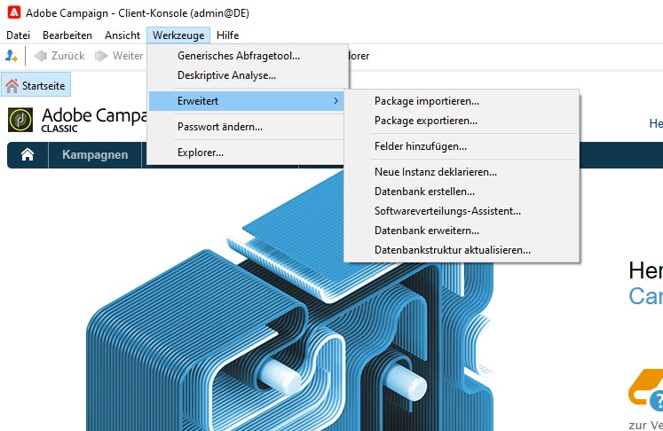
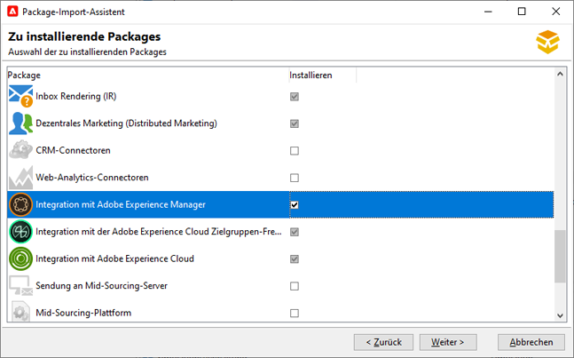
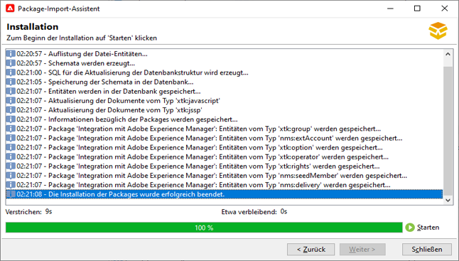
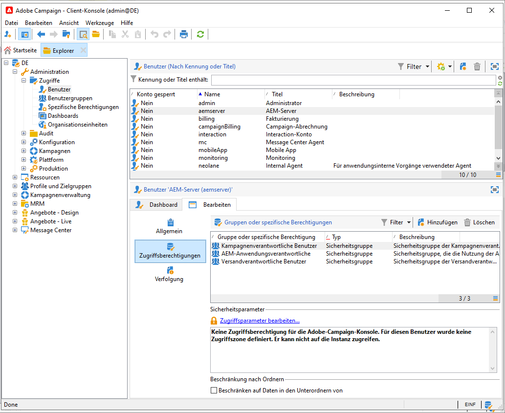
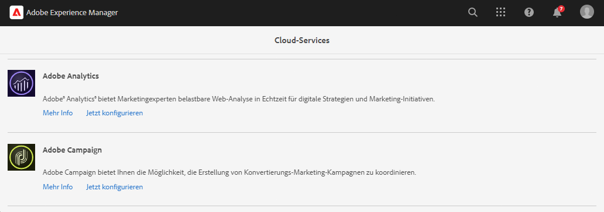
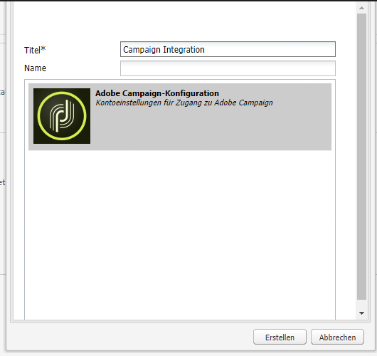
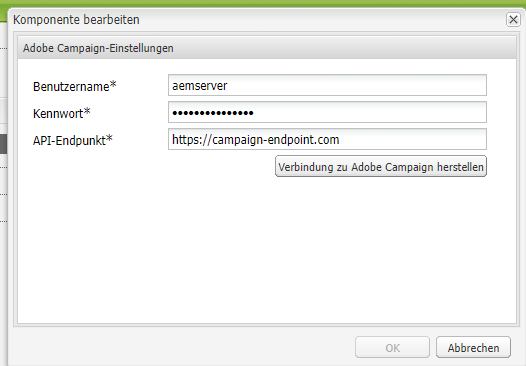
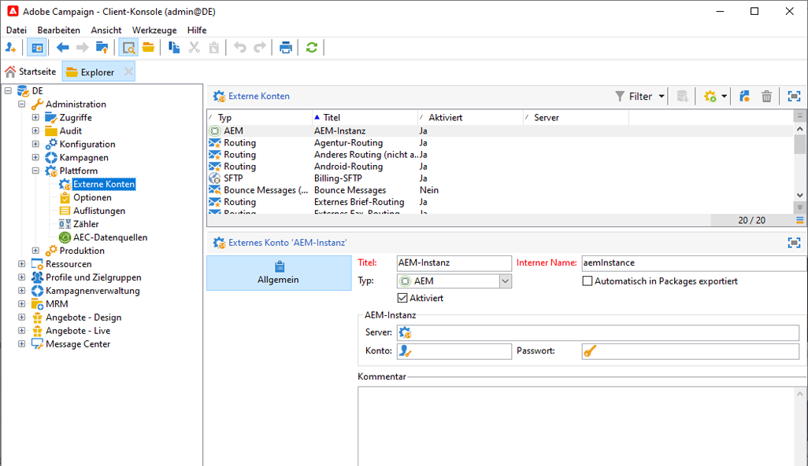

# Integration von AEM 6.5 mit Adobe Campaign Classic {#integrating-campaign-classic}

Durch die Integration von AEM mit Adobe Campaign Classic (ACC) können Sie E-Mail-Versand, Inhalte und Formulare direkt in AEM verwalten. Zur bidirektionalen Kommunikation zwischen Lösungen sind Konfigurationsschritte sowohl in Adobe Campaign Classic als auch in AEM erforderlich.

Durch diese Integration können AEM und Adobe Campaign Classic unabhängig voneinander verwendet werden. Marketing-Experten können in Adobe Campaign Kampagnen erstellen und Targeting verwenden, während Ersteller von Inhalten parallel an der Inhaltserstellung in AEM arbeiten können. Durch die Integration können Inhalt und Design der in AEM erstellten Kampagne zielgerichtet über Adobe Campaign bereitgestellt werden.

>[!INFO]
>
>In diesem Dokument wird beschrieben, wie Sie Adobe Campaign Classic in AEM 6.5 integrieren. Weitere Campaign-Integrationen finden Sie im Dokument [Integration von AEM 6.5 mit Adobe Campaign.](campaign.md)

## Integrationsschritte {#integration-steps}

Die Integration von AEM und Campaign erfordert in beiden Lösungen mehrere Schritte.

1. [Installieren des AEM-Integrationspakets in Campaign](#install-package)
1. [Erstellen eines Benutzers für AEM in Campaign](#create-operator)
1. [Konfigurieren der Campaign-Integration in AEM](#campaign-integration)
1. [Konfigurieren des AEM-Externalizers](#externalizer)
1. [Konfigurieren des Benutzer „campaign-remote“ in AEM](#configure-user)
1. [Konfigurieren des externen AEM-Kontos in Campaign](#acc-setup)

Dieses Dokument führt Sie im Detail durch die einzelnen Schritte.

## Voraussetzungen {#prerequisites}

* Administratorzugriff auf Adobe Campaign Classic
   * Für die Integration benötigen Sie eine funktionierende Adobe Campaign Classic-Instanz, einschließlich einer konfigurierten Datenbank.
   * Weitere Informationen zum Einrichten und Konfigurieren von Adobe Campaign Classic finden Sie unter [Adobe Campaign Classic-Dokumentation,](https://experienceleague.adobe.com/docs/campaign-classic/using/campaign-classic-home.html?lang=de) insbesondere das Handbuch zur Installation und Konfiguration.
* Administratorzugriff auf AEM

## Installieren des AEM-Integrationspakets in Campaign {#install-package}

Die **AEM** -Paket in Adobe Campaign enthält mehrere Standardkonfigurationen, die für die Verbindung mit AEM erforderlich sind.

1. Als Administrator melden Sie sich mit der Client-Konsole bei der Adobe Campaign-Instanz an.

1. Wählen Sie **Tools** > **Erweitert** > **Paket importieren...** aus.

   

1. Klicken Sie auf **Standardpaket installieren** und dann auf **Weiter**.

1. Überprüfen Sie das **AEM-Integrationspaket**.

   

1. Klicken Sie auf **Weiter** und dann auf **Starten**, um die Installation zu starten.

   

1. Klicken Sie auf **Schließen**, wenn die Installation abgeschlossen ist.

Das Integrationspaket ist jetzt installiert.

## Erstellen des Benutzers für AEM in Campaign {#create-operator}

Das Integrationspaket erstellt automatisch den `aemserver`-Benutzer, den AEM verwendet, um eine Verbindung mit Adobe Campaign herzustellen. Definieren Sie eine Sicherheitszone für diesen Operator und legen Sie sein Kennwort fest.

1. Melden Sie sich mit der Client-Konsole bei Adobe Campaign als Administrator an.

1. Auswählen **Instrumente** > **Explorer** aus der Menüleiste.

1. Navigieren Sie im Explorer zum Knoten **Administration** > **Zugriffsverwaltung** > **Benutzer**.

1. Wählen Sie den `aemserver`-Benutzer aus.

1. Wählen Sie auf der Registerkarte **Bearbeiten** des Benutzers die Unter-Registerkarte **Zugriffsberechtigungen** aus und klicken Sie auf den Link **Zugriffsparameter bearbeiten...**.

   

1. Wählen Sie die entsprechende Sicherheitszone aus und definieren Sie die vertrauenswürdige IP-Maske nach Bedarf.

1. Klicken Sie auf **Speichern**.

1. Melden Sie sich beim Adobe Campaign-Client ab.

1. Navigieren Sie im Dateisystem des Adobe Campaign-Servers zum Speicherort der Campaign-Installation und bearbeiten Sie die Datei `serverConf.xml` als Administrator. Diese Datei befindet sich normalerweise unter:
   * `C:\Program Files\Adobe\Adobe Campaign Classic v7\conf` in Windows.
   * `/usr/local/neolane/nl6/conf/eng` in Linux.

1. Suchen Sie nach `securityZone` und stellen Sie sicher, dass die folgenden Parameter für die Sicherheitszone des AEM-Benutzers festgelegt sind.

   * `allowHTTP="true"`
   * `sessionTokenOnly="true"`
   * `allowUserPassword="true"`.

1. Speichern Sie die Datei.

1. Stellen Sie sicher, dass die Sicherheitszone nicht durch die entsprechende Einstellung in der Datei `config-<server name>.xml` überschrieben wird.

   * Wenn die Konfigurationsdatei eine separate Sicherheitszoneneinstellung enthält, ändern Sie das Attribut `allowUserPassword` in `true`.

1. Wenn Sie den Adobe Campaign Classic-Server-Anschluss ändern möchten, ersetzen Sie `8080` durch den gewünschten Anschluss.

   >[!CAUTION]
   >
   >Standardmäßig ist keine Sicherheitszone für den Operator konfiguriert. Damit AEM eine Verbindung zu Adobe Campaign herstellen kann, müssen Sie einen Bereich auswählen, wie in den vorherigen Schritten beschrieben.
   >
   >Wir empfehlen Ihnen dringend, eine speziell AEM zugewiesene Sicherheitszone zu erstellen, um Sicherheitsprobleme zu vermeiden. Weitere Informationen zu diesem Thema finden Sie im Abschnitt [Dokumentation zu Adobe Campaign Classic.](https://experienceleague.adobe.com/docs/campaign-classic/using/installing-campaign-classic/additional-configurations/security-zones.html?lang=de)

1. Kehren Sie im Campaign-Client zum `aemserver`-Operator zurück und wählen Sie die Registerkarte **Allgemein** aus.

1. Klicken Sie auf den Link **Kennwort zurücksetzen...**.

1. Geben Sie ein Kennwort an und speichern Sie es an einem sicheren Ort für die zukünftige Verwendung.

1. Klicken Sie auf **OK**, um das Kennwort für den `aemserver`-Operator zu speichern.

## Konfigurieren der Campaign-Integration in AEM {#campaign-integration}

AEM [den Operator, den Sie bereits in Campaign eingerichtet haben](#create-operator) zur Kommunikation mit Campaign

1. Melden Sie sich bei Ihrer AEM Authoring-Instanz als Admin an.

1. Wählen Sie in der Seitenleiste der globalen Navigation die Option **Instrumente** > **Cloud Services** > **Ältere Cloud Services** > **Adobe Campaign** und klicken Sie auf **Jetzt konfigurieren**.

   

1. Erstellen Sie im Dialogfeld eine Campaign-Service-Konfiguration, indem Sie einen **Titel** eingeben und auf **Erstellen** klicken.

   

1. Ein neues Fenster und Dialogfeld wird geöffnet, um die Konfiguration zu bearbeiten. Geben Sie die folgenden Informationen ein.

   * **Benutzername** - Dies ist [der im vorigen Schritt erstellte Adobe Campaign AEM-Integrationspaket-Operator.](#create-operator) Standardgemäß ist dies `aemserver`.
   * **Passwort** - Dies ist das Passwort für [den im vorherigen Schritt erstellten Adobe Campaign AEM-Integrationspaket-Operator](#create-operator).
   * **API-Endpunkt** - Dies ist die Adobe Campaign-Instanz-URL.

   

1. Wählen Sie **Verbindung zu Adobe Campaign herstellen** aus, um die Verbindung zu überprüfen, und klicken Sie dann auf **OK**.

AEM kann jetzt mit Adobe Campaign kommunizieren.

>[!NOTE]
>
>Stellen Sie sicher, dass Ihr Adobe Campaign-Server über das Internet erreichbar ist. AEM kann nicht auf private Netzwerke zugreifen.

## Konfigurieren der Replikation für die AEM-Veröffentlichungsinstanz {#replication}

Campaign-Inhalte werden von Autorinnen und Autoren von Inhalten in der AEM-Autoreninstanz erstellt. Diese Instanz ist in der Regel in Ihrer Organisation nur intern verfügbar. Damit die Empfängerinnen und Empfänger Ihrer Kampagne auf Inhalte wie Bilder und Assets zugreifen können, müssen Sie diese Inhalte veröffentlichen.

Der Replikationsagent ist für die Veröffentlichung Ihres Inhalts aus der AEM-Autoreninstanz zur Veröffentlichungsinstanz verantwortlich und muss eingerichtet werden, damit die Integration ordnungsgemäß funktioniert. Dieser Schritt ist auch erforderlich, um bestimmte Autoreninstanzkonfigurationen in die Veröffentlichungsinstanz zu replizieren.

So konfigurieren Sie die Replikation von Ihrer AEM-Autoreninstanz zur Veröffentlichungsinstanz:

1. Melden Sie sich bei Ihrer AEM-Autoreninstanz als Admin an.

1. Wählen Sie in der Seitenleiste der globalen Navigation **Tools** > **Bereitstellung** > **Replikation** > **Agenten für Autor** aus und klicken Sie dann auf **Standardagent (veröffentlichen)**.

   

1. Klicken Sie auf **Bearbeiten** und wählen Sie dann die Registerkarte **Transport** aus.

1. Konfigurieren Sie das Feld **URI**, indem Sie die Standardeinstellung des `localhost`-Werts durch die IP-Adresse der AEM-Veröffentlichungsinstanz ersetzen.

   

1. Klicken Sie auf **OK**, um die Änderungen an den Agenteneinstellungen zu speichern.

Sie haben die Replikation zur AEM-Veröffentlichungsinstanz konfiguriert, damit Ihre Kampagnenempfängerinnen und -empfänger auf Ihren Inhalt zugreifen können.

>[!NOTE]
>
>Wenn Sie nicht die Replikations-URL, sondern die öffentlich zugängliche URL verwenden möchten, können Sie die öffentliche URL in der folgenden Konfigurationseinstellung über OSGi festlegen
>
>Wählen Sie in der globalen Navigationleiste die Option **Tools** > **Aktivitäten** > **Web-Konsole** > **OSGi-Konfiguration** und suchen Sie nach **AEM Campaign-Integration – Konfiguration**. Bearbeiten Sie die Konfiguration und ändern Sie das Feld **Öffentliche URL** (`com.day.cq.mcm.campaign.impl.IntegrationConfigImpl#aem.mcm.campaign.publicUrl`).

## Konfigurieren des AEM-Externalizers {#externalizer}

[Der Externalizer](/help/sites-developing/externalizer.md) ist ein OSGi-Service in AEM, der einen Ressourcenpfad in eine externe und absolute URL umwandelt, was erforderlich ist, damit AEM für Campaign geeignete Inhalte bereitstellen kann. Konfigurieren Sie ihn so, dass die Campaign-Integration funktioniert.

1. Melden Sie sich bei der AEM-Autoreninstanz als Admin an.
1. Wählen Sie in der globalen Navigationsleiste die Option **Tools** > **Vorgänge** > **Web-Konsole** > **OSGi-Konfiguration** und suchen Sie nach **Day CQ Link Externalizer**.
1. Standardmäßig ist der letzte Eintrag im Feld **Domains** für die Veröffentlichungsinstanz vorgesehen. Ändern Sie die URL von der Standardadresse `http://localhost:4503` in Ihre öffentlich verfügbare Veröffentlichungsinstanz.

   

1. Klicken Sie auf **Speichern**.

Sie haben den Externalizer konfiguriert, und Adobe Campaign kann nun auf Ihre Inhalte zugreifen.

>[!NOTE]
>
Die Veröffentlichungsinstanz muss vom Adobe Campaign-Server aus erreichbar sein. Falls sie auf `localhost:4503` oder einen anderen Server verweist, den Adobe Campaign nicht erreichen kann, werden Bilder von AEM nicht auf der Adobe Campaign-Konsole angezeigt.

## Konfigurieren des Benutzers „campaign-remote“ in AEM {#configure-user}

Damit Campaign mit AEM kommunizieren kann, müssen Sie ein Kennwort für den `campaign-remote`-Benutzer in AEM festlegen.

1. Melden Sie sich in AEM als Admin an.
1. Klicken Sie in der Hauptnavigationskonsole auf **Instrumente** in der linken Leiste.
1. Klicken Sie anschließend auf **Sicherheit** > **Benutzer**, um die Benutzer-Administration-Console zu öffnen. 
1. Suchen Sie den `campaign-remote`-Benutzer.
1. Wählen Sie den `campaign-remote`-Benutzer aus und klicken Sie auf **Eigenschaften**, um den Benutzer zu bearbeiten.
1. Klicken Sie im Fenster **Benutzereinstellungen bearbeiten** auf **Kennwort ändern**.
1. Geben Sie ein neues Kennwort für den Benutzer ein und notieren Sie das Kennwort an einem sicheren Ort für die zukünftige Verwendung.
1. Klicken Sie auf **Speichern**, um die Kennwortänderung zu speichern.
1. Klicken Sie auf **Speichern und schließen**, um die Änderungen am `campaign-remote`-Benutzer zu speichern.

## Konfigurieren des externen AEM-Kontos in Campaign {#acc-setup}

Bei der [Installation des **AEM-Integrationspakets** in Campaign](#install-package) wird ein externes Konto für AEM erstellt. Durch die Konfiguration dieses externen Kontos kann Adobe Campaign eine Verbindung zu AEM herstellen und so eine bidirektionale Kommunikation zwischen beiden Lösungen ermöglichen.

1. Melden Sie sich mit der Client-Konsole bei Adobe Campaign als Administrator an.

1. Auswählen **Instrumente** > **Explorer** aus der Menüleiste.

1. Navigieren Sie im Explorer zum Knoten **Administration** > **Platform** > **Externe Konten**.

   

1. Suchen Sie das externe AEM-Konto. Standardmäßig hat es die folgenden Werte:

   * **Typ** – `AEM`
   * **Bezeichnung** – `AEM Instance`
   * **Interner Name** – `aemInstance`

1. Geben Sie auf der Registerkarte **Allgemein** dieses Kontos die Benutzerinformationen ein, die Sie im Schritt [Festlegen des Kennworts für den Benutzer „campaign-remote“](#set-campaign-remote-password) definiert haben.

   * **Server** – Die Adresse des AEM-Autoren-Servers
      * Der AEM-Autoren-Server muss von der Adobe Campaign Classic-Server-Instanz aus erreichbar sein.
      * Stellen Sie sicher, dass die Server-Adresse **nicht** mit einem Schrägstrich endet.
   * **Konto** – Standardmäßig ist dies der Benutzer `campaign-remote`, den Sie in AEM im Schritt [Festlegen des Kennworts für den Benutzer „campaign-remote“](#set-campaign-remote-password) definiert haben.
   * **Kennwort** – Dieses Kennwort ist mit dem des Benutzers `campaign-remote` identisch, den Sie in AEM im Schritt [Festlegen des Kennworts für den Benutzer „campaign-remote“](#set-campaign-remote-password) definiert haben.

1. Aktivieren Sie das Kontrollkästchen **Aktiviert**.

1. Klicken Sie auf **Speichern**.

Adobe Campaign kann jetzt mit AEM kommunizieren.

## Nächste Schritte {#next-steps}

Nach der Konfiguration von sowohl Adobe Campaign Classic als auch AEM ist die Integration nun abgeschlossen.

Sie können jetzt erfahren, wie Sie einen Newsletter in Adobe Experience Manager erstellen, indem Sie mit [diesem Dokument](/help/sites-authoring/campaign.md) fortfahren.
