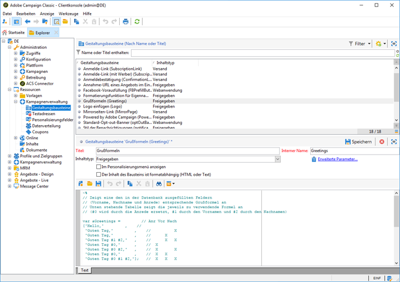

# Integration mit Adobe Campaign Classic{#integrating-with-adobe-campaign-classic}

>[!NOTE]
>
>Diese Dokumentation beschreibt die Integration von AEM mit der On-Premise-Lösung Adobe Campaign Classic. Wenn Sie Adobe Campaign Standard verwenden, lesen Sie sich für diese Anweisungen das Dokument [Integration mit Adobe Campaign Standard](/help/sites-administering/campaignstandard.md) durch.

Adobe Campaign ermöglicht die Verwaltung von Inhalten und Formularen für die Übermittlung per E-Mail direkt in Adobe Experience Manager.

Um beide Lösungen gleichzeitig nutzen zu können, müssen Sie sie zunächst so konfigurieren, dass sie miteinander verbunden sind. Dies umfasst Konfigurationsschritte in Adobe Campaign und Adobe Experience Manager. Diese Schritte werden in diesem Dokument detailliert beschrieben.

Das Arbeiten mit Adobe Campaign in AEM bietet die Möglichkeit, E-Mails über Adobe Campaign zu versenden, und wird näher im Abschnitt [Arbeiten mit Adobe Campaign](/help/sites-authoring/campaign.md) beschrieben. Dies bezieht sich auch auf die Verwendung von Formularen auf AEM-Seiten, um so Daten zu bearbeiten.

Des Weiteren sind unter Umständen die folgenden Themen relevant, wenn Sie AEM mit [Adobe Campaign](https://helpx.adobe.com/support/campaign/classic.html) integrieren:

* [Best Practices für E-Mail-Vorlagen](/help/sites-administering/best-practices-for-email-templates.md)
* [Fehlerbehebung bei der Adobe Campaign-Integration](/help/sites-administering/troubleshooting-campaignintegration.md)

Hinsichtlich der Erweiterung einer Adobe Campaign-Integration sind folgende Seiten empfehlenswert:

* [Erstellen benutzerspezifischer Erweiterungen](/help/sites-developing/extending-campaign-extensions.md)
* [Erstellen benutzerspezifischer Formular-Zuordnungen](/help/sites-developing/extending-campaign-form-mapping.md)

## Workflow für die Integration von AEM und Adobe Campaign {#aem-and-adobe-campaign-integration-workflow}

Dieser Abschnitt beschreibt einen typischen Workflow zwischen AEM und Adobe Campaign beim Erstellen von Kampagnen und dem Bereitstellen von Inhalten.

Der typische Workflow umfasst Folgendes und ist hier näher beschrieben:

1. Beginnen Sie mit dem Erstellen der Kampagne (sowohl in Adobe Campaign als auch in AEM).
1. Bevor Sie die Inhalte und die Bereitstellung verknüpfen, personalisieren Sie die Inhalte in AEM und erstellen Sie eine Bereitstellung in Adobe Campaign.
1. Verknüpfen Sie die Inhalte und die Bereitstellung in Adobe Campaign.

### Beginnen Sie mit dem Erstellen der Kampagne {#start-building-your-campaign}

Sie können jederzeit mit dem Erstellen einer Kampagne beginnen. Bevor Sie den Inhalt verknüpfen, sollten Sie wissen, dass AEM und AC unabhängig sind. Dies bedeutet, dass Vermarkter mit dem Erstellen ihrer Kampagnen und dem Targeting in Adobe Campaign beginnen können, während die Ersteller von Inhalten in AEM am Design arbeiten.

### Vor dem Verknüpfen von Inhalten und der Bereitstellung {#before-linking-content-and-delivery}

Bevor Sie die Inhalte verknüpfen und einen Bereitstellungsmechanismus erstellen, müssen Sie folgende Schritte ausführen:

**In AEM**

* Personalisieren Sie mithilfe der Personalisierungsfelder in der Komponente **Text &amp; Personalisierung**.

**In Adobe Campaign **

* Erstellen Sie eine Bereitstellung vom Typ **aemContent**.

### Verknüpfen von Inhalten und Einstellungsbereitstellung {#linking-content-and-setting-delivery}

Nachdem Sie den Inhalt für die Verknüpfung und Bereitstellung vorbereitet haben, legen Sie genau fest, wie und wo die Inhalte verknüpft werden sollen.

All diese Schritte werden in Adobe Campaign ausgeführt.

1. Legen Sie fest, welche AEM-Instanz verwendet werden soll.
1. Synchronisieren Sie die Inhalte durch Klicken auf die Schaltfläche „Synchronisieren“.
1. Öffnen Sie die Inhaltsauswahl zur Auswahl des Inhalts.

### Wenn Sie zum ersten Mal mit AEM arbeiten {#if-you-are-new-to-aem}

Wenn Sie zum ersten Mal mit AEM arbeiten, finden Sie die folgenden Links möglicherweise für das Verständnis von AEM hilfreich:

* [Starten von AEM](/help/sites-deploying/deploy.md)
* [Verstehen von Replikations-Agenten](/help/sites-deploying/replication.md)
* [Suchen von und Arbeiten mit Protokolldateien](/help/sites-deploying/monitoring-and-maintaining.md#working-with-audit-records-and-log-files)
* [Einführung in die AEM-Plattform](/help/sites-deploying/platform.md)

## Konfigurieren von Adobe Campaign {#configuring-adobe-campaign}

Die Konfiguration von Adobe Campaign umfasst Folgendes:

1. Installieren des AEM-Integrationspakets in Adobe Campaign
1. Konfigurieren eines externen Kontos
1. Sicherstellen, dass der AEMResourceTypeFilter korrekt konfiguriert ist

Darüber hinaus gibt es erweiterte Konfigurationen, die Sie definieren können, z. B.:

* Verwalten von Inhaltsblöcken
* Verwalten von Personalisierungsfeldern

Siehe [Erweiterte Konfigurationen](#advanced-configurations).

>[!NOTE]
>
>To perform these operations, you must have the **administration** role in Adobe Campaign.

### Voraussetzungen {#prerequisites}

Stellen Sie im Voraus sicher, dass Sie über die folgenden Elemente verfügen:

* [Eine AEM-Autoreninstanz](/help/sites-deploying/deploy.md#getting-started)
* [Eine AEM-Veröffentlichungsinstanz](/help/sites-deploying/deploy.md#author-and-publish-installs)
* [Eine Adobe Campaign Classic-Instanz](https://helpx.adobe.com/support/campaign/classic.html) - einschließlich Client und Server
* Internet Explorer 11

>[!NOTE]
>
>If you are running a version earlier than Adobe Campaign Classic build 8640, see the [upgrade documentation](https://docs.campaign.adobe.com/doc/AC6.1/en/PRO_Updating_Adobe_Campaign_Upgrading.html) for more information. Beachten Sie, dass der Client und die Datenbank auf denselben Build aktualisiert werden müssen.

>[!CAUTION]
>
>Operations detailed in the [Configuring Adobe Campaign](#configuring-adobe-campaign) and [Configuring Adobe Experience Manager](#configuring-adobe-experience-manager) sections are necessary for the integration functionalities between AEM and Adobe Campaign to work correctly.

### Installieren von AEM-Integrationspaketen {#installing-the-aem-integration-package}

You must install the **AEM Integration** package in Adobe Campaign. Gehen Sie hierfür wie folgt vor:

1. Wechseln Sie zu der Adobe Campaign-Instanz, die Sie gern mit AEM verknüpfen möchten.
1. *Wählen Sie* Werkzeuge *>* Erweitert *> Paket* importieren... .

   

1. Click **Install a standard package**, then select the **AEM Integration** package.

   

1. Click **Next**, and then **Start**.

   This package contains the **aemserver** operator that will be used to connect the AEM server to Adobe Campaign.

   >[!CAUTION]
   >
   >Standardmäßig ist für diesen Operator keine Sicherheitszone konfiguriert. Um die Verknüpfung über AEM mit Adobe Campaign herzustellen, müssen Sie eine Option auswählen.
   >
   >In the **serverConf.xml** file, the **allowUserPassword** attribute of the selected security zone must be set to **true** to authorize AEM to connect Adobe Campaign via login/password.
   >
   >Wir empfehlen Ihnen dringend, eine speziell AEM zugewiesene Sicherheitszone zu erstellen, um jegliche Sicherheitsprobleme zu vermeiden. For more on this, refer to the [Installation guide](https://docs.campaign.adobe.com/doc/AC/en/INS_Additional_configurations_Configuring_Campaign_server.html).

   

### Konfigurieren von externen AEM-Konten {#configuring-an-aem-external-account}

Sie müssen ein externes Konto konfigurieren, das es Ihnen ermöglicht, Adobe Campaign mit Ihrer AEM-Instanz zu verknüpfen.

>[!NOTE]
>
>* When installing the **AEM Integration** package, an external AEM account is created. Von diesem Konto aus können Sie die Verbindung mit der AEM-Instanz konfigurieren oder Sie können eine neue anlegen.
>* Stellen Sie in AEM sicher, dass Sie das Kennwort für den Benutzer „campaign-remote“ festlegen. Sie müssen dieses Kennwort festlegen, um Adobe Campaign mit AEM zu verknüpfen. Melden Sie sich als Administrator an und wählen Sie an der Benutzeradministrationskonsole den Benutzer „campaign-remote“. Klicken Sie dann auf **Kennwort festlegen**.
>


So konfigurieren Sie externe AEM-Konten:

1. Go to the **Administration** > **Platform** > **External Accounts** node.
1. Create a new external account and select the **AEM** type.
1. Geben Sie die Zugangsparameter für die AEM-Autoreninstanz ein: die Serveradresse sowie die ID und das Kennwort für die Verbindung mit dieser Instanz. Das Kennwort für das Benutzerkonto „campaign-api“ ist dasselbe wie für den Benutzer „campaign-remote“, für den Sie in AEM ein Kennwort festgelegt haben.

   >[!NOTE]
   >
   >Stellen Sie sicher, dass die Serveradresse **nicht** in einem Schrägstrich endet. Geben Sie beispielsweise `https://yourserver:4502` anstelle von `https://yourserver:4502/`

    

1. Make sure that the **Enabled** checkbox is selected.

### Überprüfen der Option „AEMResourceTypeFilter“{#verifying-the-aemresourcetypefilter-option}

The **AEMResourceTypeFilter** option is used to filter types of AEM resources that can be used in Adobe Campaign. Dies ermöglicht Adobe Campaign das Abrufen von AEM-Inhalten, die speziell für die ausschließliche Verwendung in Adobe Campaign entwickelt wurden.

Diese Option sollte vorkonfiguriert sein. Wenn Sie diese Option jedoch ändern, kann es sein, dass die Integration am Ende nicht funktioniert.

Überprüfen Sie wie folgt, ob die Option **AEMResourceTypeFilter** konfiguriert ist:

1. Navigieren Sie zu **Plattform** > **Optionen**.
1. In the **AEMResourceTypeFilter** option, check that the paths are correct. Dieses Feld muss den Wert enthalten:

   **mcm/campaign/components/newsletter,mcm/campaign/components/campaign_newsletterpage,mcm/neolane/components/newsletter**

   In einigen Fällen ist der Wert wie folgt:

   **mcm/campaign/components/newsletter**

   

## Konfigurieren von Adobe Experience Manager {#configuring-adobe-experience-manager}

Zum Konfigurieren von AEM müssen Sie folgende Schritte ausführen:

* Konfigurieren Sie die Replikation zwischen Instanzen.
* Verbinden Sie AEM über Cloud-Services mit Adobe Campaign.
* Konfigurieren Sie den Externalizer.

### Konfigurieren der Replikation zwischen AEM-Instanzen {#configuring-replication-between-aem-instances}

Inhalte, die in der AEM-Autoreninstanz erstellt werden, werden zunächst zur Veröffentlichungsinstanz gesendet. Sie müssen so veröffentlichen, dass die Bilder im Newsletter auf der Veröffentlichungsinstanz und für Newsletter-Empfänger verfügbar sind. Der Replikationsagent muss deshalb so konfiguriert werden, dass er aus der AEM-Autoreninstanz in die AEM-Veröffentlichungsinstanz repliziert.

>[!NOTE]
>
>If you do not want to use the replication URL but instead use the public-facing URL, you can set the **Public URL** in the following configuration setting in the OSGi (**AEM logo** >  **Tools** icon >  **Operations** > **Web Console** > **OSGi Configuration** > **AEM Campaign Integration - Configuration**):
**** Öffentliche URL: com.day.cq.mcm.campaign.impl.IntegrationConfigImpl#aem.mcm.campaign.publicUrl

Dieser Schritt ist auch erforderlich, um bestimmte Autoreninstanzkonfigurationen in die Veröffentlichungsinstanz zu replizieren.

So konfigurieren Sie die Replikation zwischen AEM-Instanzen:

1. From the authoring instance, select **AEM logo**> **Tools** icon > **Deployment** > **Replication** > **Agents on author**, then click **Default Agent**.

   

   >[!NOTE]
   Verwenden Sie nach Möglichkeit nicht localhost (eine lokale Kopie von AEM), wenn Sie die Integration mit Adobe Campaign konfigurieren, außer die Veröffentlichungs- und Autoreninstanz befinden sich auf demselben Computer.

1. Tap or click **Edit** then select the **Transport** tab.
1. Konfigurieren Sie den URI, indem Sie **localhost** durch die IP-Adresse oder die Adresse der AEM-Veröffentlichungsinstanz ersetzen.

   

### Verknüpfen von AEM mit Adobe Campaign {#connecting-aem-to-adobe-campaign}

Bevor Sie AEM und Adobe Campaign zusammen verwenden können, müssen Sie die beiden Lösungen verknüpfen, damit sie miteinander kommunizieren können.

1. Stellen Sie eine Verbindung mit Ihrer AEM-Autoreninstanz her.
1. Select **AEM logo** > **Tools** icon > **Deployment** > **Cloud Services**, then **Configure now** in the Adobe Campaign section.

   

1. Create a new configuration by entering a **Title** and click **Create**, or choose the existing configuration that you want to link with your Adobe Campaign instance.
1. Passen Sie die Konfiguration so an, dass sie den Parametern Ihrer Adobe Campaign-Instanz entspricht.

   * **Benutzername**: **aemserver**, der AEM-Integrationspaket-Operator für Adobe Campaign, der zum Herstellen der Verbindung zwischen den beiden Lösungen verwendet wird.
   * **Kennwort**: Das Adobe Campaign-Kennwort des aemserver-Operators. Unter Umständen müssen Sie das Kennwort für diesen Operator direkt in Adobe Campaign erneut angeben.
   * **API-Endpunkt**: URL der Adobe Campaign-Instanz.

1. Select **Connect to Adobe Campaign** and click **OK**.

   

   >[!NOTE]
   Nachdem Sie [die E-Mail erstellt und veröffentlicht haben](/help/sites-authoring/campaign.md), müssen Sie die Konfiguration auf der Veröffentlichungsinstanz erneut veröffentlichen.

   

>[!NOTE]
Prüfen Sie Folgendes, falls die Verbindung nicht hergestellt werden kann:
* Möglicherweise tritt ein Zertifikatfehler auf, wenn Sie eine sichere Verbindung (https) mit einer Adobe Campaign-Instanz herstellen. You will have to add the Adobe Campaign instance certificate to the **cacerts** file of your AEM instance&#39;s JDK.
* Für den [aemserver-Operator](#connecting-aem-to-adobe-campaign) muss eine Sicherheitszone in Adobe Campaign konfiguriert werden. Furthermore, in the **serverConf.xml** file, the **allowUserPassword** attribute of the security zone must be set to **true** to authorize AEM connection to Adobe Campaign using the login/password mode.

Weitere Informationen finden Sie in [Fehlerbehebung bei der AEM/Adobe Campaign-Integration](/help/sites-administering/troubleshooting-campaignintegration.md).

### Konfigurieren des Externalizers {#configuring-the-externalizer}

Sie müssen [den Externalizer](/help/sites-developing/externalizer.md) in AEM auf der Autoreninstanz konfigurieren. Der Externalizer ist ein OSGi-Dienst, der es Ihnen ermöglicht, Ressourcenpfade in externe, absolute URLs umzuwandeln. Dieser Dienst bietet einen zentralen Ort für die Konfiguration und Erstellung von externen URLs.

Allgemeine Anweisungen finden Sie unter [Konfigurieren des Externalizers](/help/sites-developing/externalizer.md). For the Adobe Campaign integration, make sure you configure the publish server at `https://<host>:<port>/system/console/configMgr/com.day.cq.commons.impl.ExternalizerImpl`not point to `localhost:4503` but to a server that is reachable by the Adobe Campaign console.

Wenn er auf `localhost:4503` oder einen anderen Server, den Adobe Campaign nicht erreichen kann, verweist, werden Ihre Bilder auf der Adobe Campaign-Konsole nicht angezeigt.


## Erweiterte Konfigurationen {#advanced-configurations}

Sie können zudem einige erweiterte Konfigurationen vornehmen, wie:

* Das Verwalten von Personalisierungsfeldern und -blöcken.
* Das Deaktivieren eines Personalisierungsblocks.
* Das Verwalten von Zielerweiterungsdaten.

### Verwalten von Personalisierungsfeldern und -blöcken {#managing-personalization-fields-and-blocks}

Die zum Hinzufügen einer Personalisierung zu Ihrem E-Mail-Inhalt in AEM verfügbaren Felder und Blöcke werden von Adobe Campaign verwaltet.

Eine Standardliste wird bereitgestellt, kann jedoch geändert werden. Sie können Personalisierungsfelder und -blöcke auch hinzufügen oder ausblenden.

#### Hinzufügen eines Personalisierungsfelds {#adding-a-personalization-field}

To add a new personalization field to those that are already available, you have to extend the Adobe Campaign **nms:seedMember** schema as follows:

>[!CAUTION]
Das Feld, das Sie hinzufügen müssen, muss bereits über eine Empfängerschemaerweiterung hinzugefügt worden sein (**nms:recipient**). For more information, see the [Configuration](https://docs.campaign.adobe.com/doc/AC6.1/en/CFG_Editing_schemas_Editing_schemas.html) guide.

1. Go to the **Administration** > **Configuration** > **Data schemas** node in the Adobe Campaign navigation.
1. Select **New**.

   

1. In the pop-up window, select **Extend the data in the table using an extension schema** and click **Next**.

   

1. Geben Sie die verschiedenen Parameter des erweiterten Schemas ein:

   * **Schema**: Wählen Sie das Schema **nms:seedMember** . Die anderen Felder im Fenster werden automatisch ausgefüllt.
   * **Namespace**: Personalisieren Sie den Namespace des erweiterten Schemas.

1. Bearbeiten Sie den XML-Code des Schemas, um das Feld anzugeben, das Sie dort hinzufügen möchten. For more information on extending schemas in Adobe Campaign, refer to the [Configuration guide](https://docs.campaign.adobe.com/doc/AC6.1/en/CFG_Editing_schemas_Extending_a_schema.html).
1. Save your schema then update the Adobe Campaign database structure via the **Tools** > **Advanced** > **Update database structure** menu in the console.
1. Trennen Sie die Verbindung zur Adobe Campaign-Konsole und stellen Sie die Verbindung wieder her, um die Änderungen zu speichern. Das neue Feld wird nun in der Liste der in AEM verfügbaren Personalisierungsfelder angezeigt.

#### Beispiel {#example}

To add a **Registration Number** field, you must have the following elements:

* The **nms:recipient** schema extension named **cus:recipient** contains:

```xml
<element desc="Recipient table (profiles)" img="nms:recipient.png" label="Recipients" labelSingular="Recipient" name="recipient">

  <attribute dataPolicy="smartCase" desc="Recipient registration number"
  label="Registration Number"
  length="50" name="registrationNumber" type="string"/>

</element>
```

The **nms:seedMember** schema extension named **cus:seedMember** contains:

```xml
<element desc="Seed to insert in the export files" img="nms:unknownad.png" label="Seed addresses" labelSingular="Seed" name="seedMember">

  <element name="custom_nms_recipient">
    <attribute name="registrationNumber"
    template="cus:recipient:recipient/@registrationNumber"/>
  </element>

</element>
```

The **Registration Number** field is now part of the available personalization fields:


#### Ausblenden eines Personalisierungsfelds {#hiding-a-personalization-field}

To hide a personalization field among those that are already available, you must extend the Adobe Campaign **nms:seedMember** schema as detailed in the [Adding a personalization field](#adding-a-personalization-field) section. Führen Sie die folgenden Schritte aus:

1. Kopieren Sie das Feld, das Sie aus dem Schema **nms:seedMember** in das erweiterte Schema (beispielsweise **cus:seedMember**) übernehmen möchten.
1. Add the **advanced=&quot;true&quot;** XML attribute to the field. Es wird nicht mehr in der Liste der in AEM verfügbaren Personalisierungsfelder angezeigt.

   For example, to hide the **Middle Name** field, the **cud:seedMember** schema must contain the following element:

   ```xml
   <element desc="Seed to insert in the export files" img="nms:unknownad.png" label="Seed addresses" labelSingular="Seed" name="seedMember">
   
     <element name="custom_nms_recipient">
       <attribute advanced="true" name="middleName"/>
     </element>
   
   </element>
   ```

### Deaktivieren eines Personalisierungsblocks {#deactivating-a-personalization-block}

So deaktivieren Sie einen Personalisierungsblock unter den vorhandenen Personalisierungsblöcken:

1. Go to the **Resources** > **Campaign Management** > **Personalization blocks** node in the Adobe Campaign navigation.
1. Wählen Sie den Personalisierungsblock aus, den Sie in AEM deaktivieren möchten.
1. Clear the **Visible in the customization menus** checkbox and save your changes. Der Block wird nicht mehr in der Liste der Personalisierungsblöcke, die in Adobe Campaign verfügbar sind, angezeigt.

   

### Verwalten von Zielerweiterungsdaten {#managing-target-extension-data}

Sie können zudem Zielerweiterungsdaten für die Personalisierung eingeben. Zielerweiterungsdaten (auch als „Zieldaten“ bezeichnet) stammen aus dem Erweitern oder Hinzufügen von Daten, beispielsweise bei einer Abfrage in einem Kampagnen-Workflow. For more information, refer to the [Creating queries](https://docs.campaign.adobe.com/doc/AC/en/PTF_Creating_queries_About_queries_in_Campaign.html) and [Enriching data](https://docs.campaign.adobe.com/doc/AC/en/WKF_Use_cases_Enriching_data.html) sections.

>[!NOTE]
Die Zieldaten sind nur verfügbar, wenn die AEM-Inhalte mit einer Adobe Campaign-Bereitstellung synchronisiert sind. See [Synchronizing content created in AEM with a delivery from Adobe Campaign](/help/sites-authoring/campaign.md#synchronizing-content-created-in-aem-with-a-delivery-from-adobe-campaign-classic).


