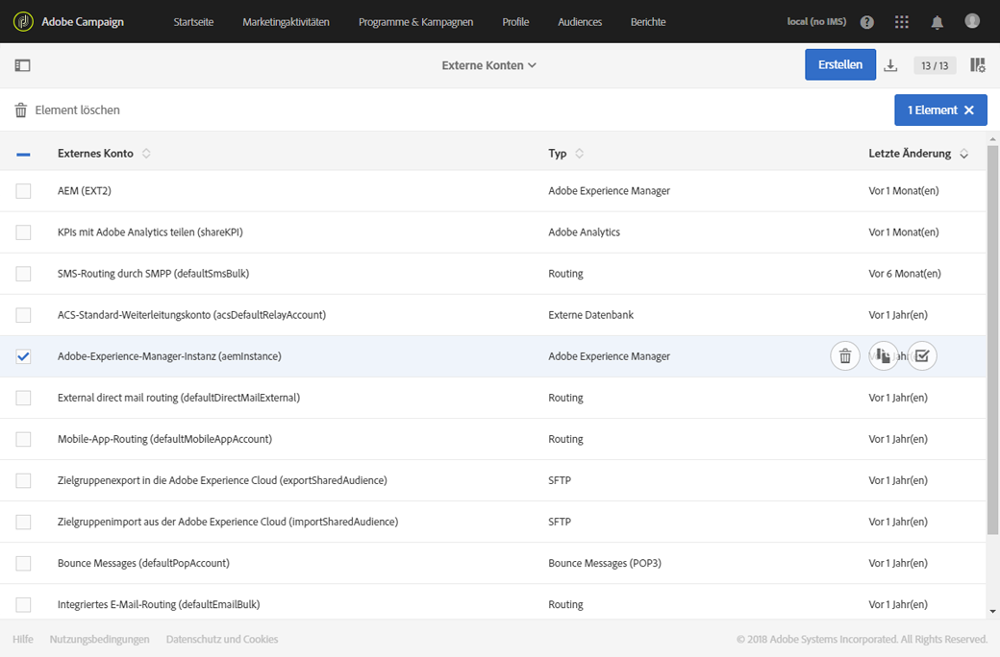
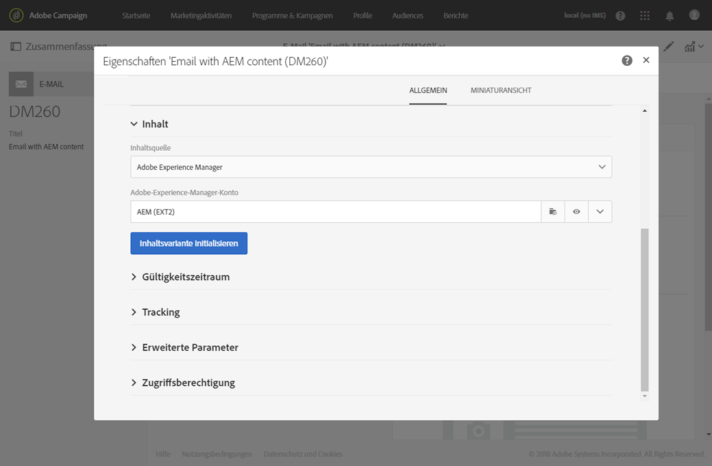
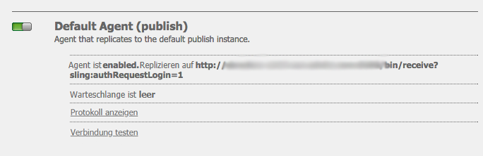
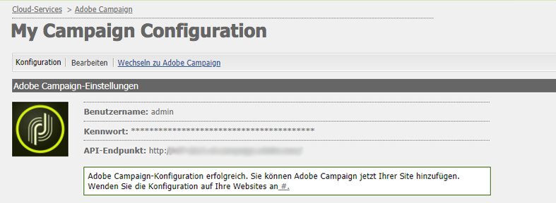
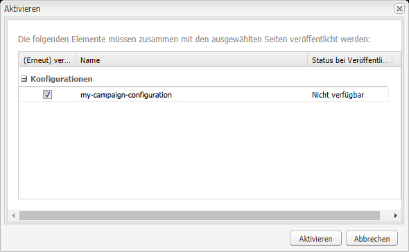

# Integrieren mit Adobe Campaign Standard{#integrating-with-adobe-campaign-standard}

>[!NOTE]
>
>In dieser Dokumentation wird beschrieben, wie Sie AEM mit Adobe Campaign Standard, der abonnementbasierten Lösung, integrieren. Wenn Sie Adobe Campaign 6.1 verwenden, finden Sie die entsprechenden Anweisungen in [Integrieren mit Adobe Campaign 6.1](/help/sites-administering/campaignonpremise.md).

Adobe Campaign ermöglicht die Verwaltung von Inhalten und Formularen für die Übermittlung per E-Mail direkt in Adobe Experience Manager.

Damit Sie beide Lösungen gleichzeitig verwenden können, müssen Sie sie zunächst miteinander verknüpfen. Dies umfasst Konfigurationsschritte in Adobe Campaign und Adobe Experience Manager. Diese Schritte werden in diesem Dokument detailliert beschrieben.

Die Arbeit mit Adobe Campaign in AEM bietet die Möglichkeit, über Adobe Campaign E-Mails und Formulare zu versenden. Dies wird beschrieben in [Arbeiten mit Adobe Campaign](/help/sites-authoring/campaign.md).

Des Weiteren sind unter Umständen die folgenden Themen relevant, wenn Sie AEM mit [Adobe Campaign](https://docs.campaign.adobe.com/doc/standard/de/home.html) integrieren:

* [Best Practices für E-Mail-Vorlagen](/help/sites-administering/best-practices-for-email-templates.md)
* [Fehlerbehebung bei der Adobe Campaign-Integration](/help/sites-administering/troubleshooting-campaignintegration.md)

Hinsichtlich der Erweiterung einer Adobe Campaign-Integration sind folgende Seiten empfehlenswert:

* [Erstellen benutzerspezifischer Erweiterungen](/help/sites-developing/extending-campaign-extensions.md)
* [Erstellen benutzerspezifischer Formular-Zuordnungen](/help/sites-developing/extending-campaign-form-mapping.md)

## Konfigurieren von Adobe Campaign {#configuring-adobe-campaign}

Die Konfiguration von Adobe Campaign umfasst Folgendes:

1. Konfiguration des Benutzers **aemserver**
1. Erstellung eines dedizierten externen Kontos
1. Überprüfung der Option „AEMResourceTypeFilter“
1. Erstellung einer dedizierten Bereitstellungsvorlage

>[!NOTE]
>
>To perform these operations, you must have the **administration** role in Adobe Campaign.

### Voraussetzungen {#prerequisites}

Stellen Sie im Voraus sicher, dass Sie über die folgenden Elemente verfügen:

* [Eine AEM-Autoreninstanz](/help/sites-deploying/deploy.md#getting-started)
* [Eine AEM-Veröffentlichungsinstanz](/help/sites-deploying/deploy.md#author-and-publish-installs)
* [Eine Adobe Campaign-Instanz](https://docs.adobe.com/content/docs/de/campaign/ACS.html)

>[!CAUTION]
>
>Operations detailed in the [Configuring Adobe Campaign](#configuring-adobe-campaign) and [Configuring Adobe Experience Manager](#configuring-adobe-experience-manager) sections are necessary for the integration functionalities between AEM and Adobe Campaign to work correctly.

### Konfigurieren des Benutzers „aemserver“{#configuring-the-aemserver-user}

The **aemserver** user must be configured in Adobe Campaign. The **aemserver** is a technical user that will be used to connect the AEM server to Adobe Campaign.

Go to **Administration** >  **Users &amp; Security** >  **Users**, and select the **aemserver** user. Klicken Sie darauf, um die Benutzereinstellungen zu öffnen.

* Sie müssen für diesen Benutzer ein Kennwort festlegen. Dies kann nicht über die Benutzeroberfläche erledigt werden. Diese Konfiguration muss von einem technischen Administrator in REST erledigt werden.
* You can assign specific roles to this user, such as **deliveryPrepare**, which allows the user to create and edit deliveries.

### Konfigurieren eines externen Adobe Experience Manager-Kontos {#configuring-an-adobe-experience-manager-external-account}

Sie müssen ein externes Konto konfigurieren, das es Ihnen ermöglicht, Adobe Campaign mit Ihrer AEM-Instanz zu verknüpfen.

>[!NOTE]
>
>Stellen Sie in AEM sicher, dass Sie das Kennwort für den Benutzer „campaign-remote“ festlegen. Sie müssen dieses Kennwort festlegen, um Adobe Campaign mit AEM zu verknüpfen. Melden Sie sich als Administrator an und wählen Sie an der Benutzeradministrationskonsole den Benutzer „campaign-remote“. Klicken Sie dann auf **Kennwort festlegen**.

Konfigurieren Sie ein externes AEM-Konto wie folgt:

1. Go to **Administration** > **Application settings** > **External accounts**.

   

1. Select the default **aemInstance** external account or create a new one by clicking the **Create** button.
1. Select **Adobe Experience Manager** i n the **Type** field and enter the access parameters used for your AEM authoring instance: server address, account name and password.

   >[!NOTE]
   >
   >Hängen Sie an die URL keinen abschließenden Schrägstrich **/** an, sonst funktioniert die Verknüpfung nicht.

1. Make sure that the **Enabled** checkbox is selected, then click **Save** to save your modifications.

### Überprüfen der Option „AEMResourceTypeFilter“{#verifying-the-aemresourcetypefilter-option}

The **AEMResourceTypeFilter** option is used to filter types of AEM resources that can be used in Adobe Campaign. Dies ermöglicht Adobe Campaign das Abrufen von AEM-Inhalten, die speziell für die ausschließliche Verwendung in Adobe Campaign entwickelt wurden.

Diese Option ist vorkonfiguriert. Falls Sie an dieser Option Änderungen vornehmen, funktioniert die Integration unter Umständen nicht.

Überprüfen Sie wie folgt, ob die Option **AEMResourceTypeFilter** konfiguriert ist:

1. Wechseln Sie zu **Administration** > **Anwendungseinstellungen** > **Optionen**.
1. In the list, you can ensure that the **AEMResourceTypeFilter** option is listed and that the paths are correct.

### Erstellen einer AEM-spezifischen E-Mail-Bereitstellungsvorlage {#creating-an-aem-specific-email-delivery-template}

Die AEM-Funktion ist in den E-Mail-Vorlagen von Adobe Campaign standardmäßig deaktiviert. Sie haben die Möglichkeit, eine neue E-Mail-Bereitstellungsvorlage für die Erstellung von E-Mails mit AEM-Inhalten zu konfigurieren.

Erstellen Sie AEM-spezifische E-Mail-Bereitstellungsvorlagen wie folgt:

1. Wechseln Sie zu **Ressourcen** > **Vorlagen** > **Bereitstellungsvorlagen**.
1. **Aktivieren Sie die Auswahl** , indem Sie auf das Kontrollkästchen in der Aktionsleiste klicken und die vorhandene Standardvorlage für **Standard-E-Mail-Nachrichten (E-Mail)** auswählen. Anschließend können Sie sie durch Klicken auf das Symbol **Kopieren** und Klicken auf **Bestätigen** Duplikat werden.
1. Disable the selection mode by clicking the **x** and open the newly created **Copy of Standard email (mail)** template, then select **Edit properties** from the action bar of the template dashboard.

   Sie können die **Beschriftung** der Vorlage ändern.

1. Legen Sie im Abschnitt **Inhalt** der Eigenschaften **Adobe Experience Manager** als **Inhaltsquelle** fest. Wählen Sie dann das zuvor erstellte externe Konto aus und klicken Sie auf **Bestätigen**.

   Speichern Sie Ihre Änderungen, indem Sie auf **Bestätigen** und anschließend auf **Speichern** klicken.

   Für die aus dieser Vorlage erstellten E-Mail-Bereitstellungen ist die AEM-Inhaltsfunktion aktiviert.

   

## Konfigurieren von Adobe Experience Manager {#configuring-adobe-experience-manager}

Zum Konfigurieren von AEM müssen Sie folgende Schritte ausführen:

* die Replikation zwischen Instanzen konfigurieren
* AEM mit Adobe Campaign verknüpfen
* den Externalizer konfigurieren

### Konfigurieren der Replikation zwischen AEM-Instanzen {#configuring-replication-between-aem-instances}

Inhalte, die in der AEM-Autoreninstanz erstellt werden, werden zunächst an die Veröffentlichungsinstanz übermittelt. Diese Veröffentlichungsinstanz übermittelt die Inhalte dann an Adobe Campaign. Der Replikationsagent muss deshalb so konfiguriert werden, dass er aus der AEM-Autoreninstanz in die AEM-Veröffentlichungsinstanz repliziert.

>[!NOTE]
>
>Möchten Sie nicht die Replikations-URL sondern stattdessen die öffentlich zugängliche URL verwenden, so haben Sie die Möglichkeit, die **Öffentliche URL** in der folgenden Konfigurationseinstellung in OSGi festzulegen (**Tools** > **Web-Konsole** > **OSGi-Konfiguration > AEM-Kampagnenintegration – Konfiguration**):
**Öffentliche URL:** com.day.cq.mcm.Kampagne.impl.IntegrationConfigImpl#aem.mcm.Kampagne.publicUrl

Dieser Schritt ist auch erforderlich, um bestimmte Autoreninstanzkonfigurationen in die Veröffentlichungsinstanz zu replizieren.

So konfigurieren Sie die Replikation zwischen AEM-Instanzen:

1. From the authoring instance, select **AEM logo**> **Tools** > **Deployment** > **Replication** > **Agents on author**, then click **Default Agent**.

   

   >[!NOTE]
   Verwenden Sie nach Möglichkeit nicht localhost (eine lokale Kopie von AEM), wenn Sie die Integration mit Adobe Campaign konfigurieren, außer die Veröffentlichungs- und Autoreninstanz befinden sich auf demselben Computer.

1. Click **Edit** then select the **Transport** tab.
1. Konfigurieren Sie den URI, indem Sie **localhost** durch die IP-Adresse oder die Adresse der AEM-Veröffentlichungsinstanz ersetzen.

   

### Verknüpfen von AEM mit Adobe Campaign {#connecting-aem-to-adobe-campaign}

Bevor Sie AEM und Adobe Campaign zusammen verwenden können, müssen Sie die beiden Lösungen verknüpfen, damit sie miteinander kommunizieren können.

1. Stellen Sie eine Verbindung mit Ihrer AEM-Autoreninstanz her.
1. Select **Tools** > **Operations** > **Cloud** > **Cloud Services**, then **Configure now** in the Adobe Campaign section.

   

1. Create a new configuration by entering a **Title** and click **Create**, or choose the existing configuration that you want to link with your Adobe Campaign instance.
1. Passen Sie die Konfiguration so an, dass sie den Parametern Ihrer Adobe Campaign-Instanz entspricht.

   * **Benutzername**: **aemserver**, der Adobe Campaign-AEM-Integrationspaket-Operator, mit dem die Verknüpfung zwischen den beiden Lösungen hergestellt wird.
   * **Kennwort**: Das Adobe Campaign-Kennwort des aemserver-Operators. Unter Umständen müssen Sie das Kennwort für diesen Operator direkt in Adobe Campaign erneut angeben.
   * **API-Endpunkt**: URL der Adobe Campaign-Instanz.

1. Select **Connect to Adobe Campaign** and click **OK**.

   

   >[!NOTE]
   Nachdem Sie [die E-Mail erstellt und veröffentlicht haben](/help/sites-authoring/campaign.md), müssen Sie die Konfiguration auf der Veröffentlichungsinstanz erneut veröffentlichen.

   

>[!NOTE]
Prüfen Sie Folgendes, falls die Verbindung nicht hergestellt werden kann:
* Möglicherweise tritt ein Zertifikatfehler auf, wenn Sie eine sichere Verbindung (https) mit einer Adobe Campaign-Instanz herstellen. Sie müssen das Adobe Campaign-Instanzzertifikat der **cacerts **Datei Ihres JDK hinzufügen.
* Weitere Informationen finden Sie in [Fehlerbehebung bei der AEM/Adobe Campaign-Integration](/help/sites-administering/troubleshooting-campaignintegration.md).

### Konfigurieren des Externalizers {#configuring-the-externalizer}

Sie müssen [den Externalizer](/help/sites-developing/externalizer.md) in AEM auf der Autoreninstanz konfigurieren. Der Externalizer ist ein OSGi-Dienst, der es Ihnen ermöglicht, Ressourcenpfade in externe, absolute URLs umzuwandeln. Dieser Dienst bietet einen zentralen Ort für die Konfiguration und Erstellung von externen URLs.

Allgemeine Anweisungen finden Sie unter [Konfigurieren des Externalizers](/help/sites-developing/externalizer.md). For the Adobe Campaign integration, make sure you configure the publish server at `https://<host>:<port>/system/console/configMgr/com.day.cq.commons.impl.ExternalizerImpl` not point to `localhost:4503` but to a server that is reachable by the Adobe Campaign console.

Wenn er auf `localhost:4503` oder einen anderen Server, den Adobe Campaign nicht erreichen kann, verweist, werden Ihre Bilder auf der Adobe Campaign-Konsole nicht angezeigt.

