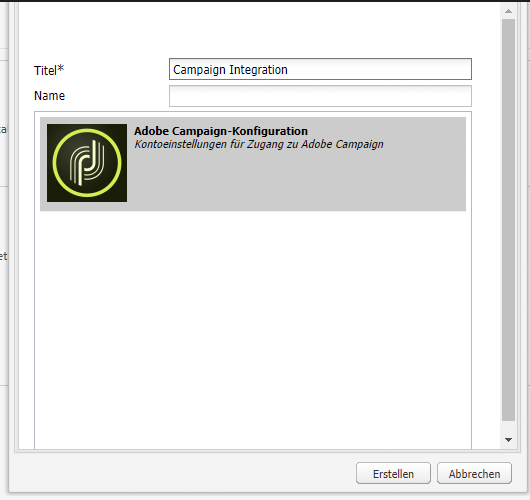

# Integrieren mit Adobe Campaign Standard {#integrating-with-adobe-campaign-standard}

Durch die Integration von AEM mit Adobe Campaign können Sie E-Mail-Versand, Inhalt und Formulare direkt in AEM verwalten. Konfigurationsschritte sowohl in Adobe Campaign Standard als auch AEM sind erforderlich, um eine bidirektionale Kommunikation zwischen Lösungen zu ermöglichen.

Durch diese Integration können AEM und Adobe Campaign Standard unabhängig verwendet werden. Marketingexperten können Kampagnen erstellen und Targeting in Adobe Campaign verwenden, während Ersteller von Inhalten parallel an der Inhaltserstellung in AEM arbeiten können. Mithilfe der Integration können Inhalt und Design der in AEM erstellten Kampagne zielgerichtet und von Adobe Campaign bereitgestellt werden.

## Integrationsschritte {#integration-steps}

Die Konfiguration der Integration zwischen AEM und Adobe Campaign Standard erfordert eine Reihe von Schritten in beiden Lösungen.

1. [Konfigurieren Sie die ](#aemserver-user)
1. [Überprüfen Sie die ](#resource-type-filter)
1. [Erstellen einer AEM spezifischen E-Mail-Versandvorlage in Campaign](#aem-email-delivery-template)
1. [Konfigurieren der Campaign-Integration in AEM](#campaign-integration)
1. [Konfigurieren der Replikation für die AEM-Veröffentlichungsinstanz](#replication)
1. [Konfigurieren des AEM-Externalizers](#externalizer)
1. [Konfigurieren Sie die ](#campaign-remote-user)
1. [Konfigurieren des AEM externen Kontos in Campaign](#acc-external-user)

Dieses Dokument führt Sie im Detail durch die einzelnen Schritte.

## Voraussetzungen {#prerequisites}

* Administratorzugriff auf Adobe Campaign Standard
   * Weitere Informationen zum Einrichten und Konfigurieren von Adobe Campaign Standard finden Sie im Abschnitt [Dokumentation zu Adobe Campaign Standard.](https://experienceleague.adobe.com/docs/campaign-standard/using/campaign-standard-home.html)
* Administratorzugriff auf AEM

## Konfigurieren des aemserver-Benutzers in Campaign {#aemserver-user}

Adobe Campaign Standard enthält standardmäßig eine `aemserver` Benutzer, der AEM verwendet, um eine Verbindung zu Adobe Campaign herzustellen. Sie müssen diesem Benutzer eine entsprechende Sicherheitsgruppe zuweisen und sein Kennwort festlegen.

1. Melden Sie sich bei Adobe Campaign als Administrator an.

1. Tippen oder klicken Sie oben links in der Menüleiste auf das Adobe Campaign-Logo, um die globale Navigation zu öffnen. Wählen Sie dann **Administration** > **Benutzer und Sicherheit** > **Benutzer** über das Navigationsmenü.

1. Tippen oder klicken Sie auf `aemserver` Benutzer in der Benutzerkonsole.

1. Stellen Sie sicher, dass `aemserver` Der Benutzer wird mindestens einer Sicherheitsgruppe zugewiesen, die über die Rolle verfügt `deliveryPrepare` zugewiesen wurde. Standardmäßig wird die Gruppe `Standard Users` hat diese Rolle.

   

1. Tippen oder klicken Sie auf **Speichern** , um die Änderungen zu speichern.

Ihre `aemserver` Der Benutzer verfügt jetzt über die erforderlichen Berechtigungen, damit AEM ihn für die Kommunikation mit Adobe Campaign verwenden können.

Bevor AEM jedoch die `aemserver` -Benutzer, muss sein Kennwort festgelegt sein. Dies kann nicht über Adobe Campaign erfolgen. Sie muss von einem Adobe Support Engineer durchgeführt werden. [Bitte erstellen Sie ein Ticket bei der Adobe-Kundenunterstützung](https://experienceleague.adobe.com/?support-tab=home&amp;lang=de#support) , um das Zurücksetzen der `aemserver` Kennwort. Wenn Sie das Kennwort von der Adobe-Kundenunterstützung erhalten haben, halten Sie es an einem sicheren Ort.

## Überprüfen des AEMResourceTypeFilters in Campaign {#resource-type-filter}

Die `AEMResourceTypeFilter` ist eine Option in Adobe Campaign, die zum Filtern AEM Ressourcen verwendet wird, die in Adobe Campaign verwendet werden können. Da AEM viele Inhalte enthält, dient diese Option als Filter, mit dem Adobe Campaign nur die AEM Inhalte von Typen abrufen kann, die speziell für die Verwendung in Adobe Campaign entwickelt wurden.

Diese Option ist vorkonfiguriert. Sie müssen sie jedoch möglicherweise aktualisieren, wenn Sie die Campaign-Komponenten von AEM angepasst haben. So stellen Sie sicher, dass `AEMResourceTypeFilter` -Option konfiguriert ist, führen Sie die folgenden Schritte aus.

1. Melden Sie sich bei Adobe Campaign als Administrator an.

1. Tippen oder klicken Sie oben links in der Menüleiste auf das Adobe Campaign-Logo, um die globale Navigation zu öffnen. Wählen Sie dann **Administration** > **Anwendungseinstellungen** > **Optionen** über das Navigationsmenü.

1. Tippen oder klicken Sie auf `AEMResourceTypeFilter` in der Optionskonsole.

1. Validieren Sie die Konfiguration der `AEMResourceTypeFilter`. Die Pfade sind durch Kommas getrennt und enthalten standardmäßig Folgendes:

   * `mcm/campaign/components/newsletter`
   * `mcm/campaign/components/campaign_newsletterpage`
   * `mcm/neolane/components/newsletter`

   

1. Tippen oder klicken Sie auf **Speichern** , um die Änderungen zu speichern.

Ihre `AEMResourceTypeFilter` ist jetzt so konfiguriert, dass der richtige Inhalt von AEM abgerufen wird.

## Erstellen einer AEM spezifischen E-Mail-Versandvorlage in Campaign {#aem-email-delivery-template}

Standardmäßig ist AEM in den E-Mail-Vorlagen von Adobe Campaign nicht aktiviert. Sie müssen eine neue E-Mail-Versandvorlage konfigurieren, mit der E-Mails mit AEM Inhalt erstellt werden können. Gehen Sie wie folgt vor, um eine AEM spezifische E-Mail-Versandvorlage zu erstellen.

1. Melden Sie sich bei Adobe Campaign als Administrator an.

1. Tippen oder klicken Sie oben links in der Menüleiste auf das Adobe Campaign-Logo, um die globale Navigation zu öffnen. Wählen Sie dann **Ressourcen** > **Vorlagen** > **Versandvorlagen** über das Navigationsmenü.

1. Suchen Sie in der Versandvorlagen-Konsole die Standard-E-Mail-Vorlage . **Per E-Mail versenden (Mail)** und bewegen Sie den Mauszeiger über die Karte (oder die Linie), die diese darstellt, um die Optionen anzuzeigen. Klicken **Element duplizieren**.

   

1. Im **Bestätigung** dialog, klicken Sie **Bestätigen** , um die Vorlage zu duplizieren.

   

1. Der Vorlageneditor wird mit Ihrer Kopie der **Per E-Mail versenden (Mail)** Vorlage. Klicken Sie auf **Eigenschaften bearbeiten** rechts oben im Fenster.

   

1. Ändern Sie im Eigenschaftenfenster die **Titel** -Feld, um Ihre neue AEM zu beschreiben.

1. Klicken Sie auf **Inhalt** Überschrift zum Erweitern und Auswählen **Adobe Experience Manager** im **Inhaltsquelle** Dropdown-Liste.

1. Dies zeigt die **Adobe Experience Manager-Konto** -Feld. Wählen Sie mithilfe der Dropdown-Liste **Adobe Experience Manager-Instanz (aemInstance)** Benutzer. Dies ist der standardmäßige externe Benutzer für die AEM Integration.

1. Klicken **Bestätigen** , um die Änderungen an den Eigenschaften zu speichern.

1. Klicken Sie im Vorlageneditor auf **Speichern** , um Ihre geänderte Kopie der E-Mail-Vorlage zur Verwendung mit AEM zu speichern.

Sie verfügen nun über eine E-Mail-Vorlage, die AEM Inhalt verwenden kann.

## Konfigurieren der Campaign-Integration in AEM {#campaign-integration}

AEM kommuniziert mit Adobe Campaign mithilfe einer integrierten Integration und dem `aemserver` -Benutzer, den Sie in Adobe Campaign konfiguriert haben. Führen Sie diese Schritte aus, um diese Integration zu konfigurieren.

1. Melden Sie sich bei Ihrer AEM Authoring-Instanz als Admin an.

1. Wählen Sie in der Seitenleiste der globalen Navigation die Option **Instrumente** > **Cloud Services** > **Ältere Cloud Services** > **Adobe Campaign** und klicken Sie auf **Jetzt konfigurieren**.

   

1. Erstellen Sie im Dialogfeld eine Campaign-Service-Konfiguration, indem Sie einen **Titel** eingeben und auf **Erstellen** klicken.

   

1. Ein neues Fenster und Dialogfeld wird geöffnet, um die Konfiguration zu bearbeiten. Geben Sie die folgenden Informationen ein.

   * **Benutzername** - Dies ist [die `aemserver` Benutzer in Adobe Campaign, den Sie in einem vorherigen Schritt konfiguriert haben.](#aemserver-user) Standardgemäß ist dies `aemserver`.
   * **Passwort** - Dies ist das Kennwort für [die `aemserver` -Benutzer in Adobe Campaign, den Sie in einem vorherigen Schritt von der Adobe-Kundenunterstützung angefordert haben.](#aemserver-user)
   * **API-Endpunkt** - Dies ist die Adobe Campaign-Instanz-URL.

   

1. Wählen Sie **Verbindung zu Adobe Campaign herstellen** aus, um die Verbindung zu überprüfen, und klicken Sie dann auf **OK**.

AEM kann jetzt mit Adobe Campaign kommunizieren.

>[!NOTE]
>
>Stellen Sie sicher, dass Ihr Adobe Campaign-Server über das Internet erreichbar ist. AEM können nicht auf private Netzwerke zugreifen.

## Konfigurieren der Replikation für die AEM-Veröffentlichungsinstanz {#replication}

Kampagneninhalte werden von Inhaltsautoren in der AEM-Autoreninstanz erstellt. Diese Instanz ist in der Regel nur intern in Ihrem Unternehmen verfügbar. Damit die Empfänger Ihrer Kampagne auf Inhalte wie Bilder und Assets zugreifen können, müssen Sie diese Inhalte veröffentlichen.

Der Replikationsagent ist für die Veröffentlichung Ihres Inhalts aus der AEM-Autoreninstanz in der Veröffentlichungsinstanz verantwortlich und muss eingerichtet werden, damit die Integration ordnungsgemäß funktioniert. Dieser Schritt ist auch erforderlich, um bestimmte Autoreninstanzkonfigurationen in die Veröffentlichungsinstanz zu replizieren.

So konfigurieren Sie die Replikation von Ihrer AEM-Autoreninstanz zur Veröffentlichungsinstanz:

1. Melden Sie sich bei Ihrer AEM Authoring-Instanz als Admin an.

1. Wählen Sie in der Seitenleiste der globalen Navigation die Option **Instrumente** > **Implementierung** > **Replikation** > **Agenten für Autor**, tippen oder klicken Sie dann auf **Standardagent (publish)**.

   

1. Tippen oder klicken Sie auf **Bearbeiten** und wählen Sie dann die Registerkarte **Transport** aus.

1. Konfigurieren Sie die **URI** -Feld durch Ersetzen der Standardeinstellung `localhost` -Wert mit der IP-Adresse der AEM Veröffentlichungsinstanz.

   

1. Tippen oder klicken Sie auf **OK** , um die Änderungen an den Agenteneinstellungen zu speichern.

Sie haben die Replikation zur AEM Veröffentlichungsinstanz konfiguriert, damit Ihre Kampagnenempfänger auf Ihren Inhalt zugreifen können.

>[!NOTE]
>
>Wenn Sie nicht die Replikations-URL, sondern die öffentlich zugängliche URL verwenden möchten, können Sie die öffentliche URL in der folgenden Konfigurationseinstellung über OSGi festlegen
>
>Wählen Sie in der Seitenleiste der globalen Navigation die Option **Instrumente** > **Aktivitäten** > **Web-Konsole** > **OSGi-Konfiguration** und suchen Sie nach **AEM Campaign-Integration - Konfiguration**. Konfiguration bearbeiten und Feld ändern **Öffentliche URL** (`com.day.cq.mcm.campaign.impl.IntegrationConfigImpl#aem.mcm.campaign.publicUrl`).

## Konfigurieren des AEM-Externalizers {#externalizer}

[Der Externalizer ist ein OSGi-Service in AEM, der einen Ressourcenpfad in eine externe und absolute URL umwandelt, was erforderlich ist, damit AEM für Campaign geeignete Inhalte bereitstellen kann. ](/help/sites-developing/externalizer.md) Sie müssen dies konfigurieren, damit die Campaign-Integration funktioniert.

1. Melden Sie sich bei der AEM Authoring-Instanz als Admin an.
1. Wählen Sie in der Seitenleiste der globalen Navigation die Option **Instrumente** > **Aktivitäten** > **Web-Konsole** > **OSGi-Konfiguration** und suchen Sie nach **Day CQ Link Externalizer**.
1. Standardmäßig wird der letzte Eintrag im **Domänen** -Feld ist für die Veröffentlichungsinstanz vorgesehen. Ändern der URL von der Standardeinstellung `http://localhost:4503` auf Ihre öffentlich verfügbare Veröffentlichungsinstanz.

   

1. Tippen oder klicken Sie auf **Speichern**.

Sie haben den Externalizer konfiguriert und Adobe Campaign kann jetzt auf Ihre Inhalte zugreifen.

>[!NOTE]
Die Veröffentlichungsinstanz muss vom Adobe Campaign-Server aus erreichbar sein. Wenn `localhost:4503` oder einem anderen Server, auf den Adobe Campaign nicht zugreifen kann, werden keine Bilder von AEM in der Adobe Campaign-Konsole angezeigt.

## Konfigurieren des Campaign-Remote-Benutzers in AEM {#campaign-remote-user}

Genau wie Sie einen Benutzer in Adobe Campaign benötigen, der für die Kommunikation mit Adobe Campaign verwendet AEM, benötigt Adobe Campaign auch einen Benutzer in AEM für die Kommunikation mit AEM. Standardmäßig erstellt die Campaign-Integration die `campaign-remote` Benutzer in AEM. Führen Sie diese Schritte aus, um diesen Benutzer zu konfigurieren.

1. Melden Sie sich in AEM als Admin an.
1. Klicken Sie in der Hauptnavigationskonsole in der linken Leiste auf **Tools**.
1. Klicken Sie anschließend auf **Sicherheit** > **Benutzer** , um die Benutzeradministrationskonsole zu öffnen.
1. Suchen Sie den `campaign-remote`-Benutzer.
1. Wählen Sie den `campaign-remote`-Benutzer aus und klicken Sie auf **Eigenschaften**, um den Benutzer zu bearbeiten.
1. Klicken Sie im Fenster **Benutzereinstellungen bearbeiten** auf **Kennwort ändern**.
1. Geben Sie ein neues Kennwort für den Benutzer ein und notieren Sie das Kennwort an einem sicheren Ort für die zukünftige Verwendung.
1. Klicken Sie auf **Speichern**, um die Kennwortänderung zu speichern.
1. Klicken Sie auf **Speichern und schließen**, um die Änderungen am `campaign-remote`-Benutzer zu speichern.

## Konfigurieren des AEM externen Kontos in Campaign {#acc-external-user}

Wenn Sie [eine AEM spezifische E-Mail-Versandvorlage erstellt,](#aem-email-delivery-template) Sie festgelegt haben, dass die Vorlage die `aemInstance` externes Konto zur Kommunikation mit AEM. Um die bidirektionale Kommunikation zwischen beiden Lösungen zu ermöglichen, müssen Sie dieses Konto in Adobe Campaign konfigurieren.

1. Melden Sie sich bei Adobe Campaign als Administrator an.

1. Tippen oder klicken Sie oben links in der Menüleiste auf das Adobe Campaign-Logo, um die globale Navigation zu öffnen. Wählen Sie dann **Administration** > **Anwendungseinstellungen** > **Externe Konten** über das Navigationsmenü.

1. Tippen oder klicken Sie auf **Adobe Experience Manager-Instanz (aemInstance)** Benutzer in der Benutzerkonsole.

1. Stellen Sie sicher, dass der Benutzer **Adobe Experience Manager** als **Typ**.

1. Im **Verbindung** definieren Sie die folgenden Felder:

   1. Server: Dies ist die URL Ihres AEM Authoring-Servers. Dies sollte nicht mit einem Schrägstrich enden.
   1. Konto: Dies ist die `campaign-remote` Benutzer [zuvor in AEM konfiguriert.](#campaign-remote-user)
   1. Kennwort: Dies ist das Kennwort für die `campaign-remote`Benutzer [zuvor in AEM konfiguriert.](#campaign-remote-user)

   

1. Stellen Sie sicher, dass **Aktiviert** aktivieren und dann auf **Speichern** , um Ihre Änderungen zu speichern.

Herzlichen Glückwunsch! Sie haben die Integration zwischen AEM und Adobe Campaign Standard abgeschlossen.

## Nächste Schritte {#next-steps}

Nachdem sowohl Adobe Campaign Classic als auch AEM konfiguriert wurden, ist die Integration nun abgeschlossen.

Sie können jetzt erfahren, wie Sie einen Newsletter in Adobe Experience Manager erstellen, indem Sie mit [diesem Dokument](/help/sites-authoring/campaign.md) fortfahren.
