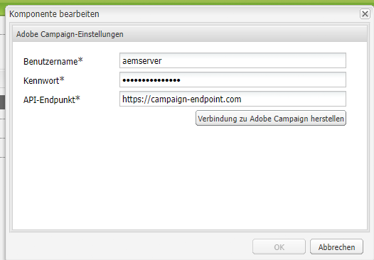

# Integrieren von AEM 6.5 mit Adobe Campaign Standard {#integrating-with-adobe-campaign-standard}

Durch die Integration von AEM 6.5 mit Adobe Campaign Standard (ACS) können Sie E-Mail-Versand, Inhalte und Formulare direkt in AEM verwalten. Zur bidirektionalen Kommunikation zwischen Lösungen sind Konfigurationsschritte sowohl in Adobe Campaign Standard als auch AEM erforderlich.

Durch diese Integration können AEM und Adobe Campaign Standard unabhängig voneinander verwendet werden. Marketing-Experten können in Adobe Campaign Kampagnen erstellen und Targeting verwenden, während Ersteller von Inhalten parallel an der Inhaltserstellung in AEM arbeiten können. Durch die Integration können Inhalt und Design der in AEM erstellten Kampagne zielgerichtet über Adobe Campaign bereitgestellt werden.

>[!INFO]
>
>In diesem Dokument wird beschrieben, wie Sie Adobe Campaign Standard mit AEM 6.5 integrieren. Weiterführende Informationen zu anderen Campaign-Integrationen finden Sie im Dokument [Integrieren von AEM 6.5 in Adobe Campaign](campaign.md).

## Integrationsschritte {#integration-steps}

Die Konfiguration der Integration zwischen AEM und Adobe Campaign Standard erfordert mehrere Schritte in beiden Lösungen.

1. [Konfigurieren Sie die ](#aemserver-user)
1. [Überprüfen Sie die ](#resource-type-filter)
1. [Erstellen einer AEM-spezifischen E-Mail-Versandvorlage in Campaign](#aem-email-delivery-template)
1. [Konfigurieren der Campaign-Integration in AEM](#campaign-integration)
1. [Konfigurieren der Replikation für die AEM-Veröffentlichungsinstanz](#replication)
1. [Konfigurieren des AEM-Externalizers](#externalizer)
1. [Konfigurieren Sie die ](#campaign-remote-user)
1. [Konfigurieren des externen AEM-Kontos in Campaign](#acc-external-user)

Dieses Dokument führt Sie im Detail durch die einzelnen Schritte.

## Voraussetzungen {#prerequisites}

* Administratorzugriff auf Adobe Campaign Standard
   * Weitere Informationen zum Einrichten und Konfigurieren von Adobe Campaign Standard finden Sie unter [Dokumentation zu Adobe Campaign Standard.](https://experienceleague.adobe.com/docs/campaign-standard/using/campaign-standard-home.html?lang=de)
* Administratorzugriff auf AEM

## Konfigurieren des aemserver-Benutzers in Campaign {#aemserver-user}

Adobe Campaign Standard enthält standardmäßig einen `aemserver`-Benutzer, den AEM verwendet, um eine Verbindung zu Adobe Campaign herzustellen. Weisen Sie diesem Benutzer eine entsprechende Sicherheitsgruppe zu und legen Sie sein Kennwort fest.

1. Melden Sie sich bei Adobe Campaign als Administrator an.

1. Klicken Sie auf das Adobe Campaign-Logo oben links in der Menüleiste, um die globale Navigation zu öffnen, und wählen Sie dann **Administration** > **Benutzer und Sicherheit** > **Benutzer** über das Navigationsmenü aus.

1. Klicken Sie auf `aemserver` Benutzer in der Benutzerkonsole.

1. Stellen Sie sicher, dass der `aemserver`-Benutzer mindestens einer Sicherheitsgruppe zugewiesen ist, die über die Rolle `deliveryPrepare` verfügt. Standardmäßig hat die Gruppe `Standard Users` diese Rolle.

   

1. Klicken Sie auf **Speichern**, um die Änderungen zu speichern.

Ihr `aemserver`-Benutzer verfügt jetzt über die erforderlichen Berechtigungen, damit AEM ihn für die Kommunikation mit Adobe Campaign verwenden kann.

Bevor AEM jedoch den `aemserver`-Benutzer verwenden kann, muss sein Kennwort festgelegt sein. Dies kann nicht über Adobe Campaign erfolgen. Es muss von einem Support-Techniker von Adobe durchgeführt werden. [Senden eines Tickets an die Adobe-Kundenunterstützung](https://experienceleague.adobe.com/?support-tab=home&amp;lang=de#support) , um das Zurücksetzen der `aemserver` Kennwort. Sobald Sie das Kennwort von der Adobe-Kundenunterstützung haben, halten Sie es an einem sicheren Ort.

## Überprüfen der Option „AEMResourceTypeFilter“ in Campaign {#resource-type-filter}

`AEMResourceTypeFilter` ist eine Option in Adobe Campaign, die zum Filtern von AEM-Ressourcen verwendet wird, die in Adobe Campaign verwendet werden können. Da AEM viele Inhalte enthält, dient diese Option als Filter, mit dem Adobe Campaign nur die AEM Inhalte von Typen abrufen kann, die speziell für die Verwendung in Adobe Campaign entwickelt wurden.

Diese Option ist vorkonfiguriert. Sie müssen sie jedoch möglicherweise aktualisieren, wenn Sie die Campaign-Komponenten von AEM angepasst haben. Um sicherzustellen, dass die Option `AEMResourceTypeFilter` konfiguriert ist, führen Sie die folgenden Schritte aus.

1. Melden Sie sich bei Adobe Campaign als Administrator an.

1. Klicken Sie auf das Adobe Campaign-Logo oben links in der Menüleiste, um die globale Navigation zu öffnen, und wählen Sie dann **Administration** > **Anwendungseinstellungen** > **Optionen** über das Navigationsmenü aus.

1. Klicken Sie auf `AEMResourceTypeFilter` in der Optionskonsole.

1. Bestätigen Sie die Konfiguration von `AEMResourceTypeFilter`. Die Pfade sind durch Kommas getrennt und enthalten standardmäßig Folgendes:

   * `mcm/campaign/components/newsletter`
   * `mcm/campaign/components/campaign_newsletterpage`
   * `mcm/neolane/components/newsletter`

   

1. Klicken Sie auf **Speichern**, um die Änderungen zu speichern.

Ihr `AEMResourceTypeFilter` ist jetzt so konfiguriert, dass der richtige Inhalt von AEM abgerufen wird.

## Erstellen einer AEM-spezifischen E-Mail-Versandvorlage in Campaign {#aem-email-delivery-template}

Standardmäßig ist AEM in den E-Mail-Vorlagen von Adobe Campaign nicht aktiviert. Konfigurieren Sie eine neue E-Mail-Versandvorlage, mit der E-Mails mit AEM Inhalt erstellt werden können. Gehen Sie wie folgt vor, um eine AEM-spezifische E-Mail-Versandvorlage zu erstellen.

1. Melden Sie sich bei Adobe Campaign als Administrator an.

1. Klicken Sie auf das Adobe Campaign-Logo oben links in der Menüleiste, um die globale Navigation zu öffnen, und wählen Sie dann **Ressourcen** > **Vorlagen** > **Versandvorlagen** über das Navigationsmenü aus.

1. Suchen Sie in der Versandvorlagen-Konsole die Standard-E-Mail-Vorlage **Per E-Mail versenden (Mail)** und bewegen Sie den Mauszeiger über die Karte (oder die Linie), die ihr entspricht, um die Optionen anzuzeigen. Klicken Sie auf **Element duplizieren**.

   

1. Klicken Sie im **Bestätigungsdialog** auf **Bestätigen**, um die Vorlage zu duplizieren.

   

1. Der Vorlageneditor wird mit Ihrer Kopie der Vorlage **Per E-Mail versenden (Mail)** geöffnet. Klicken Sie auf das Symbol **Eigenschaften bearbeiten** rechts oben im Fenster.

   

1. Ändern Sie im Eigenschaftenfenster das Feld **Bezeichnung**, sodass es Ihre neue AEM-Vorlage beschreibt.

1. Klicken Sie auf die Überschrift **Inhalt**, um es zu erweitern, und wählen Sie **Adobe Experience Manager** in der Dropdown-Liste **Inhaltsquelle** aus.

1. Dadurch wird das Feld **Adobe Experience Manager-Konto** angezeigt. Wählen Sie in der Dropdown-Liste den Benutzer **Adobe Experience Manager-Instanz (aemInstance)** aus. Dies ist der standardmäßige externe Benutzer für die AEM Integration.

1. Klicken Sie auf **Bestätigen**, um die Änderungen an den Eigenschaften zu speichern.

1. Klicken Sie im Vorlageneditor auf **Speichern**, um Ihre geänderte Kopie der E-Mail-Vorlage zur Verwendung mit AEM zu speichern.

Sie verfügen nun über eine E-Mail-Vorlage, die AEM-Inhalte verwenden kann.

## Konfigurieren der Campaign-Integration in AEM {#campaign-integration}

AEM kommuniziert mit Adobe Campaign mithilfe einer vorhandenen Integration und dem `aemserver`-Benutzer, den Sie in Adobe Campaign konfiguriert haben. Führen Sie diese Schritte aus, um diese Integration zu konfigurieren.

1. Melden Sie sich bei Ihrer AEM Authoring-Instanz als Admin an.

1. Wählen Sie in der Seitenleiste der globalen Navigation die Option **Instrumente** > **Cloud Services** > **Ältere Cloud Services** > **Adobe Campaign** und klicken Sie auf **Jetzt konfigurieren**.

   

1. Erstellen Sie im Dialogfeld eine Campaign-Service-Konfiguration, indem Sie einen **Titel** eingeben und auf **Erstellen** klicken.

   

1. Ein neues Fenster und Dialogfeld wird geöffnet, um die Konfiguration zu bearbeiten. Geben Sie die folgenden Informationen ein.

   * **Benutzername**: Dies ist [der `aemserver`-Benutzer in Adobe Campaign, den Sie in einem vorherigen Schritt konfiguriert haben.](#aemserver-user) Standardgemäß ist dies `aemserver`.
   * **Kennwort**: Dies ist das Kennwort für [den `aemserver`-Benutzer in Adobe Campaign, den Sie in einem vorherigen Schritt von der Adobe-Kundenunterstützung angefordert haben.](#aemserver-user)
   * **API-Endpunkt** - Dies ist die Adobe Campaign-Instanz-URL.

   

1. Wählen Sie **Verbindung zu Adobe Campaign herstellen** aus, um die Verbindung zu überprüfen, und klicken Sie dann auf **OK**.

AEM kann jetzt mit Adobe Campaign kommunizieren.

>[!NOTE]
>
>Stellen Sie sicher, dass Ihr Adobe Campaign-Server über das Internet erreichbar ist. AEM können nicht auf private Netze zugreifen.

## Konfigurieren der Replikation für die AEM-Veröffentlichungsinstanz {#replication}

Campaign-Inhalte werden von Autorinnen und Autoren von Inhalten in der AEM-Autoreninstanz erstellt. Diese Instanz ist in der Regel in Ihrer Organisation nur intern verfügbar. Damit die Empfängerinnen und Empfänger Ihrer Kampagne auf Inhalte wie Bilder und Assets zugreifen können, müssen Sie diese Inhalte veröffentlichen.

Der Replikationsagent ist für die Veröffentlichung Ihres Inhalts aus der AEM-Autoreninstanz zur Veröffentlichungsinstanz verantwortlich und muss eingerichtet werden, damit die Integration ordnungsgemäß funktioniert. Dieser Schritt ist auch erforderlich, um bestimmte Autoreninstanzkonfigurationen in die Veröffentlichungsinstanz zu replizieren.

So konfigurieren Sie die Replikation von Ihrer AEM-Autoreninstanz zur Veröffentlichungsinstanz:

1. Melden Sie sich bei Ihrer AEM-Autoreninstanz als Admin an.

1. Wählen Sie in der Seitenleiste der globalen Navigation die Option **Instrumente** > **Implementierung** > **Replikation** > **Agenten für Autor** Klicken Sie auf **Standardagent (publish)**.

   

1. Klicken Sie auf **Bearbeiten** und wählen Sie dann die Registerkarte **Transport** aus.

1. Konfigurieren Sie das Feld **URI**, indem Sie die Standardeinstellung des `localhost`-Werts durch die IP-Adresse der AEM-Veröffentlichungsinstanz ersetzen.

   

1. Klicks **OK** , um die Änderungen an den Agenteneinstellungen zu speichern.

Sie haben die Replikation zur AEM-Veröffentlichungsinstanz konfiguriert, damit Ihre Kampagnenempfängerinnen und -empfänger auf Ihren Inhalt zugreifen können.

>[!NOTE]
>
>Wenn Sie nicht die Replikations-URL, sondern die öffentlich zugängliche URL verwenden möchten, können Sie die öffentliche URL in der folgenden Konfigurationseinstellung über OSGi festlegen
>
>Wählen Sie in der globalen Navigationleiste die Option **Tools** > **Aktivitäten** > **Web-Konsole** > **OSGi-Konfiguration** und suchen Sie nach **AEM Campaign-Integration – Konfiguration**. Bearbeiten Sie die Konfiguration und ändern Sie das Feld **Öffentliche URL** (`com.day.cq.mcm.campaign.impl.IntegrationConfigImpl#aem.mcm.campaign.publicUrl`).

## Konfigurieren des AEM-Externalizers {#externalizer}

[Der Externalizer](/help/sites-developing/externalizer.md) ist ein OSGi-Service in AEM, der einen Ressourcenpfad in eine externe und absolute URL umwandelt, was erforderlich ist, damit AEM für Campaign geeignete Inhalte bereitstellen kann. Konfigurieren Sie sie so, dass die Campaign-Integration funktioniert.

1. Melden Sie sich bei der AEM-Autoreninstanz als Admin an.
1. Wählen Sie in der globalen Navigationsleiste die Option **Tools** > **Vorgänge** > **Web-Konsole** > **OSGi-Konfiguration** und suchen Sie nach **Day CQ Link Externalizer**.
1. Standardmäßig ist der letzte Eintrag im Feld **Domains** für die Veröffentlichungsinstanz vorgesehen. Ändern der URL von der Standardeinstellung `http://localhost:4503` an Ihre öffentlich verfügbare Veröffentlichungsinstanz.

   

1. Klicken Sie auf **Speichern**.

Sie haben den Externalizer konfiguriert, und Adobe Campaign kann nun auf Ihre Inhalte zugreifen.

>[!NOTE]
>
Die Veröffentlichungsinstanz muss vom Adobe Campaign-Server aus erreichbar sein. Falls sie auf `localhost:4503` oder einen anderen Server verweist, den Adobe Campaign nicht erreichen kann, werden Bilder von AEM nicht auf der Adobe Campaign-Konsole angezeigt.

## Konfigurieren des Benutzers „campaign-remote“ in AEM {#campaign-remote-user}

Genau wie Sie einen Benutzer in Adobe Campaign benötigen, den AEM für die Kommunikation mit Adobe Campaign verwenden kann, benötigt Adobe Campaign auch einen Benutzer in AEM für die Kommunikation mit AEM. Standardmäßig erstellt die Campaign-Integration den `campaign-remote`-Benutzer in AEM. Führen Sie diese Schritte aus, um diesen Benutzer zu konfigurieren.

1. Melden Sie sich in AEM als Admin an.
1. Klicken Sie in der Hauptnavigationskonsole auf **Instrumente** in der linken Leiste.
1. Klicken Sie anschließend auf **Sicherheit** > **Benutzer**, um die Benutzer-Administration-Console zu öffnen. 
1. Suchen Sie den `campaign-remote`-Benutzer.
1. Wählen Sie den `campaign-remote`-Benutzer aus und klicken Sie auf **Eigenschaften**, um den Benutzer zu bearbeiten.
1. Klicken Sie im Fenster **Benutzereinstellungen bearbeiten** auf **Kennwort ändern**.
1. Geben Sie ein neues Kennwort für den Benutzer ein und notieren Sie das Kennwort an einem sicheren Ort für die zukünftige Verwendung.
1. Klicken Sie auf **Speichern**, um die Kennwortänderung zu speichern.
1. Klicken Sie auf **Speichern und schließen**, um die Änderungen am `campaign-remote`-Benutzer zu speichern.

## Konfigurieren des externen AEM-Kontos in Campaign {#acc-external-user}

Wenn Sie [eine AEM-spezifische E-Mail-Versandvorlage erstellt haben](#aem-email-delivery-template), haben Sie festgelegt, dass die Vorlage das externe `aemInstance`-Konto zur Kommunikation mit AEM verwenden soll. Um die bidirektionale Kommunikation zwischen beiden Lösungen zu ermöglichen, müssen Sie dieses Konto in Adobe Campaign konfigurieren.

1. Melden Sie sich bei Adobe Campaign als Administrator an.

1. Klicken Sie auf das Adobe Campaign-Logo oben links in der Menüleiste, um die globale Navigation zu öffnen, und wählen Sie dann **Administration** > **Anwendungseinstellungen** > **Externe Konten** über das Navigationsmenü aus.

1. Klicken Sie auf **Adobe Experience Manager-Instanz (aemInstance)** Benutzer in der Benutzerkonsole.

1. Stellen Sie sicher, dass der Benutzer **Adobe Experience Manager** als **Typ** hat.

1. Definieren Sie im Abschnitt **Verbindung** die folgenden Felder:

   1. Server: Dies ist die URL Ihres AEM Autoren-Servers. Diese sollte nicht mit einem Schrägstrich enden.
   1. Konto: Dies ist der `campaign-remote`Benutzer, den Sie [zuvor in AEM konfiguriert haben](#campaign-remote-user).
   1. Kennwort: Dies ist das Kennwort für den `campaign-remote`-Benutzer, den Sie [zuvor in AEM konfiguriert haben](#campaign-remote-user).

   

1. Vergewissern Sie sich, dass das Kontrollkästchen **Aktiviert** ausgewählt ist und klicken Sie dann auf **Speichern**, um Ihre Änderungen zu speichern.

Herzlichen Glückwunsch! Sie haben die Integration zwischen AEM und Adobe Campaign Standard abgeschlossen!

## Nächste Schritte {#next-steps}

Nach der Konfiguration von sowohl Adobe Campaign Classic als auch AEM ist die Integration nun abgeschlossen.

Sie können jetzt erfahren, wie Sie einen Newsletter in Adobe Experience Manager erstellen, indem Sie mit [diesem Dokument](/help/sites-authoring/campaign.md) fortfahren.
