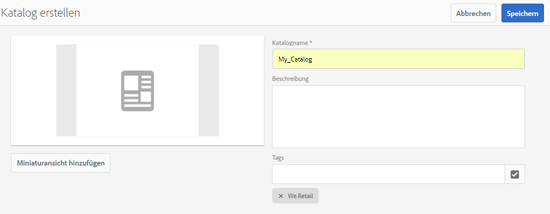
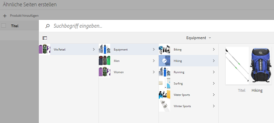
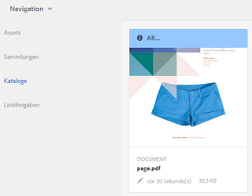
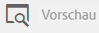

# Catalog Producer{#catalog-producer}

Erfahren Sie, wie Sie mit Catalog Producer in AEM Assets Produktkataloge mit Ihren digitalen Assets generieren.

Mit dem Catalog Producer von Adobe Experience Manager (AEM) Assets können Sie mit InDesign-Vorlagen, die Sie aus einer InDesign-Anwendung importieren, Kataloge für Ihre Markenprodukte erstellen. Um InDesign-Vorlagen zu importieren, integrieren Sie zunächst AEM Assets mit einem InDesign-Server.

## Integration mit einem InDesign-Server {#integrating-with-indesign-server}

Konfigurieren Sie im Rahmen des Integrationsprozesses den Arbeitsablauf **DAM Update Asset**, der für die Integration mit InDesign geeignet ist. Konfigurieren Sie außerdem einen Proxy Worker für den InDesign-Server. Weitere Informationen finden Sie unter [Integration von AEM Assets mit InDesign Server](/help/assets/indesign.md).

>[!NOTE]
>
>Sie können aus InDesign-Dateien InDesign-Vorlagen erstellen, bevor Sie sie in AEM Assets importieren. Weitere Informationen finden Sie unter [Arbeiten mit Dateien und Vorlagen](https://helpx.adobe.com/indesign/using/files-templates.html).
>
>Sie können die Elemente in Ihren InDesign-Vorlagen XML-Tags zuordnen. Die zugeordneten Tags werden als Eigenschaften angezeigt, wenn Sie im Catalog Producer den Vorlageneigenschaften Produkteigenschaften zuordnen. Weitere Informationen zum XML-Tagging in InDesign-Dateien finden Sie unter [Tagging von Inhalten für XML](https://helpx.adobe.com/indesign/using/tagging-content-xml.html).

>[!NOTE]
>
>Nur InDesign-Dateien (.indd) werden als Vorlagen verwendet. Dateien mit der Erweiterung .indt werden nicht unterstützt.

## Erstellen eines Katalogs {#creating-a-catalog}

Der Catalog Producer verwendet Daten der Produktdatenverwaltung (PIM), um Produkteigenschaften den in der Vorlage angezeigten XML-Eigenschaften zuzuordnen. Um einen Katalog zu erstellen, führen Sie die folgenden Schritte durch:

1. Tippen Sie in der Benutzeroberfläche &quot;Assets&quot;auf das **AEM Logo** und gehen Sie zu **Assets > Kataloge**.
1. Tippen Sie auf der Seite **Kataloge** auf **Erstellen** in der Symbolleiste und wählen Sie dann **Katalog** aus der Liste.
1. Geben Sie auf der Seite **Katalog erstellen** einen Namen und eine Beschreibung (optional) für den Katalog ein und geben Sie ggf. Tags an. Außerdem können Sie ein Miniaturbild für den Katalog hinzufügen.

   

1. Tippen oder klicken Sie auf **Speichern**. Ein Dialogfeld bestätigt, dass der Katalog erstellt wurde. Tippen/klicken Sie auf **Fertig**, um das Dialogfeld zu schließen.
1. Um den erstellten Katalog zu öffnen, tippen/klicken Sie auf der Seite **Kataloge** auf ihn.

   >[!NOTE]
   >
   >Um den Katalog zu öffnen, können Sie auch im Bestätigungsdialogfeld, das im vorherigen Schritt erwähnt wurde, auf **Öffnen** tippen/klicken.

1. Um dem Katalog Seiten hinzuzufügen, tippen/klicken Sie in der Symbolleiste auf **Erstellen** und wählen Sie dann die Option **Neue Seite**.
1. Wählen Sie im Assistenten eine InDesign-Vorlage für Ihre Seite aus. Tippen Sie dann auf **Weiter**.
1. Geben Sie einen Namen für die Seite sowie eine optionale Beschreibung an. Legen Sie ggf. Tags fest.
1. Tippen/klicken Sie in der Symbolleiste auf **Erstellen**. Tippen/klicken Sie dann im Dialogfeld auf **Öffnen**. Die Eigenschaften des Produkts werden im linken Fensterbereich angezeigt. Die vordefinierten Eigenschaften der InDesign-Vorlage werden im rechten Bereich angezeigt.
1. Ziehen Sie die Produkteigenschaften aus dem linken Bereich in die InDesign-Vorlageneigenschaften und erstellen Sie eine Zuordnung zwischen diesen Eigenschaften.

   Um die Seitendarstellung in Echtzeit Ansicht, tippen/klicken Sie auf die Registerkarte **Vorschau** im rechten Bereich.

1. Wenn Sie weitere Seiten erstellen möchten, wiederholen Sie die Schritte 6–9. Um ähnliche Seiten für andere Produkte zu erstellen, wählen Sie die Seite aus und tippen/klicken Sie in der Symbolleiste auf das Symbol **Ähnliche Seiten erstellen**.

   

   >[!NOTE]
   >
   >Sie können nur ähnliche Seiten für Produkte mit ähnlicher Struktur erstellen.

   Tippen oder klicken Sie auf das Symbol zum Hinzufügen, wählen Sie die Produkte aus Produktauswahl und klicken Sie in der Symbolleiste auf **Auswählen**.

   

1. Klicken Sie in der Symbolleiste auf/tippen Sie auf **Erstellen**. Tippen/klicken Sie auf **Fertig**, um das Dialogfeld zu schließen. Ähnliche Seiten sind in Ihrem Katalog enthalten.
1. Um eine vorhandene InDesign-Datei zu Ihrem Katalog hinzuzufügen, tippen/klicken Sie in der Symbolleiste auf **Erstellen** und wählen Sie die Option **Hinzufügen zu vorhandener Seite**.
1. Wählen Sie die InDesign-Datei aus und tippen/klicken Sie in der Symbolleiste auf **Hinzufügen**. Tippen oder klicken Sie dann auf **OK**, um das Dialogfeld zu schließen.

   Wenn die Metadaten der Produkte, auf die Sie auf den Katalogseiten verweisen, geändert werden, werden die Änderungen nicht automatisch auf den Katalogseiten übernommen. Auf den Produktbildern auf den verweisenden Katalogseiten wird ein Banner mit der Bezeichnung **Stable** angezeigt, das darauf hinweist, dass die Metadaten für die referenzierten Produkte nicht auf dem neuesten Stand sind.

   

   Um sicherzustellen, dass die Produktbilder die neuesten Metadatenänderungen widerspiegeln, wählen Sie die Seite in der Katalogkonsole aus und klicken Sie auf das Symbol **Seite aktualisieren** in der Symbolleiste.

   

   >[!NOTE]
   >
   >Um die Metadaten für ein referenziertes Produkt zu ändern, navigieren Sie zur Produktkonsole (**AEM Logo** > **Commerce** > **Produkte**) und wählen Sie das Produkt aus. Klicken Sie dann in der Symbolleiste auf das Symbol **Eigenschaften von Ansichten** und bearbeiten Sie die Metadaten auf der Seite &quot;Eigenschaften&quot;des Assets.

1. Um die Seiten im Katalog neu anzuordnen, tippen/klicken Sie in der Symbolleiste auf das Symbol **Erstellen** und wählen Sie dann **Zusammenführen** aus dem Menü. Im Assistenten können Sie über das Karussell am oberen Bildschirmrand die Seiten durch Ziehen neu anordnen. Sie können Seiten auch entfernen.

1. Klicken oder tippen Sie auf **Weiter**. Um eine vorhandene InDesign-Datei als Titelseite hinzuzufügen, tippen/klicken Sie auf **Durchsuchen** neben dem Feld **Titelseite auswählen** und geben Sie den Pfad für die Titelseitenvorlage an.
1. Tippen/klicken Sie auf **Speichern** und dann auf **Fertig**, um das Bestätigungsdialogfeld zu schließen.
Wenn Sie die Option **Fertig** auswählen, wird ein Dialogfeld geöffnet, in dem Sie auswählen können, ob die PDF-Darstellung angezeigt werden soll.
   
pdfWenn die Option &quot;Acrobat(PDF)&quot;aktiviert ist, wird neben der Darstellung in &quot;indesign&quot;eine PDF-Darstellung in   **/jcr:content/** renditions erstellt. Sie können alle Darstellungen herunterladen, indem Sie im Downloaddialogfeld das Kontrollkästchen &quot;Darstellungen&quot;aktivieren.

1. Um eine Vorschau für den erstellten Katalog zu erstellen, wählen Sie ihn in der Konsole **Kataloge** aus und klicken Sie dann in der Symbolleiste auf das Symbol **Vorschau**.

   

   Überprüfen Sie die Seiten in Ihrem Katalog in der Vorschau. Tippen oder klicken Sie auf **Schließen**, um die Vorschau zu schließen.

