# ClientContext{#client-context}

>[!NOTE]
>
>ClientContext wurde durch ContextHub abgelöst. Weitere Informationen finden Sie in der entsprechenden Dokumentation für die [Konfiguration]ch-configuring.md) und für [Entwickler](/help/sites-developing/contexthub.md).

ClientContext ist ein Mechanismus, der Ihnen bestimmte Informationen zur aktuellen Seite und zum aktuellen Besucher liefert. Um ClientContext zu öffnen, drücken Sie die Tastenkombination **Strg+Alt+C** (Windows) oder **Ctrl+Wahl+C** (Mac):

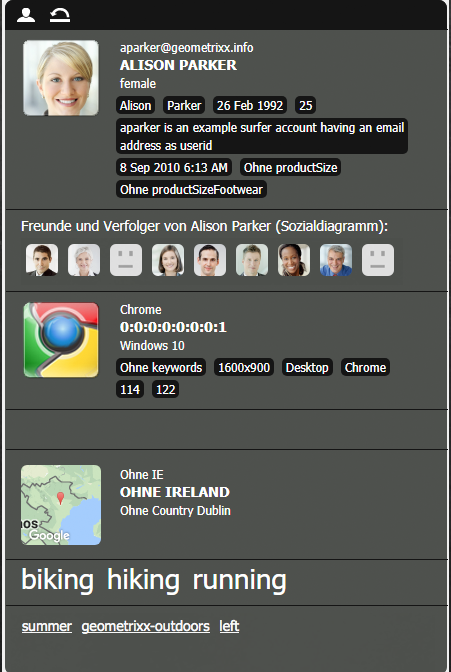

In der [Veröffentlichungs- und in der Autorenumgebung werden Informationen zu Folgendem angezeigt](#propertiesavailableintheclientcontext):

* dem Besucher; abhängig von Ihrer Instanz werden bestimmte Informationen angefordert oder abgeleitet;
* Seiten-Tags und Häufigkeit, mit der der aktuelle Besucher auf diese Tags zugegriffen hat (wird beim Zeigen mit der Maus auf ein bestimmtes Tag angezeigt);
* Seiteninformationen;
* Informationen zur technischen Umgebung, z. B. IP-Adresse, Browser und Bildschirmauflösung;
* allen Segmenten, die aktuell aufgelöst werden.

Über die (nur in der Autorenumgebung verfügbaren) Symbole können Sie ClientContext-Details konfigurieren:

* **Bearbeiten**
Eine neue Seite wird geöffnet. Dort können Sie [Profileigenschaften bearbeiten, hinzufügen oder entfernen](#editingprofiledetails).

* **Laden**
Sie können [aus einer Liste von Profilen auswählen und das Profil laden](#loading-a-new-user-profile), das getestet werden soll.

* **Zurücksetzen**
Sie können [das Profil auf den aktuellen Benutzer zurücksetzen](#resetting-the-profile-to-the-current-user).

## Verfügbare ClientContext-Komponenten {#available-client-context-components}

ClientContext kann die folgenden Eigenschaften anzeigen ([abhängig von der mit „Bearbeiten“ getroffenen Auswahl](#adding-a-property-component)):

**Surfer-Informationen**: Zeigt die folgenden Client-seitigen Informationen an:

* die **IP-Adresse**
* **Schlüsselwörter** als Suchmaschinenreferenz
* die verwendeten **Browser**
* das verwendete **Betriebssystem**
* die **Auflösung** des Bildschirms
* die **X**-Position der Maus
* die **Y**-Position der Maus

**Aktivitäts-Stream**: Liefert Informationen zu sozialen Aktivitäten des Benutzers auf verschiedenen Plattformen, z. B. AEM-Foren, Blogs und Bewertungen.

**Kampagne**: Ermöglicht es Autoren, ein bestimmtes Erlebnis für eine Kampagne zu simulieren. Diese Komponente setzt die normale Kampagnenauflösung und Erlebnisauswahl außer Kraft, um verschiedene Permutationen testen zu können.

Die Kampagnenauflösung basiert normalerweise auf der Prioritätseigenschaft der Kampagne. Das Erlebnis wird im Regelfall auf Grundlage der Segmentierung ausgewählt.

**Warenkorb**: Zeigt Informationen zum Warenkorb an, darunter Produkteinträge (Titel, Menge, Preisformatierung usw.), aufgelöste Promotions (Titel, Nachricht usw.) und Gutscheine (Code, Beschreibung usw.).

Der Warenkorbsitzungsstore benachrichtigt mit dem ClientContextCartServlet zudem den Server über aufgelöste Promotionsänderungen (basierend auf Segmentierungsänderungen).

**Generischer Store**: Eine generische Komponente, die den Inhalt eines Stores angezeigt. Es handelt sich um eine untergeordnete Version der Komponente „Generische Store-Eigenschaften“.

Der generische Store muss mit einem JS-Renderer konfiguriert werden, der die Daten benutzerdefiniert anzeigt.

**Generische Store-Eigenschaften**: Eine generische Komponente, die den Inhalt eines Stores angezeigt. Es handelt sich um eine übergeordnete Version der Komponente „Generischer Store“.

Die Komponente „Generische Store-Eigenschaften“ beinhaltet einen Standardrenderer, der die konfigurierten Eigenschaften (mit einer Miniatur) auflistet.

**Geolocation**: Zeigt den Breiten- und Längengrad des Kundenstandorts an. Über die HTML5-Geolocation-API wird der aktuelle Standort vom Browser abgefragt. Dabei wird eine Popup-Meldung angezeigt, über die der Besucher gebeten wird, seine Standortdaten freizugeben.

Bei Anzeige in der Kontext-Cloud nutzt die Komponente eine Google-API, um eine Karte als Miniatur darzustellen. Die Komponente unterliegt den [Nutzungsbeschränkungen](https://developers.google.com/maps/documentation/staticmaps/intro#Limits) der Google-API.

>[!NOTE]
>
>In AEM 6.1 bietet der Geolocation-Store nicht länger die Reverse Geocoding-Funktion. Deshalb ruf der Geolocation-Store nicht mehr Details zum aktuellen Standort ab, etwa Ortsnamen oder Ländercodes. Segmente, die diesen Store verwenden, funktionieren nicht ordnungsgemäß. Der Geolocation-Store enthält nur den Breiten- und Längengrad eines Standorts.

**JSONP-Store**: Eine Komponente, die Inhalt anzeigt, der abhängig von Ihrer Installation ist.

Der JSON-Standard ist eine JSON-Ergänzung, mit der dieselbe ursprüngliche Richtlinie umgangen werden kann (sodass eine Web-Anwendung mit Servern in einer anderen Domain kommunizieren kann). Er besteht in der Verpackung des JSON-Objekts in einem Funktionsaufruf, sodass dieses als `<script>` aus der anderen Domain geladen werden kann (bei der es sich um eine erlaubte Ausnahme von derselben ursprünglichen Richtlinie handelt).

Der JSONP-Store ist zwar wie jeder andere Store, er lädt allerdings Informationen aus einer anderen Domain, ohne dass für diese Informationen ein Proxy in der aktuellen Domain benötigt wird. Siehe hierzu das Beispiel unter [Speichern von Daten in ClientContext über JSON](/help/sites-administering/client-context.md#storing-data-in-client-context-via-jsonp).

>[!NOTE]
>
>Der JSONP-Store speichert die Informationen nicht im Cookie zwischen, ruft aber die Daten bei jedem Seitenladevorgang ab.

**Profildaten**: Zeigt im Benutzerprofil erfasste Informationen an, z. B. Geschlecht, Alter und E-Mail-Adresse.

**Aufgelöste Segmente**: Gibt an, welche Segmente aktuell aufgelöst werden (häufig von anderen in ClientContext angezeigten Informationen abhängig). Dies ist beim Konfigurieren von Kampagnen von Interesse.

Beispiel: die Frage, ob sich die Maus aktuell im linken oder rechten Fensterbereich befindet. Dieses Segment dient in erster Linie für Tests, da Änderungen sofort zu sehen sind.

**Soziales Diagramm**: Zeigt das soziale Diagramm von Freunden und Followern des Benutzers an.

>[!NOTE]
>
>Dieses Feature ist derzeit als Demofunktion verfügbar und auf vorkonfigurierte Datensätze im Profilknoten unserer Demobenutzer angewiesen. Ein Beispiel finden Sie unter:
>
>`/home/users/geometrixx/aparker@geometrixx.info/profile` => Eigenschaft „Freunde“

**Tag-Cloud**: Zeigt die auf der aktuellen Seite gesetzten und beim Navigieren auf der Site gesammelten Tags an. Wenn Sie mit der Maus auf ein Tag zeigen, sehen Sie, wie oft der aktuelle Benutzer auf Seiten mit diesem bestimmten Tag zugegriffen hat.

>[!NOTE]
>Auf DAM-Assets gesetzte Tags, die auf besuchten Seiten angezeigt werden, werden nicht gezählt.

**Technografie-Store**: Diese Komponente hängt von Ihrer Installation ab.

**ViewedProducts**: Verfolgt die vom Einkäufer angesehenen Produkte. Es kann das zuletzt angesehene Produkt oder das zuletzt angesehene Produkt, das sich nicht bereits im Warenkorb befindet, abgerufen werden.

Dieser Sitzungsstore verfügt über keine standardmäßige ClientContext-Komponente.

Weitere Informationen finden Sie unter [ClientContext im Detail](/help/sites-developing/client-context.md).

>[!NOTE]
>Die Seitendaten sind keine Standardkomponenten in ClientContext mehr. Sie können sie ggf. hinzufügen, indem Sie ClientContext bearbeiten, die Komponente **Generische Store-Eigenschaften** hinzufügen und dann eine entsprechende Konfiguration durchführen, um den **Store** als `pagedata` zu definieren.

## Ändern des ClientContext-Profils {#changing-the-client-context-profile}

Mit ClientContext können Sie Details interaktiv verändern:

* Wenn Sie das in ClientContext verwendete Profil ändern, können Sie sehen, wie sich die Erlebnisse verschiedener Benutzer beim Anzeigen der aktuellen Seite unterscheiden.
* Abgesehen vom Ändern des Benutzerprofils können Sie auch bestimmte Profildetails ändern, um nachzuvollziehen, wie sich das Seitenerlebnis unter verschiedenen Bedingungen verändert.

### Laden neuer Benutzerprofile {#loading-a-new-user-profile}

Sie können ein Profil wie folgt ändern:

* [über das Ladesymbol oder](#loading-a-new-visitor-profile-with-the-load-profile-icon)
* [über den Auswahlregler.](#loadinganewvisitorprofilewiththeselectionslider)

Wenn Sie fertig sind, können Sie das [Profil zurücksetzen](#resetting-the-profile-to-the-current-user).

#### Laden neuer Besucherprofile mit dem Symbol „Profil laden“ {#loading-a-new-visitor-profile-with-the-load-profile-icon}

1. Klicken Sie auf das Symbol „Profil laden“:

   

1. Daraufhin wird das zugehörige Dialogfeld geöffnet. Hier können Sie das zu ladende Profil auswählen:

   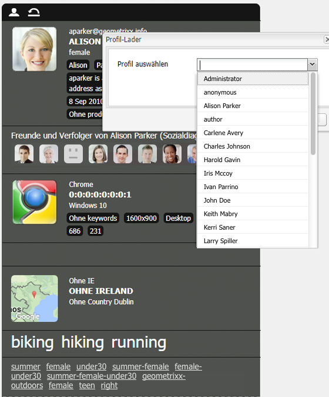

1. Klicken Sie auf **OK**, um das Profil zu laden.

#### Laden neuer Benutzerprofile mit dem Auswahlregler {#loading-a-new-user-profile-with-the-selection-slider}

Sie können ein Profil auch mit dem Auswahlregler auswählen:

1. Doppelklicken Sie auf das Symbol für den aktuellen Benutzer. Daraufhin wird die Auswahl geöffnet. Navigieren Sie mit den Pfeilen und sehen Sie sich die verfügbaren Profile an:

   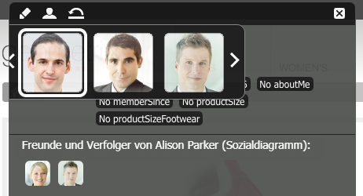

1. Klicken Sie auf das zu ladende Profil. Wenn die Details geladen wurden, klicken Sie auf eine Stelle außerhalb der Auswahl, um diese zu schließen.

#### Zurücksetzen des Profils auf den aktuellen Benutzer {#resetting-the-profile-to-the-current-user}

1. Setzen Sie das Profil in ClientContext mit dem Symbol „Zurücksetzen“ auf den aktuellen Benutzer zurück:

   

### Ändern der Browserplattform {#changing-the-browser-platform}

1. Doppelklicken Sie auf das Symbol für die Browserplattform. Daraufhin wird die Auswahl geöffnet. Navigieren Sie mit den Pfeilen und sehen Sie sich die verfügbaren Plattformen/Browser an:

   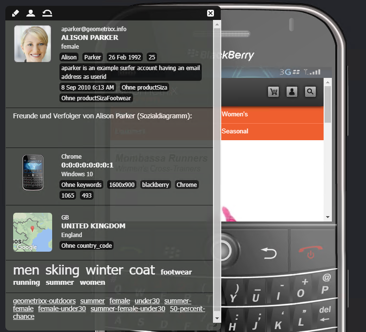

1. Klicken Sie auf den zu ladenden Plattformbrowser. Wenn die Details geladen wurden, klicken Sie auf eine Stelle außerhalb der Auswahl, um diese zu schließen.

### Ändern der Geolocation {#changing-the-geolocation}

1. Doppelklicken Sie auf das Geolocation-Symbol. Daraufhin wird eine erweiterte Karte geöffnet. Hier können Sie die Markierung an einen neuen Standort ziehen:

   

1. Klicken Sie auf eine Stelle außerhalb der Karte, um sie zu schließen.

### Ändern der Tag-Auswahl {#changing-the-tag-selection}

1. Doppelklicken Sie auf den ClientContext-Abschnitt „Tag-Cloud“. Daraufhin wird das zugehörige Dialogfeld geöffnet. Hier können Sie Tags auswählen:

   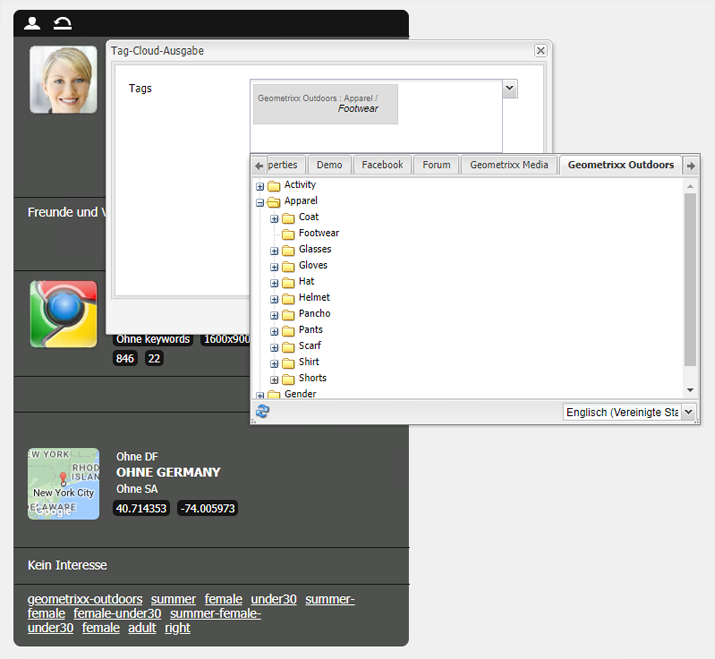

1. Klicken Sie auf „OK“, um Ihre Auswahl in ClientContext zu laden.

## Bearbeiten von ClientContext {#editing-the-client-context}

Mittels ClientContext-Bearbeitung können die Werte bestimmter Eigenschaften festgelegt (zurückgesetzt), neue Eigenschaften hinzugefügt oder nicht mehr benötigte Eigenschaften entfernt werden.

### Bearbeiten von Eigenschaftsdetails {#editing-property-details}

Mittels ClientContext-Bearbeitung können die Werte bestimmter Eigenschaften festgelegt (zurückgesetzt) werden. So können Sie bestimmte Szenarien testen. (Dies ist besonders nützlich bei [Segmentierungen](/help/sites-administering/campaign-segmentation.md) und [Kampagnen](/help/sites-classic-ui-authoring/classic-personalization-campaigns.md).)

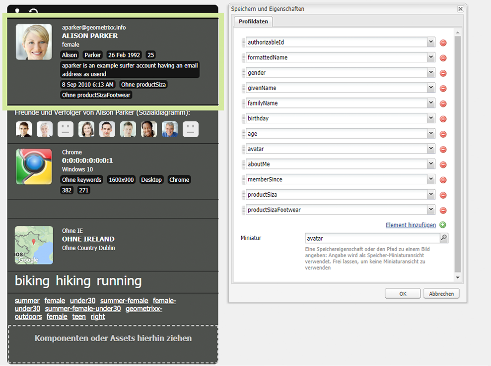

### Hinzufügen von Eigenschaftskomponenten {#adding-a-property-component}

Nach dem Öffnen der **ClientContext-Designseite** können Sie auch eine vollkommen neue Eigenschaft mithilfe der verfügbaren Komponenten **hinzufügen**. (Diese Komponenten werden sowohl im Sidekick als auch im Dialogfeld **Neue Komponente einfügen** aufgeführt. Letzteres rufen Sie per Doppelklick im Feld **Komponenten oder Assets hierhin ziehen** auf.)

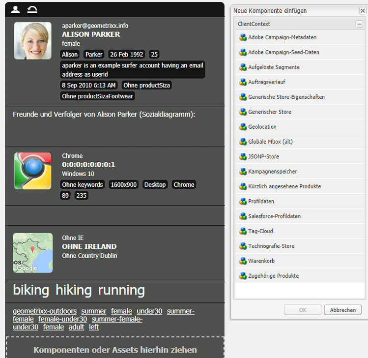

### Entfernen von Eigenschaftskomponenten {#removing-a-property-component}

Nach dem Öffnen der **ClientContext-Designseite** haben Sie außerdem die Möglichkeit, nicht mehr benötigte Eigenschaften zu **entfernen**, auch standardmäßig vorhandene Eigenschaften. Wurden diese entfernt, können Sie sie mit **Zurücksetzen** reaktivieren.

## Speichern von Daten in ClientContext über JSON {#storing-data-in-client-context-via-jsonp}

Folgen Sie diesem Beispiel, um die Context-Store-Komponente „JSONP-Store“ zum Hinzufügen externer Daten zu ClientContext zu verwenden. Erstellen Sie dann ein Segment basierend auf den Informationen aus diesen Daten. Im Beispiel wird der JSONP-Service von WIPmania.com verwendet. Der Service gibt Geolocation-Informationen anhand der IP-Adresse des Webclients zurück.

In diesem Beispiel wird die Beispiel-Website Geometrixx Outdoors verwendet, um auf ClientContext zuzugreifen und das erstellte Segment zu testen. Sie können eine andere Website verwenden, sofern für die Seite ClientContext aktiviert ist. (Siehe [Hinzufügen von ClientContext zu Seiten](/help/sites-developing/client-context.md#adding-client-context-to-a-page).)

### Hinzufügen der Komponente „JSONP-Store“ {#add-the-jsonp-store-component}

Fügen Sie die Komponente „JSONP-Store“ zu ClientContext hinzu und nutzen Sie diese zum Abrufen und Speichern von Geolocation-Informationen zum Webclient.

1. Öffnen Sie die englische Homepage der Geometrixx Outdoors-Site in der AEM-Autoreninstanz. ([https://localhost:4502/content/geometrixx-outdoors/en.html](https://localhost:4502/content/geometrixx-outdoors/en.html)).
1. Drücken Sie zum Öffnen von ClientContext die Tastenkombination Strg+Alt+C (Windows) oder Ctrl+Wahl+C (Mac).
1. Klicken Sie oben im ClientContext-Bereich auf das Bearbeitungssymbol, um ClientContext-Designer zu öffnen.

   

1. Ziehen Sie die Komponente „JSONP-Store“ auf ClientContext.

   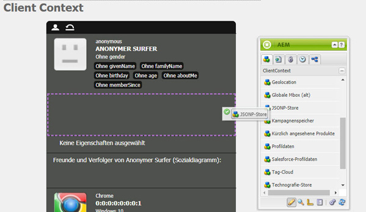

1. Doppelklicken Sie auf die Komponente, um das Bearbeitungsdialogfeld zu öffnen.
1. Geben Sie in das Feld „JSONP-Service-URL“ die folgende URL ein und klicken Sie dann auf „Store abrufen“:

   `https://api.wipmania.com/jsonp?callback=${callback}`

   Die Komponente ruft den JSONP-Service auf und führt alle Eigenschaften auf, die die zurückgegebenen Daten enthalten. Die Eigenschaften in der Liste entsprechen den in ClientContext verfügbaren Eigenschaften.

   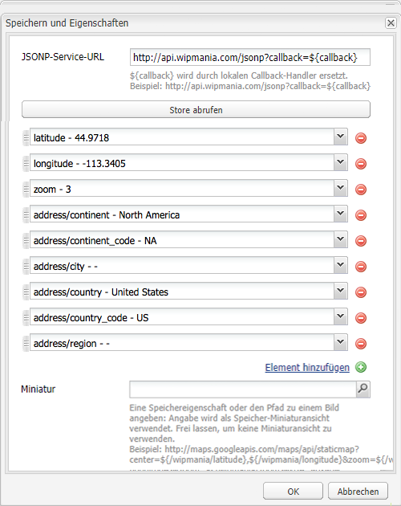

1. Klicken Sie auf OK.
1. Kehren Sie zur Geometrixx Outdoors-Homepage zurück und aktualisieren Sie die Seite. ClientContext umfasst nun die Informationen aus der Komponente „JSONP-Store“.

   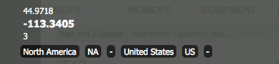

### Erstellen von Segmenten {#create-the-segment}

Verwenden Sie die Daten aus dem Sitzungsstore, den Sie mit der Komponente „JSONP-Store“ erstellt haben. Das Segment verwendet den Breitengrad aus dem Sitzungsstore und das aktuelle Datum, um zu bestimmen, ob am Kundenstandort Winter ist.

1. Öffnen Sie die Tools-Konsole in Ihrem Webbrowser (`https://localhost:4502/miscadmin#/etc`).
1. Klicken Sie in der Ordnerstruktur auf den Ordner „Tools/Segmentation“ und dann auf „Neu“ > „Neuer Ordner“. Geben Sie die folgenden Eigenschaftswerte an und klicken Sie dann auf „Erstellen“:

   * Name: mysegments
   * Titel: My Segments

1. Wählen Sie den Ordner „My Segments“ aus und klicken Sie auf „Neu“ > „Neue Seite“:

   1. Geben Sie „Winter“ als Titel ein.
   1. Wählen Sie die Vorlage „Segment“ aus.
   1. Klicken Sie auf „Erstellen“.

1. Klicken Sie mit der rechten Maustaste auf das Segment „Winter“ und dann auf „Öffnen“.
1. Ziehen Sie „Generische Store-Eigenschaft“ in den standardmäßigen UND-Container.

   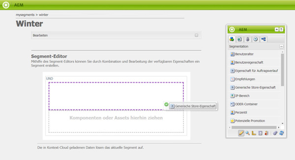

1. Doppelklicken Sie auf die Komponente, um das Bearbeitungsdialogfeld zu öffnen. Geben Sie die folgenden Eigenschaftswerte an und klicken Sie dann auf „OK“:

   * Store: wipmania
   * Eigenschaftsname: Breite
   * Operator: ist größer als
   * Eigenschaftswert: 30

1. Ziehen die Komponente „Skript“ in denselben UND-Container und öffnen Sie das zugehörige Bearbeitungsdialogfeld. Fügen Sie das folgende Skript hinzu und klicken Sie dann auf „OK“:

   `3 < new Date().getMonth() < 12`
