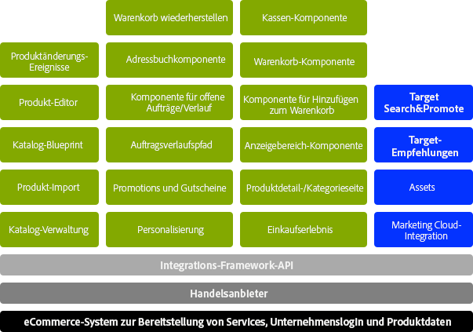
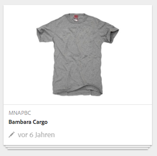
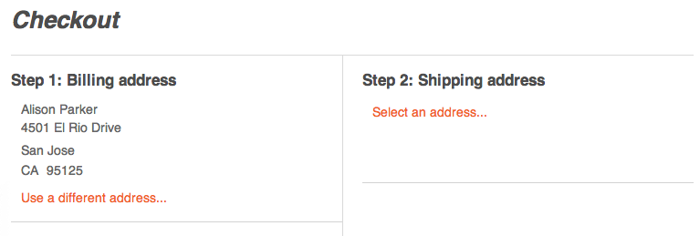

# Konzepte {#concepts}

Das Integrationsframework stellt Mechanismen und Komponenten für die folgenden Aufgaben bereit:

* Verbindung zu einer eCommerce-Engine
* Abrufen von Daten in AEM
* Anzeigen dieser Daten und Erfassen der Antworten der Käufer
* Zurückgabe der Transaktionsdetails
* Durchsuchen der Daten beider Systeme

Das heißt:

* Käufer können sich registrieren und umgehend einkaufen.
* Preisänderungen werden den Käufern ohne Verzögerung angezeigt.
* Produkte lassen sich bei Bedarf hinzufügen.

>[!NOTE]
>
>Das eCommerce-Framework kann mit Folgendem verwendet werden:
>
>* [Magento](https://www.adobe.io/apis/experiencecloud/commerce-integration-framework/integrations.html#!AdobeDocs/commerce-cif-documentation/master/integrations/02-AEM-Magento.md)
>* [SAP Commerce Cloud](/help/sites-administering/sap-commerce-cloud.md)
>* [Salesforce Commerce Cloud](https://github.com/adobe/commerce-salesforce)

>

>[!CAUTION]
>
>Das [eCommerce-Integrationsframework](https://www.adobe.com/solutions/web-experience-management/commerce.html) ist ein Add-on von AEM.
>
>Umfassende Informationen hierzu, passend zur entsprechenden Engine, erhalten Sie von dem für Sie zuständigen Vertriebsmitarbeiter.

>[!CAUTION]
>
>Das Framework stellt die grundlegenden Voraussetzungen für Ihr eigenes Projekt bereit.
>
>Ein gewisses Maß an Entwicklungsarbeit ist immer erforderlich, um das Framework an Ihre Vorgaben anzupassen.

>[!CAUTION]
>
>Die AEM-Standardinstallation umfasst die generische AEM-eCommerce-Implementierung (JCR).
>
>Sie dient derzeit zur Veranschaulichung bzw. als Grundlage für eine benutzerdefinierte Implementierung nach Ihren jeweiligen Anforderungen.

Um den Betrieb zu optimieren, konzentrieren sich AEM und die eCommerce-Engine auf ihren jeweiligen Fachbereich. Daten werden in Echtzeit zwischen ihnen ausgetauscht, z. B.:

* AEM kann:

   * Anfrage:

      * Produktdaten von der eCommerce-Engine
   * Geben Sie Folgendes an:

      * Anzeigen von Produktdaten, Warenkorb und Kasse für Benutzer
      * Warenkorb und Bezahlungsdaten für die eCommerce-Engine
      * Suchmaschinenoptimierung (SEO)
      * Community-Funktion
      * unstrukturierte Marketinginteraktionen

* Die eCommerce-Engine kann:

   * Geben Sie Folgendes an:

      * Produktdaten von der Datenbank
      * Produktvarianten-Verwaltung
      * Auftragsverwaltung
      * Enterprise Resource Planning (ERP)
      * Suche in den Produktdaten
   * verarbeiten:

      * Warenkorb
      * Kasse
      * Auftragserfüllung

>[!NOTE]
>
>Die genauen Details hängen von der eCommerce-Engine und der Projektimplementierung ab.

Zur Verwendung der Integrationsebene stehen eine Reihe vordefinierter AEM zur Verfügung. Aktuell gehören dazu folgende:

* Produktangaben
* Warenkorb
* Kasse
* Mein Konto

Verschiedene Suchoptionen sind ebenfalls verfügbar.

## Architektur {#architecture}

Das Integrationsframework stellt die API, mehrere Komponenten zur Veranschaulichung der Funktionalität und einige Erweiterungen für Beispiele für Anbindungsmethoden bereit:

Über das Framework erhalten Sie Zugriff auf Funktionen, z. B.:

### Implementierungen {#implementations}

AEM eCommerce wird mit einer eCommerce-Engine implementiert:

* Das eCommerce-Integrationsframework ermöglicht Ihnen die unkomplizierte Integration einer eCommerce-Engine mit AEM. Die speziell entwickelte eCommerce-Engine steuert Produktdaten, Warenkörbe, Bezahlungen und die Auftragserfüllung. AEM steuert die Datenanzeige und Marketingkampagnen.

>[!NOTE]
>
>Die AEM-Standardinstallation umfasst die generische AEM-eCommerce-Implementierung (JCR).
>
>Sie dient derzeit zur Veranschaulichung bzw. als Grundlage für eine benutzerdefinierte Implementierung nach Ihren jeweiligen Anforderungen.
>
>AEM eCommerce, implementiert in AEM, mit generischer Entwicklung basierend auf JCR, ist:
>
>* Ein eigenständiges, AEM-natives eCommerce-Beispiel, um die Nutzung der API zu veranschaulichen. Sie können damit in Verbindung mit den vorhandenen Datenanzeigen und Marketingkampagnen Produktdaten, Warenkörbe und Bezahlungen kontrollieren. In diesem Fall ist die Produktdatenbank im nativen Repository von AEM gespeichert (die [JCR](https://docs.adobe.com/content/docs/en/spec/jcr/2.0/index.html)-Implementierung von Adobe).
>
>  
Die standardmäßige AEM-Installation enthält die Grundlagen der [generischen eCommerce-Implementierung](/help/sites-administering/generic.md).

### Commerce-Anbieter {#commerce-providers}

Beim Importieren von Daten aus einer Commerce-Engine in Ihre AEM-eCommerce-Website erhalten die Importtools ihre Daten von einem Commerce-Anbieter. Ein Commerce-Anbieter kann mehrere Importtools unterstützen.

Ein Commerce-Anbieter ist ein angepasster AEM-Code, der entweder

* eine Schnittstelle zu einer Backend-Commerce-Engine darstellt oder
* ein Commerce-System auf dem JCR-Repository implementiert.

Derzeit sind zwei Beispiel-Commerce-Anbieter für AEM verfügbar:

* einer für geometrixx-hybris
* ein weiterer für geometrixx-generic (JCR)

Dennoch müssen Sie für ein Projekt in der Regel einen eigenen, angepassten Commerce-Anbieter entsprechend dem PIM und Produktdatenschema entwickeln.

>[!NOTE]
>
>Die Geometrixx-Importtools nutzen CSV-Dateien. In den Kommentaren über ihre Implementierung finden Sie eine Beschreibung des akzeptierten Schemas (samt der zulässigen benutzerdefinierten Eigenschaften).

Der [ProductServicesManager](https://helpx.adobe.com/experience-manager/6-5/sites/developing/using/reference-materials/javadoc/com/adobe/cq/commerce/pim/api/ProductServicesManager.html) verwaltet (über [OSGi](/help/sites-deploying/configuring.md#osgi-configuration-settings)) eine Liste der Implementierungen der [ProductImporter](https://helpx.adobe.com/experience-manager/6-5/sites/developing/using/reference-materials/javadoc/com/adobe/cq/commerce/pim/api/ProductImporter.html)- und [CatalogBlueprintImporter](https://helpx.adobe.com/experience-manager/6-5/sites/developing/using/reference-materials/javadoc/com/adobe/cq/commerce/pim/api/CatalogBlueprintImporter.html)-Schnittstelle. Diese werden im Dropdown-Feld **Importer/Commerce-Anbieter** des Importassistenten aufgeführt (unter Verwendung der `commerceProvider`-Eigenschaft als Name).

Wenn ein bestimmtes Importtool/ein bestimmter Commerce-Anbieter im Dropdown-Feld verfügbar ist, müssen Sie alle weiteren benötigten Daten (je nach Art des Importtools) definieren, unter einem der folgenden Pfade:

* `/apps/commerce/gui/content/catalogs/importblueprintswizard/importers`
* `/apps/commerce/gui/content/products/importproductswizard/importers`

Der Ordner unter dem entsprechenden Ordner `importers` muss mit dem Namen des Importeurs übereinstimmen. Beispiel:

* `.../importproductswizard/importers/geometrixx/.content.xml`

Das Format der Quell-Importdatei wird vom Importtool definiert. Oder der Importeur kann eine Verbindung (z.B. WebDAV oder http) zur Commerce-Engine herstellen.

## Rollen {#roles}

Das integrierte System unterstützt die folgenden Rollen, um die Daten zu verwalten:

* Produktdatenverwaltung (PIM)-Benutzer, der Folgendes verwaltet:

   * Produktangaben.
   * Klassifikationsschema, Kategorisierung, Genehmigung
   * Interaktion mit dem Digital Asset Management
   * Preisfestlegung – stammt häufig von einem ERP-System und wird nicht explizit im Commerce-System verwaltet

* Autor/Marketingmanager, der Folgendes verwaltet:

   * Marketinginhalte für alle Kanäle
   * Promotions.
   * Gutscheine.
   * Kampagnen

* Surfer/Käufer, die:

   * die Produktdaten anzeigen
   * Artikel in den Warenkorb legen
   * ihre Aufträge bezahlen
   * die Auftragserfüllung erwarten

Der tatsächliche Ort kann je nach Implementierung unterschiedlich ausfallen (z. B. allgemein oder mit einer eCommerce-Engine):

## Produkte {#products}

### Produkt Daten versus Marketing-Daten {#product-data-versus-marketing-data}

#### Strukturelle Kategorien und Marketingkategorien {#structural-versus-marketing-categories}

Durch die Unterscheidung der folgenden beiden Kategorien können Sie deutliche URLs mit bedeutungsvoller Struktur erstellen (Bäume von `cq:Page`-Knoten und daher sehr ähnlich der klassischen Inhaltsverwaltung in AEM):

* *Struktur *Kategorien

   Die Kategorie, die *Was ist ein Produkt* definiert; Beispiel:

   `/products/mens/shoes/sneakers`

* ** Marketingkategorien

   Alle anderen Kategorien eines *Produkts können zu* gehören; Beispiel:

   `/special-offers/christmas/shoes`)

### Produktdaten {#product-data}

Um Ihr Produkt zu beschreiben und zu verwalten, speichern Sie viele Daten zu ihm.

Produktdaten können:

* direkt in AEM verwaltet werden (allgemein)
* in der eCommerce-Engine verwaltet und in AEM bereitgestellt werden

   Je nach Datentyp ist er bei Bedarf [synchronisiert](#catalog-maintenance-data-synchronization) oder wird direkt aufgerufen. Beispielsweise werden bei jeder Seitenanforderung hochgradig schwankende und wichtige Daten wie Produktpreise von der E-Commerce-Engine abgerufen, um sicherzustellen, dass sie immer auf dem neuesten Stand sind.

In jedem Fall können Sie die Produktdaten nach der Eingabe bzw. dem Import in AEM über die **Produktekonsole** einsehen. Hier finden Sie in der Karten- und der Listenansicht eines Produkts u. a. folgende Informationen:

* das Bild
* den SKU-Code
* letzte Bearbeitung

### Produktvarianten {#product-variants}

Sie können auch Informationen zu Produktvarianten für die entsprechenden Produkte speichern. Beispielsweise werden bei Bekleidungsartikeln die unterschiedlichen angebotenen Farben als Varianten gespeichert:

### Produktattribute {#product-attributes}

Welche individuellen Attribute zu jedem Produkt gespeichert werden, hängt möglicherweise von der genutzten eCommerce-Engine und Ihrer AEM-Implementierung ab. Sie sind entsprechend verfügbar, wenn Sie die Produktseiten anzeigen und/oder Produktdaten bearbeiten. Folgende Attribute gibt es unter anderem:

* **Bild**

   Ein Bild des Produkts.

* **Titel**

   Der Produktname.

* **Beschreibung**

   Eine Textbeschreibung des Produkts.

* **Tags**

   Tags, die zum Gruppieren verwandter Produkte verwendet werden.

* **Standard-Asset-Kategorie**

   Eine Standard-Kategorie für Assets.

* **ERP-Daten**

   Informationen zur Unternehmensressourcenplanung (ERP).

   * **SKU**

      Angaben zur Bestandsbuchhaltung (SKU).

   * **Farbe**
   * **Größe**
   * **Preis**

      Der Stückpreis des Produkts.

* **Zusammenfassung**

   Eine Zusammenfassung der Produktfunktionen.

* **Funktionen**

   Genauere Details zu den Produktfunktionen.

### Produkt-Assets {#product-assets}

Sie können eine Reihe an Assets für einzelne Produkte speichern. Dazu gehören in der Regel Bilder und Videos.

## Kataloge {#catalogs}

In einem Katalog werden Produktdaten zusammengestellt, um die Verwaltung zu vereinfachen und die Darstellung für die Käufer übersichtlich zu gestalten. Häufig wird ein Katalog nach Attributen wie Sprache, geografische Region, Marke, Saison, Hobby, Sport usw. strukturiert.

### Katalogstruktur {#catalog-structure}

#### Kataloge in mehreren Sprachen {#catalogs-in-multiple-languages}

AEM unterstützt Produktinhalte in mehreren Sprachen. Beim Anfordern von Daten ruft das Integrationsframework die Sprache aus der aktuellen Struktur ab (z. B. `en_US` für Seiten unter `/content/geometrixx-outdoors/en_US`).

Bei einem mehrsprachigen Speicher können Sie Ihren Katalog für jeden Sprachbaum einzeln importieren (oder ihn mit [MSM](/help/sites-administering/msm.md) kopieren).

#### Kataloge für mehrere Marken  {#catalogs-for-multiple-brands}

Ähnlich wie bei Sprachen müssen multinationale Unternehmen auch mehrere Marken unterstützen.

#### Kataloge nach Tags {#catalogs-by-tags}

Sie können Tags auch nutzen, um Produkte in einem Katalog zusammenzustellen. Dieser Ansatz bietet sich für dynamischere Kataloge an.

### Katalogeinrichtung (anfänglicher Import) {#catalog-setup-initial-import}

Je nach Implementierung können Sie die Produktdaten für Ihren Basiskatalog in AEM aus folgenden Quellen importieren:

* CSV-Datei (für die generische Implementierung)
* eCommerce-Engine

### Katalogpflege (Datensynchronisierung)  {#catalog-maintenance-data-synchronization}

Weitere Änderungen der Produktdaten sind nötig für:

* die generische Implementierung; sie lassen sich mit dem [Produkt-Editor](/help/sites-administering/generic.md#editing-product-information) vornehmen
* die Verwendung einer [eCommerce-Engine; hier müssen die Änderungen synchronisiert werden](#data-synchronization-with-an-ecommerce-engine-ongoing)

#### Datensynchronisierung mit einer eCommerce-Engine (fortlaufend) {#data-synchronization-with-an-ecommerce-engine-ongoing}

Nach dem anfänglichen Import sind Änderungen an den Produktdaten unvermeidbar.

Wenn Sie eine eCommerce-Engine verwenden, werden die Daten dort verwaltet und müssen in AEM verfügbar sein. Diese Produktdaten müssen nach Aktualisierungen synchronisiert werden.

Dies ist abhängig vom Datentyp:

* Eine [regelmäßige Synchronisierung wird zusammen mit einem Daten-Feed der Änderungen genutzt.](/help/sites-developing/sap-commerce-cloud.md#product-synchronization-and-publishing)

   Zusätzlich können Sie bestimmte Aktualisierungen für ein Express-Update auswählen.

* Höchst volatile und wichtige Daten wie Produktdaten werden beispielsweise bei jeder Seitenabfrage von der eCommerce-Engine abgerufen, damit sie jederzeit aktuell sind.

### Kataloge – Leistung und Skalierung  {#catalogs-performance-and-scaling}

Das Importieren eines großen Katalogs mit einer großen Anzahl an Produkten (in der Regel mehr als 100.000) aus einer eCommerce-Engine (PIM) kann wegen der hohen Anzahl an Knoten das System beeinträchtigen. Auch die Autoreninstanz kann sich verlangsamen, wenn die Produkte mit Assets (wie Produktbildern) verknüpft sind. Das liegt daran, dass die Nachbearbeitung dieser Assets rechen- und speicherintensiv ist.

Es gibt verschiedene Möglichkeiten, diese Probleme zu umgehen:

* [Buckets](#bucketing) – um die große Anzahl an Knoten zu unterstützen
* [Abladen der Asset-Nachbearbeitung auf einer dedizierten Instanz](#offload-asset-post-processing-to-a-dedicated-instance)
* [Importieren von Produktdaten ohne Assets](#only-import-product-data)
* [Importbeschränkung und Batch-Speicherung](#import-throttling-and-batch-saves)
* [Leistungstests](#performance-testing)
* [Leistung – Verschiedenes](#performance-miscellaneous)

#### Buckets  {#bucketing}

Wenn ein JCR-Knoten über viele direkte untergeordnete Knoten (z. B. mind. 1.000) verfügt, werden Buckets (Phantomordner) benötigt, um sicherzustellen, dass die Leistung nicht beeinträchtigt wird. Sie werden beim Importvorgang entsprechend einem Algorithmus erzeugt.

Diese Buckets werden in Form von Phantomordnern in die Katalogstruktur eingeführt. Sie können sie aber so konfigurieren, dass sie in den öffentlichen URLs nicht sichtbar sind.

#### Abladen der Asset-Nachbearbeitung auf einer dedizierten Instanz  {#offload-asset-post-processing-to-a-dedicated-instance}

Dieses Szenario sieht vor, dass zwei Autoreninstanzen eingerichtet werden:

1. Übergeordnet Autoreninstanz

   Importiert Produktdaten von PIM, bei denen die Nachbearbeitung für die Asset-Pfade deaktiviert ist.

1. Dedizierte DAM-Autoreninstanz

   Importiert und verarbeitet Produkt-Assets aus dem PIM und repliziert diese dann zur Verwendung zurück zur Übergeordnet Authoring-Instanz.

#### Importieren von Produktdaten ohne Assets {#only-import-product-data}

Wenn Produkte keine Assets (Bilder) enthalten, die importiert werden müssen, können Sie die Produktdaten importieren, ohne von der Asset-Nachbearbeitung beeinträchtigt zu werden.

<!--delete
#### Import Throttling and Batch Saves {#import-throttling-and-batch-saves}

[Import throttling](/help/sites-deploying/scaling.md#import-throttling) and [batch saves](/help/sites-deploying/scaling.md#batch-saves) are two general [scaling](/help/sites-deploying/scaling.md) mechanisms that can help when importing large volumes of data.-->

#### Leistungstests {#performance-testing}

Leistungstests müssen bei AEM eCommerce-Implementierungen in Erwägung gezogen werden:

* Autor-Umgebung:

   Die Aktivität im Hintergrund (z. B. beim Import) kann gleichzeitig mit der normalen Aktivität des Benutzers (z. B. bei der Seitenbearbeitung) erfolgen. Selbst wenn die Front-End-Leistung (im Allgemeinen) eine höhere Priorität erhält, kann eine schlechte Leistung, die Online-Autoren erkennen, zu Frustration führen, die eine Go-Live-Entscheidung blockieren kann.

* Umgebung der Veröffentlichung:

   Die Replikation ist ein entscheidender Prozess, um sicherzustellen, dass die Inhalte schnell und zuverlässig veröffentlicht werden. Dies kann dadurch beeinflusst werden, wie der Autor die Inhalte gruppiert, die veröffentlicht werden sollen.

* Front-End:

   Die Mischung aus Front-End- und Cache-Ausfällen kann möglicherweise zu Leistungsüberraschungen führen. Durch Tests können diese Probleme verhindert werden.

Beachten Sie, dass für diesen Leistungstest Kenntnisse und Analysen des Ziels erforderlich sind:

* Inhaltsvolumen

   * Assets
   * lokalisierte I18n-Produkte und SKUs

* Benutzeraktivität:

   * Stapelausgabe
   * Stapelveröffentlichung
   * umfassende Suchabfragen

* Hintergrundprozesse

   * Importvorgänge
   * Synchronisierungsaktualisierungen (z. B. Preisfestlegung)

* Wartungsanforderungen (Sicherung, Tar-PM-Optimierung, Datenspeicherbereinigung usw.)

#### Leistung – Verschiedenes  {#performance-miscellaneous}

Beachten Sie bei allen Implementierungen die folgenden Punkte:

* Da die Anzahl an Produkten, SKUs und Kategorien sehr hoch ausfallen kann, versuchen Sie, so wenig Knoten wie möglich für die Modellierung der Inhalte zu verwenden.

   Je mehr Knoten Sie nutzen, desto flexibler sind Ihre Inhalte (z. B. ParSys). Es ist aber immer Abwägungssache: Benötigen Sie (standardmäßig) individuelle Flexibilität, wenn Sie (beispielsweise) 30.000 Produkte bearbeiten?

* Vermeiden Sie Duplikate, so gut es geht (siehe Lokalisierung), und berücksichtigen Sie, wenn sich Duplikate nicht umgehen lassen, zu wie vielen Knoten die Duplizierung führen wird.
* Versuchen Sie, Ihre Inhalte so oft wie möglich mit Tags zu kennzeichnen, um die Abfrage zu optimieren.

   Beispiel:

   `/content/products/france/fr/shoe/reebok/pump/46 SKU`

   sollte ein Tag pro Inhaltsebene haben (d.h. Land, Sprache, Kategorie, Marke, Produkt). Suchen nach

   `//element(*,my:Sku)[@country=’france’ and @language=’fr’`

   und

   `@category=’shoe’ and @brand=’reebok’ and @product=’pump’]`

   wird drastisch schneller als die Suche nach

   `/jcr:root/content/france/fr/shoe/reebok/pump/element(*,my:Sku)`

* Planen Sie für Ihren technischen Stack faktorisierte Inhaltszugriffsmodelle und Dienste. Dies ist allgemein eine bewährte Vorgehensweise, in diesem Fall aber sogar noch wichtiger, da Sie bei Optimierungsphasen Anwendungscaches für Daten hinzufügen können, die häufig gelesen werden (und mit denen Sie nicht den Bundle-Cache füllen möchten).

   Beispielsweise ist die Attributverwaltung oft gut für das Caching geeignet, da sie Daten betrifft, die durch das Importieren von Produkten aktualisiert werden.
* Ziehen Sie die Nutzung von [Proxyseiten](/help/sites-administering/concepts.md#proxy-pages) in Erwägung.

### Katalogbereichsseiten  {#catalog-section-pages}

Auf Katalogsbereichsseiten finden Sie zum Beispiel:

* eine Einleitung (Bild und/oder Text) für die Kategorie; hier können auch Banner und Teaser für Sonderangebote werben
* Links zu den einzelnen Produkten in dieser Kategorie
* Links zu den anderen Kategorien

### Produktseiten {#product-pages}

Produktseiten bieten umfassende Informationen zu den einzelnen Produkten. Dynamische Aktualisierungen von externen Quellen werden auch widergespiegelt, z. B. Preisänderungen, die auf der eCommerce-Engine erfolgt sind.

Produktseiten sind AEM-Seiten, die die **Produkt**-Komponente nutzen, beispielsweise in der Vorlage **Commerce-Produkt**:

Die Produkt-Komponente bietet:

* allgemeine Produktinformationen, darunter Text und Bilder
* Preise; diese werden in der Regel bei jedem Aufruf bzw. jeder Aktualisierung der Seite von der eCommerce-Engine abgerufen.
* Informationen zu Produktvarianten, z. B. Farbe und Größe

Anhand dieser Daten kann der Käufer folgende Optionen auswählen, wenn er einen Artikel zum Warenkorb hinzufügt:

* Farb- und Größenvarianten
* Menge

#### Produkt-Landing-Pages  {#product-landing-pages}

Dabei handelt es sich um AEM-Seiten, die in erster Linie statische Informationen anzeigen, beispielsweise eine Einleitung und eine Übersicht mit Links zu den dazugehörigen Produktseiten.

### Produktkomponente {#product-component}

Die **Produkt**-Komponente können Sie zu jeder Seite mit einer übergeordneten Seite hinzufügen, welche die benötigten Metadaten bereitstellt (d. h. die Pfade zu `cartPage` und `cartObject`). Bei der Demo-Website, Geometrixx Outdoors, ist dies `UserInfo.jsp`.

Sie können die **Produkt**-Komponente auch an Ihre individuellen Anforderungen anpassen.

### Proxyseiten  {#proxy-pages}

Mit Proxyseiten können Sie die Struktur des Repositorys vereinfachen und den Speicher für große Kataloge optimieren.

Beim Erstellen eines Katalogs werden zehn Knoten pro Produkt eingesetzt, um individuelle Komponenten für jedes Produkt bereitzustellen, die Sie in AEM aktualisieren und anpassen können. Diese große Anzahl an Knoten kann problematisch werden, wenn Ihr Katalog mehrere hundert oder gar tausend Produkte enthält. Um diese Schwierigkeiten zu vermeiden, können Sie bei der Erstellung Ihres Katalogs Proxyseiten verwenden.

Proxy-Seiten verwenden eine Zwei-Knoten-Struktur ( `cq:Page` und `jcr:content`), die keinen der eigentlichen Produktinhalte enthält. Der Inhalt wird zur Anforderungszeit durch Verweis auf die Produktdaten und die Vorlagenseite generiert.

Dabei gilt allerdings: Sie können die Produktdaten nicht in AEM anpassen. Eine Standardvorlage (für Ihre Website definiert) wird verwendet.

>[!NOTE]
>
>Es werden keine Probleme auftreten, wenn Sie einen großen Katalog ohne Proxyseiten importieren.
>
>Die Konversion von einer Methode zur anderen ist jederzeit möglich. Sie können auch einen Teilbereich Ihres Katalogs umwandeln.

## Promotions und Gutscheine {#promotions-and-vouchers}

### Gutscheine {#vouchers}

Gutscheine sind eine bewährte Methode für Preisnachlässe, um Käufer zu einem Kauf zu animieren und/oder die Treue von Kunden zu belohnen.

* Gutscheine umfassen:

   * einen Gutscheincode (den der Käufer im Warenkorb eingeben muss)
   * eine Gutscheinkennzeichnung (die angezeigt wird, wenn der Käufer den Gutschein im Warenkorb eingegeben hat)
   * einen Promotionpfad (der die Aktion definiert, die der Gutschein auslöst)

* Externe Commerce-Engines können ebenfalls Gutscheine bereitstellen.

In AEM:

* Ein Gutschein ist eine seitenbasierte Komponente, die mit der Websites-Konsole erstellt und bearbeitet wird.
* Die **Gutschein**-Komponente bietet:

   * einen Renderer für die Gutscheinadministration; er zeigt alle Gutscheine an, die sich aktuell im Warenkorb befinden
   * das Bearbeitungsdialogfeld (Formular), um die Gutscheine zu administrieren (hinzuzufügen/zu entfernen)
   * die Aktionen, die erforderlich sind, um Gutscheine zum Warenkorb hinzuzufügen oder daraus zu entfernen

* Gutscheine haben keine eigenen Datums-/Zeitangaben für Aktivierung und Deaktivierung, sondern nutzen die der übergeordneten Kampagnen.

>[!NOTE]
>
>AEM verwendet den Begriff **Gutschein**, der ein Synonym zu **Coupon** ist.

### Promotions {#promotions}

Mit Promotions können Sie, in Verbindung mit Gutscheinen, Szenarien wie folgende umsetzen:

* Ein Unternehmen bietet Sonderpreise für Mitarbeiter an. Dies ist eine manuell zusammengestellte Liste an Benutzern.
* Langjährige Kunden erhalten Nachlässe bei allen Bestellungen.
* Ein Angebotspreis gilt für einen festgelegten Zeitraum.
* Ein Kunde erhält einen Gutschein, wenn seine vorherige Bestellung einen bestimmten Wert überschreitet.
* Einem Kunden, der *Produkt X* kauft, wird ein Nachlass auf *Produkt Y* angeboten (Produktpaarung).

Promotions werden in der Regel nicht von Produktinformationsmanagern, sondern von Marketingmanagern verwaltet:

* Eine Promotion ist eine seitenbasierte Komponente, die mit der Websites-Konsole erstellt und bearbeitet wird. &quot;
* Promotions umfassen:

   * eine Priorität
   * einen Promotion-Handler-Pfad

* Sie können Promotions mit einer Kampagne verbinden, um ihre Datums-/Zeitangaben für Aktivierung und Deaktivierung zu definieren.
* Sie können Promotions mit einem Erlebnis verbinden, um ihre Segmente zu definieren.
* Promotions, die nicht mit einem Erlebnis verbunden sind, starten nicht von selbst, können aber durch einen Gutschein ausgelöst werden.
* Die Promotion-Komponente umfasst:

   * Renderer und Dialogfelder für die Administration von Promotions
   * Subkomponenten für das Rendern und Bearbeiten von Konfigurationsparametern für die Promotion-Handler

In AEM sind die Promotions auch in das [Kampagnen-Management](/help/sites-authoring/personalization.md) integriert:

* Eine [Kampagne](/help/sites-authoring/personalization.md) legt die Zeiten für Aktivierung/Deaktivierung fest.
* [Erlebnisse](/help/sites-authoring/personalization.md) *innerhalb* der Kampagne dienen dazu, Assets (Teaser-Seiten, Promotions usw.) je nach dem entsprechenden Zielgruppensegment zu gruppieren.

Eine Promotion kann entweder in einem Erlebnis oder direkt in der Kampagne erfasst werden:

* Wenn eine Promotion in einem Erlebnis erfasst ist, kann sie automatisch auf ein Zielgruppensegment angewendet werden.

   Beispiel: Auf der Website geometrixx-outdoors:

   `/content/campaigns/geometrixx-outdoors/big-spender/ordervalueover100/free-shipping`

   in einem Erlebnis enthalten ist, und wird daher automatisch ausgelöst, sobald das Segment ( `ordervalueover100`) aufgelöst wird.

* Wenn eine Promotion nicht in einem Erlebnis angezeigt wird (also nur in der Kampagne), kann sie nicht automatisch auf eine Zielgruppe angewendet werden. Es kann jedoch trotzdem ausgelöst werden, wenn der Käufer einen Gutschein in den Warenkorb legt und dieser Gutschein auf die Promotion verweist.

   Beispielsweise die Promotion:

   `/content/campaigns/geometrixx-outdoors/article/10-bucks-off`

   außerhalb eines Erlebnisses liegt und daher nie automatisch ausgelöst wird (d. h.: basierend auf der Segmentierung). Sie wird jedoch von den Gutscheinen referenziert, die in mehreren Erlebnissen innerhalb der Kampagne des Artikels enthalten sind. Die Eingabe dieser Gutscheincodes in den Warenkorb führt zu einer Promotion-Auslösung.

>[!NOTE]
>
>[hybris promotions](https://www.hybris.com/modules/promotion) und [hybris vouchers](https://www.hybris.com/en/modules/voucher) decken alle Aspekte ab, die sich auf den Warenkorb auswirken und mit der Preisfestlegung in Verbindung stehen. Promotionspezifische Marketinginhalte (wie Banner) sind nicht Teil der hybris-Promotion.

## Personalisierung   {#personalization}

### Kundenregistrierung und -konten {#customer-registration-and-accounts}

Wenn sich ein Kunde registriert, müssen die Daten seines Kontos zwischen AEM und der eCommerce-Engine synchronisiert werden. Sensible Daten werden separat gespeichert, die Profile sind jedoch freigegeben:

Der genaue Mechanismus hängt vom Szenario ab:

1. Das Benutzerkonto ist auf beiden Systemen vorhanden:

   1. Es ist keine Aktion erforderlich.

1. Das Benutzerkonto ist nur in AEM vorhanden:

   1. Der Benutzer wird in der eCommerce-Engine mit derselben Konto-ID und einem zufällig generierten Kennwort erstellt, das in AEM gespeichert wird.
   1. Das zufällig generierte Kennwort ist nötig, weil AEM beim ersten Aufruf (wenn beispielsweise eine Produktseite angefragt und für den Preis auf die eCommerce-Engine verwiesen wird) versucht, sich bei der eCommerce-Engine anzumelden. Da dies nach der AEM-Anmeldung geschieht, ist das Kennwort nicht verfügbar.

1. Das Benutzerkonto ist nur in der eCommerce-Engine vorhanden:

   1. Das Konto wird in AEM mit derselben Konto-ID und demselben Kennwort erstellt.

Bei Verwendung einer eCommerce-Engine speichert AEM nur die Konto-ID und das Kennwort (optional eine Benutzergruppe). Alle anderen Daten werden in der eCommerce-Engine gespeichert.

>[!NOTE]
>
>Bei Nutzung einer eCommerce-Engine müssen Sie sicherstellen, dass Konten, die für Benutzer erstellt wurden, die sich bei einer AEM-Instanz anmelden, auf anderen AEM-Instanzen repliziert werden, die mit dieser Engine kommunizieren (z. B. über Workflows).
>
>Andernfalls versuchen diese anderen AEM-Instanzen ebenfalls, Konten für dieselben Benutzer in der Engine zu erstellen. Diese Aktionen schlagen fehl und die Engine gibt `DuplicateUidException` aus.

### Kundenanmeldung {#customer-sign-up}

Häufig muss sich ein Käufer anmelden, um Zugriff zum Warenkorb zu erhalten. Dafür ist eine Registrierung (Konto erstellen) nötig, damit ein kundenspezifisches Konto erstellt werden kann.

>[!NOTE]
>
>Auch ein anonymer Warenkorb und die anonyme Bezahlung werden unterstützt.

### Kundenanmeldung {#customer-sign-in}

Nach der Registrierung kann sich der Kunde bei seinem Konto anmelden, damit seine Aktionen nachverfolgt und seine Bestellungen bearbeitet werden.

### Single Sign-On {#single-sign-on}

Single Sign-On wird bereitgestellt, damit Benutzer beim AEM- und beim eCommerce-System bekannt sind, ohne sich zweimal anmelden zu müssen.

### Mein Konto  {#myaccount}

Transaktionsdaten von der eCommerce-Engine werden mit personenbezogenen Daten zum Käufer kombiniert. AEM nutzt einige dieser Daten als Profildaten. Eine Formularaktion in AEM schreibt Daten zurück in die eCommerce-Engine.

Es gibt eine Seite, auf der Sie Ihre Kontoinformationen einfach verwalten können. Sie können darauf zugreifen, indem Sie auf **Mein Konto** oben auf einer geometrixx-Seite klicken oder indem Sie zu `/content/geometrixx-outdoors/en/user/account.html` navigieren.

### Adressbuch {#address-book}

Ihre Website muss zahlreiche Adressen speichern, darunter Liefer-, Rechnungs- und Alternativanschriften. Dazu können Sie Formulare basierend auf dem Standardformat der Adressen nutzen oder die Adressbuch-Komponente von AEM.

Mit der Adressbuch-Komponente können Sie:

* Adressen im Buch bearbeiten
* eine Adresse aus dem Buch als Lieferanschrift auswählen
* eine Adresse aus dem Buch als Rechnungsanschrift auswählen

Sie können auswählen, welche Adresse Sie als Standard festlegen möchten.

Die Adressbuchkomponente kann über die Seite **Mein Konto** erreicht werden, indem Sie auf **Adressbuch** klicken oder zu `/content/geometrixx-outdoors/en/user/account/address-book.html` navigieren.

Klicken Sie auf **Neue Adresse hinzufügen...**, um eine neue Adresse zum Adressbuch hinzuzufügen. Ein Formular wird geöffnet. Geben Sie die Adressdaten ein und klicken Sie dann auf **Adresse hinzufügen**.

>[!NOTE]
>
>Sie können mehrere Adressen zum Adressbuch hinzufügen.

Das Adressbuch kommt zum Einsatz, wenn Sie den Warenkorb bezahlen:

Adressen bleiben unter `user_home/profile/addresses` erhalten.
Für Alison Parker wäre es beispielsweise unter /home/users/geometrixx/aparker@geometrixx.info/Profil/address

Sie können auswählen, welche Adresse Sie als Standard festlegen möchten. Diese Information wird im Käuferprofil gespeichert, nicht zusammen mit der Anschrift. Die Profil-Eigenschaft `address.default` wird mit dem Pfad der ausgewählten Adresse für den Wert festgelegt.

### Kundenspezifische Preisfestlegung {#customer-specific-pricing}

Die eCommerce-Engine bestimmt mithilfe des Kontexts (also im Wesentlichen der Käuferdaten) den gespeicherten Preis und gibt die korrekten Daten an AEM zurück.

## Warenkorb und Bestellungen  {#shopping-cart-and-orders}

Beim Einkaufen durchsucht der Käufer die Produktseiten und legt die ausgewählten Artikel in den Warenkorb. Wenn er zur Kasse wechselt, kann er eine Bestellung aufgeben.

### Anonyme Käufer {#anonymous-shoppers}

Ein anonymer Käufer kann:

* Produkte anzeigen
* Produkte zum Warenkorb hinzufügen
* auf der Kassenseite eine Bestellung aufgeben

>[!NOTE]
>
>Je nach Konfiguration Ihrer Instanz ist vor dem Bezahlen die Angabe von Adressdaten oder eine Kundenregistrierung erforderlich.

### Registrierte Käufer  {#registered-shoppers}

Ein registrierter Käufer kann:

* sich bei seinem Konto anmelden
* Produkte anzeigen
* Produkte zum Warenkorb hinzufügen
* auf der Kassenseite eine Bestellung aufgeben
* frühere Bestellungen anzeigen und nachverfolgen

### Übersicht über den Inhalt des Warenkorbs  {#shopping-cart-content-overview}

Der Warenkorb umfasst:

* einen Überblick über die ausgewählten Artikel
* Links zu den Produktseiten für die ausgewählten Artikel
* die Fähigkeit:

   * die Anzahl/Menge der einzelnen Artikel zu aktualisieren
   * einzelne Artikel zu entfernen

Der Warenkorb wird je nach verwendeter Engine gespeichert:

* Die generische AEM-Version speichert den Warenkorb in einem Cookie.
* Bestimmte eCommerce-Engines können den Warenkorb in einer Sitzung speichern.

In jedem Fall bleiben die Artikel im Warenkorb (und können wiederhergestellt werden), wenn sich der Käufer ab- und wieder anmeldet (allerdings nur auf demselben Rechner/im selben Browser). Beispiel:

* suchen Sie nach `anonymous` und fügen Sie dem Warenkorb Produkte hinzu.
* anmelden als `Allison Parker` - ihr Warenkorb ist leer
* Fügen Sie Produkte zu ihrem Warenkorb hinzu.
* Abmelden - der Warenkorb zeigt die Produkte für `anonymous` an

* erneut als `Allison Parker` anmelden - ihre Produkte werden wiederhergestellt

>[!NOTE]
>
>Ein anonymer Warenkorb kann nur auf demselben Rechner/im selben Browser wiederhergestellt werden.

>[!NOTE]
>
>Es wird nicht empfohlen, die Wiederherstellung des Einkaufswageninhalts mit dem `admin`-Konto zu testen, da dies mit dem `admin`-Konto der eCommerce-Engine (z. B. hybris) in Konflikt geraten kann.

>[!NOTE]
>
>Sie können hybris so konfigurieren, dass ausstehende Warenkörbe nach einem festgelegten Zeitraum gelöscht werden.

Vor dem Bezahlen werden etwaige Preisänderungen (in beiden Systemen) widergespiegelt.

### Bestelldaten  {#order-information}

Je nach Implementierung werden die Daten zu einer Bestellung entweder in der eCommerce-Engine oder in AEM gespeichert; diese Daten werden von AEM gerendert.

Es werden unterschiedliche Daten gespeichert, beispielsweise:

* **Auftrags-ID**

   Die Referenznummer für die Bestellung.

* **Platziert**

   Das Datum, an dem die Bestellung aufgegeben wurde.

* **Status**

    Der Status der Bestellung z. B. „versendet“

* **Währung**

   Die Währung der Bestellung.

* **Inhaltselemente**

   Eine Liste der bestellten Artikel.

* **Zwischensumme**

   Die Gesamtkosten der bestellten Artikel.

* **Steuer**

   Der Betrag der auf die Bestellung geschuldeten Steuern.

* **Versand**

   Versandkosten.

* **Insgesamt**

   Gesamtwert der Bestellung; bestellte Artikel, Steuern und Versandkosten.

* **Rechnungsadresse**

   Die Adresse, an die die Rechnung zu senden ist.

* **Zahlungs-Token**

   Die Zahlungsmethode.

* **Zahlungsstatus**

   Status der Zahlung.

* **Lieferadresse**

   Die Anschrift, an die die Waren versandt werden sollen.

* **Versandart**

   Versandart; zum Beispiel Land, Meer oder Luft.

* **Nachverfolgungsnummer**

   Eine beliebige von der Firma verwendete Verfolgungsnummer.

* **Nachverfolgungslink**

   Der Link, der zur Nachverfolgung der Bestellung während des Versands verwendet wird.

>[!NOTE]
>
>Welche Felder im Assistenten „Auftrag erstellen“ verwendet werden, hängt davon ab, ob für den Ort eine Touch-optimierte Strukturvorlage definiert ist. Im generischen Beispiel ist dies zu finden unter:
>`/etc/scaffolding/geometrixx-outdoors/order/jcr:content/cq:dialog`

Wenn eine Bestellung in AEM gespeichert wird, zeigt die Bestellungs-Konsole Folgendes für jede Bestellung an:

* die Anzahl der Artikel im Warenkorb
* den Gesamtwert der Bestellung
* den Zeitpunkt, zu dem die Bestellung aufgegeben wurde
* den Status

### Bestellungsnachverfolgung {#order-tracking}

Nachdem sie eine Bestellung aufgegeben haben, kehren Käufer häufig zurück, um:

* den Status ihrer Bestellung zu überprüfen
* Produkte aus der Bestellung zu entfernen
* Produkte zur Bestellung hinzuzufügen

Nach dem Erhalt der Lieferung möchten Käufer möglicherweise die Bestellungen einsehen, die sie in einem bestimmten Zeitraum aufgegeben haben.

Die Erfüllung und die Nachverfolgung von Bestellungen werden in der Regel von der eCommerce-Engine verwaltet. Die Informationen können AEM mit der Bestellverlaufskomponente angezeigt werden, die alle relevanten Details einschließlich der Gutscheine und Promotions anzeigt. Beispiel:

## Checkout {#checkout}

Die Kasse wird mit standardmäßigen AEM-Formularen implementiert. Damit kann der Marketingmanager das Erlebnis mit Marketinginhalten anpassen.

Das eCommerce-System verwaltet dann den Bezahlvorgang mit Daten aus den AEM-Formularen.

### Zahlungssicherheit  {#payment-security}

Zahlungsdaten, einschließlich Kreditkartendaten, werden häufig von der eCommerce-Engine verwaltet. AEM leitet solche Transaktionsdaten an die Engine weiter (von wo aus sie dann zu einem Zahlungsdienstleister weitergeleitet werden).

Die Compliance mit der Zahlungskartenbranche (PCI) kann erreicht werden.

### Bestellbestätigung {#confirmation-of-order}

Die Bestellung wird auf dem Bildschirm bestätigt und lässt sich mit der [Bestellungsnachverfolgung](#order-tracking) nachverfolgen.

## Suche {#search-features}

Da AEM Standardseiten für Produkte nutzt, können Sie mit der Standard-Such-Komponente eine Suchseite erstellen.

Wenn Sie eine tiefergreifende Implementierung benötigen, können Sie:

* die Standard-Such-Komponente um die benötigten Funktionen erweitern oder
* die Suchmethode im `CommerceService` implementieren und dann die eCommerce-Such-Komponente auf der Suchseite nutzen

Bei Verwendung einer eCommerce-Engine kann die eCommerce-Suchschnittstelle vollständig in die eCommerce-Suchmaschinenlösung implementiert werden, sodass Sie die vordefinierte eCommerce-Suchkomponente verwenden können. Mit der Facettensuche können Sie JCR und/oder die Engine durchsuchen:

