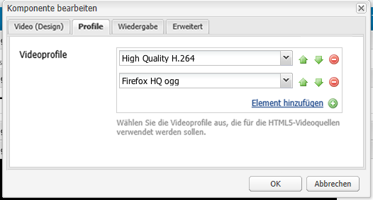

# Konfigurieren der Videokomponente  {#configure-the-video-component}

Mit der Komponente [Video](/help/sites-authoring/default-components-foundation.md#video) können Sie ein vordefiniertes OTB-Video-Asset (Out-of-the-Box) auf Ihrer Seite platzieren.

Damit eine korrekte Transkodierung erfolgt, installiert ein Administrator FFmpeg separat. Siehe [Installieren Sie FFmpeg und konfigurieren Sie AEM](#install-ffmpeg). Administratoren können auch [Videoprofile](#configure-video-profiles) für die Verwendung mit HTML5-Elementen konfigurieren.

>[!CAUTION]
>
>Diese Foundation-Komponente ist veraltet. Adobe empfiehlt stattdessen die Verwendung der [Kernkomponenten-Einbettungskomponente](https://experienceleague.adobe.com/docs/experience-manager-core-components/using/components/embed.html) .

>[!CAUTION]
>
>Es wird nicht mehr erwartet, dass diese Komponente ohne umfassende Anpassungen auf Projektebene nativ funktioniert.

## Videoprofile konfigurieren {#configure-video-profiles}

Definieren Sie für die Verwendung von HTML5-Elementen Videoprofile. Die hier getroffene Auswahl wird der Reihenfolge nach verwendet. Um zuzugreifen, verwenden Sie [Designmodus](/help/sites-authoring/default-components-designmode.md) (nur in der klassischen Benutzeroberfläche) und wählen Sie die Registerkarte **[!UICONTROL Profile]** aus:

In diesem Dialogfeld können Sie auch das Design der Videokomponente und die Parameter für [!UICONTROL Wiedergabe], [!UICONTROL Flash] und [!UICONTROL Erweitert] konfigurieren.

## Installieren Sie FFmpeg und konfigurieren Sie AEM {#install-ffmpeg}

Die Videokomponente stützt sich bei der Transkodierung von Videos auf das Open-Source-Produkt FFmpeg eines Drittanbieters. Heruntergeladen von [https://ffmpeg.org/](https://ffmpeg.org/). Konfigurieren Sie nach der Installation von FFmpeg AEM so, dass ein bestimmter Audio-Codec und bestimmte Laufzeitoptionen verwendet werden.

Gehen Sie wie folgt vor, um FFmpeg unter **Windows** zu installieren:

1. Laden Sie die kompilierte Binärdatei als `ffmpeg.zip` herunter.
1. Archivierung in einem Ordner aufheben.
1. Setzen Sie die Systemumgebungsvariable `PATH` auf &lt;*your-ffmpeg-location*`\bin`.
1. Starten Sie AEM neu.

Gehen Sie wie folgt vor, um FFmpeg auf **Mac OS X** zu installieren:

1. Installieren Sie Xcode verfügbar unter [developer.apple.com/xcode](https://developer.apple.com/xcode/).
1. Installieren Sie unter [XQuartz](https://www.xquartz.org) , um [X11](https://support.apple.com/de-de/HT201341) zu erhalten.
1. Installieren Sie MacPorts, die unter [www.macports.org](https://www.macports.org/) verfügbar sind.
1. Führen Sie in der Konsole den Befehl `sudo port install ffmpeg` aus und folgen Sie den Anweisungen auf dem Bildschirm. Stellen Sie sicher, dass der Pfad der ausführbaren Datei `FFmpeg` zur Systemvariable `PATH` hinzugefügt wird.

Gehen Sie wie folgt vor, um FFmpeg unter **Mac OS X 10.6** mit der vorkompilierten Version zu installieren:

1. Laden Sie die vorkompilierte Version herunter.
1. Heben Sie die Archivierung in das Verzeichnis `/usr/local` auf.
1. Führen Sie in der Konsole `sudo ln -s /usr/local/Cellar/ffmpeg/0.6/bin/ffmpeg /usr/bin/ffmpeg` aus. Ändern Sie die Pfade entsprechend.

Gehen Sie wie folgt vor, um **AEM** zu konfigurieren:

>[!NOTE]
>
>Diese Schritte sind nur erforderlich, wenn eine weitere Anpassung der Codecs erforderlich ist.

1. Öffnen Sie [!UICONTROL CRXDE Lite] in Ihrem Webbrowser. Rufen Sie [http://localhost:4502/crx/de](http://localhost:4502/crx/de) auf.
2. Wählen Sie den Knoten `/libs/settings/dam/video/format_aac/jcr:content` aus und stellen Sie sicher, dass die Knoteneigenschaften wie folgt lauten:

   * `audioCodec` das `aac`.
   * `customArgs` das `-flags +loop -me_method umh -g 250 -qcomp 0.6 -qmin 10 -qmax 51 -qdiff 4 -bf 16 -b_strategy 1 -i_qfactor 0.71 -cmp chroma -subq 8 -me_range 16 -coder 1 -sc_threshold 40 -b-pyramid normal -wpredp 2 -mixed-refs 1 -8x8dct 1 -fast-pskip 1 -keyint_min 25 -refs 4 -trellis 1 -direct-pred 3 -partitions i8x8,i4x4,p8x8,b8x8`.

3. Um die Konfiguration anzupassen, erstellen Sie eine Überlagerung im Knoten `/apps/settings/` und verschieben Sie dieselbe Struktur unter dem Knoten `/conf/global/settings/` . Sie kann nicht im Knoten `/libs` bearbeitet werden. Um beispielsweise den Pfad `/libs/settings/dam/video/fullhd-bp` zu überlagern, erstellen Sie ihn unter `/conf/global/settings/dam/video/fullhd-bp`.

   >[!NOTE]
   >
   >Überlagern und bearbeiten Sie den gesamten Profilknoten und nicht nur die Eigenschaft, die geändert werden muss. Solche Ressourcen werden nicht über SlingResourceMerger aufgelöst.

4. Haben Sie eine der Eigenschaften geändert, klicken Sie auf **[!UICONTROL Alle speichern.]**

>[!NOTE]
>
>Änderungen an den standardmäßigen OOTB-Workflow-Modellen (Standard Out-of-the-Box) bleiben beim Upgrade Ihrer AEM-Instanz nicht erhalten. Adobe empfiehlt, die geänderten Workflow-Modelle zu kopieren, bevor Sie sie bearbeiten. Kopieren Sie beispielsweise das Modell OOTB [!UICONTROL DAM Update Asset] , bevor Sie den Schritt FFmpeg Transcoding im Modell [!UICONTROL DAM Update Asset] bearbeiten, um Videoprofilnamen auszuwählen, die vor dem Upgrade vorhanden waren. Anschließend können Sie den Knoten `/apps` überlagern, damit AEM die benutzerdefinierten Änderungen am OOTB-Modell abrufen kann.
