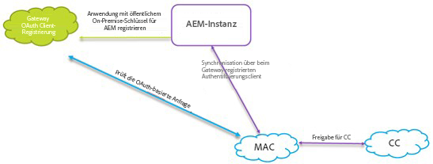
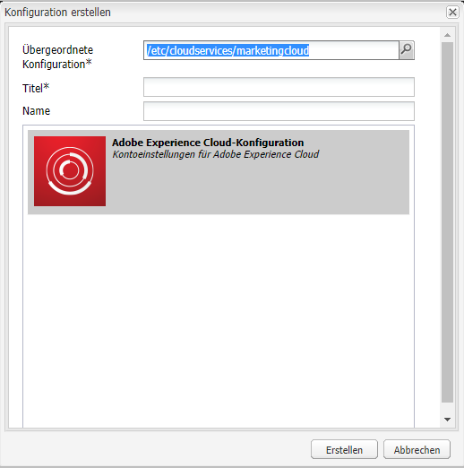
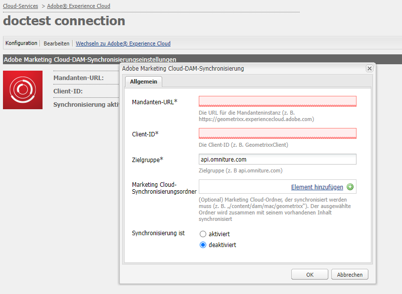
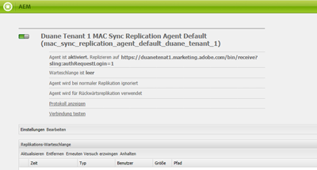

# AEM Assets-Integration mit Experience Cloud {#configure-aem-assets-integration-with-experience-cloud-and-creative-cloud} konfigurieren

Wenn Sie Adobe Experience Cloud-Kunde sind, können Sie Ihre Assets innerhalb von Adobe Experience Manager Assets mit Adobe Creative Cloud synchronisieren und umgekehrt. Sie können Ihre Assets auch mit Experience Cloud synchronisieren und umgekehrt. Sie können diese Synchronisierung über [!DNL Adobe I/O] einrichten. Der aktualisierte Name von [!DNL Adobe Marketing Cloud] ist [!DNL Adobe Experience Cloud].

Der Workflow zur Einrichtung dieser Integration ist:

1. Erstellen Sie eine Authentifizierung in [!DNL Adobe I/O] mithilfe eines öffentlichen Gateways und erhalten Sie eine Anwendungs-ID.
1. Erstellen Sie mit der Anwendungs-ID ein Profil auf Ihrer AEM Assets-Instanz.
1. Verwenden Sie diese Konfiguration, um Ihre Assets zu synchronisieren.

Am Backend authentifiziert der AEM-Server Ihr Profil gegenüber dem Gateway und synchronisiert dann die Daten zwischen Assets und Experience Cloud.

>[!NOTE]
>
>Diese Funktion wird in AEM Assets nicht mehr unterstützt. Suchen Sie nach Ersetzungen in [Best Practices zur AEM- und Creative Cloud-Integration](/help/assets/aem-cc-integration-best-practices.md). Wenn Sie Abfragen haben, wenden Sie sich an die Adobe [Kundenunterstützung](https://www.adobe.com/account/sign-in.supportportal.html).

<!-- Hiding this for now via cqdoc-16834.

>[!NOTE]
>
>Sharing assets between Adobe Experience Cloud and Adobe Creative Cloud requires administrator privileges on the AEM instance.
-->

## Erstellen einer Anwendung {#create-an-application}

1. Greifen Sie auf die Adobe Developer Gateway-Schnittstelle zu, indem Sie sich unter [https://legacy-oauth.cloud.adobe.io](https://legacy-oauth.cloud.adobe.io/) einloggen.

   >[!NOTE]
   >
   >Sie benötigen Administratorrechte, um eine Anwendungs-ID zu erstellen.

1. Navigieren Sie im linken Bereich zu **[!UICONTROL Entwicklerwerkzeuge]** > **[!UICONTROL Anwendungen]**, um eine Liste von Anwendungen Ansicht.
1. Klicken Sie auf **[!UICONTROL Hinzufügen]** , um eine Anwendung zu erstellen.
1. Wählen Sie aus der Liste **[!UICONTROL Client-Anmeldeinformationen]** die Option **[!UICONTROL Dienstkonto (JWT-Assertion)]** aus. Dies ist ein Server-zu-Server-Kommunikationsdienst für die Serverauthentifizierung.

   

1. Geben Sie einen Namen für die Anwendung und eine optionale Beschreibung an.
1. Wählen Sie aus der Liste **[!UICONTROL Organisation]** die Organisation aus, für die Sie die Assets synchronisieren möchten.
1. Wählen Sie in der Liste **[!UICONTROL Scope]** **[!UICONTROL dam-read]**, **[!UICONTROL dam-sync]**, **[!UICONTROL dam-write]** und **[!UICONTROL cc-share]**.
1. Klicken Sie auf **[!UICONTROL Erstellen]**. Eine Meldung informiert Sie darüber, dass die Anwendung erstellt wurde.

   

1. Kopieren Sie die **[!UICONTROL Anwendungs-ID]**, die für die neue Anwendung generiert wird.

   >[!CAUTION]
   >
   >Achten Sie darauf, dass Sie nicht versehentlich das **[!UICONTROL Anwendungsgeheimnis]** anstelle der **[!UICONTROL Anwendungs-ID]** kopieren.

## Neue Konfiguration für Experience Cloud {#add-a-new-configuration} Hinzufügen

1. Klicken Sie auf das AEM-Logo in der Benutzeroberfläche in Ihrer lokalen AEM Assets-Instanz und navigieren Sie zu **[!UICONTROL Tools]** > **[!UICONTROL Cloud-Services]** > **[!UICONTROL Legacy-Cloud-Services]**.

1. Suchen Sie den Dienst **[!UICONTROL Adobe Experience Cloud]**. Wenn keine Konfigurationen vorhanden sind, klicken Sie auf **[!UICONTROL Jetzt konfigurieren]**. Wenn Konfigurationen vorhanden sind, klicken Sie auf **[!UICONTROL Konfigurationen anzeigen]** und klicken Sie auf `+`, um eine neue Konfiguration hinzuzufügen.

   >[!NOTE]
   >
   >Verwenden Sie ein Adobe ID-Konto mit Administratorrechten für die entsprechende Organisation.

1. Geben Sie im Dialogfeld **[!UICONTROL Konfiguration erstellen]** einen Titel und einen Namen für die neue Konfiguration an und klicken Sie auf **[!UICONTROL Erstellen]**.

   

1. Geben Sie im Feld **[!UICONTROL Mandanten-URL]** die URL für AEM Assets ein. Wenn die URL in der Vergangenheit als `https://<tenant_id>.marketing.adobe.com` definiert wurde, ändern Sie sie in `https://<tenant_id>.experiencecloud.adobe.com`.

   1. Navigieren Sie zu **Werkzeuge > Cloud Services > Legacy-Cloud Services**. Klicken Sie unter Adobe Experience Cloud auf **Konfigurationen anzeigen**.
   1. Wählen Sie die zu bearbeitende vorhandene Konfiguration aus. Bearbeiten Sie die Konfiguration und ersetzen Sie `marketing.adobe.com` durch `experiencecloud.adobe.com`.
   1. Speichern Sie die Konfiguration. Testen Sie die Agenten für die MAC-Synchronisierung.

1. Fügen Sie im Feld **[!UICONTROL Client-ID]** die kopierte Anwendungs-ID am Ende des Verfahrens [eine Anwendung ](#create-an-application) ein.

   

1. Wählen Sie unter **[!UICONTROL Synchronisierung]** die Option **[!UICONTROL Aktiviert]** aus, um die Synchronisierung zu aktivieren, und klicken Sie auf **[!UICONTROL OK]**. Wenn Sie **disabled** auswählen, funktioniert die Synchronisierung in einer Richtung.

1. Klicken Sie auf der Konfigurationsseite auf **[!UICONTROL Öffentlichen Schlüssel anzeigen]**, um den für Ihre Instanz generierten öffentlichen Schlüssel anzuzeigen. Alternativ können Sie auf **[!UICONTROL Öffentlichen Schlüssel für OAuth Gateway herunterladen]** klicken, um die Datei mit dem öffentlichen Schlüssel herunterzuladen. Öffnen Sie dann die Datei, um den öffentlichen Schlüssel anzuzeigen.

## Aktivieren der Synchronisierung {#enable-synchronization}

1. Zeigen Sie den öffentlichen Schlüssel mit einer der folgenden Methoden an, die im letzten Schritt des Verfahrens [Neue Konfiguration zu Experience Cloud](#add-a-new-configuration) hinzugefügt werden. Klicken Sie auf **[!UICONTROL Öffentlichen Schlüssel anzeigen]**.

1. Kopieren Sie den öffentlichen Schlüssel und fügen Sie ihn in das Feld **[!UICONTROL Öffentlicher Schlüssel]** der Konfigurationsoberfläche der Anwendung ein, die Sie unter [Anwendung erstellen](#create-an-application) erstellt haben.

   

1. Klicken Sie auf **[!UICONTROL Aktualisieren]**. Synchronisieren Sie Ihre Assets jetzt mit der AEM Assets-Instanz.

## Testen der Synchronisierung {#test-the-synchronization}

1. Klicken Sie in der Benutzeroberfläche Ihrer lokalen AEM Assets-Instanz auf das AEM-Logo und navigieren Sie zu **[!UICONTROL Tools]** **[!UICONTROL Bereitstellung]**> **[!UICONTROL Replikation]**, um die für die Synchronisierung erstellten Replizierungs-Profil zu finden.
1. Klicken Sie auf der Seite **[!UICONTROL Replication]** auf **[!UICONTROL Agenten unter author]**.
1. Klicken Sie in der Liste der Profile auf das Standardreplikationsprofil zu Ihrer Organisation, um es zu öffnen.
1. Klicken Sie im Dialogfeld auf **[!UICONTROL Verbindung testen]**.

   

1. Sehen Sie sich den unteren Bereich der Testergebnisse an, um zu prüfen, ob die Replikation erfolgreich war.

## hinzufügen von Benutzern auf Experience Cloud {#add-users-to-experience-cloud}

1. Melden Sie sich mit Administratorberechtigungen bei Experience Cloud an.
1. Wechseln Sie in den Leisten zu **[!UICONTROL Administration]** und klicken Sie dann auf **[!UICONTROL Enterprise Dashboard starten]**.
1. Klicken Sie in der Leiste auf **[!UICONTROL Benutzer]**, um die Seite **[!UICONTROL Benutzerverwaltung]** zu öffnen.
1. Klicken Sie in der Symbolleiste auf **Hinzufügen** .
1. Fügen Sie einen oder mehr Benutzer hinzu, denen Sie die Möglichkeit zur Freigabe von Assets für Creative Cloud bereitstellen möchten.

<!-- TBD: Check.
   >[!NOTE]
   >
   >Only the users that you add to Experience Cloud can share assets from AEM Assets to Creative Cloud.

-->

## Austausch von Assets zwischen AEM Assets und Experience Cloud {#exchange-assets-between-aem-and-experience-cloud}

1. Melden Sie sich bei AEM Assets an.
1. Erstellen Sie in der Assets-Konsole einen Ordner und laden Sie einige Assets dort hoch. Erstellen Sie zum Beispiel einen Ordner **mc-demo** und laden Sie ein Asset dort hoch.
1. Wählen Sie den Ordner aus und klicken Sie auf **Freigeben** .
1. Wählen Sie im Menü **[!UICONTROL Adobe Experience Cloud]** und klicken Sie auf **[!UICONTROL Freigeben]**. In einer Meldung wird angezeigt, dass der Ordner für Experience Cloud freigegeben wurde.

   >[!NOTE]
   >
   >Die Freigabe eines Assets-Ordners des Typs `sling:OrderedFolder` wird im Zusammenhang mit der Freigabe in Adobe Experience Cloud nicht unterstützt. Wenn Sie einen Ordner bei seiner Erstellung in AEM Assets freigeben möchten, wählen Sie nicht die Option **[!UICONTROL Geordnet]** aus.

1. Aktualisieren Sie die AEM Assets-Benutzeroberfläche. Der Ordner, den Sie in der Asset-Konsole Ihrer lokalen AEM Assets-Instanz erstellt haben, wird in die Experience Cloud-Benutzeroberfläche kopiert. Das Asset, das Sie in den Ordner in AEM Assets hochladen, wird in der Ordnerkopie in Experience Cloud angezeigt, nachdem es vom AEM verarbeitet wurde.
1. Sie können auch ein Asset in die replizierte Kopie des Ordners in Experience Cloud hochladen. Nach der Verarbeitung wird das Asset im freigegebenen Ordner in AEM Assets angezeigt.

<!-- Removing as per PM guidance via https://jira.corp.adobe.com/browse/CQDOC-16834?focusedCommentId=22881523&page=com.atlassian.jira.plugin.system.issuetabpanels:comment-tabpanel#comment-22881523.

## Exchange assets between AEM Assets and Creative Cloud {#exchange-assets-between-aem-assets-and-creative-cloud}

>[!CAUTION]
>
>The AEM to Creative Cloud Folder Sharing feature is deprecated. Customers are strongly advised to use newer capabilities, like [Adobe Asset Link](https://helpx.adobe.com/enterprise/using/adobe-asset-link.html) or [AEM desktop app](https://helpx.adobe.com/experience-manager/desktop-app/aem-desktop-app.html). Learn more in [AEM and Creative Cloud Integration Best Practices](/help/assets/aem-cc-integration-best-practices.md).

AEM Assets lets you share folders containing assets with Adobe Creative Cloud users.

1. In the Assets console, select the folder to share with Creative Cloud.
1. From the toolbar, click **[!UICONTROL Share]** .
1. From the list, select the **[!UICONTROL Adobe Creative Cloud]** option.

   >[!NOTE]
   >
   >The options are available for users with read permissions on the root. Users must have the required permission to access the replication agent information of Marketing Cloud.

1. In the **[!UICONTROL Creative Cloud Sharing]** page, add the user to share the folder with and choose a role for the user. Click **[!UICONTROL Save]** and click **[!UICONTROL OK]**.

1. Log on to Creative Cloud with the credentials of the user you shared the folder with. The shared folder is available in Creative Cloud.

The AEM Assets-Marketing Cloud synchronization is designed in a way that the user machine instance from where the asset is uploaded retains the right to modify the asset. Only these changes are propagated to the other instance.

For example, if an asset is uploaded from an AEM Assets (on premises) instance, the changes to the asset from this instance are propagated to the Marketing Cloud instance. However, the changes done from the Marketing Cloud instance to the same asset aren’t propagated to the AEM instance and vice versa for asset uploaded from Marketing Cloud.
-->

>[!MORELIKETHIS]
>
>* [Best Practices zur Asset- und Creative Cloud-Integration](/help/assets/aem-cc-integration-best-practices.md)
>* [Best Practices für den Austausch von Assets im Creative Cloud-Ordner](/help/assets/aem-cc-folder-sharing-best-practices.md)

