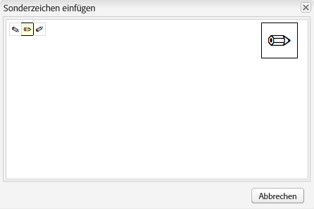

# Konfigurieren der Rich-Text-Editor-Plug-ins {#configure-the-rich-text-editor-plug-ins}

RTE-Funktionen werden über eine Reihe von Plug-ins mit jeweils einer Eigenschaft „Funktionen“ bereitgestellt. Sie können die features -Eigenschaft konfigurieren, um eine oder mehrere RTE-Funktionen zu aktivieren oder zu deaktivieren. In diesem Artikel wird beschrieben, wie Sie die RTE-Plug-ins spezifisch konfigurieren.

Weitere Informationen zu den anderen RTE-Konfigurationen finden Sie unter [Konfigurieren des Rich-Text-Editors](/help/sites-administering/rich-text-editor.md).

>[!NOTE]
>
>Beim Arbeiten mit CRXDE Lite ist es ratsam, die Änderungen regelmäßig mit der Option [!UICONTROL Alle speichern] zu speichern.

## Aktivieren von Plug-ins und Konfigurieren der Eigenschaft „features“ {#activateplugin}

Gehen Sie wie folgt vor, um ein Plug-in zu aktivieren. Einige Schritte sind nur erforderlich, wenn Sie ein Plug-in zum ersten Mal konfigurieren, da die entsprechenden Knoten noch nicht vorhanden sind.

Standardmäßig sind die Plug-ins `format`, `link`, `list`, `justify` und `control` sowie alle ihre Funktionen im RTE aktiviert.

>[!NOTE]
>
>Der entsprechende Knoten `rtePlugins` wird als `<rtePlugins-node>` bezeichnet, um Dopplungen in diesem Artikel zu vermeiden.

1. Suchen Sie mithilfe von CRXDE Lite nach der Textkomponente für Ihr Projekt.
1. Falls noch nicht vorhanden, erstellen Sie den übergeordneten Knoten von `<rtePlugins-node>`, bevor Sie mit dem Konfigurieren von RTE-Plug-ins beginnen:

   * Abhängig von Ihrer Komponente sind die übergeordneten Knoten:

      * `config: .../text/cq:editConfig/cq:inplaceEditing/config`
      * ein alternativer Konfigurationsknoten: `.../text/cq:editConfig/cq:inplaceEditing/inplaceEditingTextConfig`
      * `text: .../text/dialog/items/tab1/items/text`

   * Sie weisen den folgenden Typ auf: **jcr:primaryType** `cq:Widget`
   * Beide verfügen über die folgenden Eigenschaften:

      * **Name** `name`
      * **Typ** `String`
      * **Wert** `./text`

1. Erstellen Sie je nach Benutzeroberfläche, für die Sie konfigurieren, einen Knoten `<rtePlugins-node>`, falls nicht vorhanden:

   * **Name** `rtePlugins`
   * **Typ** `nt:unstructured`

1. Erstellen Sie darunter einen Knoten für jedes Plug-in, das Sie aktivieren möchten:

   * **Typ** `nt:unstructured`
   * **Name:** die Plug-in-ID des erforderlichen Plug-ins

Halten Sie sich nach der Aktivierung eines Plug-ins an diese Richtlinien, um die Eigenschaft `features` zu konfigurieren.

| | Alle Funktionen aktivieren | Bestimmte Funktionen aktivieren | Alle Funktionen deaktivieren |
|---|---|---|---|
| Name | Funktionen | Funktionen | Funktionen |
| Typ | Zeichenfolge | Zeichenfolge[] (mehrere Zeichenfolgen; wählen Sie den Typ „Zeichenfolge“ aus und klicken Sie in CRXDE Lite auf „Multi“) | Zeichenfolge |
| Wert | `*` (ein Sternchen) | Legen Sie einen oder mehrere Werte für die Eigenschaft „features“ fest. | - |

## Grundlegendes zum findreplace-Plug-in {#findreplace}

Das `findreplace`-Plug-in (Suchen und Ersetzen) erfordert keine Konfiguration. Es ist vorkonfiguriert und sofort einsatzfähig.

Bei Verwendung der Funktion zum Ersetzen sollte die Zeichenfolge zum Ersetzen gleichzeitig mit der Suchzeichenfolge eingegeben werden. Sie können jedoch weiterhin auf „Suchen“ klicken, um nach der Zeichenfolge zu suchen, bevor Sie sie ersetzen. Wenn die Zeichenfolge zum Ersetzen eingegeben wird, nachdem auf „Suchen“ geklickt wurde, wird die Suche auf den Anfang des Textes zurückgesetzt.

Das Dialogfeld „Suchen und ersetzen“ wird transparent, wenn auf „Suchen“ geklickt wird, und undurchsichtig, wenn auf „Ersetzen“ geklickt wird. Dadurch kann der Autor den Text überprüfen, den der Autor ersetzt. Wenn Benutzer auf Alle ersetzen klicken, wird das Dialogfeld geschlossen und die Anzahl der vorgenommenen Ersetzungen angezeigt.

## Konfigurieren der Einfügemodi {#paste-modes}

Bei Verwendung von RTE können Autorinnen und Autoren Inhalte in einem der folgenden drei Modi einfügen:

* **Browser-Modus**: Fügen Sie Text mithilfe der standardmäßigen Implementierung von „Einfügen“ des Browsers ein. Dieses Verfahren wird nicht empfohlen, da es unerwünschte Markups verursachen kann.

* **Klartextmodus**: Fügen Sie Inhalte aus der Zwischenablage als Text ein. Dadurch werden alle Stil- und Formatierungselemente vom kopierten Inhalt entfernt, bevor er in eine Komponente von [!DNL Experience Manager] eingefügt wird.

* **MS® Word-Modus**: Fügen Sie beim Kopieren aus Microsoft® Word den Text, einschließlich Tabellen, mit Formatierung ein. Das Kopieren und Einfügen von Text aus einer anderen Quelle wie einer Webseite oder MS® Excel wird nicht unterstützt und es wird nur eine teilweise Formatierung beibehalten.

### Konfigurieren der in der RTE-Symbolleiste verfügbaren Einfüge-Optionen   {#configure-paste-options-available-on-the-rte-toolbar}

Sie können Ihren Autoren in der RTE-Symbolleiste nur einige, alle oder keine dieser drei Symbole zur Verfügung stellen:

* **[!UICONTROL Einfügen (STRG+V)]**: Kann vorkonfiguriert werden, um einem der drei obigen Einfügemodi zu entsprechen.

* **[!UICONTROL Als Text einfügen]**: Bietet Funktionen im Klartextmodus.

* **[!UICONTROL Aus Word einfügen]**: Bietet Funktionen des Microsoft® Word-Modus.

Um die Anzeige der Symbole in RTE zu konfigurieren, führen Sie folgende Schritte aus.

1. Navigieren Sie zu Ihrer Komponente, z. B. `/apps/<myProject>/components/text`.
1. Navigieren Sie zum Knoten `rtePlugins/edit`. Lesen Sie die Informationen unter [Aktivieren von Plug-ins](#activateplugin), falls noch kein Knoten vorhanden ist.
1. Erstellen Sie die Eigenschaft `features` im Knoten `edit` und fügen Sie eine oder mehrere Funktionen hinzu. Speichern Sie alle Änderungen.

### Verhalten des Symbols bzw. der Tastenkombination „Einfügen (STRG+V)“ konfigurieren {#configure-the-behavior-of-the-paste-ctrl-v-icon-and-shortcut}

Sie können das Verhalten des Symbols **[!UICONTROL Einfügen (Strg+V)]** mit den folgenden Schritten vorkonfigurieren. Diese Konfiguration definiert auch das Verhalten des Tastaturbefehls Strg+V, den Autorinnen und Autoren zum Einfügen von Inhalten verwenden.

Die Konfiguration ermöglicht die folgenden drei Arten von Anwendungsfällen:

* Fügen Sie Text mithilfe der standardmäßigen Implementierung des Browsers zum Einfügen ein. Dieses Verfahren wird nicht empfohlen, da es unerwünschte Markups verursachen kann. Konfiguriert mithilfe von `browser`, wie unten gezeigt.

* Fügen Sie den Inhalt aus der Zwischenablage als Text ein. Dadurch werden alle Stil- und Formatierungselemente vom kopierten Inhalt entfernt, bevor er in eine AEM-Komponente eingefügt wird. Konfiguriert mithilfe von `plaintext`, wie unten gezeigt.

* Fügen Sie den Text, einschließlich Tabellen, mit Formatierung beim Kopieren aus Microsoft® Word ein. Das Kopieren und Einfügen von Text aus einer anderen Quelle wie einer Webseite oder MS® Excel wird nicht unterstützt und es wird nur eine teilweise Formatierung beibehalten. Konfiguriert mithilfe von `wordhtml`, wie unten gezeigt.

1. Navigieren Sie in Ihrer Komponente zum Knoten `<rtePlugins-node>/edit`. Erstellen Sie die Knoten, falls diese nicht vorhanden sind. Weitere Informationen finden Sie unter [Aktivieren von Plug-ins](#activateplugin).
1. Im `edit` -Knoten erstellen Sie eine Eigenschaft mit den folgenden Details:

   * **Name** `defaultPasteMode`
   * **Typ** `String`
   * **Wert:** einer der erforderlichen Einfügemodi `browser`, `plaintext` oder `wordhtml`.

### Konfigurieren der beim Einfügen von Inhalten zulässigen Formate {#pasteformats}

Das &quot;paste-as-Microsoft-Word&quot;(`paste-wordhtml`) können weiter konfiguriert werden, sodass Sie explizit festlegen können, welche Stile beim Einfügen von Inhalten in AEM von einem anderen Programm wie Microsoft® Word aus zulässig sind.

Sollen beim Einfügen von Inhalten in AEM zum Beispiel nur fett gedruckte Formate und Listen zulässig sein, können Sie die anderen Formate herausfiltern. Dieser Vorgang wird als konfigurierbare Filterung beim Einfügen bezeichnet, die für Folgendes verwendet werden kann:

* [Text](#paste-modes)
* [Links](#linkstyles)

Für Links können Sie zudem die Protokolle definieren, die automatisch akzeptiert werden.

So konfigurieren Sie, welche Formate beim Einfügen von Text in AEM von einem anderen Programm aus zulässig sind:

1. Navigieren Sie in Ihrer Komponente zum Knoten `<rtePlugins-node>/edit`. Erstellen Sie die Knoten, falls diese nicht vorhanden sind. Weitere Informationen finden Sie unter [Aktivieren von Plug-ins](#activateplugin).
1. Erstellen Sie einen Knoten unter dem `edit` -Knoten, damit Sie die HTML-Einfügeregeln speichern können:

   * **Name** `htmlPasteRules`
   * **Typ** `nt:unstructured`

1. Erstellen Sie einen Knoten unter `htmlPasteRules`, sodass Sie Details zu den zulässigen grundlegenden Formaten speichern können:

   * **Name** `allowBasics`
   * **Typ** `nt:unstructured`

1. Erstellen Sie zur Steuerung der einzelnen akzeptierten Formate eine oder mehrere der folgenden Eigenschaften im Knoten `allowBasics`:

   * **Name** `bold`
   * **Name** `italic`
   * **Name** `underline`
   * **Name:** `anchor` (sowohl für Links als auch für benannte Anker)
   * **Name** `image`

   Alle Eigenschaften weisen den **Typ** `Boolean` auf, daher können Sie für den geeigneten **Wert** das Kontrollkästchen aktivieren oder deaktivieren, um die Funktion entsprechend zu aktivieren oder zu deaktivieren.

   >[!NOTE]
   >
   >Ist der Wert nicht explizit festgelegt, wird der Standardwert „true“ verwendet und das Format akzeptiert.

1. Es können mithilfe einer Reihe anderer Eigenschaften oder Knoten auch andere Formate auf den Knoten `htmlPasteRules` angewendet werden. Speichern Sie alle Änderungen.

Sie können die folgenden Eigenschaften für `htmlPasteRules` verwenden.

| Eigenschaft | Typ | Beschreibung |
|---|---|---|
| `allowBlockTags` | Zeichenfolge | Definiert die Liste der zulässigen Block-Tags. Zu den möglichen Block-Tags gehören: <ul> <li>Überschriften (h1, h2, h3)</li> <li>Buchstaben p</li> <li>Listen (ol, ul)</li> <li>Tabellen (Tabelle)</li> </ul> |
| `fallbackBlockTag` | Zeichenfolge | Definiert das Block-Tag, das für alle Blöcke mit einem Block-Tag verwendet wird, das nicht in `allowBlockTags` enthalten ist. `p` in der Regel ausreicht. |
| table | nt:unstructured | Definiert das Verhalten beim Einfügen von Tabellen. Dieser Knoten muss über die Eigenschaft `allow` (Typ Boolean) verfügen, um festzulegen, ob das Einfügen von Tabellen zulässig ist. Wenn allow auf `false` gesetzt ist, müssen Sie den Wert für die Eigenschaft `ignoreMode` (Typ String) angeben, um festzulegen, wie eingefügte Tabelleninhalte verarbeitet werden sollen. Gültige Werte für `ignoreMode` sind: <ul> <li>`remove`: Entfernt Tabelleninhalte.</li> <li>`paragraph`: Wandelt Tabellenzellen in Absätze um.</li> </ul> |
| list | nt:unstructured | Definiert das Verhalten beim Einfügen von Listen. Muss über die Eigenschaft `allow` (Typ: Boolean) verfügen, um festzulegen, ob das Einfügen von Listen zulässig ist. Wenn `allow` auf `false` gesetzt ist, müssen Sie den Wert für die Eigenschaft `ignoreMode` (Typ String) angeben, um festzulegen, wie eingefügte Listeninhalte verarbeitet werden. Gültige Werte für `ignoreMode` sind: <ul><li> `remove`: Entfernt Listeninhalte.</li> <li>`paragraph`: Wandelt Listenelemente in Absätze um.</li> </ul> |

Ein Beispiel für eine gültige `htmlPasteRules`-Struktur ist unten aufgeführt.

```xml
"htmlPasteRules": {
    "allowBasics": {
        "italic": true,
        "link": true
    },
    "allowBlockTags": [
        "p", "h1", "h2", "h3"
    ],
    "list": {
        "allow": false,
        "ignoreMode": "paragraph"
    },
    "table": {
        "allow": true,
        "ignoreMode": "paragraph"
    }
}
```

## Konfigurieren von Textstilen {#textstyles}

Autorinnen und Autoren können Stile anwenden, um das Erscheinungsbild eines Textabschnitts zu ändern. Die Stile basieren auf CSS-Klassen, die Sie in Ihrem CSS-Stylesheet vordefinieren. Stilisierter Inhalt wird in `span`-Tags eingeschlossen, wobei das Attribut `class` zum Verweis auf die CSS-Klasse verwendet wird. Beispiel: `<span class=monospaced>Monospaced Text Here</span>`.

Wenn das Plug-in „Stile“ zum ersten Mal aktiviert wird, sind keine Standardstile verfügbar. Die Popup-Liste ist leer. Gehen Sie wie folgt vor, um Stile für Autorinnen und Autoren bereitzustellen:

* Aktivieren Sie die Dropdown-Auswahl „Stil“.
* Geben Sie die Speicherorte der Stylesheets an.
* Geben Sie die einzelnen Stile an, die aus der Dropdown-Liste Stil ausgewählt werden können.

Für spätere Konfigurationen, beispielsweise um weitere Stile hinzuzufügen, befolgen Sie nur die Anweisungen zum Verweisen auf ein neues Stylesheet und zum Angeben zusätzlicher Stile.

>[!NOTE]
>
>Sie können Stile für [Tabellen oder Tabellenzellen](/help/sites-administering/configure-rich-text-editor-plug-ins.md#tablestyles) definieren. Diese Konfigurationen erfordern unterschiedliche Vorgehensweisen.

### Aktivieren der Dropdown-Auswahlliste „Stil“ {#styleselectorlist}

Dazu aktivieren Sie das Stil-Plug-in.

1. Navigieren Sie in Ihrer Komponente zum Knoten `<rtePlugins-node>/styles`. Erstellen Sie die Knoten, falls diese nicht vorhanden sind. Weitere Informationen finden Sie unter [Aktivieren von Plug-ins](#activateplugin).
1. Erstellen Sie die `features`-Eigenschaft für den Knoten `styles`:

   * **Name** `features`
   * **Typ** `String`
   * **Wert:** `*` (Sternchen)

1. Speichern Sie alle Änderungen.

>[!NOTE]
>
>Sobald das styles-Plug-in aktiviert ist, wird die Dropdown-Liste „Stil“ im Dialogfeld „Bearbeiten“ angezeigt. Allerdings ist die Liste leer, da keine Stile konfiguriert sind.

### Festlegen der Speicherorte für Stylesheets {#locationofstylesheet}

Geben Sie dann die Speicherorte der Stylesheets an, auf die Sie verweisen möchten:

1. Navigieren Sie zum Stammknoten der Textkomponente, beispielsweise `/apps/<myProject>/components/text`.
1. Fügen Sie dem übergeordneten Knoten des Knotens `<rtePlugins-node>` die Eigenschaft `externalStyleSheets` hinzu:

   * **Name** `externalStyleSheets`
   * **Typ:** `String[]` (mehrere Zeichenfolgen; klicken Sie in CRXDE auf **Multi**)
   * **Werte** Der Pfad und der Dateiname jedes Stylesheets, das Sie einbeziehen möchten. Verwenden Sie Repository-Pfade.

   >[!NOTE]
   >
   >Sie können jederzeit Verweise auf weitere Stylesheets hinzufügen.

1. Speichern Sie alle Änderungen.

>[!NOTE]
>
>Bei Verwendung des RTE in einem Dialogfeld (klassische Benutzeroberfläche) können Sie Stylesheets festlegen, die für die Rich-Text-Bearbeitung optimiert sind. Aufgrund technischer Einschränkungen geht der CSS-Kontext im Editor verloren. Daher sollten Sie diesen Kontext emulieren, um das WYSIWYG-Erlebnis zu verbessern.
>
>Der Rich-Text-Editor verwendet ein Container-DOM-Element mit einer ID von `CQrte`, die verwendet werden kann, um verschiedene Stile für die Anzeige und Bearbeitung bereitzustellen:
>
>`#CQ td {`
>` // defines the style for viewing }`
>
>`#CQrte td {`
>` // defines the style for editing }`

### Festlegen von Stilen, die in der Popup-Liste verfügbar sein sollen {#stylesindropdown}

1. Gehen Sie in der Komponentendefinition zum Knoten `<rtePlugins-node>/styles`, den Sie wie unter [Aktivieren der Dropdown-Auswahl „Stil“](#styleselectorlist) beschrieben erstellt haben.
1. Erstellen Sie unter dem Knoten `styles` einen neuen Knoten (ebenfalls mit dem Namen `styles`), unter dem die zur Verfügung zu stellende Liste gespeichert werden soll:

   * **Name** `styles`
   * **Typ** `cq:WidgetCollection`

1. Erstellen Sie einen Knoten unter dem `styles` -Knoten, damit Sie einen einzelnen Stil darstellen können:

   * **Name:** Sie können einen Namen angeben, dieser sollte jedoch dem Stil entsprechen.
   * **Typ** `nt:unstructured`

1. Eigenschaft hinzufügen `cssName` auf diesen Knoten zu, damit Sie auf die CSS-Klasse verweisen können:

   * **Name** `cssName`
   * **Typ** `String`
   * **Wert:** Der Name der CSS-Klasse (ohne „.“ voranzustellen; beispielsweise `cssClass` anstatt `.cssClass`)

1. Fügen Sie demselben Knoten die Eigenschaft `text` hinzu. Dadurch wird der im Auswahlfeld angezeigte Text definiert:

   * **Name** `text`
   * **Typ** `String`
   * **Wert**: Beschreibung des Stils. Sie wird im Dropdown-Auswahlfeld „Stil“ angezeigt.

1. Speichern Sie die Änderungen.

   Wiederholen Sie die obigen Schritte für jeden benötigten Stil.

### RTE für optimale Wortumbrüche auf Japanisch konfigurieren {#jpwordwrap}

Autoren, die AEM verwenden, um japanische Sprachinhalte zu erstellen, können einen Stil auf Zeichen anwenden, um Zeilenumbrüche zu vermeiden, bei denen kein Umbruch erforderlich ist. Dadurch können Autorinnen und Autoren die Sätze an der gewünschten Position umbrechen lassen. Der Stil dieser Funktion basiert auf der CSS-Klasse, die im CSS-Stylesheet vordefiniert ist.

>[!NOTE]
>
>Diese Funktion erfordert mindestens AEM 6.5 Service Pack 1.

Führen Sie folgende Schritte aus, um den Stil zu erstellen, den Autoren auf japanischen Text anwenden können:

1. Erstellen Sie einen neuen Knoten unter dem Stile-Knoten. Siehe [einen neuen Stil angeben](#stylesindropdown).
   * Name: `jpn-word-wrap`
   * Typ: `nt:unstructure`

1. Eigenschaft hinzufügen `cssName` zum Knoten hinzu, damit Sie auf die CSS-Klasse verweisen können. Dieser Klassenname ist ein reservierter Name für die japanische Wortumbruchfunktion.
   * Name: `cssName`
   * Typ: `String`
   * Wert: `jpn-word-wrap` (ohne `.` voranzustellen)

1. Fügen Sie den Eigenschaftstext demselben Knoten hinzu. Der Wert ist der Name des Stils, den der Autor bei der Auswahl des Stils sieht.
   * Name: `text`
*Typ: `String`
   * Wert: `Japanese word-wrap`

1. Erstellen Sie ein Stylesheet und geben Sie seinen Pfad an. Siehe [Speicherort des Stylesheets angeben](#locationofstylesheet). Fügen Sie dem Stylesheet die folgenden Inhalte hinzu. Ändern Sie die Hintergrundfarbe wie gewünscht.

   ```css
   .text span.jpn-word-wrap {
       display:inline-block;
   }
   .is-edited span.jpn-word-wrap {
       background-color: #ffddff;
   }
   ```

   

## Konfigurieren der Absatzformate {#paraformats}

Jeglicher im RTE verfasster Text wird in einem Block-Tag platziert, standardmäßig handelt es sich dabei um das Tag `<p>`. Durch Aktivierung des `paraformat`-Plug-ins können Sie weitere Block-Tags festlegen, die mithilfe einer Dropdown-Auswahlliste Absätzen zugewiesen werden können. Absatzformate bestimmen den Absatztyp durch Zuweisung des richtigen Block-Tags. Die Autorin bzw. der Autor kann sie mithilfe der Selektors „Format“ auswählen und zuweisen. Die Beispiel-Block-Tags umfassen unter anderem den Standardabsatz &lt;p> und Überschriften &lt;h1>, &lt;h2>usw.

>[!CAUTION]
>
>Dieses Plug-in ist nicht für Inhalte mit komplexen Strukturen wie Listen oder Tabellen geeignet.

>[!NOTE]
>
>Wenn beispielsweise ein Block-Tag &lt;hr> -Tag nicht einem Absatz zugewiesen werden können, ist dies kein gültiger Anwendungsfall für ein Paraformat-Plug-in.

Wenn das Plug-in „Absatzformate“ zum ersten Mal aktiviert wird, sind keine standardmäßigen Absatzformate verfügbar. Die Popup-Liste ist leer. Gehen Sie wie folgt vor, um den Autoren Absatzformate bereitzustellen:

* Aktivieren Sie die Dropdown-Auswahlliste „Format“.
* Geben Sie die Block-Tags an, die aus der Dropdown-Liste als Absatzformate ausgewählt werden können.

Für spätere Konfigurationen oder Neukonfigurationen, z. B. um weitere Formate hinzuzufügen, folgen Sie nur dem entsprechenden Teil der Anweisungen.

### Aktivieren der Dropdown-Auswahl „Format“. {#formatselectorlist}

Aktivieren Sie zunächst das paraformat-Plug-in:

1. Navigieren Sie in Ihrer Komponente zum Knoten `<rtePlugins-node>/paraformat`. Erstellen Sie die Knoten, falls diese nicht vorhanden sind. Weitere Informationen finden Sie unter [Aktivieren von Plug-ins](#activateplugin).
1. Erstellen Sie die `features`-Eigenschaft für den Knoten `paraformat`:

   * **Name** `features`
   * **Typ** `String`
   * **Wert:** `*` (Sternchen)

>[!NOTE]
>
Wenn das Plug-in nicht weiter konfiguriert ist, werden die folgenden Standardformate aktiviert:
>
* Absatz ( `<p>`)
* Überschrift 1 ( `<h1>`)
* Überschrift 2 ( `<h2>`)
* Überschrift 3 ( `<h3>`)
>

>[!CAUTION]
>
Entfernen Sie beim Konfigurieren des Absatzformats des RTE nicht das Absatz-Tag &lt;p> als Formatierungsoption. Wenn die Variable `<p>` -Tag entfernt wird, kann der Inhaltsautor die **Absatzformate** auch dann, wenn zusätzliche Formate konfiguriert sind.

### Angeben der verfügbaren Absatzformate {#paraformatsindropdown}

Absatzformate werden wie folgt zur Auswahl bereitgestellt:

1. Navigieren Sie in der Komponentendefinition zum Knoten `<rtePlugins-node>/paraformat`, den Sie wie unter [Aktivieren der Dropdown-Auswahl „Format“](#styleselectorlist) beschrieben erstellt haben.
1. Unter dem `paraformat` erstellen Sie einen Knoten, unter dem die Liste der Formate gespeichert werden soll:

   * **Name** `formats`
   * **Typ** `cq:WidgetCollection`

1. Erstellen Sie einen neuen Knoten unter dem Knoten `formats`, der die Details für ein einzelnes Format beinhaltet:

   * **Name:** Sie können einen Namen angeben, dieser sollte jedoch dem Format entsprechen (z. B. myparagraph, myheading1).
   * **Typ** `nt:unstructured`

1. Fügen Sie diesem Knoten die Eigenschaft hinzu, um das verwendete Block-Tag zu definieren:

   * **Name** `tag`
   * **Typ** `String`
   * **Wert** Das Block-Tag für das Format, z. B.: p, h1, h2.

     Es ist nicht notwendig, die abgrenzenden spitzen Klammern einzugeben.

1. Fügen Sie demselben Knoten eine weitere Eigenschaft hinzu, damit ein beschreibender Text in der Dropdown-Liste angezeigt wird:

   * **Name** `description`
   * **Typ** `String`
   * **Wert** Der beschreibende Text für dieses Format, beispielsweise Absatz, Überschrift 1, Überschrift 2. Dieser Text wird in der Auswahlliste „Format“ angezeigt.

1. Speichern Sie die Änderungen.

   Wiederholen Sie die Schritte für jedes erforderliche Format.

>[!CAUTION]
>
Die Standardformate (`<p>`, `<h1>`, `<h2>` und `<h3>`) werden entfernt, wenn Sie benutzerdefinierte Formate definieren. Da `<p>` das Standardformat ist, müssen Sie dieses Format neu erstellen.

## Konfigurieren von Sonderzeichen {#spchar}

Wenn in einer AEM-Standardinstallation das `misctools`-Plug-in für Sonderzeichen (`specialchars`) aktiviert wird, ist sofort eine Standardauswahl verfügbar, wie beispielsweise Copyright- und Markenzeichensymbole.

Sie können den RTE aber auch so konfigurieren, dass Ihre eigene Auswahl an Zeichen zur Verfügung steht, entweder indem Sie einzelne Zeichen oder eine ganze Sequenz definieren.

>[!CAUTION]
>
Wenn Sie eigene Sonderzeichen hinzufügen, wird die Standardauswahl überschrieben. Definieren oder definieren Sie diese Zeichen bei Bedarf in Ihrer eigenen Auswahl.

### Definieren einzelner Zeichen {#definesinglechar}

1. Navigieren Sie in Ihrer Komponente zum Knoten `<rtePlugins-node>/misctools`. Erstellen Sie die Knoten, falls diese nicht vorhanden sind. Weitere Informationen finden Sie unter [Aktivieren von Plug-ins](#activateplugin).
1. Erstellen Sie die `features`-Eigenschaft für den Knoten `misctools`:

   * **Name** `features`
   * **Typ** `String[]`
   * **Wert** `specialchars`

         (oder `String / *`, wenn alle Funktionen für dieses Plug-in verwendet werden sollen)

1. under `misctools`erstellen Sie einen Knoten, unter dem die Sonderzeichenkonfigurationen gespeichert werden sollen:

   * **Name** `specialCharsConfig`
   * **Typ** `nt:unstructured`

1. under `specialCharsConfig`erstellen Sie einen weiteren Knoten, unter dem die Liste der Zeichen gespeichert werden soll:

   * **Name** `chars`
   * **Typ** `nt:unstructured`

1. under `chars`Fügen Sie einen Knoten hinzu, unter dem eine individuelle Zeichendefinition gespeichert werden soll:

   * **Name:** Sie können einen Namen angeben, dieser sollte jedoch das Zeichen widerspiegeln, wie beispielsweise „half“ (halb).
   * **Typ** `nt:unstructured`

1. Fügen Sie diesem Knoten die folgende Eigenschaft hinzu:

   * **Name** `entity`
   * **Typ** `String`
   * **Wert:** Die HTML-Darstellung des erforderlichen Zeichens, z. B. `&189;` für die Bruchzahl „ein halb“.

1. Speichern Sie die Änderungen.

Sobald die Eigenschaft gespeichert wurde, wird das entsprechende Zeichen in CRXDE angezeigt. Siehe „half“ im unten aufgeführten Beispiel. Wiederholen Sie die obigen Schritte, damit Autoren weitere Sonderzeichen zur Verfügung stehen.


### Definieren von Zeichenbereichen {#definerangechar}

1. Schritte 1 bis 3 verwenden von [Definieren eines einzelnen Zeichens](#definesinglechar).
1. under `chars`Fügen Sie einen Knoten hinzu, unter dem die Definition des Zeichenbereichs gespeichert werden soll:

   * **Name:** Sie können einen Namen angeben, dieser sollte jedoch den Zeichenbereich widerspiegeln, wie beispielsweise „pencils“.
   * **Typ** `nt:unstructured`

1. Fügen Sie unter diesem Knoten (der entsprechend dem Sonderzeichenbereich benannt wurde) die folgenden beiden Eigenschaften hinzu:

   * **Name** `rangeStart`
     **Typ** `Long`
     **Wert:** Die [Unicode](https://unicode.org/)-Darstellung (Dezimalzahl) der ersten Zeichen des Bereichs

   * **Name** `rangeEnd`
     **Typ** `Long`
     **Wert:** Die [Unicode](https://unicode.org/)-Darstellung (Dezimalzahl) des letzten Zeichens des Bereichs

1. Speichern Sie die Änderungen.

   Wenn Sie beispielsweise einen Bereich 9998 - 10000 definieren, erhalten Sie die folgenden Zeichen.

   

   *Abbildung: Definieren Sie in CRXDE einen Zeichenbereich, um ihn im RTE verfügbar zu machen.*

   

## Konfigurieren von Tabellenstilen {#tablestyles}

Stile werden in der Regel auf Text angewendet, es kann jedoch auch ein separater Satz von Stilen auf eine Tabelle oder einige Tabellenzellen angewendet werden. Solche Stile sind für Autorinnen und Autoren entweder im Dialogfeld „Zelleneigenschaften“ oder „Tabelleneigenschaften“ über das Feld „Stilauswahl“ verfügbar. Diese Stile sind nur verfügbar, wenn eine Tabelle in einer Textkomponente (oder einer abgeleiteten Komponente davon) und nicht in der standardmäßigen Tabellenkomponente bearbeitet wird.

>[!NOTE]
>
Sie können Stile für Tabellen und Zellen nur für die klassische Benutzeroberfläche definieren.

>[!NOTE]
>
Das Kopieren und Einfügen von Tabellen in oder aus der RTE-Komponente ist Browser-abhängig. Es wird nicht standardmäßig für alle Browser unterstützt. Je nach Tabellenstruktur und Browser kann es zu unterschiedlichen Ergebnissen kommen. Wenn Sie beispielsweise eine Tabelle in eine RTE-Komponente in Mozilla Firefox in der klassischen und der Touch-optimierten Benutzeroberfläche kopieren und einfügen, bleibt das Layout der Tabelle nicht erhalten.

1. Navigieren Sie in Ihrer Komponente zum Knoten . `<rtePlugins-node>/table`. Erstellen Sie die Knoten, falls diese nicht vorhanden sind. Weitere Informationen finden Sie unter [Aktivieren von Plug-ins](#activateplugin).
1. Erstellen Sie die `features`-Eigenschaft für den Knoten `table`:

   * **Name** `features`
   * **Typ** `String`
   * **Wert:** `*` (Sternchen)

   >[!NOTE]
   >
   Wenn Sie nicht alle Tabellenfunktionen aktivieren möchten, können Sie die `features` Eigenschaft als:
   >
   * **Typ** `String[]`
   >
   * **Wert** je nach Bedarf eine oder beide der folgenden Optionen:
   * `table` – um die Bearbeitung von Tabelleneigenschaften zuzulassen, einschließlich der Stile.
   * `cellprops` – um die Bearbeitung von Zelleneigenschaften zuzulassen, einschließlich der Stile.

1. Definieren Sie den Speicherort von CSS-Stylesheets, damit Sie diese referenzieren können. Siehe [Festlegen des Stylesheet-Speicherorts](#locationofstylesheet), da dieser derselbe wie bei der Definition der [Textstile](#textstyles) ist. Der Speicherort wurde möglicherweise bereits beim Definieren anderer Stile definiert.
1. Unter dem `table` erstellen Sie die folgenden neuen Knoten (nach Bedarf):

   * Definieren der Stile für die komplette Tabelle (verfügbar unter **Tabelleneigenschaften**):

      * **Name** `tableStyles`
      * **Typ** `cq:WidgetCollection`

   * Definieren der Stile für einzelne Tabellenzellen (verfügbar unter **Zellen-Eigenschaften**):

      * **Name** `cellStyles`
      * **Typ** `cq:WidgetCollection`

1. Erstellen Sie einen Knoten (unter dem `tableStyles` oder `cellStyles` -Knoten), sodass Sie einen einzelnen Stil darstellen können:

   * **Name:** Sie können einen Namen angeben, dieser sollte jedoch den Stil widerspiegeln.
   * **Typ** `nt:unstructured`

1. Erstellen Sie auf diesem Knoten die folgenden Eigenschaften:

   * Definieren des CSS-Stils, auf den verwiesen werden soll:

      * **Name** `cssName`
      * **Typ** `String`
      * **Wert:** Der Name der CSS-Klasse (ohne `.` voranzustellen, beispielsweise `cssClass` anstatt `.cssClass`)

   * Definieren eines beschreibenden Texts, der in der Dropdown-Auswahl angezeigt werden soll:

      * **Name** `text`
      * **Typ** `String`
      * **Wert:** Der Text, der in der Auswahlliste angezeigt werden soll

1. Speichern Sie alle Änderungen.

Wiederholen Sie die obigen Schritte für jeden benötigten Stil.

### Konfigurieren von ausgeblendeten Kopfzeilen in Tabellen, um die Zugänglichkeit zu verbessern {#hiddenheader}

Manchmal können Sie Datentabellen ohne visuellen Text in einer Spaltenüberschrift erstellen, sofern der Zweck der Kopfzeile durch die visuelle Beziehung der Spalte mit anderen Spalten impliziert wird. In diesem Fall ist es erforderlich, ausgeblendeten inneren Text innerhalb der Zelle in der Kopfzeilenzelle bereitzustellen. Dadurch können Bildschirmlesehilfen und andere Hilfstechnologien den Lesern mit verschiedenen Anforderungen dabei helfen, den Zweck der Spalte zu verstehen.

Um die Barrierefreiheit in solchen Szenarien zu verbessern, unterstützt RTE ausgeblendete Kopfzeilenzellen. Darüber hinaus werden Konfigurationseinstellungen für ausgeblendete Kopfzeilen in Tabellen bereitgestellt. Mithilfe dieser Einstellungen können Sie CSS-Stile auf ausgeblendete Kopfzeilen im Bearbeitungs- und im Vorschaumodus anwenden. Damit Autoren ausgeblendete Kopfzeilen im Bearbeitungsmodus besser identifizieren können, fügen Sie die folgenden Parameter in Ihren Code ein:

* `hiddenHeaderEditingCSS`: Gibt den Namen der CSS-Klasse an, die auf die ausgeblendete Kopfzeilenzelle angewendet wird, wenn der RTE bearbeitet wird.
* `hiddenHeaderEditingStyle`: Gibt eine Stilzeichenfolge an, die auf die ausgeblendete Kopfzeilenzelle angewendet wird, wenn der RTE bearbeitet wird.

Wenn Sie sowohl die CSS- als auch die Stilzeichenfolge im Code angeben, hat die CSS-Klasse Vorrang vor der Stilzeichenfolge. Sie überschreibt möglicherweise Konfigurationsänderungen, die mittels der Stilzeichenfolge vorgenommen werden.

Um Autoren bei der Anwendung von CSS auf ausgeblendete Kopfzeilen im Vorschaumodus zu helfen, können Sie die folgenden Parameter in Ihren Code einfügen:

* `hiddenHeaderClassName`: Gibt den Namen der CSS-Klasse an, die im Vorschaumodus auf die ausgeblendete Kopfzeilenzelle angewendet wird.
* `hiddenHeaderStyle`: Gibt eine Stilzeichenfolge an, die im Vorschaumodus auf die ausgeblendete Kopfzeilenzelle angewendet wird

Wenn Sie sowohl die CSS- als auch die Stilzeichenfolge im Code angeben, hat die CSS-Klasse Vorrang vor der Stilzeichenfolge. Sie überschreibt möglicherweise Konfigurationsänderungen, die mittels der Stilzeichenfolge vorgenommen werden.

## Hinzufügen von Wörterbüchern für die Rechtschreibprüfung {#adddict}

Wenn das Plug-in „Rechtschreibprüfung“ aktiviert haben, verwendet der RTE Wörterbücher für jede entsprechende Sprache. Diese werden dann entsprechend der Sprache der Website ausgewählt, indem entweder die language -Eigenschaft der Unterstruktur verwendet oder die Sprache aus der URL extrahiert wird. Beispiel: die `/en/` Die Verzweigung ist als Englisch markiert, die `/de/` als Deutsch.

>[!NOTE]
>
Die Meldung `Spell checking failed` wird angezeigt, wenn versucht wird, eine Überprüfung für eine Sprache durchzuführen, die nicht installiert ist. Die Standardwörterbücher finden Sie unter `/libs/cq/spellchecker/dictionaries`, zusammen mit den entsprechenden Readme-Dateien. Diese Dateien sollten nicht geändert werden.

Eine standardmäßige AEM-Installation beinhaltet die Wörterbücher für amerikanisches Englisch (`en_us`) und britisches Englisch (`en_gb`). Gehen Sie wie folgt vor, um ggf. weitere Wörterbücher hinzuzufügen.

1. Navigieren Sie zur Seite [https://extensions.openoffice.org/](https://extensions.openoffice.org/).

1. Führen Sie einen der folgenden Schritte aus, um ein Wörterbuch der Sprache Ihrer Wahl zu finden:

   * Suchen Sie nach einem Wörterbuch der Sprache Ihrer Wahl. Suchen Sie auf der Wörterbuchseite den Link zur Originalquelle oder zur Web-Seite des Autors. Suchen Sie die Wörterbuchdateien für v2.x auf einer solchen Seite.
   * Suchen Sie unter [https://wiki.openoffice.org/wiki/User:Khirano/Dictionaries](https://wiki.openoffice.org/wiki/User:Khirano/Dictionaries) nach Wörterbuchdateien der Version 2.x.

1. Laden Sie das Archiv mit den Rechtschreibdefinitionen herunter. Entpacken Sie den Inhalt des Archivs in Ihrem Dateisystem.

   >[!CAUTION]
   >
   Nur Wörterbücher im `MySpell`-Format für OpenOffice.org v2.0.1 bzw. frühere Versionen werden unterstützt. Da es sich bei den Wörterbüchern jetzt um Archivdateien handelt, wird empfohlen, das Archiv nach dem Herunterladen zu überprüfen.

1. Suchen Sie die `.aff` und `.dic` -Dateien. Der Dateiname sollte nur Kleinbuchstaben aufweisen. Zum Beispiel `de_de.aff` und `de_de.dic`.
1. Laden Sie die `.aff` und `.dic` Dateien im Repository unter `/apps/cq/spellchecker/dictionaries`.

>[!NOTE]
>
Die RTE-Rechtschreibprüfung ist nur auf Abruf verfügbar. Sie wird nicht automatisch ausgeführt, wenn Sie beginnen, Text einzugeben. Aktivieren Sie die Rechtschreibprüfung, indem Sie in der Symbolleiste auf [!UICONTROL Rechtschreibprüfung] klicken. Der RTE überprüft die Rechtschreibung der Wörter und markiert falsch geschriebene Wörter.
>
Wenn Sie eine Änderung annehmen, die die Rechtschreibprüfung vorschlägt, ändert sich der Status des Textes und das falsch geschriebene Wort ist nicht länger markiert. Um die Rechtschreibprüfung auszuführen, klicken Sie erneut auf die Schaltfläche Rechtschreibprüfung .

## Konfigurieren der Verlaufsgröße für die Aktionen „Rückgängig“ und „Wiederholen“ {#undohistory}

Mit dem RTE können Autorinnen und Autoren die letzten Bearbeitungen rückgängig machen oder wiederholen. Standardmäßig werden 50 Änderungen im Verlauf gespeichert. Sie können diesen Wert nach Bedarf konfigurieren.

1. Navigieren Sie in Ihrer Komponente zum Knoten . `<rtePlugins-node>/undo`. Erstellen Sie diese Knoten, falls sie nicht bereits vorhanden sind. Weitere Informationen finden Sie unter [Aktivieren von Plug-ins](#activateplugin).
1. Im `undo` -Knoten erstellen Sie die Eigenschaft:

   * **Name** `maxUndoSteps`
   * **Typ** `Long`
   * **Wert:** Die Anzahl an rückgängig zu machenden Schritten, die Sie im Verlauf speichern wollen. Standard: 50. Verwenden Sie `0`, um die Funktionen „Rückgängig“/„Wiederholen“ vollständig zu deaktivieren.

1. Speichern Sie die Änderungen.

## Konfigurieren der Tabulator-Schrittweite {#tabsize}

Wenn das Tabulatorzeichen innerhalb eines Textes gedrückt wird, wird eine vordefinierte Anzahl von Leerzeichen eingefügt. Standardmäßig handelt es sich hierbei um drei geschützte Leerzeichen und ein Leerzeichen.

So definieren Sie die Tabulator-Schrittweite:

1. Navigieren Sie in Ihrer Komponente zum Knoten `<rtePlugins-node>/keys`. Erstellen Sie die Knoten, falls diese nicht vorhanden sind. Weitere Informationen finden Sie unter [Aktivieren von Plug-ins](#activateplugin).
1. Im `keys` -Knoten erstellen Sie die Eigenschaft:

   * **Name** `tabSize`
   * **Typ** `String`
   * **Wert:** Die Anzahl an für den Tabulator verwendeten Leerzeichen

1. Speichern Sie die Änderungen.

## Festlegen des Einzugsrands {#indentmargin}

Wenn Einzug aktiviert ist (Standard), können Sie die Einzugsgröße definieren:

>[!NOTE]
>
Diese Einzugsgröße wird nur auf Absätze (Blöcke) des Texts angewendet. Sie wirkt sich nicht auf den Einzug von tatsächlichen Listen aus.

1. Navigieren Sie in Ihrer Komponente zum Knoten . `<rtePlugins-node>/lists`. Erstellen Sie diese Knoten, falls sie nicht bereits vorhanden sind. Weitere Informationen finden Sie unter [Aktivieren von Plug-ins](#activateplugin).
1. Im `lists` erstellen Sie den `indentSize` Parameter:

   * **Name**: `indentSize`
   * **Typ**: `Long`
   * **Wert:** Die Anzahl der Pixel, die für den Einzugsrand erforderlich sind.

## Konfigurieren der Höhe des bearbeitbaren Bereichs {#editablespace}

>[!NOTE]
>
Diese Option ist nur anwendbar, wenn der RTE in einem Dialogfeld verwendet wird (nicht bei Bearbeitung im Kontext in der klassischen Benutzeroberfläche).

Sie können die Höhe des bearbeitbaren Bereichs definieren, der innerhalb des Komponenten-Dialogfelds angezeigt wird:

1. Im `../items/text` -Knoten in der Dialogfelddefinition für die Komponente erstellen Sie eine Eigenschaft:

   * **Name** `height`
   * **Typ** `Long`
   * **Wert:** Die Höhe der Bearbeitungsfläche in Pixeln.

   >[!NOTE]
   >
   Dies wirkt sich nicht auf die Höhe des Dialogfelds aus.

1. Speichern Sie die Änderungen.

## Konfigurieren von Stilen und Protokollen für Links {#linkstyles}

Beim Hinzufügen von Links in AEM können Sie Folgendes definieren:

* Die zu verwendenden CSS-Stile
* Die Protokolle werden automatisch akzeptiert

Um zu konfigurieren, wie Links in AEM von einem anderen Programm aus hinzugefügt werden, müssen Sie HTML-Regeln definieren.

1. Suchen Sie mithilfe von CRXDE Lite nach der Textkomponente für Ihr Projekt.
1. Erstellen Sie auf derselben Ebene wie `<rtePlugins-node>` einen neuen Knoten (d. h. erstellen Sie den Knoten unter dem übergeordneten Knoten von `<rtePlugins-node>`):

   * **Name** `htmlRules`
   * **Typ** `nt:unstructured`

   >[!NOTE]
   >
   Der Knoten `../items/text` hat die Eigenschaft:
   >
   * **Name** `xtype`
   * **Typ** `String`
   * **Wert** `richtext`
   >
   Der Speicherort des Knotens `../items/text` kann je nach Struktur des Dialogfelds variieren. Nachfolgend sehen Sie zwei Beispiele: `/apps/myProject>/components/text/dialog/items/text` und `/apps/<myProject>/components/text/dialog/items/panel/items/text`.

1. Erstellen Sie unter `htmlRules` einen neuen Knoten.

   * **Name** `links`
   * **Typ** `nt:unstructured`

1. Unter dem `links` -Knoten definieren Sie die Eigenschaften nach Bedarf:

   * CSS-Stil für interne Links:

      * **Name** `cssInternal`
      * **Typ** `String`
      * **Wert:** Der Name der CSS-Klasse (ohne „.“ voranzustellen; beispielsweise `cssClass` anstatt `.cssClass`)

   * CSS-Stil für externe Links

      * **Name** `cssExternal`
      * **Typ** `String`
      * **Wert:** Der Name der CSS-Klasse (ohne „.“ voranzustellen; beispielsweise `cssClass` anstatt `.cssClass`)

   * Array von gültigen **Protokollen**. Die unterstützten Protokolle sind `http://`, `https://`, `file://` und `mailto:`.

      * **Name** `protocols`
      * **Typ** `String[]`
      * **Wert** Ein oder mehrere Protokolle

   * **defaultProtocol** (Eigenschaft vom Typ **Zeichenfolge**): Protokoll, das verwendet wird, wenn der Benutzer keines explizit festlegt

      * **Name** `defaultProtocol`
      * **Typ** `String`
      * **Wert** Ein oder mehrere Standardprotokolle

   * Definition der Art, wie das Zielattribut eines Links verarbeitet werden soll Erstellen Sie einen Knoten:

      * **Name** `targetConfig`
      * **Typ** `nt:unstructured`

     Auf dem Knoten `targetConfig`, definieren Sie die erforderlichen Eigenschaften:

      * Legen Sie den Zielmodus fest:

         * **Name** `mode`
         * **Typ** `String`)
         * **Wert**

            * `auto`: bedeutet, dass ein automatisches Ziel ausgewählt wird

              (festgelegt über die `targetExternal`-Eigenschaft für externe Links oder die `targetInternal`-Eigenschaft für interne Links).

            * `manual`: In diesem Kontext unzulässig
            * `blank`: In diesem Kontext unzulässig

      * Das Ziel für interne Links:

         * **Name** `targetInternal`
         * **Typ** `String`
         * **Wert:** Das Ziel für interne Links (nur verwenden, wenn der Modus `auto` aktiv ist)

      * Das Ziel für externe Links:

         * **Name** `targetExternal`
         * **Typ** `String`
         * **Wert:** Das Ziel für externe Links (nur verwenden, wenn der Modus `auto` aktiv ist)

1. Speichern Sie alle Änderungen.
