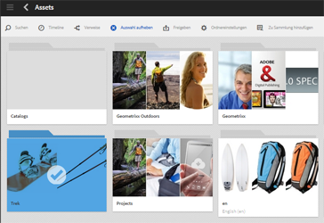
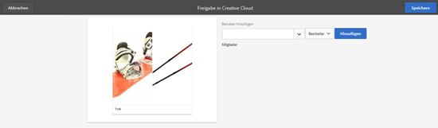

# Ordnerfreigabe mit Adobe Creative Cloud {#folder-sharing-with-adobe-creative-cloud}

>[!CAUTION]
>
>Die Ordnerfreigabe von AEM in Creative Cloud wird nicht mehr unterstützt. Customers are strongly advised to use newer capabilities, like [Adobe Asset Link](https://helpx.adobe.com/enterprise/using/adobe-asset-link.html) or [AEM desktop app](https://helpx.adobe.com/experience-manager/desktop-app/aem-desktop-app.html). Weitere Informationen finden Sie unter [Best Practices für die Integration von AEM und Creative Cloud](/help/assets/aem-cc-integration-best-practices.md).

Mit Adobe Experience Manager (AEM) Assets können Sie Ordner mit Assets für Benutzer von Adobe Creative Cloud freigeben. For details on how to configure Adobe Marketing Cloud to let you share assets with Adobe Creative Cloud, see [Configuring Assets-Creative Cloud integration](/help/sites-administering/configure-assets-cc-integration.md).

1. Wählen Sie in der Assets-Konsole den für Creative Cloud freizugebenden Ordner aus.

   

1. Klicken Sie in der Symbolleiste auf **Freigeben**.

   

1. From the list, select the **Adobe Creative Cloud** option.

   

1. In the **Creative Cloud Sharing** page, add the user to share the folder with and then click **Save**.

   

1. Klicken Sie auf **OK** zum Schließen der Bestätigungsmeldung.
1. Melden Sie sich mit den Anmeldeinformationen des Benutzers, für den Sie den Ordner freigegeben haben, bei Creative Cloud an. Der freigegebene Ordner ist in Creative Cloud verfügbar.