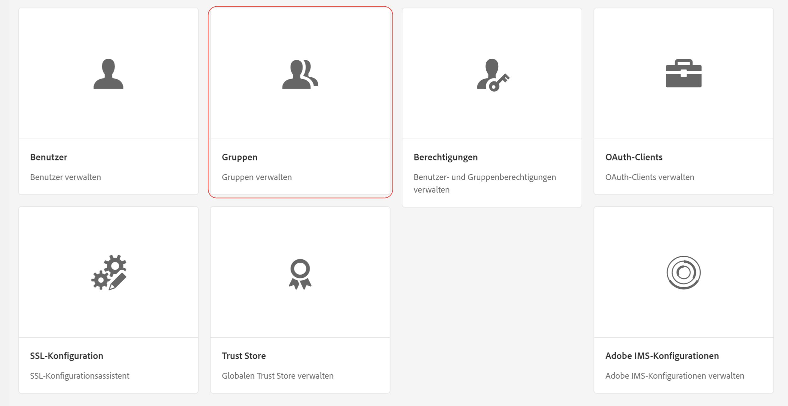
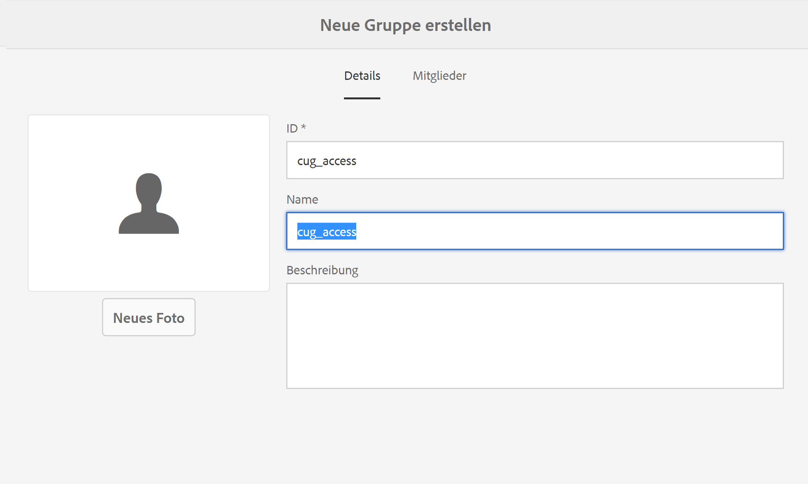
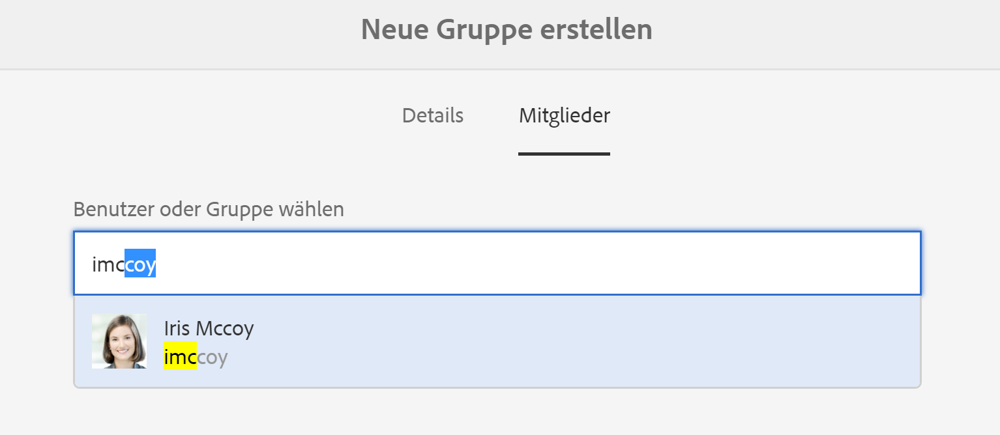
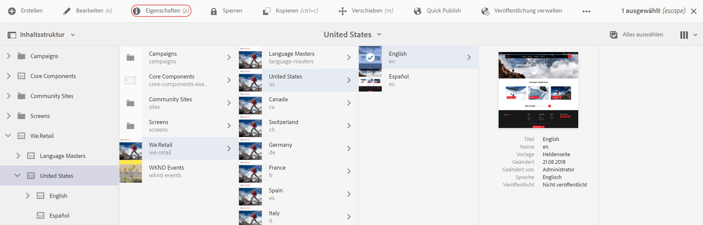
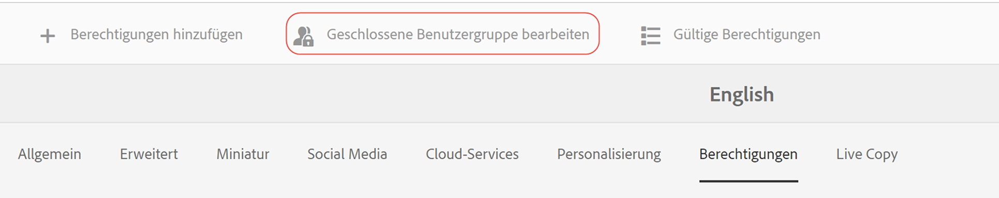

# Erstellen von geschlossenen Benutzergruppen{#creating-a-closed-user-group}

Geschlossene Benutzergruppen (CUGs, Closed User Groups) werden zum Beschränken des Zugriffs auf bestimmte Seiten verwendet, die sich innerhalb einer veröffentlichten Website befinden. Bei diesen Seiten ist es erforderlich, dass sich die zugewiesenen Mitglieder anmelden und sie sicherheitsspezifische Anmeldedaten bereitstellen.

So konfigurieren Sie einen solchen Bereich innerhalb Ihrer Website:

* [Erstellen Sie die tatsächliche geschlossene Benutzergruppe und weisen Sie ihr Mitglieder zu](#creating-the-user-group-to-be-used).

* [Wenden Sie diese Gruppe auf die erforderlichen Seiten an](#applying-your-closed-user-group-to-content-pages) und wählen (oder erstellen) Sie die Anmeldeseite, die von den Mitgliedern der CUG verwendet werden soll. Dies wird auch festgelegt, wenn eine CUG auf eine Inhalts-Seite angewendet wird.

* [Erstellen Sie irgendeine Form von Link zu mindestens einer Seite innerhalb des geschützten Bereichs.](#linking-to-the-realm) Andernfalls wird dieser nicht angezeigt.
* [Konfigurieren Sie den Dispatcher,](#configure-dispatcher-for-cugs) wenn er verwendet wird.

>[!CAUTION]
>
>Geschlossene Benutzergruppen (CUGs) sollten immer unter Berücksichtigung des Leistungsverhaltens erstellt werden.
>
>Obwohl die Anzahl der Benutzer und Gruppen in einer CUG nicht beschränkt ist, kann eine hohe Anzahl an CUGs auf einer Seite die Rendering-Leistung beeinträchtigen.
>
>Die Auswirkungen der CUGs sollten bei Leistungstests immer berücksichtigt werden.

## Erstellen der zu verwendenden Benutzergruppe {#creating-the-user-group-to-be-used}

So erstellen Sie eine geschlossene Benutzergruppe:

1. Wechseln Sie vom AEM-Startbildschirm zu **Tools – Sicherheit**.

   >[!NOTE]
   >
   >Umfassende Informationen zum Erstellen und Konfigurieren von Benutzern und Gruppen finden Sie in [Verwalten von Benutzern und Gruppen](/help/sites-administering/security.md#managing-users-and-groups).

1. Wählen Sie im nächsten Bildschirm die Karte **Gruppen** aus.

   

1. Klicken Sie auf die Schaltfläche **Erstellen** oben rechts, um eine neue Gruppe zu erstellen.
1. Benennen Sie Ihre neue Gruppe; zum Beispiel `cug_access`.

   

1. Gehen Sie zur Registerkarte **Mitglieder** und weisen Sie dieser Gruppe die erforderlichen Benutzer zu.

   

1. Aktivieren Sie alle Benutzer, die Sie Ihrer CUG zugewiesen haben. Dies sind in diesem Fall alle Mitglieder der Gruppe `cug_access`.
1. Aktivieren Sie die geschlossene Benutzergruppe, sodass sie in der Publishing-Umgebung verfügbar ist. In diesem Fall ist dies die Gruppe `cug_access`.

## Anwenden der geschlossenen Benutzergruppe auf die Inhalts-Seiten {#applying-your-closed-user-group-to-content-pages}

So wenden Sie die CUG auf eine Seite an:

1. Navigieren Sie zur Stammseite des eingeschränkten Bereichs, dem Sie die CUG zuweisen möchten.
1. Wählen Sie die Seite aus, indem Sie auf die Miniaturansicht klicken und dann in der oberen Leiste auf **Eigenschaften** klicken.

   

1. Rufen Sie im folgenden Fenster die Registerkarte **Erweitert** auf.
1. Blättern Sie nach unten und aktivieren Sie das Kontrollkästchen im Bereich **Authentifizierungsanforderungen**.

1. hinzufügen Sie unten Ihren Konfigurationspfad und drücken Sie dann auf Speichern.
1. Rufen Sie dann die Registerkarte **Berechtigungen** auf und klicken Sie auf die Schaltfläche **Geschlossene Benutzergruppe bearbeiten**.

   

   >[HINWEIS!]
   >
   > Beachten Sie, dass CUGs auf der Registerkarte &quot;Berechtigungen&quot;nicht in Live Copies von Blueprints ausgeführt werden können. Planen Sie dies ein, wenn Sie eine Live Copy konfigurieren.
   >
   > Weitere Informationen finden Sie auf [dieser Seite](closed-user-groups.md#aem-livecopy).

1. Suchen Sie nach Ihrer CUG im folgenden Fenster und fügen Sie in diesem Fenster die Gruppe **cug_access** hinzu. Klicken Sie abschließend **Speichern**.
1. Klicken Sie auf **Aktiviert**, um festzulegen, dass diese Seite (und alle untergeordneten Seiten) zu einer CUG gehören.
1. Geben Sie die **Anmeldeseite** an, die Mitglieder der Gruppe verwenden; Beispiel:

   `/content/geometrixx/en/toolbar/login.html`

   Dies ist optional. Wenn Sie das Feld leer lassen, wird die Standard-Anmeldeseite verwendet.

1. Fügen Sie die zugelassenen Gruppen unter **Zugelassene Gruppen** hinzu. Fügen Sie mit dem Plussymbol (+) Gruppen hinzu bzw. entfernen Sie Gruppen mit dem Minussymbol (-). Nur Mitglieder dieser Gruppen können sich bei diesen Seiten anmelden und darauf zugreifen.
1. Weisen Sie bei Bedarf einen **Bereich** zu (d. h. einen Namen für die Gruppen von Seiten). Frei lassen, um den Seitentitel zu verwenden.
1. Klicken Sie auf **OK**, um die Spezifikationen zu speichern.

Informationen zu Profilen in der Publishing-Umgebung und der Bereitstellung von Formularen zum An- und Abmelden finden Sie in [Identitätsmanagement](/help/sites-administering/identity-management.md).

## Erstellen eines Links zum Bereich  {#linking-to-the-realm}

Da das Ziel von Links zum CUG-Bereich für anonyme Benutzer nicht sichtbar ist, entfernt der Linkchecker solche Links.

Um dies zu vermeiden, empfiehlt es sich, nicht-geschützte Umleitungsseiten zu erstellen, die auf Seiten innerhalb des CUG-Bereichs verweisen. Die Navigationseinträge werden gerendert, ohne dass der Linkchecker Probleme verursacht. Nur wenn tatsächlich auf die Umleitungsseiten zugegriffen wird, wird der Benutzer in den CUG-Bereich umgeleitet – nachdem er seine Anmeldedaten erfolgreich bereitgestellt hat.

## Konfigurieren des Dispatchers für CUGs  {#configure-dispatcher-for-cugs}

Falls Sie den Dispatcher verwenden, müssen Sie eine Dispatcher-Farm mit den folgenden Eigenschaften definieren:

* [virtualhosts](https://helpx.adobe.com/experience-manager/dispatcher/using/dispatcher-configuration.html#identifying-virtual-hosts-virtualhosts): Entspricht dem Pfad zu den Seiten, auf die die CUG angewendet wird
* \sessionmanagement: siehe unten
* [cache](https://helpx.adobe.com/experience-manager/dispatcher/using/dispatcher-configuration.html#configuring-the-dispatcher-cache-cache): Ein Zwischenspeicher-Verzeichnis, das für die Dateien vorgesehen ist, auf die die CUG angewendet wird

### Konfigurieren des Dispatcher-Sitzungsmanagements für CUGs  {#configuring-dispatcher-session-management-for-cugs}

Konfigurieren Sie [die Sitzungsverwaltung in der Datei dispatcher.any](https://helpx.adobe.com/experience-manager/dispatcher/using/dispatcher-configuration.html#enabling-secure-sessions-sessionmanagement) für das CUG. Der Authentifizierungs-Handler, der verwendet wird, wenn der Zugriff für CUG-Seiten angefordert wird, legt fest, wie Sie die Sitzungsverwaltung konfigurieren.

```xml
/sessionmanagement
    ...
    /header "Cookie:login-token"
    ...
```

>[!NOTE]
>
>Wenn für eine Dispatcher-Farm das Sitzungsmanagement aktiviert ist, werden alle von der Farm verarbeiteten Seiten nicht zwischengespeichert. Um Seiten, die sich außerhalb von CUG befinden, zwischenzuspeichern, erstellen Sie eine zweite Farm in dispatcher.any
>, der die Nicht-CUG-Seiten verarbeitet.

1. Konfigurieren Sie [/sessionmanagement](https://helpx.adobe.com/experience-manager/dispatcher/using/dispatcher-configuration.html#enabling-secure-sessions-sessionmanagement) durch Definieren von `/directory`. Beispiel:

   ```xml
   /sessionmanagement
     {
     /directory "/usr/local/apache/.sessions"
     ...
     }
   ```

1. Legen Sie [/allowAuthorized](https://helpx.adobe.com/experience-manager/dispatcher/using/dispatcher-configuration.html#caching-when-authentication-is-used) auf `0` fest.
