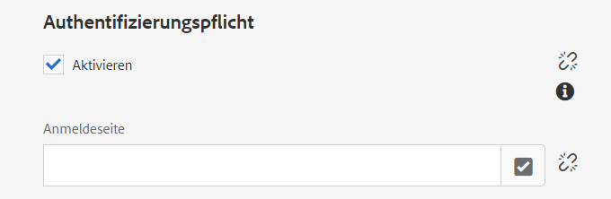

# Erstellen von geschlossenen Benutzergruppen{#creating-a-closed-user-group}

Geschlossene Benutzergruppen (CUGs, Closed User Groups) werden zum Beschränken des Zugriffs auf bestimmte Seiten verwendet, die sich innerhalb einer veröffentlichten Website befinden. Bei diesen Seiten ist es erforderlich, dass sich die zugewiesenen Mitglieder anmelden und sie sicherheitsspezifische Anmeldedaten bereitstellen.

So konfigurieren Sie einen solchen Bereich auf Ihrer Website:

* [Erstellen Sie die tatsächliche geschlossene Benutzergruppe und weisen Sie ihr Mitglieder zu](#creating-the-user-group-to-be-used).

* [Wenden Sie diese Gruppe auf die erforderlichen Seiten an](#applying-your-closed-user-group-to-content-pages) und wählen (oder erstellen) Sie die Anmeldeseite, die von den Mitgliedern der CUG verwendet werden soll. Dies wird auch festgelegt, wenn eine CUG auf eine Inhalts-Seite angewendet wird.

* [Erstellen Sie irgendeine Form von Link zu mindestens einer Seite innerhalb des geschützten Bereichs.](#linking-to-the-cug-pages) Andernfalls wird dieser nicht angezeigt.

* [Konfigurieren Sie den Dispatcher,](#configure-dispatcher-for-cugs) wenn er verwendet wird.

>[!CAUTION]
>
>Geschlossene Benutzergruppen (CUGs) sollten immer unter Berücksichtigung des Leistungsverhaltens erstellt werden.
>
>Obwohl die Anzahl der Benutzer und Gruppen in einer CUG nicht beschränkt ist, kann eine hohe Anzahl an CUGs auf einer Seite die Rendering-Leistung beeinträchtigen.
>
>Die Auswirkungen der CUGs sollten bei Leistungstests immer berücksichtigt werden.

## Erstellen der zu verwendenden Benutzergruppe {#creating-the-user-group-to-be-used}

So erstellen Sie eine geschlossene Benutzergruppe:

1. Wechseln Sie vom AEM-Startbildschirm zu **Tools – Sicherheit**.

   >[!NOTE]
   >
   >Umfassende Informationen zum Erstellen und Konfigurieren von Benutzern und Gruppen finden Sie in [Verwalten von Benutzern und Gruppen](/help/sites-administering/security.md#managing-users-and-groups).

1. Wählen Sie im nächsten Bildschirm die Karte **Gruppen** aus.

   

1. Klicken Sie auf die Schaltfläche **Erstellen** oben rechts, um eine neue Gruppe zu erstellen.
1. Benennen Sie Ihre neue Gruppe, z. B. `cug_access`.

   

1. Gehen Sie zur Registerkarte **Mitglieder** und weisen Sie dieser Gruppe die erforderlichen Benutzer zu.

   

1. Aktivieren Sie alle Benutzer, die Sie Ihrer CUG zugewiesen haben. Dies sind in diesem Fall alle Mitglieder der Gruppe `cug_access`.
1. Aktivieren Sie die geschlossene Benutzergruppe, sodass sie in der Publishing-Umgebung verfügbar ist. In diesem Fall ist dies die Gruppe `cug_access`.

## Anwenden der geschlossenen Benutzergruppe auf die Inhalts-Seiten {#applying-your-closed-user-group-to-content-pages}

So wenden Sie die CUG auf eine oder mehrere Seiten an:

1. Navigieren Sie zur Stammseite des eingeschränkten Bereichs, dem Sie die CUG zuweisen möchten.
1. Wählen Sie die Seite aus, indem Sie auf die Miniaturansicht klicken und dann **Eigenschaften** in der oberen Symbolleiste.

   

1. Öffnen Sie im folgenden Fenster die **Erweitert** Registerkarte.

1. Scrollen Sie nach unten zum **Authentifizierungspflicht** Abschnitt.

   1. Aktivieren Sie die **Aktivieren** Tickbox.

   1. Fügen Sie den Pfad zu Ihrem **Anmeldeseite**.
Dies ist optional. Wenn Sie das Feld leer lassen, wird die standardmäßige Anmeldeseite verwendet.

   

1. Navigieren Sie als Nächstes zum **Berechtigungen** Registerkarte und wählen Sie **Geschlossene Benutzergruppe bearbeiten**.

   

   >[!NOTE]
   >
   >CUGs auf der Registerkarte &quot;Berechtigungen&quot;können nicht für Live Copies aus Blueprints bereitgestellt werden. Planen Sie dies ein, wenn Sie eine Live Copy konfigurieren.
   >
   >Weitere Informationen finden Sie auf [dieser Seite](closed-user-groups.md#aem-livecopy).

1. Die **Geschlossene Benutzergruppe bearbeiten** wird geöffnet. Hier können Sie nach Ihrer CUG suchen und diese auswählen und dann die Gruppenauswahl mit **Speichern**.

   Die Gruppe wird der Liste hinzugefügt. Beispielsweise die Gruppe **cug_access**.

   

1. Bestätigen Sie die Änderungen mit **Speichern und schließen**.

>[!NOTE]
>
>Informationen zu Profilen in der Publishing-Umgebung und der Bereitstellung von Formularen zum An- und Abmelden finden Sie in [Identitätsmanagement](/help/sites-administering/identity-management.md).

## Verknüpfen mit den CUG-Seiten {#linking-to-the-cug-pages}

Da das Ziel von Links zu den CUG-Seiten für den anonymen Benutzer nicht sichtbar ist, entfernt der Linkprüfer solche Links.

Um dies zu vermeiden, ist es ratsam, nicht geschützte Umleitungsseiten zu erstellen, die auf Seiten innerhalb des CUG-Bereichs verweisen. Die Navigationseinträge werden gerendert, ohne dass der Linkchecker Probleme verursacht. Nur wenn der Benutzer tatsächlich auf die Umleitungsseite zugreift, wird er in den CUG-Bereich umgeleitet, nachdem er seine Anmeldedaten erfolgreich bereitgestellt hat.

## Konfigurieren des Dispatchers für CUGs {#configure-dispatcher-for-cugs}

Falls Sie den Dispatcher verwenden, müssen Sie eine Dispatcher-Farm mit den folgenden Eigenschaften definieren:

* [virtualhosts](https://experienceleague.adobe.com/docs/experience-manager-dispatcher/using/configuring/dispatcher-configuration.html?lang=en#identifying-virtual-hosts-virtualhosts): Entspricht dem Pfad zu den Seiten, auf die die CUG angewendet wird
* \sessionmanagement: siehe unten
* [cache](https://experienceleague.adobe.com/docs/experience-manager-dispatcher/using/configuring/dispatcher-configuration.html?lang=en#configuring-the-dispatcher-cache-cache): Ein Zwischenspeicher-Verzeichnis, das für die Dateien vorgesehen ist, auf die die CUG angewendet wird

### Konfigurieren des Dispatcher-Sitzungsmanagements für CUGs {#configuring-dispatcher-session-management-for-cugs}

Konfigurieren Sie das [Sitzungsmanagement in der Datei dispatcher.any](https://experienceleague.adobe.com/docs/experience-manager-dispatcher/using/configuring/dispatcher-configuration.html?lang=en#enabling-secure-sessions-sessionmanagement) für die CUG. Der Authentifizierungs-Handler, der verwendet wird, wenn der Zugriff auf CUG-Seiten angefordert wird, bestimmt, wie Sie das Sitzungsmanagement konfigurieren.

```xml
/sessionmanagement
    ...
    /header "Cookie:login-token"
    ...
```

>[!NOTE]
>
>Wenn für eine Dispatcher-Farm das Sitzungsmanagement aktiviert ist, werden alle von der Farm verarbeiteten Seiten nicht zwischengespeichert. Um Seiten zwischenzuspeichern, die sich außerhalb der CUG befinden, erstellen Sie eine zweite Farm in der Datei dispatcher.any
>, die die Nicht-CUG-Seiten verarbeitet.

1. Konfigurieren Sie [/sessionmanagement](https://experienceleague.adobe.com/docs/experience-manager-dispatcher/using/configuring/dispatcher-configuration.html?lang=en#enabling-secure-sessions-sessionmanagement), indem Sie `/directory` festlegen, zum Beispiel:

   ```xml
   /sessionmanagement
     {
     /directory "/usr/local/apache/.sessions"
     ...
     }
   ```

1. Legen Sie [/allowAuthorized](https://experienceleague.adobe.com/docs/experience-manager-dispatcher/using/configuring/dispatcher-configuration.html?lang=en#caching-when-authentication-is-used) auf `0` fest.
