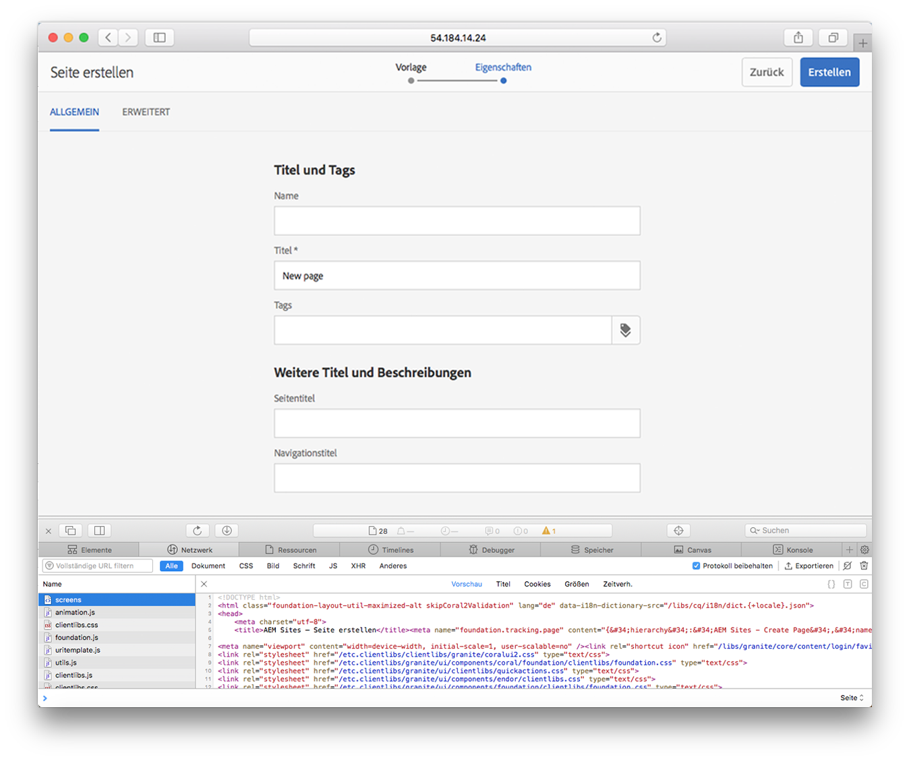
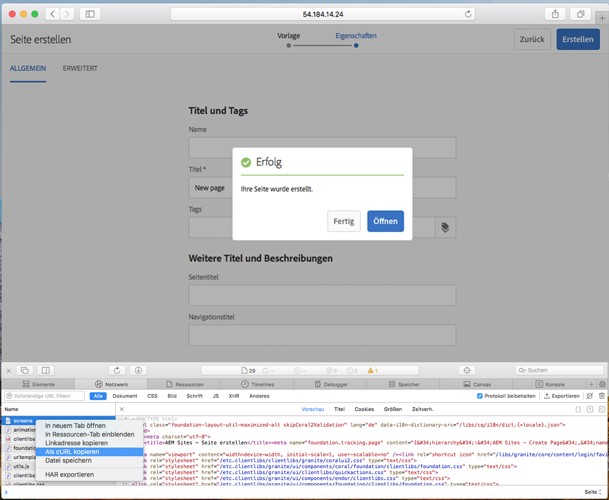
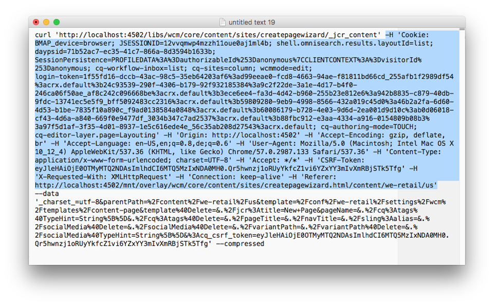

# Verwenden von cURL mit AEM{#using-curl-with-aem}

Administratoren müssen häufig auszuführende Aufgaben in einem System oft automatisieren oder vereinfachen. In AEM stellen die Benutzerverwaltung, die Installation von Paketen und die Verwaltung von OSGi-Bundles beispielsweise Aufgaben dar, die am häufigsten durchgeführt werden.

Aufgrund der RESTful-Eigenschaft des Sling-Frameworks, auf dem AEM erstellt wird, können die meisten Aufgaben mit einem URL-Aufruf ausgeführt werden. Solche URL-Aufrufe können mit cURL ausgeführt werden, was für Administratoren hilfreich ist.

## Was ist cURL?  {#what-is-curl}

Bei cURL handelt es sich um ein Open-Source-Befehlszeilentool für die URL-Manipulation. Es unterstützt eine breite Palette von Internetprotokollen, darunter HTTP, HTTPS, FTP, FTPS, SCP, SFTP, TFTP, LDAP, DAP, DICT, TELNET, FILE, IMAP, POP3, SMTP und RTSP.

Das etablierte Tool wurde erstmals 1997 veröffentlicht und wird seitdem weitläufig für den Empfang und Versand von Daten mit der URL-Syntax genutzt. Der Name cURL stand ursprünglich für „see URL“ (siehe URL).

Da das Sling-Framework, auf dem AEM aufsetzt, auf dem REST-Prinzip basiert, lässt sich fast jede Aufgabe auf einen URL-Aufruf reduzieren, der mit cURL ausführbar ist. [Aufgaben zur Inhaltsbearbeitung](/help/sites-administering/curl.md#common-content-manipulation-aem-curl-commands), beispielsweise die Aktivierung von Seiten oder das Starten von Workflows, und [betriebliche Aufgaben](/help/sites-administering/curl.md#common-operational-aem-curl-commands) wie die Paket- und die Benutzerverwaltung lassen sich mit cURL automatisieren. Darüber hinaus können Sie für die meisten Aufgaben in AEM [Ihre eigenen cURLs erstellen](/help/sites-administering/curl.md#building-a-curl-ready-aem-command).

>[!NOTE]
>
>Jeder AEM-Befehl, der über cURL ausgeführt wird, muss in AEM genau wie jeder Benutzer autorisiert werden. Bei der Ausführung eines AEM-Befehls mit cURL werden alle ACLs und Zugriffsrechte eingehalten.

## Herunterladen von cURL  {#downloading-curl}

Bei MacOS und einigen Linux-Distributionen ist cURL standardmäßig enthalten. Das Tool ist jedoch für die meisten Betriebssysteme erhältlich. Die neuesten Downloads finden Sie unter [https://curl.haxx.se/download.html](https://curl.haxx.se/download.html).

Das Quell-Repository von cURL finden Sie auch auf GitHub.

## Entwickeln eines cURL-fähigen AEM-Befehls {#building-a-curl-ready-aem-command}

Sie können für die meisten Vorgänge in AEM cURL-Befehle entwickeln, z. B. für das Auslösen von Workflows, das Prüfen von OSGi-Konfigurationen, das Auslösen von JMX-Befehlen, das Erstellen von Replikationsagenten und vieles mehr.

Um zu ermitteln, welchen Befehl Sie für den gewünschten Vorgang benötigen, erfassen Sie mit den Entwicklertools des Browsers den POST-Aufruf an den Server, wenn Sie den AEM-Befehl ausführen.

Am Beispiel der Erstellung einer neuen Seite im Chrome-Browser werden die dafür nötigen Schritte nachfolgend beschrieben.

1. Bereiten Sie die Aktion vor, die Sie in AEM auslösen möchten. In diesem Fall haben wir das Ende des Assistenten **Seite erstellen** erreicht, aber noch nicht auf **Erstellen** geklickt.

   

1. Starten Sie die Entwicklertools und wählen Sie die Registerkarte **Network** aus. Klicken Sie auf die Option **Preserve log**, bevor Sie den Konsoleninhalt löschen.

   

1. Klicken Sie im Assistenten **Seite erstellen** auf **Erstellen**, um den Workflow zu erstellen.
1. Klicken Sie mit der rechten Maustaste auf die daraus entstehende POST-Aktion und wählen Sie **Copy** > **Copy as cURL (cmd)** aus.

   

1. Kopieren Sie den Befehl cURL in einen Texteditor, entfernen Sie alle Header aus dem Befehl, die mit `-H` beginnen (in der Abbildung unten blau markiert) und fügen Sie den richtigen Authentifizierungsparameter hinzu, z. B. `-u <user>:<password>`.

   

1. Führen Sie den cURL-Befehl über die Befehlszeile aus und zeigen Sie die Antwort an.

   

## Gängige cURL-Befehle für Betriebsaufgaben in AEM {#common-operational-aem-curl-commands}

Hier finden Sie eine Liste an cURL-Befehlen für gängige administrative und betriebliche Aufgaben für AEM.

>[!NOTE]
>
>Bei den folgenden Beispielen wird vorausgesetzt, dass AEM auf dem `localhost` an Port `4502` ausgeführt wird und den Benutzer `admin` mit dem Kennwort `admin` nutzt. Zusätzliche Befehlsplatzhalter sind in eckigen Klammern angefügt.

### Paketverwaltung  {#package-management}

#### Alle installierten Pakete auflisten

```shell
curl -u <user>:<password> http://<host>:<port>/crx/packmgr/service.jsp?cmd=ls
```

#### Erstellen eines Pakets {#create-a-package}

```shell
curl -u <user>:<password> -X POST http://localhost:4502/crx/packmgr/service/.json/etc/packages/mycontent.zip?cmd=create -d packageName=<name> -d groupName=<name>
```

#### Vorschau eines Pakets anzeigen {#preview-a-package}

```shell
curl -u <user>:<password> -X POST http://localhost:4502/crx/packmgr/service/.json/etc/packages/mycontent.zip?cmd=preview
```

#### Auflisten des Paketinhalts {#list-package-content}

```shell
curl -u <user>:<password> -X POST http://localhost:4502/crx/packmgr/service/console.html/etc/packages/mycontent.zip?cmd=contents
```

#### Entwickeln eines Pakets {#build-a-package}

```shell
curl -X POST http://localhost:4502/crx/packmgr/service/.json/etc/packages/mycontent.zip?cmd=build
```

#### Erneutes Packen eines Pakets {#rewrap-a-package}

```shell
curl -u <user>:<password> -X POST http://localhost:4502/crx/packmgr/service/.json/etc/packages/mycontent.zip?cmd=rewrap
```

#### Umbenennen eines Pakets {#rename-a-package}

```shell
curl -u <user>:<password> -X POST -Fname=<New Name> http://localhost:4502/etc/packages/<Group Name>/<Package Name>.zip/jcr:content/vlt:definition
```

#### Hochladen eines Pakets {#upload-a-package}

```shell
curl -u <user>:<password> -F cmd=upload -F force=true -F package=@test.zip http://localhost:4502/crx/packmgr/service/.json
```

#### Installieren eines Pakets {#install-a-package}

```shell
curl -u <user>:<password> -F cmd=install http://localhost:4502/crx/packmgr/service/.json/etc/packages/my_packages/test.zip
```

#### Deinstallieren eines Pakets {#uninstall-a-package}

```shell
curl -u <user>:<password> -F cmd=uninstall http://localhost:4502/crx/packmgr/service/.json/etc/packages/my_packages/test.zip
```

#### Löschen eines Pakets {#delete-a-package}

```shell
curl -u <user>:<password> -F cmd=delete http://localhost:4502/crx/packmgr/service/.json/etc/packages/my_packages/test.zip
```

#### Herunterladen eines Pakets {#download-a-package}

```shell
curl -u <user>:<password> http://localhost:4502/etc/packages/my_packages/test.zip
```

### Benutzerverwaltung {#user-management}

#### Erstellen eines neuen Benutzers {#create-a-new-user}

```shell
curl -u <user>:<password> -FcreateUser= -FauthorizableId=hashim -Frep:password=hashim http://localhost:4502/libs/granite/security/post/authorizables
```

#### Erstellen einer neuen Gruppe {#create-a-new-group}

```shell
curl -u <user>:<password> -FcreateGroup=group1 -FauthorizableId=testGroup1 http://localhost:4502/libs/granite/security/post/authorizables
```

#### Hinzufügen einer Eigenschaft zu einem vorhandenen Benutzer {#add-a-property-to-an-existing-user}

```shell
curl -u <user>:<password> -Fprofile/age=25 http://localhost:4502/home/users/h/hashim.rw.html
```

#### Erstellen eines Benutzers mit einem Profil {#create-a-user-with-a-profile}

```shell
curl -u <user>:<password> -FcreateUser=testuser -FauthorizableId=hashimkhan -Frep:password=hashimkhan -Fprofile/gender=male http://localhost:4502/libs/granite/security/post/authorizables
```

#### Erstellen eines neuen Benutzers als Mitglied einer Gruppe {#create-a-new-user-as-a-member-of-a-group}

```shell
curl -u <user>:<password> -FcreateUser=testuser -FauthorizableId=testuser -Frep:password=abc123 -Fmembership=contributor http://localhost:4502/libs/granite/security/post/authorizables
```

#### Hinzufügen eines Benutzers zu einer Gruppe {#add-a-user-to-a-group}

```shell
curl -u <user>:<password> -FaddMembers=testuser1 http://localhost:4502/home/groups/t/testGroup.rw.html
```

#### Entfernen eines Benutzers aus einer Gruppe {#remove-a-user-from-a-group}

```shell
curl -u <user>:<password> -FremoveMembers=testuser1 http://localhost:4502/home/groups/t/testGroup.rw.html
```

#### Festlegen der Gruppenmitgliedschaft eines Benutzers {#set-a-user-s-group-membership}

```shell
curl -u <user>:<password> -Fmembership=contributor -Fmembership=testgroup http://localhost:4502/home/users/t/testuser.rw.html
```

#### Löschen eines Benutzers {#delete-a-user}

```shell
curl -u <user>:<password> -FdeleteAuthorizable= http://localhost:4502/home/users/t/testuser
```

#### Löschen einer Gruppe {#delete-a-group}

```shell
curl -u <user>:<password> -FdeleteAuthorizable= http://localhost:4502/home/groups/t/testGroup
```

### Sicherung {#backup}

Weitere Informationen finden Sie unter [Backup and Restore](/help/sites-administering/backup-and-restore.md#automating-aem-online-backup) .

### OSGi {#osgi}

#### Starten eines Bundles  {#starting-a-bundle}

```shell
curl -u <user>:<password> -Faction=start http://localhost:4502/system/console/bundles/<bundle-name>
```

#### Beenden eines Bundles {#stopping-a-bundle}

```shell
curl -u <user>:<password> -Faction=stop http://localhost:4502/system/console/bundles/<bundle-name>
```

### Dispatcher {#dispatcher}

#### Annullieren des Caches  {#invalidate-the-cache}

```shell
curl -H "CQ-Action: Activate" -H "CQ-Handle: /content/test-site/" -H "CQ-Path: /content/test-site/" -H "Content-Length: 0" -H "Content-Type: application/octet-stream" http://localhost:4502/dispatcher/invalidate.cache
```

#### Erzwungenes Löschen des Caches {#evict-the-cache}

```shell
curl -H "CQ-Action: Deactivate" -H "CQ-Handle: /content/test-site/" -H "CQ-Path: /content/test-site/" -H "Content-Length: 0" -H "Content-Type: application/octet-stream" http://localhost:4502/dispatcher/invalidate.cache
```

### Replikationsagent {#replication-agent}

#### Prüfen des Status eines Agenten {#check-the-status-of-an-agent}

```shell
curl -u <user>:<password> "http://localhost:4502/etc/replication/agents.author/publish/jcr:content.queue.json?agent=publish"
http://localhost:4502/etc/replication/agents.author/publish/jcr:content.queue.json?agent=publish
```

#### Löschen eines Agenten {#delete-an-agent}

```shell
curl -X DELETE http://localhost:4502/etc/replication/agents.author/replication99 -u <user>:<password>
```

#### Erstellen eines Agenten {#create-an-agent}

```shell
curl -u <user>:<password> -F "jcr:primaryType=cq:Page" -F "jcr:content/jcr:title=new-replication" -F "jcr:content/sling:resourceType=/libs/cq/replication/components/agent" -F "jcr:content/template=/libs/cq/replication/templates/agent" -F "jcr:content/transportUri=http://localhost:4503/bin/receive?sling:authRequestLogin=1" -F "jcr:content/transportUser=admin" -F "jcr:content/transportPassword={DES}8aadb625ced91ac483390ebc10640cdf"http://localhost:4502/etc/replication/agents.author/replication99
```

#### Pausieren eines Agenten {#pause-an-agent}

```shell
curl -u <user>:<password> -F "cmd=pause" -F "name=publish"  http://localhost:4502/etc/replication/agents.author/publish/jcr:content.queue.json
```

#### Löschen einer Agentenwarteschlange {#clear-an-agent-queue}

```shell
curl -u <user>:<password> -F "cmd=clear" -F "name=publish"  http://localhost:4502/etc/replication/agents.author/publish/jcr:content.queue.json
```

### Communities {#communities}

#### Zuteilen und Entziehen von Abzeichen  {#assign-and-revoke-badges}

Weitere Informationen finden Sie unter [Communities-Scoring und -Abzeichen](/help/communities/implementing-scoring.md#assign-and-revoke-badges) .

Weitere Informationen finden Sie unter [Grundlagen zu Scoring und Abzeichen](/help/communities/configure-scoring.md#example-setup) .

#### Erneute MSRP-Indizierung {#msrp-reindexing}

Weitere Informationen finden Sie unter [MSRP - MongoDB Storage Resource Provider](/help/communities/msrp.md#running-msrp-reindex-tool-using-curl-command) .

### Sicherheit {#security}

#### Aktivieren und Deaktivieren von CRXDE Lite  {#enabling-and-disabling-crx-de-lite}

Weitere Informationen finden Sie unter [Aktivieren der CRXDE Lite in AEM](/help/sites-administering/enabling-crxde-lite.md) .

### Datenspeicherbereinigung {#data-store-garbage-collection}

Weitere Informationen finden Sie unter [Datenspeicherbereinigung](/help/sites-administering/data-store-garbage-collection.md#automating-data-store-garbage-collection) .

### Integrieren von Analytics und Target {#analytics-and-target-integration}

Weitere Informationen finden Sie unter [Anmelden für Adobe Analytics und Adobe Target](/help/sites-administering/opt-in.md#configuring-the-setup-and-provisioning-via-script) .

### Single Sign-On {#single-sign-on}

#### Senden eines Test-Headers {#send-test-header}

Weitere Informationen finden Sie unter [Single Sign On](/help/sites-deploying/single-sign-on.md) .

## Gängige cURL-Befehle zur Inhaltsbearbeitung für AEM {#common-content-manipulation-aem-curl-commands}

Hier finden Sie eine Liste an cURL-Befehlen für die Inhaltsbearbeitung für AEM.

>[!NOTE]
>
>Bei den folgenden Beispielen wird vorausgesetzt, dass AEM auf dem `localhost` an Port `4502` ausgeführt wird und den Benutzer `admin` mit dem Kennwort `admin` nutzt. Zusätzliche Befehlsplatzhalter sind in eckigen Klammern angefügt.

### Seitenverwaltung {#page-management}

#### Aktivieren einer Seite {#page-activation}

```shell
curl -u <user>:<password> -X POST -F path="/content/path/to/page" -F cmd="activate" http://localhost:4502/bin/replicate.json
```

#### Deaktivieren einer Seite {#page-deactivation}

```shell
curl -u <user>:<password> -X POST -F path="/content/path/to/page" -F cmd="deactivate" http://localhost:4502/bin/replicate.json
```

#### Aktivieren eines Baumes {#tree-activation}

```shell
curl -u <user>:<password> -F cmd=activate -F ignoredeactivated=true -F onlymodified=true -F path=/content/geometrixx http://localhost:4502/etc/replication/treeactivation.html
```

#### Sperren einer Seite {#lock-page}

```shell
curl -u <user>:<password> -X POST -F cmd="lockPage" -F path="/content/path/to/page" -F "_charset_"="utf-8" http://localhost:4502/bin/wcmcommand
```

#### Entsperren einer Seite {#unlock-page}

```shell
curl -u <user>:<password> -X POST -F cmd="unlockPage" -F path="/content/path/to/page" -F "_charset_"="utf-8" http://localhost:4502/bin/wcmcommand
```

#### Kopieren einer Seite {#copy-page}

```shell
curl -u <user>:<password> -F cmd=copyPage -F destParentPath=/path/to/destination/parent -F srcPath=/path/to/source/location http://localhost:4502/bin/wcmcommand
```

### Workflows {#workflows}

Weitere Informationen finden Sie unter [Programmgesteuerte Interaktion mit Workflows](/help/sites-developing/workflows-program-interaction.md) .

### Sling-Inhalte {#sling-content}

#### Erstellen eines Ordners {#create-a-folder}

```shell
curl -u <user>:<password> -F jcr:primaryType=sling:Folder http://localhost:4502/etc/test
```

#### Löschen eines Knotens {#delete-a-node}

```shell
curl -u <user>:<password> -F :operation=delete http://localhost:4502/etc/test/test.properties
```

#### Verschieben eines Knotens {#move-a-node}

```shell
curl -u <user>:<password> -F":operation=move" -F":applyTo=/sourceurl"  -F":dest=/target/parenturl/" https://localhost:4502/content
```

#### Kopieren eines Knotens {#copy-a-node}

```shell
curl -u <user>:<password> -F":operation=copy" -F":applyTo=/sourceurl"  -F":dest=/target/parenturl/" https://localhost:4502/content
```

#### Hochladen von Dateien mit Sling PostServlet {#upload-files-using-sling-postservlet}

```shell
curl -u <user>:<password> -F"*=@test.properties"  http://localhost:4502/etc/test
```

#### Hochladen von Dateien mit Sling PostServlet und unter Angabe des Knotennamens {#upload-files-using-sling-postservlet-and-specifying-node-name}

```shell
curl -u <user>:<password> -F"test2.properties=@test.properties"  http://localhost:4502/etc/test
```

#### Hochladen von Dateien unter Angabe eines Inhaltstyps {#upload-files-specifying-a-content-type}

```shell
curl -u <user>:<password> -F "*=@test.properties;type=text/plain" http://localhost:4502/etc/test
```

### Asset-Bearbeitung {#asset-manipulation}

Weitere Informationen finden Sie unter [Assets-HTTP-API](/help/assets/mac-api-assets.md) .
