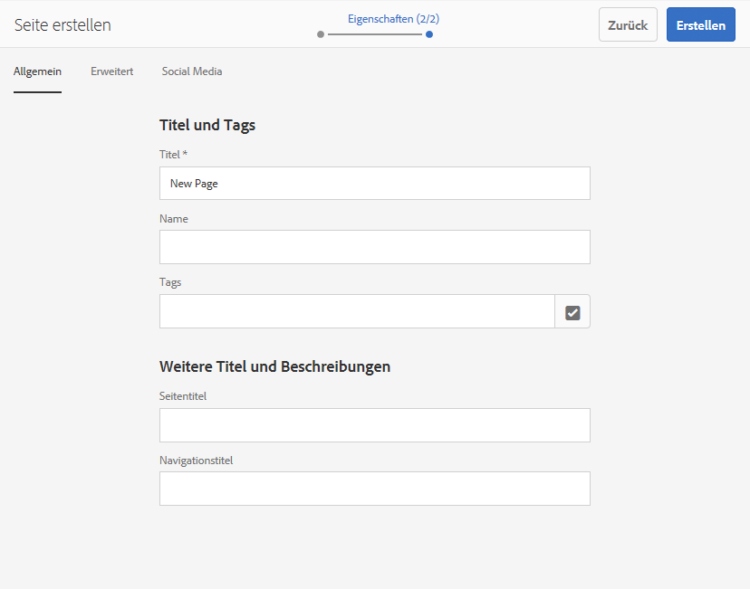

# Verwenden von cURL mit AEM{#using-curl-with-aem}

Administratoren müssen häufig auftretende Aufgaben in jedem System automatisieren oder vereinfachen. In AEM sind beispielsweise die Verwaltung von Benutzern, die Installation von Paketen und die Verwaltung von OSGi-Bundles Aufgaben, die häufig durchgeführt werden müssen.

Da das Sling-Framework, auf dem AEM aufsetzt, auf dem RESTful-Prinzip basiert, lässt sich fast jede Aufgabe mit einem URL-Aufruf erledigen. cURL kann verwendet werden, um solche URL-Aufrufe auszuführen, und kann ein nützliches Tool für AEM Administratoren sein.

## Was ist cURL {#what-is-curl}

Bei cURL handelt es sich um ein Open-Source-Befehlszeilen-Tool für die URL-Manipulation. Es unterstützt zahlreiche Internetprotokolle, darunter HTTP, HTTPS, FTP, FTPS, SCP, SFTP, TFTP, LDAP, DAP, DICT, TELNET, FILE, IMAP, POP3, SMTP und RTSP.

cURL ist ein bewährtes und weit verbreitetes Tool zum Abrufen oder Senden von Daten mithilfe der URL-Syntax und wurde ursprünglich 1997 veröffentlicht. Der Name &quot;cURL&quot;bedeutete ursprünglich &quot;see URL&quot;.

Aufgrund der RESTful-Eigenschaft des Sling-Frameworks, auf dem AEM erstellt wird, können die meisten Aufgaben auf einen URL-Aufruf reduziert werden, der mit cURL ausgeführt werden kann. [Aufgaben zur Inhaltsbearbeitung](/help/sites-administering/curl.md#common-content-manipulation-aem-curl-commands) wie das Aktivieren von Seiten und das Starten von Workflows und [operative Aufgaben](/help/sites-administering/curl.md#common-operational-aem-curl-commands) z. B. Paketverwaltung und Benutzerverwaltung können mithilfe von cURL automatisiert werden. Darüber hinaus können Sie [Erstellen einer eigenen cURL](/help/sites-administering/curl.md#building-a-curl-ready-aem-command) -Befehle für die meisten Aufgaben in AEM.

>[!NOTE]
>
>Jeder AEM Befehl, der über cURL ausgeführt wird, muss genau wie jeder Benutzer zu AEM autorisiert werden. Alle ACLs und Zugriffsberechtigungen werden beachtet, wenn cURL zum Ausführen eines AEM Befehls verwendet wird.

## Herunterladen von cURL {#downloading-curl}

cURL ist ein Standardteil von macOS und einigen Linux-Distributionen. Es ist jedoch für die meisten Betriebssysteme verfügbar. Die aktuellen Downloads finden Sie unter [https://curl.haxx.se/download.html](https://curl.haxx.se/download.html).

Das Quell-Repository von cURL finden Sie auch auf GitHub.

## Erstellen eines cURL-fähigen AEM-Befehls {#building-a-curl-ready-aem-command}

cURL-Befehle können für die meisten Vorgänge in AEM erstellt werden, z. B. das Auslösen von Workflows, das Überprüfen von OSGi-Konfigurationen, das Auslösen von JMX-Befehlen, das Erstellen von Replikationsagenten und vieles mehr.

Um den exakten Befehl zu finden, den Sie für Ihre jeweilige Operation benötigen, müssen Sie die Entwicklertools in Ihrem Browser verwenden, um den Serveraufruf beim Ausführen des AEM zu erfassen.

In den folgenden Schritten wird beschrieben, wie Sie dies mit der Erstellung einer neuen Seite im Chrome-Browser durchführen.

1. Bereiten Sie die Aktion vor, die Sie in AEM aufrufen möchten. In diesem Beispiel sind wir am Ende des Assistenten **Seite erstellen** angekommen, haben jedoch noch nicht auf **Erstellen** geklickt.

   

1. Starten Sie die Entwicklertools und wählen Sie die **Netzwerk** Registerkarte. Klicken Sie auf **Protokoll beibehalten** vor dem Löschen der Konsole.

   

1. Klicks **Erstellen** im **Seite erstellen** -Assistenten, um den Workflow zu erstellen.
1. Klicken Sie mit der rechten Maustaste auf die resultierende POST und wählen Sie **Kopieren** -> **Als cURL kopieren**.

   

1. Kopieren Sie den cURL-Befehl in einen Texteditor. Entfernen Sie alle Header aus dem Befehl, die mit `-H` beginnen (im folgenden Screenshot in blauer Farbe hervorgehoben), und fügen Sie die korrekten Authentifizierungsparameter hinzu, z. B. `-u <user>:<password>`.

   

1. Führen Sie den cURL-Befehl über die Befehlszeile aus und zeigen Sie die Antwort an.

   

## Allgemeine cURL-Befehle AEM {#common-operational-aem-curl-commands}

Im Folgenden finden Sie eine Liste AEM cURL-Befehle für allgemeine administrative und betriebliche Aufgaben.

>[!NOTE]
>
>Bei den folgenden Beispielen wird vorausgesetzt, dass AEM auf dem `localhost` an Port `4502` ausgeführt wird und den Benutzer `admin` mit dem Kennwort `admin` nutzt. Zusätzliche Befehlsplatzhalter werden in spitzen Klammern festgelegt.

### Paketverwaltung {#package-management}

#### Auflisten aller installierten Pakete

```shell
curl -u <user>:<password> http://<host>:<port>/crx/packmgr/service.jsp?cmd=ls
```

#### Erstellen eines Pakets {#create-a-package}

```shell
curl -u <user>:<password> -X POST http://localhost:4502/crx/packmgr/service/.json/etc/packages/mycontent.zip?cmd=create -d packageName=<name> -d groupName=<name>
```

#### Vorschau eines Pakets {#preview-a-package}

```shell
curl -u <user>:<password> -X POST http://localhost:4502/crx/packmgr/service/.json/etc/packages/mycontent.zip?cmd=preview
```

#### Paketinhalt auflisten {#list-package-content}

```shell
curl -u <user>:<password> -X POST http://localhost:4502/crx/packmgr/service/console.html/etc/packages/mycontent.zip?cmd=contents
```

#### Erstellen eines Pakets {#build-a-package}

```shell
curl -X POST http://localhost:4502/crx/packmgr/service/.json/etc/packages/mycontent.zip?cmd=build
```

#### Umbrechen eines Pakets {#rewrap-a-package}

```shell
curl -u <user>:<password> -X POST http://localhost:4502/crx/packmgr/service/.json/etc/packages/mycontent.zip?cmd=rewrap
```

#### Umbenennen eines Pakets {#rename-a-package}

```shell
curl -u <user>:<password> -X POST -Fname=<New Name> http://localhost:4502/etc/packages/<Group Name>/<Package Name>.zip/jcr:content/vlt:definition
```

#### Hochladen eines Pakets {#upload-a-package}

```shell
curl -u <user>:<password> -F cmd=upload -F force=true -F package=@test.zip http://localhost:4502/crx/packmgr/service/.json
```

#### Installieren eines Pakets {#install-a-package}

```shell
curl -u <user>:<password> -F cmd=install http://localhost:4502/crx/packmgr/service/.json/etc/packages/my_packages/test.zip
```

#### Deinstallieren eines Pakets {#uninstall-a-package}

```shell
curl -u <user>:<password> -F cmd=uninstall http://localhost:4502/crx/packmgr/service/.json/etc/packages/my_packages/test.zip
```

#### Löschen eines Pakets {#delete-a-package}

```shell
curl -u <user>:<password> -F cmd=delete http://localhost:4502/crx/packmgr/service/.json/etc/packages/my_packages/test.zip
```

#### Herunterladen eines Pakets {#download-a-package}

```shell
curl -u <user>:<password> http://localhost:4502/etc/packages/my_packages/test.zip
```

#### Replizieren eines Pakets {#replicate-a-package}

```shell
curl -u <user>:<password> -X POST http://localhost:4502/crx/packmgr/service/.json/etc/packages/my_packages/test.zip?cmd=replicate
```

### User Management {#user-management}

#### Neuen Benutzer erstellen {#create-a-new-user}

```shell
curl -u <user>:<password> -FcreateUser= -FauthorizableId=hashim -Frep:password=hashim http://localhost:4502/libs/granite/security/post/authorizables
```

#### Neue Gruppe erstellen {#create-a-new-group}

```shell
curl -u <user>:<password> -FcreateGroup=group1 -FauthorizableId=testGroup1 http://localhost:4502/libs/granite/security/post/authorizables
```

#### Hinzufügen einer Eigenschaft zu einem vorhandenen Benutzer {#add-a-property-to-an-existing-user}

```shell
curl -u <user>:<password> -Fprofile/age=25 http://localhost:4502/home/users/h/hashim.rw.html
```

#### Erstellen eines Benutzers mit einem Profil {#create-a-user-with-a-profile}

```shell
curl -u <user>:<password> -FcreateUser=testuser -FauthorizableId=hashimkhan -Frep:password=hashimkhan -Fprofile/gender=male http://localhost:4502/libs/granite/security/post/authorizables
```

#### Erstellen eines neuen Benutzers als Mitglied einer Gruppe {#create-a-new-user-as-a-member-of-a-group}

```shell
curl -u <user>:<password> -FcreateUser=testuser -FauthorizableId=testuser -Frep:password=abc123 -Fmembership=contributor http://localhost:4502/libs/granite/security/post/authorizables
```

#### Einen Benutzer zu einer Gruppe hinzufügen {#add-a-user-to-a-group}

```shell
curl -u <user>:<password> -FaddMembers=testuser1 http://localhost:4502/home/groups/t/testGroup.rw.html
```

#### Einen Benutzer aus einer Gruppe entfernen {#remove-a-user-from-a-group}

```shell
curl -u <user>:<password> -FremoveMembers=testuser1 http://localhost:4502/home/groups/t/testGroup.rw.html
```

#### Festlegen der Gruppenmitgliedschaft eines Benutzers {#set-a-user-s-group-membership}

```shell
curl -u <user>:<password> -Fmembership=contributor -Fmembership=testgroup http://localhost:4502/home/users/t/testuser.rw.html
```

#### Löschen eines Benutzers {#delete-a-user}

```shell
curl -u <user>:<password> -FdeleteAuthorizable= http://localhost:4502/home/users/t/testuser
```

#### Eine Gruppe löschen {#delete-a-group}

```shell
curl -u <user>:<password> -FdeleteAuthorizable= http://localhost:4502/home/groups/t/testGroup
```

### Sicherung {#backup}

Detaillierte Informationen finden Sie unter [Sichern und Wiederherstellen](/help/sites-administering/backup-and-restore.md#automating-aem-online-backup).

### OSGi {#osgi}

#### Starten eines Bundles {#starting-a-bundle}

```shell
curl -u <user>:<password> -Faction=start http://localhost:4502/system/console/bundles/<bundle-name>
```

#### Beenden eines Bundles {#stopping-a-bundle}

```shell
curl -u <user>:<password> -Faction=stop http://localhost:4502/system/console/bundles/<bundle-name>
```

### Dispatcher {#dispatcher}

#### Cache invalidieren {#invalidate-the-cache}

```shell
curl -H "CQ-Action: Activate" -H "CQ-Handle: /content/test-site/" -H "CQ-Path: /content/test-site/" -H "Content-Length: 0" -H "Content-Type: application/octet-stream" http://localhost:4502/dispatcher/invalidate.cache
```

#### Cache entfernen {#evict-the-cache}

```shell
curl -H "CQ-Action: Deactivate" -H "CQ-Handle: /content/test-site/" -H "CQ-Path: /content/test-site/" -H "Content-Length: 0" -H "Content-Type: application/octet-stream" http://localhost:4502/dispatcher/invalidate.cache
```

### Replikationsagent {#replication-agent}

#### Überprüfen des Status eines Agenten {#check-the-status-of-an-agent}

```shell
curl -u <user>:<password> "http://localhost:4502/etc/replication/agents.author/publish/jcr:content.queue.json?agent=publish"
http://localhost:4502/etc/replication/agents.author/publish/jcr:content.queue.json?agent=publish
```

#### Löschen eines Agenten {#delete-an-agent}

```shell
curl -X DELETE http://localhost:4502/etc/replication/agents.author/replication99 -u <user>:<password>
```

#### Erstellen eines Agenten {#create-an-agent}

```shell
curl -u <user>:<password> -F "jcr:primaryType=cq:Page" -F "jcr:content/jcr:title=new-replication" -F "jcr:content/sling:resourceType=/libs/cq/replication/components/agent" -F "jcr:content/template=/libs/cq/replication/templates/agent" -F "jcr:content/transportUri=http://localhost:4503/bin/receive?sling:authRequestLogin=1" -F "jcr:content/transportUser=admin" -F "jcr:content/transportPassword={DES}8aadb625ced91ac483390ebc10640cdf"http://localhost:4502/etc/replication/agents.author/replication99
```

#### Agent anhalten {#pause-an-agent}

```shell
curl -u <user>:<password> -F "cmd=pause" -F "name=publish"  http://localhost:4502/etc/replication/agents.author/publish/jcr:content.queue.json
```

#### Löschen einer Agentenwarteschlange {#clear-an-agent-queue}

```shell
curl -u <user>:<password> -F "cmd=clear" -F "name=publish"  http://localhost:4502/etc/replication/agents.author/publish/jcr:content.queue.json
```

### Communities {#communities}

#### Zuweisen und Sperren von Abzeichen {#assign-and-revoke-badges}

Detaillierte Informationen finden Sie unter [Vergabe von Bewertungen und Abzeichen in Communities](/help/communities/implementing-scoring.md#assign-and-revoke-badges).

Detaillierte Informationen finden Sie unter [Grundlagen zu Bewertungen und Abzeichen](/help/communities/configure-scoring.md#example-setup).

#### Erneute MSRP-Indizierung {#msrp-reindexing}

Detaillierte Informationen finden Sie unter [MSRP – MongoDB Storage Resource Provider](/help/communities/msrp.md#running-msrp-reindex-tool-using-curl-command).

### Sicherheit {#security}

#### Aktivieren und Deaktivieren von CRX DE Lite {#enabling-and-disabling-crx-de-lite}

Detaillierte Informationen finden Sie unter [Aktivieren von CRXDE Lite in AEM](/help/sites-administering/enabling-crxde-lite.md).

### Datenspeicherbereinigung {#data-store-garbage-collection}

Detaillierte Informationen finden Sie unter [Datenspeicherbereinigung](/help/sites-administering/data-store-garbage-collection.md#automating-data-store-garbage-collection).

### Integrieren von Analytics und Target {#analytics-and-target-integration}

Detaillierte Informationen finden Sie unter [Opt-in für Adobe Analytics und Adobe Target](/help/sites-administering/opt-in.md#configuring-the-setup-and-provisioning-via-script).

### Single Sign-On {#single-sign-on}

#### Test-Header senden {#send-test-header}

Detaillierte Informationen finden Sie unter [Single Sign-On](/help/sites-deploying/single-sign-on.md).

## Allgemeine Inhaltsbearbeitung AEM cURL-Befehle {#common-content-manipulation-aem-curl-commands}

Im Folgenden finden Sie eine Liste AEM cURL-Befehle zur Inhaltsbearbeitung.

>[!NOTE]
>
>Bei den folgenden Beispielen wird vorausgesetzt, dass AEM auf dem `localhost` an Port `4502` ausgeführt wird und den Benutzer `admin` mit dem Kennwort `admin` nutzt. Zusätzliche Befehlsplatzhalter werden in spitzen Klammern festgelegt.

### Seitenverwaltung {#page-management}

#### Seitenaktivierung {#page-activation}

```shell
curl -u <user>:<password> -X POST -F path="/content/path/to/page" -F cmd="activate" http://localhost:4502/bin/replicate.json
```

#### Seitendeaktivierung {#page-deactivation}

```shell
curl -u <user>:<password> -X POST -F path="/content/path/to/page" -F cmd="deactivate" http://localhost:4502/bin/replicate.json
```

#### Aktivieren eines Baumes {#tree-activation}

```shell
curl -u <user>:<password> -F cmd=activate -F ignoredeactivated=true -F onlymodified=true -F path=/content/geometrixx http://localhost:4502/etc/replication/treeactivation.html
```

#### Sperren einer Seite {#lock-page}

```shell
curl -u <user>:<password> -X POST -F cmd="lockPage" -F path="/content/path/to/page" -F "_charset_"="utf-8" http://localhost:4502/bin/wcmcommand
```

#### Seite entsperren {#unlock-page}

```shell
curl -u <user>:<password> -X POST -F cmd="unlockPage" -F path="/content/path/to/page" -F "_charset_"="utf-8" http://localhost:4502/bin/wcmcommand
```

#### Kopieren einer Seite {#copy-page}

```shell
curl -u <user>:<password> -F cmd=copyPage -F destParentPath=/path/to/destination/parent -F srcPath=/path/to/source/location http://localhost:4502/bin/wcmcommand
```

### Workflows {#workflows}

Detaillierte Informationen finden Sie unter [Programmgesteuerte Interaktion mit Workflows](/help/sites-developing/workflows-program-interaction.md).

### Sling Content {#sling-content}

#### Erstellen eines Ordners {#create-a-folder}

```shell
curl -u <user>:<password> -F jcr:primaryType=sling:Folder http://localhost:4502/etc/test
```

#### Knoten löschen {#delete-a-node}

```shell
curl -u <user>:<password> -F :operation=delete http://localhost:4502/etc/test/test.properties
```

#### Verschieben von Knoten {#move-a-node}

```shell
curl -u <user>:<password> -F":operation=move" -F":applyTo=/sourceurl"  -F":dest=/target/parenturl/" https://localhost:4502/content
```

#### Knoten kopieren {#copy-a-node}

```shell
curl -u <user>:<password> -F":operation=copy" -F":applyTo=/sourceurl"  -F":dest=/target/parenturl/" https://localhost:4502/content
```

#### Hochladen von Dateien mit Sling PostServlet {#upload-files-using-sling-postservlet}

```shell
curl -u <user>:<password> -F"*=@test.properties"  http://localhost:4502/etc/test
```

#### Hochladen von Dateien mit Sling PostServlet und Angeben des Knotennamens {#upload-files-using-sling-postservlet-and-specifying-node-name}

```shell
curl -u <user>:<password> -F"test2.properties=@test.properties"  http://localhost:4502/etc/test
```

#### Hochladen von Dateien, die einen Inhaltstyp angeben {#upload-files-specifying-a-content-type}

```shell
curl -u <user>:<password> -F "*=@test.properties;type=text/plain" http://localhost:4502/etc/test
```

### Asset-Manipulation {#asset-manipulation}

Detaillierte Informationen finden Sie unter [Assets-HTTP-API](/help/assets/mac-api-assets.md).
