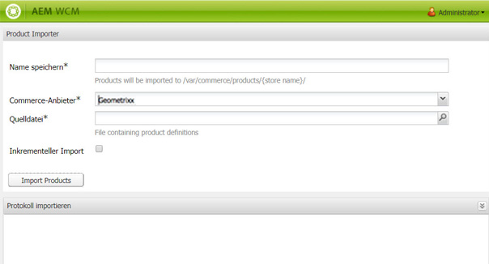
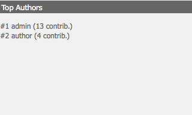

# Dashboards{#dashboards}

Bei Verwendung von AEM können Sie zahlreiche Inhalte verschiedener Typen verwalten (z. B. Seiten, Assets). AEM Dashboards bieten eine benutzerfreundliche und anpassbare Möglichkeit, Seiten zu definieren, die konsolidierte Daten anzeigen.

>[!NOTE]
>
>AEM Dashboards werden pro Benutzer erstellt, sodass ein Benutzer nur auf sein eigenes Dashboard zugreifen kann.
>
>Allerdings können [Dashboard-Vorlagen](#creating-a-dashboard-template) für die Freigabe der gemeinsamen Konfiguration und des Dashboard-Layouts verwendet werden.



## Verwalten von Dashboards {#administering-dashboards}

### Dashboard erstellen {#creating-a-dashboard}

1. Im **Instrumente** Abschnitt, klicken Sie auf **Konfigurationskonsole**.
1. Doppelklicken Sie in der Struktur auf **Dashboard**.
1. Klicks **Neues Dashboard**.
1. Geben Sie die **Titel** (z. B. Mein Dashboard) und die **Name**.
1. Klicken Sie auf **Erstellen**.

### Klonen eines Dashboards {#cloning-a-dashboard}

Möglicherweise möchten Sie mehrere Dashboards verwenden, um schnell Informationen über Ihren Inhalt aus verschiedenen Ansichten zu erhalten. Um Ihnen bei der Erstellung eines neuen Dashboards zu helfen, bietet AEM eine Klonfunktion, mit der Sie ein vorhandenes Dashboard duplizieren können. Gehen Sie wie folgt vor, um ein Dashboard zu klonen:

1. Im **Instrumente** Abschnitt, klicken Sie auf **Konfigurationskonsole**.

1. Klicken Sie in der Baumstruktur auf **Dashboard**.
1. Klicken Sie auf das Dashboard, das Sie klonen möchten.

1. Klicks **Klonen**.

1. Geben Sie die **Name** Ihres neuen Dashboards aus.

### Entfernen eines Dashboards {#removing-a-dashboard}

1. Im **Instrumente** Abschnitt, klicken Sie auf **Konfigurationskonsole**.

1. Klicken Sie in der Baumstruktur auf **Dashboard**.
1. Klicken Sie auf das Dashboard, das Sie löschen möchten.

1. Klicken Sie auf **Entfernen**.

1. Klicken Sie zur Bestätigung auf **Ja**.

## Dashboard-Komponenten {#dashboard-components}

### Übersicht {#overview}

Dashboard-Komponenten sind nichts anderes als normal [AEM](/help/sites-developing/developing-components-samples.md). In diesem Abschnitt werden die im Lieferumfang von AEM enthaltenen Berichterstellungskomponenten beschrieben.

### Reporting-Komponenten zur Web-Analyse {#web-analytics-reporting-components}

AEM enthält eine Reihe von Komponenten, die mehrere Metriken Ihrer [SiteCatalyst](/help/sites-administering/adobeanalytics.md) Daten. Diese Komponenten sind im Sidekick unter der **Dashboard** Abschnitt.

Jede Berichterstellungskomponente enthält mindestens drei Registerkarten:

* **Allgemein**: enthält die Hauptkonfiguration.

* **Bericht:** enthält die für jeden Bericht spezifische Konfiguration.
* **Stil**: enthält Stilkonfigurationen wie Diagrammgröße und Rand.

Die Berichterstellungskomponenten werden mit einer Standardkonfiguration initialisiert, mit der Sie Ihr Dashboard schnell einrichten können.

#### Grundlegende Konfiguration {#basic-configuration}

Die **Allgemein** -Tab bietet Zugriff auf die folgenden Konfigurationseinträge:

**Titel**: Der im Dashboard angezeigte Titel.

**Anfrage-Typ**: Die Art und Weise, wie Daten angefragt werden.

**SiteCatalyst-Konfiguration (optional)**: Die Konfiguration, die Sie für die Verbindung mit SiteCatalyst verwenden möchten. Falls nicht näher erläutert, wird von einer Konfiguration auf der Dashboardseite (über die Seiteneigenschaften) ausgegangen.

**Report Suite-ID (optional)**: Die SiteCatalyst-Report Suite, die Sie für die Erstellung des Diagramms verwenden möchten.

#### Berichtskonfiguration {#report-configuration}

Um Webstatistiken anzuzeigen, müssen Sie den Datumsbereich der Daten definieren, die Sie bearbeiten möchten. Die **Bericht** bietet zwei Felder, um diesen Bereich zu definieren.

>[!NOTE]
>
>Durch Festlegen eines großen Datumsbereichs kann die Reaktionsfähigkeit des Dashboards verringert werden.

**Ab-Datum** Absolutes oder relatives Datum, ab dem die Daten abgerufen werden.

**Bis-Datum**: Absolutes oder relatives Datum, bis zu dem die Daten abgerufen werden.

Jede Komponente definiert auch bestimmte Einstellungen.

#### Überstunden-Bericht {#overtime-report}


**Datumsgranularität** Zeiteinheit der X-Achse (z. B. Tag, Stunde)

**Metriken**: Die Liste der Ereignisse, die angezeigt werden sollen.

**Elemente**: Die Liste der Elemente, in der die Daten zu den Metriken im Diagramm aufgeschlüsselt sind.

#### Bewerteter Listenbericht {#ranked-list-report}


**Elemente**: Das Element, in dem die Daten zu den Metriken im Diagramm aufgeschlüsselt sind.

**Metriken** Das Ereignis, das Sie anzeigen möchten.

**Anzahl von Top-Elementen**: Anzahl der vom Bericht angezeigten Elemente.

#### Rangbericht {#ranked-report}


**Metriken** Das Ereignis, das Sie anzeigen möchten.

**Elemente**: Das Element, in dem die Daten zu den Metriken im Diagramm aufgeschlüsselt sind.

#### Bericht zu oberem Site-Bereich {#top-site-section-report}

Diese Komponente zeigt ein Diagramm an, das den besuchten Abschnitt einer Website gemäß der folgenden Konfiguration anzeigt.


**Anzahl von Top-Elementen**: Anzahl der vom Bericht angezeigten Abschnitte.

#### Trendbericht {#trended-report}


**Datumsgranularität** Zeiteinheit der X-Achse (z. B. Tag, Stunde)

**Metriken** Das Ereignis, das Sie anzeigen möchten.

**Elemente**: Das Element, in dem die Daten zu den Metriken im Diagramm aufgeschlüsselt sind.

## Dashboard erweitern {#extending-dashboard}

### Übersicht {#overview-1}

Dashboards sind normale Seiten (`cq:Page`), deshalb können zum Zusammenstellen von Dashboards beliebige Komponenten verwendet werden.

Es gibt die Standardkomponentengruppe `Dashboard`, die Reporting-Komponenten zur Analyse enthält, die standardmäßig in der Vorlage aktiviert sind.

### Erstellen einer Dashboard-Vorlage {#creating-a-dashboard-template}

Eine Vorlage definiert den Standardinhalt eines neuen Dashboards. Sie können mehrere Vorlagen verwenden, um verschiedene Arten von Dashboards zu erstellen.

Dashboard-Vorlagen werden auf die gleiche Weise wie andere Seitenvorlagen erstellt, mit dem Unterschied, dass sie unter `/libs/cq/dashboards/templates/` gespeichert werden. Weitere Informationen finden Sie im Abschnitt [Erstellen einer contentpage-Vorlage](/help/sites-developing/website.md#creating-the-contentpage-template).

>[!NOTE]
>
>Dashboard-Vorlagen werden von Benutzern gemeinsam verwendet.

### Entwickeln einer Dashboard-Komponente {#developing-a-dashboard-component}

Die Entwicklung einer Dashboard-Komponente besteht aus der Erstellung einer regulären AEM. In diesem Abschnitt wird ein Beispiel einer Komponente beschrieben, die die 10 wichtigsten Beitragenden anzeigt.


Die wichtigsten Autorkomponenten sind im Repository unter `/apps/geometrixx-outdoors/components/reporting` gespeichert und bestehen aus:

1. einer `jsp`-Datei, die jcr-Daten liest und den `html`-Platzhalter definiert

1. einer Client-seitigen Bibliothek, die eine `js`-Datei enthält. Diese ruft die Daten ab und gliedert sie und trägt dann den `html`-Platzhalter ein.



Die folgende JavaScript-Datei wird im `geout.reporting.topauthors` [Client-Bibliothek](/help/sites-developing/clientlibs.md) als untergeordnetes Element der Komponente selbst.

Der [QueryBuilder](/help/sites-developing/querybuilder-api.md) wird verwendet, um beim Repository das Lesen der `cq:AuditEvent`-Knoten anzufragen. Das Ergebnis der Abfrage ist ein JSON-Objekt, aus dem Autorenbeiträge extrahiert werden.

#### top_authors.js {#top-authors-js}

```
$.ajax({
  url: "/bin/querybuilder.json",
  cache: false,
  data: {
       "orderby": "cq:time",
       "orderby.sort": "desc",
       "p.hits": "full",
       "p.limit": 100,
       "path": "/var/audit/com.day.cq.wcm.core.page/",
       "type": "cq:AuditEvent"
   },
  dataType: "json"
}).done(function( res ) {
    var authors = {};
    // from JSON to Object
    for(var r in res.hits) {
        var userId = res.hits[r].userId;
        if(userId == undefined) {
            continue;
        }
        var auth = authors[userId] || {userId : userId};
        auth.contrib = (auth.contrib || 0) +1;

        authors[userId] = auth;
    }

    // order by contribution
    var orderedByContrib = [];
    for(var a in authors) {
        orderedByContrib.push(authors[a]);
    }
    orderedByContrib.sort(function(a,b){return b.contrib - a.contrib});

    // produce the list
    for (var i=0, tot=orderedByContrib.length; i < tot; i++) {
        var current = orderedByContrib[i];
        $("<div> #" + (i + 1) +" "+ current.userId + " (" + current.contrib +" contrib.)</div>").appendTo("#authors-list");

    }
});
```

Die `JSP`-Datei enthält sowohl `global.jsp` als auch `clientlib`.

#### top_authors.jsp {#top-authors-jsp}

```java
<%@page session="false" contentType="text/html; charset=utf-8" %><%
%><%
%><%@include file="/libs/foundation/global.jsp" %><%
%>
<ui:includeClientLib categories="geout.reporting.topauthors" />
<%
String reportletTitle = properties.get("title", "Top Authors");
%>
<html>
     <h3><%=xssAPI.encodeForHTML(reportletTitle) %></h3>
     <div id="authors-list"></div>
</html>
```
