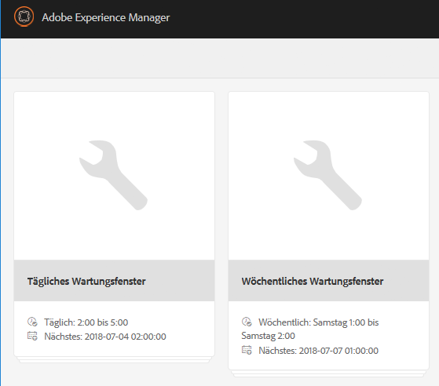
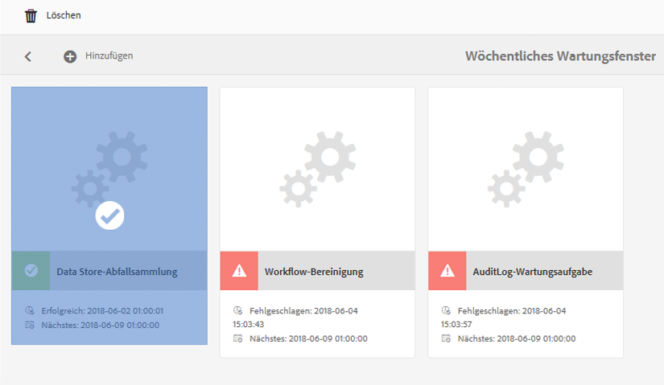
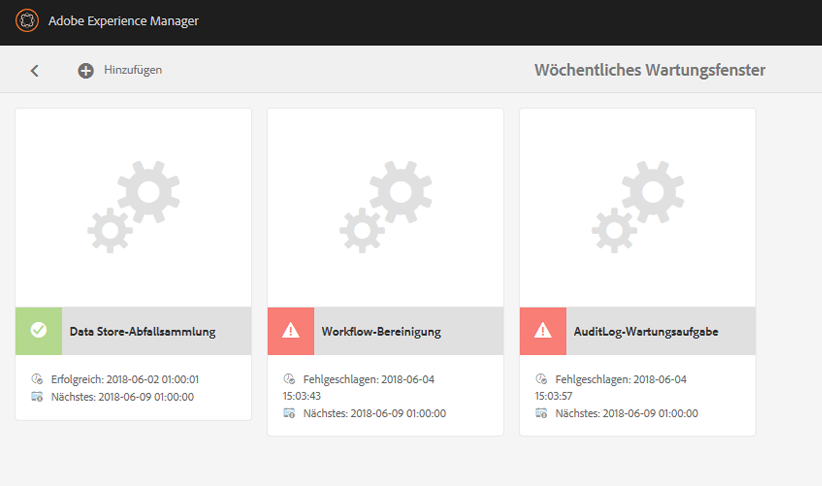

# Datenspeicherbereinigung {#data-store-garbage-collection}

Wenn ein herkömmliches WCM-Asset entfernt wird, kann der Verweis auf den zugrunde liegenden Datenspeicherdatensatz aus der Knotenhierarchie entfernt werden, der Datenspeichersatz selbst bleibt jedoch erhalten. Dieser nicht referenzierte Datenspeicherdatensatz wird dann zu &quot;Müll&quot;, der nicht beibehalten werden muss. In Fällen, in denen mehrere Garbage Assets vorhanden sind, ist es von Vorteil, diese zu entfernen, um Speicherplatz zu sparen und die Backup- und Dateisystemwartungsleistung zu optimieren.

Meistens sammelt eine WCM-Anwendung Informationen, löscht aber Informationen nicht so häufig. Obwohl neue Bilder hinzugefügt werden, selbst wenn alte Versionen ersetzt werden, behält das Versionskontrollsystem die alte Version bei und unterstützt bei Bedarf die Wiederherstellung. Somit wird der Großteil der Inhalte, die wir als Hinzufügen zum System betrachten, effektiv dauerhaft gespeichert. Was ist also die typische Quelle für &quot;Müll&quot;im Repository, den wir bereinigen möchten?

AEM verwendet das Repository als Speicher für mehrere interne und speicherinterne Aktivitäten:

* Erstellte und heruntergeladene Pakete
* Temporäre Dateien, die für die Veröffentlichungsreplikation erstellt wurden
* Workflow-Payloads
* Assets, die vorübergehend während des DAM-Renderings erstellt werden

Wenn eines dieser temporären Objekte groß genug ist, um im Datenspeicher gespeichert werden zu müssen, und wenn das Objekt schließlich nicht mehr verwendet werden kann, bleibt der Datenspeicherdatensatz selbst als &quot;Müll&quot;. In einer typischen WCM-Autoren-/Veröffentlichungsanwendung ist die größte Speicherquelle dieses Typs normalerweise der Veröffentlichungsaktivierungsprozess. Wenn Daten für die Veröffentlichung repliziert werden, werden diese zunächst in einem effizienten Datenformat namens „Durbo“ in Sammlungen erfasst und im Repository unter `/var/replication/data` gespeichert. Die Datenbundles übersteigen oft den kritischen Größenschwellenwert für den Datenspeicher und werden daher als Datenspeichersätze gespeichert. Wenn die Replikation abgeschlossen ist, wird der Knoten in `/var/replication/data` gelöscht, doch der Datenspeichersatz bleibt als „Garbage“ bestehen.

Eine weitere Quelle für wiederherstellbaren Müll sind Pakete. Paketdaten werden wie alles andere im Repository gespeichert und daher für Pakete, die größer als 4 KB sind, im Datenspeicher. Im Zuge eines Entwicklungsprojekts oder im Laufe der Zeit können Pakete unter Beibehaltung eines Systems mehrmals erstellt und neu erstellt werden. Jeder Build führt zu einem neuen Datenspeichersatz, der den Datensatz des vorherigen Builds verwaist.

## Wie funktioniert die automatische Datenspeicherbereinigung? {#how-does-data-store-garbage-collection-work}

Wenn das Repository mit einem externen Datenspeicher konfiguriert wurde, [Die Speicherbereinigung wird automatisch ausgeführt](/help/sites-administering/data-store-garbage-collection.md#automating-data-store-garbage-collection) als Teil des wöchentlichen Wartungsfensters. Die oder der Systemadmin kann bei Bedarf die [Datenspeicherbereinigung auch manuell ausführen](#running-data-store-garbage-collection). Im Allgemeinen wird empfohlen, die automatische Datenspeicherbereinigung regelmäßig durchzuführen, aber bei der Planung von Datenspeicherbereinigungen die folgenden Faktoren zu berücksichtigen:

* Datenspeicherbereinigungen nehmen Zeit in Anspruch und können sich auf die Leistung auswirken. Daher sollten sie entsprechend geplant werden.
* Das Entfernen von Speicherbereinigungsdatensätzen wirkt sich nicht auf die normale Leistung aus, daher handelt es sich hierbei nicht um eine Leistungsoptimierung.
* Wenn die Speichernutzung und damit verbundene Faktoren wie Sicherungszeiten kein Problem darstellen, kann die Datenspeicherbereinigung sicher verzögert werden.

Der Garbage Collector für den Datenspeicher notiert zunächst den aktuellen Zeitstempel, wenn der Prozess beginnt. Die Sammlung wird dann mit einem Multi-Pass-Mark-/Sweep-Musteralgorithmus durchgeführt.

In der ersten Phase führt der Datenspeicher-Garbage Collector einen umfassenden Durchlauf aller Repository-Inhalte durch. Für jedes Inhaltsobjekt, das einen Verweis auf einen Datenspeicherdatensatz hat, hat es die Datei im Dateisystem gefunden, indem es eine Metadatenaktualisierung durchführt und das Attribut &quot;Zuletzt geändert&quot;oder &quot;MTIME&quot;ändert. An diesem Punkt werden Dateien, auf die in dieser Phase zugegriffen wird, neuer als der ursprüngliche Baseline-Zeitstempel.

In der zweiten Phase durchläuft der Datenspeicherbereiniger die physische Verzeichnisstruktur des Datenspeichers ähnlich wie ein &quot;Suchen&quot;. Sie hat das Attribut &quot;Zuletzt geändert&quot;oder &quot;MTIME&quot;der Datei geprüft und die folgende Feststellung getroffen:

* Wenn die MTIME neuer als der ursprüngliche Baseline-Zeitstempel ist, wurde die Datei entweder in der ersten Phase gefunden oder es handelt sich um eine völlig neue Datei, die dem Repository hinzugefügt wurde, während der Erfassungsvorgang läuft. In beiden Fällen wird der Datensatz als aktiv angesehen und die Datei wird nicht gelöscht.
* Wenn die MTIME vor dem anfänglichen Baseline-Zeitstempel liegt, ist die Datei keine aktiv referenzierte Datei und gilt als entfernbarer Müll.

Dieser Ansatz eignet sich gut für einen einzelnen Knoten mit einem privaten Datenspeicher. Der Datenspeicher kann jedoch freigegeben werden, und wenn dies bedeutet, dass potenziell aktive Live-Verweise auf Datenspeicherdatensätze aus anderen Repositorys nicht überprüft werden und aktive referenzierte Dateien versehentlich entfernt werden. Der Systemadministrator muss die freigegebene Natur des Datenspeichers unbedingt vor der Planung von Speicherbereinigungen verstehen und nur dann den einfachen integrierten Datenspeicherbereinigungsprozess verwenden, wenn bekannt ist, dass der Datenspeicher nicht freigegeben ist.

>[!NOTE]
>
>Wenn Sie die automatische Bereinigung für einen eingerichteten Cluster- oder freigegebenen Speicher (mit Mongo oder Segment-Tar) durchführen, werden im Protokoll möglicherweise Warnungen angezeigt, wonach bestimmte Blob-IDs nicht gelöscht werden können. Dies geschieht, weil während einer vorherigen automatischen Bereinigung gelöschte Blob-IDs fälschlicherweise erneut von anderen Cluster- oder Freigabeknoten referenziert werden, denen die Informationen zu den ID-Löschungen fehlen. Daher wird bei der automatischen Bereinigung eine Warnung protokolliert, wenn versucht wird, eine bereits im vorherigen Durchgang gelöschte ID zu entfernen. Dieses Verhalten wirkt sich weder auf die Leistung noch auf die Funktionalität aus.

## Ausführen der automatischen Datenspeicherbereinigung {#running-data-store-garbage-collection}

Je nach der Einrichtung des Datenspeichers, auf dem AEM ausgeführt wird, gibt es drei Möglichkeiten, die automatische Datenspeicherbereinigung auszuführen:

1. Über die [Revisionsbereinigung](/help/sites-deploying/revision-cleanup.md) – ein Bereinigungsmechanismus, der in der Regel für die Bereinigung des Knotenspeichers verwendet wird

1. Via [Datenspeicherbereinigung](/help/sites-administering/data-store-garbage-collection.md#running-data-store-garbage-collection-via-the-operations-dashboard) - ein Speicherbereinigungsmechanismus, der speziell für externe Datenspeicher verwendet wird und im Vorgangs-Dashboard verfügbar ist.
1. Über die [JMX-Konsole](/help/sites-administering/jmx-console.md).

Wenn TarMK sowohl als Knotenspeicher als auch als Datenspeicher verwendet wird, kann die Revisionsbereinigung für die Speicherbereinigung sowohl des Knotenspeichers als auch des Datenspeichers verwendet werden. Wenn jedoch ein externer Datenspeicher wie der Dateisystem-Datenspeicher konfiguriert ist, muss die automatische Datenspeicherbereinigung explizit separat von der Revisionsbereinigung ausgelöst werden. Die Speicherbereinigung kann entweder über das Vorgangs-Dashboard oder die JMX-Konsole ausgelöst werden.

Die folgende Tabelle zeigt den Datenspeicherbereinigungstyp, der für alle unterstützten Datenspeicherbereitstellungen in AEM 6 verwendet werden muss:

<table>
 <tbody>
  <tr>
   <td><strong>Knotenspeicher</strong><br /> </td>
   <td><strong>Datenspeicher</strong></td>
   <td><strong>Bereinigungsmechanismus</strong><br /> </td>
  </tr>
  <tr>
   <td>TarMK</td>
   <td>TarMK</td>
   <td>Revisionsbereinigung (Binärdateien sind mit dem Segmentspeicher abgestimmt)</td>
  </tr>
  <tr>
   <td>TarMK</td>
   <td>Externes Dateisystem</td>
   <td><p>Aufgabe zur automatischen Datenspeicherbereinigung über das Vorgangs-Dashboard</p> <p>JMX-Konsole</p> </td>
  </tr>
  <tr>
   <td>MongoDB</td>
   <td>MongoDB</td>
   <td><p>Aufgabe zur automatischen Datenspeicherbereinigung über das Vorgangs-Dashboard</p> <p>JMX-Konsole</p> </td>
  </tr>
  <tr>
   <td>MongoDB</td>
   <td>Externes Dateisystem</td>
   <td><p>Aufgabe zur automatischen Datenspeicherbereinigung über das Vorgangs-Dashboard</p> <p>JMX-Konsole</p> </td>
  </tr>
 </tbody>
</table>

### Ausführen der automatischen Datenspeicherbereinigung über das Vorgangs-Dashboard {#running-data-store-garbage-collection-via-the-operations-dashboard}

Das integrierte, über das [Vorgangs-Dashboard](/help/sites-administering/operations-dashboard.md) verfügbare wöchentliche Wartungsfenster beinhaltet die integrierte Aufgabe, die Datenspeicherbereinigung sonntags um 1 Uhr nachts durchzuführen.

Wenn Sie die automatische Datenspeicherbereinigung außerhalb dieses Zeitraums ausführen müssen, kann sie manuell über das Vorgangs-Dashboard ausgelöst werden.

Bevor Sie die automatische Datenspeicherbereinigung ausführen, sollten Sie überprüfen, ob derzeit keine Sicherungen ausgeführt werden.

1. Öffnen Sie das Vorgangs-Dashboard durch **Navigation** -> **Instrumente** -> **Aktivitäten** -> **Wartung**.
1. Klicken oder tippen Sie auf **Wöchentliches Wartungsfenster**.

   

1. Wählen Sie die Aufgabe **Automatische Datenspeicherbereinigung** und klicken oder tippen Sie auf das Symbol **Ausführen**.

   

1. Die automatische Datenspeicherbereinigung wird ausgeführt und der Status wird im Dashboard angezeigt.

   

>[!NOTE]
>
>Die Aufgabe zur Durchführung der automatischen Datenspeicherbereinigung wird nur angezeigt, wenn Sie einen externen Dateidatenspeicher konfiguriert haben. Informationen zum Einrichten eines Dateidatenspeichers finden Sie unter [Konfigurieren von Knotenspeichern und Datenspeichern in AEM 6](/help/sites-deploying/data-store-config.md#file-data-store).

### Ausführen der automatischen Datenspeicherbereinigung über die JMX-Konsole {#running-data-store-garbage-collection-via-the-jmx-console}

In diesem Abschnitt wird die manuelle Ausführung der automatischen Datenspeicherbereinigung über die JMX-Konsole beschrieben. Wenn Ihre Installation ohne einen externen Datenspeicher eingerichtet ist, gilt dies nicht für Ihre Installation. Sehen Sie sich stattdessen die Anweisungen zum Ausführen der Revisionsbereinigung unter [Wartung des Repositorys](/help/sites-deploying/storage-elements-in-aem-6.md#maintaining-the-repository).

>[!NOTE]
>
>Wenn Sie TarMK mit einem externen Datenspeicher ausführen, müssen Sie zunächst die Versionsbereinigung ausführen, damit die Speicherbereinigung effektiv sein kann.

So führen Sie die Speicherbereinigung durch:

1. Markieren Sie in der Apache Felix OSGi Management Console die **Main** Registerkarte und wählen Sie **JMX** aus dem folgenden Menü.
1. Suchen Sie dann nach dem MBean **Repository Manager** und klicken Sie darauf (oder gehen Sie zu `https://<host>:<port>/system/console/jmx/org.apache.jackrabbit.oak%3Aname%3Drepository+manager%2Ctype%3DRepositoryManagement`).
1. Klicken Sie auf **startDataStoreGC(boolean markOnly)**.
1. Geben Sie falls erforderlich `true` für den Parameter `markOnly` ein:

   | **Option** | **Beschreibung** |
   |---|---|
   | boolesches markOnly | Setzen Sie diesen Wert auf true, um beim Markierungs- und Sweep-Vorgang nur Referenzen zu markieren und nicht zu sweepen. Dieser Modus wird verwendet, wenn der zugrunde liegende BlobStore von mehreren verschiedenen Repositorys gemeinsam genutzt wird. Für alle anderen Fälle setzen Sie es auf &quot;false&quot;, um eine vollständige Speicherbereinigung durchzuführen. |

1. Klicken Sie auf **Invoke**. CRX führt die Speicherbereinigung durch und zeigt an, wenn diese abgeschlossen ist.

>[!NOTE]
>
>Die automatische Datenspeicherbereinigung erfasst keine Dateien, die in den letzten 24 Stunden gelöscht wurden.

>[!NOTE]
>
>Die Aufgabe zur Durchführung der automatischen Datenspeicherbereinigung startet nur, wenn Sie einen externen Dateidatenspeicher konfiguriert haben. Wenn kein externer Dateidatenspeicher konfiguriert wurde, gibt die Aufgabe, nachdem sie aufgerufen wurde, die Meldung `Cannot perform operation: no service of type BlobGCMBean found` aus. Informationen zum Einrichten eines Dateidatenspeichers finden Sie unter [Konfigurieren von Knotenspeichern und Datenspeichern in AEM 6](/help/sites-deploying/data-store-config.md#file-data-store).

## Automatisieren der automatischen Datenspeicherbereinigung {#automating-data-store-garbage-collection}

Wenn möglich, sollte die automatische Datenspeicherbereinigung ausgeführt werden, wenn das System beispielsweise morgens wenig ausgelastet ist.

Das integrierte, über das [Vorgangs-Dashboard](/help/sites-administering/operations-dashboard.md) verfügbare wöchentliche Wartungsfenster beinhaltet die integrierte Aufgabe, die Datenspeicherbereinigung sonntags um 1 Uhr morgens durchzuführen. Sie sollten auch überprüfen, ob derzeit keine Sicherungen ausgeführt werden. Der Beginn des Wartungsfensters kann bei Bedarf über das Dashboard angepasst werden.

>[!NOTE]
>
>Es sollte nicht beides gleichzeitig ausgeführt werden, damit alte (und nicht verwendete) Datenspeicherdateien ebenfalls gesichert werden. Auf diese Weise sind die Binärdateien nach wie vor in der Sicherung vorhanden, wenn das Zurücksetzen auf eine alte Revision erforderlich sein sollte.

Wenn Sie die automatische Datenspeicherbereinigung nicht mit dem wöchentlichen Wartungsfenster im Vorgangs-Dashboard ausführen möchten, kann sie mithilfe der wget- oder curl-HTTP-Clients automatisiert werden. Es folgt ein Beispiel für eine Automatisierung der Sicherung mithilfe von curl:

>[!CAUTION]
>
>Im folgenden Beispiel müssen gegebenenfalls verschiedene Parameter des `curl`-Befehls für Ihre Instanz konfiguriert werden, so zum Beispiel Hostname (`localhost`), Port (`4502`), Admin-Kennwort (`xyz`) und verschiedene Parameter für die tatsächliche automatische Datenspeicherbereinigung.

Dies ist ein Beispiel für einen curl-Befehl zum Aufrufen der automatischen Datenspeicherbereinigung über die Befehlszeile:

```shell
curl -u admin:admin -X POST --data markOnly=true  https://localhost:4503/system/console/jmx/org.apache.jackrabbit.oak"%"3Aname"%"3Drepository+manager"%"2Ctype"%"3DRepositoryManagement/op/startDataStoreGC/boolean
```

Der curl-Befehl wird sofort zurückgegeben.

## Überprüfen der Datenspeicherkonsistenz {#checking-data-store-consistency}

Die Konsistenzprüfung des Datenspeichers meldet alle Datenspeicher-Binärdateien, die fehlen, aber noch referenziert werden. Gehen Sie wie folgt vor, um eine Konsistenzprüfung zu starten:

1. Wechseln Sie zur JMX-Konsole. Informationen zur Verwendung der JMX-Konsole finden Sie in [diesem Artikel](/help/sites-administering/jmx-console.md#using-the-jmx-console).
1. Suchen Sie nach dem MBean **BlobGarbageCollection** und klicken Sie darauf.
1. Klicken Sie auf den Link `checkConsistency()`.

Nach dem Abschluss der Konsistenzprüfung wird eine Meldung mit der Zahl der als fehlend gemeldeten Binärdateien angezeigt. Ist die Zahl größer als 0, prüfen Sie das `error.log`, um weitere Details zu fehlenden Binärdateien anzuzeigen.

Im Folgenden finden Sie ein Beispiel dafür, wie die fehlenden Binärdateien in den Protokollen gemeldet werden:

```xml
11:32:39.673 INFO [main] MarkSweepGarbageCollector.java:600 Consistency check found [1] missing blobs
```

```xml
11:32:39.673 WARN [main] MarkSweepGarbageCollector.java:602 Consistency check failure intheblob store : DataStore backed BlobStore [org.apache.jackrabbit.oak.plugins.blob.datastore.OakFileDataStore], check missing candidates in file /tmp/gcworkdir-1467352959243/gccand-1467352959243
```
