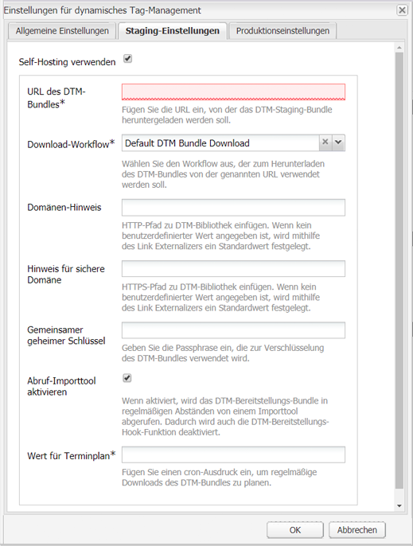
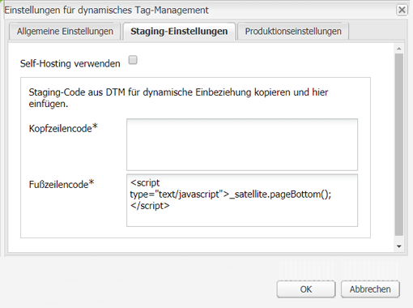
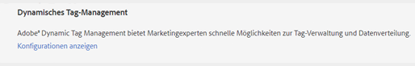
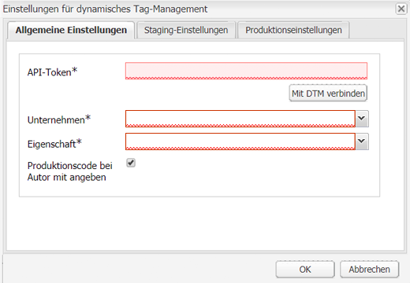
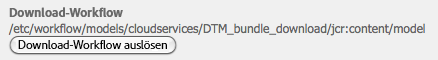
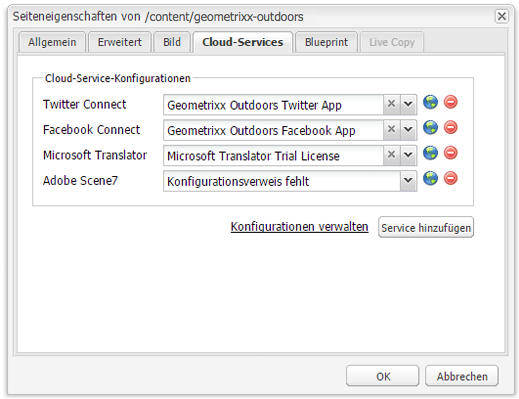
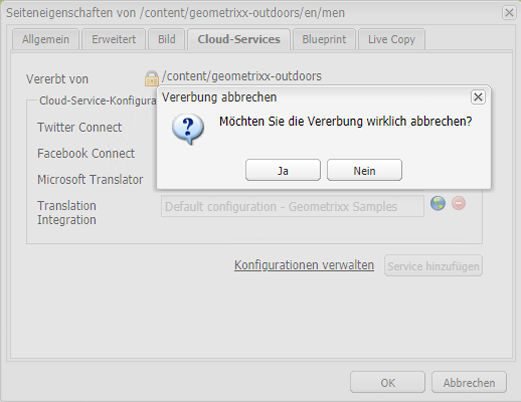

# Integrieren mit Adobe Dynamic Tag Management  {#integrating-with-adobe-dynamic-tag-management}

Integrieren Sie [Adobe Dynamic Tag Management](https://www.adobe.com/solutions/digital-marketing/dynamic-tag-management.html) mit AEM, sodass Sie Ihre Dynamic Tag Management-Webeigenschaften für das Tracking von AEM Sites verwenden können. Dynamic Tag Management ermöglicht Marketingexperten die Verwaltung von Tags für die Datensammlung und die Verteilung von Daten auf Systeme für Digital Marketing. Verwenden Sie Dynamic Tag Management zum Beispiel für die Erfassung der Nutzungsdaten zu Ihrer AEM-Website und die Verteilung der Daten für die Analyse in Adobe Analytics oder Adobe Target.

Vor der Integration müssen Sie die Dynamic Tag Management-[Webeigenschaft](https://microsite.omniture.com/t2/help/en_US/dtm/#Web_Properties) erstellen, die für das Tracking der Domäne Ihrer AEM-Site zuständig ist. Die [Hosting-Optionen](https://microsite.omniture.com/t2/help/en_US/dtm/#Hosting__Embed_Tab) der Webeigenschaft müssen so konfiguriert werden, dass Sie AEM für den Zugriff auf die Dynamic Tag Management-Bibliotheken konfigurieren können.

Nach der Konfiguration der Integration erfordern Änderungen an den Dynamic Tag Management-Bereitstellungstools sowie an Regeln keine Änderungen mehr an der Dynamic Tag Management-Konfiguration in AEM. Die Änderungen stehen AEM automatisch zur Verfügung.

>[!NOTE]
>
>Wenn Sie DTM mit einer benutzerdefinierten Proxy-Konfiguration verwenden, müssen Sie beide HTTP-Client-Proxy-Konfigurationen vornehmen, da manche Funktionen von AEM 3.x-APIs verwenden und andere wiederum 4.x-APIs:
>
>* 3.x wird mit [http://localhost:4502/system/console/configMgr/com.day.commons.httpclient](http://localhost:4502/system/console/configMgr/com.day.commons.httpclient) konfiguriert.
>* 4.x wird mit [http://localhost:4502/system/console/configMgr/org.apache.http.proxyconfigurator](http://localhost:4502/system/console/configMgr/org.apache.http.proxyconfigurator)  konfiguriert.

>

## Bereitstellungsoptionen  {#deployment-options}

Die folgenden Bereitstellungsoptionen beeinflussen die Konfiguration der Integration mit Dynamic Tag Management.

### Hosting von Dynamic Tag Management  {#dynamic-tag-management-hosting}

AEM unterstützt Dynamic Tag Management, das in der Cloud oder in AEM gehostet wird.

* In der Cloud gehostet: Die JavaScript-Bibliotheken von Dynamic Tag Management werden in der Cloud gehostet und Ihre AEM-Seiten verweisen direkt auf sie.
* In AEM gehostet: Dynamic Tag Management generiert JavaScript-Bibliotheken. AEM verwendet ein Workflow-Modell, um die Bibliotheken abzurufen und zu installieren.

Die von Ihrer Implementierung verwendete Art des Hostings bestimmt einige der von Ihnen durchgeführten Konfigurations- und Implementierungsaufgaben. Weitere Informationen zu den Hostingoptionen finden Sie unter [Hosting – Registerkarte „Einbetten“](https://microsite.omniture.com/t2/help/en_US/dtm/#Hosting__Embed_Tab) in der Hilfe zu Dynamic Tag Management.

### Staging- und Produktionsbibliothek  {#staging-and-production-library}

Entscheiden Sie, ob Ihre AEM-Autoreninstanz den Staging- oder Produktionscode von Dynamic Tag Management verwenden soll.

In der Regel nutzt Ihre Autoreninstanz die Staging-Bibliotheken von Dynamic Tag Management und die Produktionsinstanz nutzt die Produktionsbibliotheken. Dieses Szenario ermöglicht Ihnen die Nutzung der Autoreninstanz, um nicht genehmigte Dynamic Tag Management-Konfigurationen zu testen.

Bei Bedarf kann Ihre Autoreninstanz die Produktionsbibliotheken nutzen. Es sind Webbrowser-Plug-ins verfügbar, die Ihnen den Wechsel zwischen der Verwendung der Staging-Bibliotheken zu Testzwecken ermöglichen, wenn die Bibliotheken in der Cloud gehostet werden.

### Verwenden des Bereitstellungs-Hooks für Dynamic Tag Management {#using-the-dynamic-tag-management-deployment-hook}

Wenn AEM die Dynamic Tag Management-Bibliotheken hostet, können Sie den Bereitstellungs-Hook-Service verwenden, um Bibliotheksaktualisierungen automatisch auf AEM zu pushen. Bibliotheksaktualisierungen werden übertragen, wenn Änderungen an den Bibliotheken vorgenommen werden, z. B. wenn die Webeigenschaftseigenschaften des Dynamic Tag Management bearbeitet werden.

Um den Bereitstellungs-Hook zu verwenden, muss Dynamic Tag Management eine Verbindung zur AEM-Instanz herstellen können, die die Bibliotheken hostet. Sie müssen [den Zugriff auf AEM](/help/sites-administering/dtm.md#enabling-access-for-the-deployment-hook-service) für die Dynamic Tag Management-Server aktivieren.

Unter manchen Umständen kann AEM nicht erreichbar sein, so zum Beispiel, wenn AEM sich hinter einer Firewall befindet. In diesen Fällen können Sie die Option Abruf-Importtool von AEM verwenden, um die Bibliotheken regelmäßig abzurufen. Ein Cron-Auftragsausdruck gibt den Plan für Bibliotheksdownloads vor.

## Aktivieren des Zugriffs auf den Bereitstellungs-Hook-Service  {#enabling-access-for-the-deployment-hook-service}

Aktivieren Sie den Bereitstellungs-Hook-Service für Dynamic Tag Management, um auf AEM zuzugreifen, damit der Service die in AEM gehosteten Bibliotheken aktualisieren kann. Geben Sie die IP-Adresse der Dynamic Tag Management-Server an, die die Staging- und Produktionsbibliotheken nach Bedarf aktualisieren:

* Staging: `107.21.99.31`
* Produktion: `23.23.225.112` und `204.236.240.48`

Führen Sie die Konfiguration entweder mit der [Web-Konsole](/help/sites-deploying/configuring-osgi.md#osgi-configuration-with-the-web-console) oder einem [`sling:OsgiConfig`](/help/sites-deploying/configuring-osgi.md#osgi-configuration-in-the-repository)-Knoten durch:

* Verwenden Sie in der Web-Konsole auf der Konfigurationsseite das Element Adobe DTM-Bereitstellung Hook-Konfiguration .
* Für eine OSGi-Konfiguration lautet die PID des Dienstes `com.adobe.cq.dtm.impl.servlets.DTMDeployHookServlet`.

In der folgenden Tabelle sind die zu konfigurierenden Eigenschaften beschrieben.

| Web-Konsoleneigenschaft | OSGi-Eigenschaft | Beschreibung |
|---|---|---|
| Staging-DTM-IP-White-List | `dtm.staging.ip.whitelist` | Die IP-Adresse des Dynamic Tag Management-Servers, der die Staging-Bibliotheken aktualisiert. |
| IP-Whitelist für Produktions-DTM | `dtm.production.ip.whitelist` | Die IP-Adresse des Dynamic Tag Management-Servers, der die Produktionsbibliotheken aktualisiert. |

## Erstellen der Dynamic Tag Management-Konfiguration {#creating-the-dynamic-tag-management-configuration}

Erstellen Sie eine Cloud-Konfiguration, sodass die AEM-Instanz sich mit Dynamic Tag Management authentifizieren und mit Ihrer Webeigenschaft interagieren kann.

>[!NOTE]
>
>Vermeiden Sie die Integration von zwei Adobe Analytics-Trackingcodes auf Ihren Seiten, wenn Ihre DTM-Webeigenschaft das Adobe Analytics-Tool umfasst und Sie zudem den [Inhaltseinblick](/help/sites-authoring/content-insights.md) verwenden. Wählen Sie in Ihrer [Adobe Analytics-Cloud-Konfiguration](/help/sites-administering/adobeanalytics-connect.md#configuring-the-connection-to-adobe-analytics) die Option &quot;Tracking-Code nicht einschließen&quot;.

### Allgemeine Einstellungen {#general-settings}

<table>
 <tbody>
  <tr>
   <th>Eigenschaft</th>
   <th>Beschreibung</th>
  </tr>
  <tr>
   <td>API-Token</td>
   <td>Der -Wert der API-Token-Eigenschaft Ihres Dynamic Tag Management-Benutzerkontos. AEM verwendet diese Eigenschaft für die Authentifizierung mit Dynamic Tag Management.</td>
  </tr>
  <tr>
   <td>Unternehmen</td>
   <td>Das Unternehmen, mit dem Ihre Anmelde-ID verknüpft ist.</td>
  </tr>
  <tr>
   <td>Eigenschaft</td>
   <td>Der Name der Webeigenschaft, die Sie zum Verwalten der Tags für Ihre AEM Site erstellt haben.</td>
  </tr>
  <tr>
   <td>Produktionscode bei Autor mit angeben</td>
   <td>
Wählen Sie diese Option aus, damit die AEM Autoren- und Veröffentlichungsinstanzen die Produktionsversion der Dynamic Tag Management-Bibliotheken verwenden. 
 
Wird diese Option nicht ausgewählt, werden die Staging-Einstellungen auf die Autoreninstanz angewandt und die Produktionseinstellungen auf die Veröffentlichungsinstanz.
 </td>
  </tr>
 </tbody>
</table>

### Self-Hosting-Eigenschaften – Staging und Produktion {#self-hosting-properties-staging-and-production}

Die folgenden Eigenschaften der Dynamic Tag Management-Konfiguration ermöglichen AEM das Hosten von Dynamic Tag Management-Bibliotheken. Die Eigenschaften ermöglichen AEM das Herunterladen und Installieren der Bibliotheken. Optional können Sie die Bibliotheken automatisch aktualisieren, um sicherzustellen, dass sie jede an der Dynamic Tag Management-Anwendung vorgenommene Änderung widerspiegeln.

Manche Eigenschaften verwenden Werte, die Sie im Abschnitt zum Herunterladen von Bibliotheken auf der Registerkarte „Eigenschaften“ der Dynamic Tag Management-Webeigenschaft abrufen können. Weitere Informationen finden Sie unter [Herunterladen von Bibliotheken](https://microsite.omniture.com/t2/help/en_US/dtm/#Library_Download) in der Hilfe zu Dynamic Tag Management.

>[!NOTE]
>
>Wenn Sie das Dynamic Tag Management-Bundle in AEM hosten, muss das Herunterladen von Bibliotheken in Dynamic Tag Management aktiviert sein, bevor Sie die Konfiguration erstellen. Darüber hinaus muss Akamai aktiviert sein, da Akamai die herunterzuladenden Dateien bereitstellt.

Beim Hosten der Dynamic Tag Management-Bibliotheken in AEM konfiguriert AEM automatisch einige Eigenschaften der Webeigenschaft gemäß Ihrer Konfiguration. In der folgenden Tabelle finden Sie die Beschreibungen hierzu.

<table>
 <tbody>
  <tr>
   <th>Eigenschaft</th>
   <th>Beschreibung</th>
  </tr>
  <tr>
   <td>Self-Hosting verwenden</td>
   <td>Wählen Sie aus, wann Sie die Bibliotheksdatei für das Dynamic Tag Management auf AEM hosten. Die Auswahl dieser Option sorgt dafür, dass die anderen Eigenschaften in dieser Tabelle angezeigt werden.</td>
  </tr>
  <tr>
   <td>URL des DTM-Bundles</td>
   <td>Die URL, die zum Herunterladen der Dynamic Tag Management-Bibliothek verwendet werden soll. Rufen Sie diesen Wert im Abschnitt zu den Download-URLs der Seite „Herunterladen von Bibliotheken“ von Dynamic Tag Management ab. Aus Sicherheitsgründen muss dieser Wert manuell konfiguriert werden.</td>
  </tr>
  <tr>
   <td>Download-Workflow</td>
   <td>
Das Workflow-Modell, das zum Herunterladen und Installieren der Dynamic Tag Management-Bibliothek verwendet werden soll. Das Standardmodell ist „Standard-DTM-Bundle-Download“. Verwenden Sie dieses Modell, sofern Sie kein benutzerdefiniertes Modell erstellt haben.
 
Beachten Sie, dass die Bibliotheken beim standardmäßigen Download-Workflow automatisch aktiviert werden, wenn sie heruntergeladen werden.
 </td>
  </tr>
  <tr>
   <td>Domänen-Hinweis</td>
   <td>
(Optional) Die Domäne des AEM-Servers, der die Dynamic Tag Management-Bibliothek hostet. Geben Sie einen Wert an, um die Standarddomäne zu überschreiben, die für den <a href="/help/sites-developing/externalizer.md">Day CQ Link Externalizer-Dienst</a> konfiguriert ist.
 
Wenn AEM mit Dynamic Tag Management verbunden ist, nutzt es diesen Wert zum Konfigurieren des Staging-HTTP-Pfads oder des Produktions-HTTP-Pfads der Eigenschaften zum Herunterladen von Bibliotheken der Dynamic Tag Management-Webeigenschaft.
 </td>
  </tr>
  <tr>
   <td>Hinweis für sichere Domäne</td>
   <td>
(Optional) Die Domäne des AEM-Servers, der die Dynamic Tag Management-Bibliothek über HTTPS hostet. Geben Sie einen Wert an, um die Standarddomäne zu überschreiben, die für den <a href="/help/sites-developing/externalizer.md">Day CQ Link Externalizer-Dienst</a> konfiguriert ist.
 
Wenn AEM mit Dynamic Tag Management verbunden ist, nutzt es diesen Wert zum Konfigurieren des Staging-HTTPS-Pfads oder des Produktions-HTTPS-Pfads der Eigenschaften zum Herunterladen von Bibliotheken der Dynamic Tag Management-Webeigenschaft.
 </td>
  </tr>
  <tr>
   <td>Gemeinsamer geheimer Schlüssel</td>
   <td>
(Optional) Der gemeinsam genutzte geheime Schlüssel, der zum Entschlüsseln des Downloads verwendet werden soll. Rufen Sie diesen Wert im Feld "Gemeinsamer geheimer Schlüssel"auf der Seite "Bibliotheksdownload"des Dynamic Tag Management ab.
 
<strong>Hinweis:</strong> Sie müssen die   OpenSSL-Bibliotheken auf dem Computer installiert haben, auf dem AEM installiert ist, damit AEM die heruntergeladenen Bibliotheken entschlüsseln können.
 </td>
  </tr>
  <tr>
   <td>Abruf-Importtool aktivieren</td>
   <td>
(Optional) Wählen Sie diese Option aus, um die Dynamic Tag Management-Bibliothek regelmäßig herunterzuladen und zu installieren, um sicherzustellen, dass Sie eine aktualisierte Version verwenden. Wenn diese Option aktiviert ist, sendet das Dynamic Tag Management keine HTTP-POST-Anfragen an die Bereitstellungs-Hook-URL.
 
AEM konfiguriert automatisch die Bereitstellungs-Hook-URL-Eigenschaft der Eigenschaften zum Herunterladen von Bibliotheken für die Dynamic Tag Management-Webeigenschaft. Ist dies ausgewählt, wird die Eigenschaft ohne Wert konfiguriert. Wenn die Eigenschaft nicht ausgewählt ist, wird sie mit der URL Ihrer Dynamic Tag Management-Konfiguration konfiguriert.
 
Aktivieren Sie „Abruf-Importtool“, wenn der Bereitstellungs-Hook für Dynamic Tag Management keine Verbindung zu AEM herstellen kann – zum Beispiel, wenn AEM sich hinter einer Firewall befindet.
 </td>
  </tr>
  <tr>
   <td>Wert für Terminplan</td>
   <td>(Wird angezeigt und ist erforderlich, wenn "Abruf-Importtool aktivieren"ausgewählt ist.) Ein Cron-Ausdruck, der steuert, wann die Dynamic Tag Management-Bibliotheken heruntergeladen werden.</td>
  </tr>
 </tbody>
</table>

### Cloud-Hosting-Eigenschaften – Staging und Produktion {#cloud-hosting-properties-staging-and-production}

Sie konfigurieren die folgenden Eigenschaften für Ihre Dynamic Tag Management-Konfiguration, wenn die Dynamic Tag-Konfiguration in der Cloud gehostet wird.

<table>
 <tbody>
  <tr>
   <th>Eigenschaft</th>
   <th>Beschreibung</th>
  </tr>
  <tr>
   <td>Self-Hosting verwenden</td>
   <td>Deaktivieren Sie diese Option, wenn die Bibliotheksdatei für das Dynamic Tag Management in der Cloud gehostet wird.</td>
  </tr>
  <tr>
   <td>Kopfzeilencode</td>
   <td>
Der Kopfzeilencode für das Staging, der vom Dynamic Tag Management für Ihren Host abgerufen wird. Dieser Wert wird automatisch aufgefüllt, wenn Sie eine Verbindung zu Dynamic Tag Management herstellen.
 
 Um den Code in Dynamic Tag Management anzuzeigen, klicken Sie auf die Registerkarte „Einbetten“ und klicken Sie dann auf den Hostnamen. Erweitern Sie den Abschnitt „Kopfzeilencode“ und klicken Sie im Bereich „Einbettungscode für das Staging“ oder „Einbettungscode für die Produktion“ auf „Einbettungscode kopieren“.
 </td>
  </tr>
  <tr>
   <td>Fußzeilencode</td>
   <td>
Der Fußzeilencode für das Staging, der vom Dynamic Tag Management für Ihren Host abgerufen wird. Dieser Wert wird automatisch aufgefüllt, wenn Sie eine Verbindung zu Dynamic Tag Management herstellen.
 
Um den Code in Dynamic Tag Management anzuzeigen, klicken Sie auf die Registerkarte „Einbetten“ und klicken Sie dann auf den Hostnamen. Erweitern Sie den Abschnitt „Fußzeilencode“ und klicken Sie im Bereich „Einbettungscode für das Staging“ oder „Einbettungscode für die Produktion“ auf „Einbettungscode kopieren“.
 </td>
  </tr>
 </tbody>
</table>

Bei der folgenden Vorgehensweise wird die Touch-optimierte Benutzeroberfläche für die Konfiguration der Integration in Dynamic Tag Management eingesetzt.

1. Klicken Sie in der Leiste auf „Tools“ > „Vorgänge“ > „Cloud“ > „Cloud-Services“.
1. Im Bereich „Dynamic Tag Management“ wird einer der folgenden Links für das Hinzufügen der Konfiguration angezeigt:

   * Klicken Sie auf Jetzt konfigurieren , wenn dies die erste Konfiguration ist, die Sie hinzufügen.
   * Klicken Sie auf „Konfigurationen anzeigen“ und anschließend auf den „+“-Link neben „Verfügbare Konfigurationen“, wenn eine oder mehrere Konfigurationen erstellt wurden.

   

1. Geben Sie einen Titel für die Konfiguration ein und klicken Sie dann auf „Erstellen“.
1. Geben Sie im Feld „API-Token“ den Wert der Eigenschaft „API-Token“ Ihres Dynamic Tag Management-Benutzerkontos ein.

   Um den Wert Ihres API-Tokens zu erhalten, wenden Sie sich an den DTM-Kundendienst.

   >[!NOTE]
   >
   >Der API-Token läuft erst ab, wenn der Dynamic Tag Management-Benutzer dies explizit anfordert.

   

1. Klicken Sie auf „Mit DTM verbinden“. AEM authentifiziert sich bei Dynamic Tag Management und ruft die Liste der Unternehmen ab, mit denen Ihr Konto verbunden ist.
1. Wählen Sie das Unternehmen aus und wählen Sie dann die Eigenschaft aus, die Sie für das Tracking Ihrer AEM-Site verwenden.
1. Wenn Sie den Staging-Code oder die Autoreninstanz verwenden, heben Sie die Auswahl „Produktionscode bei Autor mit angeben“ auf.
1. Stellen Sie je nach Bedarf Werte für die Registerkarte „Staging-Einstellungen“ und die Registerkarte „Produktionseinstellungen“ bereit und klicken Sie dann auf „OK“.

## Manuelles Herunterladen der Dynamic Tag Management-Bibliothek  {#manually-downloading-the-dynamic-tag-management-library}

Laden Sie die Dynamic Tag Management-Bibliotheken bei Bedarf manuell herunter, um sie unmittelbar auf AEM zu aktualisieren. Führen Sie zum Beispiel einen manuellen Download durch, wenn Sie eine aktualisierte Bibliothek testen möchten, bevor das Abruf-Importtool einen geplanten automatischen Download der Bibliothek durchführt.

1. Klicken Sie in der Leiste auf „Tools“ > „Vorgänge“ > „Cloud“ > „Cloud-Services“.
1. Klicken Sie im Bereich „Dynamic Tag Management“ auf „Konfigurationen anzeigen“ und klicken Sie dann auf Ihre Konfiguration.
1. Klicken Sie entweder im Bereich „Staging-Einstellungen“ oder im Bereich „Produktionseinstellungen“ auf die Schaltfläche „Download-Workflow auslösen“, um das Bibliotheksbundle bereitzustellen.

   

>[!NOTE]
>
>Die heruntergeladenen Dateien werden unter `/etc/clientlibs/dtm/my config/companyID/propertyID/servertype` gespeichert.
>
>Folgendes wird direkt Ihrer [DTM-Konfiguration](#creating-the-dynamic-tag-management-configuration) entnommen:
>
>* `myconfig`
>* `companyID`
>* `propertyID`
>* `servertype`

>

## Verknüpfen einer Dynamic Tag Management-Konfiguration mit Ihrer Website {#associating-a-dynamic-tag-management-configuration-with-your-site}

Verknüpfen Sie Ihre Dynamic Tag Management-Konfiguration mit den Seiten Ihrer Website, sodass AEM den Seiten das erforderliche Skript hinzufügt. Verknüpfen Sie die Stammseite Ihrer Website mit der Konfiguration. Alle untergeordneten Elemente dieser Seite übernehmen die Verknüpfung. Bei Bedarf können Sie die Zuordnung auf einer untergeordneten Seite überschreiben.

Gehen Sie wie folgt vor, um eine Seite und die untergeordneten Elemente einer Dynamic Tag Management-Konfiguration zuzuordnen.

1. Öffnen Sie die Stammseite Ihrer Website in der klassischen Benutzeroberfläche.
1. Verwenden Sie den Sidekick, um die Seiteneigenschaften zu öffnen.
1. Klicken Sie auf der Registerkarte „Cloud-Services“ auf „Service hinzufügen“, wählen Sie Dynamic Tag Management aus und klicken Sie dann auf „OK“.

   

1. Verwenden Sie das Dropdown-Menü „Dynamic Tag Management“, um Ihre Konfiguration auszuwählen, und klicken Sie dann auf „OK“.

Gehen Sie wie folgt vor, um die übernommene Konfigurationsverknüpfung für eine Seite außer Kraft zu setzen. Die Überschreibung wirkt sich auf die Seite und alle untergeordneten Seiten aus.

1. Öffnen Sie die Seite in der klassischen Benutzeroberfläche.
1. Verwenden Sie den Sidekick, um die Seiteneigenschaften zu öffnen.
1. Klicken Sie auf der Registerkarte „Cloud-Services“ auf das Schlosssymbol neben der Eigenschaft „Vererbt von“ und klicken Sie dann im Bestätigungsdialogfeld auf „Ja“.

   

1. Entfernen oder wählen Sie eine Dynamic Tag Management-Konfiguration und klicken Sie dann auf „OK“.
