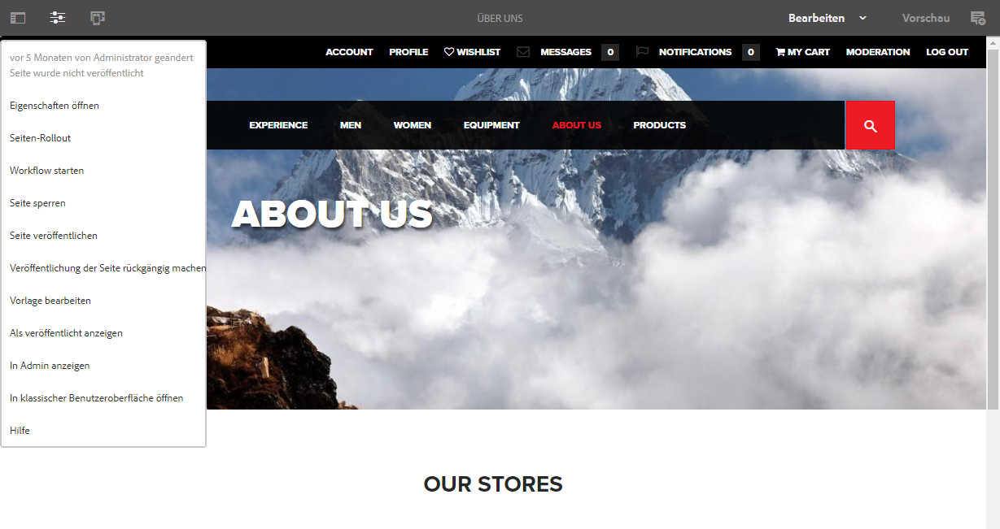

# Bearbeiter{#editor}

Standardmäßig ist die Möglichkeit, zum klassischen Benutzeroberflächen-Editor zu wechseln, deaktiviert.

Gehen Sie wie folgt vor, um im Menü **Seiteninformationen** die Option **In klassischer Benutzeroberfläche öffnen** wieder zu aktivieren.

1. Suchen Sie mithilfe von CRXDE Lite den folgenden Knoten:

   `/libs/wcm/core/content/editor/jcr:content/content/items/content/header/items/headerbar/items/pageinfopopover/items/list/items/classicui`

   Beispiel

   ` [https://localhost:4502/crx/de/index.jsp#/libs/wcm/core/content/editor/jcr%3Acontent/content/items/content/header/items/headerbar/items/pageinfopopover/items/list/items/classicui](https://localhost:4502/crx/de/index.jsp#/libs/wcm/core/content/editor/jcr%3Acontent/content/items/content/header/items/headerbar/items/pageinfopopover/items/list/items/classicui)`

1. Erstellen Sie eine Überlagerung mit der Option **Überlagerungsknoten** . Beispiel:

   * **Pfad**: `/apps/wcm/core/content/editor/jcr:content/content/items/content/header/items/headerbar/items/pageinfopopover/items/list/items/classicui`
   * **Pfad für Überlagerung**: `/apps/`
   * **Übereinstimmungstypen abgleichen**: aktiv (Kontrollkästchen aktivieren)

1. Fügen Sie die folgende Multiwert-Texteigenschaft zum überlagerten Knoten hinzu:

   `sling:hideProperties = ["granite:hidden"]`

1. Die Option **In klassischer Benutzeroberfläche öffnen** steht nun wieder beim Bearbeiten von Seiten im Menü **Seiteninformationen** zur Verfügung.

   
