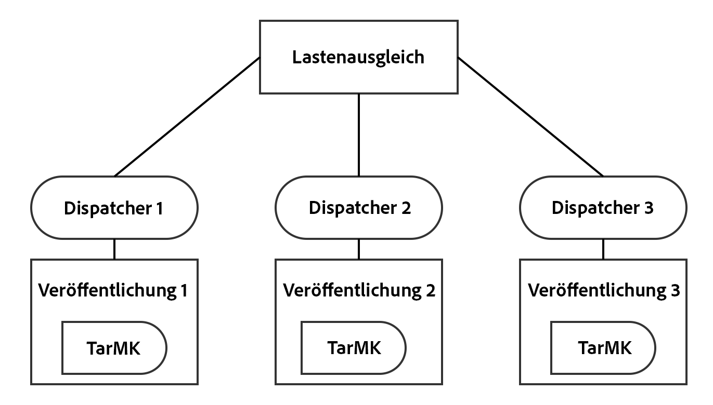
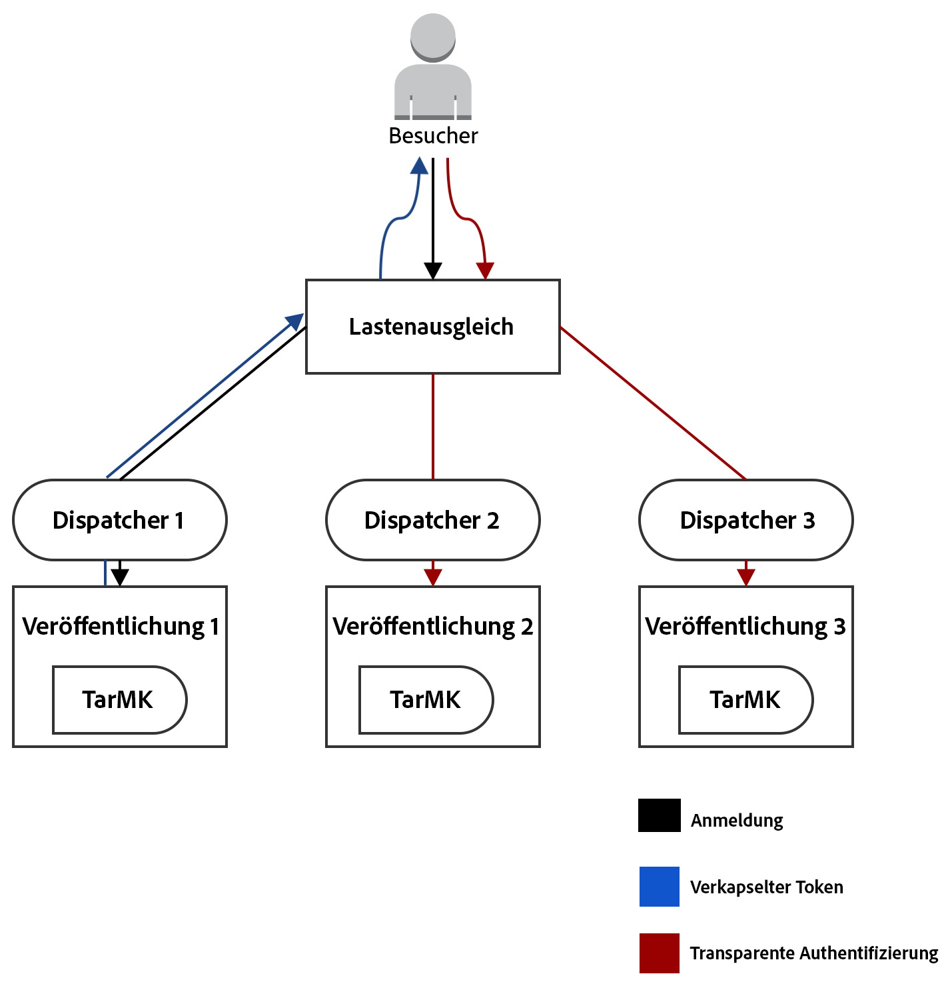
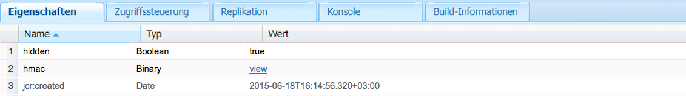

# Unterstützung von Encapsulated Tokens{#encapsulated-token-support}

## Einführung {#introduction}

Standardmäßig verwendet AEM den Token Authentication Handler, um jede Abfrage zu authentifizieren. Um Authentifizierungsabfragen verarbeiten zu können, benötigt der Token Authentication Handler jedoch bei jeder Abfrage Zugriff auf das Repository. Das liegt daran, dass Cookies zur Beibehaltung des Authentifizierungsstatus verwendet werden. Logischerweise muss der Status im Repository beibehalten werden, um nachfolgende Abfragen zu validieren. Daher ist der Authentifizierungsmechanismus „stateful“.

Dies ist für die horizontale Skalierbarkeit besonders wichtig. Bei einer Bereitstellung mit mehreren Instanzen, wie bei der unten abgebildeten Veröffentlichen-Farm, kann der Lastenausgleich nicht optimal erfolgen. Bei der „stateful“-Authentifizierung ist der beibehaltene Authentifizierungsstatus nur auf der Instanz verfügbar, auf der der Benutzer zuerst authentifiziert wird.

Nehmen wir das folgende Szenario als Beispiel:

Ein Benutzer wird auf der Veröffentlichungsinstanz 1 authentifiziert. Wenn eine nachfolgende Abfrage an die Veröffentlichungsinstanz 2 erfolgt, ist auf dieser Instanz der beibehaltene Authentifizierungsstatus nicht verfügbar, weil der Status im Repository von Veröffentlichen 1 beibehalten wurde und Veröffentlichen 2 ein eigenes Repository hat.

Die Lösung besteht darin, dauerhafte Verbindungen auf der Ebene des Load-Balancers zu konfigurieren. Mit solchen dauerhaften Verbindungen wird ein Benutzer immer zur selben Veröffentlichungsinstanz geleitet. Dadurch ist ein wirklich optimaler Lastenausgleich nicht möglich.

Wenn eine Veröffentlichungsinstanz nicht mehr verfügbar ist, gehen die Sitzungen aller auf dieser Instanz authentifizierten Benutzer verloren. Dies liegt daran, dass der Zugriff auf das Repository zur Validierung des Authentifizierungs-Cookies erforderlich ist.

## „Stateless“-Authentifizierung mit dem Encapsulated Token {#stateless-authentication-with-the-encapsulated-token}

Die Lösung für die horizontale Skalierbarkeit besteht in der „Stateless“-Authentifizierung, bei der die neue Unterstützung von Encapsulated Tokens in AEM genutzt wird.

Das Encapsulated Token ist eine Kryptografie, mit der AEM Authentifizierungsinformationen sicher offline erstellen und validieren können, ohne auf das Repository zugreifen zu müssen. So kann eine Authentifizierungsabfrage auf allen Veröffentlichungsinstanzen ohne dauerhafte Verbindung erfolgen. Außerdem bietet dieser Ansatz den Vorteil, dass die Authentifizierungsleistung verbessert wird, da nicht bei jeder Authentifizierungsabfrage ein Zugriff auf das Repository vonnöten ist.

Wie dies in einer geografisch verteilten Bereitstellung mit MongoMK-Autoren und TarMK-Veröffentlichungsinstanzen funktioniert, sehen Sie in der folgenden Grafik:

>[!NOTE]
>
>Beachten Sie, dass das Encapsulated Token zur Authentifizierung dient. Es stellt sicher, dass das Cookie validiert werden kann, ohne dass ein Zugriff auf das Repository nötig ist. Dennoch ist es erforderlich, dass der Benutzer auf allen Instanzen vorhanden ist und die unter diesem Benutzer gespeicherten Daten für jede Instanz zugänglich sind.
>
>Wenn beispielsweise ein neuer Benutzer auf der Veröffentlichungsinstanz 1 erstellt wird, wird er mit dem Encapsulated Token auf der Veröffentlichen-Instanz 2 erfolgreich authentifiziert. Wenn der Benutzer auf der zweiten Veröffentlichungsinstanz nicht vorhanden ist, ist die Abfrage dennoch nicht erfolgreich.

## Konfigurieren des Encapsulated Tokens {#configuring-the-encapsulated-token}

>[!NOTE]
>Alle Authentifizierungs-Handler, die Benutzer synchronisieren und sich auf Token-Authentifizierung (wie SAML und OAuth) verlassen, funktionieren nur mit verkapselten Token, wenn:
>
>* fixierbare Sitzungen sind aktiviert oder
>
>* Benutzer werden bereits in AEM erstellt, wenn die Synchronisierung beginnt. Dies bedeutet, dass gekapselte Token in Situationen nicht unterstützt werden, in denen die Handler **create** -Benutzer während des Synchronisierungsprozesses verwenden.

Bei der Konfiguration des Encapsulated Tokens müssen Sie einige Aspekte berücksichtigen:

1. Wegen der Verschlüsselung müssen alle Instanzen denselben HMAC-Schlüssel aufweisen. Seit AEM 6.3 werden die Schlüsseldaten nicht mehr im Repository, sondern im Dateisystem selbst gespeichert. Daher besteht die beste Möglichkeit zum Replizieren der Schlüssel darin, sie vom Dateisystem der Quellinstanz zum Dateisystem der Zielinstanz(en) zu kopieren, auf die Sie die Schlüssel replizieren möchten. Weitere Informationen dazu finden Sie unter „Replizieren des HMAC-Schlüssels“.
1. Das Encapsulated Token muss aktiviert werden. Dies ist über die Web-Konsole möglich.

### Replizieren des HMAC-Schlüssels {#replicating-the-hmac-key}

Der HMAC-Schlüssel ist als binäre Eigenschaft von `/etc/key` im Repository vorhanden. Sie können ihn separat herunterladen. Klicken Sie dazu auf den Link **Anzeigen** neben der Eigenschaft:

Um den Schlüssel auf weitere Instanzen zu replizieren, führen Sie die folgenden Schritte durch:

1. Greifen Sie auf die AEM-Instanz zu, auf der sich die zu kopierenden Schlüsseldaten befinden. In der Regel handelt es sich dabei um eine Autoreninstanz.
1. Suchen Sie im lokalen Dateisystem das Bundle `com.adobe.granite.crypto.file`. Es kann sich z. B. unter diesem Pfad befinden:

   * &lt;Autor-AEM-Installationsverzeichnis>/crx-quickstart/launchpad/felix/bundle21

   Die Datei `bundle.info` in jedem Ordner identifiziert den Bundle-Namen.

1. Navigieren Sie zum Ordner „data“. Zum Beispiel:

   * `<author-aem-install-dir>/crx-quickstart/launchpad/felix/bundle21/data`

1. Kopieren Sie die HMAC- und die Master-Dateien.
1. Navigieren Sie dann zur Zielinstanz, auf der Sie den HMAC-Schlüssel duplizieren möchten, und dann zum Ordner „data“. Zum Beispiel:

   * `<publish-aem-install-dir>/crx-quickstart/launchpad/felix/bundle21/data`

1. Fügen Sie die beiden zuvor kopierten Dateien ein.
1. [Aktualisieren Sie das Crypto-Bundle](/help/communities/deploy-communities.md#refresh-the-granite-crypto-bundle), wenn die Zielinstanz bereits ausgeführt wird.

1. Wiederholen Sie die vorherigen Schritte für alle Instanzen, auf denen Sie den Schlüssel replizieren möchten.

#### Aktivieren des Encapsulated Tokens {#enabling-the-encapsulated-token}

Wenn Sie den HMAC-Schlüssel repliziert haben, können Sie das Encapsulated Token über die Web-Konsole aktivieren:

1. Verweisen Sie Ihren Browser auf `https://serveraddress:port/system/console/configMgr`
1. Suchen Sie nach einem Eintrag namens **Adobe Granite Token Authentication Handler** und klicken Sie darauf.
1. Aktivieren Sie im daraufhin angezeigten Fenster das Kontrollkästchen **Unterstützung von Encapsulated Tokens aktivieren**. Klicken Sie dann auf **Speichern**.
