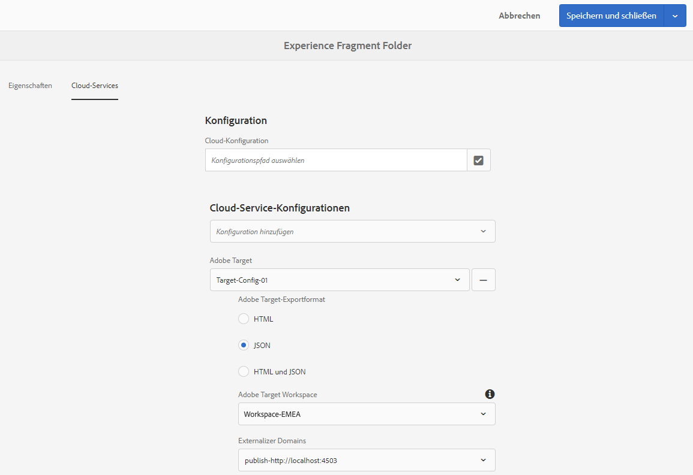

# Exportieren von Erlebnisfragmenten nach Adobe Target{#exporting-experience-fragments-to-adobe-target}

>[!CAUTION]
>
>Einige Funktionen auf dieser Seite erfordern die Anwendung von AEM 6.5.3.0.
>
>6.5.3.0
>
>* **Externalizer** Domainscan jetzt ausgewählt.
   >  **Hinweis:** Externalizer-Domänen sind nur für den Inhalt des Erlebnisfragments relevant, das an die Zielgruppe gesendet wird, und nicht für Metadaten wie Ansicht Angebot Content.
>
>
6.5.2.0:
>
>* Erlebnisfragmente können in Folgendes exportiert werden:
   >
   >   
   * der Standardarbeitsbereich.
   >   * einen benannten Arbeitsbereich, der in der Cloud-Konfiguration angegeben ist.
   >   * **Hinweis: Für das** Exportieren in bestimmte Arbeitsbereiche ist Adobe Target Premium erforderlich.
>
>* AEM muss mit Adobe I/O](/help/sites-administering/integration-ims-adobe-io.md) in Adobe Target integriert sein.[

>
>

AEM 6.5.0.0 und 6.5.1.0:
>
>* Die AEM Erlebnisfragmente werden in den Standardarbeitsbereich von Adobe Target exportiert.
>* AEM müssen gemäß den Anweisungen unter [Integration mit Adobe Target](/help/sites-administering/target.md) in Adobe Target integriert werden.

Sie können [Erlebnisfragmente](/help/sites-authoring/experience-fragments.md), die in Adobe Experience Manager (AEM) erstellt wurden, nach Adobe Target (Zielgruppe) exportieren. Diese können dann als Angebote in Target-Aktivitäten verwendet werden, um Erlebnisse in großem Maßstab zu testen und zu personalisieren.

Es gibt drei Formatoptionen für den Export eines Experience Fragments in Adobe Target:

* HTML (Standard): Unterstützung für Web- und Hybrid-Content-Versand
* JSON: Unterstützung für Versand ohne Inhalt
* HTML und JSON

AEM Erlebnisfragmente können in den Standardarbeitsbereich in Adobe Target oder in benutzerdefinierte Arbeitsbereiche für Adobe Target exportiert werden. Dies geschieht über Adobe I/O, für das AEM mit Adobe I/O](/help/sites-administering/integration-ims-adobe-io.md) in Adobe Target integriert sein müssen.[

>[!NOTE]
>
>Die Adobe Target-Arbeitsbereiche existieren nicht in Adobe Target selbst. Sie werden in Adobe IMS (Identity Management System) definiert und verwaltet und dann für die Verwendung in mehreren Lösungen mithilfe von Adobe I/O-Integrationen ausgewählt.

>[!NOTE]
>
>Adobe Target-Arbeitsbereiche können verwendet werden, um Mitgliedern einer Organisation (Gruppe) die Erstellung und Verwaltung von Angeboten und Aktivitäten nur für diese Organisation zu ermöglichen. ohne Zugriff auf andere Benutzer. Zum Beispiel länderspezifische Organisationen innerhalb eines globalen Konzerns.

>[!NOTE]
>
>Weitere Informationen unter:
>
>* [Adobe Target-Entwicklung](https://www.adobe.io/apis/experiencecloud/target.html)
>* [Hauptkomponenten - Erlebnisfragmente](https://docs.adobe.com/content/help/en/experience-manager-core-components/using/components/experience-fragment.html)

>

## Voraussetzungen {#prerequisites}

>[!CAUTION]
>
>Einige Funktionen auf dieser Seite erfordern die Anwendung von AEM 6.5.3.0.

Verschiedene Aktionen sind erforderlich:

1. Sie müssen AEM mit Adobe I/O](/help/sites-administering/integration-ims-adobe-io.md) in Adobe Target integrieren.[
2. Erlebnisfragmente werden aus der Autoreninstanz exportiert. Daher müssen Sie den AEM Link Externalizer](/help/sites-administering/target-requirements.md#configuring-the-aem-link-externalizer) in der Autoreninstanz konfigurieren, um sicherzustellen, dass alle Verweise im Erlebnisfragment für den Web-Versand extern zugeordnet werden.[

   >[!NOTE]
   >
   >Für das Neuschreiben von Links, das nicht standardmäßig erfolgt, ist der [Experience Fragment Link Rewriter Provider](/help/sites-developing/experience-fragments.md#the-experience-fragment-link-rewriter-provider-html) verfügbar. Damit können benutzerspezifische Regeln für Ihre Instanz entwickelt werden.

## hinzufügen der Cloud-Konfiguration {#add-the-cloud-configuration}

Bevor Sie ein Fragment exportieren, müssen Sie die **Cloud-Konfiguration** für **Adobe Target** zum Fragment oder Ordner hinzufügen. Dies ermöglicht Ihnen auch Folgendes:

* die für den Export zu verwendenden Formatoptionen angeben
* Zielgruppen-Arbeitsbereich als Ziel auswählen
* Auswählen einer Externalisiererdomäne zum Umschreiben von Verweisen im Erlebnisfragment (optional)

Die erforderlichen Optionen können in den **Seiteneigenschaften** des erforderlichen Ordners bzw. Fragments ausgewählt werden. Die Spezifikation wird nach Bedarf vererbt.

1. Navigieren Sie zur **Experience Fragment**-Konsole.

1. Öffnen Sie die **Seiteneigenschaften** für den entsprechenden Ordner oder das Fragment.

   >[!NOTE]
   >
   >Wenn Sie die Cloud-Konfiguration zum übergeordneten Ordner „Experience Fragment“ hinzufügen, wird die Konfiguration von allen untergeordneten Elementen geerbt.
   >
   >
   >Wenn Sie die Cloud-Konfiguration zum Experience Fragment selbst hinzufügen, wird die Konfiguration von allen Varianten geerbt.

1. Wählen Sie die Registerkarte **Cloud-Services** aus.

1. Wählen Sie unter **Cloud Service Configuration** **Adobe Target** aus der Dropdown-Liste.

   >[!NOTE]
   >
   >Das JSON-Format eines Experience Fragment-Angebots kann angepasst werden. Definieren Sie dazu eine Komponente des Kundenerlebnisfragments und erläutern Sie dann, wie die Eigenschaften im Komponenten-Sling-Modell exportiert werden.
   >
   >Siehe Kernkomponente:
   >
   >[Hauptkomponenten - Erlebnisfragmente](https://docs.adobe.com/content/help/en/experience-manager-core-components/using/components/experience-fragment.html)

   Wählen Sie unter **Adobe Target** Folgendes aus:

   * die entsprechende Konfiguration
   * die erforderliche Formatoption
   * Adobe Target Workspace
   * falls erforderlich - die Externalizer-Domäne

   >[!CAUTION]
   >
   >Die Externalizer-Domäne ist optional.
   >
   > Ein AEM Externalisierer wird konfiguriert, wenn der exportierte Inhalt auf eine bestimmte *publish*-Domäne verweisen soll. Weitere Informationen finden Sie unter [Konfigurieren des AEM Link Externalizer](/help/sites-administering/target-requirements.md#configuring-the-aem-link-externalizer).
   >
   > Beachten Sie außerdem, dass Externalizer-Domänen nur für den Inhalt des Erlebnisfragments relevant sind, das an die Zielgruppe gesendet wird, und nicht für Metadaten wie Ansicht Angebot Content.

   Beispiel für einen Ordner:

   

1. Klicken Sie auf **Speichern und schließen**.

## Exportieren eines Erlebnisfragments nach Adobe Target {#exporting-an-experience-fragment-to-adobe-target}

>[!CAUTION]
>
>Für Medienassets wie Bilder wird nur ein Verweis in Target exportiert. Das Asset selbst bleibt in AEM Assets gespeichert und wird aus der AEM-Veröffentlichungsinstanz bereitgestellt.
>
>Daher muss das Experience Fragment mit allen zugehörigen Assets veröffentlicht werden, bevor es in Target exportiert wird.

So exportieren Sie ein Experience Fragment von AEM nach Target (nach dem Angeben der Cloud-Konfiguration):

1. Navigieren Sie zur Experience Fragment-Konsole.
1. Wählen Sie das Experience Fragment, das Sie als Ziel exportieren möchten.

   >[!NOTE]
   >
   >Es muss eine Web-Variante des Experience Fragments sein.

1. Tippen/klicken Sie auf **Nach Adobe Target exportieren**.

   >[!NOTE]
   >
   >Wenn das Experience Fragment bereits exportiert wurde, wählen Sie **In Adobe Target aktualisieren**.

1. Tippen/klicken Sie auf **Exportieren, ohne veröffentlichen** bzw. auf **Veröffentlichen**.

   >[!NOTE]
   >
   >Wenn Sie **Veröffentlichen** auswählen, wird das Experience Fragment sofort veröffentlicht und an Target gesendet.

1. Tippen/klicken Sie im Bestätigungsdialogfeld auf **OK**.

   Ihr Experience Fragment sollte jetzt in Target enthalten sein.

   >[!NOTE]
   >
   >In der [Listenansicht](/help/sites-authoring/experience-fragments.md#details-of-your-experience-fragment) der Konsole und in den **Eigenschaften** werden **verschiedene Details** des Exports angezeigt.

   >[!NOTE]
   >
   >Beim Anzeigen eines Experience Fragments in Adobe Target gibt das *Datum der letzten Änderung* an, wann das Fragment zuletzt in AEM geändert wurde. Es ist nicht das Datum, an dem das Fragment zuletzt in Adobe Target exportiert wurde.

>[!NOTE]
>
>Alternativ können Sie den Export aus dem Seiteneditor mithilfe ähnlicher Befehle im Menü [Seiteninformationen](/help/sites-authoring/author-environment-tools.md#page-information) durchführen.

## Verwenden Ihrer Erlebnisfragmente in Adobe Target {#using-your-experience-fragments-in-adobe-target}

Nach Durchführung der vorherigen Aufgaben wird das Erlebnisfragment auf der Seite &quot;Angebot&quot;in der Zielgruppe angezeigt. In der [entsprechenden Target-Dokumentation](https://experiencecloud.adobe.com/resources/help/de_DE/target/target/aem-experience-fragments.html) erfahren Sie, was Sie dort erreichen können.

>[!NOTE]
>
>Beim Anzeigen eines Experience Fragments in Adobe Target gibt das *Datum der letzten Änderung* an, wann das Fragment zuletzt in AEM geändert wurde. Es ist nicht das Datum, an dem das Fragment zuletzt in Adobe Target exportiert wurde.

## Löschen eines bereits nach Adobe Target exportierten Erlebnisfragments {#deleting-an-experience-fragment-already-exported-to-adobe-target}

Das Löschen eines Experience Fragments, das bereits nach Target exportiert wurde, kann zu Problemen führen, wenn das Fragment bereits in einem Angebot in Target verwendet wird. Durch das Löschen des Fragments ist das Angebot nicht mehr verwendbar, da der Fragmentinhalt von AEM bereitgestellt wird.

So vermeiden Sie solche Situationen:

* Wenn das Experience Fragment derzeit nicht in einer Aktivität verwendet wird, kann der Benutzer das Fragment ohne Warnmeldung in AEM löschen.
* Wenn das Experience Fragment derzeit von einer Aktivität in Target verwendet wird, warnt eine Fehlermeldung den AEM-Benutzer vor möglichen Konsequenzen, die das Löschen des Fragments für die Aktivität nach sich zieht.

   Die Fehlermeldung in AEM verbietet dem Benutzer nicht das (erzwungene) Löschen des Experience Fragments. Wenn das Erlebnisfragment gelöscht wird:

   * Das Angebot Zielgruppe mit AEM Erlebnisfragment zeigt möglicherweise unerwünschtes Verhalten

      * Das Angebot wird wahrscheinlich weiterhin gerendert, da der Erlebnisfragment-HTML in die Zielgruppe verschoben wurde
      * Verweise im Erlebnisfragment funktionieren möglicherweise nicht ordnungsgemäß, wenn referenzierte Assets auch in AEM gelöscht wurden.
   * Selbstverständlich sind keine weiteren Änderungen am Erlebnisfragment möglich, da das Erlebnisfragment nicht mehr in AEM existiert.