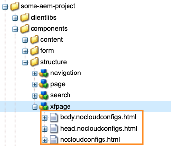
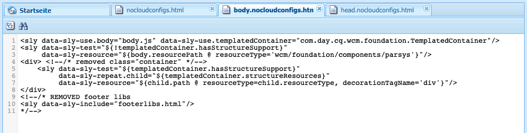
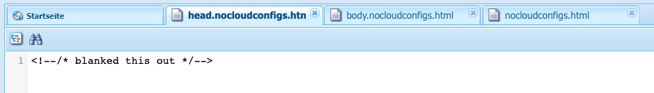
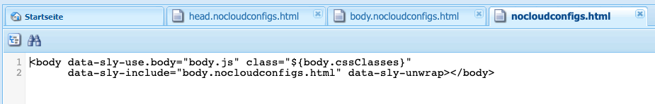

# Exportieren von Experience Fragments nach Adobe Target {#exporting-experience-fragments-to-adobe-target}

>[!CAUTION]
>
>Einige Funktionen auf dieser Seite erfordern die Anwendung von AEM 6.5.3.0 (oder höher).
>
>6.5.3.0:
>
>* **Externalizer-Domains** können jetzt ausgewählt werden.
>  **Hinweis:** Externalizer-Domänen sind nur für den Inhalt des Experience Fragment relevant, das an Target gesendet wird, und nicht für Metadaten wie Angebotsinhalt anzeigen.
>
>6.5.2.0:
>
>* Experience Fragments können in Folgendes exportiert werden:
>
>   * den Standardarbeitsbereich
>   * einen benannten Arbeitsbereich, der in der Cloud-Konfiguration angegeben ist.
>   * **Hinweis:** Für den Export in bestimmte Arbeitsbereiche ist Adobe Target Premium erforderlich.
>
>* AEM muss [mit Adobe Target über IMS integriert](/help/sites-administering/integration-target-ims.md) sein.
>
>AEM 6.5.0.0 und 6.5.1.0:
>
>* Die AEM Experience Fragments werden in den Standardarbeitsbereich von Adobe Target exportiert.
>* AEM muss gemäß den Anweisungen unter [Integration mit Adobe Target](/help/sites-administering/target.md) mit Adobe Target integriert werden.

Sie können [Experience Fragments](/help/sites-authoring/experience-fragments.md), die in Adobe Experience Manager (AEM) erstellt wurden, nach Adobe Target (Target) exportieren. Sie können dann als Angebote in Target-Aktivitäten verwendet werden, um Erlebnisse bedarfsgerecht zu testen und zu personalisieren.

Es gibt drei Formatoptionen für den Export eines Experience Fragments in Adobe Target:

* HTML (Standard): Unterstützung der Bereitstellung von Web- und Hybridinhalten
* JSON: Unterstützung der Headless-Inhaltsbereitstellung
* HTML und JSON

AEM Experience Fragments können in den Standardarbeitsbereich in Adobe Target oder in benutzerdefinierte Arbeitsbereiche für Adobe Target exportiert werden. Dies erfolgt über die Adobe Developer Console, für die AEM [mit Adobe Target über IMS integriert](/help/sites-administering/integration-target-ims.md) sein muss.

>[!NOTE]
>
>Die Adobe Target-Arbeitsbereiche sind nicht in Adobe Target selbst vorhanden. Sie werden in Adobe IMS (Identity Management System) definiert und verwaltet und dann zur lösungsübergreifenden Verwendung mithilfe der Adobe Developer Console ausgewählt.

>[!NOTE]
>
>Adobe Target-Arbeitsbereiche können verwendet werden, um es Mitgliedern einer Organisation (Gruppe) zu ermöglichen, Angebote und Aktivitäten nur für diese Organisation zu erstellen und zu verwalten, ohne anderen Benutzern Zugriff zu gewähren. Zum Beispiel länderspezifische Organisationen innerhalb eines globalen Konzerns.

>[!NOTE]
>
>Weitere Informationen finden Sie auch unter:
>
>* [Adobe Target-Entwicklung](https://developers.adobetarget.com/)
>* [Kernkomponenten – Experience Fragments](https://experienceleague.adobe.com/docs/experience-manager-core-components/using/wcm-components/experience-fragment.html)
>

## Voraussetzungen {#prerequisites}

>[!CAUTION]
>
>Einige Funktionen auf dieser Seite erfordern die Anwendung von AEM 6.5.3.0.

Verschiedene Aktionen sind erforderlich:

1. Sie müssen [AEM mit Adobe Target über IMS integrieren](/help/sites-administering/integration-target-ims.md).
2. Experience Fragments werden aus der AEM-Autoreninstanz exportiert. Daher müssen Sie [Konfigurieren von AEM Link Externalizer](/help/sites-administering/target-requirements.md#configuring-the-aem-link-externalizer) auf der Autoreninstanz, um sicherzustellen, dass alle Verweise im Experience Fragment für die Webbereitstellung externalisiert werden.

   >[!NOTE]
   >
   >Für das Umschreiben von Links, die nicht von der Standardeinstellung abgedeckt werden, ist der [Experience Fragment Link Rewriter Provider](/help/sites-developing/experience-fragments.md#the-experience-fragment-link-rewriter-provider-html) verfügbar. Dadurch können für Ihre Instanz benutzerdefinierte Regeln entwickelt werden.

## Hinzufügen der Cloud-Konfiguration {#add-the-cloud-configuration}

Bevor Sie ein Fragment exportieren, müssen Sie die **Cloud-Konfiguration** für **Adobe Target** in das Fragment oder den Ordner. Dies ermöglicht Ihnen auch:

* die für den Export zu verwendenden Formatoptionen angeben
* einen Target-Arbeitsbereich als Ziel auszuwählen
* eine Externalizer-Domäne für das Neuschreiben von Verweisen im Experience Fragment auswählen (optional)

Die erforderlichen Optionen können in den **Seiteneigenschaften** des erforderlichen Ordners bzw. Fragments ausgewählt werden. Die Spezifikation wird nach Bedarf vererbt.

1. Navigieren Sie zur **Experience Fragment**-Konsole.

1. Öffnen Sie die **Seiteneigenschaften** für den entsprechenden Ordner oder das Fragment.

   >[!NOTE]
   >
   >Wenn Sie die Cloud-Konfiguration zum übergeordneten Ordner des Experience Fragments hinzufügen, wird die Konfiguration von allen untergeordneten Elementen geerbt.
   >
   >
   >Wenn Sie die Cloud-Konfiguration zum Experience Fragment selbst hinzufügen, wird die Konfiguration von allen Varianten übernommen.

1. Wählen Sie die Registerkarte **Cloud-Services** aus.

1. Wählen Sie unter **Cloud Service-Konfiguration** in der Dropdown-Liste den Eintrag **Adobe Target**.

   >[!NOTE]
   >
   >Das JSON-Format eines Experience Fragment-Angebots kann angepasst werden. Definieren Sie dazu eine Customer Experience Fragment-Komponente und kommentieren Sie dann, wie die Eigenschaften im Komponenten-Sling-Modell exportiert werden.
   >
   >Beachten Sie die Kernkomponente:
   >
   >[Kernkomponenten – Experience Fragments](https://experienceleague.adobe.com/docs/experience-manager-core-components/using/wcm-components/experience-fragment.html)

   Wählen Sie unter **Adobe Target** Folgendes aus:

   * die passende Konfiguration
   * die Option für das erforderliche Format
   * einen Adobe Target-Arbeitsbereich
   * bei Bedarf - die Externalizer-Domäne

   >[!CAUTION]
   >
   >Die Externalizer-Domäne ist optional.
   >
   >Ein AEM Externalizer wird konfiguriert, wenn der exportierte Inhalt auf einen bestimmten *publish* Domäne. Weitere Informationen finden Sie unter [Konfigurieren des AEM Link Externalizer](/help/sites-administering/target-requirements.md#configuring-the-aem-link-externalizer).
   >
   >Beachten Sie außerdem, dass Externalizer-Domains nur für den Inhalt des Experience Fragments, das an Target gesendet wird, relevant sind und nicht Metadaten wie Inhalte zum Anzeigen von Angeboten.

   Zum Beispiel für einen Ordner:

   

1. **Speichern und schließen**.

## Ein Experience Fragment nach Adobe Target exportieren {#exporting-an-experience-fragment-to-adobe-target}

>[!CAUTION]
>
>Für Medien-Assets wie Bilder wird nur ein Verweis nach Target exportiert. Das Asset selbst bleibt in AEM Assets gespeichert und wird von der AEM-Veröffentlichungsinstanz bereitgestellt.
>
>Daher muss das Experience Fragment mit allen zugehörigen Assets vor dem Export in Target veröffentlicht werden.

So exportieren Sie ein Experience Fragment aus AEM in Target (nach Angabe der Cloud-Konfiguration):

1. Navigieren Sie zur Experience Fragment-Konsole.
1. Wählen Sie das Experience Fragment aus, das Sie in nach Target exportieren möchten.

   >[!NOTE]
   >
   >Es muss sich um eine Experience Fragment Web-Variante handeln.

1. Klicks **Exportieren in Adobe Target**.

   >[!NOTE]
   >
   >Wenn das Experience Fragment bereits exportiert wurde, wählen Sie **In Adobe Target aktualisieren**.

1. Klicks **Exportieren ohne Veröffentlichung** oder **Veröffentlichen** nach Bedarf.

   >[!NOTE]
   >
   >Auswählen **Veröffentlichen** veröffentlicht das Experience Fragment sofort und sendet es an Target.

1. Klicks **OK** im Bestätigungsdialogfeld.

   Ihr Experience Fragment sollte sich jetzt in Target befinden.

   >[!NOTE]
   >
   >In der [Listenansicht](/help/sites-authoring/experience-fragments.md#details-of-your-experience-fragment) der Konsole und in den **Eigenschaften** werden **verschiedene Details** des Exports angezeigt.

   >[!NOTE]
   >
   >Beim Anzeigen eines Experience Fragments in Adobe Target gibt *Zuletzt geändert* an, wann das Fragment zuletzt in AEM geändert wurde. Es ist nicht das Datum, an dem das Fragment zuletzt in Adobe Target exportiert wurde.

>[!NOTE]
>
>Alternativ können Sie den Export auch über den Seiteneditor durchführen, indem Sie vergleichbare Befehle im Menü [Seiteninformationen](/help/sites-authoring/author-environment-tools.md#page-information) verwenden.

## Ihre Experience Fragments in Adobe Target verwenden {#using-your-experience-fragments-in-adobe-target}

Nach dem Ausführen der vorherigen Aufgaben wird das Experience Fragment auf der Angebotsseite in Adobe Target angezeigt. Sehen Sie sich die [spezifische Target-Dokumentation](https://experienceleague.adobe.com/docs/target/using/experiences/offers/aem-experience-fragments.html?lang=de) um zu erfahren, was man dort erreichen kann.

>[!NOTE]
>
>Beim Anzeigen eines Experience Fragments in Adobe Target gibt *Zuletzt geändert* an, wann das Fragment zuletzt in AEM geändert wurde. Es ist nicht das Datum, an dem das Fragment zuletzt in Adobe Target exportiert wurde.

## Löschen eines bereits nach Adobe Target exportierten Experience Fragments {#deleting-an-experience-fragment-already-exported-to-adobe-target}

Das Löschen eines Experience Fragment, das bereits in Target exportiert wurde, kann Probleme verursachen, wenn das Fragment bereits in einem Angebot in Adobe Target verwendet wird. Durch das Löschen des Fragments wird das Angebot unbrauchbar, da der Fragmentinhalt von AEM bereitgestellt wird.

So vermeiden Sie solche Situationen:

* Wenn das Experience Fragment derzeit nicht in einer Aktivität verwendet wird, ermöglicht AEM es den Benutzenden, das Fragment ohne Warnmeldung zu löschen.
* Wenn das Experience Fragment von einer Aktivität in Adobe Target verwendet wird, wird der AEM in einer Fehlermeldung über die möglichen Auswirkungen des Löschens des Fragments auf die Aktivität gewarnt.

  Die Fehlermeldung in AEM untersagt den Benutzenden nicht das (erzwungene) Löschen des Experience Fragments. Wenn das Experience Fragment gelöscht wurde, gilt Folgendes:

   * Das Target-Angebot mit dem AEM Experience Fragment kann unerwünschtes Verhalten zeigen

      * Das Angebot wird wahrscheinlich noch gerendert, da das Experience Fragment-HTML nach Target verschoben wurde
      * Verweise im Experience Fragment funktionieren möglicherweise nicht ordnungsgemäß, wenn referenzierte Assets auch in AEM gelöscht wurden.

   * Weitere Änderungen am Experience Fragment sind nicht möglich, da das Experience Fragment nicht mehr in AEM vorhanden ist.


## Entfernen von ClientLibs aus nach Target exportierten Experience Fragments {#removing-clientlibs-from-fragments-exported-target}

Experience Fragments enthalten vollständige HTML-Tags und alle erforderlichen Client-Bibliotheken (CSS/JS), um das Fragment genau so wiederzugeben, wie es vom Experience Fragment-Inhaltsautor erstellt wurde. Dies ist beabsichtigt.

Wenn Sie ein Experience Fragment-Angebot mit Adobe Target auf einer Seite verwenden, die von AEM bereitgestellt wird, enthält die Zielseite bereits alle erforderlichen Client-Bibliotheken. Außerdem wird das überflüssige HTML im Experience Fragment-Angebot ebenfalls nicht benötigt (siehe [Überlegungen](#considerations)).

Im Folgenden finden Sie ein Pseudobeispiel für HTML in einem Experience Fragment-Angebot:

```html
<!DOCTYPE>
<html>
   <head>
      <title>…</title>
      <!-- all the client libraries (css/js) -->
      …
   </head>
   <body>
        <!--/* Actual XF Offer content would appear here... */-->
   </body>
</html>
```

Auf hoher Ebene werden beim AEM eines Experience Fragment nach Adobe Target mehrere zusätzliche Sling-Selektoren verwendet. Beispielsweise könnte die URL für das exportierte Experience Fragment wie folgt aussehen (beachten Sie `nocloudconfigs.atoffer`):

* http://www.your-aem-instance.com/content/experience-fragments/my-offers/my-xf-offer.nocloudconfigs.atoffer.html

Die `nocloudconfigs` Der Selektor wird mithilfe von HTL definiert und kann durch Kopieren aus folgenden Quellen überlagert werden:

* /libs/cq/experience-fragments/components/xfpage/nocloudconfigs.html

Die `atoffer` Selektor wird nach der Verarbeitung mit [Sling Rewriter](/help/sites-developing/experience-fragments.md#the-experience-fragment-link-rewriter-provider-html). Beide können verwendet werden, um die Client-Bibliotheken zu entfernen.

### Beispiel {#example}

Lassen Sie uns für diesen Zweck veranschaulichen, wie dies mit `nocloudconfigs`.

>[!NOTE]
>
>Siehe [Bearbeitbare Vorlagen](/help/sites-developing/templates.md#editable-templates) für weitere Informationen.

#### Überlagerungen {#overlays}

In diesem Beispiel werden die [Überlagerungen](/help/sites-developing/overlays.md) eingefügt, um die Client-Bibliotheken *und* die überflüssige HTML zu entfernen. Es wird davon ausgegangen, dass Sie den Experience Fragment-Vorlagentyp bereits erstellt haben. Die erforderlichen Dateien, aus denen kopiert werden muss `/libs/cq/experience-fragments/components/xfpage/` include:

* `nocloudconfigs.html`
* `head.nocloudconfigs.html`
* `body.nocloudconfigs.html`

#### Überlagerungen vom Vorlagentyp {#template-type-overlays}

Im Rahmen dieses Beispiels sehen Sie die folgende Struktur:



Diese Dateien enthalten folgende Inhalte:

* `body.nocloudconfigs.html`

  

* `head.nocloudconfigs.html`

  

* `nocloudconfigs.html`

  

>[!NOTE]
>
>Verwendung `data-sly-unwrap` um das Body-Tag zu entfernen, müssen Sie `nocloudconfigs.html`.

### Überlegungen {#considerations}

Wenn Sie mit Experience Fragment-Angeboten in Adobe Target sowohl AEM als auch Nicht-AEM-Sites unterstützen müssen, müssen Sie zwei Experience Fragments (zwei verschiedene Vorlagentypen) erstellen:

* Eins mit der Überlagerung zum Entfernen von clientlibs/extra HTML

* Eins, das nicht über die Überlagerung verfügt und daher die erforderlichen clientlibs enthält