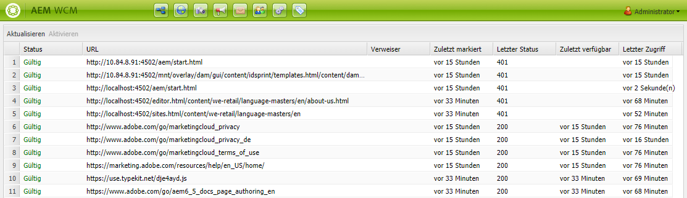

# Der Prüfer für externe Links{#the-external-link-checker}

Ein Prüfer für externe Links wird mit AEM bereitgestellt. Der Link-Prüfer:

* scannt alle Inhaltsseiten
* generiert eine Liste aller gültigen und ungültigen Links
* markiert ungültige Links direkt auf der betroffenen Inhaltsseite als kaputt

## Überprüfen externer Links {#how-to-validate-external-links}

So verwenden Sie den Prüfer für externe Links:

1. Wählen Sie über die **** Navigation den Eintrag **Tools** und dann **Sites** aus.
1. Wählen Sie **Prüfer für externe Links**. Eine Liste aller externen Links wird erstellt.
1. Um einen bestimmten Link zu überprüfen, wählen Sie ihn aus der Liste aus und klicken Sie auf **Überprüfen**:

   

   Angezeigte Informationen:

   * **Status** des Links
   * **URL**
   * **Referrer**
   * Zeit seit der **letzten Überprüfung** des Links
   * Der **zuletzt zurückgegebene Status**

   * Zeit seit der **letzten Verfügbarkeit** des Links
   * Zeit seit dem **letzten Zugriff** auf den Link

1. Auf den einzelnen Inhaltsseiten werden ungültige Links als kaputt angezeigt:

   