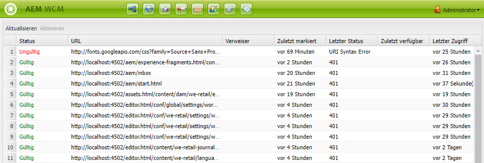

# Link Checker {#the-link-checker}

Inhaltsautoren sollten sich nicht mit der Validierung aller Links befassen müssen, die sie in ihre Inhaltsseiten aufnehmen.

Der Link Checker wird automatisch ausgeführt, um Autoren von Inhalten bei ihren Links zu unterstützen, darunter:

* Validieren von Links beim Hinzufügen zu Inhalten
* Liste aller externen Links im Inhalt anzeigen
* Linktransformationen durchführen

Der Link-Checker verfügt über eine Reihe von [Konfigurationsoptionen](#configuring), wie z. B. das Definieren der internen Validierung, das Auslassen bestimmter Links oder Link-Patter aus der Validierung und das Neuschreiben von Linkumschreibungsregeln.

Der Link-Checker validiert sowohl [interne Links](#internal) als auch [externe Links.](#external)

>[!NOTE]
>
>Da der Link-Checker die Links jeder Inhaltsseite überprüft, kann der Link-Checker die Leistung bei großen Repositorys beeinträchtigen. In solchen Fällen müssen Sie möglicherweise [konfigurieren, wie oft der Link-Checker ausgeführt wird](#configuring) oder [deaktivieren.](#disabling)

## Prüfung interner Links {#internal}

Interne Links sind Links zu anderen Inhalten in Ihrem AEM-Repository. Interne Links können mit der Pfadauswahl des RTE oder mithilfe einer benutzerdefinierten Komponente hinzugefügt werden. Beispiel:

* Ihre Seite `/content/wknd/us/en/adventures/ski-touring.html`
* Enthält einen Link zu `/content/wknd/us/en/adventures/extreme-ironing.html` in einer [Textkomponente.](https://experienceleague.adobe.com/docs/experience-manager-core-components/using/components/text.html)

Interne Links werden validiert, sobald der Inhaltsautor interne Links zu einer Seite hinzufügt. Wenn der Link ungültig wird:

* Es wird aus dem Herausgeber entfernt. Der Text des Links bleibt erhalten, der Link selbst wird jedoch entfernt.
* Er wird in der Authoring-Oberfläche als defekter Link angezeigt.

## Überprüfung externer Links {#external}

Externe Links sind Links zu Inhalten außerhalb Ihres AEM-Repositorys. Externe Links können über den RTE oder eine benutzerdefinierte Komponente hinzugefügt werden. Beispiel:

* Ihre Seite `/content/wknd/us/en/adventures/ski-touring.html`
* Enthält einen Link zu `https://bunwarmerthermalunderwear.com` in einer [Textkomponente.](https://experienceleague.adobe.com/docs/experience-manager-core-components/using/components/text.html)

Externe Links werden auf Syntax und Verfügbarkeit überprüft. Diese Prüfung wird asynchron in einem konfigurierbaren internen Modus durchgeführt. Wenn der Link-Checker einen externen Link ungültig findet:

* Es wird aus dem Herausgeber entfernt. Der Text des Links bleibt erhalten, der Link selbst wird jedoch entfernt.
* Er wird in der Authoring-Oberfläche als defekter Link angezeigt.

Darüber hinaus bietet die Oberfläche [Checker für externe Links](#external-link-checker) einen Überblick über alle externen Links auf Ihren Inhaltsseiten.

### Verwenden des Checkers für externe Links {#external-link-checker}

So verwenden Sie den Prüfer für externe Links:

1. Wählen Sie über die **** Navigation den Eintrag **Tools** und dann **Sites** aus.
1. Wählen Sie **Checker für externe Links** und es wird eine Liste aller externen Links angezeigt.

Die folgenden Informationen werden angezeigt:

* **Status**  - Der Validierungsstatus des Links, der einer der folgenden sein kann:
   * **Gültig**  - Der externe Link ist über den Link-Checker erreichbar.
   * **Ausstehend**  - Der externe Link wurde dem Site-Inhalt hinzugefügt, wurde jedoch noch nicht vom Link-Checker validiert
   * **Ungültig**  - Der externe Link kann vom Link-Checker nicht erreicht werden.
* **URL**  - Der externe Link
* **Referrer**  - Die Inhaltsseite, die den externen Link enthält
   * Dieser Wert wird nur mit [ausgefüllt, wenn konfiguriert.](#configuring)
* **Zuletzt überprüft**  - Das letzte Mal, dass der Link Checker den externen Link validiert hat
   * Wie oft Links überprüft werden [ist konfigurierbar.](#configuring)
* **Letzter Status**  - Der letzte HTML-Statuscode, der zurückgegeben wird, wenn der Link überprüft den externen Link zuletzt überprüft hat.
* **Zuletzt verfügbar**  - Zeit, seit der der Link zuletzt für den Link-Checker verfügbar war
* **Zuletzt aufgerufen**  - Zeit, seit der zuletzt auf die Seite mit dem externen Link in der Authoring-Oberfläche zugegriffen wurde

Sie können den Inhalt des Fensters mithilfe der beiden Schaltflächen oben in der Liste der Links bearbeiten:

* **Aktualisieren**  - Zum Aktualisieren des Listeninhalts
* **Aktivieren**  - So überprüfen Sie einen einzelnen externen Link, der in der Liste ausgewählt ist

### Funktionsweise des Checkers für externe Links {#how-it-works}

Der Checker für externe Links ist zwar einfach zu verwenden, stützt sich aber auf eine Reihe von Diensten und bietet Ihnen ein besseres Verständnis dafür, wie Sie [den Link-Checker](#configuring) entsprechend Ihren Anforderungen konfigurieren können.

1. Wenn ein Inhaltsautor einen Link zu einer Seite speichert, wird ein Ereignis-Handler ausgelöst.
1. Der Ereignishandler durchläuft alle Inhalte unter `/content` und sucht nach neuen oder aktualisierten Links und fügt sie einem Cache für den Link-Checker hinzu.
1. Der **Day CQ Link Checker Service** wird dann regelmäßig ausgeführt, um die Einträge im Cache auf gültige Syntax zu überprüfen.
1. Die syntax-validierten Links werden dann im Fenster [Checker für externe Links](#external-link-checker) angezeigt. Sie befinden sich jedoch im Status **Ausstehend**.
1. Die **Day CQ Link Checker-Aufgabe** wird dann regelmäßig ausgeführt, um die Links durch einen GET-Aufruf zu validieren.
1. Die **Day CQ Link Checker Task** aktualisiert dann die Einträge im Fenster &quot;Checker für externe Links&quot;mit den Ergebnissen der GET-Aufrufe.

## Konfigurieren des Link-Checkers {#configuring}

Der Link-Checker ist in AEM automatisch standardmäßig verfügbar. Es gibt jedoch eine Reihe von OSGi-Konfigurationen, die geändert werden können, um ihr Verhalten zu ändern:

* **Day CQ Link Checker Info Storage Service**  - Dieser Dienst definiert die Größe des Link Checker-Cache im Repository.
* **Day CQ Link Checker Service**  - Dieser Dienst führt eine asynchrone Überprüfung der Syntax externer Links durch. Sie können den Prüfzeitraum festlegen und festlegen, welche Links vom Prüfer unter anderem übersprungen werden.
* **Day CQ Link Checker Task**  - Dieser Dienst führt die GET Validierung externer Links durch. Es ermöglicht separate Definitionen von Intervallen, um fehlerhafte und gute Verknüpfungen unter anderen Optionen zu überprüfen.
* **Day CQ Link Checker Transformer**  - Ermöglicht das Konvertieren von Links basierend auf einem benutzerdefinierten Regelsatz.

Weitere Informationen zum Ändern der OSGi-Einstellungen finden Sie im Dokument [OSGi-Konfigurationseinstellungen](/help/sites-deploying/osgi-configuration-settings.md) .

## Deaktivieren des Link-Checkers {#disabling}

Sie können den Link Checker vollständig deaktivieren. Gehen Sie dazu wie folgt vor:

1. Öffnen Sie die OSGi-Konsole.
1. Bearbeiten Sie den **Day CQ Link Checker Transformer**
1. Aktivieren Sie die Option(en), die Sie deaktivieren möchten:
   * **Überprüfung deaktivieren**  - Zum Deaktivieren der Überprüfung von Links
   * **Umschreiben deaktivieren**  - zur Deaktivierung von Linktransformationen

>[!NOTE]
>
>Wenn Sie die Linküberprüfung deaktivieren, nachdem Sie mit der Erstellung des Inhalts begonnen haben, werden möglicherweise weiterhin Einträge im Fenster [Checker für externe Links](#external-link-checker) angezeigt, sie werden jedoch nicht mehr aktualisiert.
