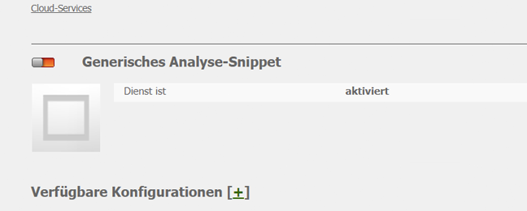
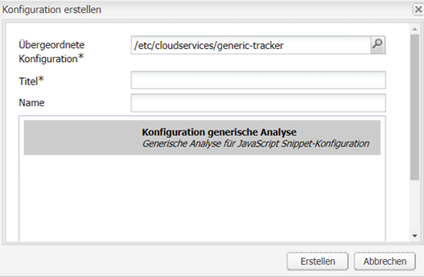
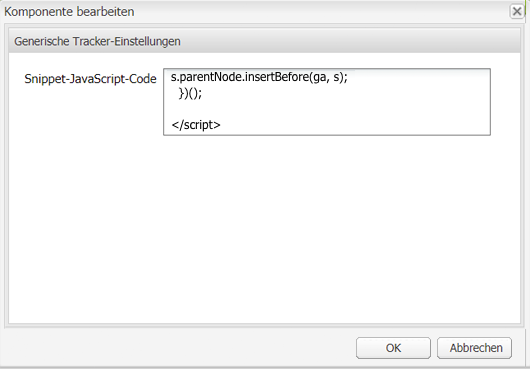
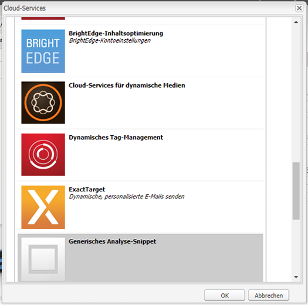
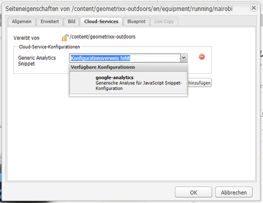

# Analyse mit externen Anbietern {#analytics-with-external-providers}

Analysen können Ihnen wichtige und interessante Informationen darüber liefern, wie Ihre Website verwendet wird.

Verschiedene vordefinierte Konfigurationen stehen Ihnen zur Integration in den entsprechenden Dienst zur Verfügung, zum Beispiel:

* [Adobe Analytics](/help/sites-administering/adobeanalytics.md)
* [Adobe Target](/help/sites-administering/target.md)

Sie können auch Ihre eigene Instanz der **generischen Analyse-Snippets** konfigurieren, um eine neue Dienstkonfiguration zu definieren.

Die Informationen werden dann mithilfe von kleinen Code-Fragmenten erfasst, die den Web-Seiten hinzugefügt werden. Zum Beispiel:

>[!CAUTION]
>
>Schließen Sie Skripte nicht in `script`-Tags ein.

```
var _gaq = _gaq || [];
_gaq.push(['_setAccount', 'UA-XXXXX-X']);
_gaq.push(['_trackPageview']);

(function() {
    var ga = document.createElement('script'); ga.type = 'text/javascript'; ga.async = true;
    ga.src = ('https:' == document.location.protocol ? 'https://ssl' : 'https://www') + '.google-analytics.com/ga.js';
    var s = document.getElementsByTagName('script')[0]; s.parentNode.insertBefore(ga, s);
})();
```

Diese Fragmente ermöglichen die Erfassung von Daten und die Generierung von Berichten. Welche Daten tatsächlich erfasst werden, hängt vom Anbieter und dem tatsächlich verwendeten Code-Fragment ab. Beispielstatistiken beinhalten Folgendes:

* Anzahl der Besucher in einem bestimmten Zeitraum
* Anzahl der besuchten Seiten
* Verwendete Suchbegriffe
* Landingpages

>[!CAUTION]
>
>Die Demo-Site von Geometrixx-Outdoors ist so konfiguriert, dass die in den Seiteneigenschaften bereitgestellten Attribute dem HTML-Quell-Code (direkt über dem `</html>`-End-Tag) im entsprechenden `js`-Skript angehängt werden.
>
>Wenn der eigene Ordner `/apps` nicht von der Standardseitenkomponente (`/libs/foundation/components/page`) übernommen wird, müssen Sie (oder Ihre Entwickelnden) sicherstellen, dass die entsprechenden `js`-Skripte enthalten sind, z. B. indem Sie `cq/cloudserviceconfigs/components/servicescomponents` einschließen oder einen ähnlichen Mechanismus verwenden.
>
>Ohne diese Skripte funktioniert keiner der Dienste (generisch, Analytics, Target usw.).

## Erstellen eines Dienstes mit einem generischen Snippet {#creating-a-new-service-with-a-generic-snippet}

Für die Grundkonfiguration:

1. Öffnen Sie die **Tools-Konsole**.
1. Erweitern Sie im linken Bereich die Option **Cloud-Dienst-Konfigurationen**.
1. Doppelklicken Sie auf **Generisches Analyse-Snippet**, um die Seite zu öffnen:

   

1. Klicken Sie auf „+“, um eine neue Konfiguration über das Dialogfeld hinzuzufügen. Weisen Sie zumindest einen Namen zu, z. B. Google Analytics:

   

1. Klicken Sie auf **Erstellen**, woraufhin sofort das Fragmentdialogfeld geöffnet wird, und fügen Sie das entsprechende Javascript-Fragment in dieses Feld ein.

   

1. Klicken Sie zum Speichern auf **OK**.

## Verwenden des neuen Dienstes auf Seiten {#using-your-new-service-on-pages}

Nach der Erstellung der Dienstkonfiguration müssen Sie nun die erforderlichen Seiten konfigurieren, um sie zu nutzen:

1. Navigieren Sie zu der Seite.
1. Öffnen Sie die **Seiteneigenschaften** im Sidekick und wählen Sie dann die Registerkarte **Cloud-Services** aus.
1. Klicken Sie auf **Dienst hinzufügen** und wählen Sie dann den gewünschten Dienst aus. Zum Beispiel das **generische Analyse-Snippet**:

   

1. Klicken Sie zum Speichern auf **OK**.
1. Sie werden zur Registerkarte **Cloud-Dienste** zurückgeleitet. Das **generische Analyse-Snippet** wird nun mit der Meldung `Configuration reference missing` angezeigt. Wählen Sie in der Dropdown-Liste die spezifische Dienstinstanz aus. Zum Beispiel google-analytics:

   

1. Klicken Sie zum Speichern auf **OK**.

   Das Fragment wird nun angezeigt, wenn Sie die Seitenquelle für die Seite anzeigen.

   Nach Ablauf einer gewissen Zeit können Sie die gesammelten Statistiken anzeigen.

   >[!NOTE]
   >
   >Wenn die Konfiguration an eine Seite mit untergeordneten Seiten angehängt wird, wird der Dienst von diesen ebenfalls übernommen.
