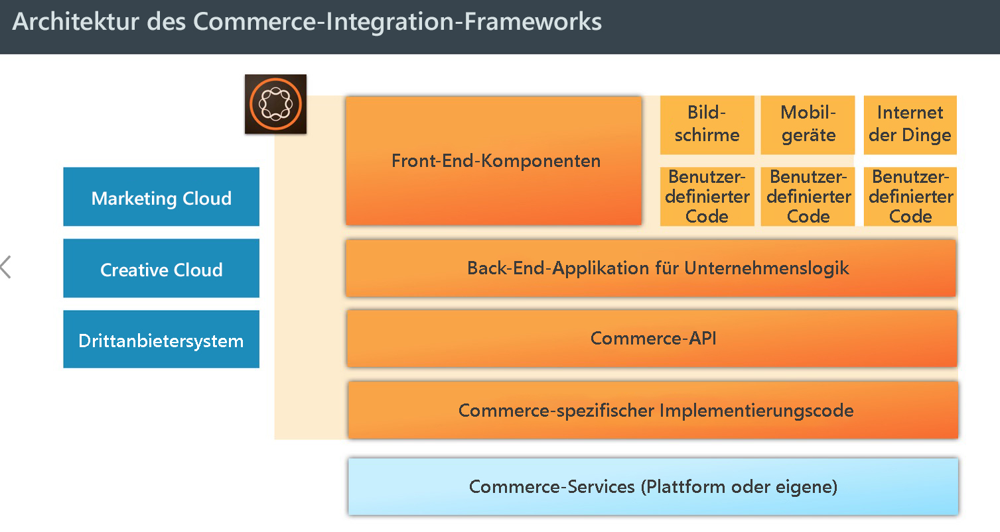
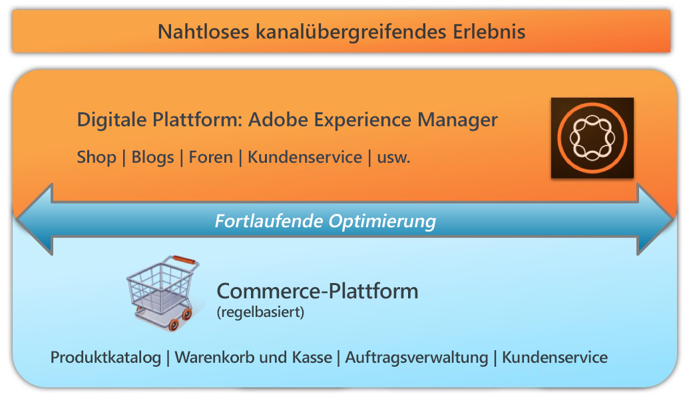

# AEM Commerce – Einhaltung der Datenschutz-Grundverordnung{#aem-commerce-gdpr-readiness}

>[!IMPORTANT]
>
>GDPR wird als Beispiel in den folgenden Abschnitten verwendet, aber die betreffenden Details gelten für alle Datenschutz- und Datenschutzbestimmungen. wie GDPR, CCPA usw.

Die Datenschutz-Grundverordnung der Europäischen Union ist seit Mai 2018 in Kraft. Weitere Informationen finden Sie auf der [DSGVO-Seite im Datenschutzzentrum von Adobe](https://www.adobe.com/de/privacy/general-data-protection-regulation.html).

>[!NOTE]
>
>Weitere Details hierzu finden Sie unter [Einhaltung der Datenschutz-Grundverordnung mit AEM](/help/managing/data-protection-and-privacy.md).

Bei unseren gebrauchsfertigen Commerce-Integrationen bildet AEM die Ebene für das Kundenerlebnis, auf der Dienste genutzt und Daten zurück an die an Kunden gerichtete Commerce-Plattform übermittelt werden, die in einem Headless-Modus ausgeführt wird.

Bei einigen Commerce-Plattformen speichern wir Profil-Informationen ( `/home/users`) und Commerce-Token (um sich auf der Commerce-Plattform anzumelden) in AEM. Informationen zu diesen Nutzungsszenarien finden Sie unter [Handhabung von DSGVO-bezogenen Anfragen mit der AEM-Plattform](/help/sites-administering/handling-gdpr-requests-for-aem-platform.md).

## Handhabung von DSGVO-bezogenen Anfragen in AEM Commerce {#handling-gdpr-requests-for-aem-commerce}

Im Rahmen der Integration mit der Salesforce Commerce Cloud speichert AEM Commerce keine in Bezug auf die DSGVO relevanten Informationen. Übermitteln Sie entsprechende Anfragen an die [Salesforce Cloud](https://documentation.demandware.com/).

Für die hybris- und IBM WebSphere-Integrationen gibt es einige Daten in AEM. Konsultieren Sie hierzu die [Anweisungen bezüglich der Einhaltung der DSGVO mit der AEM-Plattform](/help/sites-administering/handling-gdpr-requests-for-aem-platform.md) und berücksichtigen Sie dabei folgenden Fragen:

1. **Wo werden die Daten gespeichert/verwendet?** Informationen zu zwischengespeicherten Benutzerdaten wie Profil, Commerce-Benutzerkennung, Token, Kennwort, Adressdaten usw. werden aus AEM angezeigt.
1. **An wen werden die in Bezug auf die DSGVO relevanten Daten weitergeben?** Jegliche in Bezug auf die DSGVO relevanten Daten, die in AEM Commerce aktualisiert werden, werden nicht gespeichert (mit Ausnahme relevanter Profilinformationen, wie oben beschrieben), jedoch mittels Proxy zurück an die Commerce-Plattform übermittelt.
1. **Wie lösche ich die Benutzerdaten?** Löschen Sie das Benutzerprofil in AEM und rufen Sie die Funktion zum Löschen von Benutzern auf der Commerce-Plattform auf.

>[!NOTE]
>
>Konsultieren Sie bei Bedarf die [hybris Wiki](https://wiki.hybris.com/) oder die [Dokumentation zu Websphere Commerce](https://www-01.ibm.com/support/docview.wss?uid=swg27036450).

