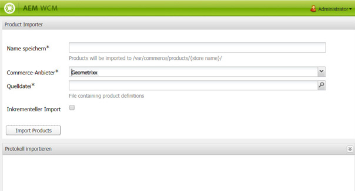
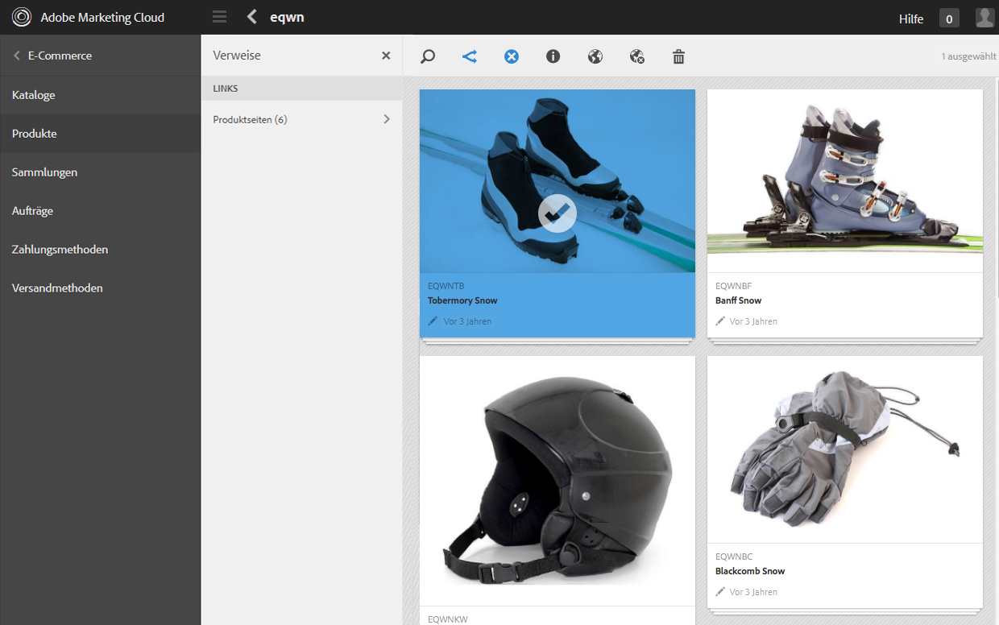
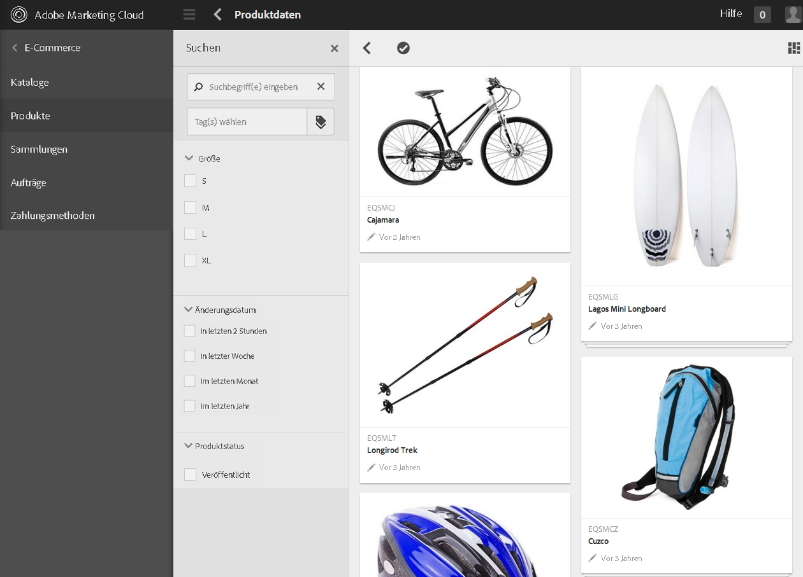
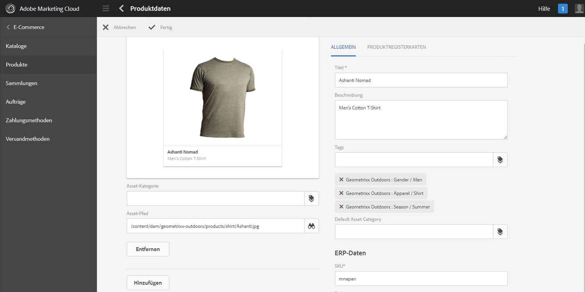
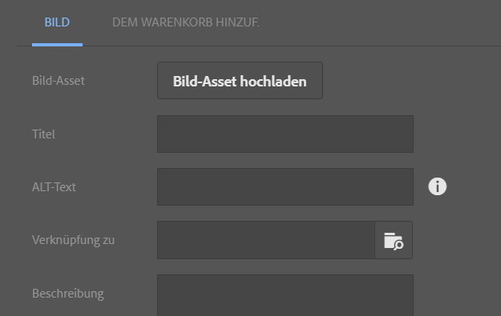
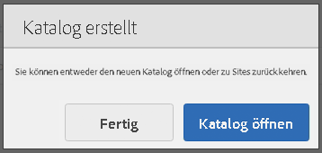
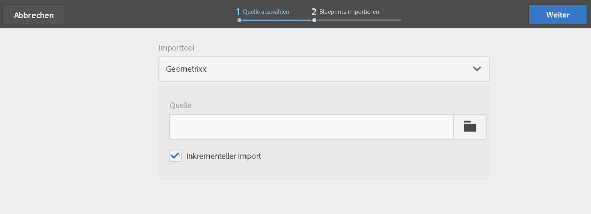

# Verwalten von generischem eCommerce {#administering-generic-ecommerce}

Die generische AEM-Lösung verfügt über Methoden zum Verwalten der Commerce-Informationen, die im Repository gespeichert sind (im Gegensatz zur Verwendung einer externen eCommerce-Engine). Hierzu gehört Folgendes:

* [Produkte](/help/sites-administering/concepts.md#products)
* [Produktvarianten](/help/sites-administering/concepts.md#product-variants)
* [Kataloge](/help/sites-administering/concepts.md#catalogs)
* [Promotions](/help/sites-administering/concepts.md#promotions)
* [Gutscheine](/help/sites-administering/concepts.md#vouchers)
* [Bestellungen](/help/sites-administering/concepts.md#shopping-cart-and-orders)
* [Proxy-Seiten](/help/sites-administering/concepts.md#proxy-pages)

>[!NOTE]
>
>Die AEM-Standardinstallation umfasst die generische AEM-eCommerce-Implementierung (JCR).
>
>Sie dient derzeit zur Veranschaulichung bzw. als Grundlage für eine benutzerdefinierte Implementierung nach Ihren jeweiligen Anforderungen.

## Produkte und Produktvarianten {#products-and-product-variations}

>[!NOTE]
>
>Die folgenden Verfahren gelten sowohl für Produkte als auch für Produktvarianten.

Vor der Erstellung von Produkten müssen Sie eine [Strukturvorlage](/help/sites-authoring/scaffolding.md) definieren. Hiermit werden die Felder angegeben, die Sie zum Definieren der Produkte und deren Bearbeitung benötigen.

Für jeden Produkttyp ist eine separate Strukturvorlage erforderlich. Die Strukturvorlage ist einem Produkt jeweils wie folgt zugeordnet:

* path
* Produkt kann auf Strukturvorlage verweisen

>[!NOTE]
>
>Der Geometrixx-Outdoors-Store verfügt über nur einen Produkttyp (und somit auch nur eine Strukturvorlage):
>
>`/etc/scaffolding/geometrixx-outdoors`
>
>Der Geometrixx-Outdoors-Produkttyp ist aktiv unter:
>
>`/etc/commerce/products/geometrixx-outdoors`
>
>Sie können unter diesem Pfad eine neue Produktdefinition erstellen, ohne dass ein zusätzliches Setup erforderlich ist.

### Importieren von Produkten {#importing-products}

#### Importieren von Produkten – Touch-optimierte Benutzeroberfläche {#importing-products-touch-optimized-ui}

1. Navigieren Sie zur **Produktekonsole**; nutzen Sie dazu die Option **Commerce**.
1. Navigieren Sie in der **Produktekonsole** zum gewünschten Ort.
1. Verwenden Sie das Symbol **Produkte importieren**, um den Assistenten zu öffnen.

   

1. Geben Sie Folgendes an:

   * **Importtool**

      The importer for the specific [commerce provider](/help/sites-administering/concepts.md#commerce-providers), by default `Geometrixx`.

   * **Quelle**

      Die Datei, die importiert werden soll; Sie können den Browser verwenden, um eine Datei auszuwählen.

   * **Inkrementeller Import**

      Geben Sie an, ob es sich um einen inkrementellen Import handelt (im Gegensatz zum vollständigen Import).
   >[!NOTE]
   >
   >Der inkrementelle Import (des Beispiel-Importtools „geometrixx-outdoors“) erfolgt auf Produktebene.
   >
   >Ein angepasstes Importtool kann so definiert werden, dass es wie gewünscht ausgeführt wird.

1. Wählen Sie **Weiter**, um die Produkte zu importieren. Ein Protokoll mit den durchgeführten Aktionen wird angezeigt.

   >[!NOTE]
   >
   >Die Produkte werden an den aktuellen Ort importiert (bzw. relativ zu diesem Ort).

   >[!NOTE]
   >
   >Wenn Sie **Weiter** und **Zurück** mehrfach verwenden, werden die Produktdefinitionen wiederholt importiert. Da diese aber über dieselben SKUs verfügen, werden die im Repository vorhandenen Informationen einfach überschrieben.

1. Wählen Sie **Fertig**, um den Assistenten zu schließen.

#### Importieren von Produkten – klassische Benutzeroberfläche {#importing-products-classic-ui}

1. Verwenden Sie die **Tools-Konsole**, um den Ordner **Commerce** zu öffnen.
1. Doppelklicken Sie, um das **Produkt-Importtool** zu öffnen:

   

1. Geben Sie Folgendes an:

   * **Name speichern**

      Die Produkte werden in folgende Länder importiert:

      `/etc/commerce/products/<*store name*>/`

   * **Commerce-Anbieter**

      The importer for your [commerce provider](/help/sites-administering/concepts.md#commerce-providers); by default Geometrixx.

   * **Quelldatei**

      Der Speicherort im Repository der Datei, die importiert werden soll.

   * **Inkrementeller Import**

      Geben Sie an, ob es sich um einen inkrementellen Import handelt (im Gegensatz zum vollständigen Import).

1. Klicken Sie auf **Produkte importieren**.

### Erstellen von Produktinformationen {#creating-product-information}

>[!NOTE]
>
>Die standardmäßige Produktverwaltung ist einfach aufgebaut, da dies auch für die Geometrixx-Outdoors-Produktgruppe gilt. Die Komplexität basiert auf der [Strukturvorlage](/help/sites-authoring/scaffolding.md) des Produkts. Indem Sie Ihre eigene Strukturvorlage für ein Produkt verwenden, können Sie also eine anspruchsvollere Bearbeitung erzielen.

#### Erstellen von Produktinformationen – Touch-optimierte Benutzeroberfläche {#creating-product-information-touch-optimized-ui}

1. Navigieren Sie in der **Produktekonsole** (über **Commerce**) zum gewünschten Ort.
1. Verwenden Sie das Symbol **Erstellen**, um eine der folgenden Optionen zu wählen (je nach Struktur und Ort):

   * **Produkt erstellen**
   * **Produktvariante erstellen**
   

1. Der Assistent wird geöffnet. Verwenden Sie die Registerkarten **Allgemein** und **Produkt**, um die [Produktattribute](/help/sites-administering/concepts.md#product-attributes) für das neue Produkt bzw. die Produktvariante einzugeben.

   >[!NOTE]
   >
   >Für die Erstellung eines Produkts oder einer Variante sind mindestens Angaben für **Titel** und **SKU** erforderlich.

1. Wählen Sie **Erstellen** aus, um die Informationen zu speichern.

>[!NOTE]
>
>Viele Produkte werden in verschiedenen Farben und Größen angeboten. Informationen zum grundlegenden Produkt und zu den dazugehörigen Produktvarianten können über die **Produktekonsole** verwaltet werden.
>
>Produkte und ihre Varianten werden in einer Baumstruktur gespeichert, bei der die Produktinformationen oben und die Varianten darunter angeordnet sind (diese Struktur wird von der Benutzeroberfläche vorgegeben).

### Bearbeiten von Produktinformationen {#editing-product-information}

>[!NOTE]
>
>Produktbilder werden für geometrixx-outdoors vom folgenden Ort aus bereitgestellt:
>
>`/etc/commerce/products/...`
>
>Dies bedeutet, dass sie standardmäßig vom [Dispatcher](https://helpx.adobe.com/experience-manager/dispatcher/using/dispatcher-configuration.html) blockiert werden. Konfigurieren Sie dies also je nach Bedarf.

#### Bearbeiten von Produktinformationen – Touch-optimierte Benutzeroberfläche {#editing-product-information-touch-optimized-ui}

1. Navigieren Sie in der **Produktekonsole** (über **Commerce**) zu Ihren Produktinformationen.
1. Verwenden Sie eine der folgenden Optionen:

   * [Schnellaktionen](/help/sites-authoring/basic-handling.md#quick-actions)
   * [Auswahlmodus](/help/sites-authoring/basic-handling.md#navigating-and-selection-mode)
   Wählen Sie das Symbol **Produktdaten anzeigen**:

   

1. Die [Produktattribute](/help/sites-administering/concepts.md#product-attributes) werden angezeigt. Verwenden Sie die Optionen **Bearbeiten** und **Fertig**, um Änderungen vorzunehmen.

### Anzeigen von Produktverweisen {#showing-product-references}

#### Anzeigen von Produktverweisen – Touch-optimierte Benutzeroberfläche {#showing-product-references-touch-optimized-ui}

1. Navigieren Sie in der **Produktekonsole** (über **Commerce**) zu Ihren Produktinformationen.
1. Öffnen Sie die sekundäre Leiste für „Verweise“ mit dem folgenden Symbol:

   

1. Wählen Sie das gewünschte Produkt aus. Die sekundäre Leiste wird aktualisiert, um die verfügbaren Verweistypen anzuzeigen:

   

1. Klicken oder tippen Sie auf den Verweistyp (z. B. Produktseiten), um die Liste zu erweitern.
1. Wählen Sie einen bestimmten Verweis aus, um die Optionen anzuzeigen:

   * Zu Produktseite navigieren
   * Produktseite bearbeiten
   

### Nach Produkten suchen {#search-for-products}

1. Navigieren Sie zur **Produktekonsole**; nutzen Sie dazu die Option **Commerce**.
1. Öffnen Sie die sekundäre Leiste für „Suchen“ mit dem folgenden Symbol:

   

1. Es sind mehrere Facetten verfügbar, mit denen Sie nach Produkten suchen können. Sie können für eine Suche eine oder mehrere Facetten nutzen. Die gefundenen Produkte werden angezeigt:

   

1. Wenn Sie auf ein Produkt klicken oder tippen, wird es geöffnet. Sie können es auch veröffentlichen oder die Produktdaten anzeigen.

#### Erweitern der Suche {#extending-search}

Sie können eine vorhandene Facette ändern oder neue hinzufügen, indem Sie CRXDE Lite verwenden:

1. Navigieren Sie zu:

   `http://localhost:4502/crx/de/index.jsp#/libs/commerce/gui/content/products/aside/items/search/items/searchpanel/facets`

1. Beispielsweise können Sie die Größen ändern, die auf der Seite für die Produktsuche angezeigt werden. Click the `sizegroup` node.
1. Click `items` node, then click `propertypredicate` node.
1. You can modify the `propertyValues`. Beispielsweise können Sie XS oder XXL hinzufügen oder eine Größe entfernen.
1. Click **Save All** and navigate to the products search page. Ihre Änderungen sollten angezeigt werden.

### Mehrere Assets {#multiple-assets}

Sie können in der Produktkomponente mehrere Assets hinzufügen und dann das Asset angeben, das auf der Produktseite angezeigt wird.

>[!NOTE]
>
>Alle Schritte in Bezug auf mehrere Assets werden über die Touch-optimierte Benutzeroberfläche ausgeführt.

#### Hinzufügen mehrerer Assets {#adding-multiple-assets}

1. Navigieren Sie zur **Produktekonsole**; nutzen Sie dazu die Option **Commerce**.
1. Using the **Products** console, navigate to the required product.

   >[!NOTE]
   >
   >Sie müssen sich auf der Produktebene befinden, nicht auf der Variantenebene.

1. Klicken oder tippen Sie auf das Symbol **Produktdaten anzeigen** (per Auswahlmodus oder Schnellaktionen).
1. Klicken oder tippen Sie auf das Symbol „Bearbeiten“.
1. Führen Sie einen Bildlauf zu **Hinzufügen** durch.

   

1. Klicken oder tippen Sie auf **Hinzufügen**. Ein neuer Platzhalter für Assets wird angezeigt.
1. Durch Tippen/Klicken auf **Ändern **wird ein Dialogfeld geöffnet, in dem Sie ein Asset auswählen können.
1. Wählen Sie das Asset aus, das Sie hinzufügen möchten.

   >[!NOTE]
   >
   >Die auswählbaren Assets stammen aus [Assets](https://helpx.adobe.com/experience-manager/aem-previous-versions.html#assets).

1. Klicken oder tippen Sie auf das Symbol „Fertig“.

In Ihrer Produktkomponente sind jetzt zwei Assets gespeichert. Sie können konfigurieren, welches auf der Produktseite angezeigt wird. Hierfür wird ein Kategoriesystem verwendet. Zuerst müssen Sie den einzelnen Assets eine Kategorie hinzufügen:

1. Tap/click **View Product Data**.
1. Type an **Asset Category** under the assets, for example `cat1` and `cat2`.

   >[!NOTE]
   >
   >Sie können auch Tags für Kategorien verwenden.

1. Klicken oder tippen Sie auf das Symbol „Fertig“. Als Nächstes müssen Sie den [Rollout](#rolling-out-a-catalog) für Ihre Änderungen durchführen.

Die Assets in der Produktkomponente verfügen jetzt über eine Kategorie. Sie können auf drei unterschiedlichen Ebenen konfigurieren, welche Kategorie angezeigt wird:

* [Produktseite](#product-page)
* [Katalog](#catalog)
* [Produktekonsole](#products-console)

>[!NOTE]
>
>Wenn Sie keine Kategorien festlegen, wird auf der Produktseite das erste Asset angezeigt.

Der Ablauf zum Auswählen des angezeigten Bilds ist wie folgt:

1. Überprüfen Sie, ob für die Produktseite eine Kategorie festgelegt ist.
1. Wenn nicht, überprüfen Sie, ob für den Katalog eine Kategorie festgelegt ist.
1. Wenn nicht, überprüfen Sie, ob für die Produktekonsole eine Kategorie festgelegt ist.

>[!NOTE]
>
>Sie müssen sowohl für die Katalogebene als auch für die Ebene der Produktekonsole einen Rollout für Ihre Änderungen durchführen, damit die Änderungen übernommen werden und der Unterschied auf der Produktseite angezeigt wird.

#### Produktseite {#product-page}

1. Navigieren Sie zu Ihrer Produktseite.
1. Bearbeiten Sie die Produktkomponente mit der Option **Bearbeiten**.
1. Geben Sie die **Bildkategorie** ein, die Sie ausgewählt haben (z. B. `cat1`).
1. Klicken oder tippen Sie auf **Fertig**. Die Seite wird aktualisiert und das richtige Asset sollte angezeigt werden.

#### Katalog  {#catalog}

1. Navigieren Sie zu Ihrem Katalog.
1. Klicken oder tippen Sie auf **Eigenschaften anzeigen**.
1. Klicken oder tippen Sie auf **Bearbeiten**.
1. Tap/click the **Assets** tab.
1. Geben Sie die gewünschte **Produkt-Asset-Kategorie** ein.
1. Klicken oder tippen Sie auf **Fertig**.
1. Führen Sie für Ihre Änderungen den [Rollout](#rolling-out-a-catalog) durch.

#### Produktekonsole {#products-console}

1. Using the **Products** console, navigate to the required Product.
1. Tap/click **View Product Data**.
1. Klicken oder tippen Sie auf **Bearbeiten**.
1. Geben Sie eine **Standard-Asset-Kategorie** ein.
1. Klicken oder tippen Sie auf **Fertig**.
1. Führen Sie für Ihre Änderungen den [Rollout](#rolling-out-a-catalog) durch.

### Veröffentlichen und Rückgängigmachen der Veröffentlichung von Produktinformationen {#publishing-unpublishing-product-information}

#### Veröffentlichen und Rückgängigmachen der Veröffentlichung von Produktinformationen – Touch-optimierte Benutzeroberfläche {#publishing-unpublishing-product-information-touch-optimized-ui}

>[!NOTE]
>
>Häufig werden Produktinformationen über die Seiten veröffentlicht, die darauf verweisen. Wenn Sie beispielsweise Seite X veröffentlichen, die auf Produkt Y verweist, fragt AEM, ob Sie auch Produkt Y veröffentlichen möchten.
>
>In besonderen Fällen unterstützt AEM auch die Veröffentlichung direkt aus den Produktdaten.

1. Navigieren Sie in der **Produktekonsole** (über **Commerce**) zu Ihren Produktinformationen.
1. Verwenden Sie eine der folgenden Optionen:

   * [Schnellaktionen](/help/sites-authoring/basic-handling.md#quick-actions)
   * [Auswahlmodus](/help/sites-authoring/basic-handling.md#navigating-and-selection-mode)
   Wählen Sie je nach Bedarf das Symbol **Veröffentlichen** oder **Veröffentlichung rückgängig machen**:

    

   Die Produktinformationen werden entsprechend veröffentlicht oder die Veröffentlichung wird rückgängig gemacht.

### Produkt-Feed {#product-feed}

Die Search&amp;Promote-Integration ermöglicht Ihnen Folgendes:

* Verwenden der eCommerce-API, unabhängig von der zugrunde liegenden Repository-Struktur und Commerce-Plattform
* Nutzen der Index-Connector-Funktion von Search&amp;Promote zur Bereitstellung eines Produkt-Feeds im XML-Format
* Nutzen der Fernsteuerungsfunktion von Search&amp;Promote zur bedarfsabhängigen bzw. planmäßigen Durchführung von Anfragen des Produkt-Feeds
* Erstellen von Feeds für verschiedene Search&amp;Promote-Konten, konfiguriert als Cloud Service-Konfigurationen

Weitere Informationen finden Sie unter [Produkt-Feed](/help/sites-administering/product-feed.md).

### Ereignis-Handler für Produktaktualisierungen {#event-handler-for-product-updates}

Es ist ein Ereignis-Handler vorhanden, der ein Ereignis protokolliert, wenn ein Produkt oder eine Produktseite hinzugefügt, geändert oder gelöscht wird. Es gibt die folgenden OSGi-Ereignisse:

* `com/adobe/cq/commerce/pim/PRODUCT_ADDED`
* `com/adobe/cq/commerce/pim/PRODUCT_MODIFIED`
* `com/adobe/cq/commerce/pim/PRODUCT_DELETED`
* `com/adobe/cq/commerce/pim/PRODUCT_PAGE_ADDED`
* `com/adobe/cq/commerce/pim/PRODUCT_PAGE_MODIFIED`
* `com/adobe/cq/commerce/pim/PRODUCT_PAGE_DELETED`

For the `PRODUCT_*` events, the path points to the base product in `/etc/commerce/products`. For the `PRODUCT_PAGE_*` events, the path points to the `cq:Page` node.

You can look at them in the Web Console in OSGI events ( `/system/console/events`), for example:

>[!NOTE]
>
>Read also [Event handling in AEM](https://blogs.adobe.com/experiencedelivers/experience-management/event_handling_incq/). 

### Bild mit Links für Hinzufügen zum Warenkorb {#image-with-add-to-cart-links}

Die Komponente „Bild mit Links für Hinzufügen zum Warenkorb“ ermöglicht Ihnen das schnelle Hinzufügen eines Produkts zum Warenkorb, indem Sie einen Hotspot erstellen, der mit einem Produkt in einem Bild verknüpft ist.

Beim Klicken auf den Hotspot wird ein Dialogfeld geöffnet, in dem Sie die Größe und Menge für das Produkt auswählen können.

1. Navigieren Sie zu der Seite, auf der Sie die Komponente hinzufügen möchten.
1. Ziehen Sie die Komponente auf die Seite und legen Sie sie ab.
1. Ziehen Sie ein Bild aus dem [Asset-Browser](/help/sites-authoring/author-environment-tools.md#assets-browser) und legen Sie es in der Komponente ab.
1. Wählen Sie eine der folgenden Möglichkeiten:

   * Klicken Sie auf die Komponente und dann auf das Symbol Bearbeiten
   * Führen Sie einen langsamen Doppelklick aus.

1. Klicken Sie auf das Symbol für „Vollbild“.

   

1. Klicken Sie auf das Symbol „Launch-Karte“.

   

1. Klicken Sie auf eines der Formsymbole.

   

1. Ändern und verschieben Sie die Form wie gewünscht.
1. Klicken Sie auf die Form.
1. Wenn Sie auf das Symbol „Durchsuchen“ klicken, wird der [Asset-Wähler](../assets/search-assets.md#assetselector) geöffnet.

   >[!NOTE]
   >
   >Alternativ hierzu können Sie den Produktpfad auch direkt eingeben. Dieser muss sich auf der Produktebene befinden, nicht auf der Variantenebene.

   

1. Klicken Sie zweimal auf das Symbol „Bestätigen“ und dann auf die Option zum Beenden des Vollbildmodus.
1. Klicken Sie neben der Komponente auf einen freien Bereich der Seite. Die Seite sollte aktualisiert werden und auf Ihrem Bild sollte das folgende Symbol angezeigt werden:

   

1. Wechseln Sie in den Modus [Vorschau](/help/sites-authoring/editing-content.md#previewingpagestouchoptimizedui).
1. Klicken Sie auf den Hotspot „+“ A dialog opens where you can choose the size and quantity of the product you entered in **Path**.

   

1. Geben Sie eine Größe und eine Menge ein.
1. Klicken Sie auf die Schaltfläche „In den Warenkorb“. Das Dialogfeld wird geschlossen.
1. Navigieren Sie zu Ihrem Warenkorb. Das Produkt sollte darin enthalten sein.

#### Konfigurationsoptionen {#configuration-options}

Sie können konfigurieren, wie das Dialogfeld aussieht, wenn Sie auf den Hotspot klicken:

1. Klicken Sie auf die Komponente und auf das Symbol „Konfigurieren“.

   

1. Führen Sie einen Bildlauf nach unten durch. Die Registerkarte **In den Warenkorb** wird angezeigt.

   

1. Klicken Sie auf **In den Warenkorb**. Sie können zwischen drei Konfigurationsoptionen wählen.

   

1. Klicken Sie auf das Symbol „Fertig“.

## Kataloge {#catalogs}

### Generieren eines Katalogs {#generating-a-catalog}

#### Generieren eines Katalogs – Touch-optimierte Benutzeroberfläche {#generating-a-catalog-touch-optimized-ui}

>[!NOTE]
>
>Im Katalog wird auf Ihre Produktdaten verwiesen.

Generieren Sie wie folgt einen Katalog:

1. Öffnen Sie die Sites-Konsole (z. B. [http://localhost:4502/sites.html/content](http://localhost:4502/sites.html/content)).
1. Navigieren Sie zu der Position, an der Sie die neue Seite erstellen möchten.
1. Um die Optionsliste zu öffnen, verwenden Sie das Symbol **Erstellen**:

   

1. From the list select **Create Catalog**, the Create Catalog wizard will open.

   

1. Navigieren Sie zum gewünschten Katalog-Blueprint.
1. Klicken oder tippen Sie auf die Schaltfläche **Auswählen** und dann auf den gewünschten Katalog-Blueprint.
1. Klicken oder tippen Sie auf **Weiter**.

   

1. Type a **Title** and a **Name**.
1. Klicken oder tippen Sie auf die Schaltfläche **Erstellen**. Der Katalog wird erstellt und ein Dialogfeld wird geöffnet.

   

1. Wenn Sie auf die Schaltfläche **Fertig** klicken oder tippen, gelangen Sie wieder zur Sites-Konsole, in der der Katalog angezeigt wird.

   Tapping/clicking **Open Catalog** button opens your catalog (for example `http://localhost:4502/editor.html/content/test-catalog.html`).

#### Generieren eines Katalogs – klassische Benutzeroberfläche {#generating-a-catalog-classic-ui}

>[!NOTE]
>
>Im Katalog wird auf Ihre [Produktdaten](#products-and-product-variants) verwiesen.

1. Navigieren Sie über die **Websites-Konsole** zu Ihrem **Katalog-Blueprint** und dann zum Basiskatalog.

   Beispiel:

   `http://localhost:4502/siteadmin#/content/catalogs/geometrixx-outdoors/base-catalog`

1. Erstellen Sie mit der Vorlage **Bereichs-Blueprint** eine neue Seite.

   Beispiel, `Swimwear`.

1. Öffnen Sie die neue Seite `Swimwear` und klicken Sie dann auf **Blueprint bearbeiten**, um das Dialogfeld **Eigenschaften** zu öffnen, in dem Sie die Auswahl **Produkte** einrichten können.

   Öffnen Sie beispielsweise das Feld **Tags/Stichworte**, um „Aktivität“ und im Bereich „Geometrixx-Outdoors“ dann „Swimming“ zu wählen.

1. Klicken Sie auf **OK**, um Ihre Eigenschaften zu speichern. Beispielprodukte werden auf der Blueprint-Seite unter **Produktauswahlkriterien** angezeigt.
1. Klicken Sie auf **Rollout-Änderungen...**, wählen Sie die Option **Rollout-Seite und alle Unterseiten** und klicken Sie dann auf **Weiter** und **Rollout**. Nachdem der Rollout erfolgreich abgeschlossen wurde, wird als **Status** die Farbe Grün angezeigt.
1. Sie können jetzt auf **Schließen** klicken und den neuen Katalogbereich überprüfen, z. B. unter:

   `http://localhost:4502/cf#/content/geometrixx-outdoors/en/swimwear.html`

1. Klicken Sie ebenfalls auf der Blueprint-Seite auf **Blueprint bearbeiten** und öffnen Sie im Dialogfeld **Eigenschaften** die Registerkarte **Erzeugte Seite**. Wählen Sie im Banner-Listenfeld das gewünschte Bild aus, z. B. `summer.jpg`.
1. Klicken Sie auf **OK**, um Ihre Eigenschaften zu speichern. Banner-Informationen werden auf der Blueprint-Seite unter **Produktauswahlkriterien** angezeigt.
1. Führen Sie den Rollout für diese neuen Änderungen durch.

### Durchführen des Rollouts für einen Katalog {#rolling-out-a-catalog}

#### Durchführen des Rollouts für einen Katalog – Touch-optimierte Benutzeroberfläche {#rolling-out-a-catalog-touch-optimized-ui}

Führen Sie den Rollout für einen Katalog wie folgt durch:

1. Navigate to the **Catalogs** console, via **Commerce**.
1. Navigieren Sie zu dem Katalog, für den Sie den Rollout durchführen möchten.
1. Verwenden Sie eine der folgenden Optionen:

   * [Schnellaktionen](/help/sites-authoring/basic-handling.md#quick-actions)
   * [Auswahlmodus](/help/sites-authoring/basic-handling.md#navigating-and-selection-mode)
   Wählen Sie das Symbol **Rollout-Änderungen**:

   

1. In the wizard, set the rollout as needed and then tap/click **Rollout Changes**.
1. Ein Dialogfeld wird geöffnet. Tap/click **Done** when the process is finished.

#### Durchführen des Rollouts für einen Katalog – klassische Benutzeroberfläche {#rolling-out-a-catalog-classic-ui}

Führen Sie den Rollout für einen Katalog wie folgt durch:

1. Navigieren Sie zum Katalog, den Sie aktualisieren möchten. Beispiel:

   `http://localhost:4502/cf#/content/catalogs/geometrixx-outdoors/base-catalog.html`

1. Klicken Sie auf **Rollout-Änderungen...**.
1. Legen Sie den Rollout wie gewünscht fest.
1. Klicken Sie auf **Rollout**.

### Blueprint-Importtool {#blueprint-importer}

#### Blueprint-Importtool – Touch-optimierte Benutzeroberfläche {#blueprint-importer-touch-optimized-ui}

1. Navigate to the **Catalogs** console, via **Commerce**.
1. Navigieren Sie zu dem Ort, an den Sie den Katalog-Blueprint importieren möchten.
1. Klicken oder tippen Sie auf das Symbol **Blueprints importieren**.

   

1. Wählen Sie im Assistenten je nach Bedarf die Quelle aus und klicken oder tippen Sie auf **Weiter**.

   

1. Klicken oder tippen Sie auf **Fertig**, nachdem der Importvorgang abgeschlossen ist.

#### Blueprint-Importtool – klassische Benutzeroberfläche {#blueprint-importer-classic-ui}

1. Using the **Tools** console, navigate to **Commerce**.

   Beispiel:

   `http://localhost:4502/miscadmin#/etc/commerce`

1. Öffnen Sie das **Katalog-Blueprint-Importtool**.
1. Legen Sie den Import wie gewünscht fest.
1. Klicken Sie auf **Katalog-Blueprints importieren**.

## Promotions {#promotions}

### Erstellen einer Promotion {#creating-a-promotion}

#### Erstellen einer Promotion – klassische Benutzeroberfläche {#creating-a-promotion-classic-ui}

>[!NOTE]
>
>Im folgenden Beispiel geht es um eine Promotion, die direkter Teil einer [Kampagne](/help/sites-classic-ui-authoring/classic-personalization-campaigns.md) ist. Dies wird für Gutscheine verwendet.
>
>Eine Promotion kann innerhalb einer Kampagne auch Teil einer [Erfahrung](/help/sites-authoring/personalization.md) sein.
>
>Weitere Informationen finden Sie unter [Promotions und Gutscheine](#promotions-and-vouchers).

1. Öffnen Sie die **Websites-Konsole** Ihrer Autoreninstanz.
1. Wählen Sie im linken Bereich Ihre gewünschte **Kampagne**.
1. Klicken Sie auf **Neu**, wählen Sie die Vorlage **Promotion** aus und geben Sie dann einen **Titel** (und ggf. einen **Namen**) für Ihren neuen Gutschein an.
1. Klicken Sie auf **Erstellen**. Die neue Promotion-Seite wird im rechten Bereich angezeigt.

1. Bearbeiten Sie die **Eigenschaften**, indem Sie eine der folgenden Möglichkeiten wählen:

   * Öffnen Sie die Seite und klicken Sie dann auf die Schaltfläche „Bearbeiten“, um das Dialogfeld „Eigenschaften“ zu öffnen.
   * Wählen Sie die Seite in der Websites-Konsole aus, wählen Sie über das Kontextmenü (normalerweise mit der rechten Maustaste) die Option **Eigenschaften...** und öffnen Sie das Dialogfeld „Eigenschaften“.
   Geben Sie je nach Bedarf Werte für **Promotion-Typ**, **Rabatttyp**, **Rabattwert** und alle anderen gewünschten Felder an.

1. Klicken Sie zum Speichern auf **OK**.

1. Sie können Ihre Promotion jetzt aktivieren, damit sie für Käufer auf der Veröffentlichungsinstanz angezeigt wird.

## Gutscheine {#vouchers}

### Erstellen eines Gutscheins {#creating-a-voucher}

#### Erstellen eines Gutscheins – klassische Benutzeroberfläche {#creating-a-voucher-classic-ui}

1. Öffnen Sie die **Websites-Konsole** Ihrer Autoreninstanz.
1. Wählen Sie im linken Bereich Ihre gewünschte **Kampagne**.
1. Klicken Sie auf **Neu**, wählen Sie die Vorlage **Gutschein** aus und geben Sie dann einen **Titel** (und einen **Namen**, falls erforderlich) für Ihren neuen Gutschein an.
1. Klicken Sie auf **Erstellen**. Die neue Gutscheinseite wird im rechten Bereich angezeigt.

1. Öffnen Sie Ihre neue Gutscheinseite per Doppelklick und klicken Sie dann auf **Bearbeiten**, um die Informationen wie gewünscht zu konfigurieren.
1. Klicken Sie zum Speichern auf **OK**.

1. Sie können Ihren Gutschein jetzt aktivieren, damit er von Käufern auf der Veröffentlichungsinstanz im Warenkorb verwendet werden kann.

### Entfernen von Gutscheinen {#removing-vouchers}

#### Entfernen von Gutscheinen – klassische Benutzeroberfläche {#removing-vouchers-classic-ui}

Sie haben folgende Möglichkeiten, wenn Sie einen Gutschein für Kunden entfernen möchten:

* Deaktivieren Sie den Gutschein. Er bleibt in der Autorenumgebung verfügbar, damit Sie ihn später wieder aktivieren können.
* Löschen Sie ihn vollständig.

Sie können beide Aktionen über die **Websites-Konsole** durchführen.

### Ändern von Gutscheinen {#modifying-vouchers}

#### Ändern von Gutscheinen – klassische Benutzeroberfläche {#modifying-vouchers-classic-ui}

Zum Ändern der Eigenschaften eines Gutscheins oder einer Promotion können Sie in der **Websites-Konsole** darauf doppelklicken und dann auf **Bearbeiten** klicken. Nach dem Speichern sollten Sie die Aktivierung durchführen, damit die Änderungen auf die Veröffentlichungsinstanz(en) übertragen werden.

### Hinzufügen von Gutscheinen zu einem Warenkorb {#adding-vouchers-to-a-cart}

Sie können die integrierte Komponente **Gutscheine** (Kategorie „Commerce“) verwenden, um für Benutzer das Hinzufügen von Gutscheinen zu ermöglichen. Sie müssen sie derselben Seite hinzufügen, auf der auch der Warenkorb angezeigt wird (die Nutzung ist aber nicht obligatorisch). Die Komponente „Gutscheine“ umfasst lediglich ein Formular, in das Benutzer einen Gutscheincode eingeben können. Es ist die Warenkorb-Komponente, in der die Liste mit den angewendeten Gutscheinen und den dazugehörigen Rabatten angezeigt wird.

Auf der Demo-Website (Geometrixx Outdoors – Englisch) ist das Gutscheinformular auf der Warenkorb-Seite unter dem eigentlichen Warenkorb dargestellt.

## Bestellungen {#orders}

>[!NOTE]
>
>Beachten Sie Folgendes: Im Lieferzustand verfügt AEM nicht über Aktionen, die für standardmäßige Funktionen für Bestellungen erforderlich sind, z. B. Warenrückgabe, Aktualisierung des Bestellstatus, Bestellabwicklung, Generierung von Lieferscheinen. Der Hauptzweck ist die Technologievorschau.
>
>Die allgemeine Auftragsverwaltung in AEM wurde grundlegend beibehalten. Die im Assistenten verfügbaren Felder hängen von der Gerüste ab:
>`/etc/scaffolding/geometrixx-outdoors/order/jcr:content/cq:dialog`
>
>Wenn Sie eine angepasste Strukturvorlage erstellen, können Sie mehr Bestellinformationen speichern.

>[!NOTE]
>
>In der Auftragskonsole werden die Bestellinformationen des Anbieters verfügbar gemacht, die niemals veröffentlicht werden.
>
>Die Bestellinformationen der Kunden werden jeweils in ihren Home-Verzeichnissen vorgehalten und über den „Auftragsverlauf“ für ihr Konto verfügbar gemacht. Diese Informationen werden zusammen mit den restlichen Daten des Home-Verzeichnisses veröffentlicht.

### Erstellen von Bestellinformationen {#creating-order-information}

#### Erstellen von Bestellinformationen – Touch-optimierte Benutzeroberfläche {#creating-order-information-touch-optimized-ui}

1. Navigieren Sie in der **Auftragskonsole** zum gewünschten Ort.
1. Verwenden Sie das Symbol **Erstellen**, um die Option **Auftrag erstellen** zu wählen.

   

1. Der Assistent wird geöffnet. Verwenden Sie die Registerkarten **Allgemein**, **Inhalt**, **Zahlung** und **Erfüllung**, um die [Informationen zur neuen Bestellung](/help/sites-administering/concepts.md#order-information) einzugeben.

1. Wählen Sie **Erstellen** aus, um die Informationen zu speichern.

### Bearbeiten von Bestellinformationen {#editing-order-information}

#### Bearbeiten von Bestellinformationen – Touch-optimierte Benutzeroberfläche {#editing-order-information-touch-optimized-ui}

1. Verwenden Sie die **Auftragskonsole**, um zur Bestellung zu navigieren.
1. Verwenden Sie eine der folgenden Optionen:

   * [Schnellaktionen](/help/sites-authoring/basic-handling.md#quick-actions)
   * [Auswahlmodus](/help/sites-authoring/basic-handling.md#navigating-and-selection-mode)
   Wählen Sie das Symbol **Auftragsdaten anzeigen**:

   

1. Die [Bestellinformationen](/help/sites-administering/concepts.md#order-information) werden angezeigt. Verwenden Sie die Optionen **Bearbeiten** und **Fertig**, um Änderungen vorzunehmen.

