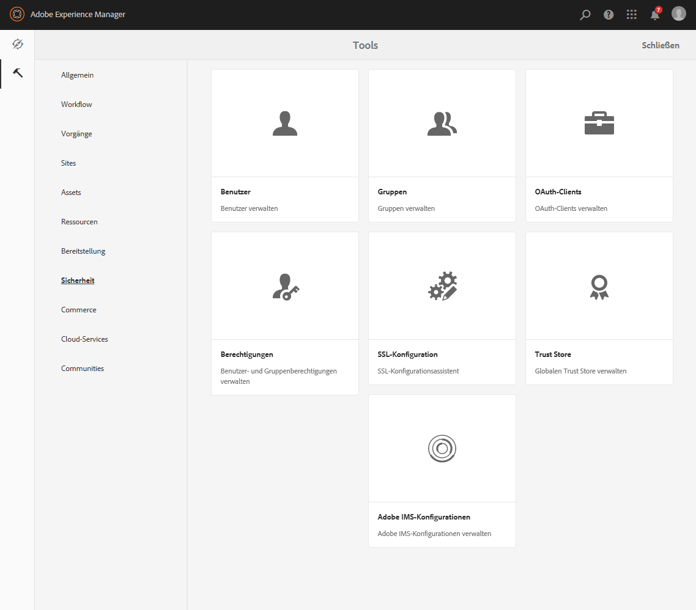
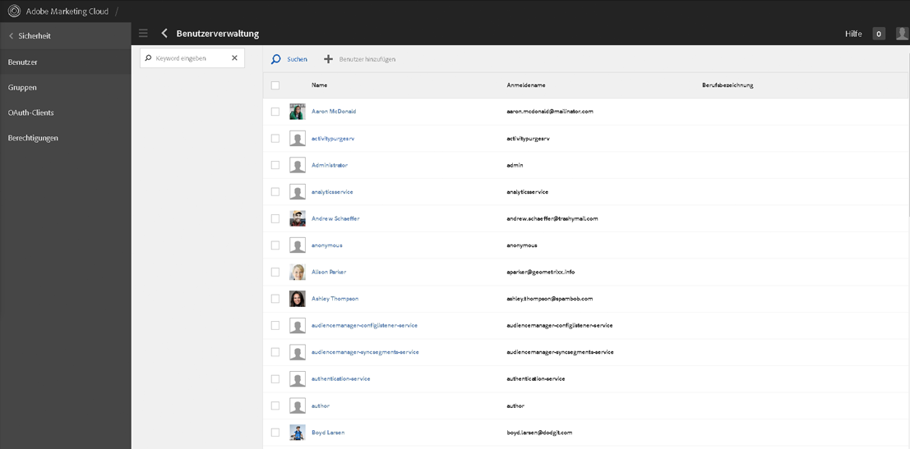
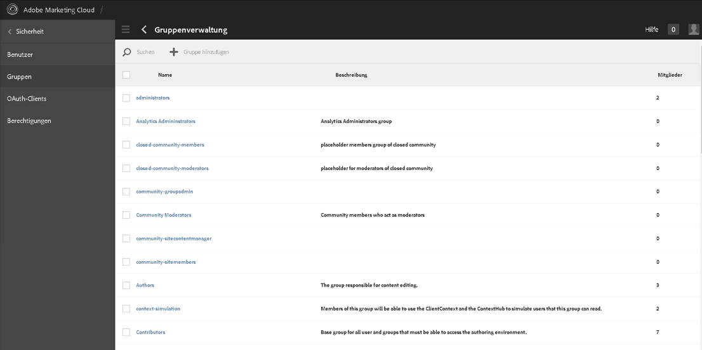
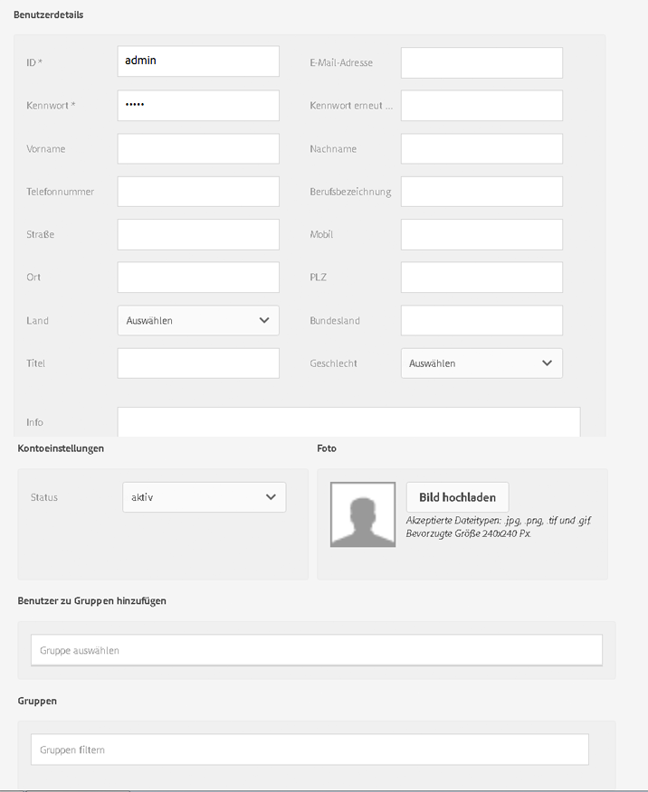
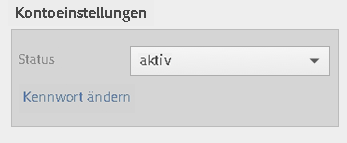
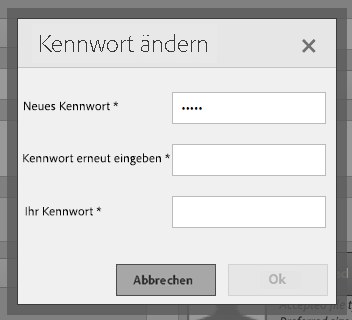
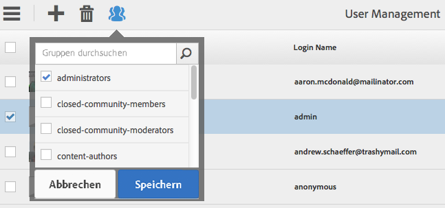
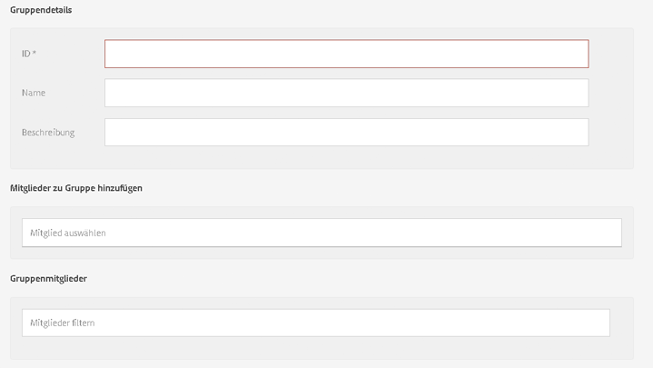

# Granite-Vorgänge – Benutzer- und Gruppenverwaltung{#granite-operations-user-and-group-administration}

Da Granite die CRX-Repository-Implementierung der JCR-API-Spezifikation umfasst, verfügt es über eine eigene Benutzer- und Gruppenverwaltung.

Diese Konten bilden die Grundlage für die [AEM Konten](/help/sites-administering/security.md) und alle mit der Granite-Verwaltung vorgenommenen Kontoänderungen werden angezeigt, wenn/wenn auf die Konten über die [AEM Benutzerkonsole](/help/sites-administering/security.md#accessing-user-administration-with-the-security-console) zugegriffen wird (z. B. `http://localhost:4502/useradmin`). Über die AEM-Benutzerkonsole können Sie auch Rechte und andere AEM-Eigenschaften verwalten.

Die Konsolen für die Benutzer- und Gruppenverwaltung sind jeweils über die **[Tools-Konsole](/help/sites-administering/tools-consoles.md)** der Touch-optimierten Benutzeroberfläche verfügbar:

Durch Auswahl von **Benutzer** oder **Gruppen** in der Tools-Konsole wird die entsprechende Konsole geöffnet. In beiden können Sie Aktionen durchführen, indem Sie entweder das Kontrollkästchen und dann Aktionen aus der Symbolleiste verwenden oder indem Sie die Kontodetails über den Link unter **Name** aufrufen.

* [Benutzerverwaltung](#user-administration)

   

   In der **Benutzerkonsole** finden Sie:

   * den Benutzernamen;
   * den Anmeldenamen (Kontonamen) des Benutzers;
   * Titel, die dem Konto zugewiesen wurden.

* [Gruppenverwaltung](#group-administration)

   

   In der **Gruppenkonsole** finden Sie:

   * den Gruppennamen;
   * die Gruppenbeschreibung;
   * die Anzahl der Benutzer/Gruppen in der Gruppe.

## Benutzerverwaltung {#user-administration}

### Hinzufügen neuer Benutzer {#adding-a-new-user}

1. Verwenden Sie das Symbol **Benutzer hinzufügen**:

   

1. Das Formular **Benutzer erstellen** wird geöffnet:

   

   Hier können Sie die Benutzerdetails für das Konto eingeben (die meisten entsprechen dem Standard und sind selbsterklärend):

   * **ID**

      Dies ist die eindeutige Kennung des Benutzerkontos. Diese Angabe ist obligatorisch und darf keine Leerzeichen enthalten.

   * **E-Mail-Adresse**
   * **Kennwort**

      Ein Kennwort ist obligatorisch.

   * **Kennwortwdh.**

      Dies ist obligatorisch, da dies für die Bestätigung des Kennworts erforderlich ist.

   * **Vorname**
   * **Nachname**
   * **Telefonnummer**
   * **Berufsbezeichnung**
   * **Straße**
   * **Mobilgerät**
   * **Stadt**
   * **PLZ**
   * **Land**
   * **Bundesland/Kanton**
   * **Titel**
   * **Geschlecht**
   * **Info**
   * **Kontoeinstellungen**

      * ****
StatusSie können das Konto entweder als 
**** aktiviert oder  **inaktiv**.
   * **Foto**

      Hier können Sie ein Foto hochladen, um es als Avatar zu verwenden.

      Akzeptierte Dateitypen: `.jpg .png .tif .gif`

      Bevorzugte Größe: `240x240px`

   * **Benutzer zu Gruppen hinzufügen**

      Verwenden Sie das Dropdown-Menü Auswahl , um Gruppen auszuwählen, denen der Benutzer angehören soll. Vor dem Speichern können Sie ggf. eine getroffene Auswahl mit dem **X** neben dem Namen aufheben.

   * **Gruppen**

      Eine Liste der Gruppen, denen der Benutzer derzeit angehört. Vor dem Speichern können Sie eine getroffene Auswahl mit dem **X** neben dem Namen aufheben.

1. Wählen Sie eine der folgenden Optionen aus, nachdem Sie das Benutzerkonto definiert haben:

   * **Abbrechen** zum Abbruch der Registrierung.
   * **Speichern** zum Abschluss der Registrierung. Die Erstellung des Benutzerkontos wird mit einer Meldung bestätigt.

### Bearbeiten vorhandener Benutzer {#editing-an-existing-user}

1. Rufen Sie die Benutzerdetails über den Link unterhalb des Benutzernamens in der Benutzer-Konsole auf.

1. Sie können nun die Details wie unter [Hinzufügen neuer Benutzer](#adding-a-new-user) bearbeiten.

1. Rufen Sie die Benutzerdetails über den Link unterhalb des Benutzernamens in der Benutzer-Konsole auf.

1. Sie können nun die Details wie unter [Hinzufügen neuer Benutzer](#adding-a-new-user) bearbeiten.

### Ändern von Kennwörtern vorhandener Benutzer {#changing-the-password-for-an-existing-user}

1. Rufen Sie die Benutzerdetails über den Link unterhalb des Benutzernamens in der Benutzer-Konsole auf.

1. Sie können nun die Details wie unter [Hinzufügen neuer Benutzer](#adding-a-new-user) bearbeiten. Unter **Kontoeinstellungen** ist ein Link **Kennwort ändern** vorhanden.

   

1. Das Dialogfeld **Kennwort ändern** wird geöffnet. Geben Sie das neue Kennwort, die Kennwortwiederholung und Ihr Kennwort ein. Bestätigen Sie die Änderungen mit **OK**.

   

   Über eine Meldung wird bestätigt, dass das Kennwort geändert wurde.

### Schnelle Gruppenzuweisung {#quick-group-assignment}

1. Verwenden Sie das Kontrollkästchen, um einen oder mehrere Benutzer zu kennzeichnen.
1. Verwenden Sie das Symbol **Gruppen**:

   

   Hierdurch wird die Dropdown-Liste für die Gruppenauswahl geöffnet:

   

1. Im Auswahlfeld können Sie per Aus-/Abwahl festlegen, welchen Gruppen das Benutzerkonto angehören soll.

1. Wählen Sie eine der folgenden Optionen aus, nachdem Sie die Gruppen zugewiesen oder deren Zuweisung aufgehoben haben:

   * **Abbrechen** zum Verwerfen der Änderungen
   * **Speichern** zum Bestätigen der Änderungen

### Löschen vorhandener Benutzerdetails {#deleting-existing-user-details}

1. Verwenden Sie das Kontrollkästchen, um einen oder mehrere Benutzer zu kennzeichnen.
1. Löschen Sie Benutzerdetails mit dem Symbol **Löschen**:

   

1. Sie werden zum Bestätigen des Löschvorgangs aufgefordert. Daraufhin wird über eine Meldung bestätigt, dass der Löschvorgang tatsächlich durchgeführt wurde.

## Gruppenverwaltung {#group-administration}

### Hinzufügen neuer Gruppen {#adding-a-new-group}

1. Verwenden Sie das Symbol „Gruppe hinzufügen“:

   

1. Das Formular **Gruppe erstellen** wird geöffnet:

   

   Hier können Sie die Gruppendetails eingeben:

   * **ID**

      Dies ist die eindeutige Kennung der Gruppe. Diese Angabe ist obligatorisch und darf keine Leerzeichen enthalten.

   * **Name**

      Der Name für die Gruppe; dieser wird in der Gruppenkonsole angezeigt.

   * **Beschreibung**

      Eine Beschreibung der Gruppe.

   * **Mitglieder zu Gruppe hinzufügen**

      Verwenden Sie das Dropdown-Menü Auswahl , um Benutzer auszuwählen, die der Gruppe hinzugefügt werden sollen. Vor dem Speichern können Sie ggf. eine getroffene Auswahl mit dem **X** neben dem Namen aufheben.

   * **Gruppenmitglieder**

      Eine Liste der Benutzer in der Gruppe. Vor dem Speichern können Sie eine getroffene Auswahl mit dem **X** neben dem Namen aufheben.

1. Wählen Sie eine der folgenden Optionen aus, nachdem Sie die Gruppe definiert haben:

   * **Abbrechen** zum Abbruch der Registrierung.
   * **Speichern** zum Abschluss der Registrierung. Die Erstellung der Gruppe wird mit einer Meldung bestätigt.

### Bearbeiten vorhandener Gruppen {#editing-an-existing-group}

1. Rufen Sie die Gruppendetails über den Link unterhalb des Gruppennamens in der Gruppenkonsole auf.

1. Sie können nun die Details wie unter [Hinzufügen neuer Gruppen](#adding-a-new-group) bearbeiten.

### Kopieren vorhandener Gruppen {#copying-an-existing-group}

1. Verwenden Sie das Kontrollkästchen, um eine Gruppe zu kennzeichnen.
1. Kopieren Sie Gruppendetails mit dem Symbol **Kopieren**:

   

1. Das Formular **Gruppeneinstellungen bearbeiten** wird geöffnet.

   Die Gruppen-ID entspricht der ursprünglichen, jedoch mit dem Präfix `Copy of`. Sie müssen die Kennung bearbeiten, da IDs keine Leerzeichen enthalten dürfen. Alle anderen Angaben bleiben gegenüber dem Original unverändert.

   Sie können nun die Details wie unter [Hinzufügen neuer Gruppen](#adding-a-new-group) bearbeiten.

### Löschen vorhandener Gruppen {#deleting-an-existing-group}

1. Verwenden Sie das Kontrollkästchen, um eine oder mehrere Gruppen zu kennzeichnen.
1. Löschen Sie Gruppendetails mit dem Symbol **Löschen**:

   

1. Sie werden zum Bestätigen des Löschvorgangs aufgefordert. Daraufhin wird über eine Meldung bestätigt, dass der Löschvorgang tatsächlich durchgeführt wurde.
