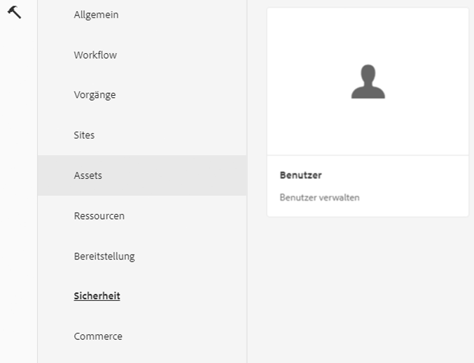
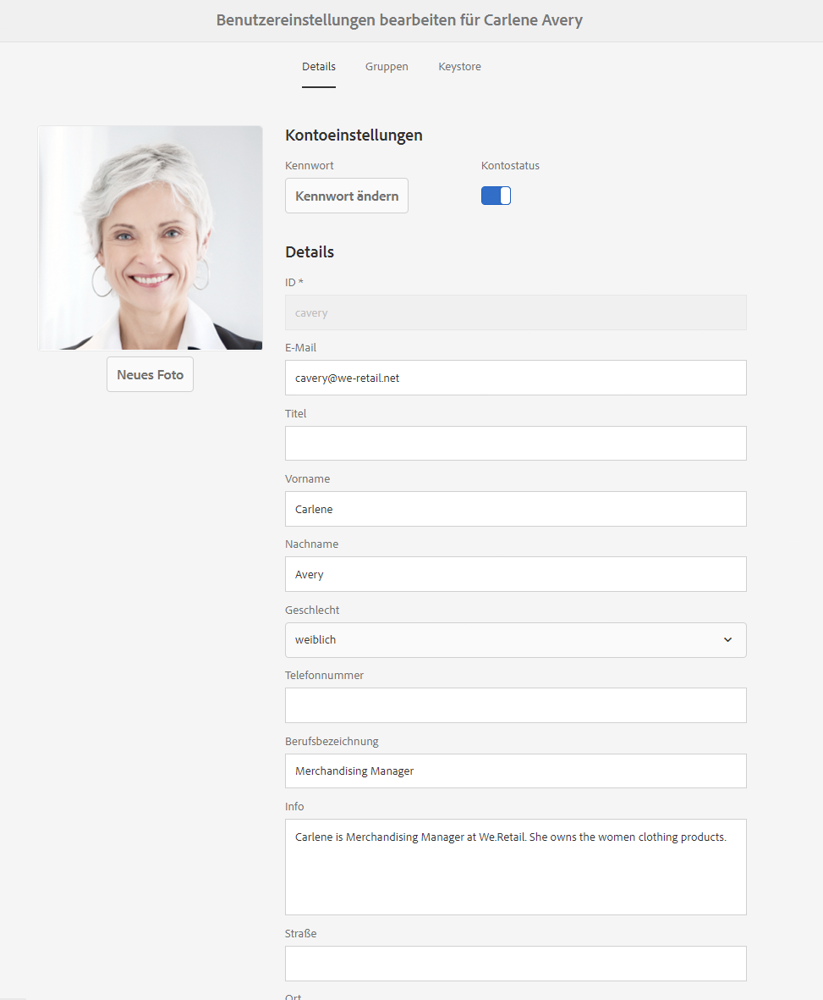
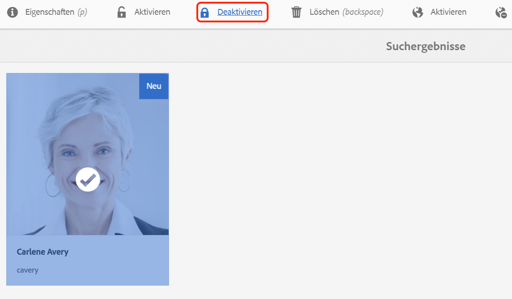
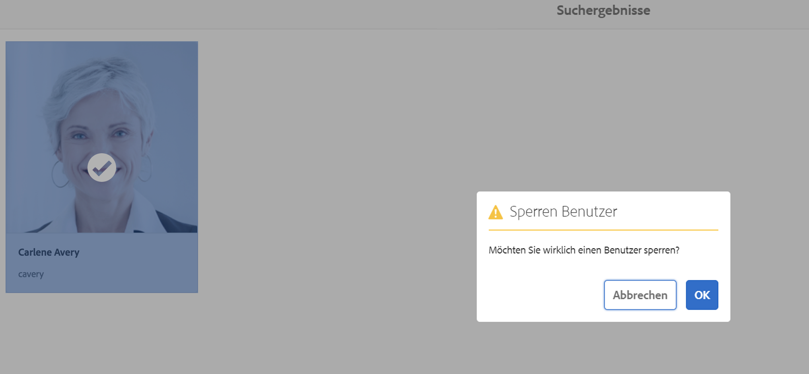
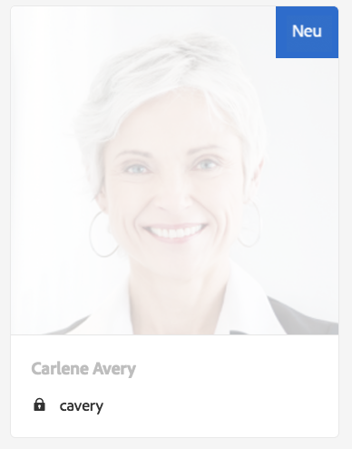
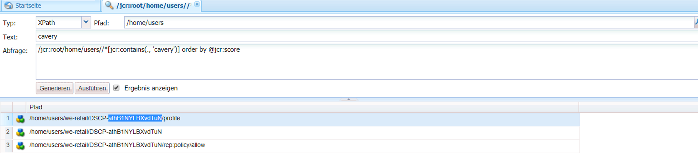
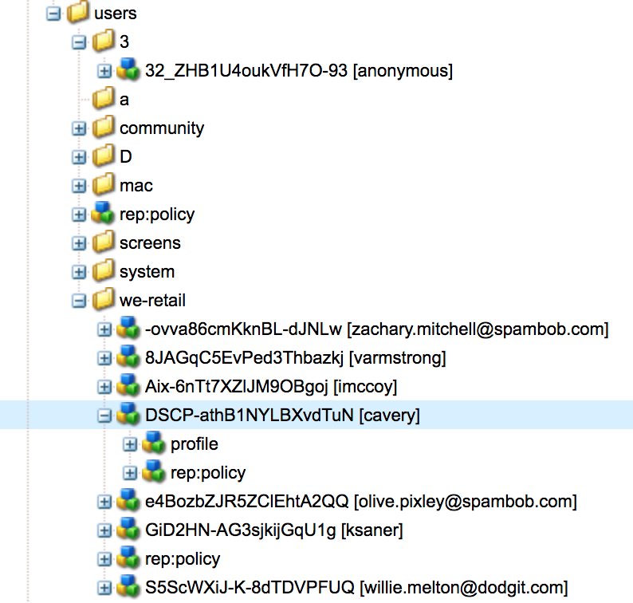
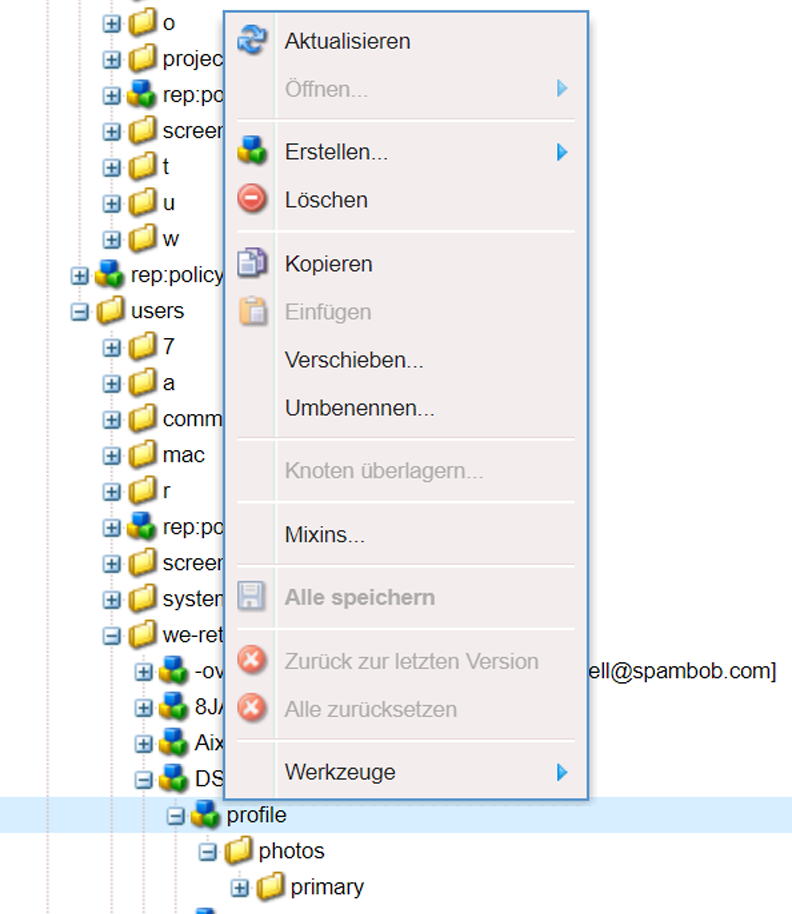

# Handhabung von DSGVO-bezogenen Anfragen in AEM Foundation{#handling-gdpr-requests-for-the-aem-foundation}

>[!IMPORTANT]
>
>GDPR wird als Beispiel in den folgenden Abschnitten verwendet, aber die betreffenden Details gelten für alle Datenschutz- und Datenschutzbestimmungen. wie GDPR, CCPA usw.

## AEM Foundation GDPR-Unterstützung {#aem-foundation-gdpr-support}

Auf AEM Foundation-Ebene sind die gespeicherten personenbezogenen Daten das User-Profil. Dementsprechend wird in diesem Artikel in erster Linie erläutert, wie der Zugriff auf und das Löschen von Benutzerprofilen erfolgt, um DSGVO-bezogene Anfragen zum Datenzugriff bzw. zur Datenlöschung handzuhaben.

## Zugreifen auf Benutzerprofile {#accessing-a-user-profile}

### Manuelle Schritte {#manual-steps}

1. Öffnen Sie die Konsole &quot;Benutzerverwaltung&quot;, indem Sie zu **[!UICONTROL Einstellungen - Sicherheit - Benutzer]** navigieren oder direkt zu `https://<serveraddress>:<serverport>/libs/granite/security/content/useradmin.html` navigieren.

   

1. Suchen Sie dann den jeweiligen Benutzer, indem Sie dessen Name in der Suchleiste oben auf der Seite eingeben:

   

1. Klicken Sie nun auf das Benutzerprofil, um es zu öffnen, und rufen Sie die Registerkarte **[!UICONTROL Details]** auf.

   

### HTTP-API {#http-api}

Wie bereits ausgeführt, bietet Adobe APIs, mit denen der Zugriff auf Benutzerdaten automatisiert werden kann. Es stehen verschiedene Arten von APIs zur Verfügung:

**UserProperties API**

```shell
curl -u user:password http://localhost:4502/libs/granite/security/search/profile.userproperties.json\?authId\=cavery
```

**Sling-API**

*Ermitteln der Benutzerstartseite:*

```xml
curl -g -u user:password 'http://localhost:4502/libs/granite/security/search/authorizables.json?query={"condition":[{"named":"cavery"}]}'
     {"authorizables":[{"type":"user","authorizableId_xss":"cavery","authorizableId":"cavery","name_xss":"Carlene Avery","name":"Carlene Avery","home":"/home/users/we-retail/DSCP-athB1NYLBXvdTuN"}],"total":1}
```

*Abrufen von Benutzerdaten*

Verwenden des Knotenpfads aus der Eigenschaft home der JSON-Payload, der vom oben genannten Befehl zurückgegeben wird:

```shell
curl -u user:password  'http://localhost:4502/home/users/we-retail/DSCP-athB1NYLBXvdTuN/profile.-1.json'
```

```shell
curl -u user:password  'http://localhost:4502/home/users/we-retail/DSCP-athB1NYLBXvdTuN/profiles.-1.json'
```

## Deaktivieren von Benutzern und Löschen der zugehörigen Profile {#disabling-a-user-and-deleting-the-associated-profiles}

### Benutzer deaktivieren {#disable-user}

1. Öffnen Sie die Konsole für die Benutzerverwaltung und suchen Sie nach dem entsprechenden Benutzer, wie oben beschrieben.
1. Bewegen Sie den Mauszeiger über den Benutzer und klicken Sie auf das Auswahlsymbol. Das ausgewählte Profil wird nun in grau angezeigt.

1. Klicken Sie auf die Schaltfläche „Deaktivieren“ im oberen Menü, um den Benutzer zu deaktivieren:

   

1. Bestätigen Sie die Aktion, um den Vorgang abzuschließen:

   

   Die Benutzeroberfläche weist dann darauf hin, dass der Profil deaktiviert wurde, indem er die Karte ausgrauert und eine Sperre hinzugefügt hat:

   

### Benutzerprofilinformationen löschen {#delete-user-profile-information}

1. Melden Sie sich bei CRXDE Lite an und suchen Sie dann nach dem `[!UICONTROL userId]`:

   

1. Öffnen Sie den Knoten &quot;user&quot;, der sich standardmäßig unter `[!UICONTROL /home/users]` befindet:

   

1. Löschen Sie die Profilknoten und die ihnen zugehörigen untergeordneten Elemente. Abhängig von der AEM-Version liegen die Profilknoten in zwei unterschiedlichen Formaten vor:

   1. Das standardmäßige private Profil unter `[!UICONTROL /profile]`
   1. `[!UICONTROL /profiles]`, für neue Profil, die mit AEM 6.5 erstellt wurden.

   

### HTTP-API {#http-api-1}

Die folgenden Verfahren verwenden das `curl` Befehlszeilenwerkzeug, um zu veranschaulichen, wie Benutzer mit der **[!UICONTROL Aufnahme]** deaktiviert und die entsprechenden Profile am Standardspeicherort gelöscht werden können `userId`.

* *Ermitteln der Benutzerstartseite*

```shell
curl -g -u user:password 'http://localhost:4502/libs/granite/security/search/authorizables.json?query={"condition":[{"named":"cavery"}]}'
     {"authorizables":[{"type":"user","authorizableId_xss":"cavery","authorizableId":"cavery","name_xss":"Carlene Avery","name":"Carlene Avery","home":"/home/users/we-retail/DSCP-athB1NYLBXvdTuN"}],"total":1}
```

* *Deaktivieren des Benutzers*

Verwenden des Knotenpfads aus der Eigenschaft home der JSON-Payload, der vom oben genannten Befehl zurückgegeben wird:

```shell
curl -X POST -u user:password -FdisableUser="describe the reasons for disabling this user (GDPR in this case)" 'http://localhost:4502/home/users/we-retail/DSCP-athB1NYLBXvdTuN.rw.userprops.html'
```

* *Löschen von Benutzerprofilen*

Verwenden des Knotenpfads aus der Eigenschaft home der JSON-Payload, der vom Befehl zur Kontosuche zurückgegeben wird, und der bekannten Out-of-the-Box-Profil-Knotenpunkte:

```shell
curl -X POST -u user:password -H "Accept: application/json,**/**;q=0.9" -d ':operation=delete' 'http://localhost:4502/home/users/we-retail/DSCP-athB1NYLBXvdTuN/profile'
```

```shell
curl -X POST -u user:password -H "Accept: application/json,**/**;q=0.9" -d ':operation=delete' 'http://localhost:4502/home/users/we-retail/DSCP-athB1NYLBXvdTuN/profile'
```

